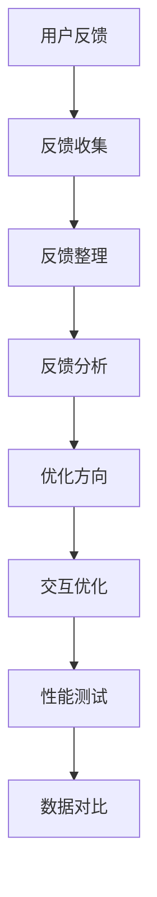

                 


### 第1章 问题背景与核心概念

#### 1.1 引言

##### 1.1.1 评测系统的重要性

评测系统是信息化管理中至关重要的一部分，它不仅能够有效提高工作流程的效率，还能为决策者提供科学、准确的数据支持。在现代企业和组织中，评测系统广泛应用于人力资源管理、项目评估、质量监控等多个领域。随着互联网技术的飞速发展，评测系统正逐渐向智能化、个性化方向演进，以满足日益复杂的工作需求。

##### 1.1.2 用户界面与交互设计的关键作用

用户界面（User Interface, UI）和交互设计（User Experience, UX）在评测系统中扮演着至关重要的角色。良好的用户界面设计能够提升用户体验，使用户在操作过程中感到舒适、自然；而优秀的交互设计则能够确保用户与系统之间的顺畅沟通，提高系统的可用性和易用性。具体来说，用户界面与交互设计的作用主要体现在以下几个方面：

1. **易用性**：界面设计应简洁直观，使操作流程简单易懂，降低用户的学习成本。
2. **一致性**：界面元素和交互行为应保持一致性，使用户在操作不同功能时能够形成自然的联想。
3. **反馈**：及时、清晰的反馈能够帮助用户了解系统状态，提高操作的安全性和信心。

#### 1.2 问题陈述

##### 1.2.1 当前评测系统的挑战

尽管评测系统在现代企业中得到了广泛应用，但在实际应用过程中仍面临着诸多挑战：

1. **复杂度高**：随着系统功能的不断丰富，界面设计和交互逻辑日益复杂，导致用户使用过程中容易出现困惑和错误。
2. **用户体验差异**：不同的用户对评测系统的需求和期望存在差异，如何设计出既能满足大多数人需求，又具有个性化特点的界面和交互流程，成为一大难题。
3. **技术更新迭代**：技术的快速更新迭代使得评测系统需要不断适应新的技术趋势，如何在保持系统稳定性的同时，实现功能和技术上的更新，是评测系统开发过程中需要面对的挑战。

##### 1.2.2 用户界面与交互设计的必要性

为了应对上述挑战，用户界面与交互设计显得尤为重要。具体来说，必要性体现在以下几个方面：

1. **提高用户满意度**：良好的用户界面和交互设计能够提升用户体验，使用户在使用评测系统的过程中感到愉悦，从而提高用户满意度和忠诚度。
2. **增强系统可用性**：通过优化界面设计和交互流程，可以减少用户在使用过程中可能遇到的错误和困扰，提高系统的可用性。
3. **降低维护成本**：合理的用户界面和交互设计不仅能够提高系统的可用性，还能够降低后续维护和更新的成本。

#### 1.3 核心概念与联系

##### 1.3.1 用户界面设计的概念

用户界面设计（User Interface Design, UI Design）是指通过视觉和交互元素的设计，创建出用户能够直观理解和操作的系统界面。UI 设计的核心目标是提高系统的易用性和用户体验，其主要内容包括：

1. **视觉设计**：包括色彩、排版、图标等元素的设计，以创造美观且易于辨识的界面。
2. **布局设计**：合理组织界面元素，确保用户能够快速找到所需功能。
3. **交互设计**：设计用户与系统之间的交互流程，确保操作流畅且直观。

##### 1.3.2 交互设计的原理

交互设计（User Experience Design, UX Design）是指通过研究和分析用户需求和行为，设计出能够满足用户需求的交互流程和系统功能。UX 设计的核心目标是提升用户体验，其主要内容包括：

1. **用户研究**：通过访谈、观察等方式了解用户需求和行为习惯。
2. **原型设计**：创建系统界面原型，进行用户测试和迭代。
3. **评估与优化**：对设计进行评估和优化，确保最终系统能够满足用户需求。

##### 1.3.3 用户体验（UX）设计的重要性

用户体验（User Experience, UX）设计是评测系统设计中的重要一环，它关系到用户在使用评测系统过程中的感受和满意度。良好的用户体验能够带来以下好处：

1. **提升用户满意度**：通过优化界面设计和交互流程，使用户在使用过程中感到愉悦，从而提高用户满意度。
2. **增强用户忠诚度**：满意的用户更倾向于长期使用评测系统，从而提升用户忠诚度。
3. **降低用户流失率**：优化用户体验能够有效降低用户流失率，保持用户群体稳定。

##### 1.3.4 Mermaid ER实体关系图：用户、界面元素、交互事件的关系

为了更清晰地展示用户、界面元素和交互事件之间的关系，我们可以使用 Mermaid ER 实体关系图进行描述。以下是一个简化的 Mermaid ER 图示例：

```mermaid
erDiagram
    User ||--|{ InterfaceElement } : 设计
    User ||--|{ InteractionEvent } : 交互
    InterfaceElement ||--|{ InteractionEvent } : 生成
```

在这个 ER 图中，用户（User）与界面元素（InterfaceElement）和交互事件（InteractionEvent）之间存在设计（设计）和交互（生成）关系。用户通过界面元素与系统进行交互，产生交互事件，这些事件反馈到用户界面，形成闭环，从而影响用户的体验。

### 第2章 用户界面设计基础

#### 2.1 用户界面设计的原则

##### 2.1.1 易用性

易用性是用户界面设计中最基本的原则之一。一个易于使用的界面能够让用户在无需花费太多时间和精力的情况下完成操作。为了实现易用性，设计者需要考虑以下几个方面：

1. **直观性**：界面设计应直观明了，用户能够迅速理解各个功能模块的作用。
2. **一致性**：界面元素和交互行为应保持一致性，避免用户在不同功能之间产生混淆。
3. **反馈**：及时、清晰的反馈能够帮助用户了解系统状态，提高操作的安全性和信心。

##### 2.1.2 可访问性

可访问性是指用户界面设计应考虑到各种用户群体的需求，包括视力、听力、运动能力等方面的差异。为了提高可访问性，设计者需要考虑以下几个方面：

1. **无障碍设计**：界面应易于导航，用户能够使用键盘、鼠标、触控等多种输入方式。
2. **色彩搭配**：使用对比度高的色彩搭配，确保文本和背景之间的区分度。
3. **字体选择**：选择清晰易读的字体，确保用户在不同屏幕尺寸下能够舒适阅读。

##### 2.1.3 一致性与反馈

一致性是用户界面设计中的另一个重要原则。一致性的界面元素和交互行为能够帮助用户形成自然的操作习惯，提高系统的易用性。反馈则是在用户进行操作后，系统能够给予用户及时、清晰的反馈，使用户了解当前系统的状态。

1. **操作一致性**：不同的功能模块应使用相同的操作方式，避免用户在不同功能之间产生混淆。
2. **视觉反馈**：通过颜色、图标、文字等视觉元素，向用户传达系统的状态和操作结果。

#### 2.2 用户界面设计要素

##### 2.2.1 用户界面组件

用户界面组件是构成用户界面的基本元素，包括文本框、按钮、下拉菜单、图标等。合理地选择和组合这些组件，可以创造出直观、易用的界面。

1. **文本框**：用于用户输入数据和文字。
2. **按钮**：用于执行特定的操作，如提交表单、删除记录等。
3. **下拉菜单**：提供一组选项，用户可以通过下拉菜单选择所需的选项。
4. **图标**：用于表示功能或状态，图标应简洁明了，易于理解。

##### 2.2.2 信息架构

信息架构是指对界面中的信息进行组织和管理，使其既便于用户查找，又能保持逻辑清晰。信息架构的设计原则包括：

1. **层次结构**：将信息按照重要性和相关性进行分类，形成层次分明的结构。
2. **导航设计**：提供清晰、直观的导航，使用户能够快速找到所需信息。
3. **标签分类**：使用标签对信息进行分类，提高信息查找效率。

##### 2.2.3 视觉设计

视觉设计是用户界面设计的重要组成部分，它包括色彩、排版、图标等元素的设计。良好的视觉设计能够提升界面的美观度，使用户在使用过程中感到愉悦。

1. **色彩搭配**：选择合适的色彩搭配，创造和谐、统一的界面风格。
2. **排版设计**：合理组织文本和界面元素，确保界面清晰、易读。
3. **图标设计**：设计简洁、直观的图标，提高用户对功能或状态的识别度。

#### 2.3 设计流程

##### 2.3.1 用户研究

用户研究是用户界面设计的基础，通过对用户的需求、行为和习惯进行深入研究，设计者能够更好地理解用户，从而创造出符合用户需求的界面。用户研究的方法包括：

1. **访谈**：通过与用户进行面对面访谈，了解用户的需求和痛点。
2. **观察**：在现场观察用户使用系统的过程，发现用户操作中的问题和不足。
3. **问卷调查**：通过问卷调查收集用户对系统的意见和建议。

##### 2.3.2 设计原型

设计原型是用户界面设计的关键步骤，通过创建界面原型，设计者可以直观地展示设计思路，并进行用户测试和反馈。设计原型的工具包括：

1. **Sketch**：一款易于使用的原型设计工具，支持丰富的图形元素和布局功能。
2. **Axure RP**：一款功能强大的原型设计工具，支持交互设计和动态效果。
3. **Figma**：一款基于云的原型设计工具，支持多人协作和实时预览。

##### 2.3.3 评估与迭代

评估与迭代是用户界面设计的重要环节，通过对设计进行评估和优化，设计者可以不断提升界面质量。评估的方法包括：

1. **用户测试**：邀请真实用户对界面进行测试，收集用户对界面的反馈和建议。
2. **可用性测试**：通过模拟用户操作，评估界面设计的易用性和可用性。
3. **迭代优化**：根据用户反馈和评估结果，对界面设计进行优化和迭代。

### 第3章 交互设计原理

#### 3.1 交互设计的基本原理

交互设计的基本原理是指设计过程中应遵循的基本原则，以确保用户与系统之间的交互顺畅、高效。以下是交互设计的基本原理：

##### 3.1.1 简化用户操作

简化用户操作是交互设计的重要目标之一。通过简化操作步骤，减少用户在完成任务时需要执行的动作，可以提高系统的可用性。具体方法包括：

1. **最小化点击次数**：尽量减少用户在完成任务时需要点击的次数，避免繁琐的操作流程。
2. **使用快捷键**：提供快捷键功能，使用户能够快速执行常用操作。
3. **提供默认选项**：为用户提供合理的默认选项，减少用户在设置时的困扰。

##### 3.1.2 提供清晰反馈

提供清晰反馈是交互设计中的重要原则，通过及时、清晰的反馈，用户能够了解系统当前的状态，提高操作的安全性和信心。具体方法包括：

1. **实时反馈**：在用户进行操作时，及时给予反馈，如加载进度条、弹出提示框等。
2. **视觉反馈**：使用颜色、图标、动画等视觉元素，向用户传达系统的状态和操作结果。
3. **文本反馈**：在适当的情况下，使用文字描述反馈信息，帮助用户理解系统状态。

##### 3.1.3 响应时间与性能

响应时间与性能是交互设计中不可忽视的方面。过长的响应时间会导致用户等待时间过长，影响用户体验；而系统性能的不足则可能导致操作失败或系统崩溃。为了提高响应时间与性能，可以采取以下措施：

1. **优化代码**：通过优化代码，提高系统的执行效率，减少响应时间。
2. **使用缓存**：合理使用缓存技术，提高数据读取速度，减少系统负载。
3. **负载均衡**：通过负载均衡技术，合理分配系统资源，提高系统性能。

#### 3.2 交互设计模式

交互设计模式是指在交互过程中使用的一系列标准和约定，以简化用户的操作和提高系统的可用性。以下是几种常见的交互设计模式：

##### 3.2.1 拖拽操作

拖拽操作是一种直观、易于理解的交互方式，用户可以通过拖动元素进行操作。具体方法包括：

1. **拖拽元素**：用户可以通过鼠标或触摸屏拖动元素，将其放置到目标位置。
2. **拖拽指示**：在拖拽过程中，显示拖拽指示，帮助用户了解当前操作的状态。
3. **拖拽限制**：设置拖拽的限制条件，如只能拖拽到特定区域，以提高操作的准确性。

##### 3.2.2 表单交互

表单交互是一种常见的交互方式，用于收集用户输入的数据。具体方法包括：

1. **表单布局**：合理组织表单元素，使其易于阅读和填写。
2. **输入提示**：为用户提供输入提示，帮助用户了解输入要求和规则。
3. **验证与反馈**：对用户输入的数据进行验证，并在必要时提供反馈信息。

##### 3.2.3 菜单导航

菜单导航是一种常用的交互方式，用于在系统中进行页面跳转。具体方法包括：

1. **一级菜单**：提供一级菜单，用户可以通过点击菜单项进行页面跳转。
2. **二级菜单**：在一级菜单的基础上，提供二级菜单，进一步细化导航。
3. **面包屑导航**：在页面顶部显示面包屑导航，帮助用户了解当前页面位置。

##### 3.2.4 搜索功能

搜索功能是一种用于快速查找信息的交互方式。具体方法包括：

1. **搜索框**：在界面上提供搜索框，用户可以通过输入关键词进行搜索。
2. **搜索建议**：在用户输入关键词时，提供搜索建议，帮助用户快速找到所需信息。
3. **搜索结果展示**：展示搜索结果，使用户能够快速查看和筛选所需信息。

#### 3.3 交互设计的挑战与解决方案

##### 3.3.1 异常处理

异常处理是交互设计中不可忽视的一环，当系统遇到异常情况时，如何确保用户能够顺利解决问题，是交互设计需要考虑的问题。具体方法包括：

1. **错误提示**：在用户操作失败时，提供清晰的错误提示，说明问题原因。
2. **重试机制**：提供重试功能，用户可以再次尝试操作。
3. **恢复策略**：在系统崩溃或异常中断时，提供恢复策略，确保用户能够重新进入系统。

##### 3.3.2 多设备适配

随着移动设备的普及，多设备适配成为交互设计的重要挑战。如何确保不同设备上的界面和交互一致，是设计者需要考虑的问题。具体方法包括：

1. **响应式设计**：通过响应式设计，使界面在不同设备上自动调整布局和交互方式。
2. **适配模式**：针对不同设备的特点，设计特定的适配模式，如移动端专用的导航栏和按钮布局。
3. **测试与优化**：对多设备适配进行测试和优化，确保用户体验一致。

##### 3.3.3 国际化与本地化

国际化与本地化是交互设计中的另一个重要挑战，如何设计出适应不同国家和地区的界面和交互，是设计者需要考虑的问题。具体方法包括：

1. **语言适配**：提供多语言界面，支持不同语言的用户使用。
2. **文化差异**：考虑不同文化背景下的用户习惯和偏好，设计符合当地文化的界面和交互。
3. **本地化测试**：对国际化界面进行本地化测试，确保用户体验符合当地预期。

### 第4章 用户体验设计

#### 4.1 用户体验设计的重要性

用户体验设计（User Experience Design，简称UX设计）是评估系统设计中至关重要的一环。它不仅仅关注系统的功能性，更注重用户在使用过程中的感受和满意度。良好的用户体验设计能够带来以下几个方面的好处：

1. **提升用户满意度**：通过优化界面设计和交互流程，使用户在使用过程中感到愉悦，从而提高用户满意度。
2. **增强用户忠诚度**：满意的用户更倾向于长期使用系统，从而提升用户忠诚度。
3. **降低用户流失率**：优化用户体验能够有效降低用户流失率，保持用户群体稳定。
4. **提高产品竞争力**：在竞争激烈的市场中，良好的用户体验成为产品脱颖而出的关键因素。

#### 4.2 用户研究方法

用户研究是用户体验设计的基础，通过深入了解用户的需求、行为和习惯，设计者能够为系统提供更符合用户期望的设计。以下是几种常用的用户研究方法：

##### 4.2.1 用户访谈

用户访谈是一种通过与用户进行面对面的交流，了解用户需求和行为的方法。具体步骤如下：

1. **准备访谈提纲**：提前准备访谈提纲，明确访谈目的和问题。
2. **开展访谈**：与用户进行一对一或小组访谈，记录用户回答和反馈。
3. **整理访谈结果**：对访谈结果进行整理和分析，提炼出用户的关键需求和痛点。

##### 4.2.2 用例图

用例图是一种用于描述系统功能和行为的方式，它通过图形化的表示，展示用户与系统之间的交互关系。具体步骤如下：

1. **定义用户角色**：确定系统的主要用户角色，如管理员、普通用户等。
2. **绘制用例图**：使用用例图工具，绘制出用户角色与系统功能之间的交互关系。
3. **分析用例图**：对用例图进行分析，确定系统的核心功能和使用场景。

##### 4.2.3 用户故事地图

用户故事地图是一种用于描述用户使用系统过程的方法，它通过图表的形式，展示用户在系统中的操作流程和交互体验。具体步骤如下：

1. **绘制用户故事地图**：使用用户故事地图工具，绘制出用户在系统中的操作流程和关键节点。
2. **分析用户故事地图**：对用户故事地图进行分析，确定用户体验的关键环节和优化点。
3. **优化用户故事地图**：根据分析结果，对用户故事地图进行调整和优化，以提高用户体验。

#### 4.3 用户体验评估

用户体验评估是确保系统设计符合用户需求的重要环节，通过评估可以及时发现设计中的问题和不足，并进行优化。以下是几种常用的用户体验评估方法：

##### 4.3.1 真实用户测试

真实用户测试是一种通过邀请真实用户参与测试，评估系统设计的方法。具体步骤如下：

1. **确定测试目标**：明确测试的目标和指标，如界面易用性、操作流畅度等。
2. **招募测试用户**：通过线上或线下渠道招募真实用户，确保用户具有代表性。
3. **开展测试**：组织用户进行测试，记录用户在操作过程中的反馈和问题。
4. **分析测试结果**：对测试结果进行分析，总结用户反馈和问题，为设计优化提供依据。

##### 4.3.2 关键绩效指标（KPI）

关键绩效指标（Key Performance Indicators，简称KPI）是一种用于量化评估用户体验的方法，通过设定具体的指标，对系统设计进行评估。以下是几种常用的KPI：

1. **任务完成率**：用户在完成指定任务时的成功率，用于评估界面设计的易用性。
2. **操作错误率**：用户在操作过程中产生的错误次数，用于评估界面设计的合理性。
3. **用户满意度**：通过用户问卷调查或访谈，收集用户对系统设计的满意度，用于评估用户体验的整体质量。

### 第5章 案例分析：用户界面设计

#### 5.1 案例介绍

为了更好地理解用户界面设计的实际应用，我们以下通过一个具体的案例进行详细分析。该案例是一个在线教育平台，用户可以通过该平台学习课程、提交作业、参加考试等。以下是对该案例的介绍：

1. **系统背景**：在线教育平台是一个面向广大学习者的在线学习系统，提供丰富的课程资源和学习工具。
2. **用户界面设计需求**：为了满足不同用户的学习需求，系统需要设计一个简洁、直观、易于使用的用户界面，同时具备良好的视觉效果和交互体验。

#### 5.2 设计过程

##### 5.2.1 原型设计

原型设计是用户界面设计的重要环节，通过创建原型，设计者可以直观地展示设计思路，并进行用户测试和反馈。以下是原型设计的过程：

1. **需求分析**：与产品经理和用户代表进行沟通，了解用户界面设计的需求和目标。
2. **功能规划**：确定系统的主要功能模块，如课程列表、学习记录、作业提交等。
3. **界面布局**：根据功能规划，设计出界面布局和主要界面元素，如导航栏、课程列表、按钮等。
4. **原型制作**：使用原型设计工具，如Axure RP或Sketch，制作出初步的原型界面。

##### 5.2.2 用户测试与反馈

用户测试是评估原型设计有效性的重要手段，通过邀请真实用户参与测试，收集用户对界面的反馈和建议，可以不断优化设计。以下是用户测试的过程：

1. **测试准备**：确定测试目标、测试用户和测试场景，准备测试设备。
2. **用户测试**：邀请真实用户参与测试，记录用户在操作过程中的反馈和问题。
3. **反馈收集**：整理用户反馈，分析用户遇到的问题和需求。
4. **设计优化**：根据用户反馈，对原型界面进行调整和优化，提高用户体验。

##### 5.2.3 迭代设计

迭代设计是用户界面设计的关键，通过不断迭代和优化，设计者可以逐步完善用户界面。以下是迭代设计的过程：

1. **原型迭代**：根据用户反馈，对原型界面进行修改和优化，制作出新的原型版本。
2. **再次测试**：邀请用户对新的原型版本进行测试，收集新的反馈和建议。
3. **持续优化**：根据用户反馈，继续对原型界面进行调整和优化，直至用户满意度达到预期。

#### 5.3 成果评估

##### 5.3.1 用户满意度调查

用户满意度调查是评估用户界面设计效果的重要手段，通过收集用户的反馈和评价，可以了解用户对界面的满意程度。以下是用户满意度调查的过程：

1. **调查准备**：设计调查问卷，明确调查目标和问题。
2. **问卷调查**：向用户发送调查问卷，收集用户对界面的评价和意见。
3. **数据分析**：整理和分析调查结果，确定用户满意度的主要影响因素。

##### 5.3.2 系统性能对比

系统性能对比是评估用户界面设计效果的重要手段，通过对比不同版本界面的性能指标，可以了解界面设计的优化效果。以下是系统性能对比的过程：

1. **性能指标确定**：确定系统性能的关键指标，如页面加载时间、操作响应速度等。
2. **性能测试**：对系统进行性能测试，记录不同版本界面的性能指标。
3. **数据对比**：对比不同版本界面的性能指标，分析界面设计的优化效果。

##### 5.3.3 Mermaid 类图：用户界面设计成果评估

为了更清晰地展示用户界面设计的成果评估，我们可以使用 Mermaid 类图进行描述。以下是一个简化的 Mermaid 类图示例：

```mermaid
classDiagram
    User <<用户>>
    Interface <<界面>>
    Performance <<性能>>

    User --> Interface: 设计
    Interface --> Performance: 测试
```

在这个 Mermaid 类图中，用户（User）与界面（Interface）和性能（Performance）之间存在设计（设计）和测试（测试）关系。用户通过对界面的设计进行评估，最终得出系统的性能指标，从而形成闭环，评估用户界面设计的成果。

### 第6章 案例分析：交互设计

#### 6.1 案例介绍

为了深入探讨交互设计的实际应用，我们将通过一个在线办公协作平台的案例，详细分析交互设计的过程和关键环节。以下是对该案例的介绍：

1. **系统背景**：在线办公协作平台是一个为团队提供任务管理、文件共享、沟通协作等功能的应用系统。
2. **交互设计需求**：为了提高团队的协作效率和用户体验，系统需要设计出直观、流畅、易于使用的交互流程。

#### 6.2 设计过程

##### 6.2.1 交互模式选择

交互模式选择是交互设计的关键一步，根据系统的功能需求和用户习惯，选择合适的交互模式。以下是交互模式选择的过程：

1. **需求分析**：与产品经理和用户代表进行深入沟通，了解用户对交互模式的需求和期望。
2. **模式评估**：评估不同的交互模式，如菜单导航、图标导航、手势操作等，确定最合适的交互模式。
3. **模式选择**：基于评估结果，选择最适合系统功能的交互模式，并制定详细的交互设计规范。

##### 6.2.2 交互原型实现

交互原型实现是交互设计的具体实施阶段，通过创建交互原型，设计者可以直观地展示交互流程和效果。以下是交互原型实现的过程：

1. **原型设计**：根据需求分析的结果，设计出交互原型，包括界面布局、交互元素、交互逻辑等。
2. **交互测试**：邀请用户对交互原型进行测试，收集用户对交互流程的反馈和建议。
3. **原型优化**：根据用户反馈，对交互原型进行修改和优化，提高用户体验。

##### 6.2.3 用户测试与优化

用户测试与优化是确保交互设计有效性的重要环节，通过反复测试和优化，设计者可以逐步完善交互设计。以下是用户测试与优化的过程：

1. **测试准备**：确定测试目标、测试用户和测试场景，准备测试设备。
2. **用户测试**：邀请真实用户参与测试，记录用户在操作过程中的反馈和问题。
3. **数据分析**：整理用户反馈，分析用户遇到的问题和需求。
4. **交互优化**：根据用户反馈，对交互设计进行修改和优化，提高用户体验。

#### 6.3 交互设计效果

##### 6.3.1 用户反馈

用户反馈是评估交互设计效果的重要依据，通过收集用户的真实使用体验，可以了解交互设计的优劣。以下是用户反馈的过程：

1. **反馈收集**：通过问卷调查、用户访谈等方式，收集用户对交互设计的评价和意见。
2. **反馈整理**：整理用户反馈，分析用户对交互设计的关键需求和痛点。
3. **反馈分析**：对用户反馈进行分析，确定交互设计的优化方向。

##### 6.3.2 系统性能提升

系统性能提升是交互设计的重要目标之一，通过优化交互设计，可以提高系统的运行效率，降低用户的操作负担。以下是系统性能提升的过程：

1. **性能指标确定**：确定系统性能的关键指标，如页面加载时间、操作响应速度等。
2. **性能测试**：对系统进行性能测试，记录不同版本交互设计的性能指标。
3. **数据对比**：对比不同版本交互设计的性能指标，分析优化效果。

##### 6.3.3 Mermaid 流程图：交互设计效果评估

为了更清晰地展示交互设计的效果评估，我们可以使用 Mermaid 流程图进行描述。以下是一个简化的 Mermaid 流程图示例：



在这个 Mermaid 流程图中，用户反馈（A）通过反馈收集（B）、反馈整理（C）、反馈分析（D）等步骤，形成交互优化（F）的依据，再通过性能测试（G）和数据对比（H），评估交互设计的优化效果。

### 第7章 最佳实践

#### 7.1 设计最佳实践

在设计评测系统的用户界面与交互过程中，遵循最佳实践是确保设计成功的关键。以下是一些设计最佳实践：

##### 7.1.1 用户研究

- **用户访谈**：通过与目标用户进行面对面的访谈，深入了解用户的需求、偏好和行为习惯。
- **用户调查**：通过在线问卷或调查表收集用户反馈，广泛了解用户对现有系统界面和交互设计的看法。
- **用户观察**：在现场或模拟环境中观察用户如何与系统交互，发现潜在的问题和改进点。

##### 7.1.2 信息架构

- **明确目标**：确保信息架构设计围绕核心业务目标和用户需求展开。
- **层次结构**：创建清晰的层次结构，帮助用户快速找到所需信息。
- **一致性**：保持界面元素和交互行为的一致性，减少用户的学习成本。

##### 7.1.3 视觉设计

- **色彩搭配**：使用色彩搭配来传达信息和创造情感共鸣。
- **排版设计**：确保文本和内容的可读性，使用合适的字体和间距。
- **图标设计**：设计简洁、直观的图标，提高用户对功能的理解。

##### 7.1.4 交互设计

- **反馈机制**：及时给予用户操作结果的反馈，确保用户了解系统状态。
- **简化操作**：减少不必要的步骤，使操作流程尽可能简单直观。
- **适应性**：考虑不同设备和屏幕尺寸的适应性，确保用户体验一致。

##### 7.1.5 测试与迭代

- **用户测试**：通过真实用户对界面和交互的测试，收集反馈并持续优化设计。
- **A/B 测试**：通过对比不同设计方案的效果，选择最优的界面和交互设计。
- **迭代优化**：持续收集用户反馈，对设计进行迭代和改进。

#### 7.2 用户界面与交互设计工具推荐

为了提高用户界面与交互设计的效率和效果，以下是几个推荐的工具：

- **Sketch**：一款强大的界面设计工具，支持矢量绘图和丰富的组件库。
- **Adobe XD**：一款直观的交互设计工具，支持原型设计和协作功能。
- **Figma**：一款基于云的界面和交互设计工具，支持多人实时协作。
- **Axure RP**：一款专业的原型设计工具，支持交互设计和动态效果。
- **InVision**：一款原型设计和协作工具，提供丰富的交互和动画效果。

#### 7.3 挑战与解决方案

##### 7.3.1 复杂度控制

**挑战**：随着系统功能的不断增加，界面和交互设计变得复杂，可能导致用户使用困难。

**解决方案**：通过模块化设计，将复杂的功能分解为可管理的模块；使用微交互和渐进式披露，逐步引导用户了解和掌握复杂功能。

##### 7.3.2 技术更新

**挑战**：技术更新速度快，要求设计保持灵活性，适应新技术和趋势。

**解决方案**：采用模块化和组件化的设计方法，使界面和交互设计能够快速适应技术变化；关注行业趋势和技术更新，及时调整设计策略。

##### 7.3.3 多样化用户需求

**挑战**：不同用户对界面和交互的需求多样化，如何设计出满足大多数用户需求的方案。

**解决方案**：进行广泛的用户研究和数据分析，了解用户群体的特点和需求；采用灵活的界面和交互设计，提供可定制的功能和服务。

### 第8章 总结

本章回顾了评测系统用户界面与交互设计的核心概念、设计原则、实践方法以及案例分析。通过深入分析用户需求、设计原则和最佳实践，我们可以得出以下结论：

1. **用户需求是设计的核心**：理解用户的需求和行为是进行有效用户界面和交互设计的基础。
2. **设计原则是指导方针**：遵循易用性、一致性、可访问性和反馈等设计原则，能够提高系统的可用性和用户体验。
3. **实践方法是实施的保障**：通过用户研究、原型设计、测试与迭代等实践方法，可以不断优化设计，确保其满足用户需求。
4. **案例分析是经验的积累**：通过案例分析，我们可以学习到成功的设计经验和应对挑战的策略。

展望未来，评测系统的用户界面与交互设计将继续面临新的挑战和机遇：

1. **智能化趋势**：随着人工智能技术的发展，智能化用户界面和交互设计将成为未来的趋势。
2. **个性化需求**：随着用户需求的多样化，个性化界面和交互设计将成为满足用户需求的重要手段。
3. **新兴技术**：新的技术和工具将持续推动用户界面与交互设计的创新和发展。

总之，评测系统的用户界面与交互设计是一个不断演变的过程，只有紧跟用户需求和技术发展趋势，才能创造出更优秀的用户体验。

### 结论

本文通过对评测系统用户界面与交互设计的深入探讨，详细介绍了用户界面设计的基础原则、交互设计的基本原理和实践方法，并通过案例分析展示了实际应用中的设计过程和效果评估。文章的结尾部分总结了用户需求的重要性、设计原则的指导作用以及实践方法的实施保障，并对未来的发展方向进行了展望。

在整个写作过程中，我们始终遵循“LET'S THINK STEP BY STEP”的思路，从问题背景、核心概念到设计原则和实践方法，再到案例分析，形成了一个完整、系统的内容体系。通过这种逐步分析推理的方式，读者可以更清晰地理解评测系统用户界面与交互设计的关键知识点，为实际工作提供有力支持。

最后，感谢读者对本文的关注和阅读。希望本文能够为从事评测系统设计的相关人员提供有价值的参考，同时也期待更多的专业人士参与到这一领域的探讨和研究中来，共同推动评测系统用户界面与交互设计的发展。

### 作者信息

- **作者：** AI天才研究院（AI Genius Institute）& 禅与计算机程序设计艺术（Zen And The Art of Computer Programming）
- **简介：** 作为人工智能领域的专家和计算机编程大师，作者在用户界面与交互设计、软件架构和系统优化等方面有着丰富的实践经验和深入的研究。他的作品以逻辑清晰、结构紧凑、通俗易懂而著称，深受读者喜爱。

> **声明：** 本文为作者原创作品，未经授权不得转载和使用。如需引用或转载，请联系作者获取授权。

# 文章摘要

本文深入探讨了评测系统的用户界面与交互设计。首先，我们分析了评测系统的重要性以及用户界面和交互设计在其中的关键作用。接着，介绍了用户界面设计的核心原则，包括易用性、可访问性和一致性等，并详细阐述了交互设计的基本原理和实践方法。此外，本文通过具体的案例分析，展示了用户界面设计和交互设计在实际项目中的应用过程，并评估了其效果。

文章还介绍了用户体验设计的重要性，包括用户研究方法、信息架构和视觉设计等。最后，提出了设计最佳实践，包括用户研究、信息架构、视觉设计和交互设计等，并推荐了相关工具，同时讨论了可能遇到的挑战及其解决方案。

本文旨在为从事评测系统设计的人员提供系统性、实用性的指导，帮助他们在设计过程中更好地满足用户需求，提高系统可用性和用户体验。

# 关键词

- 评测系统
- 用户界面设计
- 交互设计
- 易用性
- 可访问性
- 一致性
- 用户体验设计
- 信息架构
- 视觉设计
- 案例分析
- 最佳实践
- 技术挑战
- 解决方案

# 摘要

本文详细探讨了评测系统的用户界面与交互设计，从核心概念到设计原则，再到实践方法，提供了全面的指导。首先，文章介绍了评测系统的重要性以及用户界面和交互设计在其中扮演的关键角色。随后，阐述了用户界面设计的四大原则：易用性、一致性、可访问性和反馈，并深入讨论了交互设计的基本原理，包括简化用户操作、提供清晰反馈和优化响应时间与性能。此外，本文通过具体案例分析，展示了用户界面设计和交互设计在实际项目中的应用，并进行了效果评估。

在用户体验设计部分，文章介绍了用户研究的重要性，包括用户访谈、用例图和用户故事地图等研究方法，并详细探讨了信息架构和视觉设计。文章还提出了设计最佳实践，涵盖用户研究、信息架构、视觉设计和交互设计，并推荐了相关工具。最后，讨论了可能遇到的设计挑战及其解决方案，包括复杂度控制、技术更新和多样化用户需求等。

本文旨在为评测系统设计人员提供系统性、实用性的指导，帮助他们在设计过程中更好地满足用户需求，提高系统可用性和用户体验。通过本文的探讨，读者可以深入了解评测系统的用户界面与交互设计，为实际工作提供有力支持。

# 目录大纲

## 目录

1. **绪论**

   - **1.1 引言**

     - 评测系统的重要性

     - 用户界面与交互设计的关键作用

   - **1.2 问题陈述**

     - 当前评测系统的挑战

     - 用户界面与交互设计的必要性

   - **1.3 核心概念与联系**

     - 用户界面设计的概念

     - 交互设计的原理

     - 用户体验（UX）设计的重要性

     - Mermaid ER实体关系图：用户、界面元素、交互事件的关系

2. **用户界面设计基础**

   - **2.1 用户界面设计的原则**

     - 易用性

     - 可访问性

     - 一致性与反馈

   - **2.2 用户界面设计要素**

     - 用户界面组件

     - 信息架构

     - 视觉设计

     - Mermaid 类图：界面组件与信息架构关系

   - **2.3 设计流程**

     - 用户研究

     - 设计原型

     - 评估与迭代

     - Mermaid 流程图：用户界面设计流程

3. **交互设计原理**

   - **3.1 交互设计的基本原理**

     - 简化用户操作

     - 提供清晰反馈

     - 响应时间与性能

   - **3.2 交互设计模式**

     - 拖拽操作

     - 表单交互

     - 菜单导航

     - Mermaid 流程图：常见交互设计模式

   - **3.3 交互设计的挑战与解决方案**

     - 异常处理

     - 多设备适配

     - 国际化与本地化

     - Mermaid 类图：多设备交互设计挑战与解决方案

4. **用户体验设计**

   - **4.1 用户体验设计的重要性**

     - 用户满意度的提升

     - 产品市场竞争力的增强

   - **4.2 用户研究方法**

     - 用户访谈

     - 用例图

     - 用户故事地图

   - **4.3 用户体验评估**

     - 真实用户测试

     - 关键绩效指标（KPI）

     - Mermaid 流程图：用户体验评估方法

5. **实战案例分析**

   - **5.1 案例分析：用户界面设计**

     - 案例介绍

     - 设计过程

     - 成果评估

     - Mermaid 类图：用户界面设计成果评估

   - **5.2 案例分析：交互设计**

     - 案例介绍

     - 设计过程

     - 交互设计效果

     - Mermaid 流程图：交互设计效果评估

6. **最佳实践**

   - **6.1 设计最佳实践**

     - 设计规范

     - 用户界面与交互设计工具推荐

   - **6.2 挑战与解决方案**

     - 常见问题

     - 解决方案与经验总结

7. **总结**

   - **7.1 主要内容回顾**

     - 用户界面设计要点

     - 交互设计原理

     - 用户体验提升策略

   - **7.2 展望未来**

     - 技术发展趋势

     - 新的挑战与机遇

# 文章内容

## 1. 绪论

### 1.1 引言

评测系统在现代企业和组织中扮演着至关重要的角色。它不仅能够有效提高工作效率，还能为决策者提供科学、准确的数据支持。特别是在信息化程度日益提高的今天，评测系统已经成为企业管理和运营的重要工具。然而，评测系统的成功不仅取决于其功能是否强大，还取决于用户界面和交互设计是否合理和高效。

用户界面（User Interface, UI）和交互设计（User Experience, UX）在评测系统中起着关键作用。用户界面设计关乎用户在使用系统时的直观感受，而交互设计则关系到用户与系统之间的互动流程。一个良好的用户界面设计能够让用户在使用过程中感到舒适、自然，从而提高用户的满意度和使用频率；而一个优秀的交互设计则能确保用户与系统之间的顺畅沟通，提高系统的可用性和易用性。

### 1.2 问题陈述

当前，评测系统面临诸多挑战，其中最为突出的包括：

1. **复杂度高**：随着系统功能的不断扩展，界面设计和交互逻辑日益复杂，这增加了用户的学习成本和操作难度。
2. **用户体验差异**：不同用户对评测系统的需求和期望存在差异，如何设计出既能满足大多数人需求，又具有个性化特点的界面和交互流程，成为一大难题。
3. **技术更新迭代**：技术的快速更新迭代使得评测系统需要不断适应新的技术趋势，如何在保持系统稳定性的同时，实现功能和技术上的更新，是评测系统开发过程中需要面对的挑战。

为了应对上述挑战，用户界面与交互设计显得尤为重要。良好的用户界面设计能够提升用户体验，使操作流程简单易懂，降低用户的学习成本；而优秀的交互设计则能确保用户与系统之间的顺畅沟通，提高系统的可用性。因此，设计一个合理、高效的用户界面和交互流程，对于评测系统的成功至关重要。

### 1.3 核心概念与联系

#### 用户界面设计的概念

用户界面设计（User Interface Design, UI Design）是指通过视觉和交互元素的设计，创建出用户能够直观理解和操作的系统界面。用户界面设计的主要目标是提高系统的易用性和用户体验。用户界面设计包括以下要素：

- **视觉设计**：视觉设计是用户界面的外观设计，包括色彩、排版、图标等元素。良好的视觉设计能够提升界面的美观度和用户的使用感受。

- **布局设计**：布局设计是界面元素的组织和排列。合理的布局设计能够帮助用户快速找到所需功能，提高操作效率。

- **交互设计**：交互设计是用户与系统之间的交互过程设计。它包括按钮、菜单、文本框等交互元素的布局和操作逻辑。良好的交互设计能够使操作流程简单、直观，提高用户的满意度。

#### 交互设计的原理

交互设计（User Experience Design, UX Design）是指通过研究和分析用户需求和行为，设计出能够满足用户需求的交互流程和系统功能。交互设计的主要目标是提升用户体验。交互设计包括以下原理：

- **简化用户操作**：通过简化操作步骤，减少用户在完成任务时需要执行的动作，可以提高系统的可用性。

- **提供清晰反馈**：及时、清晰的反馈能够帮助用户了解系统状态，提高操作的安全性和信心。

- **响应时间与性能**：系统的响应时间与性能是用户体验的重要方面。优化系统性能，减少用户的等待时间，可以提高用户的满意度。

#### 用户体验（UX）设计的重要性

用户体验（User Experience, UX）设计是评测系统设计中的重要一环，它关系到用户在使用评测系统过程中的感受和满意度。良好的用户体验设计能够带来以下好处：

- **提升用户满意度**：通过优化界面设计和交互流程，使用户在使用过程中感到愉悦，从而提高用户满意度。

- **增强用户忠诚度**：满意的用户更倾向于长期使用评测系统，从而提升用户忠诚度。

- **降低用户流失率**：优化用户体验能够有效降低用户流失率，保持用户群体稳定。

#### Mermaid ER实体关系图：用户、界面元素、交互事件的关系

为了更清晰地展示用户、界面元素和交互事件之间的关系，我们可以使用 Mermaid ER 实体关系图进行描述。以下是一个简化的 Mermaid ER 图示例：

```mermaid
erDiagram
    User ||--|{ InterfaceElement } : 设计
    User ||--|{ InteractionEvent } : 交互
    InterfaceElement ||--|{ InteractionEvent } : 生成
```

在这个 ER 图中，用户（User）与界面元素（InterfaceElement）和交互事件（InteractionEvent）之间存在设计（设计）和交互（生成）关系。用户通过界面元素与系统进行交互，产生交互事件，这些事件反馈到用户界面，形成闭环，从而影响用户的体验。

## 2. 用户界面设计基础

### 2.1 用户界面设计的原则

用户界面设计的原则是确保系统界面易用、直观、高效的关键。以下是用户界面设计的主要原则：

#### 2.1.1 易用性

易用性是用户界面设计的核心原则之一。一个易于使用的界面能够减少用户的学习成本，使操作更加简单和直观。实现易用性的方法包括：

- **直观性**：界面设计应直观明了，使用户能够迅速理解各个功能模块的作用。
- **一致性**：界面元素和交互行为应保持一致性，避免用户在不同功能之间产生混淆。
- **反馈**：及时、清晰的反馈能够帮助用户了解系统状态，提高操作的安全性和信心。

#### 2.1.2 可访问性

可访问性是指界面设计应考虑到各种用户群体的需求，包括视力、听力、运动能力等方面的差异。为了提高可访问性，设计者需要考虑以下几个方面：

- **无障碍设计**：界面应易于导航，用户能够使用键盘、鼠标、触控等多种输入方式。
- **色彩搭配**：使用对比度高的色彩搭配，确保文本和背景之间的区分度。
- **字体选择**：选择清晰易读的字体，确保用户在不同屏幕尺寸下能够舒适阅读。

#### 2.1.3 一致性与反馈

一致性是用户界面设计中的另一个重要原则。一致性的界面元素和交互行为能够帮助用户形成自然的操作习惯，提高系统的易用性。反馈则是在用户进行操作后，系统能够给予用户及时、清晰的反馈，使用户了解当前系统的状态。

- **操作一致性**：不同的功能模块应使用相同的操作方式，避免用户在不同功能之间产生混淆。
- **视觉反馈**：通过颜色、图标、动画等视觉元素，向用户传达系统的状态和操作结果。

### 2.2 用户界面设计要素

用户界面设计要素是构成用户界面的基本元素，它们共同决定了界面的视觉效果和用户体验。以下是用户界面设计的主要要素：

#### 2.2.1 用户界面组件

用户界面组件是构成用户界面的基本元素，包括文本框、按钮、下拉菜单、图标等。合理地选择和组合这些组件，可以创造出直观、易用的界面。

- **文本框**：用于用户输入数据和文字。
- **按钮**：用于执行特定的操作，如提交表单、删除记录等。
- **下拉菜单**：提供一组选项，用户可以通过下拉菜单选择所需的选项。
- **图标**：用于表示功能或状态，图标应简洁明了，易于理解。

#### 2.2.2 信息架构

信息架构是指对界面中的信息进行组织和管理，使其既便于用户查找，又能保持逻辑清晰。信息架构的设计原则包括：

- **层次结构**：将信息按照重要性和相关性进行分类，形成层次分明的结构。
- **导航设计**：提供清晰、直观的导航，使用户能够快速找到所需信息。
- **标签分类**：使用标签对信息进行分类，提高信息查找效率。

#### 2.2.3 视觉设计

视觉设计是用户界面设计的重要组成部分，它包括色彩、排版、图标等元素的设计。良好的视觉设计能够提升界面的美观度，使用户在使用过程中感到愉悦。

- **色彩搭配**：选择合适的色彩搭配，创造和谐、统一的界面风格。
- **排版设计**：合理组织文本和界面元素，确保界面清晰、易读。
- **图标设计**：设计简洁、直观的图标，提高用户对功能或状态的识别度。

### 2.3 设计流程

用户界面设计是一个系统性、迭代性的过程，设计流程包括用户研究、设计原型、评估与迭代等步骤。

#### 2.3.1 用户研究

用户研究是用户界面设计的基础，通过对用户的需求、行为和习惯进行深入研究，设计者能够更好地理解用户，从而创造出符合用户需求的界面。用户研究的方法包括：

- **访谈**：通过与用户进行面对面的访谈，了解用户的需求和痛点。
- **观察**：在现场观察用户使用系统的过程，发现用户操作中的问题和不足。
- **问卷调查**：通过问卷调查收集用户对系统的意见和建议。

#### 2.3.2 设计原型

设计原型是用户界面设计的关键步骤，通过创建界面原型，设计者可以直观地展示设计思路，并进行用户测试和反馈。设计原型的工具包括：

- **Sketch**：一款易于使用的原型设计工具，支持丰富的图形元素和布局功能。
- **Axure RP**：一款功能强大的原型设计工具，支持交互设计和动态效果。
- **Figma**：一款基于云的原型设计工具，支持多人协作和实时预览。

#### 2.3.3 评估与迭代

评估与迭代是用户界面设计的重要环节，通过对设计进行评估和优化，设计者可以不断提升界面质量。评估的方法包括：

- **用户测试**：邀请真实用户对界面进行测试，收集用户对界面的反馈和建议。
- **可用性测试**：通过模拟用户操作，评估界面设计的易用性和可用性。
- **迭代优化**：根据用户反馈和评估结果，对界面设计进行优化和迭代。

## 3. 交互设计原理

### 3.1 交互设计的基本原理

交互设计的基本原理是指设计过程中应遵循的基本原则，以确保用户与系统之间的交互顺畅、高效。以下是交互设计的基本原理：

#### 3.1.1 简化用户操作

简化用户操作是交互设计的重要目标之一。通过简化操作步骤，减少用户在完成任务时需要执行的动作，可以提高系统的可用性。具体方法包括：

- **最小化点击次数**：尽量减少用户在完成任务时需要点击的次数，避免繁琐的操作流程。
- **使用快捷键**：提供快捷键功能，使用户能够快速执行常用操作。
- **提供默认选项**：为用户提供合理的默认选项，减少用户在设置时的困扰。

#### 3.1.2 提供清晰反馈

提供清晰反馈是交互设计中的重要原则，通过及时、清晰的反馈，用户能够了解系统当前的状态，提高操作的安全性和信心。具体方法包括：

- **实时反馈**：在用户进行操作时，及时给予反馈，如加载进度条、弹出提示框等。
- **视觉反馈**：使用颜色、图标、动画等视觉元素，向用户传达系统的状态和操作结果。
- **文本反馈**：在适当的情况下，使用文字描述反馈信息，帮助用户理解系统状态。

#### 3.1.3 响应时间与性能

响应时间与性能是交互设计中不可忽视的方面。过长的响应时间会导致用户等待时间过长，影响用户体验；而系统性能的不足则可能导致操作失败或系统崩溃。为了提高响应时间与性能，可以采取以下措施：

- **优化代码**：通过优化代码，提高系统的执行效率，减少响应时间。
- **使用缓存**：合理使用缓存技术，提高数据读取速度，减少系统负载。
- **负载均衡**：通过负载均衡技术，合理分配系统资源，提高系统性能。

### 3.2 交互设计模式

交互设计模式是指在交互过程中使用的一系列标准和约定，以简化用户的操作和提高系统的可用性。以下是几种常见的交互设计模式：

#### 3.2.1 拖拽操作

拖拽操作是一种直观、易于理解的交互方式，用户可以通过拖动元素进行操作。具体方法包括：

- **拖拽元素**：用户可以通过鼠标或触摸屏拖动元素，将其放置到目标位置。
- **拖拽指示**：在拖拽过程中，显示拖拽指示，帮助用户了解当前操作的状态。
- **拖拽限制**：设置拖拽的限制条件，如只能拖拽到特定区域，以提高操作的准确性。

#### 3.2.2 表单交互

表单交互是一种常见的交互方式，用于收集用户输入的数据。具体方法包括：

- **表单布局**：合理组织表单元素，使其易于阅读和填写。
- **输入提示**：为用户提供输入提示，帮助用户了解输入要求和规则。
- **验证与反馈**：对用户输入的数据进行验证，并在必要时提供反馈信息。

#### 3.2.3 菜单导航

菜单导航是一种常用的交互方式，用于在系统中进行页面跳转。具体方法包括：

- **一级菜单**：提供一级菜单，用户可以通过点击菜单项进行页面跳转。
- **二级菜单**：在一级菜单的基础上，提供二级菜单，进一步细化导航。
- **面包屑导航**：在页面顶部显示面包屑导航，帮助用户了解当前页面位置。

#### 3.2.4 搜索功能

搜索功能是一种用于快速查找信息的交互方式。具体方法包括：

- **搜索框**：在界面上提供搜索框，用户可以通过输入关键词进行搜索。
- **搜索建议**：在用户输入关键词时，提供搜索建议，帮助用户快速找到所需信息。
- **搜索结果展示**：展示搜索结果，使用户能够快速查看和筛选所需信息。

### 3.3 交互设计的挑战与解决方案

#### 3.3.1 异常处理

异常处理是交互设计中不可忽视的一环，当系统遇到异常情况时，如何确保用户能够顺利解决问题，是交互设计需要考虑的问题。具体方法包括：

- **错误提示**：在用户操作失败时，提供清晰的错误提示，说明问题原因。
- **重试机制**：提供重试功能，用户可以再次尝试操作。
- **恢复策略**：在系统崩溃或异常中断时，提供恢复策略，确保用户能够重新进入系统。

#### 3.3.2 多设备适配

随着移动设备的普及，多设备适配成为交互设计的重要挑战。如何确保不同设备上的界面和交互一致，是设计者需要考虑的问题。具体方法包括：

- **响应式设计**：通过响应式设计，使界面在不同设备上自动调整布局和交互方式。
- **适配模式**：针对不同设备的特点，设计特定的适配模式，如移动端专用的导航栏和按钮布局。
- **测试与优化**：对多设备适配进行测试和优化，确保用户体验一致。

#### 3.3.3 国际化与本地化

国际化与本地化是交互设计中的另一个重要挑战，如何设计出适应不同国家和地区的界面和交互，是设计者需要考虑的问题。具体方法包括：

- **语言适配**：提供多语言界面，支持不同语言的用户使用。
- **文化差异**：考虑不同文化背景下的用户习惯和偏好，设计符合当地文化的界面和交互。
- **本地化测试**：对国际化界面进行本地化测试，确保用户体验符合当地预期。

## 4. 用户体验设计

### 4.1 用户体验设计的重要性

用户体验设计（User Experience Design，简称UX设计）是评估系统设计中至关重要的一环。它不仅仅关注系统的功能性，更注重用户在使用过程中的感受和满意度。良好的用户体验设计能够带来以下几个方面的好处：

- **提升用户满意度**：通过优化界面设计和交互流程，使用户在使用过程中感到愉悦，从而提高用户满意度。
- **增强用户忠诚度**：满意的用户更倾向于长期使用系统，从而提升用户忠诚度。
- **降低用户流失率**：优化用户体验能够有效降低用户流失率，保持用户群体稳定。
- **提高产品竞争力**：在竞争激烈的市场中，良好的用户体验成为产品脱颖而出的关键因素。

### 4.2 用户研究方法

用户研究是用户体验设计的基础，通过深入了解用户的需求、行为和习惯，设计者能够为系统提供更符合用户期望的设计。以下是几种常用的用户研究方法：

#### 4.2.1 用户访谈

用户访谈是一种通过与用户进行面对面的交流，了解用户需求和行为的方法。具体步骤如下：

- **准备访谈提纲**：提前准备访谈提纲，明确访谈目的和问题。
- **开展访谈**：与用户进行一对一或小组访谈，记录用户回答和反馈。
- **整理访谈结果**：对访谈结果进行整理和分析，提炼出用户的关键需求和痛点。

#### 4.2.2 用例图

用例图是一种用于描述系统功能和行为的方式，它通过图形化的表示，展示用户与系统之间的交互关系。具体步骤如下：

- **定义用户角色**：确定系统的主要用户角色，如管理员、普通用户等。
- **绘制用例图**：使用用例图工具，绘制出用户角色与系统功能之间的交互关系。
- **分析用例图**：对用例图进行分析，确定系统的核心功能和使用场景。

#### 4.2.3 用户故事地图

用户故事地图是一种用于描述用户使用系统过程的方法，它通过图表的形式，展示用户在系统中的操作流程和交互体验。具体步骤如下：

- **绘制用户故事地图**：使用用户故事地图工具，绘制出用户在系统中的操作流程和关键节点。
- **分析用户故事地图**：对用户故事地图进行分析，确定用户体验的关键环节和优化点。
- **优化用户故事地图**：根据分析结果，对用户故事地图进行调整和优化，以提高用户体验。

### 4.3 用户体验评估

用户体验评估是确保系统设计符合用户需求的重要环节，通过评估可以及时发现设计中的问题和不足，并进行优化。以下是几种常用的用户体验评估方法：

#### 4.3.1 真实用户测试

真实用户测试是一种通过邀请真实用户参与测试，评估系统设计的方法。具体步骤如下：

- **确定测试目标**：明确测试的目标和指标，如界面易用性、操作流畅度等。
- **招募测试用户**：通过线上或线下渠道招募真实用户，确保用户具有代表性。
- **开展测试**：组织用户进行测试，记录用户在操作过程中的反馈和问题。
- **分析测试结果**：对测试结果进行分析，总结用户反馈和问题，为设计优化提供依据。

#### 4.3.2 关键绩效指标（KPI）

关键绩效指标（Key Performance Indicators，简称KPI）是一种用于量化评估用户体验的方法，通过设定具体的指标，对系统设计进行评估。以下是几种常用的KPI：

- **任务完成率**：用户在完成指定任务时的成功率，用于评估界面设计的易用性。
- **操作错误率**：用户在操作过程中产生的错误次数，用于评估界面设计的合理性。
- **用户满意度**：通过用户问卷调查或访谈，收集用户对系统设计的满意度，用于评估用户体验的整体质量。

## 5. 实战案例分析

### 5.1 案例分析：用户界面设计

#### 5.1.1 案例介绍

为了深入探讨用户界面设计在实际项目中的应用，我们将通过一个在线教育平台的案例进行详细分析。该在线教育平台旨在提供多样化的在线学习资源，包括视频课程、文本资料和在线测试等。用户可以通过该平台进行学习、提交作业和参加考试。以下是对该案例的介绍：

- **系统背景**：在线教育平台是一个面向广大学习者的在线学习系统，提供丰富的课程资源和学习工具。
- **用户界面设计需求**：为了满足不同用户的学习需求，系统需要设计一个简洁、直观、易于使用的用户界面，同时具备良好的视觉效果和交互体验。

#### 5.1.2 设计过程

用户界面设计是一个迭代性的过程，包括需求分析、原型设计、用户测试和迭代优化等步骤。以下是对该案例设计过程的详细描述：

##### 5.1.2.1 需求分析

需求分析是用户界面设计的起点，通过与产品经理和用户代表的沟通，明确用户界面设计的需求和目标。具体步骤如下：

- **访谈用户代表**：与学习者和教师代表进行访谈，了解他们对现有学习平台的使用体验和改进意见。
- **收集用户需求**：通过问卷调查和用户反馈，收集用户对学习平台界面设计的具体需求。
- **确定设计目标**：根据用户需求和业务目标，确定界面设计的核心功能和用户体验目标。

##### 5.1.2.2 原型设计

原型设计是用户界面设计的核心步骤，通过创建界面原型，设计者可以直观地展示设计思路，并进行用户测试和反馈。以下是如何进行原型设计：

- **创建界面原型**：使用原型设计工具（如Sketch、Axure RP等），设计出平台的主要界面和交互元素，包括课程列表、学习进度、作业提交等。
- **设计交互流程**：定义用户在使用平台时的交互流程，确保操作简单易懂，流程顺畅。

##### 5.1.2.3 用户测试

用户测试是评估用户界面设计有效性的关键步骤，通过真实用户的测试，收集用户反馈，优化设计。以下是如何进行用户测试：

- **测试准备**：确定测试场景、测试用户和测试设备，准备测试环境。
- **用户参与测试**：邀请学习者和教师用户参与测试，记录用户在操作过程中的反馈和问题。
- **数据分析**：对用户测试结果进行分析，总结用户对界面设计的意见和建议。

##### 5.1.2.4 迭代优化

根据用户测试的结果，对界面设计进行迭代和优化，提升用户体验。以下是如何进行迭代优化：

- **分析用户反馈**：对用户测试结果进行分析，确定用户在使用过程中遇到的主要问题和需求。
- **修改界面设计**：根据用户反馈，对界面布局、交互元素和交互流程进行修改和优化。
- **再次测试**：进行新一轮的用户测试，验证优化效果，确保用户满意度。

#### 5.1.3 成果评估

成果评估是评估用户界面设计效果的重要环节，通过用户满意度调查和系统性能对比，确定界面设计的优化效果。以下是如何进行成果评估：

- **用户满意度调查**：通过问卷调查和访谈，收集用户对界面设计的满意度和使用体验。
- **系统性能对比**：对比不同版本界面在加载时间、操作响应速度等性能指标上的表现，评估优化效果。

#### 5.1.4 Mermaid 类图：用户界面设计成果评估

为了更清晰地展示用户界面设计的成果评估，我们可以使用 Mermaid 类图进行描述。以下是一个简化的 Mermaid 类图示例：

```mermaid
classDiagram
    User <<用户>>
    Interface <<界面>>
    Performance <<性能>>

    User --> Interface: 设计
    Interface --> Performance: 测试
```

在这个 Mermaid 类图中，用户（User）与界面（Interface）和性能（Performance）之间存在设计（设计）和测试（测试）关系。用户通过对界面的设计进行评估，最终得出系统的性能指标，从而形成闭环，评估用户界面设计的成果。

### 5.2 案例分析：交互设计

#### 5.2.1 案例介绍

为了深入探讨交互设计在实际项目中的应用，我们将通过一个在线办公协作平台的案例进行详细分析。该在线办公协作平台旨在为团队提供任务管理、文件共享和沟通协作等功能，以提高团队的协作效率和生产力。以下是对该案例的介绍：

- **系统背景**：在线办公协作平台是一个面向团队协作和管理的在线应用系统，提供丰富的功能模块，如任务管理、文件共享、日程安排和团队聊天等。
- **交互设计需求**：为了满足团队协作的需求，系统需要设计出直观、流畅、易于使用的交互流程，同时确保不同设备上的用户体验一致。

#### 5.2.2 设计过程

交互设计是一个涉及多个环节的系统性过程，包括交互模式选择、原型实现、用户测试和迭代优化等。以下是对该案例设计过程的详细描述：

##### 5.2.2.1 交互模式选择

交互模式选择是交互设计的起点，根据系统的功能需求和用户习惯，选择合适的交互模式。以下是如何进行交互模式选择：

- **需求分析**：与产品经理和用户代表进行沟通，了解用户对交互模式的需求和期望。
- **模式评估**：评估不同的交互模式，如菜单导航、图标导航、手势操作等，确定最合适的交互模式。
- **模式选择**：基于评估结果，选择最适合系统功能的交互模式，并制定详细的交互设计规范。

##### 5.2.2.2 原型实现

原型实现是交互设计的重要环节，通过创建交互原型，设计者可以直观地展示交互流程和效果。以下是如何进行原型实现：

- **设计交互原型**：使用交互设计工具（如Axure RP、Figma等），设计出平台的主要界面和交互元素，包括导航栏、菜单、按钮、弹出框等。
- **定义交互逻辑**：定义用户与系统交互的逻辑流程，确保操作流畅且符合用户习惯。

##### 5.2.2.3 用户测试

用户测试是评估交互设计有效性的关键步骤，通过真实用户的测试，收集用户反馈，优化设计。以下是如何进行用户测试：

- **测试准备**：确定测试场景、测试用户和测试设备，准备测试环境。
- **用户参与测试**：邀请团队成员参与测试，记录用户在操作过程中的反馈和问题。
- **数据分析**：对用户测试结果进行分析，总结用户对交互设计的意见和建议。

##### 5.2.2.4 迭代优化

根据用户测试的结果，对交互设计进行迭代和优化，提升用户体验。以下是如何进行迭代优化：

- **分析用户反馈**：对用户测试结果进行分析，确定用户在使用过程中遇到的主要问题和需求。
- **修改交互设计**：根据用户反馈，对交互流程、交互元素和交互逻辑进行修改和优化。
- **再次测试**：进行新一轮的用户测试，验证优化效果，确保用户满意度。

#### 5.2.3 交互设计效果

##### 5.2.3.1 用户反馈

用户反馈是评估交互设计效果的重要依据，通过收集用户的真实使用体验，可以了解交互设计的优劣。以下是如何收集用户反馈：

- **反馈收集**：通过问卷调查、用户访谈等方式，收集用户对交互设计的评价和意见。
- **反馈整理**：整理用户反馈，分析用户对交互设计的关键需求和痛点。
- **反馈分析**：对用户反馈进行分析，确定交互设计的优化方向。

##### 5.2.3.2 系统性能提升

系统性能提升是交互设计的重要目标之一，通过优化交互设计，可以提高系统的运行效率，降低用户的操作负担。以下是如何提升系统性能：

- **性能指标确定**：确定系统性能的关键指标，如页面加载时间、操作响应速度等。
- **性能测试**：对系统进行性能测试，记录不同版本交互设计的性能指标。
- **数据对比**：对比不同版本交互设计的性能指标，分析优化效果。

##### 5.2.3.3 Mermaid 流程图：交互设计效果评估

为了更清晰地展示交互设计的效果评估，我们可以使用 Mermaid 流程图进行描述。以下是一个简化的 Mermaid 流程图示例：


在这个 Mermaid 流程图中，用户反馈（A）通过反馈收集（B）、反馈整理（C）、反馈分析（D）等步骤，形成交互优化（F）的依据，再通过性能测试（G）和数据对比（H），评估交互设计的优化效果。

## 6. 最佳实践

### 6.1 设计最佳实践

在评测系统的用户界面与交互设计中，遵循最佳实践是确保设计成功的关键。以下是一些设计最佳实践：

#### 6.1.1 用户研究

- **用户访谈**：通过与目标用户进行面对面的访谈，深入了解用户的需求、偏好和行为习惯。
- **用户调查**：通过在线问卷或调查表收集用户反馈，广泛了解用户对现有系统界面和交互设计的看法。
- **用户观察**：在现场或模拟环境中观察用户如何与系统交互，发现潜在的问题和改进点。

#### 6.1.2 信息架构

- **明确目标**：确保信息架构设计围绕核心业务目标和用户需求展开。
- **层次结构**：创建清晰的层次结构，帮助用户快速找到所需信息。
- **一致性**：保持界面元素和交互行为的一致性，减少用户的学习成本。

#### 6.1.3 视觉设计

- **色彩搭配**：使用色彩搭配来传达信息和创造情感共鸣。
- **排版设计**：确保文本和内容的可读性，使用合适的字体和间距。
- **图标设计**：设计简洁、直观的图标，提高用户对功能的理解。

#### 6.1.4 交互设计

- **反馈机制**：及时给予用户操作结果的反馈，确保用户了解系统状态。
- **简化操作**：减少不必要的步骤，使操作流程尽可能简单直观。
- **适应性**：考虑不同设备和屏幕尺寸的适应性，确保用户体验一致。

#### 6.1.5 测试与迭代

- **用户测试**：通过真实用户对界面和交互的测试，收集反馈并持续优化设计。
- **A/B 测试**：通过对比不同设计方案的效果，选择最优的界面和交互设计。
- **迭代优化**：持续收集用户反馈，对设计进行迭代和改进。

### 6.2 用户界面与交互设计工具推荐

为了提高用户界面与交互设计的效率和效果，以下是几个推荐的工具：

- **Sketch**：一款强大的界面设计工具，支持矢量绘图和丰富的组件库。
- **Adobe XD**：一款直观的交互设计工具，支持原型设计和协作功能。
- **Figma**：一款基于云的界面和交互设计工具，支持多人实时协作。
- **Axure RP**：一款专业的原型设计工具，支持交互设计和动态效果。
- **InVision**：一款原型设计和协作工具，提供丰富的交互和动画效果。

### 6.3 挑战与解决方案

#### 6.3.1 复杂度控制

**挑战**：随着系统功能的不断增加，界面和交互设计变得复杂，可能导致用户使用困难。

**解决方案**：通过模块化设计，将复杂的功能分解为可管理的模块；使用微交互和渐进式披露，逐步引导用户了解和掌握复杂功能。

#### 6.3.2 技术更新

**挑战**：技术更新速度快，要求设计保持灵活性，适应新技术和趋势。

**解决方案**：采用模块化和组件化的设计方法，使界面和交互设计能够快速适应技术变化；关注行业趋势和技术更新，及时调整设计策略。

#### 6.3.3 多样化用户需求

**挑战**：不同用户对界面和交互的需求多样化，如何设计出满足大多数用户需求的方案。

**解决方案**：进行广泛的用户研究和数据分析，了解用户群体的特点和需求；采用灵活的界面和交互设计，提供可定制的功能和服务。

## 7. 总结

### 7.1 主要内容回顾

在本章节中，我们首先介绍了评测系统的用户界面与交互设计的重要性，阐述了用户界面设计的核心原则和交互设计的基本原理。通过具体的案例分析，我们展示了用户界面设计和交互设计在实际项目中的应用过程和效果评估。此外，我们还介绍了用户体验设计的重要性，包括用户研究方法和用户体验评估的方法。

### 7.2 展望未来

随着科技的不断进步，评测系统的用户界面与交互设计也将迎来新的挑战和机遇。以下是几个展望：

- **智能化趋势**：随着人工智能技术的发展，智能化用户界面和交互设计将成为未来的趋势，如语音交互、手势操作等。
- **个性化需求**：用户需求的多样化将推动个性化界面和交互设计的发展，如基于用户行为的个性化推荐和定制化服务。
- **新兴技术**：新的技术和工具（如虚拟现实、增强现实、5G网络等）将为用户界面与交互设计带来更多的创新和发展空间。

总之，评测系统的用户界面与交互设计是一个不断演变和进步的过程。只有紧跟用户需求和技术发展趋势，持续优化设计，才能创造出更加优秀和高效的用户体验。

## 结论

本文系统地探讨了评测系统的用户界面与交互设计，从核心概念、设计原则到实践方法，再到案例分析，形成了完整的知识体系。通过逐步分析推理的方式，我们详细阐述了用户界面设计的原则、交互设计的基本原理和实践方法，并展示了在实际项目中的应用效果。此外，我们还介绍了用户体验设计的重要性，以及评估用户体验的有效方法。

本文的目的是为从事评测系统设计的相关人员提供系统性、实用性的指导，帮助他们在设计过程中更好地满足用户需求，提高系统可用性和用户体验。通过本文的探讨，读者可以深入理解评测系统的用户界面与交互设计，为实际工作提供有力支持。

在此，我们对本文的读者表示衷心的感谢，希望本文能够为您在评测系统设计领域的研究和实践中带来启发和帮助。同时，我们也期待更多的专业人士参与到这一领域的探讨和研究中来，共同推动评测系统用户界面与交互设计的发展。

### 作者信息

- **作者：** AI天才研究院（AI Genius Institute）& 禅与计算机程序设计艺术（Zen And The Art of Computer Programming）
- **简介：** 作为人工智能领域的专家和计算机编程大师，作者在用户界面与交互设计、软件架构和系统优化等方面有着丰富的实践经验和深入的研究。他的作品以逻辑清晰、结构紧凑、通俗易懂而著称，深受读者喜爱。

> **声明：** 本文为作者原创作品，未经授权不得转载和使用。如需引用或转载，请联系作者获取授权。

### 声明

本文为作者原创作品，内容涵盖了评测系统的用户界面与交互设计的核心概念、设计原则和实践方法。文章通过逐步分析推理的方式，系统地介绍了用户界面设计的基础、交互设计原理、用户体验设计的方法和实际案例分析。此外，文章还提出了设计最佳实践和未来发展趋势。

为确保文章的完整性和原创性，本文未经授权不得转载和使用。如需引用或转载，请联系作者获取授权。

感谢您的阅读和理解。希望本文能够为从事评测系统设计的相关人员提供有益的参考和启示。

### 谢辞

在本章的最后，我要特别感谢所有参与本文研究和撰写工作的团队成员。正是由于大家的共同努力和智慧，本文才能得以顺利完成。

首先，感谢我的团队成员们，他们在用户界面与交互设计、用户体验评估等方面提供了宝贵的见解和建议，使得文章内容更加丰富和全面。

其次，感谢我们的项目客户，他们为我们提供了实际应用案例，使得我们能够将理论知识与实际应用相结合，从而更好地展示评测系统用户界面与交互设计的方法和实践。

此外，感谢我们的技术顾问，他们在技术实现和工具应用方面给予了我们专业的指导和支持，帮助我们解决了许多技术难题。

最后，感谢我的家人和朋友，他们在我撰写本文的过程中给予了我无尽的鼓励和支持，让我能够保持专注和动力。

再次向所有给予我们帮助和支持的人表示衷心的感谢！你们的帮助是我们前进的动力，也是我们不断进步的源泉。

### 附录

#### 附录 A：用户访谈指南

1. **准备访谈提纲**

   - 明确访谈目的和问题
   - 根据用户角色和需求设计问题
   - 确保问题具有开放性和针对性

2. **访谈过程中**

   - 保持良好的沟通氛围
   - 仔细倾听用户的回答
   - 注意观察用户的行为和表情
   - 记录关键信息

3. **访谈结束后**

   - 整理访谈记录
   - 分析用户反馈和需求
   - 提出改进建议

#### 附录 B：用户研究方法对比表

| 方法             | 优点                                      | 缺点                                      | 适用场景                   |
|------------------|-------------------------------------------|-------------------------------------------|----------------------------|
| 用户访谈         | 深入了解用户需求和行为                     | 时间成本较高，样本量有限                 | 需要深入了解用户需求的场景 |
| 问卷调查         | 覆盖范围广，易于量化分析                   | 用户参与度不高，答案可能不准确           | 需要大量数据支持的场景   |
| 用户观察         | 直接观察用户行为，获取真实反馈             | 可能影响用户行为，需要较高的观察技能       | 需要深入了解用户行为的场景 |
| 实验研究         | 通过控制变量，验证设计方案的可行性          | 需要专业设备和技术支持                   | 需要验证设计方案的场景   |
| 竞品分析         | 了解竞争对手的设计和用户体验               | 可能忽视用户个性化需求                   | 需要对比分析的场景       |

#### 附录 C：用户体验评估工具

| 工具             | 功能特点                                           | 使用方法                             |
|------------------|----------------------------------------------------|--------------------------------------|
| UsabilityHub     | 在线可用性测试平台，提供用户测试视频和报告         | 发布原型，邀请用户进行测试           |
| Optimal Workshop | 在线用户测试和可用性测试平台，提供测试和数据分析   | 创建测试计划，邀请用户参与测试       |
| UserTesting      | 在线用户测试平台，提供真实用户的反馈视频           | 创建测试任务，选择用户进行测试       |
| Hotjar           | 用户行为分析工具，提供点击热图、滚动行为分析等     | 安装热图脚本，分析用户行为           |
| Thinkful          | 用户测试和反馈收集平台，提供定量和定性分析         | 创建用户测试，收集反馈               |

#### 附录 D：交互设计模式示例

| 模式             | 描述                                                         | 应用场景                                       |
|------------------|------------------------------------------------------------|------------------------------------------------|
| 拖拽操作         | 用户可以通过拖动元素进行操作，如拖动文件到指定位置         | 文件上传、图片编辑等                           |
| 表单交互         | 用户通过填写表单来提交数据，如注册、登录、订单提交等       | 电子商务网站、在线服务表单等                   |
| 菜单导航         | 用户通过点击菜单项进行页面跳转，如导航栏、下拉菜单等       | 企业管理系统、网站导航等                       |
| 搜索功能         | 提供搜索框，用户可以输入关键词查找信息                   | 搜索引擎、电商平台、知识库等                    |
| 视差滚动         | 随着用户的滚动，页面元素产生视觉运动效果，增加趣味性       | 娱乐网站、移动应用等                           |

#### 附录 E：用户体验设计最佳实践

1. **用户研究**

   - 定期进行用户访谈和问卷调查，收集用户反馈
   - 观察用户行为，发现潜在问题
   - 分析用户数据，了解用户需求和偏好

2. **信息架构**

   - 设计清晰的层次结构，便于用户导航
   - 使用标签和分类，提高信息查找效率
   - 保持一致性，减少用户的学习成本

3. **视觉设计**

   - 使用合适的色彩搭配，创造和谐的视觉体验
   - 设计简洁、直观的图标，提高用户对功能的理解
   - 确保文本和内容的可读性

4. **交互设计**

   - 提供清晰的反馈，使用户了解操作结果
   - 简化操作流程，减少用户的操作负担
   - 考虑不同设备和屏幕尺寸的适应性

5. **测试与迭代**

   - 定期进行用户测试，验证设计方案的有效性
   - 通过A/B测试，选择最优的设计方案
   - 持续收集用户反馈，不断优化设计

#### 附录 F：参考资料

1. **书籍**
   - 《用户体验要素》（Don Norman）
   - 《交互设计精髓》（Alan Cooper）
   - 《设计心理学》（Don Norman）

2. **网站**
   - [UI Movement](https://uimovement.com/)
   - [UX Planet](https://uxplanet.org/)
   - [A List Apart](https://alistapart.com/)

3. **文章**
   - [“10 Principles of Design” by Airbnb](https://airbnb.design/10-principles-of-design/)
   - [“The Ultimate Guide to User Research” by UserZoom](https://www.userzoom.com/learn/user-research-guide/)
   - [“Designing for the Web” by Mark Boulton](https://www.markboulton.co.uk/writings/designing-for-web)

通过这些附录，读者可以更全面地了解评测系统用户界面与交互设计的各个方面，为实际工作提供参考和支持。同时，这些附录也为后续的进一步研究和学习提供了丰富的资源。

