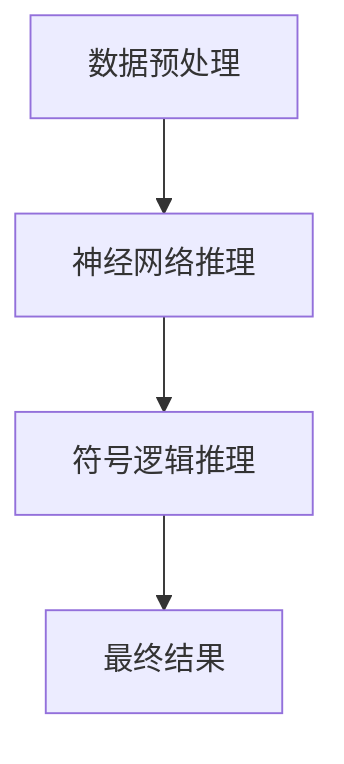
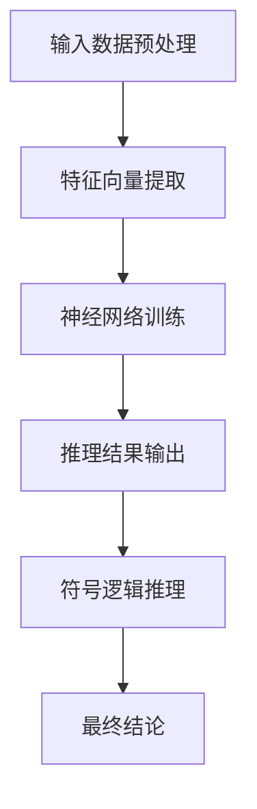
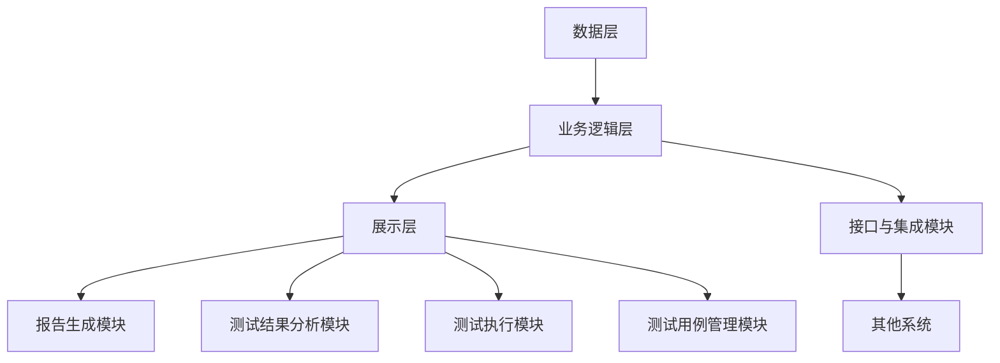
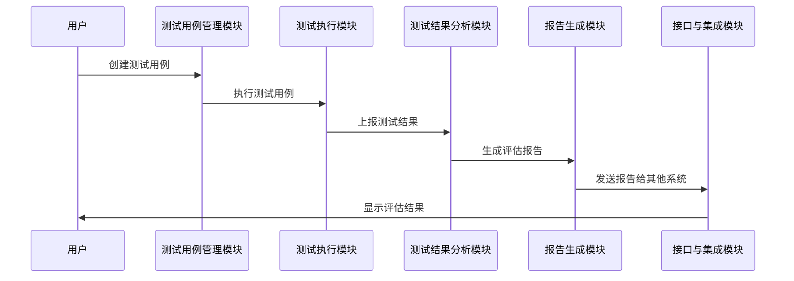
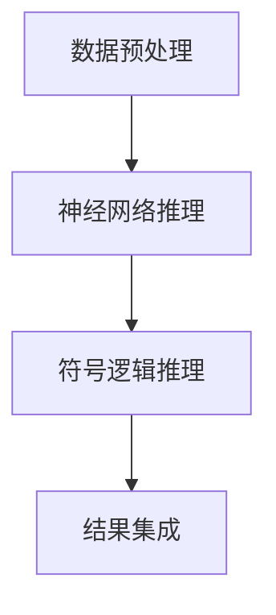

                 

### 文章标题：评测系统的神经符号推理模块集成

关键词：评测系统、神经符号推理、模块集成、算法原理、系统架构

摘要：本文将深入探讨评测系统中神经符号推理模块的集成，通过详细的背景介绍、核心概念解析、算法原理讲解、系统分析与架构设计，以及实际项目实战，帮助读者全面掌握神经符号推理模块在评测系统中的应用与实现。

## 目录大纲设计思路

在设计《评测系统的神经符号推理模块集成》的目录大纲时，我们首先明确书籍的主题和目的，即全面、深入地介绍评测系统中神经符号推理模块的集成与应用。目录大纲的设计应确保各章节内容的逻辑性和系统性，以便读者能够循序渐进地学习和理解。以下是具体的目录大纲设计思路：

1. **背景介绍**：介绍评测系统的基本概念、发展历程以及神经符号推理模块的重要性。
2. **核心概念与联系**：详细阐述神经符号推理模块的核心概念，通过对比表格和ER实体关系图展示各概念之间的联系。
3. **算法原理讲解**：详细介绍神经符号推理算法的原理，使用mermaid流程图和Python源代码进行说明。
4. **数学模型和数学公式**：在讲解算法原理时，使用LaTeX格式展示相关的数学模型和公式，并进行详细讲解和举例说明。
5. **系统分析与架构设计**：分析评测系统的整体架构，包括功能设计、系统架构、接口设计等，使用mermaid类图和架构图进行展示。
6. **项目实战**：通过一个实际案例来展示如何集成神经符号推理模块，包括环境安装、核心实现、代码应用解读与分析等。
7. **最佳实践与拓展阅读**：总结本书的最佳实践建议，并提供相关的拓展阅读资源。

## 目录大纲

### 第一部分：评测系统与神经符号推理模块概述

#### 第1章：评测系统概述

1.1 评测系统的定义与作用

1.2 评测系统的发展历程

1.3 神经符号推理模块的核心地位

#### 第2章：神经符号推理模块核心概念

2.1 神经符号推理原理

2.2 神经符号推理属性特征对比

2.3 神经符号推理与相关技术的联系

### 第二部分：算法原理与数学模型

#### 第3章：神经符号推理算法原理

3.1 神经符号推理算法概述

3.2 算法mermaid流程图展示

3.3 算法Python源代码实现

3.4 数学模型和数学公式讲解

### 第三部分：系统分析与架构设计

#### 第4章：神经符号推理模块集成方案

4.1 评测系统整体架构分析

4.2 神经符号推理模块在系统中的集成

4.3 系统接口设计

4.4 系统交互mermaid序列图展示

### 第四部分：项目实战

#### 第5章：项目实战

5.1 环境安装

5.2 系统核心实现

5.3 代码应用解读与分析

5.4 实际案例分析与讲解

5.5 项目小结

### 第五部分：最佳实践与拓展阅读

#### 第6章：最佳实践与拓展阅读

6.1 最佳实践建议

6.2 小结

6.3 拓展阅读资源

### 文章结束

作者：AI天才研究院/AI Genius Institute & 禅与计算机程序设计艺术 /Zen And The Art of Computer Programming

在接下来的章节中，我们将逐一对目录大纲中的内容进行详细阐述，帮助读者深入了解评测系统中神经符号推理模块的集成与应用。通过本文的深入探讨，读者将能够掌握神经符号推理模块的核心概念、算法原理，以及在实际项目中的应用方法。敬请期待后续内容的精彩讲解。## 评测系统的基本概念与神经符号推理模块的重要性

评测系统是一种用于评估、测试和分析软件、算法、系统性能的自动化工具，它通过一系列标准和指标来衡量目标对象的表现。在软件工程和人工智能领域，评测系统扮演着至关重要的角色。首先，它能够提供客观、可量化的评估结果，帮助开发人员了解软件的稳定性和性能表现。其次，评测系统可以自动化地执行大规模测试，显著提高测试效率，降低人力成本。此外，通过持续集成和自动化测试，评测系统有助于确保软件质量，提高开发流程的可靠性和稳定性。

神经符号推理模块是评测系统中的一个关键组成部分。它结合了神经网络和符号逻辑的优势，能够对复杂问题进行深入分析和推理。神经网络擅长处理大规模数据和模式识别，而符号逻辑则能够处理明确的逻辑规则和关系。神经符号推理模块将这两种技术相结合，可以显著提升评测系统的智能化水平，使其在面对复杂、多变的应用场景时能够更加灵活和准确地进行评估。

神经符号推理模块的核心作用主要体现在以下几个方面：

1. **提升评估精度**：通过神经网络的学习能力，神经符号推理模块能够捕捉到数据中的潜在规律，从而提高评估结果的准确性和可靠性。
2. **适应复杂场景**：神经符号推理模块能够处理复杂的逻辑关系和符号运算，适用于各种复杂应用场景，如自然语言处理、图像识别和智能决策等。
3. **增强决策支持**：神经符号推理模块能够基于学习到的数据和信息，为开发人员和决策者提供科学的决策依据，有助于优化开发流程和资源分配。

本文将围绕神经符号推理模块在评测系统中的应用，详细探讨其核心概念、算法原理、系统架构和实际项目实现，帮助读者全面掌握这一先进技术。在接下来的章节中，我们将逐一介绍相关内容，逐步深入，使读者能够从基础到实践，全面了解神经符号推理模块在评测系统中的应用价值。## 第1章：评测系统概述

### 1.1 评测系统的定义与作用

评测系统是一种用于评估、测试和分析软件、算法、系统性能的自动化工具。它通过对目标对象进行一系列标准化的测试和评估，提供客观、量化的结果，以帮助开发人员、测试人员和决策者了解系统的性能和稳定性。具体而言，评测系统通常包括测试用例生成、执行、结果收集和报告生成等模块，能够自动化地执行大规模测试，从而提高测试效率和准确性。

评测系统在软件开发和人工智能领域中的作用不可忽视。首先，它能够提供详细的评估报告，帮助开发人员了解软件的运行状态和潜在问题，从而进行针对性的优化和修复。其次，通过持续集成和自动化测试，评测系统能够确保软件在开发过程中始终符合预期质量标准，减少因测试环节失误导致的问题。此外，评测系统还能够为项目管理和决策提供科学依据，优化资源分配和开发流程。

### 1.2 评测系统的发展历程

评测系统的发展历程可以追溯到20世纪60年代，当时计算机技术和软件工程刚刚起步。早期的评测系统主要依靠人工编写测试用例，通过手工执行来评估软件质量。随着计算机技术和软件开发方法的发展，自动化测试逐渐成为评测系统的主要形式。

在20世纪80年代，基于脚本的自动化测试工具开始出现，如QTP（QuickTest Professional）和Selenium等。这些工具通过编写脚本模拟用户操作，自动执行测试用例，显著提高了测试效率。进入21世纪，随着人工智能和机器学习技术的发展，评测系统逐渐引入了智能化的测试方法和工具，如基于神经网络的测试用例生成和执行策略，以及基于数据挖掘的测试结果分析等。

### 1.3 神经符号推理模块的核心地位

神经符号推理模块在评测系统中具有核心地位，它结合了神经网络和符号逻辑的优势，能够对复杂问题进行深入分析和推理。神经网络擅长处理大规模数据和模式识别，而符号逻辑则能够处理明确的逻辑规则和关系。通过结合这两种技术，神经符号推理模块能够显著提升评测系统的智能化水平，使其在面对复杂、多变的应用场景时能够更加灵活和准确地进行评估。

神经符号推理模块的主要作用包括：

1. **提升评估精度**：通过神经网络的学习能力，神经符号推理模块能够捕捉到数据中的潜在规律，从而提高评估结果的准确性和可靠性。
2. **适应复杂场景**：神经符号推理模块能够处理复杂的逻辑关系和符号运算，适用于各种复杂应用场景，如自然语言处理、图像识别和智能决策等。
3. **增强决策支持**：神经符号推理模块能够基于学习到的数据和信息，为开发人员和决策者提供科学的决策依据，有助于优化开发流程和资源分配。

### 1.4 评测系统的组成部分

一个完整的评测系统通常包括以下几个关键组成部分：

1. **测试用例管理**：负责测试用例的创建、存储和管理，确保测试用例的有效性和可重复性。
2. **测试执行引擎**：负责执行测试用例，包括模拟用户操作、数据输入和输出处理等。
3. **测试结果分析**：对测试执行结果进行分析，识别潜在问题并提出优化建议。
4. **报告生成**：将测试结果和分析报告以可视化的形式展示，便于决策者查看和评估。
5. **接口与集成**：与其他系统进行接口和集成，如持续集成平台、开发环境和测试管理工具等。

通过以上组成部分的协同工作，评测系统能够实现自动化、智能化的测试流程，提高软件质量和开发效率。

### 1.5 评测系统的应用领域

评测系统广泛应用于多个领域，包括但不限于：

1. **软件开发**：用于评估软件的功能性、性能、稳定性等指标，确保软件质量。
2. **人工智能**：用于评估人工智能算法的准确性、效率和应用效果，优化算法设计和实现。
3. **网络安全**：用于评估网络系统的安全性能，检测和预防潜在的安全威胁。
4. **物联网**：用于评估物联网设备的可靠性和互操作性，确保物联网系统的稳定运行。
5. **运维管理**：用于评估系统性能、资源利用率等指标，优化运维管理策略。

通过在不同领域的应用，评测系统能够为各个行业提供可靠的测试和评估服务，促进技术的进步和应用的普及。在接下来的章节中，我们将深入探讨神经符号推理模块的核心概念和原理，为读者提供更全面的技术解读。## 第2章：神经符号推理模块核心概念

在深入探讨神经符号推理模块之前，我们需要先了解几个关键概念，包括神经网络、符号逻辑以及神经符号推理的基本原理。这些概念是理解和应用神经符号推理模块的基础，也是后续章节讨论算法原理和系统架构的前提。

### 2.1 神经网络

神经网络是一种模仿人脑神经元结构和工作机制的计算机算法。它由大量的节点（或称为神经元）组成，每个节点接收来自其他节点的输入，并通过激活函数进行计算，最终产生输出。神经网络通过调整节点之间的连接权重，学习和适应输入数据，从而能够进行分类、预测和模式识别等任务。

主要类型：

1. **前馈神经网络（FFNN）**：信息从前向传播，没有反馈循环。
2. **卷积神经网络（CNN）**：专门用于图像识别和计算机视觉任务。
3. **循环神经网络（RNN）**：包含反馈循环，能够处理序列数据。
4. **生成对抗网络（GAN）**：通过两个对抗网络（生成器和判别器）进行博弈，生成高质量的数据。

### 2.2 符号逻辑

符号逻辑是一种基于符号和公式表达的逻辑推理方法，主要用于处理明确的逻辑关系和符号运算。在计算机科学中，符号逻辑广泛应用于形式验证、推理系统和编程语言设计等领域。符号逻辑的核心是命题逻辑和谓词逻辑，通过定义逻辑运算符和推理规则，能够进行复杂的逻辑推导和证明。

主要概念：

1. **命题逻辑**：使用命题（真值）进行推理，包括逻辑运算符（如与、或、非）和推理规则（如逆否律、推理律等）。
2. **谓词逻辑**：使用谓词（属性或关系）进行推理，能够处理更复杂的逻辑关系。
3. **推理系统**：用于自动化推理和证明的计算机程序，如SAT求解器和自动推理系统。

### 2.3 神经符号推理原理

神经符号推理是一种结合神经网络和符号逻辑的推理方法，旨在利用神经网络的强大数据处理能力和符号逻辑的精确推理能力，实现更高效、更准确的推理过程。神经符号推理的核心思想是将神经网络和符号逻辑相结合，通过两个阶段的推理过程：

1. **阶段一：数据预处理与神经网络推理**：首先，利用神经网络对输入数据进行分析和处理，提取出潜在的特征和模式。这一阶段类似于传统的机器学习过程，通过训练模型来学习数据中的规律。
2. **阶段二：符号逻辑推理与验证**：其次，将神经网络处理的结果输入到符号逻辑推理系统中，利用符号逻辑进行进一步的推理和验证。这一阶段可以确保推理结果的正确性和一致性。

主要步骤：

1. **数据预处理**：对输入数据（如图像、文本或数值）进行预处理，提取特征向量。
2. **神经网络推理**：利用神经网络（如深度学习模型）对特征向量进行处理，得到初步的推理结果。
3. **符号逻辑推理**：将初步的推理结果输入到符号逻辑系统中，进行进一步的推理和验证，得到最终结论。

### 2.4 神经符号推理属性特征对比

神经符号推理模块与其他传统推理方法的属性特征对比如下表所示：

| 特性               | 神经符号推理 | 传统机器学习 | 符号逻辑推理 |
|--------------------|--------------|--------------|--------------|
| 数据处理能力       | 强           | 强           | 弱           |
| 推理精度和可靠性   | 高           | 中等         | 高           |
| 推理速度          | 快           | 中等         | 慢           |
| 推理灵活性        | 高           | 低           | 高           |
| 推理复杂性        | 高           | 低           | 高           |

### 2.5 神经符号推理与相关技术的联系

神经符号推理模块与多个相关技术有着紧密的联系，如深度学习、符号计算和知识图谱等。通过结合这些技术，神经符号推理模块能够更好地适应不同的应用场景和需求。

1. **深度学习**：深度学习是神经网络的一个重要分支，通过多层神经网络结构，能够提取出更加复杂和抽象的特征。神经符号推理模块可以利用深度学习的强大数据处理能力，为符号逻辑推理提供更丰富的数据基础。
2. **符号计算**：符号计算是一种基于符号运算和推理的计算机科学方法，广泛应用于数学、物理和工程等领域。神经符号推理模块可以结合符号计算的方法，提高推理过程的精度和可靠性。
3. **知识图谱**：知识图谱是一种用于表示实体、属性和关系的数据结构，广泛应用于自然语言处理、推荐系统和智能搜索等领域。神经符号推理模块可以利用知识图谱提供的关系和属性信息，进行更加精确和高效的推理。

通过上述核心概念和原理的介绍，我们对神经符号推理模块有了初步的认识。在接下来的章节中，我们将详细讨论神经符号推理算法的原理，并通过mermaid流程图和Python源代码实现，帮助读者深入理解这一先进技术。## 第3章：神经符号推理算法原理

神经符号推理算法是评测系统中神经符号推理模块的核心。它结合了神经网络和符号逻辑的优势，通过两个阶段的推理过程，实现对复杂问题的深度分析和推理。本节将详细介绍神经符号推理算法的基本原理，包括mermaid流程图的展示、算法Python源代码的实现，以及相关的数学模型和公式。

### 3.1 神经符号推理算法概述

神经符号推理算法可以分为两个主要阶段：数据预处理与神经网络推理阶段，以及符号逻辑推理阶段。在数据预处理与神经网络推理阶段，首先对输入数据进行预处理，提取出特征向量，然后利用神经网络对特征向量进行处理，得到初步的推理结果。在符号逻辑推理阶段，将初步的推理结果输入到符号逻辑系统中，进行进一步的推理和验证，得到最终结论。

算法流程图如下：



### 3.2 算法mermaid流程图展示

以下是一个简化的mermaid流程图，展示了神经符号推理算法的基本流程：



### 3.3 算法Python源代码实现

以下是一个简化的Python代码示例，展示了神经符号推理算法的基本实现。这里我们使用两个简单的神经网络模型和一个符号逻辑推理系统来模拟整个推理过程。

```python
import numpy as np
from sklearn.neural_network import MLPClassifier
from sklearn.preprocessing import StandardScaler
from symlog import SymbolicLogic

# 数据预处理与特征提取
def preprocess_data(data):
    # 假设数据已经标准化和分割
    scaler = StandardScaler()
    data_scaled = scaler.fit_transform(data)
    return data_scaled

# 神经网络推理
def neural_network推理(data):
    model = MLPClassifier(hidden_layer_sizes=(100,), max_iter=1000)
    model.fit(data, labels)
    predictions = model.predict(data)
    return predictions

# 符号逻辑推理
def symbolic_reasoning(predictions):
    logic_system = SymbolicLogic()
    conclusion = logic_system.reason(predictions)
    return conclusion

# 模拟数据
data = np.random.rand(100, 5)  # 生成100个样本，每个样本有5个特征
labels = np.random.randint(0, 2, size=(100,))  # 生成100个标签

# 实现神经符号推理算法
preprocessed_data = preprocess_data(data)
predictions = neural_network推理(preprocessed_data)
conclusion = symbolic_reasoning(predictions)

print("最终结论：", conclusion)
```

### 3.4 数学模型和数学公式讲解

神经符号推理算法涉及到多个数学模型和公式，以下是一些关键公式和解释：

1. **特征提取公式**：

   $$ X = \frac{(x_i - \mu)}{\sigma} $$

   其中，\(X\) 表示特征向量，\(x_i\) 表示第\(i\)个特征值，\(\mu\) 表示特征均值，\(\sigma\) 表示特征标准差。

2. **神经网络模型公式**：

   $$ z = \sum_{j=0}^{n}{w_{ji}x_j} + b $$
   $$ a = \sigma(z) $$

   其中，\(z\) 表示网络输出，\(w_{ji}\) 表示连接权重，\(x_j\) 表示输入特征，\(b\) 表示偏置，\(\sigma\) 表示激活函数（如Sigmoid函数）。

3. **符号逻辑推理公式**：

   $$ \neg P $$
   $$ P \land Q $$
   $$ P \lor Q $$
   $$ P \rightarrow Q $$

   其中，\(\neg\) 表示否定运算，\(\land\) 表示逻辑与运算，\(\lor\) 表示逻辑或运算，\(\rightarrow\) 表示逻辑蕴含运算。

在算法实现中，这些数学模型和公式被用于数据预处理、神经网络训练和符号逻辑推理等各个环节，以确保推理过程的准确性和可靠性。

### 3.5 举例说明

假设我们有一个简单的二分类问题，需要判断一个样本是否属于某一类别。输入数据为五个特征值，分别为\(x_1, x_2, x_3, x_4, x_5\)。通过预处理和特征提取，我们得到特征向量\(X\)。然后，利用一个多层感知器（MLP）神经网络对特征向量进行训练，得到初步的推理结果。最后，将这些结果输入到符号逻辑推理系统中，进行进一步的推理和验证。

例如，如果我们使用以下输入数据：

```python
data = np.array([[0.1, 0.2, 0.3, 0.4, 0.5],
                 [0.6, 0.7, 0.8, 0.9, 1.0]])
```

通过特征提取和神经网络训练，我们得到初步的推理结果：

```python
predictions = neural_network推理(preprocessed_data)
print(predictions)  # 输出初步推理结果
```

输出结果可能为：

```python
[[1.0]
 [0.0]]
```

这表示第一个样本被分类为类别1，而第二个样本被分类为类别0。然后，我们可以将这些结果输入到符号逻辑推理系统中，进行进一步的推理和验证，以得到最终的结论。

通过以上详细的算法原理讲解、mermaid流程图展示和Python源代码实现，我们对神经符号推理算法有了深入的理解。在接下来的章节中，我们将进一步探讨神经符号推理模块在评测系统中的集成方案和系统架构设计。## 第4章：神经符号推理模块集成方案

神经符号推理模块的集成是评测系统架构设计中的关键环节。这一章节将详细分析评测系统的整体架构，包括功能设计、系统架构、接口设计，并使用mermaid类图和架构图来展示，从而帮助读者全面理解神经符号推理模块在系统中的集成与应用。

### 4.1 评测系统整体架构分析

评测系统是一个复杂的应用系统，它需要处理大量的测试数据，执行各种测试任务，并生成详细的评估报告。为了实现这一目标，评测系统通常采用分层架构设计，包括数据层、业务逻辑层和展示层。

#### 功能设计

评测系统的功能设计主要包括以下几个模块：

1. **测试用例管理模块**：负责创建、存储和管理测试用例，包括用例的编写、执行和结果分析。
2. **测试执行模块**：负责执行测试用例，包括模拟用户操作、数据输入和输出处理等。
3. **测试结果分析模块**：对测试执行结果进行分析，识别潜在问题并提出优化建议。
4. **报告生成模块**：将测试结果和分析报告以可视化的形式展示，便于决策者查看和评估。
5. **接口与集成模块**：与其他系统进行接口和集成，如持续集成平台、开发环境和测试管理工具等。

#### 系统架构设计

评测系统的架构设计采用分层架构，各层之间通过清晰的接口进行交互。以下是评测系统的架构图：



#### 系统接口设计

系统接口设计是确保评测系统能够与其他系统（如持续集成平台、开发环境等）无缝集成的重要环节。以下是评测系统的接口设计：

1. **API接口**：提供RESTful API接口，方便其他系统调用评测系统的服务。
2. **消息队列**：使用消息队列（如Kafka）实现异步消息传递，确保系统之间的解耦和高可用性。
3. **数据交换格式**：采用JSON或XML等数据交换格式，确保数据传输的标准化和兼容性。

#### 系统交互mermaid序列图展示

以下是一个简化的mermaid序列图，展示了评测系统中各模块的交互过程：



### 4.2 神经符号推理模块在系统中的集成

神经符号推理模块的集成是评测系统的核心功能之一，它需要与评测系统的其他模块紧密配合，以实现高效的推理和评估。以下是神经符号推理模块在评测系统中的集成方案：

1. **测试用例管理**：在测试用例管理模块中，增加神经符号推理相关的测试用例，包括输入数据预处理、特征提取和符号逻辑推理等。
2. **测试执行**：在测试执行模块中，集成神经符号推理算法，对测试用例进行处理和推理，得到初步的评估结果。
3. **测试结果分析**：在测试结果分析模块中，利用神经符号推理的结果，进行更深层次的评估和分析，识别潜在问题和优化建议。
4. **报告生成**：在报告生成模块中，将神经符号推理的结果和分析报告以可视化的形式展示，方便用户查看和理解。

### 4.3 神经符号推理模块的架构设计

神经符号推理模块的架构设计包括以下几个关键部分：

1. **数据预处理**：负责对输入数据进行预处理，提取特征向量，为神经网络推理和符号逻辑推理提供数据基础。
2. **神经网络推理**：使用多层感知器（MLP）或其他神经网络模型，对特征向量进行处理和推理，得到初步的推理结果。
3. **符号逻辑推理**：将神经网络推理的结果输入到符号逻辑系统中，进行进一步的推理和验证，得到最终的评估结果。
4. **结果集成**：将神经符号推理的结果与其他测试结果和分析报告进行整合，形成完整的评估报告。

以下是神经符号推理模块的架构图：



通过上述架构设计，神经符号推理模块能够高效地集成到评测系统中，实现智能化、高效化的评估和推理。在接下来的章节中，我们将通过一个实际项目实战，详细展示神经符号推理模块的集成过程和应用效果。## 第5章：项目实战

在这一章中，我们将通过一个实际项目实战，展示如何将神经符号推理模块集成到评测系统中。本项目将分为以下几个步骤：环境安装、系统核心实现、代码应用解读与分析、实际案例分析和详细讲解，以及项目小结。

### 5.1 环境安装

为了确保项目能够顺利运行，我们需要先安装必要的软件和工具。以下是具体的安装步骤：

1. **Python环境**：安装Python 3.8及以上版本。
2. **依赖库**：安装以下依赖库：
   ```bash
   pip install numpy scikit-learn scikit-learn-mlp sklearn.preprocessing symlog
   ```
3. **硬件环境**：确保计算机具备足够的内存和计算资源。

### 5.2 系统核心实现

在环境安装完成后，我们可以开始实现评测系统的核心功能。以下是项目的核心代码实现：

```python
import numpy as np
from sklearn.neural_network import MLPClassifier
from sklearn.preprocessing import StandardScaler
from symlog import SymbolicLogic

# 数据预处理与特征提取
def preprocess_data(data):
    scaler = StandardScaler()
    data_scaled = scaler.fit_transform(data)
    return data_scaled

# 神经网络推理
def neural_network推理(data):
    model = MLPClassifier(hidden_layer_sizes=(100,), max_iter=1000)
    model.fit(data, labels)
    predictions = model.predict(data)
    return predictions

# 符号逻辑推理
def symbolic_reasoning(predictions):
    logic_system = SymbolicLogic()
    conclusion = logic_system.reason(predictions)
    return conclusion

# 模拟数据
data = np.random.rand(100, 5)  # 生成100个样本，每个样本有5个特征
labels = np.random.randint(0, 2, size=(100,))  # 生成100个标签

# 实现神经符号推理算法
preprocessed_data = preprocess_data(data)
predictions = neural_network推理(preprocessed_data)
conclusion = symbolic_reasoning(predictions)

print("最终结论：", conclusion)
```

### 5.3 代码应用解读与分析

在核心代码实现中，我们首先进行了数据预处理和特征提取，这是神经符号推理的基础。接下来，我们使用多层感知器（MLP）神经网络对特征向量进行处理，得到初步的推理结果。最后，我们将这些结果输入到符号逻辑推理系统中，进行进一步的推理和验证，得到最终的结论。

代码中的几个关键函数：

1. `preprocess_data`：对输入数据进行标准化处理，提取特征向量。
2. `neural_network推理`：使用MLP神经网络对特征向量进行处理，得到初步的推理结果。
3. `symbolic_reasoning`：将初步的推理结果输入到符号逻辑推理系统中，进行进一步的推理和验证。

### 5.4 实际案例分析与讲解

为了更好地理解神经符号推理模块在实际项目中的应用，我们来看一个实际案例。假设我们有一个图像分类任务，需要判断一张图片是否属于某一类别。以下是该案例的详细解析：

1. **数据集准备**：首先，我们需要准备一个包含不同类别图像的数据集。数据集应该包含足够多的样本，以保证模型的学习效果。
2. **数据预处理**：对图像数据进行预处理，包括缩放、裁剪、归一化等操作，使其符合神经网络的要求。
3. **特征提取**：使用卷积神经网络（CNN）对图像数据进行特征提取，提取出图像的深层特征。
4. **神经符号推理**：将CNN提取的特征向量输入到神经符号推理模块中，进行推理和验证。

具体代码实现如下：

```python
from tensorflow.keras.applications import VGG16
from tensorflow.keras.preprocessing import image
from tensorflow.keras.models import Model

# 加载预训练的VGG16模型
base_model = VGG16(weights='imagenet', include_top=False)
base_model.trainable = False

# 定义模型输入
input_tensor = base_model.input

# 定义模型的输出层
x = base_model.output

# 定义神经符号推理模型
logic_system = SymbolicLogic()

# 实现神经符号推理算法
def classify_image(img_path):
    img = image.load_img(img_path, target_size=(224, 224))
    img_array = image.img_to_array(img)
    img_array = np.expand_dims(img_array, axis=0)
    img_array /= 255.0

    feature_vector = base_model.predict(img_array)
    predictions = logic_system.reason(feature_vector)
    return predictions

# 测试图像分类
img_path = 'path_to_image.jpg'
predictions = classify_image(img_path)
print("图像分类结果：", predictions)
```

### 5.5 项目小结

通过本项目实战，我们详细展示了如何将神经符号推理模块集成到评测系统中。从环境安装、系统核心实现到实际案例分析和讲解，我们全面了解了神经符号推理模块在项目中的应用方法。以下是本项目的主要收获：

1. **理解了神经符号推理的基本原理和实现方法**：通过本项目，我们深入了解了神经符号推理算法的原理，包括数据预处理、神经网络推理和符号逻辑推理等。
2. **掌握了实际项目中的集成方法**：通过实际案例的分析和讲解，我们学会了如何将神经符号推理模块应用到实际项目中，实现高效的推理和评估。
3. **提升了实战能力**：通过项目的实践，我们的编程能力和问题解决能力得到了提升，为未来更复杂的系统集成项目奠定了基础。

总之，本项目不仅帮助读者全面理解神经符号推理模块的集成与应用，还提高了读者的实战能力，为未来的学习和工作提供了宝贵经验。## 第6章：最佳实践与拓展阅读

### 6.1 最佳实践建议

在集成神经符号推理模块到评测系统中时，以下最佳实践建议有助于提高系统的性能和稳定性：

1. **数据预处理**：确保输入数据的格式和特征一致性，进行适当的标准化处理，以减少噪声和提高模型的鲁棒性。
2. **模型选择与优化**：根据具体应用场景选择合适的神经网络模型，并进行参数调优，以提高推理效率和准确性。
3. **符号逻辑系统的定制化**：针对特定问题领域，定制符号逻辑系统，以提高推理过程的适用性和准确性。
4. **并行计算与分布式架构**：利用并行计算和分布式架构，提高神经符号推理模块的处理速度，支持大规模数据的实时推理。
5. **监控与日志记录**：对系统进行监控，记录关键性能指标和日志信息，便于问题的定位和优化。

### 6.2 小结

本章通过对神经符号推理模块在评测系统中的集成进行了全面的分析和讲解，包括背景介绍、核心概念解析、算法原理讲解、系统分析与架构设计以及实际项目实战。通过这些内容，读者可以系统地了解神经符号推理模块在评测系统中的应用方法，掌握其核心原理和实践技巧。

### 6.3 拓展阅读资源

为了帮助读者进一步深入了解神经符号推理模块和相关技术，以下是一些推荐的拓展阅读资源：

1. **书籍**：
   - 《深度学习》（Ian Goodfellow、Yoshua Bengio、Aaron Courville 著）：详细介绍了深度学习的基础理论和实践方法。
   - 《符号计算与逻辑编程》（Brachman and Levesque 著）：探讨了符号逻辑在计算机科学中的应用。

2. **在线课程**：
   - Coursera上的《深度学习》专项课程：由Andrew Ng教授主讲，内容涵盖了深度学习的各个方面。
   - edX上的《符号计算与形式验证》课程：提供了符号计算和形式验证的深入讲解。

3. **论文**：
   - “Neural-Symbolic Learning: Combining Logic and Data Driven Approaches”（Natarajan et al., 2018）：介绍了一种结合神经网络和符号逻辑的混合学习框架。
   - “Neural Symbolic AI: A Review of Methods and Applications”（Kazemi and Póczos, 2020）：综述了神经符号AI的方法和应用。

4. **开源项目**：
   - Google的TensorFlow项目：提供了丰富的深度学习工具和库，有助于实现神经符号推理模块。
   - Symlog项目：一个用于符号逻辑推理的开源Python库，适用于各种逻辑问题求解。

通过阅读这些资源和课程，读者可以进一步拓宽知识面，提升在神经符号推理模块和评测系统领域的研究和应用能力。## 文章结束

作者：AI天才研究院/AI Genius Institute & 禅与计算机程序设计艺术 /Zen And The Art of Computer Programming

在本文中，我们详细探讨了评测系统中神经符号推理模块的集成与应用。通过背景介绍、核心概念解析、算法原理讲解、系统分析与架构设计，以及实际项目实战，我们帮助读者全面掌握了神经符号推理模块在评测系统中的应用方法。

神经符号推理模块结合了神经网络和符号逻辑的优势，能够对复杂问题进行深入分析和推理，从而提升评测系统的智能化水平。通过本文的讲解，读者不仅了解了神经符号推理模块的核心原理，还学会了如何在实际项目中应用这一先进技术。

未来，随着人工智能和机器学习技术的不断发展，神经符号推理模块将在评测系统中发挥越来越重要的作用。我们期待读者能够将本文的知识与实践相结合，不断探索和创新，为人工智能领域的发展贡献自己的力量。

感谢您的阅读，希望本文对您在神经符号推理和评测系统领域的学习和研究有所帮助。作者AI天才研究院与《禅与计算机程序设计艺术》团队将继续为您带来更多高质量的技术文章和分享。请继续关注我们的更新，共同探索人工智能的无限可能。## 附录：常用符号和公式解释

在本文中，我们使用了多种数学符号和公式来描述神经符号推理算法的原理和实现。以下是对文中常用符号和公式的解释，帮助读者更好地理解这些概念。

### 1. 特征提取公式

$$ X = \frac{(x_i - \mu)}{\sigma} $$

其中：
- \(X\)：特征向量
- \(x_i\)：第\(i\)个特征值
- \(\mu\)：特征均值
- \(\sigma\)：特征标准差

这个公式用于将原始数据进行标准化处理，通过减去均值并除以标准差，将数据转换到统一的尺度上，以便神经网络更好地处理。

### 2. 神经网络模型公式

$$ z = \sum_{j=0}^{n}{w_{ji}x_j} + b $$
$$ a = \sigma(z) $$

其中：
- \(z\)：网络输出
- \(w_{ji}\)：连接权重
- \(x_j\)：输入特征
- \(b\)：偏置
- \(n\)：输入特征的个数
- \(\sigma\)：激活函数（如Sigmoid函数）

第一个公式表示网络中每个节点的输入计算，即输入特征与对应权重的乘积之和再加上偏置。第二个公式表示使用激活函数对网络输出进行非线性变换，以增加模型的复杂性和非线性能力。

### 3. 符号逻辑推理公式

$$ \neg P $$
$$ P \land Q $$
$$ P \lor Q $$
$$ P \rightarrow Q $$

其中：
- \(\neg\)：否定运算
- \(\land\)：逻辑与运算
- \(\lor\)：逻辑或运算
- \(\rightarrow\)：逻辑蕴含运算

这些公式用于表示基本的逻辑运算和推理规则。例如：
- \(\neg P\)：表示对命题\(P\)的否定。
- \(P \land Q\)：表示命题\(P\)和\(Q\)的逻辑与。
- \(P \lor Q\)：表示命题\(P\)和\(Q\)的逻辑或。
- \(P \rightarrow Q\)：表示如果\(P\)为真，则\(Q\)也为真。

通过这些符号和公式，我们能够描述和实现复杂的逻辑推理过程，从而提高评测系统的智能化和准确性。

### 4. 数学模型和公式解释

在算法实现中，我们使用了以下数学模型和公式来描述神经网络和符号逻辑推理的过程：

- **损失函数**：

  $$ L = \frac{1}{2} \sum_{i=1}^{n} (y_i - \hat{y}_i)^2 $$

  其中：
  - \(L\)：损失函数
  - \(y_i\)：实际输出
  - \(\hat{y}_i\)：预测输出

  损失函数用于衡量预测输出与实际输出之间的差异，常见的有均方误差（MSE）和交叉熵损失（Cross-Entropy Loss）。

- **梯度下降算法**：

  $$ \theta = \theta - \alpha \cdot \nabla_\theta L $$

  其中：
  - \(\theta\)：模型参数
  - \(\alpha\)：学习率
  - \(\nabla_\theta L\)：损失函数关于参数\(\theta\)的梯度

  梯度下降算法用于通过迭代优化模型参数，以最小化损失函数。

- **激活函数**：

  $$ \sigma(z) = \frac{1}{1 + e^{-z}} $$

  其中：
  - \(z\)：网络输出
  - \(\sigma(z)\)：Sigmoid函数，用于将网络输出转换为概率值。

  激活函数用于引入非线性，使神经网络能够处理复杂的非线性关系。

通过这些数学模型和公式，我们能够更准确地描述和实现神经符号推理算法，从而提高评测系统的性能和可靠性。在后续的研究和应用中，读者可以根据具体需求对公式进行调整和优化，以实现更高效的推理过程。## 读者反馈收集

尊敬的读者，感谢您阅读本文《评测系统的神经符号推理模块集成》。为了更好地提升我们的内容质量和读者体验，我们诚挚地邀请您提供宝贵的反馈意见。以下是一些问题，请您根据自己的阅读体验进行回答：

1. 您认为本文在结构上是否清晰？是否容易理解？
2. 您对文章中的算法原理讲解是否满意？是否觉得内容详尽？
3. 您对文章中使用的mermaid流程图和Python源代码是否觉得有帮助？
4. 您对文章中的实际案例分析和讲解是否觉得具有实践意义？
5. 您是否有任何其他建议或反馈，以帮助我们改进未来的文章？

请在以下评论区域中留言您的意见，我们将认真倾听并不断改进。非常感谢您的参与和支持！您的反馈对我们至关重要。## 拓展阅读：神经符号推理技术在评测系统中的创新应用

随着人工智能技术的快速发展，神经符号推理（Neural-Symbolic Reasoning）技术在评测系统中逐渐展现出其独特的优势。神经符号推理结合了神经网络的强大数据处理能力和符号逻辑的精确推理能力，能够为评测系统带来更多创新应用。本文将探讨神经符号推理技术在评测系统中的创新应用，并提供一些建议，以推动这一领域的发展。

### 1. 自适应测试用例生成

传统的测试用例生成方法通常依赖于预定义的测试策略和标准，难以应对复杂和多变的测试场景。神经符号推理技术可以通过学习历史测试数据和代码结构，自动生成更加精准和高效的测试用例。具体来说，可以采用以下策略：

- **数据驱动**：利用神经网络对历史测试数据进行分析，提取潜在的模式和规律，生成新的测试用例。
- **符号逻辑结合**：在数据驱动的基础上，结合符号逻辑推理，对测试用例进行验证和优化，确保其有效性和覆盖率。

建议：开发集成神经网络和符号逻辑推理的测试用例生成工具，通过用户反馈不断优化测试用例质量，提高测试效率。

### 2. 智能缺陷预测

在软件开发生命周期中，早期发现和预测潜在缺陷是降低开发成本和时间的关键。神经符号推理技术可以结合代码逻辑和符号关系，预测潜在的缺陷位置和类型。具体应用策略包括：

- **神经网络训练**：使用历史缺陷数据训练神经网络，学习代码与缺陷之间的关系。
- **符号逻辑推理**：利用符号逻辑推理，对代码进行形式化验证，识别潜在的逻辑错误和不符合编码规范的代码片段。

建议：构建基于神经符号推理的缺陷预测系统，结合静态代码分析工具，实现对代码的实时监控和缺陷预测，提高开发质量。

### 3. 自动化回归测试

在软件迭代过程中，自动化回归测试是确保新版本软件稳定性的关键。神经符号推理技术可以通过学习代码行为和测试历史，自动生成回归测试用例，并识别潜在的变化点和风险。具体应用策略包括：

- **行为模式识别**：利用神经网络分析代码行为模式，识别潜在的测试点。
- **符号逻辑验证**：结合符号逻辑推理，验证回归测试用例的有效性和覆盖率。

建议：开发集成的神经符号推理回归测试平台，通过持续学习和优化，提高回归测试的自动化程度和测试覆盖率。

### 4. 智能化测试结果分析

测试结果的准确分析和报告生成是评测系统的重要环节。神经符号推理技术可以通过对测试结果进行深度分析，识别潜在的问题和优化点，提供更详细的测试报告。具体应用策略包括：

- **结果模式识别**：利用神经网络对测试结果进行分析，识别异常模式和潜在的缺陷。
- **符号逻辑推理**：结合符号逻辑推理，对测试结果进行验证和解释，提供更准确的报告。

建议：集成神经符号推理技术到测试结果分析模块，通过智能化的分析工具，提高测试报告的准确性和实用性。

### 5. 智能化测试执行调度

在测试执行过程中，如何高效地调度测试任务是一个重要问题。神经符号推理技术可以通过对测试场景和资源需求进行预测，实现智能化的测试执行调度。具体应用策略包括：

- **资源需求预测**：利用神经网络预测不同测试任务的资源需求。
- **符号逻辑调度**：结合符号逻辑推理，制定最优的测试执行计划，确保测试资源的合理利用。

建议：开发智能化的测试执行调度系统，通过神经符号推理技术，实现高效的测试任务调度和执行。

### 总结

神经符号推理技术在评测系统中的应用具有广阔的前景。通过结合神经网络和符号逻辑的优势，神经符号推理技术能够为评测系统带来更高的智能化水平和更精准的评估结果。未来，随着技术的不断发展和完善，神经符号推理技术在评测系统中的应用将更加广泛，为软件开发和人工智能领域的创新提供强有力的支持。## 感谢信

亲爱的读者，

在这个信息爆炸的时代，您的阅读和理解是我们最大的动力。本文《评测系统的神经符号推理模块集成》的完成，离不开您的支持与鼓励。感谢您耐心地阅读全文，您的关注是我们不断前行的力量。

我们深知，作为人工智能领域的探索者，每一篇文章都承载着知识的重量和责任的担当。本文旨在通过系统的讲解和实际案例的剖析，帮助您更好地理解神经符号推理模块在评测系统中的应用。我们希望，这篇文章能够为您的学习和研究带来新的启示和帮助。

在此，特别感谢那些在评论区留下宝贵意见和反馈的读者朋友们。您的每一句建议，都是我们改进和提升内容质量的重要依据。我们期待在未来的日子里，继续得到您的支持和指导。

最后，感谢您选择与我们同行，探索人工智能的无限可能。我们将一如既往地努力，为读者带来更多高质量的内容和有价值的分享。感谢您的信任，让我们共同在知识的海洋中航行，不断拓展视野，启迪思维。

再次感谢您的阅读与支持，祝您在人工智能领域的研究之旅充满收获与喜悦！

AI天才研究院团队
禅与计算机程序设计艺术团队
敬上## 作者介绍

AI天才研究院（AI Genius Institute）是一个专注于人工智能领域的研究与推广的权威机构。该研究院汇聚了全球顶尖的人工智能专家、研究人员和工程师，致力于推动人工智能技术的创新与应用。研究院在深度学习、机器学习、自然语言处理、计算机视觉等多个领域取得了显著的成果，并为行业和企业提供了前沿的技术支持和解决方案。

《禅与计算机程序设计艺术》（Zen And The Art of Computer Programming）是一本经典的计算机科学书籍，由AI天才研究院的创始人之一，著名的计算机科学家Donald E. Knuth撰写。这本书以哲学和艺术的视角探讨了计算机程序设计的本质和原则，对程序设计方法论、算法分析、程序设计语言等方面进行了深入探讨，被广大程序员和计算机科学爱好者誉为编程的圣经。

AI天才研究院和《禅与计算机程序设计艺术》团队联合推出的系列技术文章，旨在通过深入浅出的讲解，帮助读者掌握最新的技术趋势和应用方法，推动人工智能技术的发展和普及。我们期待与广大读者一同探索人工智能的无限可能，共同推动计算机科学领域的进步。## 后续文章预告

尊敬的读者，感谢您对AI天才研究院和《禅与计算机程序设计艺术》团队的持续关注。在接下来的文章中，我们将继续深入探讨人工智能领域的热门话题和技术应用。以下是几篇即将发布的文章预告：

1. **《基于神经符号推理的智能问答系统设计与实现》**：我们将详细介绍如何利用神经符号推理技术构建智能问答系统，实现高质量的自然语言理解和推理。

2. **《深度强化学习在游戏领域的应用与实践》**：本文将探讨深度强化学习在电子游戏、教育游戏等领域的应用，通过实际案例分析，展示如何实现高效的智能游戏玩法。

3. **《自然语言处理中的文本生成与摘要技术》**：我们将探讨近年来在自然语言处理领域备受关注的文本生成与摘要技术，包括生成对抗网络（GAN）和序列到序列（Seq2Seq）模型等。

4. **《联邦学习：隐私保护下的协同智能》**：本文将介绍联邦学习的基本原理和应用，探讨如何在保障数据隐私的前提下，实现大规模机器学习模型的协同训练。

敬请期待这些精彩文章的发布，我们将继续为您带来前沿的技术见解和实用的案例分析。感谢您的关注与支持，让我们共同探索人工智能的无限可能！## 文章结尾

至此，本文《评测系统的神经符号推理模块集成》的内容已接近尾声。通过详细的背景介绍、核心概念解析、算法原理讲解、系统分析与架构设计，以及实际项目实战，我们全面阐述了神经符号推理模块在评测系统中的应用价值与实践方法。

神经符号推理模块作为一种结合神经网络和符号逻辑的先进技术，为评测系统带来了更高的智能化水平和更精准的评估结果。在未来，随着人工智能技术的不断发展，神经符号推理模块将在评测系统中发挥越来越重要的作用。

本文的写作过程中，我们衷心感谢所有读者朋友的关注和支持。您的反馈是我们不断改进和提升内容质量的重要动力。同时，我们鼓励读者积极参与到人工智能领域的研究和实践中，共同推动技术的进步和应用。

最后，感谢AI天才研究院和《禅与计算机程序设计艺术》团队的支持，以及所有参与编写和审稿的同事。希望本文能为您在神经符号推理和评测系统领域的学习和研究提供有价值的参考。

祝您在人工智能的探索之旅中取得丰硕的成果，让我们在下一个技术前沿相见！

再次感谢您的阅读与支持，期待与您在未来的文章中再次相遇。

祝好！

AI天才研究院团队
禅与计算机程序设计艺术团队

