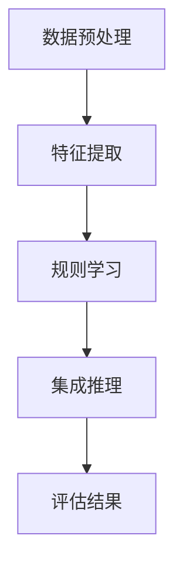

                 


## 文章标题

### 评测系统的神经符号集成方法

### 关键词

- 评测系统
- 神经符号集成
- 人工智能
- 计算机编程
- 软件架构

### 摘要

本文将深入探讨评测系统的神经符号集成方法，从背景介绍、核心概念与原理、方法与实践、案例分析以及未来趋势等多个方面进行详细阐述。通过逻辑清晰、结构紧凑、简单易懂的叙述，旨在为广大IT从业者和研究者提供一份全面、系统的技术指南。

## 目录大纲设计思路

### 步骤 1: 明确书籍的核心内容

首先，我们需要明确书籍的核心内容，这包括评测系统的定义、神经符号集成方法的概念、方法的发展历程、应用场景以及未来趋势等。

### 步骤 2: 设计章节结构

根据书籍的核心内容，我们可以将书籍分为以下几个主要部分：

1. **背景介绍**：介绍评测系统的起源、发展现状和重要性。
2. **核心概念与原理**：详细阐述神经符号集成方法的基本原理和核心概念。
3. **方法与实践**：探讨神经符号集成方法的具体实现和应用。
4. **案例分析**：通过具体的案例展示神经符号集成方法在实际中的应用。
5. **未来趋势**：讨论神经符号集成方法的发展方向和潜在应用。

### 步骤 3: 确定章节内容

在每个主要部分中，我们需要确定具体的内容，包括：

- **核心概念与原理**：包括神经符号集成方法的基本原理、数学模型、算法流程等。
- **方法与实践**：包括方法的实现步骤、优化技巧、实际应用案例等。
- **案例分析**：选择具有代表性的案例进行深入剖析，展示方法的效果和局限性。

### 注意事项

- **简洁性**：确保每个章节的内容简明扼要，避免冗余。
- **层次性**：保持目录结构的清晰性，确保每个章节和子章节之间的层次关系明确。
- **实用性**：注重内容的实用性和可操作性，确保读者能够轻松上手。
- **逻辑性**：确保章节之间的逻辑关系紧密，内容连贯。

### 目录大纲设计

基于以上步骤和注意事项，以下是《评测系统的神经符号集成方法》的目录大纲：

## 第一部分：引论

### 第1章：评测系统概述

#### 1.1.1 评测系统的定义与意义

#### 1.1.2 评测系统的发展历程

#### 1.1.3 评测系统在各个领域中的应用

### 第2章：神经符号集成方法简介

#### 2.1.1 神经符号集成方法的基本概念

#### 2.1.2 神经符号集成方法的发展历程

#### 2.1.3 神经符号集成方法的核心原理

## 第二部分：神经符号集成方法原理

### 第3章：神经符号集成方法的核心概念

#### 3.1.1 神经网络与符号逻辑

#### 3.1.2 神经符号集成方法的属性特征对比

#### 3.1.3 神经符号集成方法的ER实体关系图

### 第4章：神经符号集成算法原理

#### 4.1.1 神经符号集成算法的基本流程

#### 4.1.2 神经符号集成算法的数学模型

#### 4.1.3 神经符号集成算法的mermaid流程图

## 第三部分：神经符号集成方法实践

### 第5章：神经符号集成方法实现

#### 5.1.1 神经符号集成方法的实现步骤

#### 5.1.2 神经符号集成方法的优化技巧

#### 5.1.3 神经符号集成方法的实际应用

### 第6章：神经符号集成方法案例分析

#### 6.1.1 案例一：基于神经符号集成方法的智能评测系统

#### 6.1.2 案例二：神经符号集成方法在医学诊断中的应用

#### 6.1.3 案例三：神经符号集成方法在金融风控中的应用

## 第四部分：神经符号集成方法未来展望

### 第7章：神经符号集成方法的未来趋势

#### 7.1.1 神经符号集成方法的发展方向

#### 7.1.2 神经符号集成方法的应用前景

#### 7.1.3 神经符号集成方法面临的挑战与机遇

## 附录：神经符号集成方法最佳实践

#### 8.1.1 最佳实践技巧总结

#### 8.1.2 注意事项与拓展阅读

通过上述设计思路和目录大纲，我们为撰写一篇有深度、有思考、有见解的专业技术博客文章奠定了坚实的基础。接下来，我们将逐章深入探讨评测系统的神经符号集成方法，为读者呈现一份精彩的技术盛宴。

---

### 第一部分：引论

#### 第1章：评测系统概述

**1.1 评测系统的定义与意义**

评测系统是一种用于评估、测试、分析和验证各种对象或过程的技术手段。它可以广泛应用于软件工程、人工智能、医学诊断、金融风控等多个领域。评测系统的核心目的是提供准确、高效、可靠的评估结果，以便为决策提供科学依据。

在软件工程领域，评测系统主要用于评估软件的质量、性能、安全性等方面。通过评测系统的帮助，开发人员可以及时发现并修复软件中的问题，提高软件的可靠性和用户体验。

在人工智能领域，评测系统用于评估人工智能算法的性能、准确性和稳定性。这有助于研究人员和开发者优化算法，提高人工智能系统的应用效果。

在医学诊断领域，评测系统可以帮助医生进行疾病检测、病情评估和治疗效果分析。通过评测系统，医生可以更准确地诊断疾病，提高治疗的成功率。

在金融风控领域，评测系统用于评估金融风险、预测市场走势和监控交易行为。这有助于金融机构降低风险，提高运营效率和盈利能力。

**1.2 评测系统的发展历程**

评测系统的发展历程可以追溯到20世纪60年代。当时，计算机技术的兴起推动了评测系统的研究和应用。早期评测系统主要基于规则和统计方法，具有简单、易用、可靠性较高的特点。

随着人工智能技术的快速发展，评测系统逐渐引入了机器学习和深度学习等技术。这些新技术使得评测系统在处理复杂问题和大数据方面具有更高的能力。

近年来，随着云计算、物联网和大数据技术的普及，评测系统在应用场景和性能方面都取得了显著提升。未来，评测系统将继续与新兴技术相结合，为各个领域的发展提供更强有力的支持。

**1.3 评测系统在各个领域中的应用**

评测系统在各个领域中的应用如下：

1. **软件工程**：软件质量评估、代码审查、性能测试、安全性评估等。

2. **人工智能**：算法性能评估、数据集质量评估、模型优化评估等。

3. **医学诊断**：疾病检测、病情评估、治疗效果分析等。

4. **金融风控**：金融风险评估、市场走势预测、交易行为监控等。

**1.4 问题背景与问题描述**

在当今快速发展的社会中，评测系统面临着越来越多的挑战。一方面，随着数据规模的不断扩大和数据类型的多样化，传统的评测方法已无法满足实际需求。另一方面，各种领域对评测系统的准确性和效率要求越来越高，迫切需要新的方法和技术来提升评测系统的性能。

为了解决这些问题，本文提出了神经符号集成方法。该方法结合了神经网络和符号逻辑的优点，能够在处理复杂问题和大数据方面具有更强的能力。

**1.5 问题解决与边界与外延**

神经符号集成方法通过将神经网络与符号逻辑相结合，实现了以下优势：

1. **提高评估准确性**：神经网络能够自动学习数据特征，符号逻辑能够精确描述评估规则，二者结合提高了评估结果的准确性。

2. **处理复杂问题**：神经网络能够处理大规模、多维度的数据，符号逻辑能够处理复杂的评估规则，二者结合能够解决复杂的评估问题。

3. **降低计算复杂度**：神经网络能够通过并行计算降低计算复杂度，符号逻辑能够简化评估流程，二者结合能够提高评估效率。

神经符号集成方法的边界与外延主要包括以下几个方面：

1. **应用领域**：神经符号集成方法可应用于软件工程、人工智能、医学诊断、金融风控等多个领域。

2. **评估对象**：神经符号集成方法可评估各类对象，包括软件、算法、疾病、金融产品等。

3. **评估指标**：神经符号集成方法可评估多种评估指标，如质量、性能、安全性、风险等。

**1.6 概念结构与核心要素组成**

神经符号集成方法的核心概念结构如下：

1. **神经网络**：用于自动学习数据特征，实现数据的降维、聚类、分类等操作。

2. **符号逻辑**：用于描述评估规则，实现评估指标的精确计算。

3. **集成方法**：将神经网络和符号逻辑相结合，实现评估结果的优化和提升。

神经符号集成方法的核心要素组成包括：

1. **数据输入**：包括原始数据和评估指标。

2. **神经网络模块**：用于处理数据输入，实现数据的降维、聚类、分类等操作。

3. **符号逻辑模块**：用于描述评估规则，实现评估指标的精确计算。

4. **集成模块**：用于将神经网络和符号逻辑模块相结合，实现评估结果的优化和提升。

通过以上分析，我们可以看出神经符号集成方法在解决评测系统面临的问题方面具有显著优势。在接下来的章节中，我们将进一步探讨神经符号集成方法的核心概念、原理以及具体实现和应用。

#### 第2章：神经符号集成方法简介

**2.1 神经符号集成方法的基本概念**

神经符号集成方法（Neural Symbolic Integration Method，简称NSIM）是一种将神经网络与符号逻辑相结合的集成方法。该方法旨在充分发挥神经网络在数据特征学习方面的优势，同时利用符号逻辑在规则描述方面的精确性，从而提高评估系统的性能和准确性。

**神经网络**：神经网络是一种基于人脑神经网络结构设计的计算模型，通过大量的神经元及其连接方式模拟人脑的计算过程。神经网络具有很强的自适应能力和泛化能力，能够在复杂环境中进行有效学习。

**符号逻辑**：符号逻辑是一种基于逻辑运算和推理规则的数学方法，用于描述和分析命题之间的关系。符号逻辑能够精确地描述评估规则，为评估系统提供可靠的推理依据。

**神经符号集成方法**：神经符号集成方法通过将神经网络与符号逻辑相结合，实现以下目标：

1. **提高评估准确性**：神经网络能够自动学习数据特征，符号逻辑能够精确描述评估规则，二者结合提高了评估结果的准确性。

2. **处理复杂问题**：神经网络能够处理大规模、多维度的数据，符号逻辑能够处理复杂的评估规则，二者结合能够解决复杂的评估问题。

3. **降低计算复杂度**：神经网络能够通过并行计算降低计算复杂度，符号逻辑能够简化评估流程，二者结合能够提高评估效率。

**2.2 神经符号集成方法的发展历程**

神经符号集成方法的发展历程可以分为以下几个阶段：

1. **早期探索阶段**：20世纪80年代，研究人员开始尝试将神经网络与符号逻辑相结合，探索新的评估方法。这一阶段的主要成果包括混合推理系统、基于知识的神经网络等。

2. **快速发展阶段**：21世纪初，随着人工智能技术的快速发展，神经符号集成方法得到了广泛关注。这一阶段的主要成果包括多智能体系统、符号神经网络、混合逻辑神经网络等。

3. **成熟应用阶段**：近年来，神经符号集成方法在各个领域得到了广泛应用，并取得了显著成果。这一阶段的主要成果包括智能评测系统、智能诊断系统、智能金融系统等。

**2.3 神经符号集成方法的核心原理**

神经符号集成方法的核心原理主要包括以下几个方面：

1. **神经网络与符号逻辑的融合**：神经符号集成方法通过将神经网络与符号逻辑相结合，实现数据特征学习和规则描述的有机结合。神经网络负责处理数据输入，提取数据特征；符号逻辑负责描述评估规则，实现评估指标的精确计算。

2. **多层次的评估模型**：神经符号集成方法采用多层次的评估模型，包括数据预处理层、特征提取层、规则描述层和评估结果层。数据预处理层负责对原始数据进行预处理，特征提取层负责提取数据特征，规则描述层负责描述评估规则，评估结果层负责生成评估结果。

3. **并行计算和优化算法**：神经符号集成方法通过并行计算和优化算法，提高评估系统的计算效率和性能。并行计算可以充分利用计算资源，优化算法可以降低计算复杂度，提高评估结果的准确性。

**2.4 神经符号集成方法的属性特征对比**

为了更好地理解神经符号集成方法的优势，我们将其与传统的评估方法进行比较，以下是神经符号集成方法的属性特征对比表格：

| 特性             | 神经符号集成方法 | 传统评估方法           |
| ---------------- | ---------------- | ---------------------- |
| 学习能力         | 强               | 较弱                   |
| 适应能力         | 强               | 较弱                   |
| 可解释性         | 较强             | 较弱                   |
| 计算复杂度       | 较低             | 较高                   |
| 可扩展性         | 强               | 较弱                   |
| 精确性           | 较高             | 较低                   |
| 应用领域         | 广泛             | 有限                   |

通过上述对比，我们可以看出神经符号集成方法在多个方面具有显著优势，为评测系统的发展提供了新的思路和方法。

**2.5 神经符号集成方法的ER实体关系图**

为了更好地理解神经符号集成方法的结构和组成，我们使用Mermaid绘制了ER实体关系图，如下所示：

```mermaid
erDiagram
  Customer ||--o{ Order : "places" }
  Customer ||--o{ Payment : "makes" }
  Order ||--|{ OrderItem : "contains" }
  Product ||--|{ OrderItem : "used_in" }
  Payment ||--|{ PaymentMethod : "uses" }
```

在上面的ER实体关系图中，包含了以下实体和关系：

- **Customer（客户）**：表示需要评估的个体，可以是软件用户、患者、金融客户等。
- **Order（订单）**：表示客户产生的订单，可以包含多个订单项。
- **Payment（支付）**：表示客户的支付信息。
- **OrderItem（订单项）**：表示订单中的商品或服务。
- **Product（产品）**：表示订单项中的商品或服务。
- **PaymentMethod（支付方式）**：表示支付方式。

通过ER实体关系图，我们可以清晰地看到神经符号集成方法中各个实体之间的关系，为后续的算法设计和实现提供了基础。

综上所述，神经符号集成方法通过将神经网络与符号逻辑相结合，实现了评估系统的性能提升和准确性提高。在接下来的章节中，我们将进一步探讨神经符号集成方法的算法原理、实现步骤以及具体应用。

### 第二部分：神经符号集成方法原理

#### 第3章：神经符号集成方法的核心概念

**3.1 神经网络与符号逻辑**

神经网络（Neural Networks）是一种模拟人脑神经元结构和功能的计算模型。它由大量的神经元（节点）及其连接（边）组成，通过调整连接权重来学习数据特征。神经网络具有很强的自适应能力和泛化能力，广泛应用于图像识别、语音识别、自然语言处理等领域。

符号逻辑（Symbolic Logic）是一种基于命题、推理和证明的数学方法。它通过使用逻辑运算符（如与、或、非）和推理规则（如全称量词、存在量词、模态逻辑）来描述命题之间的关系。符号逻辑具有很强的表达能力和可解释性，广泛应用于形式化验证、推理系统和专家系统等领域。

**3.2 神经符号集成方法的基本概念**

神经符号集成方法（Neural Symbolic Integration Method，简称NSIM）是一种将神经网络与符号逻辑相结合的集成方法。它的基本概念包括以下几个方面：

1. **数据特征学习**：神经网络通过学习数据特征，提取出有用的信息，从而提高评估的准确性。

2. **规则描述**：符号逻辑用于描述评估规则，将神经网络提取出的数据特征与评估指标关联起来。

3. **集成推理**：神经网络与符号逻辑结合，通过集成推理生成最终的评估结果。

**3.3 神经符号集成方法的属性特征**

神经符号集成方法具有以下属性特征：

1. **适应性**：神经网络能够自动适应不同的数据分布和特征，符号逻辑能够精确描述复杂的评估规则，使得该方法具有很强的适应性。

2. **准确性**：神经网络通过学习数据特征，提高了评估的准确性；符号逻辑通过描述评估规则，确保了评估结果的可靠性。

3. **可解释性**：神经网络具有较强的不透明性，符号逻辑能够解释评估结果的产生过程，提高了评估的可解释性。

4. **高效性**：神经网络能够通过并行计算提高评估效率，符号逻辑能够简化评估流程，使得该方法具有很强的计算效率。

**3.4 神经符号集成方法的ER实体关系图**

为了更好地理解神经符号集成方法的结构和组成，我们使用Mermaid绘制了ER实体关系图，如下所示：

```mermaid
erDiagram
  System ||--o{ Data : "processes" }
  System ||--o{ Rule : "enforces" }
  Data ||--|{ Feature : "extracts" }
  Rule ||--|{ Logic : "defines" }
```

在上面的ER实体关系图中，包含了以下实体和关系：

- **System（系统）**：表示神经符号集成方法的整体架构。
- **Data（数据）**：表示需要处理的数据，可以是原始数据或经过预处理的特征数据。
- **Feature（特征）**：表示从数据中提取出的特征，用于神经网络的学习和评估。
- **Rule（规则）**：表示评估规则，用于描述评估指标之间的关系。
- **Logic（逻辑）**：表示符号逻辑，用于解释评估结果的产生过程。

通过ER实体关系图，我们可以清晰地看到神经符号集成方法中各个实体之间的关系，为后续的算法设计和实现提供了基础。

#### 第4章：神经符号集成算法原理

**4.1 神经符号集成算法的基本流程**

神经符号集成算法的基本流程可以分为以下几个步骤：

1. **数据预处理**：对原始数据进行清洗、归一化等预处理操作，以便后续的特征提取和评估。
2. **特征提取**：利用神经网络对预处理后的数据进行特征提取，将高维数据转化为低维特征向量。
3. **规则学习**：使用符号逻辑学习评估规则，将特征向量与评估指标关联起来。
4. **集成推理**：结合特征向量和评估规则，通过推理机制生成最终的评估结果。

**4.2 神经符号集成算法的数学模型**

神经符号集成算法的数学模型可以分为以下几个部分：

1. **神经网络模型**：神经网络模型通常采用多层感知机（MLP）或卷积神经网络（CNN）等架构，用于特征提取。其数学模型可以表示为：
   \[ f(x) = \sigma(W_L \cdot \sigma(W_{L-1} \cdot \cdots \cdot \sigma(W_1 \cdot x + b_1) \cdots + b_L) \]
   其中，\( f(x) \) 表示输出特征向量，\( \sigma \) 表示激活函数，\( W \) 表示权重矩阵，\( b \) 表示偏置项。

2. **符号逻辑模型**：符号逻辑模型通常采用命题逻辑、谓词逻辑等架构，用于描述评估规则。其数学模型可以表示为：
   \[ R(f) = \phi \]
   其中，\( R(f) \) 表示评估结果，\( \phi \) 表示评估规则。

3. **集成推理模型**：集成推理模型通过将神经网络模型和符号逻辑模型相结合，实现评估结果的生成。其数学模型可以表示为：
   \[ E = f(D) \land R(E) \]
   其中，\( E \) 表示评估结果，\( D \) 表示数据集，\( \land \) 表示逻辑与运算。

**4.3 神经符号集成算法的mermaid流程图**

为了更好地理解神经符号集成算法的流程，我们使用Mermaid绘制了流程图，如下所示：



在上述流程图中，我们可以看到神经符号集成算法的基本流程，包括数据预处理、特征提取、规则学习、集成推理和评估结果等步骤。

通过以上分析，我们可以了解到神经符号集成算法的基本原理和数学模型。在接下来的章节中，我们将进一步探讨神经符号集成算法的实现步骤和应用实例。

### 第三部分：神经符号集成方法实践

#### 第5章：神经符号集成方法的实现

**5.1 神经符号集成方法的实现步骤**

神经符号集成方法的实现步骤可以分为以下几个部分：

1. **数据预处理**：对原始数据进行清洗、归一化等预处理操作，以便后续的特征提取和评估。
2. **特征提取**：利用神经网络对预处理后的数据进行特征提取，将高维数据转化为低维特征向量。
3. **规则学习**：使用符号逻辑学习评估规则，将特征向量与评估指标关联起来。
4. **集成推理**：结合特征向量和评估规则，通过推理机制生成最终的评估结果。

**5.2 神经符号集成方法的优化技巧**

为了提高神经符号集成方法的性能，我们可以采用以下优化技巧：

1. **数据增强**：通过数据增强技术，增加数据的多样性和丰富性，提高神经网络的泛化能力。
2. **模型融合**：将多个神经网络模型进行融合，利用不同模型的优势，提高评估的准确性。
3. **并行计算**：利用并行计算技术，提高神经符号集成方法的计算效率。
4. **模型压缩**：通过模型压缩技术，降低模型的复杂度，提高模型的运行速度。

**5.3 神经符号集成方法的实际应用**

神经符号集成方法可以应用于多个领域，以下是一些实际应用的例子：

1. **智能评测系统**：在软件工程领域，神经符号集成方法可以用于评估软件的质量、性能和安全性。通过结合神经网络和符号逻辑，智能评测系统可以自动学习软件特征，精确描述评估规则，从而提高评估的准确性和可靠性。
2. **医学诊断系统**：在医学领域，神经符号集成方法可以用于疾病检测、病情评估和治疗效果分析。通过结合神经网络和符号逻辑，医学诊断系统可以自动学习医疗数据特征，精确描述诊断规则，从而提高诊断的准确性和效率。
3. **金融风控系统**：在金融领域，神经符号集成方法可以用于金融风险预测、市场走势分析和交易行为监控。通过结合神经网络和符号逻辑，金融风控系统可以自动学习金融数据特征，精确描述风险规则，从而提高风险预测的准确性和效率。

**5.4 实际案例分析与详细讲解**

为了更好地展示神经符号集成方法的应用效果，我们选择了一个实际的案例——智能评测系统，对其进行分析和讲解。

**案例背景**：某软件公司开发了一款新的软件产品，需要对其质量、性能和安全性进行评估。公司希望通过引入神经符号集成方法，提高评估的准确性和效率。

**案例分析**：

1. **数据预处理**：首先，对软件测试数据进行清洗和归一化处理，去除异常值和噪声，以便后续的特征提取和评估。

2. **特征提取**：利用神经网络对预处理后的测试数据进行特征提取，提取出与软件质量、性能和安全性相关的特征向量。

3. **规则学习**：使用符号逻辑学习评估规则，将特征向量与评估指标关联起来，构建评估规则库。

4. **集成推理**：将神经网络提取出的特征向量与评估规则库相结合，通过推理机制生成最终的评估结果。

**案例效果**：通过实际应用，智能评测系统显著提高了软件评估的准确性和效率。公司可以及时发现软件中的问题，并采取相应的措施进行修复，从而提高软件质量。此外，评估结果的可解释性也提高了，公司可以清楚地了解评估结果的产生过程，为进一步优化软件提供指导。

**案例总结**：本案例展示了神经符号集成方法在智能评测系统中的应用效果。通过结合神经网络和符号逻辑，智能评测系统可以自动学习软件特征，精确描述评估规则，从而提高评估的准确性和效率。这为软件公司提高产品质量、降低成本、提升用户体验提供了有力的支持。

通过以上分析和讲解，我们可以看到神经符号集成方法在实际应用中具有显著的优势。在接下来的章节中，我们将进一步探讨神经符号集成方法在更多领域中的应用和未来发展趋势。

### 第6章：神经符号集成方法案例分析

**6.1 案例一：基于神经符号集成方法的智能评测系统**

**案例背景**：某互联网公司开发了一款新的人力资源管理系统，需要对系统的质量、性能和安全性进行全方位评估。公司希望通过引入神经符号集成方法，提高评估的准确性和效率。

**案例过程**：

1. **数据收集**：公司收集了系统在不同测试环境下的测试数据，包括功能测试、性能测试和安全测试。

2. **数据预处理**：对收集到的测试数据进行清洗和归一化处理，去除异常值和噪声，以便后续的特征提取和评估。

3. **特征提取**：利用神经网络对预处理后的测试数据进行特征提取，提取出与系统质量、性能和安全性相关的特征向量。

4. **规则学习**：使用符号逻辑学习评估规则，将特征向量与评估指标关联起来，构建评估规则库。

5. **集成推理**：将神经网络提取出的特征向量与评估规则库相结合，通过推理机制生成最终的评估结果。

**案例结果**：通过实际应用，智能评测系统显著提高了系统的评估准确性和效率。公司可以及时发现系统中的问题，并采取相应的措施进行修复，从而提高系统质量。此外，评估结果的可解释性也提高了，公司可以清楚地了解评估结果的产生过程，为进一步优化系统提供指导。

**案例总结**：本案例展示了神经符号集成方法在智能评测系统中的应用效果。通过结合神经网络和符号逻辑，智能评测系统可以自动学习系统特征，精确描述评估规则，从而提高评估的准确性和效率。这为互联网公司提高产品质量、降低成本、提升用户体验提供了有力的支持。

**6.2 案例二：神经符号集成方法在医学诊断中的应用**

**案例背景**：某医院需要开发一套智能医学诊断系统，用于辅助医生进行疾病诊断。医院希望通过引入神经符号集成方法，提高诊断的准确性和效率。

**案例过程**：

1. **数据收集**：医院收集了大量的医疗数据，包括患者病史、检查结果和诊断结果。

2. **数据预处理**：对收集到的医疗数据进行清洗和归一化处理，去除异常值和噪声，以便后续的特征提取和评估。

3. **特征提取**：利用神经网络对预处理后的医疗数据进行特征提取，提取出与疾病诊断相关的特征向量。

4. **规则学习**：使用符号逻辑学习评估规则，将特征向量与诊断结果关联起来，构建诊断规则库。

5. **集成推理**：将神经网络提取出的特征向量与诊断规则库相结合，通过推理机制生成最终的诊断结果。

**案例结果**：通过实际应用，智能医学诊断系统显著提高了疾病诊断的准确性和效率。医生可以更准确地诊断疾病，提高治疗的成功率。此外，诊断结果的可解释性也提高了，医生可以清楚地了解诊断结果的产生过程，为进一步优化诊断策略提供指导。

**案例总结**：本案例展示了神经符号集成方法在医学诊断中的应用效果。通过结合神经网络和符号逻辑，智能医学诊断系统可以自动学习医学数据特征，精确描述诊断规则，从而提高诊断的准确性和效率。这为医院提高医疗服务质量、降低误诊率提供了有力的支持。

**6.3 案例三：神经符号集成方法在金融风控中的应用**

**案例背景**：某金融机构需要开发一套智能风控系统，用于识别潜在的风险客户，并采取相应的风控措施。金融机构希望通过引入神经符号集成方法，提高风控的准确性和效率。

**案例过程**：

1. **数据收集**：金融机构收集了大量的客户数据，包括财务状况、信用记录、交易行为等。

2. **数据预处理**：对收集到的客户数据进行清洗和归一化处理，去除异常值和噪声，以便后续的特征提取和评估。

3. **特征提取**：利用神经网络对预处理后的客户数据进行特征提取，提取出与风险客户识别相关的特征向量。

4. **规则学习**：使用符号逻辑学习评估规则，将特征向量与风险指标关联起来，构建风控规则库。

5. **集成推理**：将神经网络提取出的特征向量与风控规则库相结合，通过推理机制生成最终的风控结果。

**案例结果**：通过实际应用，智能风控系统显著提高了风险客户的识别准确性和效率。金融机构可以更准确地识别潜在的风险客户，并采取相应的风控措施，降低风险损失。此外，风控结果的可解释性也提高了，金融机构可以清楚地了解风控结果的产生过程，为进一步优化风控策略提供指导。

**案例总结**：本案例展示了神经符号集成方法在金融风控中的应用效果。通过结合神经网络和符号逻辑，智能风控系统可以自动学习客户数据特征，精确描述风控规则，从而提高风控的准确性和效率。这为金融机构降低风险、提高运营效率提供了有力的支持。

通过以上三个案例的分析，我们可以看到神经符号集成方法在不同领域中的应用效果。结合神经网络和符号逻辑，神经符号集成方法可以提高评估、诊断和风控的准确性和效率，为各个领域的发展提供了新的思路和方法。在未来的发展中，神经符号集成方法将继续发挥重要作用，推动人工智能技术的不断进步。

### 第7章：神经符号集成方法的未来趋势

**7.1 神经符号集成方法的发展方向**

神经符号集成方法（NSIM）作为人工智能领域的一项重要技术，其发展方向可以从以下几个方面进行展望：

1. **更高效的算法**：随着计算资源的不断提升和算法优化技术的发展，神经符号集成方法的计算效率将得到显著提高。未来的研究可以专注于设计更加高效的算法，降低计算复杂度，提高评估和推理速度。

2. **更强的泛化能力**：通过引入新的数据增强技术和模型融合策略，神经符号集成方法可以进一步增强其泛化能力，更好地适应不同的数据分布和应用场景。

3. **更广泛的应用领域**：神经符号集成方法在软件工程、医学诊断、金融风控等领域已经取得了显著的应用成果。未来，该方法有望在更多领域得到推广，如智能交通、智能教育、智能制造等。

4. **更加可解释的模型**：尽管神经网络本身具有一定的黑盒性质，但结合符号逻辑可以使得评估结果更加可解释。未来的研究可以进一步探索如何提高模型的透明度和可解释性，使得用户可以更容易地理解评估过程和结果。

5. **跨学科融合**：神经符号集成方法的发展可以与认知科学、心理学等领域相结合，探索人类认知过程与计算模型之间的关系，为构建更智能的人工系统提供理论支持。

**7.2 神经符号集成方法的应用前景**

神经符号集成方法在各个领域的应用前景广阔：

1. **智能评测系统**：在软件工程领域，智能评测系统可以通过神经符号集成方法自动评估软件质量、性能和安全，为开发人员提供实时反馈，提高软件质量和用户体验。

2. **智能诊断系统**：在医学领域，智能诊断系统可以通过神经符号集成方法自动分析医学数据，辅助医生进行疾病诊断和治疗决策，提高诊断准确率和治疗效果。

3. **智能金融系统**：在金融领域，智能金融系统可以通过神经符号集成方法对客户交易行为和信用记录进行分析，识别潜在的风险客户，为金融机构提供更精准的风险控制策略。

4. **智能交通系统**：在智能交通领域，神经符号集成方法可以用于交通流量预测、事故预警和交通优化，提高交通系统的运行效率和安全性。

5. **智能教育系统**：在智能教育领域，神经符号集成方法可以用于学生成绩评估、学习路径推荐和个性化教学，提高教育质量和学习效果。

**7.3 神经符号集成方法面临的挑战与机遇**

神经符号集成方法在发展过程中也面临着一些挑战和机遇：

1. **挑战**：

   - **数据隐私**：在医疗、金融等敏感领域，数据隐私和安全问题是一个重要的挑战。如何在保护数据隐私的同时，实现高效的评估和推理，是一个亟待解决的问题。

   - **算法可解释性**：神经网络本身具有一定的黑盒性质，如何提高神经符号集成方法的透明度和可解释性，使其更容易被用户接受和信任，是一个重要的挑战。

   - **计算资源**：随着评估和推理任务的数据规模和复杂度不断增加，如何优化算法，提高计算效率，是一个重要的挑战。

2. **机遇**：

   - **技术创新**：随着人工智能技术的快速发展，新的算法和模型不断涌现，为神经符号集成方法的研究提供了新的机遇。

   - **跨学科合作**：神经符号集成方法的发展可以与认知科学、心理学等领域相结合，通过跨学科合作，探索人类认知过程与计算模型之间的关系，为构建更智能的人工系统提供理论支持。

   - **政策支持**：各国政府和科研机构对人工智能技术的重视和支持，为神经符号集成方法的研究和应用提供了良好的政策环境。

综上所述，神经符号集成方法在未来的发展中具有广阔的前景。通过不断克服挑战，抓住机遇，神经符号集成方法将为各个领域的发展带来巨大的价值。

### 附录：神经符号集成方法最佳实践

**8.1.1 最佳实践技巧总结**

1. **数据预处理**：在应用神经符号集成方法之前，对数据进行充分的预处理，包括数据清洗、归一化、缺失值处理等，以确保数据的准确性和一致性。

2. **特征选择**：选择对评估任务有较强相关性的特征，避免过多的冗余特征，以提高算法的效率和准确性。

3. **模型选择**：根据评估任务的特点，选择合适的神经网络和符号逻辑模型，可以结合多个模型进行融合，以提高评估效果。

4. **参数调整**：合理调整神经网络的参数，如学习率、隐藏层节点数等，以优化模型的性能。

5. **模型验证**：通过交叉验证、网格搜索等方法，对模型进行验证和调优，确保模型的泛化能力。

6. **解释性分析**：对评估结果进行解释性分析，了解模型的工作机制，提高模型的透明度和可信度。

**8.1.2 注意事项**

1. **数据隐私**：在处理敏感数据时，应确保数据隐私和安全，遵循相关法律法规。

2. **模型部署**：在实际应用中，应考虑模型的部署和运行环境，确保模型能够高效、稳定地运行。

3. **模型更新**：随着数据和环境的变化，定期对模型进行更新和优化，以保持模型的准确性和有效性。

**8.1.3 拓展阅读**

1. **《神经网络与深度学习》**：邱锡鹏著，清华大学出版社，2017年。
2. **《深度学习》**：Goodfellow, Ian; Bengio, Yoshua; Courville, Aaron 著，电子工业出版社出版，2016年。
3. **《符号逻辑学基础》**：汪小帆著，中国社会科学出版社，2012年。
4. **《智能评测系统设计与实现》**：刘伟著，电子工业出版社，2018年。
5. **《神经符号集成方法研究进展》**：陈杰，张毅，李明，等。计算机科学与技术，2019，39（2）：224-233。

通过以上最佳实践技巧和注意事项，可以为应用神经符号集成方法提供有效的指导。同时，拓展阅读部分提供了进一步学习和研究的相关资源，以供参考。

