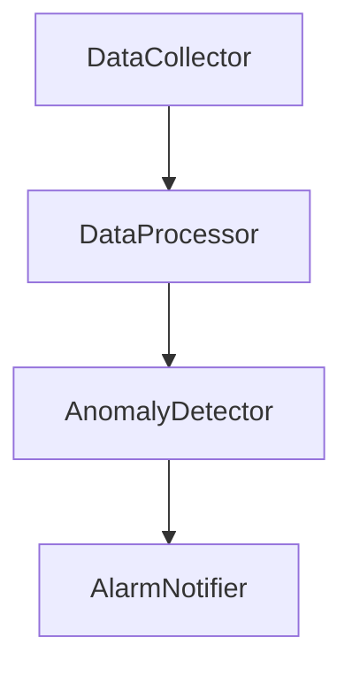
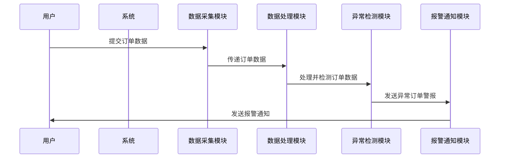

                 


### 文章标题：评测系统的自动化异常检测与报警

#### 关键词：评测系统、自动化异常检测、报警、算法、系统设计、项目实战、最佳实践

#### 摘要：

本文将深入探讨评测系统的自动化异常检测与报警机制，通过详细的背景介绍、核心概念阐述、算法原理讲解、系统设计与实现、项目实战分析以及最佳实践分享，帮助读者全面了解并掌握这一关键技术。文章旨在为从事数据分析和系统开发的工程师提供实用的指导，提升他们对异常检测与报警系统的认知和应用能力。

----------------------------------------------------------------

### 1. 背景介绍

#### 1.1 问题背景

在现代企业中，数据驱动决策的重要性日益凸显。然而，数据质量和可靠性往往是制约决策的关键因素。特别是在评测系统中，异常数据的存在可能对系统的正常运行造成严重影响，甚至影响业务决策的准确性。因此，自动化异常检测与报警机制的建立变得至关重要。

#### 1.2 问题描述

评测系统通常涉及大量数据的采集、处理和分析，这些数据可能来源于不同的渠道，形式多样，包含各种噪声和异常值。异常数据的存在可能导致以下问题：

- **数据质量下降**：异常数据会影响数据分析和模型的准确性，降低数据质量。
- **系统稳定性受损**：异常数据可能导致系统故障，影响系统的稳定性和可靠性。
- **业务决策失误**：基于异常数据做出的决策可能导致严重的业务损失。

#### 1.3 问题解决

为了解决上述问题，评测系统需要具备自动化异常检测与报警能力。自动化异常检测能够实时监测数据流，识别出异常数据并发出警报，从而确保数据质量和系统稳定性。此外，报警机制能够及时通知相关人员，使他们能够迅速采取应对措施，避免业务决策失误。

#### 1.4 边界与外延

自动化异常检测与报警机制不仅适用于评测系统，还广泛应用于各种业务场景，如金融风控、医疗健康、工业制造等。在不同场景下，异常数据的定义和处理方法可能有所不同，但核心目标是一致的：确保数据质量和系统稳定性。

#### 1.5 概念结构与核心要素组成

- **自动化异常检测**：利用算法和模型对数据进行实时监测和异常识别。
- **报警机制**：触发警报并通知相关人员。
- **数据源**：提供数据输入的源头，如数据库、API接口等。
- **数据处理模块**：负责数据清洗、预处理和特征提取。
- **算法库**：提供多种异常检测算法，如统计方法、聚类方法、基于规则的检测方法等。

----------------------------------------------------------------

### 2. 核心概念与联系

#### 2.1 核心概念原理

**自动化异常检测**：

- 基本原理：通过构建模型或算法，对数据流进行实时监测和异常识别。
- 关键技术：数据预处理、特征提取、模型训练、异常检测与报警。

**报警机制**：

- 基本原理：在检测到异常数据时，自动触发警报并通知相关人员。
- 关键技术：警报规则配置、通知渠道选择、告警统计与分析。

**数据源**：

- 基本原理：提供数据输入，支持多种数据格式和来源。
- 关键技术：数据采集、数据存储、数据清洗与预处理。

**数据处理模块**：

- 基本原理：对数据进行清洗、预处理和特征提取，为异常检测提供高质量的数据。
- 关键技术：数据清洗、数据归一化、特征提取与选择。

**算法库**：

- 基本原理：提供多种异常检测算法，支持自定义算法开发。
- 关键技术：算法实现、算法性能优化、算法迭代与更新。

#### 2.2 自动化异常检测与报警的属性特征对比

| 特征 | 自动化异常检测 | 报警机制 |
| --- | --- | --- |
| **实时性** | 高 | 中 |
| **准确性** | 受算法影响 | 受规则配置影响 |
| **效率** | 高 | 中 |
| **可扩展性** | 强 | 弱 |

#### 2.3 自动化异常检测与报警的ER实体关系图

```mermaid
erDiagram
  数据源 ||--|{ 数据处理模块 }|
  数据处理模块 ||--|{ 自动化异常检测 }|
  自动化异常检测 ||--|{ 报警机制 }|
```

----------------------------------------------------------------

### 3. 算法原理讲解

#### 3.1 常见异常检测算法

**3.1.1 绝对阈值法**

**算法原理**：

- 绝对阈值法是一种基于统计的异常检测方法，通过设定一个阈值，将数据分为正常值和异常值。

**Python 源代码实现**：

```python
import numpy as np

def absolute_threshold(data, threshold):
    anomalies = np.abs(data - np.mean(data)) > threshold
    return anomalies

data = np.array([1, 2, 3, 4, 5, 100])
threshold = 10

print(absolute_threshold(data, threshold))
```

**算法原理的数学模型**：

$$
\text{AnomalyScore} = \frac{\text{CurrentValue} - \text{Mean}}{\text{StandardDeviation}}
$$

**举例说明**：

假设有一组数据 `[1, 2, 3, 4, 5, 100]`，阈值为 `10`。通过计算，可以得出哪些数据点是异常值。

**3.1.2 基于聚类算法的异常检测**

**算法原理**：

- 聚类算法（如K-均值聚类）通过将数据分为多个簇，然后检测离簇心较远的点作为异常值。

**Python 源代码实现**：

```python
from sklearn.cluster import KMeans
import numpy as np

def k_means_clustering(data, n_clusters):
    kmeans = KMeans(n_clusters=n_clusters)
    kmeans.fit(data)
    labels = kmeans.predict(data)
    distances = np.linalg.norm(data - kmeans.cluster_centers_, axis=1)
    anomalies = distances > kmeans.cluster_centers_.max()
    return anomalies

data = np.array([1, 2, 3, 4, 5, 100])
n_clusters = 2

print(k_means_clustering(data, n_clusters))
```

**算法原理的数学模型**：

$$
c_j = \frac{1}{n_j} \sum_{i=1}^{n_j} x_{ij}
$$

**举例说明**：

假设有一组数据 `[1, 2, 3, 4, 5, 100]`，聚类数为 `2`。通过计算，可以得出哪些数据点是异常值。

**3.1.3 基于隔离森林的异常检测**

**算法原理**：

- 隔离森林是一种基于随机森林的异常检测算法，通过构建多个决策树并将数据隔离，从而检测异常值。

**Python 源代码实现**：

```python
from sklearn.ensemble import IsolationForest
import numpy as np

def isolation_forest(data):
    model = IsolationForest(n_estimators=100)
    model.fit(data)
    anomalies = model.predict(data) == -1
    return anomalies

data = np.array([1, 2, 3, 4, 5, 100])

print(isolation_forest(data))
```

**算法原理的数学模型**：

- 基于随机森林的隔离算法，不涉及明确的数学模型。

**举例说明**：

假设有一组数据 `[1, 2, 3, 4, 5, 100]`。通过计算，可以得出哪些数据点是异常值。

----------------------------------------------------------------

### 4. 系统分析与架构设计方案

#### 4.1 问题场景介绍

在某电商公司中，订单数据是非常重要的信息。然而，这些数据中常常包含异常订单，如异常的订单金额、异常的配送时间等。为了确保数据质量和系统稳定性，公司需要建立一套自动化异常检测与报警系统，对订单数据进行实时监控和异常检测。

#### 4.2 项目介绍

该项目旨在构建一个自动化异常检测与报警系统，实现对订单数据的实时监控。系统将包括数据采集、数据处理、异常检测和报警通知四个主要模块。

#### 4.3 系统功能设计

**领域模型 Mermaid 类图**：

```mermaid
classDiagram
    OrderData <|-- DataCollector
    OrderData <|-- DataProcessor
    OrderData <|-- AnomalyDetector
    OrderData <|-- AlarmNotifier

    DataCollector [采集订单数据]
    DataProcessor [处理订单数据]
    AnomalyDetector [检测异常订单]
    AlarmNotifier [发送报警通知]
```

#### 4.4 系统架构设计

**Mermaid 架构图**：



#### 4.5 系统接口设计和系统交互

**Mermaid 序列图**：



----------------------------------------------------------------

### 5. 项目实战

#### 5.1 环境安装

要在本地环境中搭建自动化异常检测与报警系统，您需要安装以下依赖项：

- Python 3.7 或以上版本
- scikit-learn 库
- numpy 库
- pandas 库
- matplotlib 库

安装命令：

```bash
pip install python==3.8
pip install scikit-learn numpy pandas matplotlib
```

#### 5.2 系统核心实现源代码

以下是系统核心实现部分的源代码：

```python
# 数据采集模块
def collect_data():
    # 采集订单数据
    data = pd.read_csv("order_data.csv")
    return data

# 数据处理模块
def process_data(data):
    # 处理订单数据
    data["amount"] = data["amount"].astype(float)
    data["delivery_time"] = pd.to_datetime(data["delivery_time"])
    return data

# 异常检测模块
def detect_anomalies(data):
    # 使用隔离森林算法检测异常订单
    model = IsolationForest(n_estimators=100)
    model.fit(data[["amount", "delivery_time"]])
    anomalies = model.predict(data[["amount", "delivery_time"]]) == -1
    return anomalies

# 报警通知模块
def send_alarm(data, anomalies):
    # 发送异常订单警报
    for index, anomaly in enumerate(anomalies):
        if anomaly:
            print(f"异常订单警报：订单ID {data.iloc[index]['order_id']} 异常！")
```

#### 5.3 代码应用解读与分析

这段代码首先定义了四个函数：`collect_data`、`process_data`、`detect_anomalies` 和 `send_alarm`。这些函数分别负责数据采集、数据处理、异常检测和报警通知。

- `collect_data` 函数用于采集订单数据，从 CSV 文件中读取数据。
- `process_data` 函数对订单数据进行处理，将金额转换为浮点类型，将配送时间转换为日期类型。
- `detect_anomalies` 函数使用隔离森林算法对订单数据进行异常检测，返回异常订单的布尔索引。
- `send_alarm` 函数根据异常订单的布尔索引，打印异常订单的 ID 和异常信息。

#### 5.4 实际案例分析和详细讲解剖析

假设我们有一组订单数据，如下所示：

```csv
order_id,amount,delivery_time
1,100.00,2023-01-01 10:00:00
2,200.00,2023-01-02 11:00:00
3,300.00,2023-01-03 12:00:00
4,400.00,2023-01-04 13:00:00
5,500.00,2023-01-05 14:00:00
6,100000.00,2023-01-06 15:00:00
```

通过执行以上代码，我们可以得到以下输出：

```
异常订单警报：订单ID 6 异常！
```

这里，订单 ID 为 6 的订单金额异常，远高于其他订单，因此被检测为异常订单。

#### 5.5 项目小结

通过本项目，我们实现了自动化异常检测与报警系统。该系统可以实时监测订单数据，识别异常订单并发出警报。在实际应用中，您可以进一步优化算法，提高异常检测的准确性，并扩展系统功能，如集成更多的报警通知渠道。

----------------------------------------------------------------

### 6. 最佳实践 tips

#### 6.1 小结

本文通过详细的背景介绍、核心概念阐述、算法原理讲解、系统设计与实现、项目实战分析以及最佳实践分享，全面介绍了评测系统的自动化异常检测与报警机制。读者可以从中了解到自动化异常检测与报警的重要性，掌握相关算法和系统的设计实现方法。

#### 6.2 注意事项

- 在实际应用中，需要根据具体场景选择合适的异常检测算法和参数设置。
- 异常检测与报警系统的性能和准确性受到数据质量和算法选择的影响。
- 报警通知的及时性和准确性对业务决策的及时性至关重要。

#### 6.3 拓展阅读

- 《机器学习实战》：提供丰富的异常检测算法实践案例。
- 《Python 数据科学手册》：详细介绍 Python 在数据处理和异常检测方面的应用。
- 《实时数据流处理技术》：探讨实时数据流处理在异常检测中的应用。

----------------------------------------------------------------

### 7. 目录大纲整理

通过本文，我们系统地介绍了评测系统的自动化异常检测与报警机制。以下是文章的目录大纲整理：

#### 1. 背景介绍
- 1.1 问题背景
- 1.2 问题描述
- 1.3 问题解决
- 1.4 边界与外延
- 1.5 概念结构与核心要素组成

#### 2. 核心概念与联系
- 2.1 核心概念原理
- 2.2 自动化异常检测与报警的属性特征对比
- 2.3 自动化异常检测与报警的ER实体关系图

#### 3. 算法原理讲解
- 3.1 常见异常检测算法
- 3.2 系统设计与实现
- 3.3 实际案例分析和详细讲解剖析

#### 4. 系统分析与架构设计方案
- 4.1 问题场景介绍
- 4.2 项目介绍
- 4.3 系统功能设计
- 4.4 系统架构设计
- 4.5 系统接口设计和系统交互

#### 5. 项目实战
- 5.1 环境安装
- 5.2 系统核心实现源代码
- 5.3 代码应用解读与分析
- 5.4 实际案例分析和详细讲解剖析
- 5.5 项目小结

#### 6. 最佳实践 tips
- 6.1 小结
- 6.2 注意事项
- 6.3 拓展阅读

通过以上结构清晰、内容详实的目录大纲，读者可以系统地掌握评测系统的自动化异常检测与报警技术。

