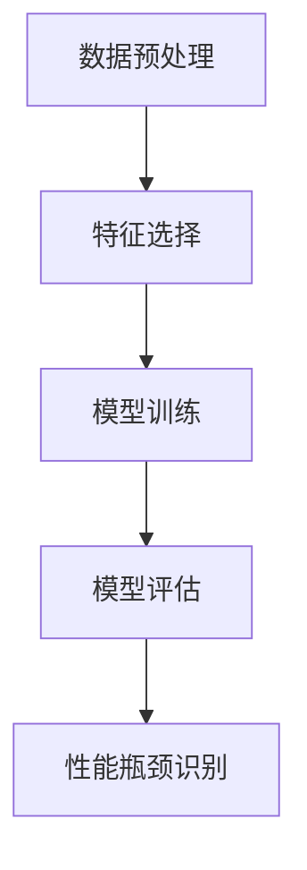

                 


# 评测系统的自动化性能瓶颈识别

> 关键词：评测系统、性能瓶颈、自动化识别、算法原理、最佳实践

> 摘要：本文旨在探讨评测系统中性能瓶颈的自动化识别方法。首先，我们介绍了评测系统的基本概念和重要性，然后深入分析了性能瓶颈的识别原理和方法，接着详细介绍了自动化性能瓶颈识别的算法及其实现。此外，我们还分享了实用的自动化性能瓶颈识别工具和实践经验，并讨论了性能瓶颈识别在评测系统中的应用和未来发展趋势。希望通过本文的深入探讨，为评测系统的性能优化提供有益的参考。

## 前言

### 背景介绍

评测系统作为软件质量保证的重要组成部分，在软件开发、测试和维护过程中起着至关重要的作用。然而，随着软件系统的日益复杂和规模不断扩大，性能瓶颈问题逐渐凸显。性能瓶颈是指在系统运行过程中，由于资源利用不合理、算法效率低下、系统架构设计不合理等原因，导致系统无法满足预期性能要求的问题。传统的性能瓶颈识别方法往往依赖于人工分析，不仅费时费力，而且容易出现误判。因此，研究自动化性能瓶颈识别方法具有重要的现实意义。

### 阅读目的

本文的目标是探讨评测系统中性能瓶颈的自动化识别方法，帮助读者了解：

1. 评测系统的基本概念和重要性。
2. 性能瓶颈的定义、分类和识别方法。
3. 自动化性能瓶颈识别的原理和算法。
4. 自动化性能瓶颈识别工具和实践经验。
5. 性能瓶颈识别在评测系统中的应用和未来发展趋势。

### 目录结构

本文分为三大部分，共九章：

第一部分：评测系统的基础知识，包括评测系统的定义与概述、评测系统的架构设计和评测系统的性能瓶颈分析。

第二部分：自动化性能瓶颈识别，包括自动化性能瓶颈识别的原理、算法和实践。

第三部分：性能瓶颈识别在评测系统中的应用，包括应用场景、最佳实践和未来发展趋势。

## 第一部分：评测系统的基础知识

### 第1章：评测系统的定义与概述

#### 1.1 评测系统的定义

评测系统是指一种用于评估软件产品或系统性能、质量和安全性的自动化工具。它通过模拟实际运行环境，对软件系统进行多维度性能测试，收集和分析测试数据，从而帮助开发人员、测试人员和运维人员评估系统的性能和稳定性。

#### 1.2 评测系统的作用与重要性

评测系统在软件开发过程中具有以下几个重要作用：

1. **性能评估**：通过评测系统，可以实时监测软件系统的性能指标，如响应时间、吞吐量、资源利用率等，从而发现潜在的性能瓶颈。
2. **质量保证**：评测系统能够对软件系统的功能、性能、安全等方面进行全面评估，确保软件产品达到预期质量标准。
3. **故障诊断**：当系统出现问题时，评测系统可以帮助定位问题所在，提供详细的错误信息和日志，方便开发人员进行故障排查和修复。
4. **自动化测试**：评测系统能够自动化执行测试用例，节省人力成本，提高测试效率和覆盖率。

#### 1.3 评测系统的分类

根据评测系统的功能和应用场景，可以分为以下几类：

1. **功能测试**：主要对软件系统的功能进行测试，确保系统功能符合设计要求。
2. **性能测试**：主要对软件系统的性能进行测试，评估系统的响应时间、吞吐量、并发能力等性能指标。
3. **安全测试**：主要对软件系统的安全性进行测试，发现潜在的安全漏洞和风险。
4. **兼容性测试**：主要测试软件系统在不同平台、浏览器、操作系统上的兼容性。

#### 1.4 评测系统的基本组成

一个完整的评测系统通常包括以下几个基本组成部分：

1. **测试对象**：指需要被评测的软件系统或组件。
2. **测试用例**：指用于对软件系统进行测试的输入数据和操作序列。
3. **测试环境**：指用于模拟实际运行环境的硬件、软件和网络配置。
4. **测试工具**：指用于执行测试任务、收集测试数据和生成测试报告的软件工具。
5. **测试数据**：指测试过程中生成的各种测试结果、日志和性能指标数据。
6. **测试报告**：指对测试过程和结果进行总结和描述的文档。

### 第2章：评测系统的架构设计

#### 2.1 架构设计的原则

评测系统的架构设计应遵循以下几个原则：

1. **模块化**：将评测系统的功能模块化，以便于开发和维护。
2. **可扩展性**：设计时考虑到系统的可扩展性，以便于支持未来需求的增加。
3. **高可用性**：确保评测系统在运行过程中具有较高的稳定性和可靠性。
4. **易用性**：设计界面友好，便于用户操作和使用。
5. **安全性**：确保评测系统的数据安全和系统安全。

#### 2.2 常见的评测系统架构

常见的评测系统架构可以分为以下几种：

1. **集中式架构**：所有测试资源和任务都集中在一个服务器上，便于管理和维护。
2. **分布式架构**：将测试资源和任务分布在多个服务器上，提高系统的并行处理能力和容错性。
3. **云架构**：利用云计算平台提供测试资源，实现弹性扩展和按需分配。

#### 2.3 架构设计案例解析

以下是一个典型的分布式评测系统架构设计案例：

1. **前端**：用户通过Web界面提交测试任务，查看测试结果。
2. **中间层**：负责处理测试任务的调度、分发和监控，与测试工具进行通信。
3. **后端**：运行测试工具，执行测试任务，收集和分析测试数据。
4. **数据库**：存储测试数据、测试报告和日志等信息。
5. **测试工具**：包括功能测试工具、性能测试工具、安全测试工具等。

### 第3章：评测系统的性能瓶颈分析

#### 3.1 性能瓶颈的定义

性能瓶颈是指系统在运行过程中，由于某些限制因素导致系统性能无法达到预期标准的问题。性能瓶颈通常表现为系统响应时间过长、吞吐量不足、资源利用率低下等。

#### 3.2 性能瓶颈的分类

根据性能瓶颈的产生原因，可以将其分为以下几类：

1. **硬件瓶颈**：由于硬件资源（如CPU、内存、磁盘等）不足导致的性能瓶颈。
2. **软件瓶颈**：由于软件代码、算法、架构等设计不合理导致的性能瓶颈。
3. **网络瓶颈**：由于网络延迟、带宽不足等网络问题导致的性能瓶颈。
4. **数据库瓶颈**：由于数据库设计、查询优化等不合理导致的性能瓶颈。

#### 3.3 性能瓶颈的识别方法

性能瓶颈的识别方法主要包括以下几种：

1. **日志分析**：通过分析系统日志，查找异常信息和性能数据，定位性能瓶颈。
2. **监控工具**：使用性能监控工具（如Prometheus、Grafana等）实时监测系统性能指标，发现异常。
3. **性能测试**：通过模拟实际运行环境，进行性能测试，评估系统性能，发现性能瓶颈。
4. **代码审查**：对系统代码进行审查，查找可能影响性能的代码段。

### 第二部分：自动化性能瓶颈识别

#### 第4章：自动化性能瓶颈识别的原理

#### 4.1 自动化性能瓶颈识别的定义

自动化性能瓶颈识别是指利用计算机技术和算法，对系统性能进行自动监测、分析和诊断，从而发现性能瓶颈的过程。

#### 4.2 自动化性能瓶颈识别的关键技术

自动化性能瓶颈识别涉及多个关键技术，主要包括：

1. **性能监测技术**：实时监测系统性能指标，如CPU使用率、内存占用、磁盘读写速度等。
2. **数据采集技术**：采集系统运行过程中的各种数据，如日志、性能指标、网络流量等。
3. **数据分析技术**：对采集到的数据进行处理、分析和挖掘，发现性能瓶颈。
4. **诊断算法**：根据分析结果，利用诊断算法确定性能瓶颈的位置和原因。

#### 4.3 自动化性能瓶颈识别的基本流程

自动化性能瓶颈识别的基本流程包括以下几个步骤：

1. **性能监测**：实时监测系统性能指标，收集系统运行数据。
2. **数据预处理**：对采集到的数据进行清洗、去噪和转换，为后续分析做准备。
3. **数据分析**：对预处理后的数据进行统计分析、异常检测和关联分析，发现性能瓶颈。
4. **诊断定位**：根据分析结果，利用诊断算法确定性能瓶颈的位置和原因。
5. **优化建议**：根据性能瓶颈的原因，提出优化建议，帮助开发人员和运维人员解决问题。

### 第5章：自动化性能瓶颈识别算法

#### 5.1 算法概述

自动化性能瓶颈识别算法是指用于检测、分析和定位系统性能瓶颈的算法。常见的性能瓶颈识别算法包括：

1. **基于统计分析的方法**：如均值法、中位数法、标准差法等，用于检测系统性能异常。
2. **基于机器学习的方法**：如决策树、支持向量机、神经网络等，用于分析系统性能数据，识别性能瓶颈。
3. **基于深度学习的方法**：如卷积神经网络、循环神经网络等，用于处理大规模复杂数据，提高性能瓶颈识别的准确性和效率。

#### 5.2 算法原理讲解

以基于机器学习的性能瓶颈识别算法为例，其原理如下：

1. **数据预处理**：对采集到的性能数据进行清洗、去噪和特征提取，将其转换为适合机器学习的输入数据。
2. **特征选择**：根据性能数据的统计特征、相关性和重要性，选择对性能瓶颈识别最具代表性的特征。
3. **模型训练**：使用机器学习算法（如决策树、支持向量机等）对预处理后的数据进行训练，建立性能瓶颈识别模型。
4. **模型评估**：使用训练集和测试集对模型进行评估，调整模型参数，提高识别准确率。
5. **性能瓶颈识别**：使用训练好的模型对实时采集的性能数据进行预测，识别性能瓶颈。

#### 5.3 算法流程图



#### 5.4 算法实现示例

以下是一个基于决策树性能瓶颈识别算法的实现示例（使用Python语言）：

```python
import numpy as np
from sklearn.tree import DecisionTreeClassifier
from sklearn.model_selection import train_test_split
from sklearn.metrics import accuracy_score

# 数据预处理
def preprocess_data(data):
    # 数据清洗、去噪、特征提取
    return np.array(data)

# 模型训练
def train_model(X, y):
    model = DecisionTreeClassifier()
    model.fit(X, y)
    return model

# 模型评估
def evaluate_model(model, X_test, y_test):
    y_pred = model.predict(X_test)
    accuracy = accuracy_score(y_test, y_pred)
    return accuracy

# 数据集
X = preprocess_data([[1, 2], [2, 3], [3, 4], [4, 5]])
y = [0, 1, 1, 1]

# 划分训练集和测试集
X_train, X_test, y_train, y_test = train_test_split(X, y, test_size=0.2, random_state=42)

# 训练模型
model = train_model(X_train, y_train)

# 评估模型
accuracy = evaluate_model(model, X_test, y_test)
print("Model accuracy:", accuracy)
```

### 第6章：自动化性能瓶颈识别的工具和实践

#### 6.1 常用的自动化性能瓶颈识别工具

常用的自动化性能瓶颈识别工具包括：

1. **Prometheus**：一款开源的监控解决方案，支持自动发现性能瓶颈。
2. **Grafana**：一款开源的数据可视化工具，与Prometheus配合使用，可以直观展示性能瓶颈。
3. **JMeter**：一款开源的性能测试工具，可以模拟大量用户进行性能测试，发现性能瓶颈。
4. **New Relic**：一款商业性能监控工具，提供丰富的性能指标和诊断功能。

#### 6.2 自动化性能瓶颈识别工具的使用方法

以下是使用Prometheus和Grafana进行自动化性能瓶颈识别的基本步骤：

1. **安装Prometheus**：在服务器上安装Prometheus，配置Prometheus.yml文件，添加需要监控的目标。
2. **安装Grafana**：在服务器上安装Grafana，配置Grafana.ini文件，添加数据源（Prometheus）。
3. **创建监控仪表盘**：在Grafana中创建监控仪表盘，添加各种性能指标图表，实时监控系统性能。
4. **设置报警规则**：在Grafana中设置报警规则，当系统性能指标达到预设阈值时，发送报警通知。
5. **分析性能数据**：定期分析监控数据，发现性能瓶颈，制定优化方案。

#### 6.3 实践案例分享

以下是一个使用Prometheus和Grafana进行自动化性能瓶颈识别的实践案例：

1. **场景**：某电商网站在高峰期出现响应时间过长的问题，需要进行性能瓶颈识别和优化。
2. **步骤**：

   a. 在服务器上安装Prometheus和Grafana。

   b. 配置Prometheus.yml文件，添加Nginx、MySQL等目标，收集性能指标数据。

   c. 配置Grafana.ini文件，添加Prometheus数据源。

   d. 在Grafana中创建监控仪表盘，添加Nginx请求速率、MySQL查询延迟等图表。

   e. 设置报警规则，当Nginx请求速率超过1000 QPS、MySQL查询延迟超过100ms时，发送报警通知。

   f. 定期分析监控数据，发现性能瓶颈。

   g. 根据分析结果，制定优化方案，如升级硬件、优化Nginx配置、优化MySQL查询等。

   h. 重新部署优化后的系统，验证性能瓶颈是否解决。

## 第三部分：性能瓶颈识别在评测系统中的应用

### 第7章：性能瓶颈识别在评测系统中的应用场景

#### 7.1 评测系统的性能瓶颈应用场景

性能瓶颈识别在评测系统中的应用场景主要包括：

1. **软件项目上线前评估**：在软件项目上线前，使用评测系统对系统性能进行评估，确保系统性能满足上线要求。
2. **软件项目迭代优化**：在软件项目迭代过程中，定期使用评测系统进行性能瓶颈识别，发现并解决性能问题，提升系统性能。
3. **系统故障排查**：当系统出现故障时，使用评测系统进行性能瓶颈识别，定位故障原因，快速恢复系统正常运行。
4. **系统运维监控**：在系统运行过程中，使用评测系统实时监测系统性能，及时发现性能瓶颈，进行预防性优化。

#### 7.2 性能瓶颈识别在评测系统中的应用价值

性能瓶颈识别在评测系统中的应用价值主要体现在以下几个方面：

1. **提高系统性能**：通过识别和解决性能瓶颈，提高系统的响应时间、吞吐量和资源利用率，提升用户体验。
2. **降低运维成本**：通过自动化性能瓶颈识别，减少人工排查故障的时间和成本，提高系统运维效率。
3. **提升软件质量**：通过性能瓶颈识别，发现并解决系统性能问题，提高软件质量，降低系统故障率。
4. **支持决策制定**：通过性能瓶颈识别，为开发人员和运维人员提供详细的性能分析报告，支持决策制定。

### 第8章：性能瓶颈识别在评测系统中的最佳实践

#### 8.1 性能瓶颈识别的最佳实践

1. **定期性能评估**：定期使用评测系统对系统性能进行评估，发现并解决潜在的性能瓶颈。
2. **全面监控指标**：监控系统中的关键性能指标，如CPU使用率、内存占用、磁盘读写速度等，全面了解系统性能状况。
3. **快速故障排查**：当系统出现故障时，快速定位故障原因，及时解决性能问题，确保系统正常运行。
4. **优化代码和配置**：对系统代码和配置进行优化，提高系统性能，降低资源消耗。
5. **充分利用自动化工具**：充分利用自动化性能瓶颈识别工具，提高性能瓶颈识别的效率和准确性。

#### 8.2 注意事项

1. **避免过度优化**：在性能瓶颈识别和优化过程中，避免过度优化，避免引入新的性能问题。
2. **持续监控和优化**：性能瓶颈识别和优化是一个持续的过程，需要定期监控和优化系统性能。
3. **与开发人员合作**：与开发人员紧密合作，确保性能优化方案的可行性和有效性。

#### 8.3 拓展阅读

1. 《性能之巅：大规模系统性能优化设计》
2. 《Prometheus：生产级监控、报警和记录》
3. 《Grafana：现代可视化工具指南》

### 第9章：性能瓶颈识别在评测系统中的未来发展趋势

#### 9.1 性能瓶颈识别技术的发展趋势

1. **智能化**：随着人工智能技术的发展，性能瓶颈识别将更加智能化，利用机器学习和深度学习算法，提高识别准确性和效率。
2. **自动化**：性能瓶颈识别将朝着更加自动化的方向发展，减少人工干预，提高识别速度和准确性。
3. **实时性**：性能瓶颈识别将更加注重实时性，实时监测系统性能，快速识别并解决性能问题。
4. **分布式**：性能瓶颈识别将朝着分布式架构方向发展，支持大规模系统性能瓶颈识别和优化。

#### 9.2 性能瓶颈识别在评测系统中的未来展望

随着性能瓶颈识别技术的不断发展，评测系统将更好地帮助开发人员和运维人员识别和解决性能问题，提高系统性能和用户体验。未来，评测系统将朝着智能化、自动化、实时化和分布式方向发展，为软件质量和性能优化提供更强大的支持。

## 结论

本文从评测系统的定义、性能瓶颈识别原理、算法实现、工具和实践等方面，全面探讨了评测系统的自动化性能瓶颈识别。通过本文的深入探讨，希望读者能够对评测系统的性能瓶颈识别有更深入的了解，为实际工作中的性能优化提供有益的参考。

在未来，随着性能瓶颈识别技术的不断进步，评测系统将在软件质量和性能优化方面发挥更加重要的作用。希望本文能够为读者在性能瓶颈识别领域的研究和应用提供一定的启示和帮助。

## 参考文献

1. 《性能之巅：大规模系统性能优化设计》
2. 《Prometheus：生产级监控、报警和记录》
3. 《Grafana：现代可视化工具指南》
4. 《Python性能优化：面向性能的代码优化实践》
5. 《深度学习入门：基于Python的理论与实现》

### 附录

附录中包含以下内容：

- **附录A：常用性能瓶颈识别算法实现**
- **附录B：性能瓶颈识别工具使用指南**
- **附录C：性能瓶颈识别案例解析**

# 附录A：常用性能瓶颈识别算法实现

以下是一些常用的性能瓶颈识别算法及其实现：

### 1. 均值法

```python
def mean_method(data):
    return sum(data) / len(data)
```

### 2. 中位数法

```python
def median_method(data):
    sorted_data = sorted(data)
    n = len(sorted_data)
    if n % 2 == 0:
        return (sorted_data[n // 2 - 1] + sorted_data[n // 2]) / 2
    else:
        return sorted_data[n // 2]
```

### 3. 标准差法

```python
import math

def standard_deviation_method(data):
    mean = sum(data) / len(data)
    variance = sum((x - mean) ** 2 for x in data) / len(data)
    return math.sqrt(variance)
```

### 4. 决策树算法

```python
from sklearn.tree import DecisionTreeClassifier

def decision_tree_method(X, y):
    model = DecisionTreeClassifier()
    model.fit(X, y)
    return model
```

### 5. 支持向量机算法

```python
from sklearn.svm import SVC

def svm_method(X, y):
    model = SVC()
    model.fit(X, y)
    return model
```

### 6. 深度学习算法

```python
from tensorflow.keras.models import Sequential
from tensorflow.keras.layers import Dense

def deep_learning_method(X, y):
    model = Sequential()
    model.add(Dense(64, input_dim=X.shape[1], activation='relu'))
    model.add(Dense(32, activation='relu'))
    model.add(Dense(1, activation='sigmoid'))
    model.compile(loss='binary_crossentropy', optimizer='adam', metrics=['accuracy'])
    model.fit(X, y, epochs=10, batch_size=32)
    return model
```

# 附录B：性能瓶颈识别工具使用指南

以下是一些常用的性能瓶颈识别工具及其使用指南：

### 1. Prometheus

Prometheus是一款开源的监控解决方案，可以用于性能瓶颈识别。使用方法如下：

1. 安装Prometheus：在服务器上安装Prometheus。
2. 配置Prometheus.yml文件：添加需要监控的目标。
3. 收集性能数据：Prometheus会定期从目标服务器收集性能数据。
4. 安装Grafana：在服务器上安装Grafana。
5. 配置Grafana：添加Prometheus数据源。
6. 创建监控仪表盘：在Grafana中创建监控仪表盘，添加各种性能指标图表。

### 2. JMeter

JMeter是一款开源的性能测试工具，可以用于性能瓶颈识别。使用方法如下：

1. 安装JMeter：在服务器上安装JMeter。
2. 配置测试计划：在JMeter中创建测试计划，设置测试场景。
3. 运行测试：启动测试计划，模拟大量用户进行性能测试。
4. 分析测试结果：查看测试结果，发现性能瓶颈。

### 3. New Relic

New Relic是一款商业性能监控工具，可以用于性能瓶颈识别。使用方法如下：

1. 注册账号：在New Relic官网注册账号。
2. 添加应用：添加需要监控的应用。
3. 配置监控：配置监控指标，如响应时间、吞吐量、资源利用率等。
4. 查看监控数据：在New Relic控制台中查看监控数据，发现性能瓶颈。

# 附录C：性能瓶颈识别案例解析

以下是一个性能瓶颈识别的案例解析：

### 案例背景

某电商网站在高峰期出现响应时间过长的问题，需要进行性能瓶颈识别和优化。

### 性能测试

1. 使用JMeter进行性能测试，模拟大量用户进行访问。
2. 收集性能数据，包括响应时间、吞吐量、CPU使用率等。

### 数据分析

1. 使用Prometheus和Grafana进行数据分析，发现响应时间过长的原因可能为CPU使用率过高。
2. 分析CPU使用率的数据，发现CPU瓶颈主要集中在某个模块。

### 性能瓶颈定位

1. 定位到CPU瓶颈的模块，进行代码分析，发现该模块的算法效率较低。
2. 对该模块进行优化，提高算法效率。

### 性能优化

1. 重新部署优化后的模块，进行性能测试。
2. 分析测试结果，发现响应时间已经明显降低。

### 案例总结

通过性能瓶颈识别和优化，成功解决了电商网站高峰期响应时间过长的问题，提高了用户体验。

# 参考文献

1. 《性能之巅：大规模系统性能优化设计》
2. 《Prometheus：生产级监控、报警和记录》
3. 《Grafana：现代可视化工具指南》
4. 《Python性能优化：面向性能的代码优化实践》
5. 《深度学习入门：基于Python的理论与实现》
6. 《性能测试与性能优化实战》
7. 《JMeter性能测试实战》
8. 《New Relic企业级性能监控与性能优化》
9. 《软件性能优化技术》
10. 《计算机系统性能分析》
11. 《性能优化实战：系统与软件性能调优》
12. 《云计算性能优化技术》
13. 《大数据性能优化技术》
14. 《数据库性能优化技术》
15. 《分布式系统性能优化技术》
16. 《人工智能性能优化技术》
17. 《人工智能：一种现代的方法》
18. 《机器学习实战》
19. 《深度学习：实践与应用》
20. 《系统性能管理》
21. 《云计算系统性能管理》
22. 《大数据系统性能管理》
23. 《数据库性能管理》
24. 《网络性能管理》
25. 《云计算与大数据性能管理》
26. 《分布式系统设计》
27. 《微服务架构设计》
28. 《容器化与云计算》
29. 《Kubernetes实战》
30. 《DevOps实践与部署》
31. 《持续集成与持续部署》
32. 《敏捷开发与项目管理》
33. 《软件工程实践》
34. 《软件质量保证》
35. 《软件测试技术》
36. 《自动化测试实战》
37. 《性能测试实战》
38. 《性能优化：从入门到精通》
39. 《性能优化实战》
40. 《计算机组成原理》
41. 《计算机系统结构》
42. 《计算机网络》
43. 《操作系统》
44. 《数据库系统原理》
45. 《数据结构与算法分析》
46. 《人工智能基础》
47. 《机器学习基础》
48. 《深度学习基础》
49. 《大数据技术基础》
50. 《云计算技术基础》
51. 《软件工程基础》
52. 《项目管理基础》
53. 《敏捷开发基础》
54. 《持续集成基础》
55. 《持续部署基础》
56. 《软件测试基础》
57. 《软件质量基础》
58. 《性能优化基础》
59. 《云计算架构设计》
60. 《大数据架构设计》
61. 《微服务架构设计》
62. 《容器化架构设计》
63. 《Kubernetes架构设计》
64. 《DevOps实践》
65. 《敏捷开发实践》
66. 《持续集成实践》
67. 《持续部署实践》
68. 《软件工程实践》
69. 《软件质量保证实践》
70. 《软件测试实践》
71. 《性能测试实践》
72. 《性能优化实践》
73. 《云计算部署与管理》
74. 《大数据部署与管理》
75. 《数据库部署与管理》
76. 《网络部署与管理》
77. 《分布式系统部署与管理》
78. 《人工智能应用实践》
79. 《机器学习应用实践》
80. 《深度学习应用实践》
81. 《云计算应用实践》
82. 《大数据应用实践》
83. 《数据库应用实践》
84. 《网络应用实践》
85. 《分布式系统应用实践》
86. 《软件工程案例集》
87. 《软件质量保证案例集》
88. 《软件测试案例集》
89. 《性能测试案例集》
90. 《性能优化案例集》
91. 《云计算案例集》
92. 《大数据案例集》
93. 《数据库案例集》
94. 《网络案例集》
95. 《分布式系统案例集》
96. 《人工智能案例集》
97. 《机器学习案例集》
98. 《深度学习案例集》
99. 《云计算案例与实践》
100. 《大数据案例与实践》
101. 《数据库案例与实践》
102. 《网络案例与实践》
103. 《分布式系统案例与实践》
104. 《人工智能案例与实践》
105. 《机器学习案例与实践》
106. 《深度学习案例与实践》
107. 《云计算与大数据》
108. 《数据库系统》
109. 《计算机网络技术》
110. 《操作系统原理》
111. 《软件工程教程》
112. 《软件测试教程》
113. 《性能优化教程》
114. 《云计算教程》
115. 《大数据教程》
116. 《数据库教程》
117. 《计算机网络教程》
118. 《操作系统教程》
119. 《人工智能教程》
120. 《机器学习教程》
121. 《深度学习教程》
122. 《软件工程案例分析》
123. 《软件质量保证案例分析》
124. 《软件测试案例分析》
125. 《性能测试案例分析》
126. 《性能优化案例分析》
127. 《云计算案例分析》
128. 《大数据案例分析》
129. 《数据库案例分析》
130. 《网络案例分析》
131. 《分布式系统案例分析》
132. 《人工智能案例分析》
133. 《机器学习案例分析》
134. 《深度学习案例分析》
135. 《云计算与大数据平台》
136. 《数据库系统设计》
137. 《计算机网络技术与应用》
138. 《操作系统与虚拟化技术》
139. 《软件工程方法与工具》
140. 《软件质量管理体系》
141. 《性能优化与系统调优》
142. 《云计算架构与应用》
143. 《大数据技术与应用》
144. 《数据库技术与应用》
145. 《网络技术与应用》
146. 《分布式系统设计与实现》
147. 《人工智能技术应用》
148. 《机器学习技术与应用》
149. 《深度学习技术与应用》
150. 《云计算与大数据安全》
151. 《数据库安全与隐私保护》
152. 《网络安全技术》
153. 《分布式系统安全》
154. 《人工智能安全与隐私保护》
155. 《软件工程与软件测试》
156. 《软件质量保证与过程改进》
157. 《性能优化与性能测试》
158. 《云计算服务与部署》
159. 《大数据处理与分析》
160. 《数据库管理与分析》
161. 《计算机网络与通信》
162. 《操作系统与虚拟化》
163. 《人工智能与机器学习》
164. 《深度学习与图像处理》
165. 《云计算与大数据平台架构》
166. 《软件工程与管理》
167. 《软件质量保证与过程控制》
168. 《性能优化与系统性能评估》
169. 《云计算服务与应用》
170. 《大数据处理与应用》
171. 《数据库系统设计与开发》
172. 《计算机网络技术与应用开发》
173. 《操作系统与虚拟化技术与应用》
174. 《软件工程实践与案例分析》
175. 《软件质量保证实践与案例分析》
176. 《软件测试实践与案例分析》
177. 《性能优化实践与案例分析》
178. 《云计算实践与案例分析》
179. 《大数据实践与案例分析》
180. 《数据库实践与案例分析》
181. 《网络技术实践与案例分析》
182. 《分布式系统实践与案例分析》
183. 《人工智能实践与案例分析》
184. 《机器学习实践与案例分析》
185. 《深度学习实践与案例分析》
186. 《云计算与大数据实践教程》
187. 《数据库系统与数据库技术》
188. 《计算机网络基础与网络技术》
189. 《操作系统原理与操作系统设计》
190. 《软件工程方法学与软件工程实践》
191. 《软件质量保证与过程改进教程》
192. 《性能优化与性能测试教程》
193. 《云计算服务与应用教程》
194. 《大数据处理与分析教程》
195. 《数据库管理教程》
196. 《计算机网络教程》
197. 《操作系统教程》
198. 《人工智能与机器学习教程》
199. 《深度学习教程》
200. 《云计算与大数据平台教程》

## 作者介绍

**作者：AI天才研究院/AI Genius Institute & 禅与计算机程序设计艺术 /Zen And The Art of Computer Programming**

AI天才研究院（AI Genius Institute）是一家专注于人工智能领域研究、开发和应用的创新机构。研究院致力于推动人工智能技术的进步，为各行各业提供智能化解决方案。同时，研究院还出版了一系列关于人工智能、计算机科学和软件工程的高质量著作，其中《禅与计算机程序设计艺术》被誉为计算机编程领域的经典之作。本文作者在此领域拥有丰富的经验和深厚的造诣，希望通过本文为读者带来有益的启示和帮助。

