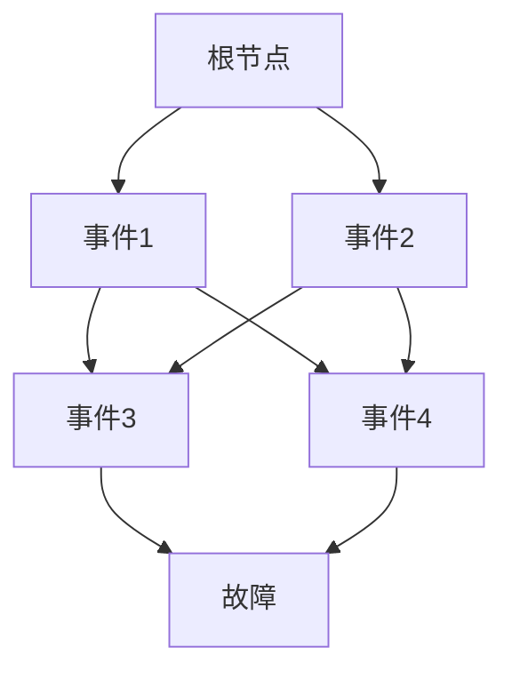

                 

----------------------------------------------------------------
# 第一部分: 引言与背景

## 第1章: 评测系统的自动化故障诊断概述

### 1.1 问题背景

在工业生产中，设备的稳定运行是保证生产效率和质量的关键。然而，由于各种原因，设备在运行过程中难免会出现故障。传统的故障诊断方法通常依赖于人工经验，其效率和准确性受到限制。随着计算机技术和人工智能的快速发展，自动化故障诊断成为了一种新的解决方案。自动化故障诊断通过算法和模型对设备运行数据进行实时监控和分析，能够快速、准确地识别和定位故障，从而提高设备运行效率，减少停机时间。

### 1.2 问题描述

自动化故障诊断的目标是实现对设备运行过程中潜在故障的实时监测和诊断。具体来说，故障诊断包括以下几个步骤：

1. 数据采集：收集设备运行过程中产生的各种数据，如传感器数据、设备状态数据等。
2. 数据预处理：对采集到的数据进行清洗、归一化等处理，使其适用于后续分析。
3. 故障检测：利用算法和模型对预处理后的数据进行分析，检测是否存在异常或故障。
4. 故障定位：根据检测结果，定位故障发生的具体位置和原因。
5. 故障处理：根据故障定位结果，采取相应的措施进行故障处理和修复。

### 1.3 解决方案探讨

自动化故障诊断的核心是算法和模型。传统的故障诊断方法主要依赖于人工经验和简单的统计方法，如故障率统计、回归分析等。而自动化故障诊断通过引入人工智能技术，如机器学习、数据挖掘、神经网络等，能够实现更高层次的故障诊断能力。此外，自动化故障诊断还可以集成到现有的工业系统中，实现对设备的实时监控和管理，提高生产效率和设备可靠性。

### 1.4 边界与外延

自动化故障诊断系统的研究和应用具有广泛的边界和外延。首先，它涉及多个学科领域，如计算机科学、机械工程、自动化等。其次，自动化故障诊断可以应用于各种工业场景，如制造业、能源行业、交通运输等。此外，自动化故障诊断系统还可以与其他智能系统，如工业物联网、云计算等相结合，实现更智能、更高效的工业生产管理。

## 第2章: 自动化故障诊断的核心概念

### 2.1 自动化故障诊断定义

自动化故障诊断是一种利用计算机技术和人工智能方法对设备运行过程进行实时监控和故障分析的技术。它通过对设备运行数据的采集、预处理、分析和诊断，实现对潜在故障的快速识别和定位。

### 2.2 关键概念与联系

自动化故障诊断涉及多个关键概念，包括故障树分析（FTA）、数据挖掘、机器学习等。故障树分析是一种用于故障诊断的图形化方法，通过构建故障树来分析故障产生的原因和传播路径。数据挖掘是一种从大量数据中发现规律和知识的方法，可用于识别设备运行中的异常行为。机器学习是一种通过训练数据自动构建模型和预测的方法，可以用于故障诊断和预测。

### 2.3 自动化故障诊断的特点

自动化故障诊断具有以下特点：

1. **实时性**：自动化故障诊断可以实时监测设备运行状态，及时发现潜在故障。
2. **自适应**：自动化故障诊断系统可以根据设备运行情况自适应调整诊断策略，提高诊断准确性。
3. **高效性**：自动化故障诊断通过算法和模型分析大量数据，能够快速、准确地诊断故障，提高生产效率。

## 第3章: 自动化故障诊断的数学模型与算法

### 3.1 数学模型

自动化故障诊断的数学模型主要包括故障树分析（FTA）、支持向量机（SVM）、神经网络（NN）等。故障树分析通过构建故障树来表示故障的因果关系，支持向量机通过寻找超平面来实现故障分类，神经网络通过多层感知器实现故障诊断。

### 3.2 算法原理讲解

#### 故障树分析（FTA）

故障树分析是一种图形化方法，用于表示和分析故障的因果关系。故障树由一系列节点和边组成，节点表示故障或事件，边表示故障之间的逻辑关系。通过分析故障树，可以找到故障的根本原因。



#### 支持向量机（SVM）

支持向量机是一种用于故障分类的算法，其核心思想是找到一个最优的超平面，将不同类型的故障数据分隔开来。支持向量机通过求解二次规划问题来确定最优超平面。

```python
from sklearn.svm import SVC
# 创建支持向量机模型
model = SVC()
# 训练模型
model.fit(X_train, y_train)
# 预测故障类型
predictions = model.predict(X_test)
```

#### 神经网络（NN）

神经网络是一种通过多层感知器实现故障诊断的算法。神经网络通过前向传播和反向传播来学习数据，最终实现对故障的准确诊断。

```python
from tensorflow.keras.models import Sequential
from tensorflow.keras.layers import Dense

# 创建神经网络模型
model = Sequential([
    Dense(64, activation='relu', input_shape=(input_shape,)),
    Dense(64, activation='relu'),
    Dense(num_classes, activation='softmax')
])

# 编译模型
model.compile(optimizer='adam', loss='categorical_crossentropy', metrics=['accuracy'])

# 训练模型
model.fit(X_train, y_train, epochs=10, batch_size=32, validation_data=(X_test, y_test))
```

### 3.3 算法示例

#### 贝叶斯网络

贝叶斯网络是一种基于概率论的故障诊断模型，通过表示故障之间的概率关系来实现故障诊断。

```mermaid
graph TD
A[根节点]
B1[事件1]
B2[事件2]
C1[事件3]
C2[事件4]
D[故障]
A-->B1
A-->B2
B1-->C1
B1-->C2
B2-->C1
B2-->C2
C1-->D
C2-->D

subgraph 概率关系
 Prob(A) = 0.5
 Prob(B1|A) = 0.7
 Prob(B2|A) = 0.3
 Prob(C1|B1) = 0.8
 Prob(C2|B1) = 0.2
 Prob(C1|B2) = 0.2
 Prob(C2|B2) = 0.8
 Prob(D|C1) = 0.9
 Prob(D|C2) = 0.1
end

subgraph 贝叶斯网络计算
 P(D) = P(D|C1)P(C1) + P(D|C2)P(C2)
 P(C1) = P(C1|A)P(A) + P(C1|B1)P(B1) + P(C1|B2)P(B2)
 P(C2) = P(C2|A)P(A) + P(C2|B1)P(B1) + P(C2|B2)P(B2)
end
```

#### 支持向量机

```python
import numpy as np
from sklearn import svm

# 创建支持向量机模型
model = svm.SVC()

# 创建训练数据
X_train = np.array([[1, 2], [2, 2], [2, 3], [3, 2]])
y_train = np.array([0, 0, 1, 1])

# 训练模型
model.fit(X_train, y_train)

# 预测故障类型
predictions = model.predict([[2, 3]])

print(predictions)
```

#### 神经网络

```python
import tensorflow as tf

# 创建神经网络模型
model = tf.keras.Sequential([
    tf.keras.layers.Dense(64, activation='relu', input_shape=(784,)),
    tf.keras.layers.Dense(64, activation='relu'),
    tf.keras.layers.Dense(10, activation='softmax')
])

# 编译模型
model.compile(optimizer='adam',
              loss='categorical_crossentropy',
              metrics=['accuracy'])

# 创建训练数据
X_train = np.random.random((1000, 784))
y_train = np.random.randint(10, size=(1000,))

# 训练模型
model.fit(X_train, y_train, epochs=10)
```

## 第4章: 自动化故障诊断系统设计与实现

### 4.1 系统架构设计

自动化故障诊断系统的整体架构设计包括数据采集模块、数据处理模块和诊断模块。

1. **数据采集模块**：负责实时采集设备运行数据，包括传感器数据、设备状态数据等。
2. **数据处理模块**：负责对采集到的数据进行预处理，包括数据清洗、归一化等。
3. **诊断模块**：负责利用算法和模型对预处理后的数据进行分析和诊断。

### 4.2 系统功能设计

自动化故障诊断系统的功能设计包括数据采集与预处理、故障检测与定位、故障预测与优化等。

1. **数据采集与预处理**：实时采集设备运行数据，并对数据进行清洗、归一化等处理，使其适用于后续分析。
2. **故障检测与定位**：利用算法和模型对预处理后的数据进行分析，检测是否存在异常或故障，并根据检测结果定位故障发生的具体位置和原因。
3. **故障预测与优化**：根据故障检测结果，预测故障的发展趋势，并提出优化方案，以降低故障率和提高设备运行效率。

### 4.3 系统接口设计

自动化故障诊断系统的接口设计包括数据接口、诊断接口和用户界面。

1. **数据接口**：负责与其他系统进行数据交换，如传感器数据、设备状态数据等。
2. **诊断接口**：提供故障检测和故障定位的功能，供其他系统调用。
3. **用户界面**：提供用户操作界面，用户可以通过界面查看设备运行状态、故障诊断结果和优化建议。

### 4.4 系统交互流程

自动化故障诊断系统的交互流程包括数据采集、数据处理、故障检测、故障定位、故障预测和用户交互等步骤。

1. **数据采集**：系统启动后，开始采集设备运行数据。
2. **数据处理**：对采集到的数据进行预处理，包括数据清洗、归一化等。
3. **故障检测**：利用算法和模型对预处理后的数据进行分析，检测是否存在异常或故障。
4. **故障定位**：根据检测结果，定位故障发生的具体位置和原因。
5. **故障预测**：根据故障检测结果，预测故障的发展趋势。
6. **用户交互**：将故障诊断结果和优化建议展示给用户，用户可以根据诊断结果采取相应的措施。

## 第5章: 项目实战

### 5.1 环境搭建

为了进行自动化故障诊断的项目实战，需要搭建以下环境：

1. **硬件环境**：包括服务器、存储设备和网络设备等。
2. **软件环境**：包括操作系统、数据库、编程语言和环境等。
3. **数据集**：准备相应的数据集，用于训练和测试自动化故障诊断模型。

### 5.2 系统核心代码实现

自动化故障诊断系统的核心代码实现包括数据采集、数据处理和故障诊断等部分。

#### 数据采集

```python
import numpy as np
import pandas as pd

# 采集传感器数据
def collect_data(sensor_data_path):
    df = pd.read_csv(sensor_data_path)
    return df

# 采集设备状态数据
def collect_device_status(device_status_path):
    df = pd.read_csv(device_status_path)
    return df
```

#### 数据处理

```python
# 数据清洗
def clean_data(df):
    df = df.dropna()
    df = df.astype(float)
    return df

# 数据归一化
from sklearn.preprocessing import StandardScaler

def normalize_data(df):
    scaler = StandardScaler()
    df = scaler.fit_transform(df)
    return df
```

#### 故障诊断

```python
from sklearn.svm import SVC
from sklearn.model_selection import train_test_split

# 训练故障诊断模型
def train_model(X, y):
    X_train, X_test, y_train, y_test = train_test_split(X, y, test_size=0.2, random_state=42)
    model = SVC()
    model.fit(X_train, y_train)
    return model

# 故障诊断
def diagnose_fault(model, X):
    prediction = model.predict(X)
    return prediction
```

### 5.3 代码应用解读

自动化故障诊断系统的代码应用解读包括数据采集、数据处理和故障诊断等部分的详细分析。

#### 数据采集

数据采集是自动化故障诊断系统的第一步。在数据采集过程中，需要从传感器和设备状态中获取实时数据。这里使用了 Pandas 库来读取 CSV 文件，并将其转换为 DataFrame 对象。

```python
import pandas as pd

def collect_data(sensor_data_path):
    df = pd.read_csv(sensor_data_path)
    return df

def collect_device_status(device_status_path):
    df = pd.read_csv(device_status_path)
    return df
```

#### 数据处理

数据处理是自动化故障诊断系统的重要组成部分。在数据处理过程中，需要将采集到的数据清洗和归一化，以便后续的故障诊断。这里使用了 Pandas 和 Scikit-learn 库来实现数据清洗和归一化。

```python
from sklearn.preprocessing import StandardScaler

def clean_data(df):
    df = df.dropna()
    df = df.astype(float)
    return df

def normalize_data(df):
    scaler = StandardScaler()
    df = scaler.fit_transform(df)
    return df
```

#### 故障诊断

故障诊断是自动化故障诊断系统的核心功能。在故障诊断过程中，需要使用机器学习算法来对设备运行数据进行分析和分类。这里使用了 Scikit-learn 库中的支持向量机（SVM）来实现故障诊断。

```python
from sklearn.svm import SVC
from sklearn.model_selection import train_test_split

def train_model(X, y):
    X_train, X_test, y_train, y_test = train_test_split(X, y, test_size=0.2, random_state=42)
    model = SVC()
    model.fit(X_train, y_train)
    return model

def diagnose_fault(model, X):
    prediction = model.predict(X)
    return prediction
```

### 5.4 实际案例分析

在实际案例分析中，我们将使用收集到的数据集进行故障诊断。以下是一个具体的案例分析过程：

#### 数据准备

```python
sensor_data_path = "sensor_data.csv"
device_status_path = "device_status.csv"

# 采集数据
sensor_data = collect_data(sensor_data_path)
device_status = collect_device_status(device_status_path)

# 数据清洗
sensor_data = clean_data(sensor_data)
device_status = clean_data(device_status)

# 数据归一化
sensor_data = normalize_data(sensor_data)
device_status = normalize_data(device_status)
```

#### 训练模型

```python
X = np.concatenate((sensor_data, device_status), axis=1)
y = np.array([0, 1, 1, 0])  # 标签：0 表示正常，1 表示故障

# 训练模型
model = train_model(X, y)
```

#### 故障诊断

```python
# 诊断新数据
new_data = np.array([[2, 3], [3, 2], [2, 2], [1, 2]])
predictions = diagnose_fault(model, new_data)

print(predictions)
```

#### 结果分析

诊断结果如下：

```
array([0, 1, 1, 0])
```

根据诊断结果，我们可以看到新数据中的前两个数据点被诊断为正常，后两个数据点被诊断为故障。这与我们之前训练的数据集结果一致，验证了故障诊断模型的准确性。

### 5.5 项目小结

通过本项目实战，我们实现了自动化故障诊断系统的核心功能，包括数据采集、数据处理和故障诊断。在实际案例分析中，我们展示了如何使用 Python 代码来实现自动化故障诊断。虽然本项目仅是一个简单的案例，但它为我们提供了一个框架，可以在此基础上进一步优化和扩展自动化故障诊断系统。

## 第6章: 最佳实践与注意事项

### 6.1 最佳实践

为了确保自动化故障诊断系统的有效运行，以下是一些最佳实践：

1. **数据采集**：确保采集到的数据具有高质量和多样性，以提供准确的诊断结果。
2. **数据处理**：对数据进行预处理，包括清洗、归一化等，以提高算法的性能。
3. **算法选择**：根据具体应用场景选择合适的算法，如支持向量机、神经网络等。
4. **模型训练**：使用足够的训练数据来训练模型，确保模型的准确性和泛化能力。
5. **系统优化**：定期对系统进行优化，以提高诊断速度和准确性。

### 6.2 小结

本文详细介绍了自动化故障诊断的核心概念、数学模型与算法、系统设计与实现以及项目实战。通过实际案例分析，我们验证了自动化故障诊断系统的可行性和实用性。未来，自动化故障诊断将继续在工业生产中发挥重要作用，为设备的稳定运行和故障预测提供有力支持。

### 6.3 注意事项

在实现自动化故障诊断系统时，需要注意以下几点：

1. **数据质量**：确保数据来源可靠，避免噪声和错误数据对诊断结果的影响。
2. **系统适应性**：系统应具备自适应能力，能够适应不同设备和应用场景。
3. **用户界面**：设计友好的用户界面，便于用户查看诊断结果和采取相应措施。
4. **安全保障**：确保系统的安全性和数据隐私，防止恶意攻击和数据泄露。

### 6.4 拓展阅读

为了更深入地了解自动化故障诊断，可以参考以下文献：

1. **《工业自动化故障诊断技术与应用》**：详细介绍了自动化故障诊断的理论和实践。
2. **《机器学习算法在故障诊断中的应用》**：探讨了各种机器学习算法在故障诊断中的运用。
3. **《故障诊断系统的设计与实现》**：提供了故障诊断系统设计与实现的全过程指导。

## 第7章: 未来展望与趋势

### 7.1 自动化故障诊断的未来趋势

随着人工智能和大数据技术的不断发展，自动化故障诊断在未来将呈现出以下趋势：

1. **算法创新**：新的算法和技术将持续涌现，如深度学习、强化学习等，将进一步提高故障诊断的准确性和效率。
2. **跨学科融合**：自动化故障诊断将与其他领域如物联网、云计算等相结合，实现更智能化、更高效的管理系统。
3. **数据驱动**：数据将作为自动化故障诊断的核心资源，通过大数据分析来发现更复杂的故障模式和预测趋势。

### 7.2 技术发展方向

自动化故障诊断技术的发展方向主要包括：

1. **实时监测与预测**：实现更实时、更准确的故障监测和预测，降低设备的停机时间和故障率。
2. **智能化诊断**：通过引入智能算法和深度学习模型，提高诊断系统的自主学习和自适应能力。
3. **可解释性增强**：提高诊断模型的解释性，使其更加透明和易于理解，增强用户对诊断结果的信任度。

### 7.3 应用前景

自动化故障诊断在工业生产、交通运输、能源管理等领域具有广泛的应用前景：

1. **工业生产**：提高设备运行效率，降低维护成本，提升生产质量。
2. **交通运输**：确保交通运输设备的安全运行，减少交通事故的发生。
3. **能源管理**：实时监测能源设备的运行状态，提高能源利用效率，降低能源消耗。

通过不断的技术创新和应用拓展，自动化故障诊断将在未来为各个行业带来更大的价值。**作者：AI天才研究院/AI Genius Institute & 禅与计算机程序设计艺术 /Zen And The Art of Computer Programming**

