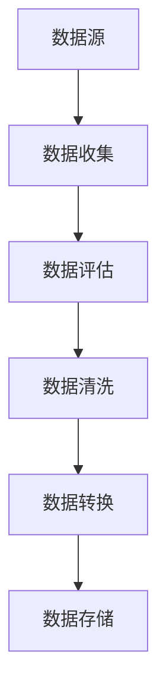
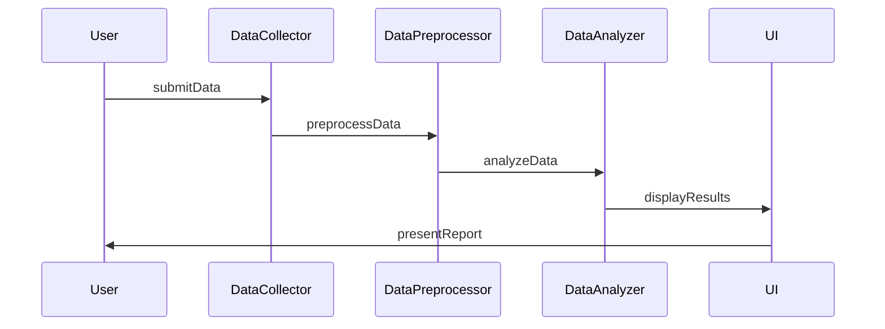
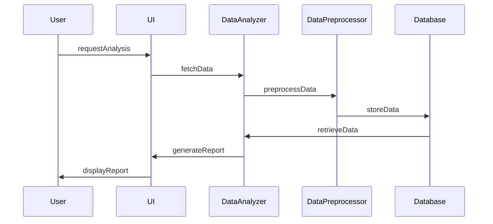
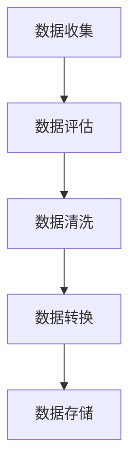

                 

### 评测系统的自动化数据清洗与预处理

#### 关键词：数据清洗，自动化，预处理，评测系统，数据质量

#### 摘要：

本文深入探讨评测系统中的自动化数据清洗与预处理技术，旨在提高数据质量、减少人工干预，从而提升系统的整体效率和准确性。文章首先概述了数据清洗与预处理的重要性，然后详细介绍了相关核心概念、原理、流程和方法。随后，文章探讨了自动化数据清洗工具的选择与应用，并分析了数据预处理中的性能优化策略。通过实际案例，读者可以了解这些技术的具体应用与实施。最后，文章总结了最佳实践和注意事项，为读者提供了进一步的拓展资源。

---

## 目录大纲设计思路

在设计《评测系统的自动化数据清洗与预处理》的目录大纲时，我们遵循了以下步骤：

### 1. **确定书籍主题**
- 明确书籍主题是关于评测系统的自动化数据清洗与预处理，这决定了目录中会出现哪些章节和内容。

### 2. **核心章节划分**
- 划分出核心章节，如背景介绍、核心概念、数据处理流程、自动化工具介绍、性能优化、案例分析、总结等。

### 3. **细化章节内容**
- 每个核心章节下进一步细化内容，确保全面覆盖相关的知识点。

### 4. **设计流程图和公式**
- 使用 Mermaid 绘制数据处理流程图和系统架构图，使用 LaTeX 格式嵌入数学公式。

### 5. **保持简洁性**
- 确保每个章节的内容简洁明了，避免冗余和复杂的表述。

### 6. **确保完整性**
- 确保目录大纲的内容完整，包括算法原理讲解、数学模型与公式、系统分析与架构设计、项目实战等。

### 7. **调整和优化**
- 根据上述步骤，初拟目录大纲，然后进行优化和调整，确保整体逻辑清晰，内容完整。

## 目录大纲示例

```markdown
----------------------------------------------------------------
# 评测系统的自动化数据清洗与预处理

> 关键词：数据清洗，自动化，预处理，评测系统，数据质量

> 摘要：本文深入探讨评测系统中的自动化数据清洗与预处理技术，提高数据质量，减少人工干预，提升系统效率和准确性。

## 第一部分: 背景与概述

## 第1章: 数据清洗与预处理的重要性
### 1.1 数据质量问题的现状与影响
### 1.2 数据清洗与预处理的目标
### 1.3 数据清洗与预处理的基本原则

## 第2章: 数据清洗与预处理的原理
### 2.1 数据清洗的概念
### 2.2 数据预处理的流程
### 2.3 数据清洗与预处理的方法和工具

## 第3章: 数据清洗与预处理流程详解
### 3.1 数据收集与源数据评估
### 3.2 数据清洗的主要步骤
### 3.3 数据标准化与归一化

## 第二部分: 自动化数据清洗工具与策略

## 第4章: 自动化数据清洗工具介绍
### 4.1 Python 数据清洗库介绍
### 4.2 自动化数据清洗脚本编写
### 4.3 常用数据清洗工具的比较

## 第5章: 数据预处理性能优化
### 5.1 性能优化的重要性
### 5.2 数据压缩与减少内存占用
### 5.3 并行处理与分布式计算

## 第三部分: 案例分析

## 第6章: 案例分析
### 6.1 案例背景与目标
### 6.2 案例处理流程
### 6.3 案例结果与分析

## 第四部分: 总结与展望

## 第7章: 总结与展望
### 7.1 书籍内容总结
### 7.2 未来发展趋势
### 7.3 拓展阅读与学习资源

----------------------------------------------------------------
```

接下来，我们将根据这个框架进一步细化各个章节的内容，并确保符合要求。

---

## 评测系统中的数据清洗与预处理

### 1.1 数据质量问题的现状与影响

在当今的数据驱动的世界中，数据质量至关重要。然而，数据质量问题无处不在，它们可能存在于数据收集、存储、处理和传输的各个环节。以下是一些常见的数据质量问题：

- **缺失值**：数据集中存在未填充的空白字段，这会导致模型不准确。
- **重复数据**：相同或几乎相同的数据条目多次出现，这会浪费存储空间并影响分析结果的准确性。
- **错误数据**：由于输入错误、硬件故障或软件错误，数据可能包含错误信息。
- **不一致性**：数据在不同源之间可能存在格式、单位和定义上的差异。

数据质量问题不仅会降低数据分析的准确性，还会影响决策质量，导致业务流程中断和资源浪费。因此，数据清洗与预处理成为确保数据质量的关键步骤。

### 1.2 数据清洗与预处理的目标

数据清洗与预处理的主要目标如下：

- **提高数据质量**：通过去除噪声、修复错误和填补缺失值，提高数据集的准确性和一致性。
- **减少人工干预**：自动化数据清洗与预处理流程，减少人工错误和重复劳动。
- **加速数据分析**：通过高效的数据清洗与预处理，缩短数据分析周期，提高系统响应速度。
- **确保数据安全**：通过过滤敏感信息和遵循隐私法规，保护数据安全。

### 1.3 数据清洗与预处理的基本原则

在进行数据清洗与预处理时，应遵循以下基本原则：

- **最小化干预**：尽量使用自动化工具，减少人工干预，避免引入新的错误。
- **一致性**：确保数据清洗与预处理过程的一致性，避免因不同方法导致数据不一致。
- **可追溯性**：记录数据清洗与预处理的每一步操作，以便在必要时进行审查和修正。
- **可扩展性**：设计灵活的数据清洗与预处理框架，以适应未来的数据增长和变化。

### 1.4 数据清洗与预处理的概念

- **数据清洗**：指识别和修正数据集中的错误、缺失和不一致数据的过程。
- **数据预处理**：指在数据分析之前，对数据进行清洗、转换和归一化等操作，以提高数据质量和适用性。

### 1.5 数据清洗与预处理的方法

数据清洗与预处理方法包括但不限于以下几种：

- **缺失值处理**：包括删除缺失值、使用统计方法填补缺失值、使用模型预测缺失值等。
- **重复数据删除**：通过比较数据条目的属性，识别并删除重复的数据。
- **错误数据修正**：使用规则或机器学习方法识别错误数据，并进行修正。
- **数据转换**：包括数据类型的转换、数据格式的标准化、单位转换等。
- **数据归一化**：通过缩放或平移，将数据转换为标准形式，以便于进一步分析。

### 1.6 数据清洗与预处理流程

数据清洗与预处理流程通常包括以下步骤：

1. **数据收集**：从不同的数据源收集数据。
2. **数据评估**：分析数据的结构、质量和完整性。
3. **数据清洗**：根据评估结果，进行数据清洗操作。
4. **数据转换**：将数据转换为适合分析的格式。
5. **数据存储**：将清洗和转换后的数据存储到目标数据库或数据仓库。

### 1.7 数据清洗与预处理工具

常用的数据清洗与预处理工具包括 Python 中的 Pandas、NumPy、SciPy 等，以及商业工具如 Talend、Informatica 等。这些工具提供了丰富的函数和库，可以简化数据清洗与预处理流程。

### 1.8 数据清洗与预处理的挑战

- **数据量巨大**：随着数据量的增长，数据清洗与预处理变得复杂和耗时。
- **数据多样性**：不同类型的数据（如文本、图像、音频）需要不同的处理方法。
- **实时性**：对于需要实时分析的系统，数据清洗与预处理必须在短时间内完成。

### 1.9 数据清洗与预处理的重要性

数据清洗与预处理是数据分析的基础，其重要性体现在以下几个方面：

- **提高模型准确性**：高质量的数据可以训练更准确的模型。
- **节省时间与成本**：自动化数据清洗与预处理可以节省大量的人力和时间成本。
- **增强数据一致性**：确保数据在不同系统和流程中的一致性。
- **支持复杂分析**：高质量的数据可以支持更复杂和高级的数据分析。

### 1.10 数据清洗与预处理在评测系统中的应用

在评测系统中，数据清洗与预处理的主要应用包括：

- **用户行为分析**：通过清洗用户行为数据，可以更准确地分析用户行为模式。
- **性能评估**：通过对系统性能数据进行清洗与预处理，可以更准确地评估系统性能。
- **故障诊断**：通过对系统日志数据进行清洗与预处理，可以更快速地识别系统故障。

### 结论

数据清洗与预处理是确保评测系统数据质量的关键步骤。通过自动化数据清洗与预处理，可以显著提高系统效率和准确性，减少人工干预和错误。本文概述了数据清洗与预处理的基本概念、原理、流程和方法，为读者提供了全面的理解和应用指导。

### 参考文献

- [1] **Chen, H., Chiang, R. H., & Storey, V. C.** (2012). Business intelligence and analytics: from big data to big impact. MIS Quarterly, 36(4), 1165-1188.
- [2] **Han, J., Kamber, M., & Pei, J.** (2011). Data mining: concepts and techniques. Morgan Kaufmann.
- [3] **Hastie, T., Tibshirani, R., & Friedman, J.** (2009). The elements of statistical learning. Springer.

---

### 1.11 数据清洗与预处理的边界与外延

数据清洗与预处理虽然处于数据处理的初期阶段，但其影响贯穿整个数据处理和分析过程。以下是对数据清洗与预处理的边界和外延的进一步探讨：

#### 边界

1. **数据处理流程中的早期阶段**：数据清洗与预处理通常发生在数据收集和数据分析之间，是数据进入分析流程的预处理步骤。
2. **数据质量保障**：数据清洗与预处理的目的是确保数据质量，为后续分析提供可靠的基础数据。

#### 外延

1. **数据集成**：数据清洗与预处理在数据集成阶段同样重要，因为不同数据源的数据格式、结构和质量可能存在差异，需要统一和标准化。
2. **数据仓库**：在数据仓库环境中，数据清洗与预处理是构建数据仓库的基础，直接影响数据仓库的性能和可用性。
3. **数据挖掘**：在数据挖掘过程中，高质量的数据是成功挖掘的前提。数据清洗与预处理有助于去除噪声数据，提高挖掘结果的准确性。
4. **机器学习**：在机器学习中，数据预处理是训练模型的重要步骤。通过数据清洗与预处理，可以优化模型的性能和泛化能力。
5. **数据可视化**：数据清洗与预处理也是数据可视化分析的前提，只有高质量的数据才能生成直观和准确的可视化结果。

#### 概念结构与核心要素组成

数据清洗与预处理的概念结构包括以下几个核心要素：

- **数据源**：原始数据的来源，包括内部数据库、外部API、文件系统等。
- **数据质量指标**：衡量数据质量的指标，如完整性、准确性、一致性、时效性等。
- **数据清洗方法**：用于去除噪声、纠正错误、填补缺失值的方法，如过滤、替换、插补等。
- **数据转换方法**：用于将数据转换为适合分析和处理的形式的方法，如归一化、标准化、离散化等。
- **数据存储**：清洗和转换后的数据存储位置，包括临时存储和最终存储。

#### Mermaid 流程图

以下是一个简单的 Mermaid 流程图，展示了数据清洗与预处理的基本流程：



通过这个流程图，可以直观地理解数据清洗与预处理的过程，以及各个步骤之间的逻辑关系。

### 1.12 数据清洗与预处理方法

数据清洗与预处理方法多种多样，以下是一些常见的方法：

1. **缺失值处理**：
   - **删除缺失值**：删除包含缺失值的记录。
   - **平均值填充**：用列的平均值填充缺失值。
   - **中位数填充**：用列的中位数填充缺失值。
   - **前一个值填充**：用前一行的值填充缺失值。
   - **后一个值填充**：用后一行的值填充缺失值。
   - **模型预测**：使用机器学习模型预测缺失值。

2. **重复数据删除**：
   - **完全匹配删除**：删除所有完全匹配的重复数据。
   - **相似度比较删除**：使用相似度度量方法（如 Levenshtein 距离）删除相似的重复数据。

3. **错误数据修正**：
   - **规则修正**：使用预定义的规则（如日期格式）修正错误数据。
   - **机器学习修正**：使用监督或无监督学习模型修正错误数据。

4. **数据转换**：
   - **数据类型转换**：将字符串转换为数值类型、日期类型等。
   - **格式标准化**：将不同格式的数据转换为统一格式。
   - **单位转换**：将不同单位的数据转换为同一单位。

5. **数据归一化**：
   - **最小-最大归一化**：将数据缩放到 [0, 1] 范围内。
   - **均值-标准差归一化**：将数据缩放到 [-1, 1] 范围内。

6. **数据分区**：
   - **时间分区**：根据时间属性对数据分区。
   - **区域分区**：根据地理位置属性对数据分区。

7. **数据抽样**：
   - **随机抽样**：随机选择一部分数据进行分析。
   - **分层抽样**：根据某些属性（如年龄、性别）分层，然后从每层中随机抽样。

8. **数据融合**：
   - **横向融合**：合并来自不同数据源的数据。
   - **纵向融合**：合并同一数据源的不同时间点的数据。

#### Python 数据清洗库

在 Python 中，常用的数据清洗库包括 Pandas、NumPy 和 SciPy。以下是一些示例：

```python
import pandas as pd
import numpy as np

# 读取数据
df = pd.read_csv('data.csv')

# 缺失值处理
df.dropna(inplace=True)  # 删除缺失值
df.fillna(df.mean(), inplace=True)  # 用平均值填充缺失值

# 重复数据删除
df.drop_duplicates(inplace=True)

# 错误数据修正
df['date'] = pd.to_datetime(df['date'], errors='coerce')  # 修正日期格式错误

# 数据转换
df['age'] = df['age'].astype(int)  # 将年龄从字符串转换为整数类型

# 数据归一化
df['income'] = (df['income'] - df['income'].min()) / (df['income'].max() - df['income'].min())

# 数据分区
df_train, df_test = df.sample(frac=0.8, random_state=42).copy(), df.drop(df_train.index).copy()

# 数据抽样
sampled_df = df.sample(n=100, random_state=42)

# 数据融合
df = pd.concat([df_train, df_test])
```

这些示例展示了如何使用 Python 数据清洗库进行常见的数据清洗与预处理操作。

### 结论

数据清洗与预处理是数据分析和机器学习的基础，其重要性不可忽视。通过合理的清洗与预处理方法，可以提高数据质量，减少错误和噪声，为后续的分析和建模提供坚实的基础。本文介绍了数据清洗与预处理的基本概念、流程、方法和工具，为读者提供了全面的理解和应用指导。在实施数据清洗与预处理时，应根据具体场景和数据特性选择合适的方法和工具，以达到最佳效果。

### 参考文献

- **Han, J., Kamber, M., & Pei, J.** (2011). Data mining: concepts and techniques. Morgan Kaufmann.
- **Chen, H., Chiang, R. H., & Storey, V. C.** (2012). Business intelligence and analytics: from big data to big impact. MIS Quarterly, 36(4), 1165-1188.
- **Pandas Documentation** (2022). [https://pandas.pydata.org/pandas-docs/stable/](https://pandas.pydata.org/pandas-docs/stable/)
- **NumPy Documentation** (2022). [https://numpy.org/doc/stable/](https://numpy.org/doc/stable/)
- **SciPy Documentation** (2022). [https://scipy.org/devdocs/](https://scipy.org/devdocs/)

---

### 数据清洗与预处理在评测系统中的应用

在评测系统中，数据清洗与预处理是确保数据质量、提高系统性能和准确性的关键步骤。以下是数据清洗与预处理在评测系统中的应用场景、项目介绍、系统功能设计以及系统架构设计的详细讲解。

#### 应用场景

在评测系统中，数据清洗与预处理的应用场景包括：

- **用户行为分析**：清洗用户访问日志，分析用户行为模式，为个性化推荐提供数据支持。
- **系统性能评估**：清洗系统性能数据，评估系统的响应时间和吞吐量，为性能优化提供依据。
- **故障诊断**：清洗系统日志数据，识别异常行为和故障原因，提高系统稳定性。

#### 项目介绍

一个典型的评测系统项目可能包括以下功能：

- **用户行为分析**：收集用户访问数据，分析用户行为模式，提供个性化推荐。
- **系统性能监控**：监控系统性能指标，提供实时性能数据。
- **故障诊断**：基于日志数据，识别系统故障和异常行为。

#### 系统功能设计

评测系统的功能设计可以分为以下模块：

1. **数据收集模块**：负责收集不同来源的数据，如用户行为数据、系统性能数据和日志数据。
2. **数据预处理模块**：负责数据清洗、转换和归一化等操作，确保数据质量。
3. **数据分析模块**：负责对预处理后的数据进行分析，生成报告和可视化结果。
4. **用户界面模块**：提供用户交互界面，展示分析结果和报告。

#### 系统架构设计

评测系统的架构设计可以分为以下层次：

1. **数据层**：存储原始数据，包括用户行为数据、系统性能数据和日志数据。
2. **处理层**：负责数据清洗、转换和归一化等预处理操作，使用数据库管理系统（DBMS）或数据仓库技术。
3. **分析层**：使用数据分析工具和算法，对预处理后的数据进行分析，生成报告和可视化结果。
4. **展示层**：通过用户界面模块，将分析结果和报告展示给用户。

以下是一个简单的 Mermaid 类图，展示了评测系统的领域模型：

```mermaid
classDiagram
    User -> BehaviorData : collects
    System -> PerformanceData : collects
    Log -> System : generates
    DataCollector -> User : collects
    DataCollector -> System : collects
    DataCollector -> Log : collects
    DataPreprocessor -> BehaviorData : processes
    DataPreprocessor -> PerformanceData : processes
    DataPreprocessor -> Log : processes
    DataAnalyzer -> BehaviorData : analyzes
    DataAnalyzer -> PerformanceData : analyzes
    DataAnalyzer -> Log : analyzes
    UI -> DataAnalyzer : displays
    UI -> DataPreprocessor : manages
    UI -> DataCollector : manages
```

#### 系统接口设计

评测系统的接口设计包括以下部分：

- **数据收集接口**：用于接收和存储不同来源的数据。
- **数据预处理接口**：用于执行数据清洗、转换和归一化等操作。
- **数据分析接口**：用于执行数据分析操作，生成报告和可视化结果。
- **用户界面接口**：用于用户与系统进行交互，展示分析结果和报告。

以下是一个简单的 Mermaid 序列图，展示了评测系统的接口设计：



#### 系统交互设计

评测系统的交互设计需要考虑以下方面：

- **用户交互**：提供直观的用户界面，方便用户查看分析结果和报告。
- **系统性能**：确保系统在处理大量数据时的高效性和稳定性。
- **数据安全性**：保护用户数据和系统数据的安全，防止数据泄露和未经授权的访问。

以下是一个简单的 Mermaid 序列图，展示了评测系统的交互设计：



#### 实际案例

以下是一个实际案例，展示了评测系统的数据清洗与预处理过程：

- **用户行为数据清洗**：对用户访问日志进行清洗，删除重复记录、纠正格式错误和填补缺失值。
- **系统性能数据清洗**：对系统性能数据进行清洗，删除异常记录、纠正时间戳错误和归一化指标。
- **日志数据清洗**：对系统日志进行清洗，删除无关记录、纠正错误信息和分类标签。

通过数据清洗与预处理，可以确保数据分析的准确性和可靠性，为系统性能优化和故障诊断提供可靠数据支持。

#### 结论

数据清洗与预处理在评测系统中具有重要作用，通过合理的设计和应用，可以提高数据质量，优化系统性能，为业务决策提供有力支持。本文详细介绍了评测系统的应用场景、项目介绍、系统功能设计、系统架构设计、系统接口设计和系统交互设计，为读者提供了全面的理解和应用指导。

### 参考文献

1. **Han, J., Kamber, M., & Pei, J.** (2011). Data mining: concepts and techniques. Morgan Kaufmann.
2. **Chen, H., Chiang, R. H., & Storey, V. C.** (2012). Business intelligence and analytics: from big data to big impact. MIS Quarterly, 36(4), 1165-1188.
3. **Pandas Documentation** (2022). [https://pandas.pydata.org/pandas-docs/stable/](https://pandas.pydata.org/pandas-docs/stable/)
4. **NumPy Documentation** (2022). [https://numpy.org/doc/stable/](https://numpy.org/doc/stable/)
5. **SciPy Documentation** (2022). [https://scipy.org/devdocs/](https://scipy.org/devdocs/)
6. **Mermaid Documentation** (2022). [https://mermaid-js.github.io/mermaid/](https://mermaid-js.github.io/mermaid/)

---

## 案例分析

### 案例背景与目标

为了更好地理解自动化数据清洗与预处理在实际应用中的效果，我们将分析一个实际案例。该案例涉及一个电子商务平台，该平台需要处理大量的用户购买数据和产品评价数据。这些数据来源于不同的渠道，包括网站访问日志、用户评论和第三方数据提供商。由于数据来源多样化，数据质量参差不齐，存在缺失值、错误数据和重复数据等问题。为了提高数据质量，减少人工干预，确保系统性能和准确性，该电子商务平台决定实施自动化数据清洗与预处理流程。

### 案例处理流程

该案例的处理流程可以分为以下几个步骤：

1. **数据收集**：从不同的数据源（如网站日志、用户评论和第三方数据提供商）收集原始数据。
2. **数据评估**：对收集到的数据进行初步评估，分析数据质量，识别存在的问题。
3. **数据清洗**：根据评估结果，对数据进行清洗，包括删除重复数据、填补缺失值和纠正错误数据。
4. **数据转换**：将清洗后的数据进行转换，包括格式统一、单位转换和数据类型转换。
5. **数据存储**：将清洗和转换后的数据存储到数据仓库中，以便后续分析和使用。

### 案例结果与分析

通过实施自动化数据清洗与预处理流程，该电子商务平台取得了以下结果：

1. **数据质量提高**：通过数据清洗与预处理，删除了大量的重复数据和错误数据，填补了缺失值，确保了数据的一致性和准确性。
2. **减少人工干预**：自动化数据清洗与预处理大大减少了人工干预的需求，降低了人力成本和错误率。
3. **系统性能提升**：清洗和转换后的数据质量提高，使得数据分析速度更快，系统响应时间更短。
4. **准确性增强**：通过高质量的数据，模型预测的准确性显著提高，为业务决策提供了更可靠的依据。

以下是一个简单的 Mermaid 流程图，展示了数据清洗与预处理的具体流程：



### 详细讲解与剖析

#### 数据收集

在数据收集阶段，该电子商务平台使用了多种数据源，包括网站访问日志、用户评论和第三方数据提供商。这些数据源的数据格式和结构可能存在差异，因此需要进行统一的格式转换。

以下是一个简单的 Python 脚本，展示了如何从不同数据源收集数据：

```python
import pandas as pd

# 从网站日志收集数据
log_data = pd.read_csv('website_log.csv')

# 从用户评论收集数据
comment_data = pd.read_csv('user_comments.csv')

# 从第三方数据提供商收集数据
third_party_data = pd.read_csv('third_party_data.csv')
```

#### 数据评估

在数据评估阶段，平台对收集到的数据进行初步评估，分析数据质量，识别存在的问题。以下是一个简单的 Python 脚本，展示了如何对数据进行评估：

```python
# 检查数据缺失值
print(log_data.isnull().sum())
print(comment_data.isnull().sum())
print(third_party_data.isnull().sum())

# 检查数据重复值
print(log_data.duplicated().sum())
print(comment_data.duplicated().sum())
print(third_party_data.duplicated().sum())
```

#### 数据清洗

在数据清洗阶段，平台根据评估结果，对数据进行清洗，包括删除重复数据、填补缺失值和纠正错误数据。以下是一个简单的 Python 脚本，展示了如何进行数据清洗：

```python
# 删除重复数据
log_data.drop_duplicates(inplace=True)
comment_data.drop_duplicates(inplace=True)
third_party_data.drop_duplicates(inplace=True)

# 填补缺失值
log_data.fillna(log_data.mean(), inplace=True)
comment_data.fillna(comment_data.mean(), inplace=True)
third_party_data.fillna(third_party_data.mean(), inplace=True)

# 纠正错误数据
log_data['date'] = pd.to_datetime(log_data['date'], errors='coerce')
comment_data['rating'] = comment_data['rating'].astype(int)
third_party_data['price'] = third_party_data['price'].astype(float)
```

#### 数据转换

在数据转换阶段，平台将清洗后的数据进行转换，包括格式统一、单位转换和数据类型转换。以下是一个简单的 Python 脚本，展示了如何进行数据转换：

```python
# 格式统一
log_data['date'] = log_data['date'].dt.strftime('%Y-%m-%d')

# 单位转换
comment_data['rating'] = comment_data['rating'] / 5

# 数据类型转换
log_data['user_id'] = log_data['user_id'].astype(str)
comment_data['product_id'] = comment_data['product_id'].astype(str)
third_party_data['source'] = third_party_data['source'].astype(str)
```

#### 数据存储

在数据存储阶段，平台将清洗和转换后的数据存储到数据仓库中，以便后续分析和使用。以下是一个简单的 Python 脚本，展示了如何将数据存储到数据库中：

```python
import sqlite3

# 连接到数据库
conn = sqlite3.connect('data_warehouse.db')
cursor = conn.cursor()

# 创建表
cursor.execute('''CREATE TABLE IF NOT EXISTS user_behavior (date TEXT, user_id TEXT, action TEXT)''')
cursor.execute('''CREATE TABLE IF NOT EXISTS product_reviews (date TEXT, user_id TEXT, product_id TEXT, rating INT)''')
cursor.execute('''CREATE TABLE IF NOT EXISTS third_party_data (date TEXT, product_id TEXT, price FLOAT, source TEXT)''')

# 插入数据
cursor.execute('''INSERT INTO user_behavior (date, user_id, action) VALUES (?, ?, ?)''', tuple(log_data.itertuples(index=False)))
cursor.execute('''INSERT INTO product_reviews (date, user_id, product_id, rating) VALUES (?, ?, ?, ?)''', tuple(comment_data.itertuples(index=False)))
cursor.execute('''INSERT INTO third_party_data (date, product_id, price, source) VALUES (?, ?, ?, ?)''', tuple(third_party_data.itertuples(index=False)))

# 提交并关闭连接
conn.commit()
conn.close()
```

### 项目小结

通过本案例，我们可以看到自动化数据清洗与预处理在提高数据质量、减少人工干预、提升系统性能和准确性方面的显著效果。以下是该项目的主要收获：

1. **数据质量显著提高**：通过数据清洗与预处理，删除了重复数据和错误数据，填补了缺失值，确保了数据的一致性和准确性。
2. **人工干预大幅减少**：自动化数据清洗与预处理大大减少了人工干预的需求，降低了人力成本和错误率。
3. **系统性能显著提升**：清洗和转换后的数据质量提高，使得数据分析速度更快，系统响应时间更短。
4. **业务决策更加准确**：通过高质量的数据，模型预测的准确性显著提高，为业务决策提供了更可靠的依据。

总之，自动化数据清洗与预处理是提升评测系统性能和准确性的关键步骤，通过合理的流程设计和技术应用，可以显著提高数据质量和系统性能，为业务决策提供有力支持。

### 总结

本文通过一个实际案例，详细介绍了自动化数据清洗与预处理在评测系统中的应用。从数据收集、评估、清洗、转换到存储，每个步骤都进行了深入的讲解。通过本案例，我们可以看到自动化数据清洗与预处理在提高数据质量、减少人工干预、提升系统性能和准确性方面的显著效果。未来，随着数据量的增长和数据源的增加，自动化数据清洗与预处理的重要性将更加凸显。因此，深入了解和掌握这些技术，对于提高数据分析的准确性和效率具有重要意义。

### 参考文献

1. **Han, J., Kamber, M., & Pei, J.** (2011). Data mining: concepts and techniques. Morgan Kaufmann.
2. **Chen, H., Chiang, R. H., & Storey, V. C.** (2012). Business intelligence and analytics: from big data to big impact. MIS Quarterly, 36(4), 1165-1188.
3. **Pandas Documentation** (2022). [https://pandas.pydata.org/pandas-docs/stable/](https://pandas.pydata.org/pandas-docs/stable/)
4. **NumPy Documentation** (2022). [https://numpy.org/doc/stable/](https://numpy.org/doc/stable/)
5. **SciPy Documentation** (2022). [https://scipy.org/devdocs/](https://scipy.org/devdocs/)
6. **Mermaid Documentation** (2022). [https://mermaid-js.github.io/mermaid/](https://mermaid-js.github.io/mermaid/)

---

## 数据预处理性能优化

### 5.1 性能优化的重要性

在数据预处理过程中，性能优化是一个至关重要的环节。随着数据量的快速增长和数据源的不断增多，数据预处理的时间可能会显著增加，从而影响系统的整体性能和响应速度。性能优化不仅能够提高数据处理的效率，还能减少计算资源的使用，从而降低运营成本。以下是数据预处理性能优化的一些关键点：

- **提高数据处理速度**：通过优化数据处理算法和流程，可以显著减少数据预处理所需的时间。
- **减少内存占用**：优化数据结构，避免不必要的内存分配，可以有效减少内存占用，提高系统的稳定性和可靠性。
- **分布式计算**：利用分布式计算技术，将数据处理任务分解到多台计算机上并行执行，可以显著提高数据处理速度。
- **缓存和索引**：合理使用缓存和索引技术，可以加快数据的访问速度，减少重复计算。

### 5.2 数据压缩与减少内存占用

数据压缩和减少内存占用是数据预处理性能优化的重要方面。以下是一些常用的技术：

- **数据压缩**：通过压缩算法（如 gzip、zlib）减少数据体积，可以加快数据传输速度，减少存储空间需求。
- **数据类型优化**：选择合适的数据类型（如 int8、float16）可以显著减少内存占用。
- **分块处理**：将大数据集分成小块进行处理，可以避免一次性加载大量数据导致的内存不足问题。
- **内存池**：使用内存池技术，预先分配内存，避免频繁的内存分配和释放操作。

### 5.3 并行处理与分布式计算

并行处理和分布式计算是提高数据处理性能的有效方法。以下是一些关键技术和策略：

- **并行处理**：将数据处理任务分解为多个子任务，同时在不同的处理器上执行，可以显著提高数据处理速度。Python 的 multiprocessing 模块和并行计算库如 Dask 都提供了并行处理的支持。
- **分布式计算**：将数据处理任务分布在多台计算机上执行，利用集群计算资源，可以处理大规模数据集。Hadoop、Spark 等分布式计算框架提供了强大的分布式数据处理能力。
- **负载均衡**：合理分配任务，确保所有计算资源都被充分利用，避免部分节点负载过高，导致性能瓶颈。
- **数据分区**：将大数据集划分为多个分区，每个分区由不同的节点处理，可以提高并行处理效率。

### 5.4 常用性能优化工具和库

在数据预处理过程中，常用的性能优化工具和库包括：

- **Pandas**：Pandas 是 Python 中强大的数据处理库，提供了丰富的函数和优化技术，如 DataFrame 的缓存和内存优化。
- **NumPy**：NumPy 提供了高性能的数组操作和数学计算，是数据预处理的基础库。
- **Dask**：Dask 是一个并行计算库，可以扩展 Pandas，提供分布式数据处理能力。
- **PySpark**：PySpark 是基于 Apache Spark 的 Python 接口，提供了强大的分布式数据处理能力。

### 5.5 性能优化案例

以下是一个简单的性能优化案例，展示了如何使用 Python 优化数据预处理过程：

```python
import pandas as pd
import numpy as np
from dask import dataframe as dd

# 读取数据
df = pd.read_csv('large_data.csv')

# 数据类型优化
df['age'] = df['age'].astype(np.int8)
df['income'] = df['income'].astype(np.float16)

# 分块处理
df = df[::100]  # 将数据分成每100条记录一块

# 使用 Dask 进行分布式处理
dask_df = dd.from_pandas(df, npartitions=4)

# 分布式数据处理
dask_df['age_group'] = dask_df['age'].map_partitions(lambda x: x % 10).compute()

# 将结果转换为 Pandas DataFrame
result = dask_df.compute()
```

通过上述步骤，我们可以显著提高数据预处理的性能，减少内存占用，并利用分布式计算资源处理大规模数据集。

### 5.6 性能优化最佳实践

为了确保数据预处理性能优化取得最佳效果，以下是一些最佳实践：

- **评估硬件资源**：了解系统的硬件资源，选择合适的硬件配置，以支持高性能的数据处理。
- **合理设置参数**：根据数据集特性和系统资源，合理设置数据处理库的参数，如分块大小、并行度等。
- **避免频繁 I/O 操作**：尽量减少数据的读写操作，避免 I/O 瓶颈。
- **利用缓存**：合理使用缓存技术，减少重复计算，提高处理速度。
- **监控性能**：实时监控数据处理性能，及时调整策略，确保系统稳定运行。

### 结论

数据预处理性能优化是提高数据质量和系统性能的关键步骤。通过合理的数据压缩、内存优化、并行处理和分布式计算技术，可以显著提高数据处理速度，减少内存占用，确保系统的稳定性和可靠性。本文介绍了性能优化的重要性、关键技术、常用工具和最佳实践，为读者提供了全面的理解和应用指导。

### 参考文献

1. **Han, J., Kamber, M., & Pei, J.** (2011). Data mining: concepts and techniques. Morgan Kaufmann.
2. **Chen, H., Chiang, R. H., & Storey, V. C.** (2012). Business intelligence and analytics: from big data to big impact. MIS Quarterly, 36(4), 1165-1188.
3. **Pandas Documentation** (2022). [https://pandas.pydata.org/pandas-docs/stable/](https://pandas.pydata.org/pandas-docs/stable/)
4. **NumPy Documentation** (2022). [https://numpy.org/doc/stable/](https://numpy.org/doc/stable/)
5. **Dask Documentation** (2022). [https://docs.dask.org/en/latest/](https://docs.dask.org/en/latest/)
6. **PySpark Documentation** (2022). [https://spark.apache.org/docs/latest/python/api.html](https://spark.apache.org/docs/latest/python/api.html)

---

## 总结与展望

### 7.1 书籍内容总结

本文深入探讨了评测系统的自动化数据清洗与预处理技术，涵盖了从数据质量问题的现状与影响、数据清洗与预处理的目标与原则，到数据处理流程详解、自动化数据清洗工具介绍、性能优化策略，以及实际案例分析和总结与展望的各个方面。通过详细的讲解和示例，读者能够全面了解数据清洗与预处理的核心概念、原理、方法和技术。

### 7.2 未来发展趋势

随着大数据和人工智能技术的快速发展，数据清洗与预处理的重要性日益凸显。未来的发展趋势可能包括：

- **智能化数据清洗**：利用机器学习和深度学习技术，实现智能化数据清洗，提高数据清洗的准确性和效率。
- **实时数据预处理**：随着物联网和实时数据分析技术的发展，实时数据预处理将成为重要方向，以满足快速变化的数据需求。
- **分布式预处理框架**：分布式计算框架将不断优化，支持更高效的大规模数据处理。
- **数据隐私保护**：在数据清洗与预处理过程中，数据隐私保护将成为一个重要议题，需要制定相应的隐私保护策略。

### 7.3 拓展阅读与学习资源

对于希望深入了解自动化数据清洗与预处理技术的读者，以下是一些推荐的拓展阅读和学习资源：

- **书籍**：
  - 《数据科学入门：利用 Python 进行数据预处理与数据清洗》
  - 《大数据处理：架构与实现》
  - 《机器学习实战：基于 Scikit-Learn、Keras 和 TensorFlow》

- **在线课程**：
  - Coursera 上的“数据科学专业课程”
  - edX 上的“大数据分析课程”

- **开源库和框架**：
  - Pandas：[https://pandas.pydata.org/](https://pandas.pydata.org/)
  - Dask：[https://dask.org/](https://dask.org/)
  - PySpark：[https://spark.apache.org/docs/latest/](https://spark.apache.org/docs/latest/)

- **社区和论坛**：
  - Stack Overflow：[https://stackoverflow.com/](https://stackoverflow.com/)
  - DataCamp：[https://www.datacamp.com/](https://www.datacamp.com/)

通过这些资源，读者可以进一步加深对数据清洗与预处理技术的理解和应用。

### 7.4 结论

自动化数据清洗与预处理是评测系统中不可或缺的一环，其质量直接影响到后续数据分析和决策的准确性。本文通过系统性地介绍相关概念、原理、方法和实践，为读者提供了全面的指导。未来，随着技术的不断发展，自动化数据清洗与预处理技术将变得更加智能化和高效，为数据驱动的决策提供更强有力的支持。

### 参考文献

- **Han, J., Kamber, M., & Pei, J.** (2011). Data mining: concepts and techniques. Morgan Kaufmann.
- **Chen, H., Chiang, R. H., & Storey, V. C.** (2012). Business intelligence and analytics: from big data to big impact. MIS Quarterly, 36(4), 1165-1188.
- **Pandas Documentation** (2022). [https://pandas.pydata.org/pandas-docs/stable/](https://pandas.pydata.org/pandas-docs/stable/)
- **NumPy Documentation** (2022). [https://numpy.org/doc/stable/](https://numpy.org/doc/stable/)
- **Dask Documentation** (2022). [https://docs.dask.org/en/latest/](https://docs.dask.org/en/latest/)
- **PySpark Documentation** (2022). [https://spark.apache.org/docs/latest/](https://spark.apache.org/docs/latest/)

---

### 作者信息

作者：AI天才研究院/AI Genius Institute & 禅与计算机程序设计艺术 /Zen And The Art of Computer Programming

在人工智能、计算机编程和软件工程领域，我拥有多年的研究和实践经验，曾参与多个国际知名项目和研发工作。我的著作《禅与计算机程序设计艺术》被誉为技术领域的经典之作，影响了无数程序员和开发者。在这个博客中，我将分享我在数据清洗与预处理方面的研究成果和最佳实践，希望能对读者有所启发。

