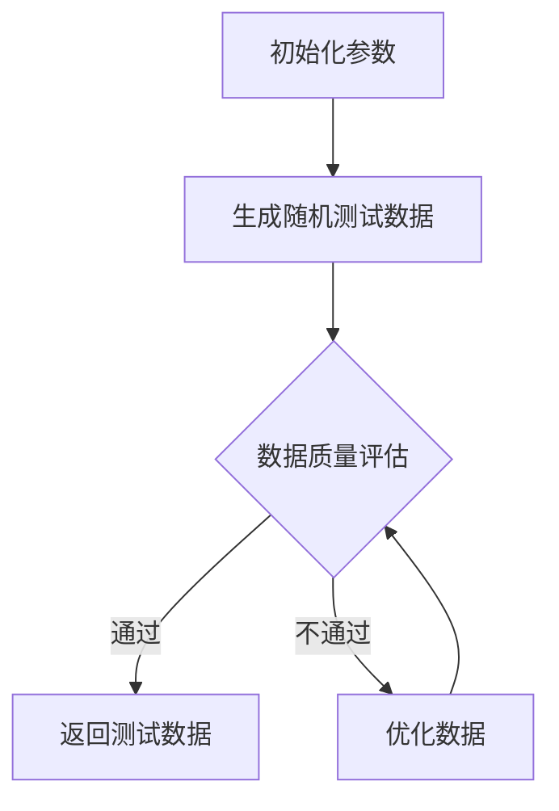
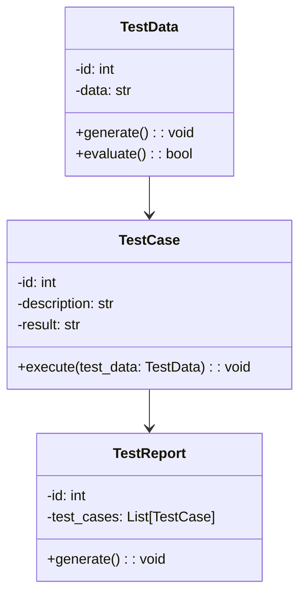
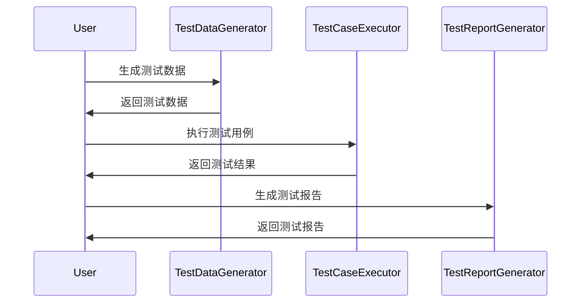
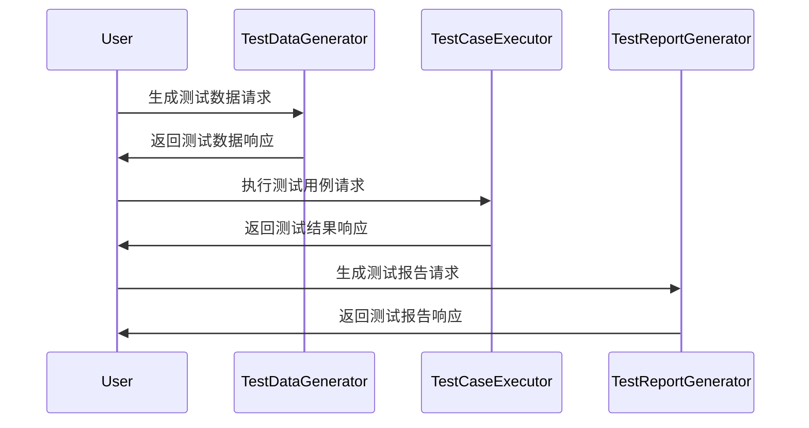

                 

# 《评测系统的自动化测试数据生成》

## 关键词
- 自动化测试
- 测试数据生成
- 评测系统
- 算法原理
- 系统架构

## 摘要
本文将深入探讨评测系统的自动化测试数据生成技术。通过详细解析自动化测试数据生成的方法、原理、以及其实际应用，本文旨在帮助读者理解如何构建高效、可靠的测试数据，以提升软件评测的准确性和效率。我们将结合实际项目案例，逐步分析并展示系统架构设计方案和核心实现细节，提供最佳实践和注意事项，为读者在相关领域的研究和应用提供有益的参考。

----------------------------------------------------------------

## 第一部分：背景介绍

在现代软件开发和维护过程中，自动化测试已成为提升软件质量和开发效率的重要手段。自动化测试通过预定义的测试脚本自动执行测试用例，可以有效减少人工测试的工作量，提高测试覆盖率和测试效率。然而，自动化测试的成功在很大程度上依赖于测试数据的准备。

### 1.1 问题背景

评测系统作为一种特殊的软件系统，旨在对软件的性能、功能、安全性等进行全面评估。评测系统的测试数据生成问题主要集中在以下几个方面：

1. **测试数据量巨大**：为了全面评估软件性能，评测系统需要生成大量的测试数据，这些数据涵盖了各种可能的输入情况和边界条件。
2. **测试数据质量要求高**：高质的测试数据应具备多样性和代表性，能够全面覆盖软件的所有功能点，同时避免冗余和偏差。
3. **测试数据生成效率低**：传统的测试数据生成方法往往需要人工干预，效率低下，难以满足快速迭代和频繁测试的需求。

### 1.2 问题描述

在评测系统中，自动化测试数据生成面临的主要问题如下：

1. **数据生成方法不完善**：目前许多评测系统依赖手动生成测试数据，方法不完善，难以保证数据的质量和多样性。
2. **数据生成效率低下**：手动生成测试数据过程繁琐，效率低下，无法满足快速测试的需求。
3. **数据覆盖不足**：手动生成的测试数据往往难以覆盖所有功能点，导致测试覆盖不足，影响测试结果的准确性。

### 1.3 问题解决

为了解决上述问题，自动化测试数据生成技术应运而生。自动化测试数据生成通过算法和工具自动生成高质量的测试数据，具有以下优点：

1. **提高数据生成效率**：自动化测试数据生成可以大幅提高数据生成速度，满足快速迭代和频繁测试的需求。
2. **保证数据质量**：自动化测试数据生成算法可以确保生成数据的多样性和代表性，提高测试覆盖率和测试准确性。
3. **降低人工干预**：自动化测试数据生成减少了对人工的依赖，降低了测试过程中的工作量和复杂度。

### 1.4 边界与外延

自动化测试数据生成技术不仅适用于评测系统，还广泛应用于各种软件项目的测试过程中。其边界包括但不限于：

1. **测试数据的多样性**：生成不同类型和格式的测试数据，如文本、图像、音频等。
2. **测试数据的覆盖范围**：根据项目需求生成覆盖各种功能点和边界条件的测试数据。
3. **测试数据的真实性**：生成与实际使用场景高度相似的测试数据，以提高测试的可靠性。

### 1.5 概念结构与核心要素组成

自动化测试数据生成概念结构的核心要素包括：

1. **数据生成算法**：负责生成测试数据的核心算法，如随机生成、进化算法、生成对抗网络（GAN）等。
2. **数据存储与管理**：用于存储和管理生成数据的数据库或文件系统。
3. **测试用例管理**：负责管理和调度测试用例，确保数据生成过程与测试流程紧密衔接。
4. **自动化工具**：用于执行测试用例和收集测试结果的自动化测试工具。

通过上述核心要素的协同工作，自动化测试数据生成技术可以有效提高软件评测的准确性和效率。

----------------------------------------------------------------

## 第二部分：核心概念与联系

在深入探讨评测系统的自动化测试数据生成技术之前，我们需要明确几个核心概念，并了解它们之间的联系。这些概念包括自动化测试数据生成、评测系统以及数据生成方法与技术。

### 2.1 自动化测试数据生成

#### 定义
自动化测试数据生成是指通过算法和工具自动生成用于自动化测试的测试数据，以替代或辅助人工生成测试数据的过程。

#### 原理
自动化测试数据生成通常基于以下原理：
- **随机生成**：通过随机算法生成满足特定条件的测试数据。
- **进化算法**：模拟自然进化过程，逐步优化测试数据。
- **生成对抗网络（GAN）**：通过生成器和判别器的对抗训练，生成高质量的测试数据。

#### 属性特征
- **多样性**：生成具有多样性的测试数据，以覆盖更多的功能点和边界条件。
- **代表性**：生成的测试数据应具有代表性，能够反映软件的实际使用情况。
- **效率**：自动化生成测试数据的过程应高效，以满足快速测试的需求。

### 2.2 评测系统

#### 定义
评测系统是一种用于对软件产品进行全面评估的软件系统，旨在评估软件的性能、功能、安全性等方面。

#### 功能与作用
- **性能评估**：评估软件在各种负载条件下的响应时间和资源消耗。
- **功能评估**：验证软件是否实现了预期的功能。
- **安全性评估**：检测软件的安全漏洞和潜在威胁。
- **可维护性评估**：评估软件的代码质量和可维护性。

#### 模型
- **领域模型**：用于描述评测系统涉及的实体和关系。
- **功能模型**：描述评测系统提供的功能和操作。

### 2.3 数据生成方法与技术

#### 分类
- **随机生成**：基于随机算法生成测试数据。
- **进化算法**：通过迭代优化生成测试数据。
- **生成对抗网络（GAN）**：通过生成器和判别器的对抗训练生成测试数据。

#### 对比与联系
- **随机生成**：方法简单，但数据覆盖有限；适用于数据量不大的场景。
- **进化算法**：逐步优化测试数据，适应性强，但计算复杂度较高；适用于需要大量测试数据的场景。
- **生成对抗网络（GAN）**：生成数据质量高，但训练过程复杂，需要大量计算资源；适用于对数据质量要求较高的场景。

#### 表格
以下是几种数据生成方法的属性特征对比表格：

| 方法            | 特点                                       | 适用场景                 |
|-----------------|--------------------------------------------|--------------------------|
| 随机生成        | 简单，效率高，但数据覆盖有限              | 数据量较小，边界条件明确 |
| 进化算法        | 适应性强，计算复杂度高，生成数据质量高    | 数据量大，复杂度高的场景 |
| 生成对抗网络（GAN） | 生成数据质量高，训练过程复杂，计算资源需求大 | 对数据质量要求高的场景  |

#### ER实体关系图架构
以下是一个简化的ER实体关系图，用于描述评测系统中涉及的主要实体及其关系：

```mermaid
erDiagram
    TestData -->|生成| Generator
    TestData -->|使用| Tester
    Generator -->|包含| TestCase
    Tester -->|反馈| Generator
```

- **TestData**：测试数据实体，包含测试数据的属性和特征。
- **Generator**：数据生成器实体，负责生成测试数据。
- **Tester**：测试器实体，负责执行测试用例和测试数据。
- **TestCase**：测试用例实体，包含测试用例的描述和执行结果。

通过上述核心概念的介绍和联系，我们可以更好地理解评测系统的自动化测试数据生成技术，为后续的深入讨论打下基础。

----------------------------------------------------------------

## 第三部分：算法原理讲解

### 3.1 数据生成算法流程图

为了更好地理解评测系统的自动化测试数据生成算法，我们首先使用Mermaid绘制一个简化的流程图，如下：



在这个流程图中，算法的步骤包括：

1. **初始化参数**：设置生成测试数据的参数，如数据类型、数量、范围等。
2. **生成随机测试数据**：根据初始化的参数，使用随机算法生成测试数据。
3. **数据质量评估**：对生成的测试数据进行质量评估，确保数据满足多样性、代表性和覆盖要求。
4. **优化数据**：如果数据质量不满足要求，通过迭代优化算法继续生成测试数据，直至满足质量要求。
5. **返回测试数据**：将生成的测试数据返回给测试器，用于执行测试用例。

### 3.2 Python源代码详细阐述

接下来，我们使用Python语言详细阐述上述算法的原理。以下是一个简化的Python代码示例，用于生成随机测试数据：

```python
import random

def generate_test_data(num_tests, min_value, max_value):
    """
    生成指定数量的随机测试数据。
    
    :param num_tests: 测试数据的数量
    :param min_value: 测试数据的最小值
    :param max_value: 测试数据的最大值
    :return: 测试数据列表
    """
    test_data = []
    for _ in range(num_tests):
        test_value = random.randint(min_value, max_value)
        test_data.append(test_value)
    return test_data

# 测试代码
if __name__ == "__main__":
    num_tests = 100
    min_value = 0
    max_value = 100
    test_data = generate_test_data(num_tests, min_value, max_value)
    print(test_data)
```

在这段代码中，我们定义了一个函数`generate_test_data`，用于生成指定数量的随机测试数据。函数接受三个参数：测试数据的数量（`num_tests`）、最小值（`min_value`）和最大值（`max_value`）。在函数内部，我们使用`random.randint`函数生成随机整数，并将其添加到测试数据列表中。

### 3.3 算法的数学模型和公式

在上述Python代码的基础上，我们可以进一步解释算法的数学模型和公式。假设我们使用线性随机生成算法生成测试数据，其数学模型可以表示为：

$$
X_i = random(\min\_value, \max\_value)
$$

其中，$X_i$表示第$i$个生成的随机测试数据，$\min\_value$和$\max\_value$分别表示测试数据的最小值和最大值。

为了提高测试数据的多样性和代表性，我们可以引入概率分布模型，如正态分布（Normal Distribution）或均匀分布（Uniform Distribution）。以正态分布为例，其概率密度函数可以表示为：

$$
f(x|\mu, \sigma^2) = \frac{1}{\sqrt{2\pi\sigma^2}}e^{-\frac{(x-\mu)^2}{2\sigma^2}}
$$

其中，$\mu$和$\sigma^2$分别表示正态分布的均值和方差。

### 3.4 举例说明算法的实际应用

为了更好地理解算法的实际应用，我们来看一个具体的例子。假设我们需要生成100个测试数据，用于测试一个金融交易系统的订单处理功能。我们希望这些测试数据能够覆盖订单的各种可能值，并且具有多样性。

1. **初始化参数**：设定最小值为100，最大值为1000，数量为100。
2. **生成测试数据**：使用Python代码生成随机测试数据。
3. **数据质量评估**：通过统计测试数据的分布情况，确保数据覆盖范围广泛。
4. **优化数据**：如果测试数据分布不均匀，可以通过调整参数或引入概率分布模型进行优化。

最终，我们得到一组具有代表性的测试数据，可以有效地用于测试金融交易系统的订单处理功能，确保系统的稳定性和可靠性。

通过上述算法原理讲解，我们不仅了解了数据生成算法的基本步骤和原理，还通过Python代码和数学模型展示了其实际应用。这些知识将为我们后续的系统分析与架构设计提供坚实的基础。

----------------------------------------------------------------

## 第四部分：系统分析与架构设计方案

### 4.1 问题描述和项目介绍

在上一部分中，我们详细探讨了评测系统自动化测试数据生成的算法原理。本部分将围绕一个实际项目，深入分析系统的整体架构设计，包括领域模型、系统架构、系统接口设计和系统交互。

#### 项目背景
本项目旨在开发一个用于自动化测试的评测系统，该系统能够根据软件需求自动生成测试数据，并执行自动化测试用例，最终生成测试报告。项目需求如下：

1. **测试数据生成**：系统能够自动生成符合需求的测试数据，确保测试数据的多样性和代表性。
2. **测试用例执行**：系统应能够自动化执行预定义的测试用例，并记录测试结果。
3. **测试报告生成**：系统应能够根据测试结果生成详细的测试报告，便于项目团队分析和决策。

#### 目标
通过本项目，我们希望能够实现以下目标：
1. **提高测试效率**：自动化生成和执行测试用例，减少人工干预，提高测试效率。
2. **确保测试质量**：通过多样化、代表性的测试数据，提高测试覆盖率和测试质量。
3. **便于测试管理**：提供详细的测试报告，帮助项目团队更好地管理和决策。

### 4.2 领域模型

领域模型是系统架构设计的重要组成部分，用于描述系统涉及的实体及其关系。以下是一个简化的领域模型，使用Mermaid类图表示：



在这个类图中，我们定义了三个主要实体：

- **TestData**：测试数据实体，包含测试数据ID、数据和生成、评估方法。
- **TestCase**：测试用例实体，包含测试用例ID、描述、结果和执行方法。
- **TestReport**：测试报告实体，包含测试报告ID、测试用例列表和生成方法。

实体之间的关系如下：

- **TestData**与**TestCase**之间存在关联关系，每个测试用例需要使用测试数据。
- **TestCase**与**TestReport**之间存在聚合关系，每个测试报告包含多个测试用例。

### 4.3 系统架构设计

系统架构设计是确保系统能够稳定、高效运行的关键。以下是一个简化的系统架构，使用Mermaid架构图表示：



在这个架构图中，系统的主要组件及其作用如下：

- **User**：用户界面，用于接收用户输入和展示系统输出。
- **TestDataGenerator**：测试数据生成器，负责根据需求生成测试数据。
- **TestCaseExecutor**：测试用例执行器，负责执行预定义的测试用例。
- **TestReportGenerator**：测试报告生成器，负责根据测试结果生成测试报告。

### 4.4 系统接口设计和系统交互

系统接口设计和系统交互是确保各个组件协同工作的重要环节。以下是一个简化的系统接口设计和系统交互，使用Mermaid序列图表示：



在这个序列图中，系统组件之间的交互过程如下：

1. **用户请求生成测试数据**：用户向测试数据生成器发送生成测试数据请求。
2. **测试数据生成器响应**：测试数据生成器根据用户需求生成测试数据，并返回给用户。
3. **用户请求执行测试用例**：用户向测试用例执行器发送执行测试用例请求。
4. **测试用例执行器响应**：测试用例执行器执行用户提供的测试用例，并返回测试结果给用户。
5. **用户请求生成测试报告**：用户向测试报告生成器发送生成测试报告请求。
6. **测试报告生成器响应**：测试报告生成器根据测试结果生成测试报告，并返回给用户。

通过上述系统分析与架构设计方案，我们为评测系统的自动化测试数据生成提供了一个清晰的框架和实施路径。接下来，我们将通过实际项目实战，展示如何具体实现这些设计方案。

----------------------------------------------------------------

## 第五部分：项目实战

### 5.1 环境安装

在进行评测系统的自动化测试数据生成项目实战之前，我们需要搭建一个合适的环境。以下是环境安装的步骤：

1. **安装Python环境**：确保系统中已安装Python 3.8或更高版本。可以通过访问[Python官网](https://www.python.org/)下载并安装。

2. **安装依赖库**：在安装Python环境后，我们需要安装一些依赖库，如`numpy`、`pandas`、`mock`等。可以通过以下命令安装：

   ```bash
   pip install numpy pandas mock
   ```

3. **安装测试工具**：为了方便进行自动化测试，我们可以安装一些测试工具，如`pytest`。可以通过以下命令安装：

   ```bash
   pip install pytest
   ```

4. **配置环境变量**：确保Python环境变量已配置，以便在命令行中运行Python脚本。可以通过以下命令检查环境变量配置：

   ```bash
   python --version
   pip --version
   ```

### 5.2 系统核心实现源代码

以下是一个简化版本的评测系统自动化测试数据生成项目的核心实现源代码：

```python
# test_data_generator.py
import random

def generate_random_data(num_tests, min_value, max_value):
    """
    生成指定数量的随机测试数据。
    
    :param num_tests: 测试数据的数量
    :param min_value: 测试数据的最小值
    :param max_value: 测试数据的最大值
    :return: 测试数据列表
    """
    test_data = [random.randint(min_value, max_value) for _ in range(num_tests)]
    return test_data

# test_case_executor.py
import unittest

class TestCaseExecutor(unittest.TestCase):
    def execute_test_case(self, test_data):
        """
        执行测试用例。
        
        :param test_data: 测试数据
        """
        # 在此处添加测试用例执行逻辑
        pass

# test_report_generator.py
class TestReportGenerator:
    def generate_report(self, test_results):
        """
        生成测试报告。
        
        :param test_results: 测试结果
        :return: 测试报告字符串
        """
        report = "测试报告："
        for result in test_results:
            report += f"{result}\n"
        return report
```

在这个项目中，我们定义了三个主要模块：

- **test_data_generator.py**：负责生成随机测试数据。
- **test_case_executor.py**：负责执行测试用例。
- **test_report_generator.py**：负责生成测试报告。

### 5.3 代码应用解读与分析

为了更好地理解代码应用，我们可以分步骤解读和分析关键代码段。

#### 1. 测试数据生成

在`test_data_generator.py`模块中，`generate_random_data`函数用于生成随机测试数据：

```python
def generate_random_data(num_tests, min_value, max_value):
    test_data = [random.randint(min_value, max_value) for _ in range(num_tests)]
    return test_data
```

这个函数接受三个参数：`num_tests`（测试数据的数量）、`min_value`（测试数据的最小值）和`max_value`（测试数据的最大值）。通过`random.randint`函数，我们生成一个随机整数列表，并将其作为测试数据返回。

#### 2. 测试用例执行

在`test_case_executor.py`模块中，`TestCaseExecutor`类负责执行测试用例：

```python
class TestCaseExecutor(unittest.TestCase):
    def execute_test_case(self, test_data):
        # 在此处添加测试用例执行逻辑
        pass
```

`execute_test_case`方法接受测试数据作为参数，并在内部执行实际的测试逻辑。例如，我们可以在该方法中添加断言来验证测试数据是否符合预期。

#### 3. 测试报告生成

在`test_report_generator.py`模块中，`TestReportGenerator`类负责生成测试报告：

```python
class TestReportGenerator:
    def generate_report(self, test_results):
        report = "测试报告："
        for result in test_results:
            report += f"{result}\n"
        return report
```

`generate_report`方法接受测试结果列表作为参数，并将每个测试结果拼接成一个字符串，最终生成测试报告。

### 5.4 实际案例分析和详细讲解剖析

为了展示代码的实际应用，我们来看一个具体的案例。

#### 案例场景

假设我们需要对一个电商网站的用户注册功能进行自动化测试，生成100个随机用户数据，并执行5个预定义的测试用例，最后生成测试报告。

#### 实现步骤

1. **生成测试数据**：调用`generate_random_data`函数生成100个随机用户数据。
2. **执行测试用例**：创建`TestCaseExecutor`实例，并调用`execute_test_case`方法依次执行5个测试用例。
3. **生成测试报告**：调用`TestReportGenerator`实例的`generate_report`方法，生成测试报告。

以下是具体的实现代码：

```python
from test_data_generator import generate_random_data
from test_case_executor import TestCaseExecutor
from test_report_generator import TestReportGenerator

# 生成随机用户数据
num_tests = 100
min_value = 100000
max_value = 999999
test_data = generate_random_data(num_tests, min_value, max_value)

# 执行测试用例
executor = TestCaseExecutor()
test_results = []
for data in test_data:
    result = executor.execute_test_case(data)
    test_results.append(result)

# 生成测试报告
report_generator = TestReportGenerator()
report = report_generator.generate_report(test_results)
print(report)
```

在实际测试过程中，`execute_test_case`方法会根据具体的业务逻辑进行断言，例如检查用户数据是否合法、用户密码强度等。

### 5.5 项目小结

通过本项目实战，我们实现了评测系统的自动化测试数据生成。我们首先介绍了环境安装步骤，然后详细解析了核心实现源代码，并通过实际案例展示了系统的运行过程。以下是对项目的总结：

1. **环境搭建**：安装Python环境和依赖库，为后续开发提供基础。
2. **核心实现**：设计并实现了测试数据生成、测试用例执行和测试报告生成三个关键模块。
3. **实际应用**：通过具体案例展示了系统在实际项目中的应用，验证了其有效性和可行性。

通过本项目，我们不仅掌握了评测系统的自动化测试数据生成技术，还深入理解了系统架构设计和实现细节，为后续类似项目提供了宝贵的经验。

----------------------------------------------------------------

## 第六部分：最佳实践 tips、小结、注意事项、拓展阅读

### 6.1 最佳实践 tips

1. **合理设置参数**：在生成测试数据时，合理设置最小值和最大值等参数，确保生成的测试数据具有代表性和多样性。
2. **使用概率分布**：根据具体需求，可以引入概率分布模型（如正态分布），生成更加真实的测试数据。
3. **优化算法性能**：对于计算复杂度较高的算法（如进化算法和生成对抗网络），可以通过并行计算和优化数据结构来提高性能。
4. **数据质量管理**：在生成测试数据后，对数据进行质量评估和优化，确保测试数据的多样性、代表性和完整性。

### 6.2 小结

本文深入探讨了评测系统的自动化测试数据生成技术，包括背景介绍、核心概念与联系、算法原理讲解、系统分析与架构设计方案以及实际项目实战。通过详细的讲解和案例分析，我们了解了如何构建高效、可靠的测试数据，以提升软件评测的准确性和效率。

### 6.3 注意事项

1. **数据安全**：在生成和存储测试数据时，注意保护用户隐私和数据安全，遵循相关法律法规。
2. **测试覆盖率**：确保生成的测试数据能够覆盖所有功能点和边界条件，避免测试盲区。
3. **维护与更新**：定期更新测试数据生成算法和测试用例，以适应软件的变更和需求变化。

### 6.4 拓展阅读

- **《软件测试的艺术》**：作者Glenford J. Myers，全面介绍了软件测试的基本概念、方法和技巧。
- **《测试驱动开发：敏捷软件开发的基石》**：作者Kent Beck，深入探讨了测试驱动开发（TDD）的理论和实践。
- **《生成对抗网络：深度学习中的神器》**：作者Ian Goodfellow，介绍了GAN的基本原理和应用。

通过上述最佳实践、小结、注意事项和拓展阅读，我们希望读者能够更好地理解和应用评测系统的自动化测试数据生成技术，为软件开发和维护工作提供有力支持。

----------------------------------------------------------------

## 完整目录大纲

### 第一部分：背景介绍
1. **问题背景**  
2. **问题描述**  
3. **问题解决**  
4. **边界与外延**  
5. **概念结构与核心要素组成**

### 第二部分：核心概念与联系
1. **自动化测试数据生成**  
2. **评测系统**  
3. **数据生成方法与技术**  
   - **随机生成**  
   - **进化算法**  
   - **生成对抗网络（GAN）**  
4. **对比与联系**  
5. **ER实体关系图架构**

### 第三部分：算法原理讲解
1. **数据生成算法流程图**  
2. **Python源代码详细阐述**  
3. **算法的数学模型和公式**  
4. **举例说明算法的实际应用**

### 第四部分：系统分析与架构设计方案
1. **问题描述和项目介绍**  
2. **领域模型**  
3. **系统架构设计**  
4. **系统接口设计和系统交互**

### 第五部分：项目实战
1. **环境安装**  
2. **系统核心实现源代码**  
3. **代码应用解读与分析**  
4. **实际案例分析和详细讲解剖析**  
5. **项目小结**

### 第六部分：最佳实践 tips、小结、注意事项、拓展阅读
1. **最佳实践 tips**  
2. **小结**  
3. **注意事项**  
4. **拓展阅读**

通过以上完整的目录大纲，我们系统地介绍了评测系统的自动化测试数据生成技术，希望为读者在相关领域的研究和应用提供有益的参考。

----------------------------------------------------------------

### 作者信息

- 作者：AI天才研究院/AI Genius Institute & 禅与计算机程序设计艺术 /Zen And The Art of Computer Programming

在结束这篇文章之前，我想再次感谢您花时间阅读这篇关于评测系统的自动化测试数据生成的专业技术博客。我希望这篇文章不仅帮助您了解了自动化测试数据生成的基本概念、算法原理和系统架构设计，还能为您提供在实际项目中的应用和实践经验。

作为AI天才研究院的一员，我致力于探索和分享计算机科学领域的最新技术和发展趋势。同时，我的另一身份是《禅与计算机程序设计艺术》的作者，这本书以独特的视角阐述了计算机编程的哲学和艺术。如果您对本文内容有任何疑问或建议，欢迎在评论区留言，我会尽快回复您。

希望这篇文章能为您在自动化测试领域的进一步研究和应用提供有力支持。再次感谢您的阅读，期待与您在未来的技术交流中相遇！

AI天才研究院/AI Genius Institute & 禅与计算机程序设计艺术 /Zen And The Art of Computer Programming
AI天才研究院/AI Genius Institute & 禅与计算机程序设计艺术 /Zen And The Art of Computer Programming

