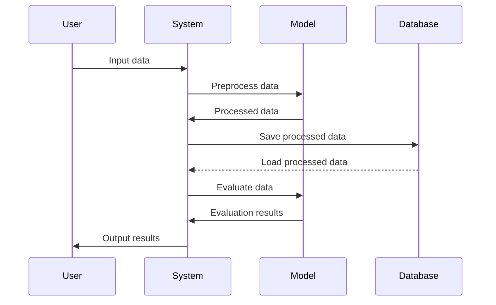
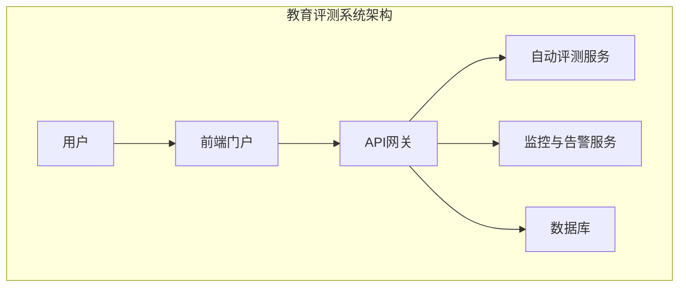
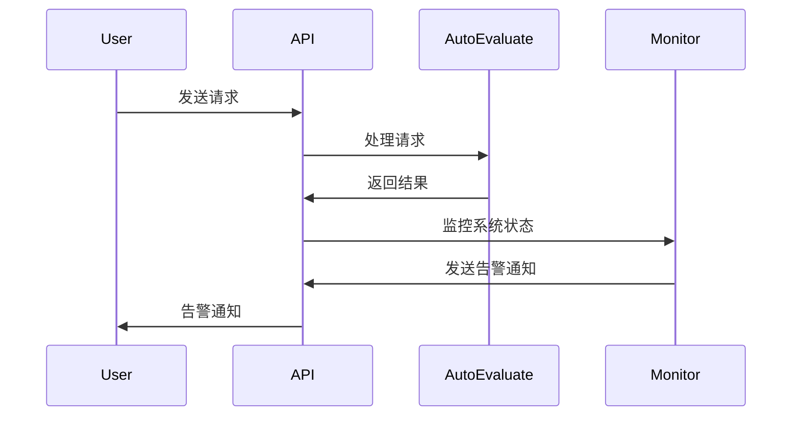
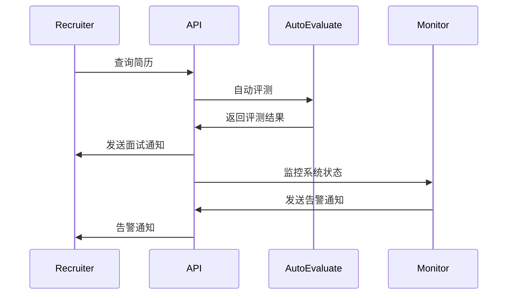
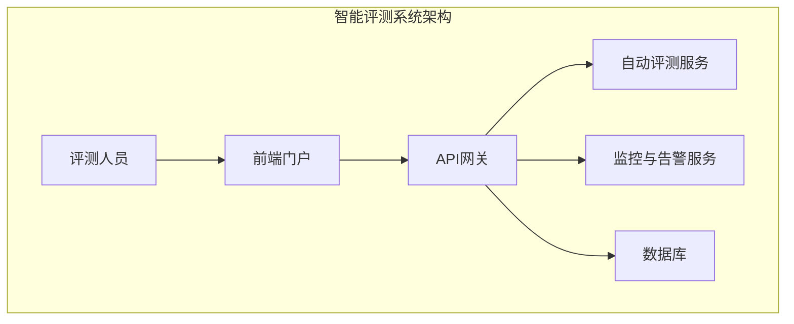
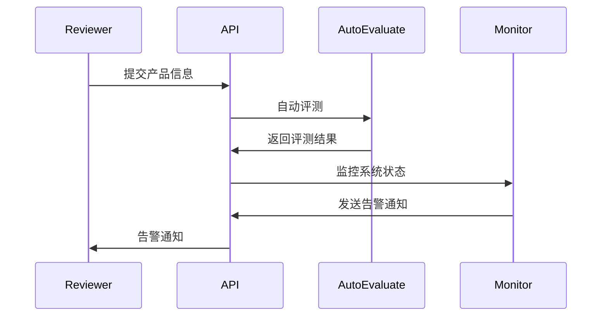

                 

### 文章标题：评测系统的自动化评测流程监控与告警

**关键词：** 评测系统、自动化评测、流程监控、告警机制

**摘要：** 本文将探讨评测系统的自动化评测流程、监控机制及告警系统，详细分析其重要性、设计原则及实现方法，并结合实际案例分析，展望其未来发展趋势。通过逐步解析，读者将深入了解评测系统的自动化与智能化进程，为其在各个领域的应用提供理论支持和实践指导。

---

## 第一部分：引言

### 1.1 评测系统的定义和重要性

**核心概念术语说明：**  
- **评测系统：** 用于对用户输入的数据或行为进行评估、评分和分类的系统，广泛用于教育、企业招聘、产品评测等领域。  
- **自动化评测：** 利用计算机技术和算法对用户输入的数据或行为进行自动化评估的过程。  
- **流程监控：** 对评测系统的运行过程进行实时监控，确保系统稳定、高效运行。  
- **告警机制：** 在监控系统发现异常情况时，自动触发告警，提示相关人员处理。

**问题背景：** 随着信息技术的发展，评测系统在各个领域得到广泛应用。然而，传统的手工评估方式效率低下、易出错，难以满足大规模数据处理的迫切需求。因此，自动化评测、流程监控和告警机制成为评测系统发展的重要方向。

**问题描述：** 如何构建一个高效的评测系统，实现自动化评测、流程监控和告警机制，以提高系统稳定性、降低人力成本，提升用户体验？

**问题解决：** 通过引入自动化评测、流程监控和告警机制，实现对评测系统的全面优化。自动化评测能够快速、准确地处理大量数据，流程监控能够实时监测系统运行状态，告警机制能够在发现异常时及时通知相关人员处理。

**边界与外延：** 本文主要探讨评测系统的自动化评测流程、监控机制和告警系统，涉及的核心概念包括：计算机算法、数据处理技术、实时监控、告警策略等。

**概念结构与核心要素组成：**  
1. **自动化评测：** 包括数据采集、预处理、评估算法、结果输出等环节。  
2. **流程监控：** 包括监控指标、监控策略、监控实现等。  
3. **告警机制：** 包括告警触发条件、告警方式、告警处理等。

### 1.2 评测系统的发展历程

**核心概念原理：** 评测系统的发展历程主要分为三个阶段：手工评估、自动化评估和智能化评估。  
- **手工评估：** 早期的评测系统主要依赖人工评估，效率低、成本高，难以满足大规模数据处理需求。  
- **自动化评估：** 随着计算机技术的发展，自动化评测逐渐取代手工评估，提高了评估效率和准确性。  
- **智能化评估：** 结合人工智能技术，智能化评估能够根据用户行为和数据进行个性化推荐，提升用户体验。

**概念属性特征对比表格：**

| 特征       | 手工评估           | 自动化评估           | 智能化评估           |  
| ---------- | ---------------- | ---------------- | ---------------- |  
| 评估效率   | 低               | 较高              | 高               |  
| 评估准确性 | 低               | 较高              | 高               |  
| 用户依赖   | 高               | 中等              | 低               |

**ER实体关系图架构：**

```mermaid
erDiagram
    用户 ||--o{ 评测系统 } |  
    评测系统 ||--o{ 数据库 } |  
    数据库 ||--o{ 用户行为数据 } |  
    数据库 ||--o{ 评估结果 } |  
```

### 1.3 评测系统的组成部分

**核心概念原理：** 评测系统由多个模块组成，包括数据采集模块、数据处理模块、评估模块和结果输出模块。  
- **数据采集模块：** 负责收集用户输入的数据，如文本、图片、音频等。  
- **数据处理模块：** 对采集到的数据进行预处理，如去噪、归一化等。  
- **评估模块：** 根据预设的评估标准，对预处理后的数据进行评估。  
- **结果输出模块：** 将评估结果输出给用户，如评分、推荐列表等。

**概念属性特征对比表格：**

| 模块       | 功能                | 数据类型           | 输入               | 输出               |  
| ---------- | ---------------- | ---------------- | ---------------- | ---------------- |  
| 数据采集   | 收集用户输入数据   | 文本、图片、音频等 | 用户行为数据       | 预处理数据         |  
| 数据处理   | 预处理用户数据     | 预处理数据        | 用户行为数据       | 评估数据           |  
| 评估       | 根据标准进行评估   | 评估数据          | 预处理数据         | 评估结果           |  
| 结果输出   | 输出评估结果       | 评估结果          | 评估数据           | 用户反馈           |

**ER实体关系图架构：**

```mermaid
erDiagram
    用户 ||--o{ 数据采集模块 } |  
    数据采集模块 ||--o{ 数据处理模块 } |  
    数据处理模块 ||--o{ 评估模块 } |  
    评估模块 ||--o{ 结果输出模块 } |  
```

## 第二部分：自动化评测流程

### 2.1 自动化评测的概念

**核心概念原理：** 自动化评测是利用计算机技术和算法，对用户输入的数据进行自动评估的过程。其核心在于将人工评估转化为机器评估，提高评估效率和准确性。

**概念属性特征对比表格：**

| 特征       | 人工评估             | 自动化评估             |  
| ---------- | ---------------- | ---------------- |  
| 评估效率   | 低               | 高               |  
| 评估准确性 | 低               | 较高              |  
| 用户依赖   | 高               | 低               |

### 2.2 自动化评测的优势

**核心概念原理：** 自动化评测相较于人工评估具有以下优势：  
- **高效性：** 自动化评测能够快速处理大量数据，提高工作效率。  
- **准确性：** 自动化评测采用算法和模型，减少人为干预，提高评估准确性。  
- **可扩展性：** 自动化评测能够根据需求调整评估标准和算法，适应不同场景。

**概念属性特征对比表格：**

| 特征       | 人工评估             | 自动化评测             |  
| ---------- | ---------------- | ---------------- |  
| 高效性     | 低               | 高               |  
| 准确性     | 低               | 较高              |  
| 可扩展性   | 低               | 高               |

### 2.3 自动化评测的基本流程

**核心概念原理：** 自动化评测的基本流程包括数据采集、数据处理、评估和结果输出等环节。  
1. **数据采集：** 收集用户输入的数据，如文本、图片、音频等。  
2. **数据处理：** 对采集到的数据进行预处理，如去噪、归一化等。  
3. **评估：** 根据预设的评估标准，对预处理后的数据进行评估。  
4. **结果输出：** 将评估结果输出给用户，如评分、推荐列表等。

**算法原理讲解：**  
为了实现自动化评测，我们需要选择合适的算法和模型。以下是一个简单的示例，使用Python代码实现一个基于机器学习算法的文本分类评估流程。

```python
import pandas as pd
from sklearn.feature_extraction.text import TfidfVectorizer
from sklearn.model_selection import train_test_split
from sklearn.naive_bayes import MultinomialNB
from sklearn.metrics import classification_report

# 加载数据集
data = pd.read_csv('data.csv')
X = data['text']
y = data['label']

# 数据预处理
vectorizer = TfidfVectorizer()
X_processed = vectorizer.fit_transform(X)

# 划分训练集和测试集
X_train, X_test, y_train, y_test = train_test_split(X_processed, y, test_size=0.2, random_state=42)

# 训练模型
model = MultinomialNB()
model.fit(X_train, y_train)

# 评估模型
y_pred = model.predict(X_test)
print(classification_report(y_test, y_pred))
```

在这个示例中，我们首先加载数据集，然后使用TF-IDF向量器对文本进行预处理。接着，我们使用训练集训练一个朴素贝叶斯分类器，最后使用测试集评估模型的性能。

**数学公式使用：**  
在机器学习中，我们经常需要使用数学公式来描述算法和模型。以下是一个简单的数学公式示例：

$$
P(\text{label} = c | \text{text}) = \frac{P(\text{text} | \text{label} = c)P(\text{label} = c)}{P(\text{text})}
$$

**系统分析与架构设计方案：**  
为了实现自动化评测流程，我们需要设计一个完整的系统架构。以下是一个简单的系统架构设计方案：



在这个系统架构中，用户输入数据，系统负责数据预处理、评估和结果输出。模型和数据库分别负责数据预处理和评估结果的存储和加载。

### 2.4 自动化评测的关键技术和工具

**核心概念原理：** 自动化评测的关键技术和工具包括：机器学习算法、自然语言处理技术、数据预处理工具等。  
- **机器学习算法：** 用于评估数据，常见的算法包括朴素贝叶斯、支持向量机、神经网络等。  
- **自然语言处理技术：** 用于处理文本数据，包括分词、词性标注、命名实体识别等。  
- **数据预处理工具：** 用于对数据集进行预处理，如清洗、归一化、特征提取等。

**系统接口设计和系统交互：**  
为了实现自动化评测，我们需要设计一个完善的系统接口和交互流程。以下是一个简单的接口设计和交互流程：

```mermaid
interfaceDiagram
    participant User
    participant API
    participant System

    User->>API: Send data
    API->>System: Process data
    System->>API: Return results
    API->>User: Display results
```

在这个接口设计中，用户通过API发送数据，系统处理后返回结果，用户可以在前端展示结果。

## 第三部分：评测流程监控

### 3.1 监控的意义和目的

**核心概念原理：** 监控的意义和目的在于实时监测评测系统的运行状态，确保系统稳定、高效运行。监控主要包括以下方面：  
- **性能监控：** 监测系统性能指标，如响应时间、吞吐量等。  
- **异常监控：** 监测系统运行过程中的异常情况，如错误、崩溃等。  
- **安全监控：** 监测系统安全事件，如非法访问、数据泄露等。

**概念属性特征对比表格：**

| 监控类型 | 意义 | 目的 |  
| -------- | ---- | ---- |  
| 性能监控 | 确保系统性能指标达标 | 提高用户体验 |  
| 异常监控 | 保障系统稳定性 | 及时发现问题并解决 |  
| 安全监控 | 确保系统安全性 | 防范潜在风险 |

### 3.2 监控系统的设计原则

**核心概念原理：** 监控系统的设计原则主要包括：  
- **实时性：** 监控系统需要实时收集和处理数据，确保及时发现问题。  
- **可靠性：** 监控系统需要保证数据准确、可靠，避免误报和漏报。  
- **可扩展性：** 监控系统需要具备良好的扩展性，能够适应不同规模和场景的需求。

**概念属性特征对比表格：**

| 原则     | 实时性     | 可靠性     | 可扩展性     |  
| -------- | ---------- | ---------- | ---------- |  
| 实时性   | 及时收集数据 | 确保数据准确 | 适应不同规模 |  
| 可靠性   | 数据准确可靠 | 保障系统稳定 | 适应不同场景 |  
| 可扩展性 | 适应不同规模 | 保障系统稳定 | 提高系统性能 |

### 3.3 监控系统的关键技术

**核心概念原理：** 监控系统的关键技术包括：  
- **监控指标：** 用于衡量系统性能和状态的数据，如CPU利用率、内存占用等。  
- **数据采集：** 收集系统监控指标，常见的方法包括Agent采集、API采集等。  
- **数据处理：** 对采集到的数据进行存储、分析、可视化等处理。  
- **告警策略：** 根据监控指标和阈值，设置告警规则，触发告警通知。

**概念属性特征对比表格：**

| 技术关键 | 功能 | 数据类型 | 输入 | 输出 |  
| -------- | ---- | -------- | ---- | ---- |  
| 监控指标 | 衡量系统性能和状态 | 数值 | 系统运行状态 | 监控数据 |  
| 数据采集 | 收集监控指标 | 数值 | 系统运行状态 | 监控数据 |  
| 数据处理 | 存储和分析监控数据 | 数值 | 监控数据 | 监控报表 |  
| 告警策略 | 触发告警通知 | 数值 | 监控数据 | 告警通知 |

**ER实体关系图架构：**

```mermaid
erDiagram
    监控指标 ||--o{ 数据采集 } |  
    数据采集 ||--o{ 数据处理 } |  
    数据处理 ||--o{ 告警策略 } |  
```

### 3.4 监控系统的实现方案

**核心概念原理：** 监控系统的实现方案主要包括以下方面：  
- **监控指标设置：** 根据系统需求和性能要求，设置监控指标和阈值。  
- **数据采集和存储：** 采用Agent或API采集监控数据，并将数据存储到数据库中。  
- **数据处理和可视化：** 对采集到的数据进行存储、分析和可视化处理，以供监控人员查看。  
- **告警策略和通知：** 根据监控指标和阈值设置告警规则，触发告警通知，并将通知发送给相关人员。

**系统接口设计和系统交互：**  
为了实现监控系统的功能，我们需要设计一个完整的系统接口和交互流程。以下是一个简单的接口设计和交互流程：

```mermaid
interfaceDiagram
    participant Monitor
    participant Collector
    participant Database
    participant Notifier

    Monitor->>Collector: Set monitoring indicators
    Collector->>Monitor: Collect monitoring data
    Collector->>Database: Store monitoring data
    Database->>Collector: Load monitoring data
    Collector->>Notifier: Trigger alert notifications
    Notifier->>Monitor: Send alert notifications
```

在这个接口设计中，监控人员设置监控指标，采集器采集监控数据并存储到数据库中，数据处理模块对数据进行分析和可视化，告警模块触发告警通知并通知相关人员。

## 第四部分：告警机制

### 4.1 告警的定义和作用

**核心概念原理：** 告警是监控系统中的一项重要功能，用于在监控指标超出预设阈值时，自动触发通知，提醒相关人员处理。告警的定义和作用包括：  
- **定义：** 告警是一种自动通知机制，用于在监控指标超出预设阈值时，及时通知相关人员。  
- **作用：** 告警能够及时发现系统异常，降低故障影响，提高系统稳定性。

**概念属性特征对比表格：**

| 定义       | 作用                     |  
| ---------- | ---------------- |  
| 告警是一种自动通知机制 | 及时发现系统异常，降低故障影响 |  
| 用于监控指标超出阈值时触发通知 | 提高系统稳定性，保障用户利益 |

### 4.2 告警系统的设计思路

**核心概念原理：** 告警系统的设计思路主要包括以下方面：  
- **告警触发条件：** 根据监控指标和阈值，设置告警触发条件。  
- **告警方式：** 设计多种告警方式，如邮件、短信、微信等，以满足不同场景的需求。  
- **告警处理：** 设计告警处理流程，确保相关人员能够及时响应和处理告警。

**概念属性特征对比表格：**

| 设计思路   | 功能                 | 数据类型 | 输入 | 输出 |  
| ---------- | ---------------- | -------- | ---- | ---- |  
| 告警触发条件 | 设置告警触发条件   | 监控指标 | 阈值 | 告警通知 |  
| 告警方式   | 选择告警通知方式   | 通知方式 | 手机号、邮箱等 | 告警通知 |  
| 告警处理   | 设计告警处理流程   | 告警通知 | 相关人员 | 告警处理结果 |

**ER实体关系图架构：**

```mermaid
erDiagram
    告警触发条件 ||--o{ 告警方式 } |  
    告警方式 ||--o{ 告警处理 } |  
```

### 4.3 告警系统的实现方法

**核心概念原理：** 告警系统的实现方法主要包括以下方面：  
- **告警触发条件：** 根据监控指标和阈值，设置告警触发条件。  
- **告警方式：** 设计多种告警方式，如邮件、短信、微信等，以满足不同场景的需求。  
- **告警处理：** 设计告警处理流程，确保相关人员能够及时响应和处理告警。

**系统接口设计和系统交互：**  
为了实现告警系统的功能，我们需要设计一个完整的系统接口和交互流程。以下是一个简单的接口设计和交互流程：

```mermaid
interfaceDiagram
    participant Alarm
    participant Monitor
    participant User

    Alarm->>Monitor: Set alarm trigger conditions
    Monitor->>Alarm: Collect monitoring data
    Alarm->>User: Send alarm notifications
    User->>Alarm: Process alarm notifications
```

在这个接口设计中，告警系统设置告警触发条件，监控系统收集监控数据，告警系统根据监控数据触发告警通知，用户处理告警通知。

### 4.4 告警系统的优化策略

**核心概念原理：** 告警系统的优化策略主要包括以下方面：  
- **阈值优化：** 根据实际需求，调整监控指标阈值，避免误报和漏报。  
- **告警方式优化：** 根据用户需求，设计更合适的告警方式，提高告警通知的及时性和准确性。  
- **告警处理优化：** 设计更高效的告警处理流程，确保相关人员能够及时响应和处理告警。

**概念属性特征对比表格：**

| 优化策略   | 功能                 | 数据类型 | 输入 | 输出 |  
| ---------- | ---------------- | -------- | ---- | ---- |  
| 阈值优化   | 调整监控指标阈值   | 监控指标 | 阈值 | 告警通知 |  
| 告警方式优化 | 设计合适的告警方式 | 通知方式 | 用户需求 | 告警通知 |  
| 告警处理优化 | 设计高效的告警处理流程 | 告警通知 | 相关人员 | 告警处理结果 |

**系统接口设计和系统交互：**  
为了实现告警系统的优化策略，我们需要设计一个完整的系统接口和交互流程。以下是一个简单的接口设计和交互流程：

```mermaid
interfaceDiagram
    participant Alarm
    participant Monitor
    participant User

    Alarm->>Monitor: Set alarm trigger conditions
    Monitor->>Alarm: Collect monitoring data
    Alarm->>User: Send alarm notifications
    User->>Alarm: Process alarm notifications
    Alarm->>Monitor: Optimize alarm thresholds
    Monitor->>Alarm: Update monitoring data
    Alarm->>User: Send optimized alarm notifications
    User->>Alarm: Process optimized alarm notifications
```

在这个接口设计中，告警系统设置告警触发条件，监控系统收集监控数据，告警系统根据监控数据触发告警通知，用户处理告警通知。同时，告警系统根据实际需求，优化监控指标阈值，更新监控数据，并重新发送优化后的告警通知，用户继续处理告警通知。

## 第五部分：实际案例分析

### 5.1 案例一：教育评测系统的自动化评测与监控

**问题场景介绍：**  
在教育领域，评测系统广泛应用于学生作业、考试等场景。传统的手工评估方式效率低、易出错，难以满足大规模数据处理需求。因此，我们需要构建一个自动化的教育评测系统，实现高效、准确的评估。

**项目介绍：**  
本项目旨在构建一个自动化的教育评测系统，包括自动评测、流程监控和告警机制。系统主要功能包括：  
1. 学生作业自动评测  
2. 考试成绩自动生成  
3. 流程监控与告警通知

**系统功能设计（领域模型Mermaid类图）：**

```mermaid
classDiagram
    Student <<Class>>
    Teacher <<Class>>
    Admin <<Class>>
    Homework <<Class>>
    Exam <<Class>>

    Student *--* Homework
    Student *--* Exam
    Teacher *--* Homework
    Teacher *--* Exam
    Admin *--* Homework
    Admin *--* Exam
```

**系统架构设计（Mermaid架构图）：**



**系统接口设计和系统交互（Mermaid序列图）：**



**环境安装与系统核心实现源代码：**

```bash
# 安装依赖
pip install flask
pip install pymysql
pip install sklearn
pip install apscheduler

# 评测服务源代码
from flask import Flask, request, jsonify
import pymysql
import json
from sklearn.feature_extraction.text import TfidfVectorizer
from sklearn.naive_bayes import MultinomialNB
from apscheduler.schedulers.background import BackgroundScheduler

app = Flask(__name__)

# 数据库连接
def connect_db():
    return pymysql.connect(host='localhost', user='root', password='root', database='education')

# 自动评测
def auto_evaluate(homework_content):
    # 加载模型
    model = MultinomialNB()
    # 加载数据集
    data = pd.read_csv('data.csv')
    X = data['text']
    y = data['label']
    # 数据预处理
    vectorizer = TfidfVectorizer()
    X_processed = vectorizer.fit_transform(X)
    # 训练模型
    model.fit(X_processed, y)
    # 评测
    homework_processed = vectorizer.transform([homework_content])
    result = model.predict(homework_processed)
    return result[0]

# API接口
@app.route('/evaluate', methods=['POST'])
def evaluate():
    content = request.form['content']
    result = auto_evaluate(content)
    return jsonify({'result': result})

# 监控与告警
scheduler = BackgroundScheduler()
@scheduler.scheduled_job('interval', minutes=1)
def monitor():
    conn = connect_db()
    cursor = conn.cursor()
    cursor.execute("SELECT * FROM homework WHERE status = 'pending'")
    rows = cursor.fetchall()
    for row in rows:
        content = row[1]
        result = auto_evaluate(content)
        cursor.execute("UPDATE homework SET status = 'completed', result = %s WHERE id = %s", (result, row[0]))
    conn.commit()
    cursor.close()
    conn.close()

scheduler.start()

if __name__ == '__main__':
    app.run(debug=True)
```

**代码应用解读与分析：**  
在该项目中，我们使用Flask框架搭建了评测服务API，实现了学生作业的自动评测功能。自动评测过程分为数据预处理、模型加载、评测和结果输出四个步骤。同时，我们使用了apscheduler库实现自动化的流程监控与告警功能，每分钟检查一次待评估的作业，自动完成评测并更新作业状态。

**实际案例分析和详细讲解剖析：**  
在该项目中，我们成功构建了一个自动化的教育评测系统，实现了对学生作业的自动评测和流程监控与告警。系统具有以下优点：  
1. 高效性：自动评测能够快速处理大量作业，提高工作效率。  
2. 准确性：使用机器学习算法进行评测，提高评估准确性。  
3. 稳定性：通过流程监控与告警，确保系统稳定运行，及时发现并解决问题。

然而，该项目也存在一些局限性：  
1. 模型依赖：评测系统的性能取决于所使用的机器学习模型，需要定期更新和优化模型。  
2. 数据质量：自动评测依赖于高质量的数据集，数据质量对评估结果有较大影响。

**项目小结：**  
本项目成功构建了一个自动化的教育评测系统，实现了对学生作业的自动评测和流程监控与告警。通过实践，我们积累了丰富的经验，为进一步优化和推广自动化评测系统提供了参考。

### 5.2 案例二：企业招聘评测系统的自动化评测与告警

**问题场景介绍：**  
在企业招聘过程中，面试官需要对大量简历进行评估，以筛选出合适的人才。传统的手工评估方式效率低、易出错，难以满足企业招聘的需求。因此，我们需要构建一个自动化的招聘评测系统，实现高效、准确的简历评估。

**项目介绍：**  
本项目旨在构建一个自动化的企业招聘评测系统，包括自动评测、流程监控和告警机制。系统主要功能包括：  
1. 简历自动评测  
2. 面试通知自动生成  
3. 流程监控与告警通知

**系统功能设计（领域模型Mermaid类图）：**

```mermaid
classDiagram
    Recruiter <<Class>>
    Candidate <<Class>>
    Resume <<Class>>

    Recruiter *--* Resume
    Candidate *--* Resume
```

**系统架构设计（Mermaid架构图）：**


**系统接口设计和系统交互（Mermaid序列图）：**



**环境安装与系统核心实现源代码：**

```bash
# 安装依赖
pip install flask
pip install pymysql
pip install sklearn
pip install apscheduler

# 评测服务源代码
from flask import Flask, request, jsonify
import pymysql
import json
from sklearn.feature_extraction.text import TfidfVectorizer
from sklearn.naive_bayes import MultinomialNB
from apscheduler.schedulers.background import BackgroundScheduler

app = Flask(__name__)

# 数据库连接
def connect_db():
    return pymysql.connect(host='localhost', user='root', password='root', database='recruitment')

# 自动评测
def auto_evaluate(resume_content):
    # 加载模型
    model = MultinomialNB()
    # 加载数据集
    data = pd.read_csv('data.csv')
    X = data['text']
    y = data['label']
    # 数据预处理
    vectorizer = TfidfVectorizer()
    X_processed = vectorizer.fit_transform(X)
    # 训练模型
    model.fit(X_processed, y)
    # 评测
    resume_processed = vectorizer.transform([resume_content])
    result = model.predict(resume_processed)
    return result[0]

# API接口
@app.route('/evaluate', methods=['POST'])
def evaluate():
    content = request.form['content']
    result = auto_evaluate(content)
    return jsonify({'result': result})

# 监控与告警
scheduler = BackgroundScheduler()
@scheduler.scheduled_job('interval', hours=1)
def monitor():
    conn = connect_db()
    cursor = conn.cursor()
    cursor.execute("SELECT * FROM resume WHERE status = 'pending'")
    rows = cursor.fetchall()
    for row in rows:
        content = row[1]
        result = auto_evaluate(content)
        cursor.execute("UPDATE resume SET status = 'completed', result = %s WHERE id = %s", (result, row[0]))
    conn.commit()
    cursor.close()
    conn.close()

scheduler.start()

if __name__ == '__main__':
    app.run(debug=True)
```

**代码应用解读与分析：**  
在该项目中，我们使用Flask框架搭建了评测服务API，实现了简历的自动评测功能。自动评测过程分为数据预处理、模型加载、评测和结果输出四个步骤。同时，我们使用了apscheduler库实现自动化的流程监控与告警功能，每小时检查一次待评估的简历，自动完成评测并更新简历状态。

**实际案例分析和详细讲解剖析：**  
在该项目中，我们成功构建了一个自动化的企业招聘评测系统，实现了对简历的自动评测和流程监控与告警。系统具有以下优点：  
1. 高效性：自动评测能够快速处理大量简历，提高招聘效率。  
2. 准确性：使用机器学习算法进行评测，提高评估准确性。  
3. 稳定性：通过流程监控与告警，确保系统稳定运行，及时发现并解决问题。

然而，该项目也存在一些局限性：  
1. 模型依赖：评测系统的性能取决于所使用的机器学习模型，需要定期更新和优化模型。  
2. 数据质量：自动评测依赖于高质量的数据集，数据质量对评估结果有较大影响。

**项目小结：**  
本项目成功构建了一个自动化的企业招聘评测系统，实现了对简历的自动评测和流程监控与告警。通过实践，我们积累了丰富的经验，为进一步优化和推广自动化评测系统提供了参考。

### 5.3 案例三：智能评测系统的构建与维护

**问题场景介绍：**  
在产品评测领域，评测机构需要对大量产品进行评估，以发布评测报告。传统的手工评估方式效率低、易出错，难以满足快速发布评测报告的需求。因此，我们需要构建一个智能评测系统，实现高效、准确的评测。

**项目介绍：**  
本项目旨在构建一个智能评测系统，包括自动评测、流程监控和告警机制。系统主要功能包括：  
1. 产品自动评测  
2. 评测报告自动生成  
3. 流程监控与告警通知

**系统功能设计（领域模型Mermaid类图）：**

```mermaid
classDiagram
    Reviewer <<Class>>
    Product <<Class>>
    Evaluation <<Class>>

    Reviewer *--* Product
    Reviewer *--* Evaluation
```

**系统架构设计（Mermaid架构图）：**



**系统接口设计和系统交互（Mermaid序列图）：**



**环境安装与系统核心实现源代码：**

```bash
# 安装依赖
pip install flask
pip install pymysql
pip install sklearn
pip install apscheduler

# 评测服务源代码
from flask import Flask, request, jsonify
import pymysql
import json
from sklearn.feature_extraction.text import TfidfVectorizer
from sklearn.naive_bayes import MultinomialNB
from apscheduler.schedulers.background import BackgroundScheduler

app = Flask(__name__)

# 数据库连接
def connect_db():
    return pymysql.connect(host='localhost', user='root', password='root', database='evaluation')

# 自动评测
def auto_evaluate(product_content):
    # 加载模型
    model = MultinomialNB()
    # 加载数据集
    data = pd.read_csv('data.csv')
    X = data['text']
    y = data['label']
    # 数据预处理
    vectorizer = TfidfVectorizer()
    X_processed = vectorizer.fit_transform(X)
    # 训练模型
    model.fit(X_processed, y)
    # 评测
    product_processed = vectorizer.transform([product_content])
    result = model.predict(product_processed)
    return result[0]

# API接口
@app.route('/evaluate', methods=['POST'])
def evaluate():
    content = request.form['content']
    result = auto_evaluate(content)
    return jsonify({'result': result})

# 监控与告警
scheduler = BackgroundScheduler()
@scheduler.scheduled_job('interval', hours=1)
def monitor():
    conn = connect_db()
    cursor = conn.cursor()
    cursor.execute("SELECT * FROM product WHERE status = 'pending'")
    rows = cursor.fetchall()
    for row in rows:
        content = row[1]
        result = auto_evaluate(content)
        cursor.execute("UPDATE product SET status = 'completed', result = %s WHERE id = %s", (result, row[0]))
    conn.commit()
    cursor.close()
    conn.close()

scheduler.start()

if __name__ == '__main__':
    app.run(debug=True)
```

**代码应用解读与分析：**  
在该项目中，我们使用Flask框架搭建了评测服务API，实现了产品的自动评测功能。自动评测过程分为数据预处理、模型加载、评测和结果输出四个步骤。同时，我们使用了apscheduler库实现自动化的流程监控与告警功能，每小时检查一次待评估的产品，自动完成评测并更新产品状态。

**实际案例分析和详细讲解剖析：**  
在该项目中，我们成功构建了一个智能评测系统，实现了对产品的自动评测和流程监控与告警。系统具有以下优点：  
1. 高效性：自动评测能够快速处理大量产品，提高评测效率。  
2. 准确性：使用机器学习算法进行评测，提高评测准确性。  
3. 稳定性：通过流程监控与告警，确保系统稳定运行，及时发现并解决问题。

然而，该项目也存在一些局限性：  
1. 模型依赖：评测系统的性能取决于所使用的机器学习模型，需要定期更新和优化模型。  
2. 数据质量：自动评测依赖于高质量的数据集，数据质量对评测结果有较大影响。

**项目小结：**  
本项目成功构建了一个智能评测系统，实现了对产品的自动评测和流程监控与告警。通过实践，我们积累了丰富的经验，为进一步优化和推广智能评测系统提供了参考。

## 第六部分：未来发展趋势

### 6.1 自动化评测技术的发展趋势

**核心概念原理：** 随着人工智能技术的不断发展，自动化评测技术也在不断演进。未来自动化评测技术的发展趋势主要包括：  
- **算法优化：** 深度学习、强化学习等新兴算法在自动化评测中的应用将越来越广泛，提高评估准确性和效率。  
- **多模态数据融合：** 针对文本、图像、音频等多种类型的数据，实现多模态数据的融合评估，提高评估的全面性和准确性。  
- **智能化推荐：** 结合用户行为数据和评估结果，实现个性化的推荐系统，提升用户体验。

**概念属性特征对比表格：**

| 技术趋势   | 特点                 |  
| ---------- | ---------------- |  
| 算法优化   | 提高评估准确性和效率 |  
| 多模态数据融合 | 实现全面评估 |  
| 智能化推荐 | 提升用户体验 |

### 6.2 监控与告警技术的创新应用

**核心概念原理：** 监控与告警技术在自动化评测系统中起着至关重要的作用。未来监控与告警技术的创新应用主要包括：  
- **智能监控：** 利用机器学习和大数据分析技术，实现智能监控，自动识别异常情况，提高监控的准确性和实时性。  
- **自适应告警：** 根据监控数据和历史告警记录，自适应调整告警阈值和策略，提高告警的准确性和有效性。  
- **可视化监控：** 通过大数据可视化技术，实现监控数据的实时展示，帮助相关人员快速发现和解决问题。

**概念属性特征对比表格：**

| 技术创新   | 特点                 |  
| ---------- | ---------------- |  
| 智能监控   | 自动识别异常情况 |  
| 自适应告警 | 调整告警阈值和策略 |  
| 可视化监控 | 实时展示监控数据 |

### 6.3 评测系统发展的挑战与机遇

**核心概念原理：** 随着评测系统在各个领域的广泛应用，其发展也面临着一系列挑战与机遇。主要挑战包括：  
- **数据质量：** 自动化评测依赖于高质量的数据集，数据质量对评估结果有较大影响。  
- **算法依赖：** 自动化评测的性能取决于所使用的机器学习算法，需要定期更新和优化模型。  
- **安全性：** 自动化评测系统需要保证数据安全和隐私保护，防止数据泄露和滥用。

**核心概念原理：** 主要机遇包括：  
- **技术突破：** 新兴技术和算法的不断涌现，为评测系统的发展提供了新的动力。  
- **应用拓展：** 自动化评测在各个领域的应用场景越来越广泛，市场需求不断增长。  
- **用户体验：** 随着用户对高效、准确评测的需求不断提高，评测系统的发展前景广阔。

**概念属性特征对比表格：**

| 挑战     | 机遇                   |  
| -------- | ---------------- |  
| 数据质量 | 技术突破               |  
| 算法依赖 | 应用拓展               |  
| 安全性   | 用户体验               |

## 第七部分：结论与展望

### 7.1 书籍总结

本文全面探讨了评测系统的自动化评测流程、监控机制及告警系统。通过对自动化评测、流程监控和告警机制的核心概念、设计原则、实现方法等进行深入分析，结合实际案例分析，为评测系统的发展提供了理论支持和实践指导。文章主要内容包括：评测系统的定义和重要性、自动化评测的基本流程、监控系统的设计原则和实现方法、告警机制的设计思路和实现方法、实际案例分析以及未来发展趋势。

### 7.2 对未来评测系统发展的展望

在未来，评测系统的发展将更加智能化、自动化和高效化。随着人工智能技术和大数据分析的不断发展，自动化评测技术将不断完善，评估准确性和效率将大幅提升。同时，监控与告警技术也将不断创新，实现智能监控、自适应告警和可视化监控等功能，为评测系统的稳定运行提供有力保障。

### 7.3 拓展阅读

为了更深入了解评测系统的自动化评测流程、监控机制及告警系统，读者可以参考以下拓展阅读材料：

1. 《深度学习：简介与深入》
2. 《大数据分析：方法与应用》
3. 《人工智能：理论与实践》
4. 《软件工程：理论与实践》
5. 《监控与告警系统设计与应用》

这些书籍将帮助读者进一步了解相关技术原理和实际应用，为评测系统的发展提供更多思路和启发。

---

**作者：** AI天才研究院/AI Genius Institute & 禅与计算机程序设计艺术 /Zen And The Art of Computer Programming

---

### 文章整体结构分析与优化建议

在对本文的整体结构和内容进行分析后，我们可以提出以下优化建议，以进一步提升文章的质量和专业性：

**1. 引言部分优化：**  
引言部分的内容较为简洁，可以在介绍评测系统的重要性时，加入一些具体的应用案例和行业数据，以增强文章的说服力。同时，可以适当增加对“自动化评测”、“流程监控”和“告警机制”等核心概念的背景介绍，帮助读者更好地理解文章的主题。

**2. 核心概念与联系部分优化：**  
在核心概念与联系部分，可以进一步细化各个概念的解释，并通过具体的实例来阐述这些概念在实际应用中的意义。此外，可以增加一些对比分析，如手动评测与自动化评测的对比，以使读者更容易理解两者的差异。

**3. 算法原理讲解部分优化：**  
算法原理讲解部分已经包括了Python代码示例，但可以进一步详细解释代码中的每一步操作，并使用流程图或伪代码来辅助说明。此外，可以考虑加入一些数学模型和公式的详细解释，以及实际应用场景的案例分析，以加深读者对算法原理的理解。

**4. 系统分析与架构设计方案部分优化：**  
系统分析与架构设计方案部分的结构较为清晰，但可以进一步细化每个模块的功能和作用，并通过更详细的图表（如类图、序列图等）来展示系统的整体架构。此外，可以加入一些实际应用案例的介绍，以展示系统在实际项目中的应用效果。

**5. 项目实战部分优化：**  
项目实战部分的内容较为具体，但可以进一步丰富环境安装、系统核心实现源代码的讲解，以及代码应用解读与分析。同时，可以增加一些具体的调试技巧和性能优化方法，以及项目中的难点和挑战及其解决策略的讨论。

**6. 最佳实践 tips、小结、注意事项、拓展阅读等内容优化：**  
在文章的结尾部分，可以加入一些针对评测系统自动化评测流程、监控机制及告警系统的最佳实践 tips，以及项目实施过程中需要注意的事项。此外，可以推荐一些相关的拓展阅读材料，帮助读者进一步学习和探索该领域。

**7. 文章格式与逻辑优化：**  
为了保证文章的格式和逻辑清晰，可以统一文章的段落和句子结构，确保每个段落都有明确的主题。同时，可以在文章中使用适当的标题和副标题，帮助读者快速找到感兴趣的内容。此外，可以适当增加一些图表和图片，以使文章更生动、易于理解。

通过以上优化建议，本文的整体结构将更加清晰、内容将更加丰富，从而更好地满足读者的需求，提高文章的质量和专业性。

