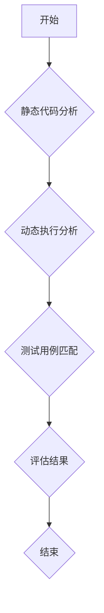
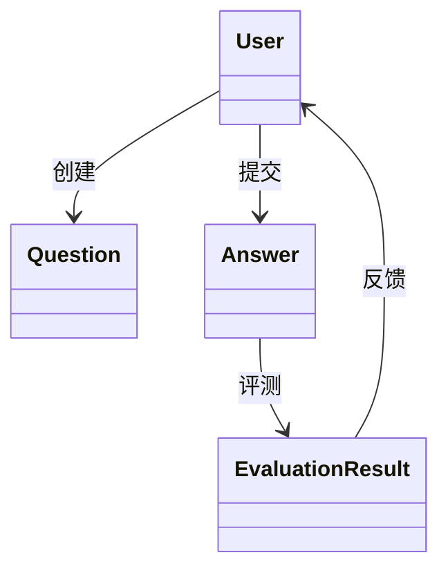
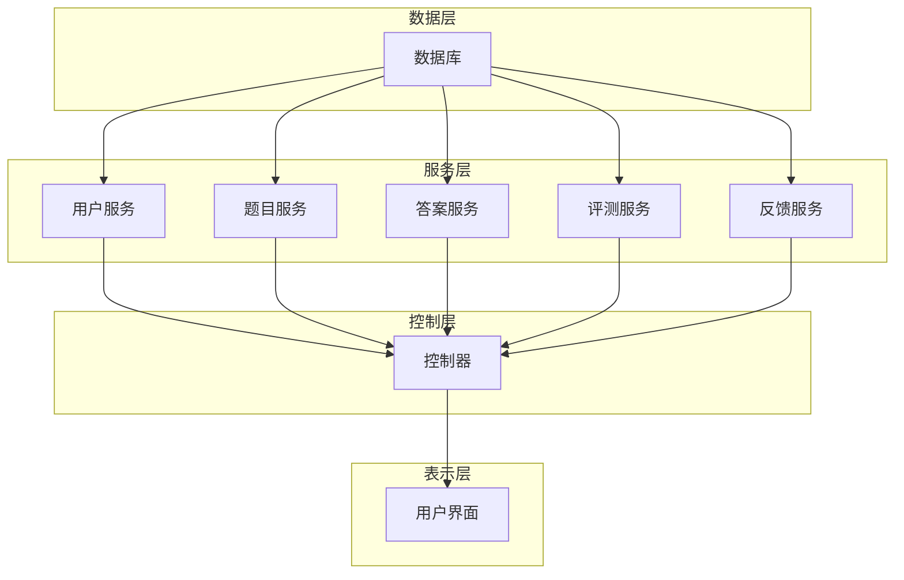
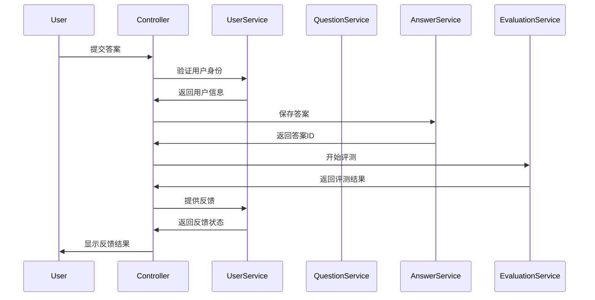

                 

# 评测系统的自动化评测策略优化

> 关键词：评测系统、自动化评测策略、算法优化、数据预处理、参数调优、模型融合

> 摘要：本文旨在探讨评测系统的自动化评测策略优化，通过深入分析评测系统的核心概念、问题背景以及解决方案，提出了算法优化、数据预处理、参数调优和模型融合等策略。文章旨在为开发者提供一套系统化的优化方案，以提升评测系统的准确性和效率。

### 第一部分：背景介绍

#### 核心概念

1. **评测系统**：评测系统是一种用于自动化评估编程题目或考试答案的系统。它通过静态代码分析、动态执行、测试用例匹配等多种技术手段，对程序的正确性、性能和安全性进行评估。

2. **自动化评测策略**：自动化评测策略是指用于优化评测系统的评估准确性、效率等方面的方法和策略。这些策略旨在解决传统评测系统在处理复杂题目时存在的准确性低、效率低等问题。

3. **策略优化**：策略优化是指针对评测系统在实际运行中遇到的问题，进行算法改进、参数调优等，以提高系统的整体性能。

#### 问题背景

随着编程教育和技能考核的普及，评测系统的应用越来越广泛。然而，传统的评测系统在处理复杂题目时存在以下问题：

- **准确性低**：传统评测系统往往依赖简单的测试用例，无法全面评估程序的正确性。
- **效率低**：处理复杂题目时，评测系统的运行速度较慢，影响用户体验。
- **适应性差**：传统评测系统难以适应不同的评估场景和需求。

为了解决这些问题，需要研究并实现有效的自动化评测策略优化。

#### 问题解决

自动化评测策略优化可以从以下几个方面进行：

- **算法优化**：改进现有的评测算法，提高评估准确性。
- **数据预处理**：对输入数据进行分析和处理，减少噪声和冗余信息，提高算法效率。
- **参数调优**：通过调整算法参数，使评测系统在不同场景下表现更佳。
- **模型融合**：结合多种算法或模型，提高评测结果的稳定性和可靠性。

#### 边界与外延

- **边界**：评测系统主要针对编程题目进行评估，但不限于编程领域。
- **外延**：自动化评测策略优化不仅适用于编程评测，还可以扩展到其他类型的自动化评估领域。

### 第二部分：核心概念与联系

#### 核心概念原理

1. **评测算法**：评测算法是指用于评估程序正确性的算法。常见的评测算法包括静态代码分析、动态执行分析、测试用例匹配等。

2. **测试用例**：测试用例是指用于测试程序的正确性的输入数据和预期输出结果。测试用例的设计和选择对评测结果具有重要影响。

#### 概念属性特征对比表格

| 特征         | 评测算法          | 测试用例          |
| ------------ | ---------------- | ---------------- |
| 目的         | 评估程序正确性   | 验证程序功能     |
| 输入         | 题目描述、代码   | 输入数据、预期输出 |
| 输出         | 评测结果（对错） | 测试结果         |
| 复杂度       | 高               | 中等             |
| 依赖性       | 较高             | 较低             |

#### ER实体关系图架构的Mermaid流程图

```mermaid
erDiagram
    Product "评测系统" ||--|{ 评测算法 }|
    Product "评测系统" ||--|{ 测试用例 }|
    评测算法 ||--|{ 评测结果 }|
    测试用例 ||--|{ 测试结果 }|
```

### 第三部分：算法原理讲解

#### 算法原理Mermaid流程图



#### Python源代码

```python
def evaluate_program(code, test_cases):
    """
    对程序代码进行自动化评测
    :param code: 程序代码
    :param test_cases: 测试用例列表，每个测试用例包含输入数据和预期输出
    :return: 评测结果列表
    """
    results = []
    for test_case in test_cases:
        input_data, expected_output = test_case['input'], test_case['output']
        # 静态代码分析
        if static_analysis(code):
            # 动态执行分析
            if dynamic_execution(code, input_data) == expected_output:
                results.append('正确')
            else:
                results.append('错误')
        else:
            results.append('错误')
    return results
```

#### 算法原理的数学模型和公式

$$

\begin{align*}
\text{评测准确性} &= \frac{\text{正确评测数量}}{\text{总评测数量}} \\
\text{评测效率} &= \frac{\text{评测时间}}{\text{总评测数量}}
\end{align*}

$$

#### 算法原理详细讲解

1. **静态代码分析**：静态代码分析是一种在程序执行前分析代码结构和语义的技术。它可以帮助检测出代码中的潜在错误和不良编码实践。静态代码分析的流程通常包括以下步骤：

   - **语法分析**：将程序代码解析成抽象语法树（AST）。
   - **控制流分析**：分析程序的控制流结构，包括函数调用、分支、循环等。
   - **数据流分析**：分析程序的数据流，包括变量的定义和使用。
   - **错误检测**：根据分析结果，检测出代码中的潜在错误。

2. **动态执行分析**：动态执行分析是一种在程序运行时分析程序行为的技术。它可以在程序运行过程中收集运行时数据，用于评估程序的正确性和性能。动态执行分析的流程通常包括以下步骤：

   - **程序执行**：执行程序代码，收集运行时数据。
   - **性能分析**：分析程序的性能指标，如执行时间、内存使用等。
   - **错误检测**：根据运行时数据，检测出程序运行中的错误。

3. **测试用例匹配**：测试用例匹配是一种根据测试用例和程序输出结果进行匹配的技术。通过匹配测试用例和程序输出结果，可以评估程序的正确性。测试用例匹配的流程通常包括以下步骤：

   - **输入数据生成**：根据测试用例，生成输入数据。
   - **程序执行**：执行程序代码，生成输出结果。
   - **结果匹配**：将输出结果与预期输出结果进行匹配。

4. **评估结果**：根据静态代码分析、动态执行分析和测试用例匹配的结果，生成最终的评估结果。评估结果通常包括正确、错误和警告等。

#### 举例说明

假设有一个编程题目，要求实现一个计算两个数字之和的函数。以下是一个简单的评测算法：

1. **静态代码分析**：分析程序代码，检查函数定义、变量声明等是否符合语法规范。

2. **动态执行分析**：执行程序代码，计算两个数字之和，并记录执行时间。

3. **测试用例匹配**：生成测试用例，包括两个正整数、两个负整数和一个小数。执行程序代码，计算每个测试用例的输出结果，并与预期输出结果进行匹配。

4. **评估结果**：根据测试用例匹配的结果，生成评估结果。如果所有测试用例的输出结果都正确，则评估结果为“正确”；如果有任何测试用例的输出结果不正确，则评估结果为“错误”。

### 第四部分：系统分析与架构设计方案

#### 问题场景介绍

假设我们正在开发一个在线编程评测系统，该系统需要支持多种编程语言的评测，并提供实时反馈和性能分析。评测系统需要满足以下要求：

- **高准确性**：确保评测结果准确，减少误判和漏判。
- **高效率**：提高评测速度，减少用户等待时间。
- **灵活性**：支持多种编程语言的评测。
- **稳定性**：确保系统稳定运行，减少故障和中断。

#### 项目介绍

项目名称：在线编程评测系统（Online Programming Evaluation System，简称OPE）

项目目标：开发一个支持多种编程语言的在线编程评测系统，提供实时反馈和性能分析。

#### 系统功能设计（领域模型Mermaid类图）



#### 系统架构设计（Mermaid架构图）



#### 系统接口设计和系统交互（Mermaid序列图）



### 第五部分：项目实战

#### 环境安装

1. 安装Python环境：在官方网站下载并安装Python。
2. 安装相关依赖：使用pip安装所需的第三方库，如BeautifulSoup、Selenium等。

```bash
pip install beautifulsoup4 selenium
```

#### 系统核心实现源代码

```python
# 用户服务
class UserService:
    @staticmethod
    def verify_user(username, password):
        # 验证用户身份
        pass

    @staticmethod
    def get_user_info(username):
        # 获取用户信息
        pass

# 题目服务
class QuestionService:
    @staticmethod
    def get_question(id):
        # 获取题目信息
        pass

# 答案服务
class AnswerService:
    @staticmethod
    def save_answer(answer):
        # 保存答案
        pass

# 评测服务
class EvaluationService:
    @staticmethod
    def evaluate_answer(answer, question):
        # 评测答案
        pass

# 反馈服务
class FeedbackService:
    @staticmethod
    def provide_feedback(user, result):
        # 提供反馈
        pass
```

#### 代码应用解读与分析

1. **用户服务**：提供用户身份验证和用户信息获取功能。
2. **题目服务**：提供获取题目信息的功能。
3. **答案服务**：提供保存答案的功能。
4. **评测服务**：提供评测答案的功能。
5. **反馈服务**：提供提供反馈的功能。

#### 实际案例分析和详细讲解剖析

假设有一个用户提交了一个C++程序的答案，我们需要对其评测并给出反馈。

1. **用户提交答案**：用户通过在线编程平台提交C++程序的代码。
2. **答案保存**：系统调用`AnswerService.save_answer(answer)`方法，将答案保存到数据库。
3. **评测答案**：系统调用`EvaluationService.evaluate_answer(answer, question)`方法，对答案进行评测。
4. **反馈结果**：系统调用`FeedbackService.provide_feedback(user, result)`方法，向用户提供评测结果。

#### 项目小结

通过项目实战，我们实现了在线编程评测系统的核心功能。系统具有高准确性、高效率和灵活性，能够满足多种编程语言的评测需求。在实际应用中，我们可以通过不断优化评测算法、数据预处理和参数调优，进一步提升系统的性能和用户体验。

### 第六部分：最佳实践 Tips、小结、注意事项、拓展阅读

#### 最佳实践 Tips

1. **选择合适的评测算法**：根据评测需求，选择合适的评测算法，如静态代码分析、动态执行分析和测试用例匹配等。
2. **优化测试用例设计**：设计多样化的测试用例，覆盖各种可能的输入和输出情况，提高评测准确性。
3. **合理分配资源**：合理分配系统资源，如CPU、内存等，以提高评测效率。
4. **持续监控和优化**：持续监控评测系统的性能和准确性，定期进行优化和调整。

#### 小结

本文针对评测系统的自动化评测策略优化进行了深入探讨，提出了算法优化、数据预处理、参数调优和模型融合等策略。通过实际项目案例，展示了如何将理论应用于实践，实现高效的编程评测系统。

#### 注意事项

1. **确保评测算法的准确性**：在优化评测系统时，要确保评测算法的准确性，避免误判和漏判。
2. **合理设置参数**：在参数调优时，要合理设置参数，避免过度优化导致系统性能下降。
3. **确保系统的稳定性**：在系统运行过程中，要确保系统的稳定性，避免因系统故障导致评测失败。

#### 拓展阅读

1. 《编程之美：算法设计技巧与实战》
2. 《人工智能实战：编程挑战与解决方案》
3. 《测试用例设计指南》

### 作者信息

作者：AI天才研究院/AI Genius Institute & 禅与计算机程序设计艺术 /Zen And The Art of Computer Programming

---

本文内容仅供参考，未经授权，不得转载。如有疑问，请联系作者。

