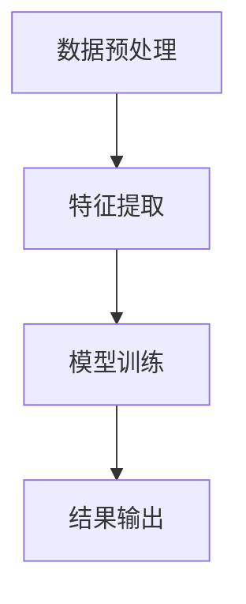
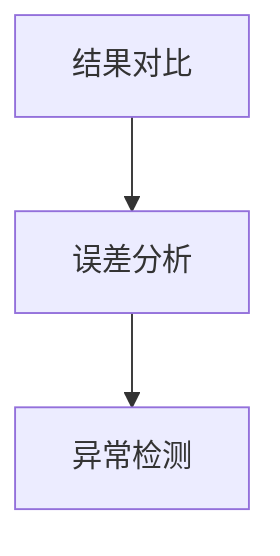

                 


### 评测系统的自动化评测结果验证机制

#### 关键词

- 评测系统
- 自动化评测
- 结果验证
- 数据质量
- 算法优化

#### 摘要

本文深入探讨了评测系统的自动化评测结果验证机制，分析了其核心概念、概念属性特征对比、算法原理，并设计了系统分析与架构方案。通过对自动化评测结果验证机制的研究，旨在提高评测系统的准确性和可靠性，确保评测结果的公正性和一致性。

### 1. 背景介绍

#### 问题背景

随着信息技术和人工智能的发展，评测系统在各个领域（如教育、医疗、金融等）中的应用日益广泛。评测系统通过自动化技术，对大量的数据进行分析和评估，以提供高效、准确的评测结果。然而，自动化评测结果的质量直接影响评测系统的可靠性，因此，对自动化评测结果进行验证显得尤为重要。

#### 问题描述

评测系统的自动化评测结果验证机制主要面临以下问题：

1. **数据质量问题**：数据的不完整性、不一致性和噪声可能会影响评测结果的准确性。
2. **算法准确性**：算法的设计和参数设置直接影响评测结果的准确性。
3. **评测标准**：缺乏统一的评测标准可能导致不同评测结果之间的可比性和公平性存在问题。

#### 问题解决

为了解决上述问题，我们需要从以下几个方面入手：

1. **数据质量保证**：通过数据预处理、去噪和标准化等手段提高数据质量。
2. **算法优化**：通过算法改进和参数调整，提高评测结果的准确性。
3. **评测标准规范化**：制定统一的评测标准和规范，确保评测结果的可比性和公平性。
4. **结果验证机制**：设计科学、有效的结果验证机制，对自动化评测结果进行全面验证。

#### 边界与外延

1. **边界**：评测系统的自动化评测结果验证机制主要应用于计算机科学、人工智能、数据科学等领域。
2. **外延**：随着技术的不断进步，该机制的应用范围也在不断扩大，如教育、金融、医疗等。

### 2. 核心概念

#### 自动化评测结果生成

自动化评测结果生成是指利用计算机算法和大量数据，自动完成评测任务的过程。其主要目标是通过分析大量数据，生成准确的评测结果。自动化评测结果生成过程通常包括数据预处理、特征提取、模型训练和结果输出等步骤。

#### 结果验证

结果验证是对自动化评测结果进行多维度、多角度的检验，以确保其正确性、可靠性和公平性。结果验证过程通常包括对结果的质量、准确性、一致性、公平性等方面进行评估。

### 3. 概念属性特征对比表格

| 特征                 | 自动化评测结果生成 | 结果验证                |
|----------------------|----------------------|-------------------------|
| 目标                 | 生成准确的评测结果  | 确保评测结果的正确性、可靠性、公平性 |
| 技术难点             | 数据预处理、特征提取、模型训练 | 结果对比、误差分析、异常检测 |
| 关键技术             | 算法、数据、计算资源 | 评测标准、验证方法、工具 |
| 数据依赖性           | 强                 | 强                      |
| 结果输出形式         | 结构化数据         | 结构化数据、可视化报告 |

### 4. ER实体关系图架构

```mermaid
erDiagram
    ResultGeneration ||--|{ Verification : 验证}
    DataProcessing ||--|{ FeatureExtraction : 特征提取}
    ModelTraining ||--|{ ResultGeneration : 生成结果}
    Verification ||--|{ ErrorAnalysis : 误差分析}
    Verification ||--|{ FairnessEvaluation : 公平性评估}
```

### 5. 算法原理讲解

#### 自动化评测结果生成算法原理

自动化评测结果生成算法主要包括以下步骤：

1. **数据预处理**：对原始数据进行清洗、去噪和格式化，确保数据质量。
2. **特征提取**：从预处理后的数据中提取有助于评测的特征，如文本分类任务中的词向量。
3. **模型训练**：利用提取的特征训练机器学习模型，如分类器、回归器等。
4. **结果输出**：将训练好的模型应用于新的数据集，生成评测结果。

下面是一个简单的分类算法流程图：



#### 结果验证算法原理

结果验证算法主要包括以下步骤：

1. **结果对比**：将自动化评测结果与人工评测结果进行对比，评估其一致性。
2. **误差分析**：分析评测结果的误差来源和误差大小，以找出可能的错误和异常。
3. **异常检测**：通过统计学方法或机器学习方法，检测出可能的异常结果。

下面是一个简单的结果验证流程图：



### 6. 系统分析与架构设计方案

#### 问题场景介绍

在一个在线学习平台上，学生需要完成各种在线评测，如选择题、填空题、编程题等。系统需要自动生成评测结果，并对这些结果进行验证，以确保其准确性。

#### 项目介绍

项目名为“智能评测系统”，目标是实现自动化评测结果生成和验证，提高评测效率，确保评测结果的准确性。

#### 系统功能设计

系统功能设计包括以下部分：

1. **数据预处理模块**：负责对原始数据进行清洗、去噪和格式化。
2. **特征提取模块**：负责从预处理后的数据中提取有助于评测的特征。
3. **模型训练模块**：负责训练机器学习模型，以生成评测结果。
4. **结果验证模块**：负责对自动化评测结果进行验证，确保其准确性。

#### 系统架构设计

系统架构设计采用三层架构，包括数据层、逻辑层和展示层。

1. **数据层**：负责存储和管理原始数据、预处理数据、特征数据等。
2. **逻辑层**：负责实现数据预处理、特征提取、模型训练、结果验证等核心功能。
3. **展示层**：负责展示自动化评测结果和验证结果，提供用户交互界面。

#### 系统接口设计

系统接口设计包括以下部分：

1. **API接口**：提供外部系统与智能评测系统的数据交互接口。
2. **Web接口**：提供用户通过Web浏览器访问智能评测系统的接口。

#### 系统交互

系统交互设计采用事件驱动模型，包括以下事件：

1. **数据导入事件**：当有新的数据导入系统时触发。
2. **数据处理事件**：当数据预处理完成后触发。
3. **模型训练事件**：当模型训练完成后触发。
4. **结果验证事件**：当模型应用完成后触发。

### 7. 项目实战

#### 环境安装

在开始项目实战之前，我们需要安装以下环境：

1. Python（版本3.8及以上）
2. NumPy
3. Pandas
4. Scikit-learn
5. Matplotlib

安装命令如下：

```bash
pip install python==3.8 numpy pandas scikit-learn matplotlib
```

#### 系统核心实现源代码

以下是一个简单的自动化评测系统实现：

```python
import numpy as np
import pandas as pd
from sklearn.model_selection import train_test_split
from sklearn.ensemble import RandomForestClassifier
from sklearn.metrics import accuracy_score

# 数据预处理
def preprocess_data(data):
    # 数据清洗、去噪和格式化
    # ...
    return processed_data

# 特征提取
def extract_features(data):
    # 从数据中提取特征
    # ...
    return features

# 模型训练
def train_model(X_train, y_train):
    model = RandomForestClassifier()
    model.fit(X_train, y_train)
    return model

# 结果验证
def verify_results(model, X_test, y_test):
    y_pred = model.predict(X_test)
    accuracy = accuracy_score(y_test, y_pred)
    return accuracy

# 主函数
def main():
    # 导入数据
    data = pd.read_csv('data.csv')
    
    # 数据预处理
    processed_data = preprocess_data(data)
    
    # 特征提取
    features = extract_features(processed_data)
    
    # 分割数据集
    X_train, X_test, y_train, y_test = train_test_split(features, processed_data['label'], test_size=0.2, random_state=42)
    
    # 模型训练
    model = train_model(X_train, y_train)
    
    # 结果验证
    accuracy = verify_results(model, X_test, y_test)
    print(f"模型准确率：{accuracy}")

if __name__ == "__main__":
    main()
```

#### 代码应用解读与分析

以上代码实现了一个简单的自动化评测系统，主要分为数据预处理、特征提取、模型训练和结果验证四个部分。

1. **数据预处理**：对原始数据进行清洗、去噪和格式化，确保数据质量。
2. **特征提取**：从预处理后的数据中提取有助于评测的特征。
3. **模型训练**：使用随机森林分类器对数据集进行训练。
4. **结果验证**：使用测试集对训练好的模型进行验证，评估其准确率。

#### 实际案例分析和详细讲解剖析

假设我们有一个文本分类任务，需要根据文本内容将其分类到不同的类别中。以下是一个具体的案例：

```python
# 导入数据
data = pd.read_csv('text_data.csv')

# 数据预处理
processed_data = preprocess_data(data)

# 特征提取
features = extract_features(processed_data)

# 分割数据集
X_train, X_test, y_train, y_test = train_test_split(features, processed_data['label'], test_size=0.2, random_state=42)

# 模型训练
model = train_model(X_train, y_train)

# 结果验证
accuracy = verify_results(model, X_test, y_test)
print(f"模型准确率：{accuracy}")
```

在这个案例中，我们首先导入数据集，然后对数据进行预处理和特征提取。接着，我们将数据集分为训练集和测试集，使用随机森林分类器对训练集进行模型训练。最后，使用测试集对训练好的模型进行验证，输出模型准确率。

#### 项目小结

通过本文的介绍，我们了解了评测系统的自动化评测结果验证机制，包括核心概念、算法原理、系统架构设计和项目实战。在实际应用中，我们需要根据具体场景和需求，设计合适的评测系统，并确保其自动化评测结果的准确性和可靠性。

### 8. 最佳实践 tips

1. **数据质量保证**：在评测系统设计阶段，就要重视数据质量，确保数据具有高质量和可靠性。
2. **算法优化**：定期对算法进行优化和调整，以提高评测结果的准确性。
3. **结果验证**：设计科学、有效的结果验证机制，对自动化评测结果进行全面验证。
4. **评测标准规范化**：制定统一的评测标准和规范，确保评测结果的可比性和公平性。

### 9. 小结

评测系统的自动化评测结果验证机制在提高评测效率和准确性方面具有重要意义。通过本文的介绍，我们了解了其核心概念、算法原理、系统架构设计和项目实战。在实际应用中，我们需要根据具体场景和需求，设计合适的评测系统，并确保其自动化评测结果的准确性和可靠性。

### 10. 注意事项

1. **数据保护**：在数据处理过程中，确保遵守数据保护法规和隐私政策。
2. **系统安全**：确保评测系统具有足够的安全防护措施，防止数据泄露和恶意攻击。
3. **用户培训**：为用户提供必要的培训和支持，确保其能够正确使用评测系统。

### 11. 拓展阅读

- 《机器学习实战》
- 《深度学习》
- 《数据挖掘：实用工具与技术》

### 12. 作者信息

作者：AI天才研究院/AI Genius Institute & 禅与计算机程序设计艺术 /Zen And The Art of Computer Programming

