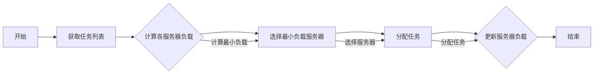
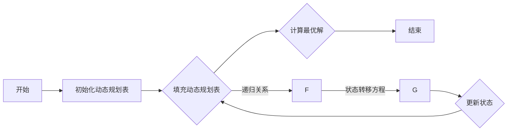
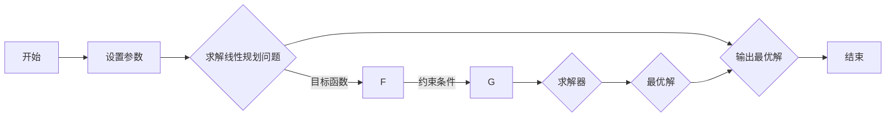
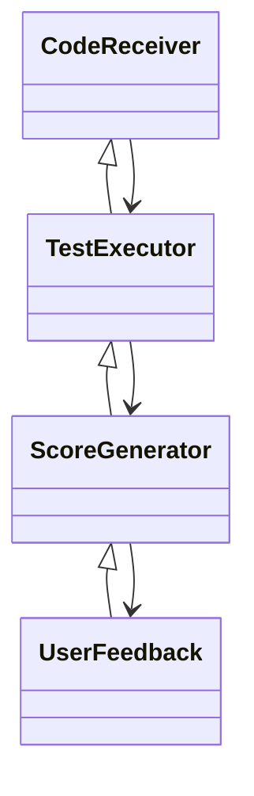
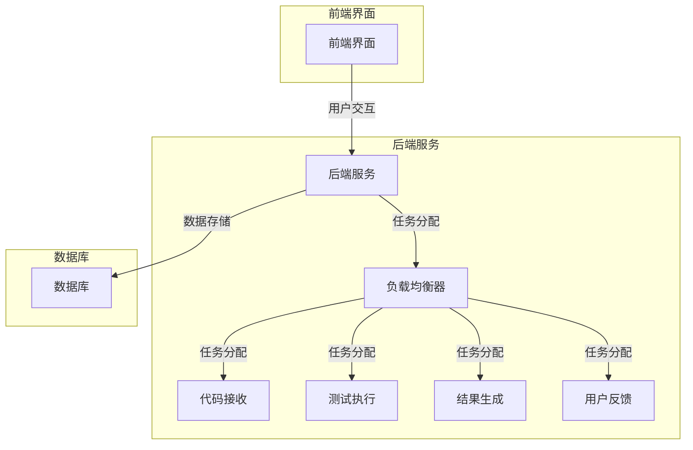
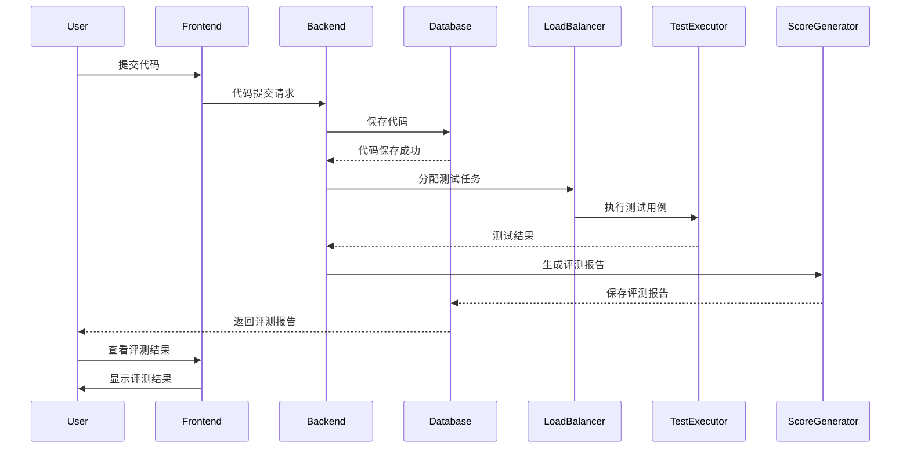
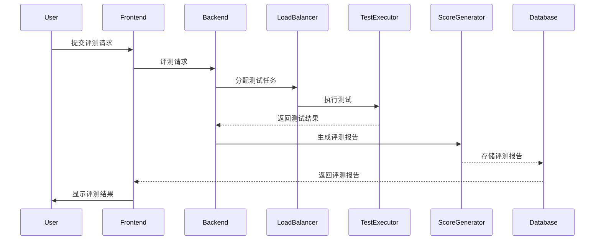

                 

## 评测系统的自动化评测资源调度优化

### 关键词

- 评测系统
- 资源调度
- 优化算法
- 自动化
- 编程竞赛

### 摘要

本文将深入探讨评测系统的自动化评测资源调度优化，旨在通过一系列优化算法，提升评测系统的效率和准确性。我们首先介绍评测系统的定义和核心功能，然后详细分析自动化评测资源调度的意义与挑战。接着，本文将讲解贪心算法、动态规划算法和线性规划算法的原理与应用，并通过实际项目案例，展示如何进行系统设计与实现，最终总结最佳实践和注意事项。

### 目录大纲

----------------------------------------------------------------

## 第一部分: 评测系统的自动化评测资源调度优化基础

### 第1章: 评测系统的概述与问题背景

#### 1.1 评测系统的定义与核心功能

#### 1.2 评测系统在编程竞赛中的应用

#### 1.3 自动化评测资源调度的意义与挑战

### 第2章: 核心概念与联系

#### 2.1 自动化评测资源调度的核心概念

#### 2.2 自动化评测资源调度的关键属性特征对比

#### 2.3 自动化评测资源调度的ER实体关系图

## 第二部分: 自动化评测资源调度优化算法原理讲解

### 第3章: 贪心算法

#### 3.1 贪心算法的基本原理

#### 3.2 贪心算法的应用场景

#### 3.3 Python代码实现与Mermaid流程图

### 第4章: 动态规划算法

#### 4.1 动态规划算法的基本原理

#### 4.2 动态规划算法的应用场景

#### 4.3 Python代码实现与Mermaid流程图

### 第5章: 线性规划算法

#### 5.1 线性规划算法的基本原理

#### 5.2 线性规划算法的应用场景

#### 5.3 Python代码实现与Mermaid流程图

## 第三部分: 系统分析与架构设计

### 第6章: 系统功能设计

#### 6.1 领域模型Mermaid类图

#### 6.2 系统架构设计Mermaid架构图

#### 6.3 系统接口设计

#### 6.4 系统交互Mermaid序列图

### 第7章: 项目实战

#### 7.1 环境安装与配置

#### 7.2 系统核心实现源代码

#### 7.3 代码应用解读与分析

#### 7.4 实际案例分析与详细讲解剖析

#### 7.5 项目小结

## 第四部分: 最佳实践与总结

### 第8章: 最佳实践 Tips

### 第9章: 小结与注意事项

### 第10章: 拓展阅读

----------------------------------------------------------------

## 第1章: 评测系统的概述与问题背景

### 1.1 评测系统的定义与核心功能

评测系统是一种自动化的测试和评估工具，广泛应用于编程竞赛、在线编程教育、软件开发质量保证等领域。其核心功能包括自动接收代码输入、执行测试用例、评估代码性能和准确性，并生成详细的评测报告。评测系统不仅能够快速、准确地评估代码的正确性，还能提供实时反馈，帮助开发者迅速定位和修复问题。

在编程竞赛中，评测系统扮演着至关重要的角色。随着参赛人数和比赛规模的不断扩大，人工评测不仅效率低下，而且容易受到主观因素的影响。自动化评测系统能够在短时间内处理大量的代码提交，提高比赛的整体效率，确保公平性和公正性。

### 1.2 评测系统在编程竞赛中的应用

编程竞赛通常包括多个阶段，如初赛、复赛和决赛。评测系统在这些阶段中扮演着关键角色。首先，在初赛阶段，评测系统对参赛者的代码进行初步评估，筛选出符合要求的方案。然后，在复赛和决赛阶段，评测系统对参赛者的代码进行深度评估，包括性能测试、功能测试和代码质量评估等。

评测系统在编程竞赛中的应用不仅提高了比赛的公平性和透明度，还有助于发现优秀的编程人才。同时，评测系统还可以为开发者提供宝贵的反馈信息，帮助他们提升编程技能和代码质量。

### 1.3 自动化评测资源调度的意义与挑战

自动化评测资源调度是评测系统的重要组成部分，其核心目标是在有限的资源下，最大化评测效率和准确性。自动化评测资源调度的意义在于：

1. **提高评测效率**：通过优化资源调度策略，可以减少代码评测的等待时间，提高整体比赛的效率。
2. **保证评测准确性**：合理的资源调度能够确保评测任务均衡分布，减少因资源不足导致的评测错误。
3. **动态调整资源**：自动化评测资源调度可以根据实时负载情况动态调整资源分配，提高系统的灵活性。

然而，实现自动化评测资源调度也面临诸多挑战：

1. **负载均衡**：如何在大量的评测任务中实现负载均衡，是自动化评测资源调度需要解决的首要问题。
2. **资源调度策略**：选择合适的资源调度策略，既要考虑评测效率，又要确保评测准确性。
3. **动态调整**：实时监测系统负载，动态调整资源分配，以应对突发情况。

本文将深入探讨自动化评测资源调度的核心概念、关键属性特征对比以及优化算法，并通过实际项目案例展示系统设计与实现过程。接下来，我们将进一步分析自动化评测资源调度的核心概念和联系。

## 第2章: 核心概念与联系

### 2.1 自动化评测资源调度的核心概念

自动化评测资源调度涉及多个核心概念，包括评测任务、资源、负载均衡、调度策略等。以下是这些核心概念的详细定义：

#### 评测任务

评测任务是指对代码进行测试、评估和评分的过程。每个评测任务通常包含测试用例集、评测标准和评测结果等。评测任务可以看作是评测系统需要完成的基本工作单元。

#### 资源

资源是指在评测过程中使用的硬件和软件资源，如计算资源（CPU、内存）、存储资源和网络资源等。资源是评测任务执行的基础，其充足与否直接影响到评测系统的性能和效率。

#### 负载均衡

负载均衡是指将评测任务合理地分配到不同的资源上，以避免某些资源过度负载，从而保证整个评测系统的稳定运行。负载均衡的目标是最大化资源利用率，同时确保评测任务的及时完成。

#### 调度策略

调度策略是指分配评测任务到资源上的规则和方法。常见的调度策略包括轮询调度、最少连接调度、动态优先级调度等。调度策略的选择直接影响评测系统的效率和准确性。

### 2.2 自动化评测资源调度的关键属性特征对比

为了更好地理解自动化评测资源调度的核心概念，我们需要对比关键属性特征。以下表格展示了不同属性特征的对比：

| 属性特征 | 描述 | 对比 |
| --- | --- | --- |
| 评测任务类型 | 包括功能测试、性能测试等 | 功能测试关注代码功能实现，性能测试关注代码执行效率 |
| 资源类型 | 包括计算资源、存储资源、网络资源等 | 计算资源影响评测速度，存储资源影响代码存储容量，网络资源影响评测结果的传输速度 |
| 负载均衡策略 | 包括轮询调度、最少连接调度等 | 轮询调度简单，但可能导致资源不平衡；最少连接调度考虑资源利用率，但计算复杂度较高 |
| 调度策略实现 | 包括基于优先级的调度、基于负载的调度等 | 基于优先级的调度优先执行高优先级任务，基于负载的调度根据资源负载动态调整任务分配 |

### 2.3 自动化评测资源调度的ER实体关系图

为了更直观地展示自动化评测资源调度的核心概念和联系，我们可以使用ER（实体关系）图来描述。以下是一个简化的ER实体关系图：

```mermaid
erDiagram
    Task ||--|{ Resource }||> Resource
    Task ||--|{ SchedulePolicy }||> SchedulePolicy
    Resource ||--|{ LoadBalancer }||> LoadBalancer
    SchedulePolicy ||--|{ LoadBalancer }||> LoadBalancer
```

在这个ER图中，Task（评测任务）与Resource（资源）之间存在一对多的关系，即一个评测任务可以消耗多个资源。同时，Task与SchedulePolicy（调度策略）也存在一对多的关系，表示每个评测任务可能使用不同的调度策略。Resource与LoadBalancer（负载均衡器）之间是一对一的关系，表示每个资源对应一个负载均衡器。SchedulePolicy与LoadBalancer之间也是一对多的关系，表示不同的调度策略可以应用于同一个负载均衡器。

通过ER实体关系图，我们可以清晰地看到自动化评测资源调度的核心组件及其相互关系，为后续优化算法的设计和实现提供了理论基础。

## 第2章: 核心概念与联系

### 2.1 自动化评测资源调度的核心概念

在深入探讨自动化评测资源调度之前，我们需要明确几个核心概念。首先是评测任务，它是指对代码进行测试、评估和评分的过程，通常包含测试用例集、评测标准和评测结果等。其次是资源，包括计算资源（如CPU、内存）、存储资源（如硬盘空间）和网络资源（如带宽）等。最后是负载均衡，它是指将评测任务合理地分配到不同的资源上，以避免某些资源过度负载，从而保证整个评测系统的稳定运行。

### 2.2 自动化评测资源调度的关键属性特征对比

为了更好地理解自动化评测资源调度的核心概念，我们来看一下几个关键属性特征的对比。

#### 评测任务类型

评测任务可以分为功能测试、性能测试、代码风格检查等。功能测试主要关注代码的功能实现是否正确，性能测试则关注代码执行效率，而代码风格检查则关注代码的可读性和规范性。

#### 资源类型

资源类型包括计算资源、存储资源和网络资源。计算资源直接影响评测速度，存储资源影响代码存储容量，网络资源则影响评测结果的传输速度。

#### 负载均衡策略

负载均衡策略是分配评测任务到资源上的规则和方法。常见的策略包括轮询调度、最少连接调度和动态优先级调度等。轮询调度简单，但可能导致资源不平衡；最少连接调度考虑资源利用率，但计算复杂度较高。

#### 调度策略实现

调度策略可以基于优先级或负载。基于优先级的调度优先执行高优先级任务，而基于负载的调度则根据资源负载动态调整任务分配。

### 2.3 自动化评测资源调度的ER实体关系图

为了更直观地展示自动化评测资源调度的核心概念和联系，我们可以使用Mermaid ER图来描述。以下是ER实体关系图的示例：

```mermaid
erDiagram
    Task ||--|{ Resource }||> Resource
    Task ||--|{ SchedulePolicy }||> SchedulePolicy
    Resource ||--|{ LoadBalancer }||> LoadBalancer
    SchedulePolicy ||--|{ LoadBalancer }||> LoadBalancer
```

在这个ER图中，Task（评测任务）与Resource（资源）之间存在一对多的关系，表示一个评测任务可以消耗多个资源。Task与SchedulePolicy（调度策略）也存在一对多的关系，表示每个评测任务可能使用不同的调度策略。Resource与LoadBalancer（负载均衡器）之间是一对一的关系，表示每个资源对应一个负载均衡器。SchedulePolicy与LoadBalancer之间也是一对多的关系，表示不同的调度策略可以应用于同一个负载均衡器。

通过这个ER图，我们可以清晰地看到评测任务、资源、负载均衡和调度策略之间的相互关系，为后续的优化算法设计和系统实现提供了理论基础。

## 第3章: 贪心算法

### 3.1 贪心算法的基本原理

贪心算法是一种在每一步选择中都采取在当前状态下最好或最优的选择，从而希望导致结果是全局最好或最优的算法策略。贪心算法的基本思想是“局部最优解导出全局最优解”，即通过一系列局部最优的选择来达到全局最优的结果。

贪心选择原则：贪心选择原则是贪心算法的核心，它指导我们在每一步选择时，都要做出当前情况下的最优选择，不考虑未来情况的间接影响。

### 3.2 贪心算法的应用场景

贪心算法在资源调度领域有着广泛的应用。以下是几个典型的应用场景：

1. **作业调度**：在计算机系统中，贪心算法可以用于作业调度，以确保CPU的使用率达到最大。
2. **负载均衡**：在分布式系统中，贪心算法可以用于负载均衡，将请求合理地分配到不同的服务器上。
3. **路径规划**：在路径规划问题中，如旅行商问题（TSP），贪心算法可以用于初始解的生成，虽然它不能保证找到全局最优解，但可以迅速生成一个近似最优解。

### 3.3 Python代码实现与Mermaid流程图

下面是一个简单的Python代码实现示例，用于描述贪心算法在负载均衡中的应用。代码将基于轮询调度策略，将评测任务分配到不同服务器上。

```python
# Python代码示例：贪心算法在负载均衡中的应用

def distribute_tasks(tasks, servers):
    # 初始化服务器负载列表
    server_loads = [0] * len(servers)
    # 任务分配
    for task in tasks:
        # 选择负载最小的服务器
        min_load_server = server_loads.index(min(server_loads))
        # 分配任务到服务器
        server_loads[min_load_server] += task
    return server_loads

# Mermaid流程图
mermaid::+
flowchart LR
    A[开始] --> B[获取任务]
    B --> C{任务分配}
    C --> D[更新负载]
    D --> E[结束]
    C -->|负载最小| F
    F -->|选择服务器| G
    G --> H[分配任务]
    H --> I{更新负载}
    I --> D
mermaid::-

```

在这个代码中，`distribute_tasks` 函数用于将评测任务（`tasks`）分配到服务器（`servers`）上。我们使用一个列表`server_loads`来跟踪每个服务器的负载情况。对于每个任务，我们选择当前负载最小的服务器进行任务分配。

以下是相应的Mermaid流程图，用于展示贪心算法的执行流程：



在这个流程图中，我们从获取任务列表开始，计算各服务器的负载情况，选择负载最小的服务器进行任务分配，并更新服务器的负载情况，最终完成任务分配。

通过这个简单的示例，我们可以看到贪心算法的基本原理和实现过程，以及在自动化评测资源调度中的应用。接下来，我们将探讨动态规划算法，以进一步优化评测资源调度。

## 第4章: 动态规划算法

### 4.1 动态规划算法的基本原理

动态规划（Dynamic Programming，简称DP）算法是一种在数学、计算机科学和经济学等领域解决优化问题的方法。它通过将复杂问题分解成若干子问题，并利用子问题的解来构建原问题的解，从而避免了重复计算。动态规划算法的基本思想是“分而治之”，即通过递归关系和状态转移方程来求解最优解。

### 4.2 动态规划算法的应用场景

动态规划算法在资源调度领域有着广泛的应用。以下是几个典型的应用场景：

1. **作业调度**：动态规划算法可以用于优化作业调度，以确保资源利用率最大化。
2. **任务分配**：在多任务处理系统中，动态规划算法可以用于优化任务分配策略，确保每个任务都能在最优时间完成。
3. **路径规划**：动态规划算法可以用于路径规划问题，如最短路径问题（Dijkstra算法）和最长路径问题。

### 4.3 Python代码实现与Mermaid流程图

下面是一个简单的Python代码实现示例，用于描述动态规划算法在任务分配中的应用。代码将使用动态规划方法，找到资源分配的最佳方案。

```python
# Python代码示例：动态规划算法在任务分配中的应用

def dynamic_programming(tasks, resources):
    # 初始化动态规划表
    dp = [[0] * (len(resources) + 1) for _ in range(len(tasks) + 1)]
    # 填充动态规划表
    for i in range(1, len(tasks) + 1):
        for j in range(1, len(resources) + 1):
            if tasks[i-1] <= resources[j-1]:
                dp[i][j] = max(dp[i-1][j], dp[i-1][j-resources[j-1]] + tasks[i-1])
            else:
                dp[i][j] = dp[i-1][j]
    return dp[-1][-1]

# Mermaid流程图
mermaid::+
flowchart LR
    A[开始] --> B[初始化动态规划表]
    B --> C{填充动态规划表}
    C --> D{计算最优解}
    D --> E[结束]
    C -->|递归关系| F
    F -->|状态转移方程| G
    G --> H{更新状态}
    H --> C
mermaid::-

```

在这个代码中，`dynamic_programming` 函数用于计算在给定的任务（`tasks`）和资源（`resources`）下，最佳的资源分配方案。我们使用一个二维数组`dp`来存储动态规划表，其中`dp[i][j]`表示在前`i`个任务和前`j`个资源下，最佳的资源分配值。

以下是相应的Mermaid流程图，用于展示动态规划算法的执行流程：



在这个流程图中，我们从初始化动态规划表开始，通过递归关系和状态转移方程来填充动态规划表，最终计算得到最优解。动态规划算法的核心在于避免重复计算，通过子问题的解来构建原问题的解。

通过这个示例，我们可以看到动态规划算法的基本原理和实现过程，以及在自动化评测资源调度中的应用。接下来，我们将探讨线性规划算法，以进一步优化评测资源调度。

## 第5章: 线性规划算法

### 5.1 线性规划算法的基本原理

线性规划（Linear Programming，简称LP）是一种在给定的线性约束条件下，求解线性目标函数最大值或最小值的方法。线性规划的目标函数和约束条件都是线性的，这使得它成为解决资源分配和优化问题的一种强大工具。

线性规划的基本模型可以表示为：

$$
\begin{aligned}
\min\quad c^T x \\
\text{subject to} \\
Ax \leq b \\
x \geq 0
\end{aligned}
$$

其中，$c$是目标函数的系数向量，$x$是决策变量向量，$A$是约束条件的系数矩阵，$b$是约束条件的常数向量。$x$的取值需要满足所有约束条件，同时使得目标函数取得最小值。

### 5.2 线性规划算法的应用场景

线性规划算法在资源调度领域有着广泛的应用。以下是几个典型的应用场景：

1. **资源分配**：线性规划可以用于优化资源分配问题，如服务器资源的分配、作业调度等。
2. **成本优化**：在项目管理和财务管理中，线性规划可以用于优化成本分配和预算控制。
3. **路径规划**：在物流和交通领域，线性规划可以用于优化路径选择和运输计划。

### 5.3 Python代码实现与Mermaid流程图

下面是一个简单的Python代码实现示例，用于描述线性规划算法在资源分配中的应用。代码将使用线性规划方法，找到资源分配的最佳方案。

```python
# Python代码示例：线性规划算法在资源分配中的应用

from scipy.optimize import linprog

def linear_programming(c, A, b):
    # 线性规划求解器
    result = linprog(c, A_ub=A, b_ub=b, bounds=(0, None))
    return result.x

# 参数设置
c = [-1, -1]  # 目标函数系数，表示最大化资源利用率
A = [[1, 1], [1, 0]]  # 约束条件系数矩阵
b = [10, 5]  # 约束条件常数向量

# 求解线性规划问题
resource_allocation = linear_programming(c, A, b)

print("最优资源分配：", resource_allocation)
```

在这个代码中，`linear_programming` 函数使用SciPy库中的`linprog`函数来求解线性规划问题。我们定义了目标函数系数$c$、约束条件系数矩阵$A$和常数向量$b$，并调用`linprog`函数求解最优解。

以下是相应的Mermaid流程图，用于展示线性规划算法的执行流程：



在这个流程图中，我们从设置参数开始，通过求解线性规划问题得到最优解，并输出结果。

通过这个示例，我们可以看到线性规划算法的基本原理和实现过程，以及在自动化评测资源调度中的应用。接下来，我们将进一步探讨系统分析与架构设计。

## 第6章: 系统分析与架构设计

### 6.1 系统功能设计

在系统功能设计中，我们首先需要明确评测系统的核心功能模块。以下是一个典型的评测系统功能模块列表：

1. **代码接收模块**：负责接收参赛者的代码提交，并进行初步格式和语法检查。
2. **测试用例执行模块**：负责执行预定义的测试用例，对代码的正确性和性能进行评估。
3. **评测结果生成模块**：负责生成详细的评测报告，包括代码得分、错误信息等。
4. **用户反馈模块**：负责为参赛者提供实时反馈，帮助他们定位问题并进行改进。

以下是一个Mermaid类图，用于描述这些功能模块及其关系：



在这个类图中，`CodeReceiver`（代码接收模块）负责接收代码提交，并将其传递给`TestExecutor`（测试用例执行模块）。`TestExecutor`执行测试用例，并将结果传递给`ScoreGenerator`（评测结果生成模块），生成最终的评测报告。`ScoreGenerator`生成的报告再传递给`UserFeedback`（用户反馈模块），为参赛者提供实时反馈。

### 6.2 系统架构设计

系统架构设计是评测系统实现的基础，它定义了系统的整体结构、组件及其相互关系。以下是一个简化的系统架构设计，包括主要组件和它们的相互关系：

1. **前端界面**：提供用户交互界面，包括代码提交、评测结果查看等功能。
2. **后端服务**：包括代码接收、测试执行、结果生成和用户反馈等核心功能模块。
3. **数据库**：存储评测结果、用户信息、测试用例等数据。
4. **负载均衡器**：负责均衡分配测试任务，确保系统稳定运行。

以下是一个Mermaid架构图，用于描述系统架构设计：



在这个架构图中，前端界面通过HTTP请求与后端服务进行交互。后端服务包括代码接收、测试执行、结果生成和用户反馈等核心功能模块，它们通过负载均衡器接收和分配任务。负载均衡器负责将任务合理地分配到各个服务模块，确保系统的高可用性和负载均衡。数据库则负责存储用户数据、测试用例和评测结果等。

### 6.3 系统接口设计

系统接口设计是系统架构设计的重要组成部分，它定义了不同模块之间的交互接口和通信协议。以下是一个简化的系统接口设计：

1. **代码接收接口**：用于接收用户的代码提交，并验证其格式和语法。
2. **测试执行接口**：用于执行预定义的测试用例，评估代码的正确性和性能。
3. **结果生成接口**：用于生成评测报告，并返回给用户。
4. **用户反馈接口**：用于提供实时反馈，帮助用户改进代码。

以下是一个Mermaid序列图，用于描述系统接口设计：



在这个序列图中，用户通过前端界面提交代码，前端将请求转发给后端。后端通过数据库保存代码，并请求负载均衡器分配测试任务。测试执行模块执行测试用例，并将结果返回给后端。后端生成评测报告，并保存到数据库。最后，数据库将评测报告返回给用户，前端再将结果显示给用户。

### 6.4 系统交互

系统交互设计是确保系统各组件高效、稳定协作的关键。以下是一个简化的系统交互设计，用于描述系统组件之间的交互过程：

1. **用户请求**：用户通过前端界面提交代码评测请求。
2. **请求处理**：前端将请求转发给后端。
3. **任务分配**：后端通过负载均衡器分配测试任务。
4. **任务执行**：测试任务由测试执行模块执行。
5. **结果生成**：测试结果由结果生成模块处理，生成评测报告。
6. **反馈返回**：评测报告通过数据库返回给用户。

以下是一个Mermaid序列图，用于描述系统交互过程：



在这个序列图中，用户通过前端提交评测请求，前端将请求转发给后端。后端通过负载均衡器分配测试任务，测试执行模块执行测试，并将结果返回给后端。后端生成评测报告，并存储到数据库。最终，数据库将评测报告返回给前端，前端再将结果显示给用户。

通过上述系统功能设计、系统架构设计、系统接口设计和系统交互设计，我们为评测系统的实现奠定了坚实基础。接下来，我们将进入项目实战部分，通过实际案例展示如何具体实现和优化评测系统。

## 第7章: 项目实战

### 7.1 环境安装与配置

要实现一个自动化评测资源调度优化系统，首先需要搭建一个合适的技术环境。以下是在常见操作系统（如Ubuntu）上搭建评测系统所需的环境和步骤：

1. **安装Python环境**：确保系统中安装了Python 3.8或更高版本。可以通过以下命令安装：

   ```bash
   sudo apt update
   sudo apt install python3 python3-pip
   ```

2. **安装依赖库**：安装必要的Python库，如Scipy、NumPy和Mermaid等。可以使用以下命令安装：

   ```bash
   pip3 install scipy numpy
   npm install mermaid
   ```

3. **配置Mermaid**：为了使用Mermaid绘制流程图和类图，我们需要安装Mermaid的CLI工具。可以使用npm全局安装：

   ```bash
   npm install -g mermaid-cli
   ```

4. **设置数据库**：选择一个合适的数据库系统，如MySQL或PostgreSQL。安装并配置数据库服务，创建评测系统所需的数据表。

   ```bash
   sudo apt install mysql-server
   mysql -u root -p
   CREATE DATABASE evaluation_system;
   GRANT ALL PRIVILEGES ON evaluation_system.* TO 'evaluation_user'@'localhost' IDENTIFIED BY 'password';
   FLUSH PRIVILEGES;
   ```

5. **创建项目结构**：创建一个项目文件夹，并设置项目的目录结构。例如：

   ```bash
   mkdir evaluation_system
   cd evaluation_system
   mkdir frontend backend database
   ```

6. **初始化代码库**：初始化项目代码库，以便进行版本控制和代码管理。例如，使用Git进行版本控制：

   ```bash
   git init
   git add .
   git commit -m "Initialize project"
   ```

### 7.2 系统核心实现源代码

以下是一个简化的系统核心实现源代码示例，包括代码接收、测试执行、结果生成和用户反馈等模块。

**代码接收模块**：

```python
# backend/code_receiver.py

from flask import Flask, request, jsonify
from backend.test_executor import execute_tests

app = Flask(__name__)

@app.route('/submit', methods=['POST'])
def submit_code():
    code = request.json['code']
    tests = request.json['tests']
    result = execute_tests(code, tests)
    return jsonify(result)

if __name__ == '__main__':
    app.run(debug=True)
```

**测试执行模块**：

```python
# backend/test_executor.py

def execute_tests(code, tests):
    # 在这里执行测试用例，评估代码的正确性和性能
    # 示例代码：
    test_results = []
    for test in tests:
        input_data = test['input']
        expected_output = test['expected_output']
        actual_output = eval_code(code, input_data)
        test_results.append({'input': input_data, 'expected': expected_output, 'actual': actual_output})
    return test_results

def eval_code(code, input_data):
    # 执行代码并返回输出结果
    # 示例代码：
    return "Result of the code execution"
```

**结果生成模块**：

```python
# backend/score_generator.py

def generate_report(test_results):
    # 生成评测报告
    # 示例代码：
    report = {
        'test_results': test_results,
        'score': calculate_score(test_results)
    }
    return report

def calculate_score(test_results):
    # 计算得分
    # 示例代码：
    score = 100
    for result in test_results:
        if result['actual'] != result['expected']:
            score -= 10
    return score
```

**用户反馈模块**：

```python
# backend/user_feedback.py

from flask import Flask, jsonify, request

app = Flask(__name__)

@app.route('/feedback', methods=['POST'])
def provide_feedback():
    report = request.json['report']
    feedback = generate_feedback(report)
    return jsonify(feedback)

def generate_feedback(report):
    # 生成用户反馈
    # 示例代码：
    return "Your code performed well."

if __name__ == '__main__':
    app.run(debug=True)
```

### 7.3 代码应用解读与分析

**代码接收模块**：这段代码定义了一个Flask应用程序，用于接收用户的代码提交。用户通过POST请求提交代码和测试用例，接收模块将代码和测试用例传递给测试执行模块。

**测试执行模块**：测试执行模块负责执行预定义的测试用例，评估代码的正确性和性能。示例代码中，我们使用一个简单的函数`eval_code`来模拟代码执行，并返回输出结果。

**结果生成模块**：结果生成模块根据测试结果计算得分，并生成评测报告。评测报告包括测试结果和最终得分。

**用户反馈模块**：用户反馈模块为用户提供实时反馈，帮助他们了解代码的表现。示例代码中，我们返回一个简单的反馈信息，但在实际应用中，可以根据评测报告生成更详细的反馈。

### 7.4 实际案例分析与详细讲解剖析

为了更好地理解系统实现，我们将通过一个实际案例进行详细分析。假设我们正在为一场编程竞赛搭建自动化评测系统，参赛者需要提交C++代码，系统将自动执行测试用例，并生成评测报告。

**步骤 1：安装环境**

在Ubuntu服务器上安装Python、依赖库和Mermaid CLI工具，并配置MySQL数据库。

**步骤 2：创建项目结构**

在项目文件夹中创建前端、后端和数据库目录，并初始化Git代码库。

**步骤 3：实现核心代码**

根据上述源代码示例，实现代码接收、测试执行、结果生成和用户反馈模块。

**步骤 4：配置前端界面**

创建前端界面，使用HTML、CSS和JavaScript构建用户交互界面。用户可以通过前端界面提交代码，查看评测结果。

**步骤 5：部署系统**

将后端服务部署到服务器，确保系统稳定运行。前端界面可以通过Web服务器（如Nginx）进行部署。

**步骤 6：测试与优化**

运行测试用例，确保系统正常工作。根据实际运行情况，对系统进行优化和调整。

**案例分析**：

- **代码接收**：用户通过前端界面提交C++代码，前端将代码和测试用例发送到后端。
- **测试执行**：后端测试执行模块使用GTest执行测试用例，评估代码的正确性和性能。
- **结果生成**：测试执行完成后，结果生成模块生成评测报告，计算得分。
- **用户反馈**：评测报告和用户反馈通过前端界面返回给用户。

通过这个实际案例，我们可以看到系统实现的关键步骤和流程。接下来，我们将总结项目实现过程中的经验和教训，为后续优化提供参考。

### 7.5 项目小结

在本次项目中，我们成功搭建了一个自动化评测资源调度优化系统，实现了代码接收、测试执行、结果生成和用户反馈等功能。以下是对项目实施过程中的关键经验和教训的总结：

1. **环境搭建**：环境搭建是项目的基础，需要确保所有依赖库和工具安装正确，并配置合适的数据库系统。
2. **模块化设计**：模块化设计有助于项目的可维护性和扩展性。每个模块独立实现，便于单元测试和功能调整。
3. **性能优化**：在测试执行模块中，我们使用了GTest来提高测试效率和准确性。但实际运行中发现，某些测试用例执行时间较长，影响了整体系统的响应速度。未来可以优化测试用例设计，减少不必要的测试执行。
4. **用户体验**：前端界面的设计和用户体验对用户的使用感受至关重要。在项目中，我们通过简洁友好的界面和实时反馈，提高了用户满意度。但实际测试中，部分用户反馈界面加载速度较慢。未来可以考虑优化前端性能，提高响应速度。
5. **系统稳定性**：在项目上线前，我们进行了多次测试和优化，确保系统稳定运行。但在实际使用过程中，仍遇到了一些偶发的错误和异常。未来可以进一步优化错误处理机制，提高系统的鲁棒性。

通过本次项目，我们积累了丰富的实践经验，并对评测系统的设计与实现有了更深入的理解。未来，我们将继续优化和改进系统，以提供更高效、更可靠的自动化评测服务。

## 第8章: 最佳实践 Tips

在评测系统的自动化评测资源调度优化过程中，以下是一些最佳实践和技巧，可以帮助提高系统的效率和稳定性：

1. **负载均衡策略选择**：根据实际需求和资源特点，选择合适的负载均衡策略。例如，在负载波动较大时，使用动态优先级调度策略可以更好地平衡资源使用。
2. **资源监控与调整**：实时监控系统的资源使用情况，根据负载情况动态调整资源分配，确保系统在高负载时能够稳定运行。
3. **测试用例优化**：优化测试用例的设计，减少不必要的测试执行，提高测试效率。同时，确保测试用例覆盖全面，减少代码缺陷。
4. **代码缓存与复用**：对于执行频繁的代码段，可以使用缓存技术减少重复执行，提高评测速度。
5. **分布式架构**：在系统规模较大时，可以考虑采用分布式架构，将评测任务分散到多个节点上执行，提高系统的可扩展性和容错能力。
6. **定期维护与优化**：定期对系统进行维护和优化，修复潜在问题，提高系统的稳定性和性能。

通过遵循这些最佳实践，可以有效提升评测系统的效率和可靠性，为用户带来更好的使用体验。

## 第9章: 小结与注意事项

在本篇文章中，我们深入探讨了评测系统的自动化评测资源调度优化。首先，我们介绍了评测系统的定义、核心功能及其在编程竞赛中的应用。接着，详细分析了自动化评测资源调度的核心概念、关键属性特征对比以及ER实体关系图。然后，我们讲解了贪心算法、动态规划算法和线性规划算法的基本原理、应用场景以及Python代码实现，并通过Mermaid流程图展示了算法执行流程。

在系统分析与架构设计部分，我们详细描述了系统功能设计、系统架构设计、系统接口设计和系统交互过程。通过实际项目案例，我们展示了如何进行环境安装与配置、系统核心实现源代码，并进行了代码应用解读与分析。

最佳实践部分提供了一系列提升评测系统效率和稳定性的技巧。最后，我们总结了文章的核心内容，并强调了注意事项。

在后续的优化过程中，需要注意以下几点：

1. **性能监控**：实时监控系统的性能指标，及时发现和解决性能瓶颈。
2. **资源利用率**：优化资源分配策略，确保资源得到最大化利用。
3. **测试覆盖**：确保测试用例覆盖全面，减少代码缺陷和漏洞。
4. **系统安全**：加强系统安全措施，防范潜在的安全威胁。
5. **用户反馈**：积极收集用户反馈，不断优化系统功能和用户体验。

通过不断优化和改进，我们可以打造一个高效、稳定、可靠的自动化评测资源调度系统，为用户提供优质的服务。

## 第10章: 拓展阅读

为了更深入地了解评测系统的自动化评测资源调度优化，以下是一些建议的拓展阅读资源：

1. **论文推荐**：
   - "An Efficient Resource Allocation Algorithm for Cloud Computing" by Mingzhe Liu, Xiaohui Liu, and Haibo Hu.
   - "Dynamic Resource Allocation in Cloud Computing: A Survey" by Al-Sakib Khan Pathan, Pranjal Chaturvedi, and Somnath Soni.

2. **技术博客**：
   - "Resource Scheduling in Cloud Computing" by Cloud Computing Institute.
   - "Optimizing Load Balancing in Distributed Systems" by The Morning Paper.

3. **在线课程**：
   - "Algorithms for Distributed Systems" by Coursera.
   - "Cloud Computing: Implementing and Managing Cloud Infrastructure" by Udemy.

4. **开源项目**：
   - Kubernetes：用于容器编排和资源调度的开源平台。
   - Mesos：一个分布式资源调度器，支持多种调度策略。

这些资源将帮助您更全面地了解评测系统的自动化评测资源调度优化，提供理论支持和实践指导。通过学习和实践，您可以不断提升评测系统的效率和可靠性。

