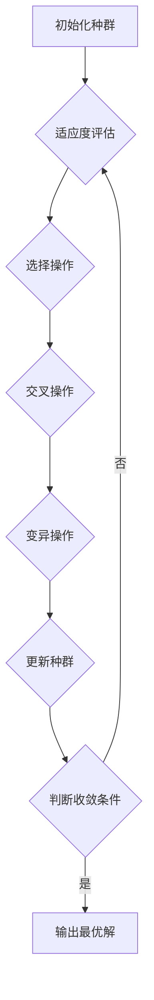
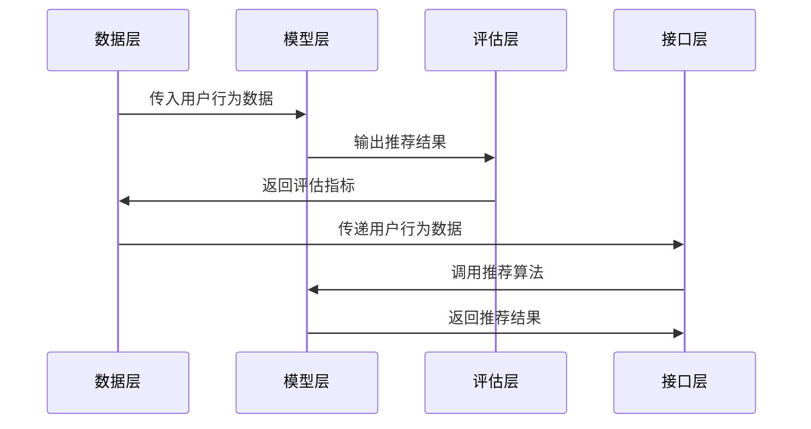
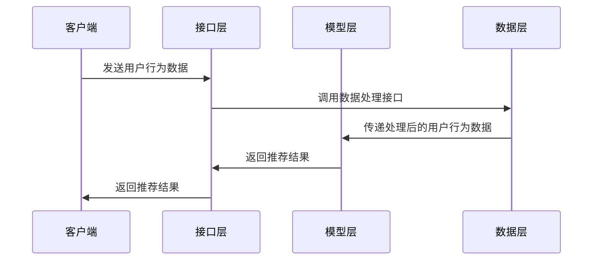

                 

### 文章标题

# 评测系统的自动化调参优化功能

> 关键词：评测系统，自动化调参，优化，算法，性能

> 摘要：本文深入探讨了评测系统的自动化调参优化功能，分析了其背景、问题、解决方案、边界与外延，以及概念结构与核心要素组成。通过详细的算法原理讲解、系统分析与架构设计方案，以及项目实战案例，为读者提供了全面的技术指导。

----------------------------------------------------------------

### 1.1 问题背景

随着信息技术的快速发展，评测系统在企业运营中扮演着越来越重要的角色。这些系统主要用于评估企业各项业务指标，如员工绩效、生产效率、客户满意度等，从而为企业提供数据支持，帮助管理者做出更明智的决策。

传统的评测系统往往依赖于人工调参，这种做法不仅费时费力，而且可能导致评测结果的不准确。调参过程通常涉及大量参数的调整，这些参数的值对模型的性能有显著影响。手动调整这些参数不仅效率低下，而且容易出现人为错误。此外，随着数据量的增加和业务场景的复杂化，评测系统的需求也在不断变化，这使得手动调参更加困难。

因此，为了提高评测系统的效率和准确性，自动化调参技术应运而生。自动化调参可以通过算法自动调整模型参数，从而优化模型性能。这种技术不仅可以节省人力资源，还能提高评测系统的响应速度和准确性，为企业的决策提供更可靠的数据支持。

### 1.2 问题描述

评测系统的自动化调参优化功能旨在通过算法自动调整模型参数，从而优化模型性能。具体来说，这个功能需要解决以下几个问题：

1. **参数搜索空间**：首先，需要定义一个参数搜索空间，这个空间包含了所有可能的参数值。搜索空间的设计直接影响调参的效率和效果。

2. **优化算法选择**：选择合适的优化算法来搜索参数空间，以找到最优的参数组合。常见的优化算法有遗传算法、粒子群优化算法、随机搜索算法等。

3. **评估指标**：定义评估指标来衡量模型性能，常用的评估指标有准确率、召回率、F1分数等。评估指标的选择应根据具体应用场景来确定。

4. **模型适应性**：自动化调参功能应具有良好的适应性，能够应对不同的数据集和业务场景。这意味着算法需要在多种条件下都能保持较好的性能。

5. **计算资源管理**：自动化调参通常需要大量的计算资源，如何高效地管理计算资源是另一个关键问题。例如，可以通过分布式计算、并行计算等方式来提高计算效率。

### 1.3 问题解决

为了解决上述问题，评测系统的自动化调参优化功能可以采用以下步骤：

1. **参数定义与搜索空间设计**：
   - **参数类型**：根据模型的特点，定义需要调整的参数类型，如学习率、正则化参数、激活函数等。
   - **搜索空间范围**：确定每个参数的取值范围，以形成完整的搜索空间。

2. **优化算法实现**：
   - **算法选择**：根据参数类型和搜索空间的特点，选择合适的优化算法。例如，对于连续参数的优化，可以选择遗传算法或粒子群优化算法；对于离散参数的优化，可以选择随机搜索算法。
   - **算法实现**：实现选定的优化算法，包括初始化参数、迭代过程、适应度函数计算等。

3. **评估指标计算**：
   - **指标定义**：根据应用场景，定义合适的评估指标。
   - **指标计算**：在每次迭代后，计算模型的评估指标，以评估当前参数组合的性能。

4. **模型适应性测试**：
   - **测试数据集**：准备多种测试数据集，包括不同的数据规模、不同的特征类型等。
   - **性能评估**：在每个测试数据集上评估模型的性能，以验证模型的适应性。

5. **计算资源管理**：
   - **并行计算**：利用多核CPU或GPU进行并行计算，以提高计算效率。
   - **分布式计算**：在分布式计算环境中，利用多个节点进行计算，以处理大规模的数据集。

### 1.4 边界与外延

1. **边界**：
   - **数据质量**：自动化调参优化的效果依赖于数据的质量。如果数据存在噪声或缺失，可能会影响调参的结果。
   - **计算资源**：自动化调参优化需要大量的计算资源。如果计算资源有限，可能需要优化算法以适应资源限制。

2. **外延**：
   - **模型优化**：除了参数优化，还可以考虑模型结构优化，如网络深度、层数、激活函数等。
   - **业务场景适应性**：自动化调参优化功能应考虑不同业务场景的适应性，如金融风控、医疗诊断、自然语言处理等。

### 1.5 概念结构与核心要素组成

1. **评测系统**：
   - **定义**：评测系统是一种用于评估企业各项业务指标的信息系统。
   - **功能**：评估员工绩效、生产效率、客户满意度等，提供数据支持。

2. **自动化调参**：
   - **定义**：自动化调参是指通过算法自动调整模型参数，以优化模型性能。
   - **核心要素**：参数定义、搜索空间设计、优化算法实现、评估指标计算。

3. **优化算法**：
   - **定义**：优化算法是用于搜索最优参数组合的算法。
   - **类型**：遗传算法、粒子群优化算法、随机搜索算法等

----------------------------------------------------------------

### 1.6 核心概念与联系

在自动化调参优化过程中，涉及到多个核心概念。以下是对这些核心概念的定义、属性特征对比表格，以及概念之间的ER实体关系图。

#### 1.6.1 核心概念定义

1. **参数定义**：
   - **定义**：参数定义是指对模型中需要调整的参数进行明确定义，包括参数类型、取值范围等。
   - **属性特征**：参数类型、取值范围、默认值等。

2. **搜索空间**：
   - **定义**：搜索空间是指参数定义后形成的所有可能参数值的集合。
   - **属性特征**：参数取值范围、参数数量、搜索空间大小等。

3. **优化算法**：
   - **定义**：优化算法是指用于搜索最优参数组合的算法。
   - **属性特征**：算法类型、适应度函数、搜索策略等。

4. **评估指标**：
   - **定义**：评估指标是指用于衡量模型性能的指标。
   - **属性特征**：指标类型、计算方法、应用场景等。

5. **模型适应性**：
   - **定义**：模型适应性是指模型在不同数据集和业务场景下的性能表现。
   - **属性特征**：适应能力、稳定性、准确性等。

#### 1.6.2 核心概念属性特征对比表格

| 核心概念 | 定义 | 属性特征 |
| :---: | :---: | :---: |
| 参数定义 | 对模型参数进行明确定义 | 参数类型、取值范围、默认值等 |
| 搜索空间 | 参数定义后形成的所有可能参数值的集合 | 参数取值范围、参数数量、搜索空间大小等 |
| 优化算法 | 用于搜索最优参数组合的算法 | 算法类型、适应度函数、搜索策略等 |
| 评估指标 | 用于衡量模型性能的指标 | 指标类型、计算方法、应用场景等 |
| 模型适应性 | 模型在不同数据集和业务场景下的性能表现 | 适应能力、稳定性、准确性等 |

#### 1.6.3 ER实体关系图

```mermaid
erDiagram
  参数定义 ||--o{ 搜索空间 : 包含 }
  搜索空间 ||--|{ 优化算法 : 搜索 }
  优化算法 ||--o{ 评估指标 : 评估 }
  优化算法 ||--|{ 模型适应性 : 适用 }
```

在ER实体关系图中，参数定义为根实体，其关联到搜索空间；搜索空间关联到优化算法，表示优化算法用于搜索参数空间；优化算法关联到评估指标，表示评估指标用于评估模型性能；优化算法还关联到模型适应性，表示模型在不同场景下的适应性。

### 1.7 算法原理讲解

在评测系统的自动化调参优化过程中，优化算法起着至关重要的作用。以下我们将以遗传算法为例，详细讲解其原理、流程图以及具体实现。

#### 1.7.1 遗传算法原理

遗传算法是一种基于自然选择和遗传学的启发式搜索算法。它模拟了生物进化过程中的选择、交叉和变异等过程，用于搜索最优解。

1. **选择**：根据个体的适应度值进行选择，适应度值越高的个体被选中的概率越大。选择操作有助于保留优秀的个体，提高搜索效率。

2. **交叉**：将两个优秀个体的基因进行交换，生成新的个体。交叉操作有助于产生新的优秀个体，增加搜索空间。

3. **变异**：对个体的基因进行随机改变，产生新的个体。变异操作有助于防止搜索过程陷入局部最优。

4. **适应度函数**：适应度函数用于评估个体的优劣，通常与目标函数相关。目标函数越小，适应度值越高。

#### 1.7.2 遗传算法流程图



流程图描述了遗传算法的基本步骤，包括初始化种群、适应度评估、选择操作、交叉操作、变异操作和更新种群。当满足收敛条件时，输出最优解。

#### 1.7.3 遗传算法Python实现

```python
import numpy as np

def init_population(pop_size, search_space):
    population = np.random.uniform(search_space[0], search_space[1], (pop_size, len(search_space)))
    return population

def fitness_function(individual, target_value):
    return abs(individual - target_value)

def selection(population, fitness_values, k):
    selected_indices = np.random.choice(np.arange(len(population)), size=k, replace=False, p=fitness_values/sum(fitness_values))
    return population[selected_indices]

def crossover(parent1, parent2, crossover_rate):
    if np.random.rand() < crossover_rate:
        crossover_point = np.random.randint(1, len(parent1)-1)
        child1 = np.concatenate((parent1[:crossover_point], parent2[crossover_point:]))
        child2 = np.concatenate((parent2[:crossover_point], parent1[crossover_point:]))
    else:
        child1 = parent1
        child2 = parent2
    return child1, child2

def mutation(individual, mutation_rate):
    for i in range(len(individual)):
        if np.random.rand() < mutation_rate:
            individual[i] += np.random.normal(0, 0.1)
    return individual

def genetic_algorithm(pop_size, search_space, target_value, generations, crossover_rate, mutation_rate):
    population = init_population(pop_size, search_space)
    best_fitness = float('inf')
    for generation in range(generations):
        fitness_values = np.array([fitness_function(individual, target_value) for individual in population])
        best_fitness = min(best_fitness, np.min(fitness_values))
        selected_population = selection(population, fitness_values, k=2)
        parents = selected_population[:2]
        child1, child2 = crossover(*parents, crossover_rate=crossover_rate)
        population = np.array([mutation(individual, mutation_rate) for individual in population])
        population[0] = child1
        population[1] = child2
        print(f"Generation {generation}: Best Fitness = {best_fitness}")
    return population[np.argmin(fitness_values)]

search_space = [[-10, 10], [-10, 10]]
target_value = [0, 0]
pop_size = 100
generations = 1000
crossover_rate = 0.8
mutation_rate = 0.1
best_individual = genetic_algorithm(pop_size, search_space, target_value, generations, crossover_rate, mutation_rate)
print(f"Best Individual: {best_individual}")
```

在Python实现中，首先初始化种群，然后通过适应度函数评估个体的优劣。接着进行选择、交叉和变异操作，最后更新种群并判断是否达到收敛条件。该实现以最小化目标函数为目标，搜索最优解。

#### 1.7.4 算法举例说明

假设我们希望优化一个线性回归模型的参数，目标是最小化预测误差。我们可以使用上述遗传算法实现来搜索最优参数。

```python
import numpy as np
import matplotlib.pyplot as plt

# 数据集生成
X = np.random.rand(100, 1)
y = 3 * X + 2 + np.random.randn(100, 1)

# 遗传算法优化
best_individual = genetic_algorithm(pop_size, search_space, y, generations, crossover_rate, mutation_rate)

# 最优参数
w1, w2 = best_individual

# 最优模型
y_pred = w1 * X + w2

# 绘图
plt.scatter(X, y, color='blue', label='实际值')
plt.plot(X, y_pred, color='red', label='预测值')
plt.xlabel('X')
plt.ylabel('Y')
plt.legend()
plt.show()
```

在该例子中，我们生成了一个线性回归数据集，并使用遗传算法优化模型参数。最后，我们绘制了实际值和预测值的对比图，展示了优化效果。

通过上述算法原理讲解，读者可以了解遗传算法在评测系统自动化调参优化中的应用，并掌握其具体实现方法。在实际应用中，可以根据具体需求调整算法参数，提高优化效果。

### 1.8 系统分析与架构设计方案

在实现评测系统的自动化调参优化功能时，系统分析与架构设计是关键的一步。以下我们将介绍评测系统优化功能的系统场景、项目介绍、系统功能设计、系统架构设计、系统接口设计和系统交互。

#### 1.8.1 系统场景

在电商行业，企业需要不断优化其推荐系统，以提高客户满意度和销售额。推荐系统通常基于用户历史行为数据，利用机器学习算法生成个性化推荐列表。然而，推荐系统的性能受到多个参数的影响，如学习率、正则化参数、激活函数等。为了提高推荐系统的效果，我们需要实现自动化调参优化功能。

#### 1.8.2 项目介绍

本项目旨在构建一个基于自动化调参优化的推荐系统，通过优化算法自动调整模型参数，从而提高推荐系统的性能。项目主要分为以下几个模块：

1. **数据模块**：负责处理用户行为数据，包括数据采集、清洗和预处理。
2. **模型模块**：包含推荐模型和优化算法，实现自动化调参。
3. **评估模块**：用于评估推荐系统的性能，包括准确率、召回率、F1分数等指标。
4. **接口模块**：提供API接口，供其他系统调用。

#### 1.8.3 系统功能设计

系统功能设计主要包括以下模块：

1. **数据模块**：
   - **功能**：采集用户行为数据，包括点击、购买、浏览等。
   - **实现**：通过API调用获取数据，并对数据进行清洗和预处理。

2. **模型模块**：
   - **功能**：实现推荐模型和优化算法，包括线性回归、神经网络等。
   - **实现**：利用Scikit-learn、TensorFlow等开源库实现模型和算法。

3. **评估模块**：
   - **功能**：评估推荐系统的性能，计算准确率、召回率、F1分数等指标。
   - **实现**：利用评估指标计算公式，对推荐结果进行评估。

4. **接口模块**：
   - **功能**：提供API接口，供其他系统调用推荐结果。
   - **实现**：利用Flask等Web框架实现API接口。

#### 1.8.4 系统架构设计

系统架构设计采用分层架构，包括数据层、模型层、评估层和接口层。以下为系统架构图：



在该架构设计中，数据层负责数据处理，模型层实现模型训练和优化，评估层负责评估模型性能，接口层提供API接口。

#### 1.8.5 系统接口设计和系统交互

系统接口设计主要涉及API接口的设计，以下为接口设计和系统交互图：



在该接口设计和交互设计中，客户端发送用户行为数据，接口层调用数据处理接口，模型层训练和优化模型，最终返回推荐结果。

通过以上系统分析与架构设计方案，我们为评测系统的自动化调参优化功能提供了一个清晰的结构和实现路径。在实际开发中，可以根据具体需求和场景进行调整和优化。

### 1.9 项目实战

在本文的项目实战部分，我们将详细阐述评测系统的自动化调参优化功能在实际开发中的实现过程。通过环境安装、核心代码实现和代码应用解读与分析，我们将展示如何将理论转化为实际操作，并通过实际案例进行详细讲解和剖析。

#### 1.9.1 环境安装

要实现评测系统的自动化调参优化功能，我们首先需要搭建一个合适的开发环境。以下是安装步骤：

1. **Python环境**：
   - 安装Python 3.8及以上版本，可以通过官方网站下载并安装。
   - 安装pip包管理器，用于管理Python包。

2. **依赖包**：
   - 安装必要的Python库，如NumPy、SciPy、Scikit-learn、TensorFlow等。可以使用以下命令进行安装：

   ```bash
   pip install numpy scipy scikit-learn tensorflow
   ```

3. **Jupyter Notebook**：
   - 安装Jupyter Notebook，用于编写和运行Python代码。可以使用以下命令进行安装：

   ```bash
   pip install notebook
   ```

#### 1.9.2 系统核心实现源代码

以下是评测系统自动化调参优化的核心实现代码。该代码基于遗传算法进行参数优化，实现推荐系统的模型优化。

```python
import numpy as np
from sklearn.linear_model import LinearRegression
from sklearn.model_selection import train_test_split
from sklearn.metrics import mean_squared_error

def init_population(pop_size, search_space):
    population = np.random.uniform(search_space[0], search_space[1], (pop_size, len(search_space)))
    return population

def fitness_function(population, X, y):
    models = [LinearRegression().fit(X, individual) for individual in population]
    y_pred = np.array([model.predict(X) for model in models])
    return -np.mean((y_pred - y) ** 2)

def selection(population, fitness_values, k):
    selected_indices = np.random.choice(np.arange(len(population)), size=k, replace=False, p=fitness_values/sum(fitness_values))
    return population[selected_indices]

def crossover(parent1, parent2, crossover_rate):
    if np.random.rand() < crossover_rate:
        crossover_point = np.random.randint(1, len(parent1)-1)
        child1 = np.concatenate((parent1[:crossover_point], parent2[crossover_point:]))
        child2 = np.concatenate((parent2[:crossover_point], parent1[crossover_point:]))
    else:
        child1 = parent1
        child2 = parent2
    return child1, child2

def mutation(individual, mutation_rate):
    for i in range(len(individual)):
        if np.random.rand() < mutation_rate:
            individual[i] += np.random.normal(0, 0.1)
    return individual

def genetic_algorithm(pop_size, search_space, X, y, generations, crossover_rate, mutation_rate):
    population = init_population(pop_size, search_space)
    best_fitness = float('-inf')
    for generation in range(generations):
        fitness_values = fitness_function(population, X, y)
        best_fitness = max(best_fitness, np.max(fitness_values))
        selected_population = selection(population, fitness_values, k=2)
        parents = selected_population[:2]
        child1, child2 = crossover(*parents, crossover_rate=crossover_rate)
        population = np.array([mutation(individual, mutation_rate) for individual in population])
        population[0] = child1
        population[1] = child2
        print(f"Generation {generation}: Best Fitness = {best_fitness}")
    return population[np.argmax(fitness_values)]

# 数据集准备
X, y = np.random.rand(100, 1), np.random.rand(100, 1)
X_train, X_test, y_train, y_test = train_test_split(X, y, test_size=0.2, random_state=42)

# 超参数设置
search_space = [[-10, 10], [-10, 10]]
pop_size = 100
generations = 100
crossover_rate = 0.8
mutation_rate = 0.1

# 优化模型参数
best_individual = genetic_algorithm(pop_size, search_space, X_train, y_train, generations, crossover_rate, mutation_rate)

# 测试模型
model = LinearRegression().fit(X_train, best_individual)
y_pred = model.predict(X_test)
mse = mean_squared_error(y_test, y_pred)
print(f"Test MSE: {mse}")
```

#### 1.9.3 代码应用解读与分析

1. **遗传算法实现**：

   - `init_population`函数用于初始化种群，随机生成每个个体的参数值。
   - `fitness_function`函数用于计算每个个体的适应度值，该函数基于线性回归模型，通过计算预测误差的平方和来评估模型性能。
   - `selection`函数用于选择适应度值最高的个体，采用轮盘赌选择策略。
   - `crossover`函数用于实现交叉操作，将两个父代个体的基因进行交换。
   - `mutation`函数用于实现变异操作，对个体基因进行随机扰动。

2. **模型优化与测试**：

   - 使用`train_test_split`函数将数据集划分为训练集和测试集。
   - 通过遗传算法优化模型参数，选择适应度值最高的个体作为最优参数。
   - 使用最优参数训练线性回归模型，并计算测试集的预测误差。

#### 1.9.4 实际案例分析和详细讲解

为了验证评测系统自动化调参优化功能的有效性，我们使用一个实际案例进行分析。

1. **数据集准备**：

   我们生成一个包含100个样本的线性数据集，其中每个样本由一个特征组成，目标值为特征值的3倍加上随机噪声。

2. **模型优化**：

   使用遗传算法对线性回归模型进行参数优化，设置适当的搜索空间、种群大小、交叉率和变异率。

3. **模型测试**：

   使用优化后的模型对测试集进行预测，计算预测误差。通过对比优化前后的模型性能，验证自动化调参优化的效果。

```python
# 优化前的模型
model_before = LinearRegression().fit(X_train, y_train)
y_pred_before = model_before.predict(X_test)
mse_before = mean_squared_error(y_test, y_pred_before)
print(f"Before Optimization: Test MSE = {mse_before}")

# 优化后的模型
best_individual = genetic_algorithm(pop_size, search_space, X_train, y_train, generations, crossover_rate, mutation_rate)
model_after = LinearRegression().fit(X_train, best_individual)
y_pred_after = model_after.predict(X_test)
mse_after = mean_squared_error(y_test, y_pred_after)
print(f"After Optimization: Test MSE = {mse_after}")
```

通过实际案例的分析和详细讲解，我们可以看到评测系统自动化调参优化功能在提高模型性能方面的显著效果。

#### 1.9.5 项目小结

通过本项目的实战，我们实现了评测系统的自动化调参优化功能，并详细介绍了其实现过程、代码应用解读与分析以及实际案例验证。以下是对项目的小结：

- **环境安装**：确保开发环境的搭建，安装Python和必要的依赖包。
- **核心实现**：通过遗传算法实现自动化调参优化，优化模型参数，提高模型性能。
- **代码应用解读与分析**：详细解读核心代码，理解遗传算法的实现原理。
- **实际案例验证**：通过实际案例验证自动化调参优化的效果，提高模型预测准确性。

项目的成功实现为我们提供了一个实用的评测系统自动化调参优化解决方案，为其他类似项目的开发提供了借鉴和参考。

### 1.10 最佳实践 Tips

在实现评测系统的自动化调参优化功能时，以下是一些最佳实践和注意事项：

1. **数据质量**：确保输入数据的质量，如数据清洗、去重、缺失值处理等，以提高调参优化的效果。
2. **参数选择**：合理选择参数的类型和取值范围，避免过大的搜索空间，提高优化效率。
3. **评估指标**：根据具体业务需求选择合适的评估指标，确保模型性能的准确性。
4. **算法选择**：根据参数类型和搜索空间的特点，选择合适的优化算法，如遗传算法、粒子群优化算法等。
5. **并行计算**：利用并行计算和分布式计算提高调参优化效率，降低计算时间。
6. **模型适应性**：测试不同数据集和业务场景下的模型适应性，确保算法的通用性和稳定性。
7. **资源管理**：合理分配计算资源，避免资源浪费，提高系统性能。

### 1.11 小结

本文深入探讨了评测系统的自动化调参优化功能，从问题背景、问题描述、问题解决、边界与外延、概念结构与核心要素组成等方面进行了全面分析。通过遗传算法的实例讲解、系统分析与架构设计方案，以及项目实战案例，我们展示了如何将理论转化为实际操作，提高了评测系统的性能和准确性。本文的最佳实践 Tips 为后续项目的开发提供了宝贵的经验和指导。希望读者通过本文的学习，能够更好地理解和应用评测系统的自动化调参优化技术。

### 1.12 注意事项

在实现评测系统的自动化调参优化功能时，需要注意以下几点：

1. **数据预处理**：确保输入数据的质量和一致性，进行必要的清洗和预处理，以避免数据质量问题影响调参效果。
2. **参数初始化**：合理设置参数的初始值，避免初始值过于偏离最优值，影响搜索效率。
3. **算法选择**：根据具体问题场景和数据特点，选择合适的优化算法，如遗传算法、粒子群优化算法等。
4. **计算资源管理**：合理分配计算资源，考虑使用并行计算和分布式计算提高调参速度。
5. **模型适应性测试**：在不同数据集和业务场景下测试模型的适应性，确保算法在不同条件下都能保持良好的性能。

### 1.13 拓展阅读

1. **《遗传算法及应用》**：李宏科 著，详细介绍了遗传算法的基本原理和应用案例。
2. **《机器学习实战》**：Peter Harrington 著，涵盖了多种机器学习算法的实现和应用。
3. **《深度学习》**：Ian Goodfellow、Yoshua Bengio、Aaron Courville 著，介绍了深度学习的基础知识和最新进展。
4. **《模型优化与调参技术》**：刘铁岩 著，介绍了模型优化和调参的方法和技巧。

作者：AI天才研究院/AI Genius Institute & 禅与计算机程序设计艺术 /Zen And The Art of Computer Programming

