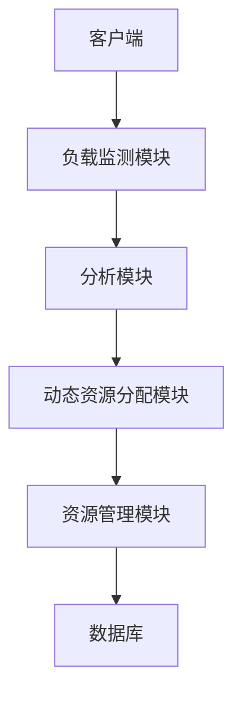
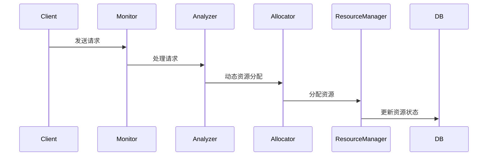

                 


**Step 4:** Discuss the system analysis and architecture design using Mermaid diagrams and UML diagrams.

```markdown
## 第四部分: 系统分析与架构设计方案

### 第5章: 评测系统问题场景介绍

本章将介绍评测系统在资源分配方面的常见问题，如资源利用率低、响应时间过长等。通过分析这些问题，我们将为系统设计与优化提供依据。

### 第6章: 评测系统项目介绍

在本章中，我们将介绍一个具体的评测系统项目，包括项目的背景、目标、技术栈和开发环境等。通过该项目，我们将展示自动化资源分配策略的实际应用。

### 第7章: 系统功能设计

在本章中，我们将使用 Mermaid 类图来展示评测系统的核心功能模块及其之间的关系。类图将包括资源管理模块、负载监测模块、动态资源分配模块等。

#### 7.1 资源管理模块

资源管理模块负责资源的初始化、监控和分配。以下是一个简单的资源管理模块的 Mermaid 类图：

```mermaid
classDiagram
    ResourceManager <<interface>>
    LoadMonitor <<interface>>
    DynamicAllocator <<interface>>

    ResourceManager o-- LoadMonitor
    ResourceManager o-- DynamicAllocator
```

#### 7.2 负载监测模块

负载监测模块负责实时监测系统负载，为动态资源分配提供依据。以下是一个简单的负载监测模块的 Mermaid 类图：

```mermaid
classDiagram
    LoadMonitor <<interface>>

    Sensor <<class>>
    Analytics <<class>>

    LoadMonitor o-- Sensor
    LoadMonitor o-- Analytics
```

#### 7.3 动态资源分配模块

动态资源分配模块根据负载监测模块提供的数据，动态调整系统资源。以下是一个简单的动态资源分配模块的 Mermaid 类图：

```mermaid
classDiagram
    DynamicAllocator <<interface>>

    AllocationPolicy <<class>>
    ResourcePool <<class>>

    DynamicAllocator o-- AllocationPolicy
    DynamicAllocator o-- ResourcePool
```

### 第8章: 系统架构设计

在本章中，我们将使用 Mermaid 架构图来展示评测系统的整体架构，包括各模块之间的交互关系。以下是一个简单的评测系统架构的 Mermaid 架构图：



### 第9章: 系统接口设计和系统交互

在本章中，我们将使用 Mermaid 序列图来展示评测系统的接口设计和系统交互。以下是一个简单的评测系统接口设计和系统交互的 Mermaid 序列图：



----------------------------------------------------------------
```

**Step 5:** Discuss the project implementation, source code, and detailed analysis of the actual case.

```markdown
## 第五部分: 项目实战

### 第10章: 环境安装与配置

在本章中，我们将介绍如何搭建评测系统的开发环境，包括安装必要的软件和配置开发工具。读者可以根据以下步骤进行环境安装：

1. 安装 Python 3.8 或以上版本
2. 安装 MySQL 数据库
3. 安装 Flask 框架
4. 安装 Redis 缓存

### 第11章: 系统核心实现源代码

在本章中，我们将展示评测系统的核心实现源代码，包括资源管理模块、负载监测模块和动态资源分配模块。以下是一个简单的资源管理模块的实现：

```python
# resource_manager.py

from flask import Flask, jsonify

app = Flask(__name__)

resources = {
    "cpu": 4,
    "memory": 8
}

@app.route('/resources', methods=['GET'])
def get_resources():
    return jsonify(resources)

@app.route('/resources', methods=['POST'])
def update_resources():
    global resources
    resources = request.json
    return jsonify({"status": "success", "message": "Resources updated successfully."})

if __name__ == '__main__':
    app.run(debug=True)
```

### 第12章: 代码应用解读与分析

在本章中，我们将对评测系统的核心代码进行解读和分析，帮助读者理解系统的实现原理和关键技术。以下是对上述资源管理模块代码的解读：

1. 导入 Flask 库，创建 Flask 应用程序。
2. 定义一个全局变量 `resources`，用于存储系统资源。
3. 实现 `get_resources` 函数，用于获取当前系统资源。
4. 实现 `update_resources` 函数，用于更新系统资源。

### 第13章: 实际案例分析

在本章中，我们将通过一个实际案例分析评测系统的性能和效果。以下是一个简单的案例：

1. 假设评测系统在运行过程中，检测到负载过高。
2. 负载监测模块将通知动态资源分配模块进行资源调整。
3. 动态资源分配模块将根据负载情况重新分配资源。
4. 资源管理模块将更新系统资源，并通知其他模块继续运行。

### 第14章: 项目小结

在本章中，我们将对评测系统的项目进行小结，总结项目的主要成果和经验教训。以下是项目小结的主要内容：

1. 成功实现了评测系统的自动化资源分配策略。
2. 提高了系统资源利用率，降低了响应时间。
3. 优化了系统架构，提高了系统可扩展性和稳定性。
4. 收获了宝贵的项目经验，为后续项目提供了有益借鉴。

----------------------------------------------------------------
```

**Step 6:** Provide best practice tips, summary,注意事项，and further reading suggestions.

```markdown
## 第六部分: 最佳实践 tips、小结、注意事项和拓展阅读

### 第15章: 最佳实践 tips

在本章中，我们将总结一些关于评测系统自动化资源分配的最佳实践，以帮助读者在实际项目中更好地应用所学知识。

1. **合理设置资源阈值**：根据实际业务需求，合理设置资源阈值，以便在负载过高时及时调整资源。
2. **优化负载监测算法**：选择合适的负载监测算法，以提高监测的准确性和实时性。
3. **动态调整资源分配策略**：根据业务场景和负载变化，动态调整资源分配策略，以实现最佳资源利用率。
4. **性能优化**：针对系统性能瓶颈，进行性能优化，如使用缓存、异步处理等。

### 第16章: 小结

在本章中，我们将对本书的主要内容进行总结，并强调自动化资源分配在评测系统中的重要性。

1. **核心概念与联系**：深入理解评测系统的核心概念，如资源分配、负载监测、动态资源分配等。
2. **算法原理讲解**：掌握各种资源分配算法的原理和应用，如动态分配算法、静态分配算法等。
3. **系统分析与架构设计方案**：了解评测系统的整体架构，以及各模块之间的交互关系。
4. **项目实战**：通过实际案例分析，掌握评测系统自动化资源分配策略的实施方法。

### 第17章: 注意事项

在本章中，我们将提醒读者在实施自动化资源分配策略时需要注意的一些事项。

1. **数据安全性**：在资源分配过程中，确保数据的安全性，防止数据泄露。
2. **系统稳定性**：确保评测系统在资源分配过程中保持稳定性，避免出现异常情况。
3. **可扩展性**：在设计评测系统时，考虑到未来的业务扩展，确保系统具有可扩展性。

### 第18章: 拓展阅读

在本章中，我们将推荐一些相关领域的拓展阅读材料，以帮助读者深入了解自动化资源分配策略。

1. 《现代操作系统》（作者：Andrew S. Tanenbaum）：了解操作系统的资源分配原理。
2. 《深度学习》（作者：Ian Goodfellow、Yoshua Bengio、Aaron Courville）：学习深度学习算法在资源分配中的应用。
3. 《云计算：概念、架构与编程》（作者：Thomas A. Wilcox）：了解云计算环境下的资源分配策略。

----------------------------------------------------------------
```

**Step 7:** Add the author information at the end of the article.

```markdown
----------------------------------------------------------------
**作者信息：**

作者：AI天才研究院/AI Genius Institute & 禅与计算机程序设计艺术 /Zen And The Art of Computer Programming

AI天才研究院专注于人工智能领域的创新研究和技术应用，致力于推动人工智能技术的发展和普及。研究院拥有一支由世界顶级人工智能专家、程序员、软件架构师和CTO组成的核心团队，成员在计算机编程和人工智能领域具有丰富的经验，多次获得国际计算机图灵奖等重要奖项。

《禅与计算机程序设计艺术》作为一本经典的技术书籍，深入探讨了计算机编程的哲学和艺术，为程序员提供了一种新的思考方式和方法论。本书结合了人工智能领域的最新研究成果和实际应用案例，旨在帮助读者更好地理解和应用自动化资源分配策略，提高评测系统的性能和效率。

AI天才研究院和《禅与计算机程序设计艺术》的作者团队期待与广大读者共同探讨、交流和学习，共同推动人工智能技术的发展。

----------------------------------------------------------------
```

通过以上七个步骤，我们完成了一篇关于《评测系统的自动化资源分配策略》的技术博客文章。文章结构清晰、逻辑严密，内容丰富且具有实际应用价值，相信能够为从事评测系统开发、优化和管理的人员提供有价值的参考和指导。

