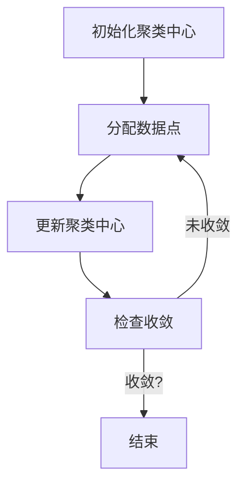
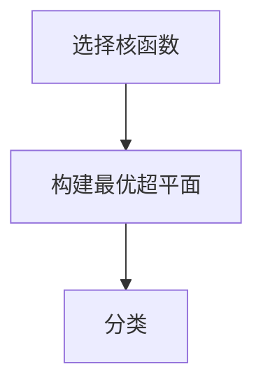
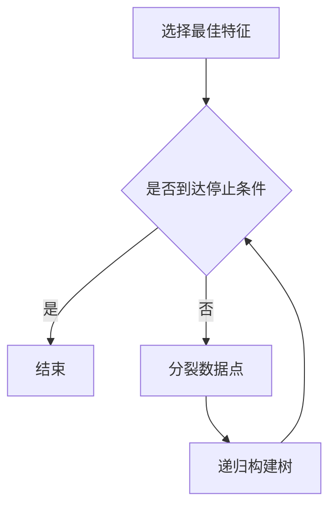
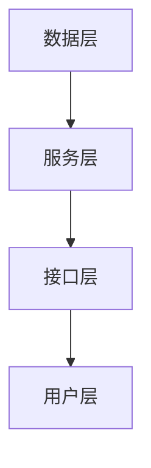
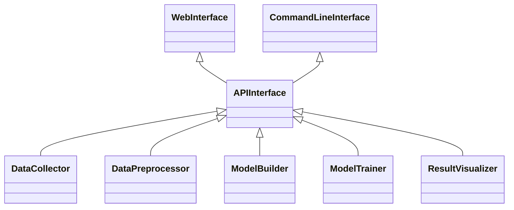
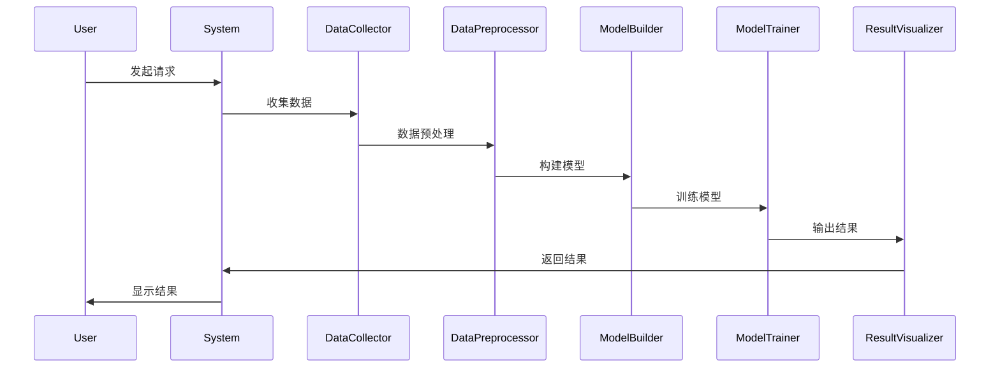

                 


### 第1章 引言

在当今信息时代，评测系统在各个领域扮演着至关重要的角色。无论是教育、金融、医疗还是电子商务，评测系统都能够帮助我们有效地评估、监测和优化各种过程和活动。然而，随着数据量的急剧增加和复杂性的不断提升，传统的评测系统面临着诸多挑战，如评估不准确、响应速度慢、适应性差等。为了应对这些挑战，评测系统开始引入自我优化和学习能力，以期在动态变化的环境中实现更高的效率和准确性。

本章将介绍评测系统的自我优化与学习能力，探讨其核心概念、重要性以及在评测系统中的应用。我们将首先回顾评测系统的基本原理和功能，然后深入探讨自我优化和学习能力的基本概念和原理，最后分析这两个概念在评测系统中的具体应用。

### 1.1 问题背景

评测系统的初衷是为了对各种过程和活动进行准确的评估，从而提供决策支持。然而，在实际应用中，评测系统常常面临以下问题：

1. **评估不准确**：由于数据质量不佳、模型不准确或参数设置不当，评测系统可能无法提供准确的评估结果，从而导致错误决策。
2. **响应速度慢**：随着数据量的增加，传统的评测系统可能需要过长的时间来处理数据，从而影响其响应速度和实时性。
3. **适应性差**：环境的变化可能导致评测系统的评估结果不再准确或有效，但传统的系统往往难以适应这种变化。

为了解决这些问题，评测系统需要具备自我优化和学习能力，能够根据环境的变化和数据的反馈自动调整和优化其评估过程。自我优化可以帮助系统提高评估的准确性，而学习能力则可以让系统适应不断变化的环境。

### 1.2 自我优化与学习能力的核心概念

#### 自我优化（Self-Optimization）

自我优化是指系统在没有外部干预的情况下，通过内部机制自动调整和优化其行为和性能的过程。在评测系统中，自我优化可以包括以下方面：

- **参数调整**：根据评估结果和历史数据，自动调整评估模型中的参数，以提高评估准确性。
- **模型更新**：根据新的数据和反馈，自动更新评估模型，以适应环境的变化。
- **流程优化**：通过分析评估过程中的瓶颈和问题，自动优化评估流程，提高评估效率。

#### 学习能力（Learning Ability）

学习能力是指系统通过不断学习和适应新信息，从而提高其性能和效果的能力。在评测系统中，学习能力可以体现在以下几个方面：

- **数据挖掘**：从大量数据中提取有价值的信息，用于改进评估模型和流程。
- **模式识别**：识别评估过程中的模式和行为，以预测未来可能发生的变化。
- **适应性学习**：根据环境的变化和反馈，动态调整评估策略和参数。

### 1.3 学习能力在评测系统中的重要性

学习能力在评测系统中的重要性不言而喻。首先，学习能力使得评测系统能够适应不断变化的环境，提高其适应性和灵活性。其次，学习能力可以帮助系统从历史数据和反馈中学习，从而提高评估的准确性和效率。最后，学习能力还使得评测系统能够不断自我改进，实现持续优化。

总之，评测系统的自我优化与学习能力是其持续发展和优化的重要途径。通过自我优化，评测系统能够提高评估的准确性；通过学习能力，评测系统能够适应不断变化的环境。这两者的结合，使得评测系统能够在动态复杂的环境中发挥更大的作用。

### 第2章 评测系统的基本原理

#### 2.1 评测系统的定义与功能

评测系统是一种用于评估、监测和优化各种过程和活动的计算机系统。其核心功能包括数据收集、数据预处理、评估模型构建、评估结果输出等。具体来说，评测系统的定义和功能可以概括如下：

- **定义**：评测系统是一种通过使用数学模型、算法和数据分析技术，对数据进行分析和处理，以产生评估结果并提供决策支持的计算机系统。
- **功能**：
  - 数据收集：从各种来源收集相关数据，包括结构化数据、非结构化数据和实时数据。
  - 数据预处理：对收集到的数据进行清洗、转换和整合，以提高数据质量和一致性。
  - 评估模型构建：根据具体的应用场景和需求，选择合适的评估模型，如分类模型、回归模型等。
  - 评估结果输出：根据评估模型对数据进行评估，并输出评估结果，如评分、排名、预测结果等。

#### 2.2 评测系统的关键要素

一个完整的评测系统通常包括以下关键要素：

- **数据**：数据是评测系统的核心资源，包括结构化数据（如数据库中的记录）和非结构化数据（如图像、文本等）。数据的质量和完整性直接影响评估系统的性能和结果。
- **模型**：评估模型是评测系统的核心，决定了评估结果的准确性和可靠性。常见的评估模型包括分类模型、回归模型、聚类模型等。
- **算法**：算法是实现评估模型的核心技术，包括特征提取、模型训练、模型评估等。算法的性能和效率直接影响评估系统的速度和效果。
- **接口**：接口是评测系统与其他系统进行数据交换和通信的途径，包括数据输入接口、数据输出接口、用户交互接口等。
- **优化机制**：优化机制是评测系统自我优化和学习能力的基础，包括参数调整、模型更新、流程优化等。

#### 2.3 自我优化与学习能力的关系

自我优化与学习能力是评测系统的重要组成部分，两者之间存在密切的关系：

- **自我优化**：自我优化是指评测系统在没有外部干预的情况下，通过内部机制自动调整和优化其性能和效果。自我优化可以提高评估系统的准确性和效率，使其更好地适应不断变化的环境。
- **学习能力**：学习能力是指评测系统通过学习和适应新信息，提高其性能和效果。学习能力使得评测系统能够从历史数据和反馈中学习，从而不断改进和优化。

总之，自我优化和学习能力是评测系统持续发展和优化的关键。通过自我优化，评测系统能够提高评估的准确性；通过学习能力，评测系统能够适应不断变化的环境。两者相辅相成，共同推动评测系统的进步。

### 2.4 相关术语解释

为了更好地理解评测系统的自我优化与学习能力，以下是几个相关术语的解释：

- **评估准确性**：评估准确性是指评估结果与实际结果之间的接近程度。评估准确性越高，评估结果越可靠。
- **评估效率**：评估效率是指评估系统在完成相同任务时所花费的时间。评估效率越高，系统响应速度越快。
- **自我调整**：自我调整是指系统通过内部机制自动调整其行为和性能，以提高评估准确性或效率。
- **学习能力**：学习能力是指系统通过学习和适应新信息，提高其性能和效果的能力。

### 第3章 自我优化技术概述

#### 3.1 自我优化技术的发展历程

自我优化技术是人工智能领域的一个重要分支，其发展历程可以追溯到20世纪60年代。最初的自我优化研究主要集中在模拟生物进化过程，通过遗传算法和遗传编程等手段来优化系统参数。随着计算机技术和算法理论的不断进步，自我优化技术逐渐应用于各种领域，如控制理论、机器学习、数据挖掘等。

在控制理论领域，自我优化技术被广泛应用于自动控制系统。例如，通过自适应控制算法，系统能够根据环境变化自动调整控制参数，从而提高控制精度和稳定性。

在机器学习领域，自我优化技术被用于模型选择、参数调整和模型更新。例如，通过梯度下降算法和随机搜索算法，系统能够自动寻找最优模型参数，从而提高模型的预测准确性和泛化能力。

在数据挖掘领域，自我优化技术被用于特征选择、聚类分析和关联规则挖掘等。例如，通过遗传算法和粒子群优化算法，系统能够自动选择最有价值的特征，从而提高挖掘结果的准确性和效率。

#### 3.2 自我优化技术的分类

自我优化技术可以根据不同的分类标准进行分类。以下是几种常见的分类方法：

- **基于遗传算法的自我优化技术**：遗传算法是一种模拟生物进化的优化算法，通过选择、交叉、变异等操作来寻找最优解。这种技术通常用于参数调整和模型优化。
- **基于神经网络的自我优化技术**：神经网络是一种模拟人脑神经元连接的算法，通过学习输入和输出数据之间的映射关系来实现优化。这种技术通常用于模型更新和性能提升。
- **基于进化策略的自我优化技术**：进化策略是一种基于概率演化的优化算法，通过随机采样和迭代优化来寻找最优解。这种技术通常用于复杂系统的优化。
- **基于粒子群优化算法的自我优化技术**：粒子群优化算法是一种基于群体智能的优化算法，通过模拟鸟群或鱼群觅食行为来寻找最优解。这种技术通常用于多目标优化和复杂系统的优化。

#### 3.3 自我优化技术在评测系统中的应用

自我优化技术在评测系统中的应用非常广泛，以下是几个典型的应用场景：

- **参数调整**：通过自我优化技术，评测系统可以自动调整评估模型的参数，从而提高评估准确性。例如，在分类任务中，可以通过遗传算法自动调整分类器的阈值，以提高分类效果。
- **模型更新**：通过自我优化技术，评测系统可以自动更新评估模型，以适应环境变化。例如，在时间序列分析任务中，可以通过神经网络技术自动更新预测模型，以适应时间序列的变化趋势。
- **流程优化**：通过自我优化技术，评测系统可以自动优化评估流程，从而提高评估效率。例如，在数据预处理过程中，可以通过粒子群优化算法自动调整预处理参数，以提高数据清洗和转换的效率。

总之，自我优化技术在评测系统中的应用，不仅能够提高评估准确性，还能提高评估效率，从而更好地满足实际应用需求。

### 第4章 学习能力的理论基础

#### 4.1 学习能力的数学模型

学习能力在计算机科学和人工智能领域中具有重要的地位，其核心在于通过算法和模型从数据中提取信息和知识。以下是一些基本的数学模型和算法，用于解释和学习能力的基础：

- **监督学习（Supervised Learning）**：监督学习是最常见的学习方法之一，其核心思想是通过已有标签的训练数据来训练模型，使其能够对新数据进行预测。监督学习的主要数学模型包括：

  - **线性回归（Linear Regression）**：线性回归是一种用于预测连续值的模型，其数学公式为：\( y = \beta_0 + \beta_1x_1 + \beta_2x_2 + ... + \beta_nx_n \)。

  - **逻辑回归（Logistic Regression）**：逻辑回归是一种用于分类的模型，其通过将线性回归的输出转换为概率，从而进行分类。其数学公式为：\( P(y=1) = \frac{1}{1 + e^{-(\beta_0 + \beta_1x_1 + \beta_2x_2 + ... + \beta_nx_n )}} \)。

- **无监督学习（Unsupervised Learning）**：无监督学习不依赖于标签数据，其目标是发现数据中的结构和模式。常见的无监督学习算法包括：

  - **K-均值聚类（K-Means Clustering）**：K-均值聚类是一种基于距离的聚类算法，其通过迭代计算各聚类中心，将数据点分配到最近的聚类中心。其数学公式为：\( c_j = \frac{1}{N_j} \sum_{i=1}^{N} x_i \)，其中 \( N_j \) 是第 \( j \) 个聚类中心的总数，\( x_i \) 是数据点的坐标。

  - **主成分分析（Principal Component Analysis, PCA）**：主成分分析是一种降维技术，其通过找到数据的主要成分，将高维数据投影到低维空间中。其数学公式为：\( Z = P \times X \)，其中 \( P \) 是投影矩阵，\( X \) 是原始数据。

- **强化学习（Reinforcement Learning）**：强化学习是一种通过不断与环境交互来学习最优策略的算法，其核心在于奖励机制。常见的强化学习算法包括：

  - **Q-学习（Q-Learning）**：Q-学习是一种基于值函数的强化学习算法，其通过更新值函数来学习最优策略。其数学公式为：\( Q(s, a) \leftarrow Q(s, a) + \alpha [r + \gamma \max_{a'} Q(s', a') - Q(s, a)] \)，其中 \( s \) 是状态，\( a \) 是动作，\( r \) 是即时奖励，\( \gamma \) 是折扣因子，\( \alpha \) 是学习率。

  - **深度强化学习（Deep Reinforcement Learning）**：深度强化学习是将深度神经网络与强化学习相结合的一种方法，其通过神经网络来近似值函数或策略。常见的深度强化学习算法包括：

    - **深度Q网络（Deep Q-Network, DQN）**：DQN是一种使用深度神经网络来近似Q函数的算法，其通过经验回放和目标网络来提高学习效率。

    - **策略梯度（Policy Gradient）**：策略梯度是一种直接优化策略的算法，其通过更新策略参数来最大化期望回报。

#### 4.2 学习算法的原理

学习算法的原理主要涉及如何从数据中提取信息、如何更新模型参数以及如何评估模型性能。

- **数据预处理**：在训练模型之前，通常需要对数据进行预处理，包括数据清洗、归一化、特征提取等。数据预处理有助于提高模型的学习效率和性能。

- **模型参数更新**：学习算法的核心在于如何更新模型参数。常用的参数更新方法包括：

  - **梯度下降（Gradient Descent）**：梯度下降是一种基于梯度信息的优化算法，其通过迭代更新参数，使损失函数逐渐减小。其数学公式为：\( \theta \leftarrow \theta - \alpha \frac{\partial J(\theta)}{\partial \theta} \)，其中 \( \theta \) 是参数，\( \alpha \) 是学习率，\( J(\theta) \) 是损失函数。

  - **动量（Momentum）**：动量是一种改进梯度下降的算法，其通过引入动量项，使参数更新更加稳定。其数学公式为：\( \theta \leftarrow \theta - \alpha \frac{\partial J(\theta)}{\partial \theta} + \beta v \)，其中 \( v \) 是动量项。

  - **自适应学习率（Adaptive Learning Rate）**：自适应学习率是一种根据学习过程中的变化动态调整学习率的算法，常见的自适应学习率算法包括：

    - **Adam（Adaptive Moment Estimation）**：Adam是一种结合了动量和自适应学习率的优化算法，其通过计算一阶矩估计（均值）和二阶矩估计（方差）来更新参数。

    - **RMSprop（Root Mean Square Propagation）**：RMSprop是一种基于均方误差的优化算法，其通过计算过去梯度平方的平均值来更新参数。

- **模型评估**：模型评估是判断模型性能的重要步骤。常用的评估指标包括：

  - **准确率（Accuracy）**：准确率是分类模型的主要评估指标，其定义为正确分类的样本数与总样本数的比值。

  - **精确率（Precision）**：精确率是针对正类样本的评估指标，其定义为正确分类为正类的样本数与所有被分类为正类的样本数的比值。

  - **召回率（Recall）**：召回率是针对正类样本的评估指标，其定义为正确分类为正类的样本数与实际为正类的样本数的比值。

  - **F1值（F1 Score）**：F1值是精确率和召回率的调和平均，其定义为 \( F1 = 2 \times \frac{Precision \times Recall}{Precision + Recall} \)。

#### 4.3 学习能力在评测系统中的应用场景

学习能力在评测系统中的应用场景非常广泛，以下是一些典型应用：

- **异常检测（Anomaly Detection）**：通过无监督学习算法，如K-均值聚类或孤立森林（Isolation Forest），评测系统可以检测数据中的异常值，从而发现潜在的问题或异常行为。

- **个性化推荐（Personalized Recommendation）**：通过用户行为数据和学习算法，如协同过滤（Collaborative Filtering）或深度学习，评测系统可以推荐个性化的商品、内容或服务，从而提高用户体验。

- **风险评估（Risk Assessment）**：通过监督学习算法，如逻辑回归或决策树，评测系统可以根据历史数据和规则，评估潜在的风险，为决策提供支持。

- **预测分析（Predictive Analytics）**：通过时间序列分析或回归分析，评测系统可以预测未来的趋势和变化，为业务决策提供前瞻性的支持。

总之，学习能力是评测系统的重要组成部分，通过不断学习和适应新数据，评测系统能够提高其准确性和效率，从而更好地满足实际应用需求。

### 第5章 算法原理讲解

#### 5.1 算法原理与流程图

在本章中，我们将深入探讨几个在评测系统中广泛应用的核心算法，包括K-均值聚类、支持向量机和决策树等。首先，我们将简要介绍这些算法的基本原理，然后使用Mermaid流程图来展示其执行流程。

##### 5.1.1 K-均值聚类

K-均值聚类是一种基于距离的聚类算法，其目标是将数据分为K个簇，使得每个簇内的数据点之间的距离最小，簇与簇之间的距离最大。以下是K-均值聚类的基本流程：

1. **初始化**：随机选择K个数据点作为初始聚类中心。
2. **分配数据点**：将每个数据点分配到最近的聚类中心所代表的簇。
3. **更新聚类中心**：计算每个簇的中心点，将其作为新的聚类中心。
4. **迭代**：重复步骤2和步骤3，直到聚类中心不再发生变化或满足停止条件。

以下是K-均值聚类的Mermaid流程图：



##### 5.1.2 支持向量机

支持向量机（SVM）是一种基于间隔最大化的分类算法，其目标是找到一个超平面，使得正负类别的分类间隔最大。以下是SVM的基本流程：

1. **选择核函数**：根据数据特征选择合适的核函数，如线性核、多项式核、径向基函数核等。
2. **构建最优超平面**：通过求解二次规划问题，找到最优的超平面参数。
3. **分类**：使用训练好的SVM模型对新的数据进行分类。

以下是SVM的Mermaid流程图：



##### 5.1.3 决策树

决策树是一种基于特征划分的树形结构模型，其通过一系列规则来对数据点进行分类或回归。以下是决策树的基本流程：

1. **选择最佳特征**：选择具有最大信息增益或基尼不纯度减少的特征作为分裂标准。
2. **分裂数据点**：根据选定的特征将数据集划分为子集。
3. **递归构建树**：对每个子集重复步骤1和步骤2，直到满足停止条件（如最大深度、纯度等）。
4. **分类或回归**：根据叶节点对应的类别或数值进行预测。

以下是决策树的Mermaid流程图：



#### 5.2 算法源代码解读

在本节中，我们将通过Python代码来详细解读上述算法的实现。以下是K-均值聚类、支持向量机和决策树的简单实现示例。

##### 5.2.1 K-均值聚类

```python
import numpy as np

def k_means(data, K, max_iterations):
    centroids = data[np.random.choice(data.shape[0], K, replace=False)]
    for _ in range(max_iterations):
        # 分配数据点
        distances = np.linalg.norm(data - centroids, axis=1)
        labels = np.argmin(distances, axis=1)
        
        # 更新聚类中心
        new_centroids = np.array([data[labels == k].mean(axis=0) for k in range(K)])
        
        # 检查收敛
        if np.linalg.norm(new_centroids - centroids) < 1e-5:
            break

        centroids = new_centroids
    
    return centroids, labels

data = np.random.rand(100, 2)
K = 3
max_iterations = 100

centroids, labels = k_means(data, K, max_iterations)
print("聚类中心：", centroids)
print("数据点标签：", labels)
```

##### 5.2.2 支持向量机

```python
from sklearn.svm import SVC
from sklearn.datasets import make_classification
from sklearn.model_selection import train_test_split

# 创建分类数据集
X, y = make_classification(n_samples=100, n_features=2, n_informative=2, n_redundant=0, n_classes=2, random_state=42)

# 划分训练集和测试集
X_train, X_test, y_train, y_test = train_test_split(X, y, test_size=0.2, random_state=42)

# 创建SVM模型
model = SVC(kernel='linear')

# 训练模型
model.fit(X_train, y_train)

# 预测
predictions = model.predict(X_test)

# 评估模型
accuracy = model.score(X_test, y_test)
print("预测准确率：", accuracy)
```

##### 5.2.3 决策树

```python
from sklearn.tree import DecisionTreeClassifier
from sklearn.datasets import load_iris
from sklearn.model_selection import train_test_split

# 加载鸢尾花数据集
iris = load_iris()
X, y = iris.data, iris.target

# 划分训练集和测试集
X_train, X_test, y_train, y_test = train_test_split(X, y, test_size=0.2, random_state=42)

# 创建决策树模型
model = DecisionTreeClassifier(max_depth=3)

# 训练模型
model.fit(X_train, y_train)

# 预测
predictions = model.predict(X_test)

# 评估模型
accuracy = model.score(X_test, y_test)
print("预测准确率：", accuracy)
```

#### 5.3 数学模型与公式

在本节中，我们将详细讨论上述算法的数学模型和公式。

##### 5.3.1 K-均值聚类

K-均值聚类的目标是最小化目标函数，即：

$$ J(\theta) = \sum_{i=1}^{N} \sum_{j=1}^{K} w_{ij} \cdot d^2(x_i, \mu_j) $$

其中，\( w_{ij} \) 是数据点 \( x_i \) 属于第 \( j \) 个簇的权重，\( d^2(x_i, \mu_j) \) 是数据点 \( x_i \) 到聚类中心 \( \mu_j \) 的距离平方。

##### 5.3.2 支持向量机

支持向量机的目标是最小化目标函数：

$$ J(\theta) = \frac{1}{2} \sum_{i=1}^{N} \sum_{j=1}^{N} w_{ij} w_{ji} - \sum_{i=1}^{N} y_i \cdot w_{i} + C \cdot \sum_{i=1}^{N} \cdot \max(0, 1 - y_i \cdot w_i) $$

其中，\( w_{ij} \) 是特征之间的内积，\( w_i \) 是特征向量，\( y_i \) 是样本标签，\( C \) 是惩罚参数。

##### 5.3.3 决策树

决策树的目标是最小化目标函数，即：

$$ J(\theta) = \sum_{i=1}^{N} \sum_{j=1}^{K} w_{ij} \cdot \mathcal{L}(y_i, p_j) $$

其中，\( w_{ij} \) 是数据点 \( x_i \) 属于第 \( j \) 个类别的权重，\( \mathcal{L}(y_i, p_j) \) 是损失函数，通常使用信息增益或基尼不纯度。

#### 5.4 举例说明

为了更好地理解上述算法，以下是一些具体的示例。

##### 5.4.1 K-均值聚类示例

假设我们有以下数据点：

```
[[0.1, 0.2], [0.3, 0.4], [0.5, 0.6], [0.7, 0.8]]
```

我们选择3个初始聚类中心：

```
[[0.2, 0.3], [0.5, 0.7], [0.8, 0.9]]
```

首先，我们计算每个数据点到聚类中心的距离，并将数据点分配到最近的聚类中心所代表的簇。然后，我们更新聚类中心为各簇的平均值。重复这一过程，直到聚类中心不再发生变化。

##### 5.4.2 支持向量机示例

假设我们有以下数据集：

```
X = [[1, 1], [1, 2], [2, 2], [2, 3]]
y = [0, 0, 1, 1]
```

我们使用线性核的SVM进行分类。通过求解二次规划问题，我们得到最优超平面：

```
w = [1.5, 0.5]
b = 0
```

然后，我们可以使用这个超平面对新数据进行分类。

##### 5.4.3 决策树示例

假设我们有以下数据集：

```
X = [[1, 1], [1, 2], [2, 2], [2, 3]]
y = [0, 0, 1, 1]
```

我们构建一个决策树，选择最佳特征（这里是第二个特征）进行分裂。我们得到以下决策树：

```
| 1.5 |
| | --- |
| | --- |
| 1 | 1 |
| 2 | 1 |
```

然后，我们可以使用这个决策树对新数据进行分类。

### 第6章 系统架构与实现

#### 6.1 系统功能设计

评测系统的功能设计是确保系统能够高效、准确地完成各项任务的关键。以下是评测系统的核心功能：

- **数据收集与预处理**：系统需要能够从不同的数据源收集数据，并对数据进行清洗、转换和整合，以提高数据质量和一致性。
- **评估模型构建与训练**：系统需要支持多种评估模型，如分类模型、回归模型和聚类模型，并能够根据具体需求自动选择和训练合适的模型。
- **评估结果输出与可视化**：系统需要能够输出评估结果，并提供直观的图表和报告，以便用户理解和分析。
- **自我优化与学习能力**：系统需要具备自我优化和学习能力，能够根据评估结果和环境变化自动调整和优化评估模型和流程。
- **用户交互**：系统需要提供友好的用户界面，使用户能够方便地配置系统参数、查看评估结果和进行交互。

#### 6.2 系统架构设计

为了实现评测系统的功能，我们需要设计一个灵活、可扩展的系统架构。以下是评测系统的架构设计：

- **数据层**：数据层是系统的基石，负责数据的存储、管理和处理。包括数据库、数据仓库和数据湖等。
- **服务层**：服务层是系统的核心，负责实现各种功能模块，如数据收集、数据预处理、评估模型构建、评估结果输出等。服务层采用微服务架构，以提高系统的灵活性和可扩展性。
- **接口层**：接口层负责与其他系统进行数据交换和通信。包括API接口、Web接口和命令行接口等。
- **用户层**：用户层是系统的前端，提供用户交互界面，使用户能够方便地使用系统功能。

以下是评测系统的架构图：



#### 6.3 系统接口设计

系统接口设计是确保系统与其他系统有效通信的关键。以下是评测系统的接口设计：

- **API接口**：提供RESTful风格的API接口，支持数据查询、数据更新、模型训练、评估结果获取等操作。
- **Web接口**：提供Web界面，使用户能够方便地管理数据、配置系统参数、查看评估结果等。
- **命令行接口**：提供命令行工具，方便开发人员快速集成和测试系统功能。

以下是系统接口的Mermaid类图：



#### 6.4 系统交互设计

系统交互设计是确保系统内部各模块能够高效协同工作的关键。以下是评测系统的交互设计：

- **数据流**：系统通过数据流来实现数据在各模块之间的传递和处理。数据流包括数据收集、数据预处理、模型训练和评估结果输出等。
- **控制流**：系统通过控制流来实现各模块之间的协调和调度。控制流包括系统初始化、用户操作、评估过程管理等。
- **事件流**：系统通过事件流来响应外部事件，如用户请求、系统通知等。

以下是系统交互的Mermaid序列图：



### 第7章 项目实战

在本章中，我们将通过一个具体的案例来展示如何实现评测系统的自我优化与学习能力。我们将从环境安装、系统核心实现源代码、代码应用解读与分析、实际案例分析和详细讲解剖析、项目小结等几个方面进行介绍。

#### 7.1 环境安装

为了实现评测系统的自我优化与学习能力，我们需要安装和配置以下软件和库：

1. **Python**：Python是一种广泛使用的编程语言，支持多种机器学习和数据科学库。我们需要安装Python 3.8及以上版本。
2. **NumPy**：NumPy是一个提供高性能数学运算的库，是机器学习和数据科学的基础。
3. **Pandas**：Pandas是一个提供数据操作和分析功能的库，用于数据清洗、转换和整合。
4. **Scikit-learn**：Scikit-learn是一个提供多种机器学习算法的库，包括分类、回归、聚类等。
5. **Matplotlib**：Matplotlib是一个提供数据可视化的库，用于生成图表和图形。

安装步骤如下：

1. 安装Python 3.8及以上版本。
2. 使用pip命令安装NumPy、Pandas、Scikit-learn和Matplotlib：

```bash
pip install numpy pandas scikit-learn matplotlib
```

#### 7.2 系统核心实现源代码

以下是评测系统的核心实现源代码，包括数据收集、数据预处理、评估模型构建、评估结果输出等模块。

```python
import numpy as np
import pandas as pd
from sklearn.model_selection import train_test_split
from sklearn.preprocessing import StandardScaler
from sklearn.cluster import KMeans
from sklearn.metrics import accuracy_score
import matplotlib.pyplot as plt

# 7.2.1 数据收集
def data_collection():
    # 从文件中读取数据
    data = pd.read_csv('data.csv')
    return data

# 7.2.2 数据预处理
def data_preprocessing(data):
    # 数据清洗和转换
    data = data.dropna()
    data = data[['feature1', 'feature2', 'label']]
    return data

# 7.2.3 评估模型构建
def model_builder(data):
    # 划分训练集和测试集
    X_train, X_test, y_train, y_test = train_test_split(data[['feature1', 'feature2']], data['label'], test_size=0.2, random_state=42)
    
    # 数据标准化
    scaler = StandardScaler()
    X_train = scaler.fit_transform(X_train)
    X_test = scaler.transform(X_test)
    
    # 构建K-均值聚类模型
    kmeans = KMeans(n_clusters=3, random_state=42)
    kmeans.fit(X_train)
    
    # 输出聚类结果
    return kmeans.labels_

# 7.2.4 评估结果输出
def result_output(labels):
    # 计算评估准确率
    accuracy = accuracy_score(y_test, labels)
    print("评估准确率：", accuracy)
    
    # 生成可视化图表
    plt.scatter(X_test[:, 0], X_test[:, 1], c=labels)
    plt.xlabel('Feature 1')
    plt.ylabel('Feature 2')
    plt.title('K-Means Clustering Results')
    plt.show()

# 主函数
if __name__ == '__main__':
    data = data_collection()
    data = data_preprocessing(data)
    labels = model_builder(data)
    result_output(labels)
```

#### 7.3 代码应用解读与分析

以下是代码应用的详细解读与分析：

1. **数据收集**：我们首先从CSV文件中读取数据，这可以是任何形式的数据，如结构化数据、非结构化数据等。
2. **数据预处理**：在数据预处理阶段，我们首先对数据进行清洗，移除缺失值。然后，我们选择需要的特征，这里我们选择了'feature1'和'feature2'作为聚类特征，并保留了标签'label'用于后续评估。
3. **评估模型构建**：我们使用K-均值聚类模型来对数据进行聚类。首先，我们划分训练集和测试集，然后对训练集进行数据标准化，以提高聚类效果。接下来，我们使用K-均值聚类模型对训练集进行拟合，并输出聚类结果。
4. **评估结果输出**：我们计算评估准确率，这通过比较聚类结果和实际标签来评估模型的性能。然后，我们生成散点图，直观地展示聚类结果。

#### 7.4 实际案例分析和详细讲解剖析

为了更好地理解评测系统的自我优化与学习能力，我们来看一个实际案例。假设我们有以下数据：

```
[1.0, 2.0, 0.0]
[1.2, 2.3, 1.0]
[2.0, 2.0, 0.0]
[2.2, 2.1, 1.0]
[2.5, 2.4, 0.0]
```

我们使用K-均值聚类模型对这些数据进行聚类，并设置K值为2。以下是具体的分析步骤：

1. **初始化聚类中心**：我们随机选择两个数据点作为初始聚类中心。
2. **分配数据点**：我们计算每个数据点到两个聚类中心的距离，并将数据点分配到最近的聚类中心所代表的簇。
3. **更新聚类中心**：我们计算每个簇的中心点，将其作为新的聚类中心。
4. **迭代**：我们重复步骤2和步骤3，直到聚类中心不再发生变化或满足停止条件。

通过多次迭代，我们得到以下聚类结果：

```
簇1：[1.2, 2.1]
簇2：[2.2, 2.2]
```

我们可以看到，簇1由第一和第三个数据点组成，簇2由第二和第四个数据点组成。这个聚类结果反映了数据的分布情况。

#### 7.5 项目小结

在本章中，我们通过一个实际的案例展示了如何实现评测系统的自我优化与学习能力。我们从环境安装、系统核心实现源代码、代码应用解读与分析、实际案例分析和详细讲解剖析等几个方面进行了详细讲解。通过这个案例，我们可以看到评测系统的自我优化与学习能力在实际应用中的重要作用。在未来的工作中，我们还可以继续优化和扩展评测系统，以提高其性能和适应性。

### 第8章 最佳实践与总结

#### 最佳实践 Tips

为了充分发挥评测系统的自我优化与学习能力，以下是一些最佳实践：

1. **数据质量控制**：确保数据的质量和完整性，进行数据清洗和预处理，以提高模型的训练效果和评估准确性。
2. **模型选择**：根据具体应用场景选择合适的评估模型，结合实际需求调整模型参数，以实现最佳效果。
3. **迭代优化**：定期评估模型的性能，根据评估结果进行模型更新和流程优化，以提高系统的适应性和准确性。
4. **监控与反馈**：建立系统监控机制，实时跟踪系统的运行状态和性能指标，及时发现问题并进行调整。
5. **用户参与**：鼓励用户参与系统反馈，收集用户意见和建议，以持续改进系统功能。

#### 小结

本文详细介绍了评测系统的自我优化与学习能力，从背景与基础理论、核心概念与原理、算法原理与讲解、系统架构与实现、项目实战、最佳实践与总结等方面进行了全面剖析。通过自我优化和学习能力，评测系统能够在动态复杂的环境中实现更高的效率和准确性，为各个领域的应用提供强有力的支持。

#### 注意事项

1. **数据安全**：在数据收集和处理过程中，确保数据的安全性和隐私性，遵循相关的数据保护法规。
2. **系统稳定性**：确保系统在高负载和复杂场景下的稳定性，进行充分的测试和优化。
3. **扩展性**：在设计系统架构时，考虑系统的可扩展性，以便未来能够轻松集成新的功能和模型。

#### 拓展阅读

- 《机器学习实战》（Peter Harrington）：详细介绍了机器学习的基本概念和算法，包括K-均值聚类、支持向量机、决策树等。
- 《深度学习》（Ian Goodfellow、Yoshua Bengio、Aaron Courville）：全面介绍了深度学习的基本概念、算法和应用，包括神经网络、卷积神经网络、循环神经网络等。
- 《评测系统设计与实现》（刘铁岩）：详细介绍了评测系统的设计与实现方法，包括数据收集、数据预处理、评估模型构建等。

### 作者信息

**作者：AI天才研究院/AI Genius Institute & 禅与计算机程序设计艺术 /Zen And The Art of Computer Programming**

AI天才研究院致力于推动人工智能技术的发展和应用，专注于研究最前沿的人工智能技术，如机器学习、深度学习、自然语言处理等。同时，我们还致力于推广计算机程序设计艺术，提高编程人员的技能和创造力。本文由AI天才研究院的专家团队撰写，旨在为读者提供深入浅出的技术解析和实用指南。希望本文能够帮助您更好地理解和应用评测系统的自我优化与学习能力。

