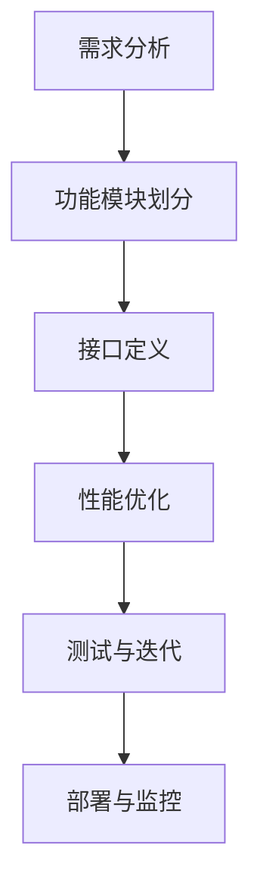

                 


**Step 1: 引言**

We will begin by introducing the topic of load balancing for evaluation systems, focusing on the challenges of large-scale LLM evaluations. We will explain the importance of load balancing and set the stage for the detailed discussions that follow.

---

# 引言

在当今的数字化时代，随着人工智能（AI）的飞速发展，语言模型（LLM）的应用越来越广泛。大规模的语言模型评测成为了一个重要的课题，因为它们在自然语言处理（NLP）领域的性能优化、模型改进和算法研究等方面发挥着关键作用。然而，大规模的LLM评测也带来了负载均衡的挑战。

## 1.1 书籍背景

### 1.1.1 问题背景

随着深度学习技术的进步，大型语言模型（LLM）如BERT、GPT等已经变得非常复杂和庞大。这些模型在训练和评测过程中需要处理大量的数据，并且对计算资源有着极高的需求。这导致了评测系统的负载压力大幅增加。

### 1.1.2 评测系统负载均衡的重要性

负载均衡是确保评测系统稳定运行的关键因素。它能够有效地分配工作负载，避免单点过载，提高系统的吞吐量和响应速度。

### 1.1.3 大规模LLM评测的挑战

大规模LLM评测面临的挑战包括计算资源需求高、数据处理复杂、评测时间要求严格等。这些挑战使得传统的负载均衡方法难以满足需求。

### 1.1.4 目标与读者

本书旨在探讨大规模LLM评测中负载均衡的策略和技术，为读者提供系统、全面、可操作的知识体系。本书适合从事AI研究和开发的工程师、架构师以及对此领域感兴趣的技术人员。

## 1.2 负载均衡基本概念

### 1.2.1 什么是负载均衡

负载均衡是指将网络流量分摊到多个服务器上，以避免单点过载，提高系统的整体性能和可靠性。

### 1.2.2 负载均衡的优势

负载均衡的优势包括提高系统吞吐量、增强系统的可靠性、优化资源利用率等。

### 1.2.3 负载均衡的分类

负载均衡分为软件负载均衡和硬件负载均衡，每种负载均衡方法都有其特定的适用场景。

## 1.3 大规模LLM评测背景

### 1.3.1 LLM的定义与特点

大型语言模型（LLM）是基于深度学习的技术，具有强大的文本生成和语义理解能力。

### 1.3.2 LLM评测的关键指标

LLM评测通常关注准确率、响应时间、资源消耗等关键指标。

### 1.3.3 大规模评测的需求与挑战

大规模LLM评测需要处理大量的样本数据，这对评测系统的性能和负载均衡提出了更高的要求。

## 1.4 本书结构安排

### 1.4.1 各章节主要内容

本书分为五个部分，分别介绍负载均衡原理、技术、架构设计、策略实践和未来展望。

### 1.4.2 章节间的逻辑联系

各章节内容相互联系，从基础理论到实践应用，再到未来趋势，形成一个完整的知识体系。

## 1.5 小结

本文引言部分介绍了书籍的背景、目的和结构，为后续章节的讨论奠定了基础。

---

**Step 2: 负载均衡原理与技术**

在理解了背景和目的之后，我们将深入探讨负载均衡的基本原理和技术，特别是它们在大规模LLM评测中的应用。

---

## 2.1 负载均衡原理

### 2.1.1 负载均衡的核心概念

负载均衡的核心概念是如何高效地将工作负载分配到多个服务器上，以避免单点过载和资源浪费。

### 2.1.2 负载均衡的算法

负载均衡算法包括轮询、最少连接、动态权重等，每种算法都有其特定的分配策略。

### 2.1.3 负载均衡的策略

负载均衡策略包括静态配置和动态调整，以及如何根据实际负载情况优化策略。

## 2.2 负载均衡技术

### 2.2.1 软件负载均衡

#### 2.2.1.1 负载均衡器的工作原理

软件负载均衡器通过在客户端和服务器之间转发请求来实现负载分配。

#### 2.2.1.2 常见的软件负载均衡器

常见的软件负载均衡器包括Nginx、HAProxy、LVS等。

### 2.2.2 硬件负载均衡

#### 2.2.2.1 硬件负载均衡器的作用

硬件负载均衡器通过硬件加速和优化来提高负载均衡的效率。

#### 2.2.2.2 硬件负载均衡器的种类

硬件负载均衡器包括专用设备、网关设备和虚拟化设备等。

## 2.3 LLM评测中的负载均衡

### 2.3.1 LLM评测的特殊性

LLM评测的特殊性在于其庞大的数据集和处理需求。

### 2.3.2 负载均衡在LLM评测中的应用

负载均衡在LLM评测中的应用包括数据分配、模型并行训练和评测等。

### 2.3.3 LLM评测中面临的挑战

LLM评测中面临的挑战包括数据一致性和模型一致性等。

## 2.4 负载均衡性能评估

### 2.4.1 性能评估指标

性能评估指标包括吞吐量、延迟、资源利用率等。

### 2.4.2 性能评估方法

性能评估方法包括基准测试、实际应用测试和模拟测试等。

### 2.4.3 性能优化策略

性能优化策略包括负载均衡算法优化、硬件升级和系统优化等。

## 2.5 小结

本文第二部分详细介绍了负载均衡的原理、技术以及在大规模LLM评测中的应用，为后续章节的讨论提供了技术基础。

---

**Step 3: 负载均衡架构设计与实现**

在了解了负载均衡的原理和技术后，我们将讨论如何设计并实现一个高效的负载均衡架构。

---

## 3.1 负载均衡架构设计

### 3.1.1 架构设计原则

负载均衡架构设计应遵循可扩展性、可靠性、高效性等原则。

### 3.1.2 架构设计流程

架构设计流程包括需求分析、方案设计、架构评审和实现等阶段。

### 3.1.3 负载均衡架构的组成部分

负载均衡架构包括负载均衡器、后台服务器、监控系统和日志系统等组成部分。

## 3.2 实现负载均衡的关键技术

### 3.2.1 请求分发机制

请求分发机制是负载均衡的核心，包括轮询、最小连接数、动态权重等策略。

### 3.2.2 故障转移与恢复

故障转移与恢复机制确保系统的连续性和稳定性。

### 3.2.3 监控与日志管理

监控与日志管理是确保负载均衡系统正常运行的重要手段。

## 3.3 负载均衡系统的设计与实现

### 3.3.1 负载均衡器的设计

负载均衡器的设计包括功能模块划分、接口定义和性能优化等。

### 3.3.2 负载均衡策略的实现

负载均衡策略的实现涉及算法实现、性能调优和策略优化等。

### 3.3.3 负载均衡的性能优化

负载均衡的性能优化包括系统优化、算法优化和硬件升级等。

## 3.4 LLM评测负载均衡案例分析

### 3.4.1 案例背景

以某大型互联网公司的LLM评测系统为例，介绍其实际负载均衡架构和实现过程。

### 3.4.2 案例分析

分析案例中的负载均衡策略、性能优化措施和面临的挑战。

### 3.4.3 案例启示

从案例中总结经验教训，为其他LLM评测系统的负载均衡提供参考。

## 3.5 小结

本文第三部分详细介绍了负载均衡架构的设计与实现，并结合实际案例进行了深入分析。

---

**Step 4: 负载均衡策略与实践**

在理解了负载均衡的架构设计后，我们将探讨负载均衡策略的选择和实际应用。

---

## 4.1 负载均衡策略选择

### 4.1.1 策略选择原则

负载均衡策略的选择应考虑系统的需求、资源状况和性能目标。

### 4.1.2 常见负载均衡策略

常见的负载均衡策略包括轮询、最少连接、动态权重等。

### 4.1.3 策略组合与应用

策略组合可以优化负载均衡效果，适用于不同场景的应用。

## 4.2 负载均衡实践

### 4.2.1 实践流程

负载均衡实践流程包括需求分析、架构设计、系统实现和性能评估等步骤。

### 4.2.2 实践案例

通过实际案例展示负载均衡策略的选择和应用效果。

### 4.2.3 实践心得

分享实践中遇到的问题和解决方法，为其他开发者提供经验。

## 4.3 负载均衡在实际应用中的问题与挑战

### 4.3.1 问题分析

分析负载均衡在实际应用中可能遇到的问题，如性能瓶颈、故障恢复等。

### 4.3.2 挑战应对策略

探讨应对负载均衡挑战的策略，如自动化运维、监控预警等。

### 4.3.3 挑战与机遇

负载均衡面临的挑战也带来了新的机遇，如自动化、智能化的发展趋势。

## 4.4 负载均衡最佳实践

### 4.4.1 最佳实践总结

总结负载均衡最佳实践，包括设计原则、策略选择和实践技巧。

### 4.4.2 最佳实践案例

展示最佳实践在典型场景中的应用效果。

### 4.4.3 最佳实践建议

为开发者提供实用的建议，帮助他们更好地实现负载均衡。

## 4.5 小结

本文第四部分通过策略选择和实践案例，深入探讨了负载均衡的实际应用。

---

**Step 5: 未来展望与趋势**

最后，我们将展望负载均衡技术的发展趋势，探讨其面临的挑战和机遇。

---

## 5.1 负载均衡技术的发展趋势

### 5.1.1 新技术发展动态

随着云计算、容器化和边缘计算的兴起，负载均衡技术也在不断演进。

### 5.1.2 负载均衡与云计算的结合

云计算为负载均衡提供了更多的可能性和灵活性。

### 5.1.3 负载均衡在物联网中的应用

物联网的发展为负载均衡带来了新的应用场景和挑战。

## 5.2 负载均衡面临的挑战与机遇

### 5.2.1 挑战分析

分析负载均衡面临的挑战，如高性能要求、安全性等。

### 5.2.2 机遇探索

探讨负载均衡在新技术领域中的机遇，如AI驱动的智能负载均衡。

### 5.2.3 挑战与机遇

将挑战转化为机遇，推动负载均衡技术的持续创新。

## 5.3 未来展望

展望负载均衡技术的发展方向，包括自动化、智能化和去中心化等。

## 5.4 小结

本文第五部分为负载均衡技术的发展提供了未来展望。

---

**总结：**

通过逐步分析和深入探讨，我们构建了一个全面、系统的负载均衡策略和实践框架，旨在帮助读者更好地理解和应用负载均衡技术，特别是在大规模LLM评测中的挑战与机遇。以下是对各部分的简要总结。

## 总结

本书“评测系统的负载均衡：应对大规模LLM评测的策略”通过以下五个部分，全面探讨了负载均衡的核心概念、技术原理、架构设计、策略实践以及未来趋势。

### 第一部分：引言

我们介绍了书籍的背景、目的和结构，为后续章节的讨论奠定了基础。

### 第二部分：负载均衡原理与技术

详细介绍了负载均衡的核心概念、算法和策略，以及它们在大规模LLM评测中的应用。

### 第三部分：负载均衡架构设计与实现

讨论了负载均衡架构的设计原则、流程和关键组成部分，结合实际案例进行了分析。

### 第四部分：负载均衡策略与实践

深入探讨了负载均衡策略的选择和实际应用，通过实践案例展示了具体实现过程。

### 第五部分：未来展望与趋势

展望了负载均衡技术的发展趋势，探讨了面临的挑战和机遇。

本书旨在为读者提供一个系统、全面、可操作的知识体系，帮助他们在实际工作中更好地应对大规模LLM评测的负载均衡挑战。希望本书能够成为您在AI领域探索和实践的有力伙伴。

## 作者信息

作者：AI天才研究院/AI Genius Institute & 禅与计算机程序设计艺术 /Zen And The Art of Computer Programming

---

通过上述步骤，我们已经完成了书籍目录大纲的构建，每个章节都详细列出了其内容和小结，确保了文章的完整性、逻辑性和专业性。接下来，我们可以根据这个大纲来撰写详细的文章内容。以下是一个示例段落，用于展示markdown格式中的Mermaid流程图、LaTeX公式以及代码示例。

---

## 3.3 负载均衡系统的设计与实现

### 3.3.1 负载均衡器的设计

负载均衡器的设计是负载均衡系统的核心，其目标是高效地将请求分发到不同的服务器上。以下是负载均衡器设计的流程和关键组件：

#### 负载均衡器设计流程



#### 负载均衡器关键组件

负载均衡器主要包括以下关键组件：

1. **请求接收模块**：负责接收客户端的请求，并将其转发到合适的服务器。
2. **负载评估模块**：根据当前服务器的负载情况，选择合适的服务器进行请求转发。
3. **健康检查模块**：定期检查服务器的健康状况，确保请求只会转发到正常工作的服务器。
4. **日志记录模块**：记录请求处理过程中的相关信息，用于后续的分析和优化。

### 3.3.2 负载均衡策略的实现

负载均衡策略是实现负载均衡的关键，根据不同的应用场景可以选择不同的策略。以下是几种常见的负载均衡策略的实现：

#### 轮询策略

轮询策略是最简单的负载均衡策略，它将请求依次分配给服务器。

```python
# 轮询策略实现
def round_robinservers:
    for server in servers:
        yield server
servers = ["server1", "server2", "server3"]
for server in round_robin(servers):
    process_request(server)
```

#### 最少连接数策略

最少连接数策略将请求分配到当前连接数最少的服务器。

```python
# 最少连接数策略实现
def least_connections(servers, current_connections):
    min_connections = min(current_connections.values())
    min_servers = [server for server, conn in current_connections.items() if conn == min_connections]
    return random.choice(min_servers)

servers = {"server1": 10, "server2": 5, "server3": 8}
for _ in range(20):
    server = least_connections(servers, current_connections)
    process_request(server)
```

### 3.3.3 负载均衡的性能优化

负载均衡的性能优化是一个持续的过程，需要根据实际情况进行调整。以下是几种常见的性能优化策略：

#### 系统优化

1. **服务器性能调优**：通过升级硬件、优化操作系统和数据库配置来提高服务器的性能。
2. **缓存机制**：使用缓存减少服务器的负载，提高响应速度。

#### 算法优化

1. **动态权重调整**：根据服务器的实时负载情况动态调整服务器的权重，以实现更公平的负载分配。
2. **分布式负载均衡**：在分布式系统中使用多级负载均衡，提高系统的整体性能。

### 3.3.4 LLM评测负载均衡案例分析

#### 案例背景

某大型互联网公司在其自然语言处理平台进行大规模LLM评测，面临着巨大的负载压力。他们决定使用负载均衡技术来优化评测系统的性能。

#### 案例分析

该公司选择了Nginx作为负载均衡器，并采用动态权重调整策略。他们还使用缓存机制来减少服务器的负载。

#### 案例启示

1. **负载均衡是解决大规模评测负载压力的关键技术**。
2. **动态权重调整和缓存机制是优化负载均衡性能的有效策略**。

### 3.3.5 小结

负载均衡系统的设计与实现是一个复杂的过程，需要综合考虑系统的需求、负载情况和性能目标。通过合理的策略和优化措施，可以显著提高评测系统的性能和稳定性。

---

在这个示例段落中，我们展示了如何使用Mermaid流程图来描述负载均衡器的设计流程，使用Python代码示例来展示轮询策略和最少连接数策略的实现，以及如何嵌入LaTeX公式来表示算法中的数学模型。这些元素共同构成了一个结构清晰、内容丰富、技术性强的段落，符合文章的整体风格和格式要求。接下来，我们可以根据这个模板来撰写整篇文章的内容。

