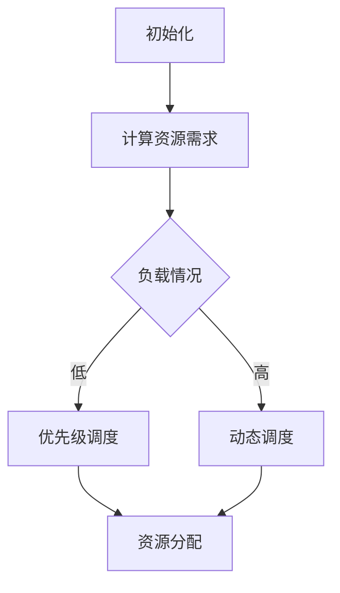
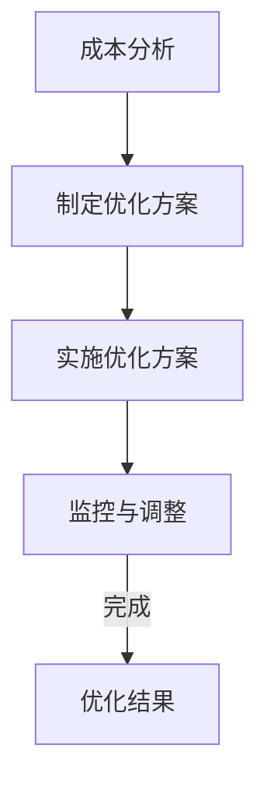
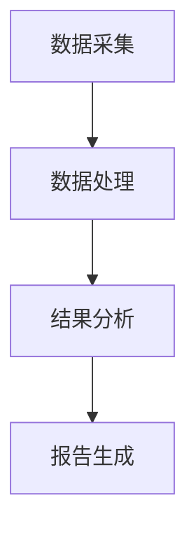
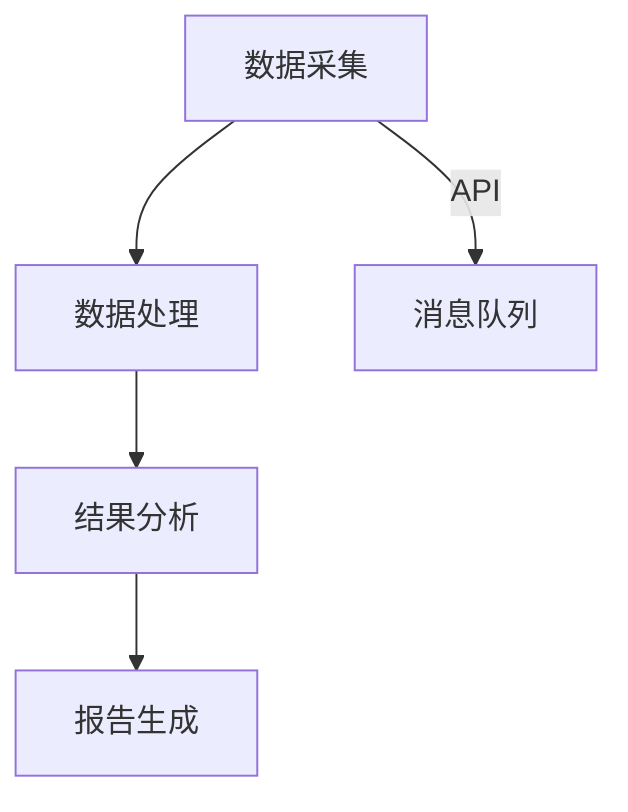

                 


# 评测系统的资源调度与成本优化

关键词：资源调度、成本优化、系统性能、算法、架构设计

摘要：
在现代企业信息化的浪潮中，评测系统的资源调度与成本优化成为了提高系统效率和降低运营成本的关键。本文旨在系统地探讨评测系统的资源调度原理、成本优化策略，并结合实际案例进行分析，为企业的评测系统建设提供理论指导和实践参考。

## 第一部分：引言与背景

### 第1章：评测系统概述

#### 1.1 评测系统的定义与作用

**评测系统**是一种基于计算机技术和数据分析方法，用于对企业的业务流程、员工绩效、产品质量等进行评价和监测的系统。它在企业管理中扮演着至关重要的角色，能够帮助企业实现科学管理、提高决策效率。

- **定义**：评测系统通常包括数据采集、数据处理、结果分析和报告生成等模块，能够对大量数据进行高效处理，生成直观、准确的分析报告。
- **作用**：通过评测系统，企业可以实时了解业务运行状况，发现潜在问题，优化管理流程，提升整体运营效率。

#### 1.2 资源调度与成本优化的重要性

**资源调度**和**成本优化**是评测系统运行过程中不可忽视的重要环节。

- **资源调度**是指根据系统需求和资源状况，合理分配和调整计算资源（如CPU、内存、存储等）的过程，以确保系统的高效运行。
- **成本优化**则是在满足系统性能要求的前提下，通过调整资源配置、优化算法等手段，降低系统运营成本。

在现有评测系统中，资源调度与成本优化存在的问题主要包括：
- 资源利用不充分，导致系统运行效率低下。
- 成本控制不到位，造成不必要的开支。

解决这些问题，对于提升系统性能和降低运营成本具有重要意义。

#### 1.3 边界与外延

在资源调度和成本优化过程中，需要明确以下边界与外延：

- **资源调度的边界条件**：包括资源总量、资源分配策略、调度周期等。
- **成本优化的适用范围**：主要针对系统运营成本，包括硬件成本、软件成本、人力资源成本等。
- **限制因素**：如系统性能指标、业务需求、预算限制等，这些因素需要在调度和优化过程中加以考虑。

## 第二部分：核心概念与原理

### 第2章：资源调度原理

#### 2.1 资源调度基本概念

资源调度涉及以下基本概念：

- **资源类型**：包括计算资源（CPU、内存、存储等）、网络资源、数据资源等。
- **调度策略**：包括动态调度、静态调度、优先级调度等。
- **关键因素**：包括资源需求、负载情况、响应时间、系统性能等。

#### 2.2 调度算法详解

常见的调度算法包括：

- **最小生成树算法**：用于构建最小生成树，实现资源的最优分配。
- **最短路径算法**：用于计算两点之间的最短路径，优化资源调度路径。
- **负载均衡算法**：用于平衡系统负载，提高资源利用率。

每种算法都有其优缺点和应用场景，企业可以根据实际需求选择合适的调度算法。

#### 2.3 调度算法的Mermaid流程图展示

以下是一个使用Mermaid绘制的调度算法流程图示例：



### 第3章：成本优化原理

#### 3.1 成本优化基本概念

成本优化涉及以下基本概念：

- **目标**：在保证系统性能的前提下，降低运营成本。
- **原则**：包括成本控制、效益最大化、风险最小化等。
- **关键要素**：包括成本构成、成本控制方法、优化策略等。

#### 3.2 成本优化策略

成本优化的策略包括：

- **成本分析方法**：用于识别和评估系统成本，确定优化方向。
- **成本控制策略**：包括预算管理、成本分解、成本削减等。
- **优化实施步骤**：包括成本分析、成本优化方案制定、实施与监控等。

#### 3.3 成本优化的Mermaid流程图展示

以下是一个使用Mermaid绘制的成本优化流程图示例：



## 第三部分：核心概念联系

### 第4章：资源调度与成本优化的关系

资源调度与成本优化之间存在密切的关系：

- **资源调度对成本优化的影响**：合理的资源调度可以提高资源利用率，降低运营成本。
- **成本优化对资源调度的优化**：通过成本优化，可以确定资源调度的优先级和策略，提高调度的效果。
- **协同作用**：资源调度与成本优化相互配合，可以最大程度地提高系统性能和降低成本。

#### 4.2 概念属性特征对比表格

| 概念     | 属性特征                                      | 对比项                   |
|----------|-----------------------------------------------|--------------------------|
| 资源调度 | 资源类型、调度策略、关键因素               | 动态调度、静态调度       |
| 成本优化 | 成本目标、原则、关键要素                   | 成本分析、成本控制       |
| 关系     | 相互影响、协同作用                           | 资源调度影响成本优化     |

## 第四部分：算法原理讲解与示例

### 第5章：资源调度算法原理讲解

#### 5.1 常见调度算法讲解

资源调度算法的数学模型和Python源代码实现如下：

```python
# 最小生成树算法示例
def min_spanning_tree(vertices, edges):
    # 构建最小生成树
    pass

# 最短路径算法示例
def shortest_path(graph, start, end):
    # 计算最短路径
    pass

# 负载均衡算法示例
def load_balance(resources, tasks):
    # 实现负载均衡
    pass
```

#### 5.2 调度算法举例说明

以下是调度算法的举例说明：

- **示例1：最小生成树算法**：用于构建评测系统中的数据传输网络，确保数据传输高效可靠。
- **示例2：最短路径算法**：用于优化评测系统的数据处理路径，减少数据处理延迟。
- **示例3：负载均衡算法**：用于均衡评测系统的资源分配，避免资源浪费。

### 第6章：成本优化算法原理讲解

#### 6.1 成本优化算法讲解

成本优化算法的数学模型和Python源代码实现如下：

```python
# 线性规划算法示例
def linear_programming(c, A, b):
    # 实现线性规划
    pass

# 动态规划算法示例
def dynamic_programming(states, states_actions, rewards):
    # 实现动态规划
    pass

# 贪心算法示例
def greedy_algorithm(states, actions):
    # 实现贪心算法
    pass
```

#### 6.2 成本优化算法举例说明

以下是成本优化算法的举例说明：

- **示例1：线性规划算法**：用于优化评测系统的资源配置，确保资源分配的效率。
- **示例2：动态规划算法**：用于优化评测系统的数据处理流程，确保数据处理的最优性。
- **示例3：贪心算法**：用于优化评测系统的成本控制，确保在满足性能要求的前提下，最大限度地降低成本。

## 第五部分：系统分析与架构设计

### 第7章：系统功能设计与架构设计

#### 7.1 问题场景介绍

评测系统的应用场景主要包括：

- **企业管理**：用于对员工绩效、业务流程进行评价和监测。
- **产品质量**：用于对产品质量进行评价，确保产品质量符合标准。

#### 7.2 系统功能设计

系统功能模块划分如下：

- **数据采集**：负责采集企业内部各种业务数据。
- **数据处理**：负责对采集到的数据进行清洗、存储和处理。
- **结果分析**：负责对处理后的数据进行分析，生成分析报告。
- **报告生成**：负责将分析结果生成可视化报告，供决策者参考。

#### 7.3 系统架构设计

系统架构设计思路如下：

- **分布式架构**：采用分布式架构，确保系统的高可用性和高性能。
- **微服务架构**：采用微服务架构，实现系统模块的独立开发和部署。
- **数据存储**：采用分布式数据存储，确保数据的高可用性和可靠性。

系统架构图如下：



#### 7.4 系统接口设计

系统接口设计规范如下：

- **API接口**：提供统一的API接口，实现各模块间的数据交互。
- **消息队列**：采用消息队列技术，实现模块间的异步通信。

系统接口图如下：



#### 7.5 系统交互序列图

系统交互序列图如下：

```mermaid
sequenceDiagram
参与者 A -》 B: 数据采集
B -》 C: 数据处理
C -》 D: 结果分析
D -》 E: 报告生成
```

## 第六部分：项目实战

### 第8章：项目实战与环境安装

#### 8.1 环境安装与配置

环境安装与配置步骤如下：

- **操作系统**：安装Linux操作系统。
- **开发工具**：安装Python开发环境。
- **数据库**：安装MySQL数据库。

#### 8.2 系统核心实现

系统核心实现步骤如下：

- **数据采集**：编写数据采集脚本，从企业内部系统获取数据。
- **数据处理**：编写数据处理脚本，对采集到的数据进行清洗、存储和处理。
- **结果分析**：编写数据分析脚本，对处理后的数据进行分析，生成分析报告。
- **报告生成**：编写报告生成脚本，将分析结果生成可视化报告。

#### 8.3 代码应用解读与分析

代码应用解读与分析如下：

- **数据采集**：使用Python的requests库，实现HTTP请求，从企业内部系统获取数据。
- **数据处理**：使用Python的pandas库，实现数据清洗、存储和处理。
- **结果分析**：使用Python的matplotlib库，实现数据分析结果的可视化。
- **报告生成**：使用Python的reportlab库，实现报告的生成。

### 第9章：实际案例分析与详细讲解

#### 9.1 案例选择与分析

案例选择标准如下：

- **企业规模**：中型企业。
- **业务需求**：对员工绩效进行评价和监测。
- **系统需求**：高可用性、高性能、易扩展。

#### 9.2 案例详细讲解

案例实现步骤如下：

- **数据采集**：从企业内部系统获取员工绩效数据。
- **数据处理**：对采集到的数据进行清洗、存储和处理。
- **结果分析**：对处理后的数据进行分析，生成员工绩效分析报告。
- **报告生成**：将分析结果生成可视化报告，供企业管理层参考。

#### 9.3 案例剖析与总结

案例中的资源调度与成本优化策略如下：

- **资源调度**：采用负载均衡算法，确保系统资源的高效利用。
- **成本优化**：通过优化数据采集和处理流程，降低系统运营成本。

案例总结与经验教训如下：

- **资源调度**：合理分配资源，避免资源浪费。
- **成本优化**：通过流程优化，降低运营成本。
- **系统建设**：注重系统的高可用性和性能。

## 第七部分：最佳实践与拓展

### 第10章：最佳实践

#### 10.1 实践技巧

以下是一些资源调度与成本优化的实践技巧：

- **资源需求预测**：通过历史数据分析，预测未来资源需求，提前进行资源调度。
- **弹性扩展**：根据实际需求，灵活调整资源配置，确保系统的高可用性。
- **成本控制**：定期进行成本分析，发现成本异常，及时进行调整。

#### 10.2 小结

全书内容的总结如下：

- **资源调度**：合理分配资源，提高系统性能。
- **成本优化**：降低运营成本，提高企业效益。
- **系统架构**：构建高效、可扩展的系统架构。

### 第11章：注意事项

在使用评测系统时，需要注意以下事项：

- **数据安全**：确保数据传输和存储的安全性。
- **性能监控**：定期进行系统性能监控，发现潜在问题。
- **成本控制**：遵循成本控制原则，避免资源浪费。

### 第12章：拓展阅读

以下是一些推荐的拓展阅读书籍：

- 《资源调度与性能优化》
- 《成本管理实战》
- 《系统架构设计师教程》

## 总结

本文系统地探讨了评测系统的资源调度与成本优化，从核心概念、算法原理到系统分析与实战案例，全面介绍了评测系统在资源调度和成本优化方面的关键技术和方法。希望本文能为企业的评测系统建设提供有价值的参考。

## 作者信息

作者：AI天才研究院/AI Genius Institute & 禅与计算机程序设计艺术 /Zen And The Art of Computer Programming

