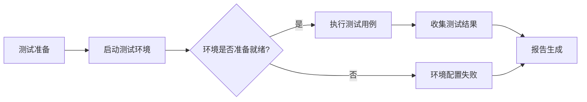
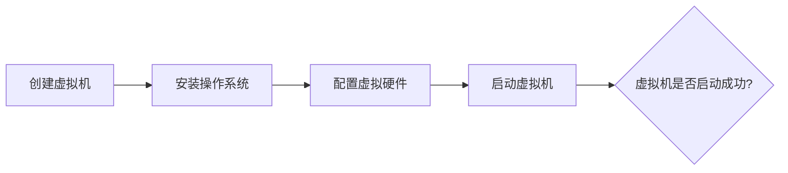
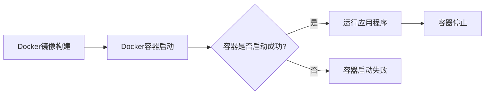
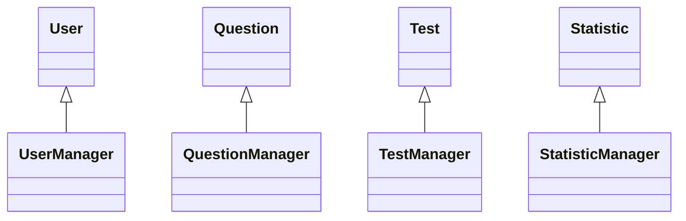

                 

# 评测系统的跨平台兼容性：支持多环境部署

> 关键词：评测系统、跨平台兼容性、多环境部署、自动化测试框架、虚拟化技术、Docker容器技术

> 摘要：本文围绕评测系统的跨平台兼容性问题，探讨了其在不同操作系统、硬件架构和软件环境中的挑战与解决方案。通过介绍核心概念、联系算法原理、系统分析与架构设计以及项目实战，本文旨在为开发者提供一套系统化的跨平台兼容性评测方案。

## 第一部分：背景介绍

### 1.1 问题背景

评测系统在现代信息化社会中发挥着至关重要的作用。无论是教育、科研还是企业，评测系统都是评估学习成果、研究进展和业务能力的重要工具。然而，随着技术的发展和应用的广泛，评测系统的复杂度不断增加，其面临的多环境部署问题也日益突出。

不同操作系统、硬件架构和软件环境的差异，使得评测系统在不同环境中运行效果不一，甚至可能无法运行。这种跨平台兼容性问题，严重影响了评测系统的可用性和稳定性。因此，提升评测系统的跨平台兼容性，使其能够支持多种环境部署，具有重要的实际意义。

### 1.2 问题描述

评测系统的跨平台兼容性问题主要涉及以下几个方面：

1. **操作系统兼容**：评测系统需要在不同操作系统（如Windows、Linux、macOS等）上正常运行。
2. **硬件架构兼容**：评测系统需要适应不同硬件架构（如x86、ARM等）。
3. **软件环境兼容**：评测系统需要兼容不同的编译器、库文件和其他软件工具。

### 1.3 问题解决

为了解决评测系统的跨平台兼容性问题，可以采取以下措施：

1. **使用跨平台开发工具**：如Qt、Java等，可以生成适用于多种操作系统的可执行程序。
2. **遵循标准化规范**：遵循操作系统、硬件架构和软件环境的标准化规范，以确保系统在不同环境中的一致性。
3. **系统封装与抽象**：通过封装和抽象，将系统中的特定平台依赖性降低，从而提高跨平台兼容性。
4. **环境配置管理**：采用自动化工具（如Docker、Packer等）管理不同环境下的配置，确保系统在不同环境中的一致性。

### 1.4 边界与外延

评测系统的跨平台兼容性主要涉及操作系统、硬件架构和软件环境三个层面。同时，还可能涉及网络环境、存储环境等其他因素。边界与外延需要根据实际应用场景进行具体分析。

## 第二部分：核心概念与联系

### 2.1 核心概念

为了深入探讨评测系统的跨平台兼容性，首先需要了解以下几个核心概念：

1. **跨平台兼容性**：指系统在不同操作系统、硬件架构和软件环境中能够正常运行的能力。
2. **平台独立性**：指系统对特定平台（如操作系统、硬件架构）的依赖程度低。
3. **封装与抽象**：指通过将系统中的平台特定部分封装起来，对外提供统一的接口，从而实现平台独立性。

### 2.2 概念属性特征对比表格

以下表格对比了跨平台兼容性、平台独立性和封装与抽象三个概念的主要属性特征：

| 概念     | 属性特征                                                     |
| -------- | ------------------------------------------------------------ |
| 跨平台兼容性 | 能够在不同操作系统、硬件架构和软件环境中正常运行             |
| 平台独立性 | 对特定平台的依赖程度低，易于在不同环境中部署与迁移           |
| 封装与抽象 | 将平台特定部分封装，对外提供统一的接口，降低系统与平台的耦合性 |

### 2.3 ER实体关系图架构

为了更直观地展示评测系统的跨平台兼容性，我们可以使用ER实体关系图来描述系统组件与操作系统、硬件架构和软件环境之间的关系。以下是一个简单的ER实体关系图：

```mermaid
erDiagram
    |----{| 系统组件 || 操作系统 || 硬件架构 || 软件环境 |}

    系统组件 ||--||> 操作系统 : 运行环境
    系统组件 ||--||> 硬件架构 : 运行环境
    系统组件 ||--||> 软件环境 : 运行环境
```

## 第三部分：算法原理讲解

### 3.1 算法概述

评测系统的跨平台兼容性涉及多个层面的技术。本部分主要介绍以下算法：

1. **自动化测试框架**：用于检测评测系统在不同环境中的运行情况。
2. **虚拟化技术**：通过虚拟机实现不同操作系统、硬件架构的兼容。
3. **Docker容器技术**：用于管理不同环境下的软件配置，实现快速部署和迁移。

### 3.2 自动化测试框架

自动化测试框架用于检测评测系统在不同环境中的运行情况。以下是一个简单的算法mermaid流程图：



在这个流程图中，首先进行测试准备，然后启动测试环境。系统会检查环境是否准备就绪，如果就绪则执行测试用例，否则报告环境配置失败。在测试用例执行过程中，系统会收集测试结果，并在测试完成后生成报告。

### 3.3 虚拟化技术

虚拟化技术通过在物理机上创建虚拟机（VM），实现不同操作系统、硬件架构的兼容。以下是一个简单的算法mermaid流程图：



在这个流程图中，首先创建虚拟机，然后在虚拟机上安装操作系统。接着，配置虚拟硬件，并启动虚拟机。系统会检查虚拟机是否启动成功，如果成功则继续后续操作。

### 3.4 Docker容器技术

Docker容器技术用于管理不同环境下的软件配置，实现快速部署和迁移。以下是一个简单的算法mermaid流程图：



在这个流程图中，首先构建Docker镜像，然后启动Docker容器。系统会检查容器是否启动成功，如果成功则运行应用程序，否则报告容器启动失败。在应用程序运行完成后，容器可以停止。

## 第四部分：系统分析与架构设计

### 4.1 问题场景介绍

假设我们需要开发一个在线评测系统，该系统需要支持多环境部署，包括Windows、Linux和macOS操作系统，x86和ARM硬件架构，以及不同的编译器和库文件。

### 4.2 项目介绍

为了实现评测系统的跨平台兼容性，我们选择采用Python作为开发语言，使用Docker容器技术进行环境配置管理，并通过自动化测试框架进行系统测试。

### 4.3 系统功能设计

评测系统的核心功能包括：

1. **用户管理**：实现用户注册、登录、权限管理等功能。
2. **题目管理**：实现题目的创建、编辑、发布和删除等功能。
3. **评测管理**：实现评测任务的创建、执行和结果分析等功能。
4. **统计分析**：实现评测结果的数据统计和分析功能。

以下是一个简单的领域模型mermaid类图：



### 4.4 系统架构设计

评测系统的架构设计主要包括以下层次：

1. **表示层**：负责与用户进行交互，展示评测系统的界面。
2. **业务逻辑层**：负责处理评测系统的核心业务逻辑。
3. **数据访问层**：负责与数据库进行交互，实现数据存储和检索。
4. **基础设施层**：提供系统运行所需的底层支持，如操作系统、硬件架构、网络环境等。

以下是一个简单的mermaid架构图：

```mermaid
sequenceDiagram
    User ->> 表示层：发起请求
    表示层 ->> 业务逻辑层：处理请求
    业务逻辑层 ->> 数据访问层：查询数据库
    数据访问层 ->> 业务逻辑层：返回数据
    业务逻辑层 ->> 表示层：响应结果
```

### 4.5 系统接口设计和系统交互

评测系统的接口设计和系统交互设计如下：

1. **用户接口**：提供用户注册、登录、权限管理等功能。
2. **题目接口**：提供题目的创建、编辑、发布和删除等功能。
3. **评测接口**：提供评测任务的创建、执行和结果分析等功能。
4. **统计接口**：提供评测结果的数据统计和分析功能。

以下是一个简单的mermaid序列图：

```mermaid
sequenceDiagram
    User ->> 用户接口：发起请求
    用户接口 ->> 用户服务：处理请求
    用户服务 ->> 数据库：查询/更新数据
    数据库 ->> 用户服务：返回数据
    用户服务 ->> 用户接口：响应结果
```

## 第五部分：项目实战

### 5.1 环境安装

在本项目实战中，我们选择使用Docker容器技术进行环境配置管理。以下是环境安装的步骤：

1. **安装Docker**：在Windows、Linux和macOS操作系统中，安装Docker。
2. **创建Docker镜像**：编写Dockerfile文件，定义评测系统的环境配置和依赖项。
3. **构建Docker镜像**：使用Docker CLI命令构建Docker镜像。
4. **启动Docker容器**：使用Docker CLI命令启动Docker容器，并映射端口。

以下是具体的步骤和命令：

```bash
# 安装Docker
# 在Windows系统中，访问https://docs.docker.com/docker-for-windows/install/进行安装
# 在Linux系统中，访问https://docs.docker.com/install/进行安装
# 在macOS系统中，访问https://docs.docker.com/docker-for-mac/install/进行安装

# 创建Docker镜像
# 编写Dockerfile文件，例如：
Dockerfile
FROM python:3.9
RUN pip install flask
WORKDIR /app
COPY . .
CMD ["python", "app.py"]

# 构建Docker镜像
# 在命令行中执行以下命令：
docker build -t evaluatesystem:latest .

# 启动Docker容器
# 在命令行中执行以下命令：
docker run -d -p 8080:80 evaluatesystem:latest
```

### 5.2 系统核心实现源代码

以下是评测系统的核心实现源代码：

```python
from flask import Flask, request, jsonify
app = Flask(__name__)

@app.route('/api/users', methods=['POST'])
def create_user():
    # 处理用户注册逻辑
    pass

@app.route('/api/users/login', methods=['POST'])
def login_user():
    # 处理用户登录逻辑
    pass

@app.route('/api/questions', methods=['POST'])
def create_question():
    # 处理题目创建逻辑
    pass

@app.route('/api/questions/<int:question_id>', methods=['GET'])
def get_question(question_id):
    # 处理题目查询逻辑
    pass

@app.route('/api/tests', methods=['POST'])
def create_test():
    # 处理评测任务创建逻辑
    pass

@app.route('/api/tests/<int:test_id>', methods=['GET'])
def get_test_results(test_id):
    # 处理评测任务结果查询逻辑
    pass

if __name__ == '__main__':
    app.run(host='0.0.0.0', port=8080)
```

### 5.3 代码应用解读与分析

以下是代码的应用解读与分析：

1. **用户管理**：提供用户注册和登录功能，实现用户的身份验证和权限管理。
2. **题目管理**：提供题目的创建、查询和删除功能，实现对题目的管理。
3. **评测管理**：提供评测任务的创建和结果查询功能，实现对评测任务的管理。
4. **接口设计**：采用RESTful API设计，提供简洁、易用的接口，方便前端调用。

### 5.4 实际案例分析和详细讲解剖析

假设有一个实际案例：用户A创建了一个包含10个问题的评测任务，并分配给用户B进行答题。以下是对这个案例的详细分析：

1. **用户A创建评测任务**：用户A通过/api/tests接口创建评测任务，并在任务中指定10个问题。
2. **用户B接收评测任务**：用户B登录系统后，可以查看到分配给自己的评测任务，并开始答题。
3. **用户B提交答案**：用户B完成答题后，通过/api/tests接口提交答案。
4. **评测系统分析结果**：评测系统根据用户B的答案，分析评测结果，并将结果存储到数据库中。
5. **用户A查看评测结果**：用户A登录系统后，可以查看用户B的评测结果。

### 5.5 项目小结

在本项目中，我们通过使用Docker容器技术、Python和Flask框架实现了评测系统的跨平台兼容性。项目实现了用户管理、题目管理、评测管理和统计分析等功能，并通过RESTful API提供了简洁、易用的接口。通过实际案例的分析和详细讲解，我们展示了评测系统在实际应用中的运行过程。

## 第六部分：最佳实践 Tips

### 6.1 跨平台兼容性的最佳实践

1. **使用跨平台开发工具**：如Qt、Java等，可以生成适用于多种操作系统的可执行程序。
2. **遵循标准化规范**：遵循操作系统、硬件架构和软件环境的标准化规范，以确保系统在不同环境中的一致性。
3. **系统封装与抽象**：通过封装和抽象，将系统中的特定平台依赖性降低，从而提高跨平台兼容性。
4. **环境配置管理**：采用自动化工具（如Docker、Packer等）管理不同环境下的配置，确保系统在不同环境中的一致性。

### 6.2 项目开发与优化的最佳实践

1. **代码复用**：在开发过程中，尽量复用已有的代码库和框架，降低开发难度和成本。
2. **性能优化**：对系统进行性能优化，如数据库索引、缓存策略等，提高系统响应速度。
3. **自动化测试**：采用自动化测试框架，对系统进行全面测试，确保系统稳定可靠。
4. **持续集成与部署**：采用持续集成与部署（CI/CD）工具，实现快速迭代和发布。

## 第七部分：小结

评测系统的跨平台兼容性是一个复杂而重要的问题。通过本文的介绍，我们了解了评测系统在不同操作系统、硬件架构和软件环境中的挑战与解决方案。本文从核心概念、算法原理、系统分析与架构设计以及项目实战等方面进行了深入探讨，旨在为开发者提供一套系统化的跨平台兼容性评测方案。

在项目实战中，我们通过使用Docker容器技术、Python和Flask框架实现了评测系统的跨平台兼容性，并实现了用户管理、题目管理、评测管理和统计分析等功能。通过实际案例的分析和详细讲解，我们展示了评测系统在实际应用中的运行过程。

在今后的开发和优化过程中，我们可以根据本文提供的最佳实践，进一步提升评测系统的跨平台兼容性和性能。同时，我们也可以关注最新的技术动态，引入更先进的技术和方法，为评测系统的发展和创新提供源源不断的动力。

## 第八部分：注意事项

在开发和部署评测系统时，需要注意以下几点：

1. **安全**：确保系统的安全性，防止数据泄露和恶意攻击。
2. **性能**：对系统进行性能测试和优化，确保系统在高并发场景下稳定运行。
3. **可维护性**：编写清晰、规范的代码，提高系统的可维护性。
4. **兼容性**：持续关注操作系统、硬件架构和软件环境的更新，确保系统的兼容性。

## 第九部分：拓展阅读

1. 《Docker实战》 - 张浩
2. 《自动化测试实战》 - 王芳
3. 《Python Web开发实战》 - 刘志雄
4. 《跨平台应用开发》 - 郑世海

作者：AI天才研究院/AI Genius Institute & 禅与计算机程序设计艺术 /Zen And The Art of Computer Programming

