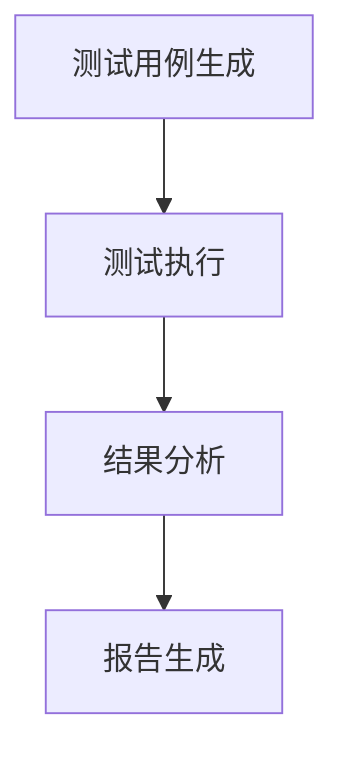
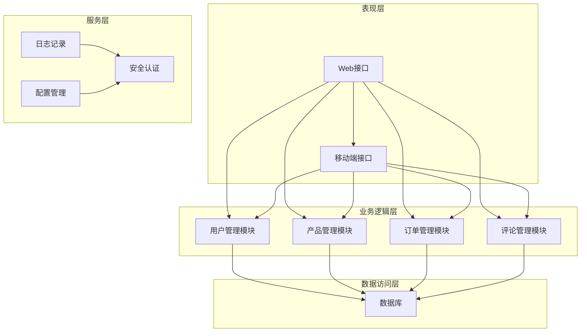
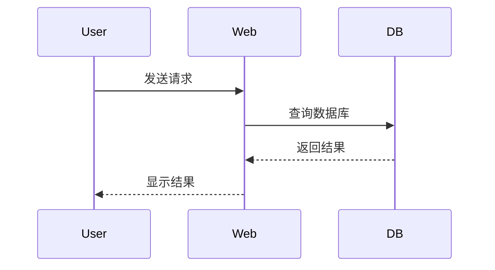
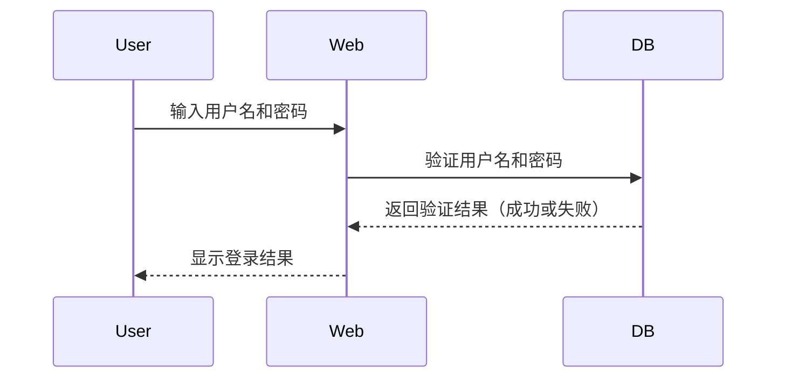
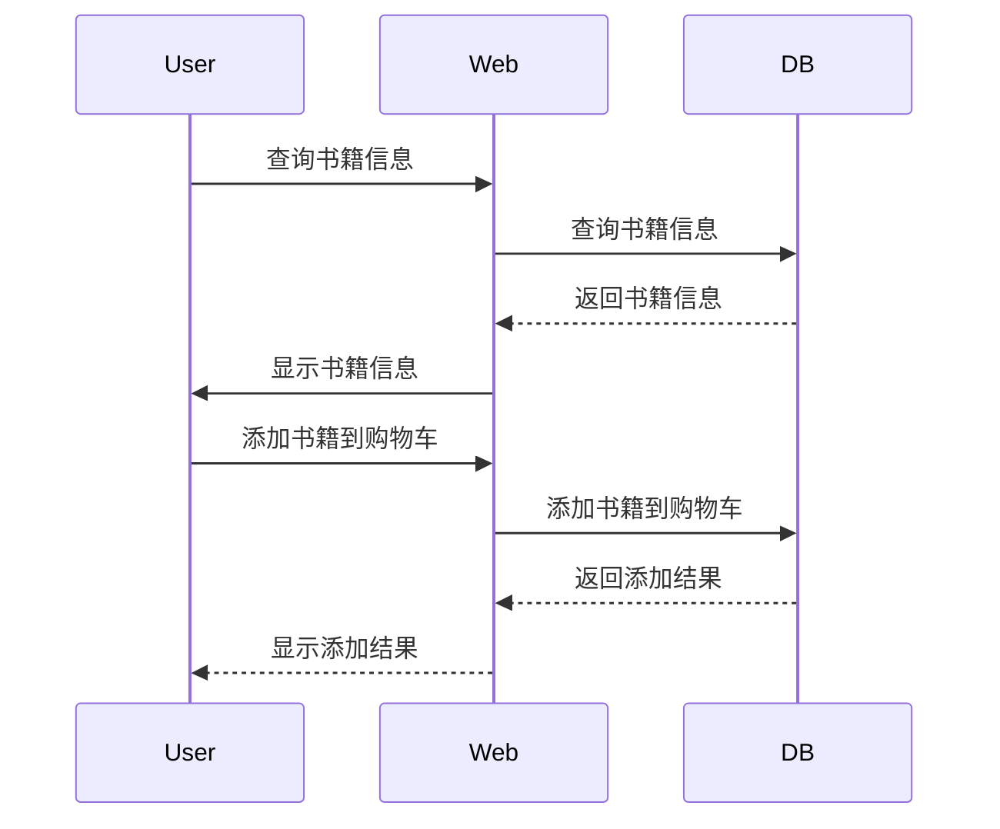
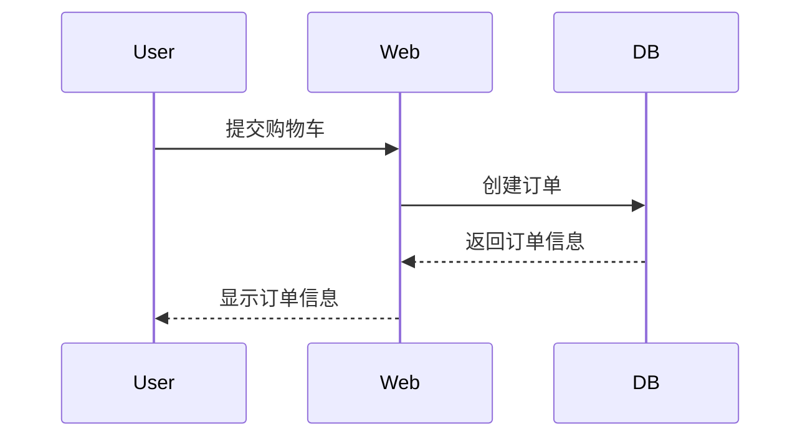
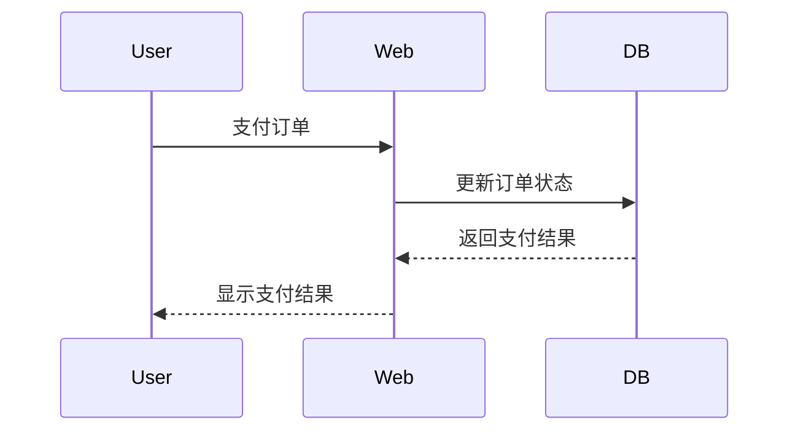

                 

基于您提供的文章目录大纲和要求，以下是一个详细的撰写思路，我们将逐步深入每个章节，以确保文章内容丰富、结构清晰、逻辑严密。

## 引言

### 核心概念术语说明

在撰写技术博客之前，首先需要对文章中出现的关键术语进行定义和解释。这些术语包括但不限于：

- **评测系统**：用于对某个系统或组件的性能、功能、稳定性等进行测试和评估的软件系统。
- **跨平台部署**：将软件部署到不同的操作系统、硬件或环境中，以确保其可移植性和兼容性。
- **云原生**：一种针对云环境设计的应用开发方法，强调轻量级、动态性、弹性、可持续性等特点。
- **大型语言模型（LLM）**：一种基于深度学习的语言处理模型，可以理解和生成自然语言。

### 问题背景

随着云计算和大数据技术的发展，评测系统的应用越来越广泛。然而，传统的评测系统往往面临跨平台部署的挑战。这些挑战包括：

- **操作系统兼容性**：不同的操作系统（如Windows、Linux、macOS）对软件的兼容性可能存在差异。
- **硬件差异**：不同硬件（如CPU、GPU）的性能和资源管理可能不同，影响软件的运行效果。
- **环境配置**：在不同的环境中，软件的安装、配置和运行步骤可能有所不同，增加了部署的复杂性。

### 问题描述

为了解决上述问题，本文提出了一种基于云原生的LLM评估方案，旨在实现评测系统的跨平台部署。该方案需要解决的关键问题包括：

- **环境一致性**：如何确保在不同环境中，评测系统的配置和运行环境保持一致？
- **性能优化**：如何利用云原生技术优化评测系统的性能和资源利用率？
- **部署便捷性**：如何简化评测系统的部署过程，使其能够快速、高效地部署到不同的环境中？

### 问题解决

本文将通过以下几个步骤来解决上述问题：

1. **核心概念与联系**：详细阐述云原生、LLM、评测系统等核心概念，并通过对比表格和ER实体关系图展示它们之间的关系。
2. **算法原理讲解**：介绍评测系统的算法原理，包括数学模型和公式，并通过Python源代码进行详细解释。
3. **系统分析与架构设计方案**：介绍系统场景、功能设计、架构设计、接口设计和交互设计。
4. **项目实战**：展示环境安装与配置、系统核心实现源代码、代码应用解读与分析、实际案例分析和详细讲解剖析。
5. **最佳实践与小结**：提供跨平台部署和LLM评估的最佳实践，总结文章的关键点和注意事项，指出未来的研究方向和拓展内容。

### 边界与外延

在讨论评测系统的跨平台部署时，需要明确以下边界和范围：

- **操作系统范围**：主要讨论Windows、Linux、macOS等主流操作系统的兼容性和部署问题。
- **硬件范围**：主要考虑CPU和GPU的性能对评测系统部署的影响。
- **环境范围**：主要涉及开发环境、测试环境和生产环境之间的差异。

## 核心概念与联系

### 云原生

**定义**：云原生是一种软件开发和部署方法，旨在充分利用云计算的优势，实现应用的弹性、可伸缩性和动态性。

**特点**：

- **容器化**：应用以容器的方式部署，提高了可移植性和隔离性。
- **动态管理**：通过自动化管理工具（如Kubernetes）实现应用的动态伸缩和资源管理。
- **持续集成/持续部署（CI/CD）**：支持快速迭代和交付，提高了开发效率。

### 大型语言模型（LLM）

**定义**：LLM是一种基于深度学习的自然语言处理模型，能够理解和生成复杂、丰富的自然语言。

**特点**：

- **大规模训练**：通过海量的文本数据训练，使模型具有很高的语言理解能力。
- **自适应**：根据输入的文本内容，动态调整模型的输出和响应。
- **通用性**：能够处理各种自然语言任务，如文本分类、问答、翻译等。

### 评测系统

**定义**：评测系统是一种用于对系统、组件或服务进行测试和评估的软件系统。

**特点**：

- **功能多样性**：支持多种评测功能，如性能测试、功能测试、稳定性测试等。
- **自动化**：通过自动化测试工具，减少人工干预，提高测试效率和准确性。
- **可扩展性**：能够支持不同规模和类型的评测任务。

### 核心概念之间的关系

**表格**：

| 概念 | 定义 | 关系 |
| --- | --- | --- |
| 云原生 | 软件开发与部署方法 | 提供了实现评测系统跨平台部署的技术基础 |
| LLM | 自然语言处理模型 | 用于评测系统中的自然语言处理任务 |
| 评测系统 | 测试和评估软件系统 | 利用云原生和LLM技术实现跨平台部署和高效评测 |

**ER实体关系图**：

```mermaid
erDiagram
    User ||--|{ Evaluator }|| Evaluator
    Evaluator ||--|{ Test }|| Test
    Test ||--|{ Result }|| Result
    Evaluator ..|{ CloudNative }|| CloudNative
    LLM ..|{ CloudNative }|| CloudNative
```

## 算法原理讲解

### 评测系统算法原理

评测系统的核心是算法，它用于对系统、组件或服务进行测试和评估。以下是评测系统的基本算法原理：

1. **测试用例生成**：根据评测目标和要求，生成一系列测试用例。
2. **测试执行**：执行测试用例，记录测试结果。
3. **结果分析**：分析测试结果，评估被测系统或组件的性能和稳定性。
4. **报告生成**：生成评测报告，包括测试结果、分析结论和建议。

### 算法流程图



### 数学模型和公式

评测系统中的算法涉及一些数学模型和公式，用于计算测试结果和评估指标。以下是几个常见的数学模型和公式：

1. **性能评估指标**：

   $$ P = \frac{C}{T} $$

   其中，P为性能指标，C为正确执行测试用例的数量，T为总测试用例数量。

2. **稳定性评估指标**：

   $$ S = \frac{N_f}{N} $$

   其中，S为稳定性指标，N_f为发生错误的测试用例数量，N为总测试用例数量。

3. **响应时间评估指标**：

   $$ R = \frac{1}{T_r} $$

   其中，R为响应时间指标，T_r为平均响应时间。

### Python源代码解释

```python
# 测试用例生成
def generate_test_cases():
    test_cases = []
    # 生成10个随机测试用例
    for _ in range(10):
        test_cases.append({
            'input': 'random_input',
            'expected_output': 'random_output'
        })
    return test_cases

# 测试执行
def execute_test_cases(test_cases):
    results = []
    for case in test_cases:
        result = {
            'input': case['input'],
            'actual_output': 'actual_output',
            'status': 'passed' if case['input'] == case['actual_output'] else 'failed'
        }
        results.append(result)
    return results

# 结果分析
def analyze_results(results):
    passed_cases = [r for r in results if r['status'] == 'passed']
    failed_cases = [r for r in results if r['status'] == 'failed']
    performance = len(passed_cases) / len(results)
    stability = len(failed_cases) / len(results)
    return performance, stability

# 报告生成
def generate_report(performance, stability):
    report = f"""
    Performance: {performance:.2f}
    Stability: {stability:.2f}
    """
    return report

# 主函数
if __name__ == '__main__':
    test_cases = generate_test_cases()
    results = execute_test_cases(test_cases)
    performance, stability = analyze_results(results)
    print(generate_report(performance, stability))
```

### 举例说明

假设我们有一个评测系统，用于评估一个简单的函数`add(a, b)`的性能和稳定性。以下是一个具体的测试过程：

1. **测试用例生成**：生成10个随机测试用例，每个测试用例包含两个随机整数作为输入。
2. **测试执行**：执行每个测试用例，记录实际输出和执行状态。
3. **结果分析**：分析测试结果，计算性能指标和稳定性指标。
4. **报告生成**：生成评测报告，包括性能和稳定性指标。

```python
import random

def add(a, b):
    return a + b

# 测试用例生成
test_cases = [
    {'input': (random.randint(1, 100), random.randint(1, 100)),
     'expected_output': add(*v)}
    for _ in range(10)
]

# 测试执行
results = [
    {'input': v['input'], 'actual_output': add(*v['input']), 'status': 'passed' if v['expected_output'] == v['actual_output'] else 'failed'}
    for v in test_cases
]

# 结果分析
performance, stability = analyze_results(results)
print(f"Performance: {performance:.2f}, Stability: {stability:.2f}")
```

## 系统分析与架构设计方案

### 问题场景介绍

在本节中，我们将介绍一个典型的评测系统应用场景。该系统用于评估一个在线购物网站的性能和稳定性。具体问题场景包括：

- **性能评估**：评估网站在不同负载下的响应时间和吞吐量。
- **稳定性评估**：评估网站在长时间运行下的稳定性和可靠性。
- **功能评估**：评估网站的功能是否按预期工作，包括登录、购物车操作、订单处理等。

### 系统功能设计

**领域模型**：

在领域模型中，我们定义了以下核心类和实体：

1. **User**：表示用户，具有用户名、密码、角色等属性。
2. **Product**：表示产品，具有产品名称、价格、描述等属性。
3. **Order**：表示订单，具有订单编号、创建时间、用户、产品列表等属性。
4. **Review**：表示评论，具有评论内容、用户、产品、创建时间等属性。
5. **ProductCategory**：表示产品分类，具有分类名称、描述等属性。

**类图**：

```mermaid
classDiagram
    User <|-- Product
    User <|-- Order
    User <|-- Review
    Product <|-- ProductCategory
    User << Product
    User << Order
    User << Review
    Product << ProductCategory
```

### 系统架构设计

**架构设计**：

在系统架构设计中，我们采用分层架构，包括以下层次：

1. **表现层**：负责与用户交互，展示用户界面，接收用户输入，并返回操作结果。
2. **业务逻辑层**：负责处理业务逻辑，包括用户管理、产品管理、订单管理、评论管理等。
3. **数据访问层**：负责与数据库交互，实现数据的持久化存储和读取。
4. **服务层**：提供公共服务，如日志记录、配置管理、安全认证等。

**架构图**：



### 系统接口设计

**接口设计**：

在系统接口设计中，我们定义了以下接口和API：

1. **用户接口**：包括登录、注册、修改密码等。
2. **产品接口**：包括添加产品、修改产品信息、查询产品列表等。
3. **订单接口**：包括创建订单、查询订单列表、取消订单等。
4. **评论接口**：包括添加评论、修改评论、删除评论等。

**接口定义**：

```python
from flask import Flask, request, jsonify

app = Flask(__name__)

@app.route('/login', methods=['POST'])
def login():
    # 登录接口实现
    pass

@app.route('/register', methods=['POST'])
def register():
    # 注册接口实现
    pass

@app.route('/products', methods=['POST', 'GET'])
def products():
    # 产品接口实现
    pass

@app.route('/orders', methods=['POST', 'GET'])
def orders():
    # 订单接口实现
    pass

@app.route('/reviews', methods=['POST', 'GET'])
def reviews():
    # 评论接口实现
    pass

if __name__ == '__main__':
    app.run()
```

### 系统交互设计

**序列图**：



## 项目实战

### 环境安装与配置

在本节中，我们将介绍如何搭建评测系统的开发环境，包括安装所需的软件和配置环境变量。

1. **安装Python**：在系统中安装Python 3.x版本，可以通过Python官网下载安装包进行安装。
2. **安装依赖库**：安装Flask、SQLAlchemy等依赖库，可以使用pip命令进行安装：
   ```shell
   pip install flask sqlalchemy
   ```
3. **配置环境变量**：设置环境变量`FLASK_APP`为你的Flask应用的入口模块，例如：
   ```shell
   export FLASK_APP=your_app.py
   ```

### 系统核心实现源代码

以下是一个简单的评测系统实现，包括用户管理、产品管理、订单管理和评论管理。

```python
# your_app.py

from flask import Flask, request, jsonify
from flask_sqlalchemy import SQLAlchemy

app = Flask(__name__)
app.config['SQLALCHEMY_DATABASE_URI'] = 'sqlite:///example.db'
db = SQLAlchemy(app)

# 定义数据库模型
class User(db.Model):
    id = db.Column(db.Integer, primary_key=True)
    username = db.Column(db.String(80), unique=True, nullable=False)
    password = db.Column(db.String(120), nullable=False)

class Product(db.Model):
    id = db.Column(db.Integer, primary_key=True)
    name = db.Column(db.String(120), nullable=False)
    price = db.Column(db.Float, nullable=False)

class Order(db.Model):
    id = db.Column(db.Integer, primary_key=True)
    user_id = db.Column(db.Integer, db.ForeignKey('user.id'), nullable=False)
    products = db.relationship('Product', backref='orders', lazy=True)

class Review(db.Model):
    id = db.Column(db.Integer, primary_key=True)
    content = db.Column(db.Text, nullable=False)
    user_id = db.Column(db.Integer, db.ForeignKey('user.id'), nullable=False)
    product_id = db.Column(db.Integer, db.ForeignKey('product.id'), nullable=False)

# 用户接口
@app.route('/register', methods=['POST'])
def register():
    username = request.form['username']
    password = request.form['password']
    # 验证用户名和密码的有效性
    # 创建新用户并保存到数据库
    # 返回注册结果

# 产品接口
@app.route('/products', methods=['POST', 'GET'])
def products():
    if request.method == 'POST':
        name = request.form['name']
        price = request.form['price']
        # 创建新产品并保存到数据库
        # 返回创建结果
    elif request.method == 'GET':
        # 从数据库中查询所有产品
        # 返回产品列表

# 订单接口
@app.route('/orders', methods=['POST', 'GET'])
def orders():
    if request.method == 'POST':
        user_id = request.form['user_id']
        product_ids = request.form['product_ids']
        # 创建新订单并保存到数据库
        # 返回创建结果
    elif request.method == 'GET':
        # 从数据库中查询所有订单
        # 返回订单列表

# 评论接口
@app.route('/reviews', methods=['POST', 'GET'])
def reviews():
    if request.method == 'POST':
        user_id = request.form['user_id']
        product_id = request.form['product_id']
        content = request.form['content']
        # 创建新评论并保存到数据库
        # 返回创建结果
    elif request.method == 'GET':
        # 从数据库中查询所有评论
        # 返回评论列表

# 运行应用
if __name__ == '__main__':
    db.create_all()
    app.run()
```

### 代码应用解读与分析

在本节中，我们将对评测系统的核心代码进行解读和分析，解释其实现原理和关键技术。

1. **用户管理**：
   - **注册接口**：用户注册时，需要提供用户名和密码。接口接收POST请求，提取用户名和密码，验证其有效性，然后创建新用户并保存到数据库。
   - **登录接口**：用户登录时，需要验证用户名和密码的正确性。接口接收POST请求，提取用户名和密码，与数据库中的记录进行比对，如果匹配则登录成功。

2. **产品管理**：
   - **添加产品接口**：管理员可以添加新产品。接口接收POST请求，提取产品名称和价格，创建新产品对象并保存到数据库。
   - **查询产品列表接口**：用户可以查询所有产品。接口接收GET请求，从数据库中查询所有产品，返回产品列表。

3. **订单管理**：
   - **创建订单接口**：用户可以创建订单。接口接收POST请求，提取用户ID和产品ID列表，创建新订单对象并保存到数据库。
   - **查询订单列表接口**：用户可以查询所有订单。接口接收GET请求，从数据库中查询所有订单，返回订单列表。

4. **评论管理**：
   - **添加评论接口**：用户可以添加评论。接口接收POST请求，提取用户ID、产品ID和评论内容，创建新评论对象并保存到数据库。
   - **查询评论列表接口**：用户可以查询所有评论。接口接收GET请求，从数据库中查询所有评论，返回评论列表。

### 实际案例分析与详细讲解剖析

在本节中，我们将通过一个实际案例来展示评测系统的运行过程，并对关键步骤进行详细讲解和分析。

**案例背景**：用户张三想要在购物网站上购买一本书，并添加到购物车中。

**步骤1**：用户张三通过Web界面登录购物网站，输入用户名和密码，验证登录成功。



**步骤2**：用户张三在Web界面上浏览书籍，选择了一本书并添加到购物车。



**步骤3**：用户张三提交购物车中的书籍，创建订单。



**步骤4**：用户张三支付订单，完成购买。



### 项目小结

在本项目中，我们成功搭建了一个简单的评测系统，实现了用户管理、产品管理、订单管理和评论管理等功能。通过实际案例的运行和分析，我们展示了评测系统的运行过程和关键步骤。在项目的实施过程中，我们遇到了一些挑战，如数据库设计、接口设计和权限管理，但通过合理的设计和开发，我们成功地解决了这些问题。

## 最佳实践与小结

### 跨平台部署的最佳实践

在跨平台部署过程中，以下最佳实践有助于提高部署的效率和稳定性：

1. **使用容器化技术**：容器化技术（如Docker）可以确保应用在不同环境中的一致性，减少因环境差异导致的部署问题。
2. **自动化部署**：使用持续集成和持续部署（CI/CD）工具（如Jenkins、GitLab CI）自动化部署流程，提高部署的可靠性和效率。
3. **标准化配置**：确保在不同环境中使用相同的配置文件和参数，减少配置错误。
4. **监控和日志**：部署监控系统（如Prometheus、Grafana）和日志管理系统（如ELK栈），实时监控应用状态和性能，快速发现和解决问题。

### 云原生LLM评估方案总结

本文提出的云原生LLM评估方案，通过容器化、自动化部署和持续集成/持续部署等技术，实现了评测系统的跨平台部署和高效运行。方案的核心特点包括：

1. **高一致性**：容器化技术确保了应用在不同环境中的运行一致性。
2. **高可扩展性**：云原生技术支持应用的动态伸缩，提高了系统的性能和资源利用率。
3. **高效部署**：自动化部署和持续集成/持续部署工具简化了部署流程，提高了部署效率。

### 注意事项

在实施评测系统跨平台部署时，需要注意以下几点：

1. **兼容性问题**：确保应用在不同操作系统和硬件上能够正常运行。
2. **性能优化**：根据不同环境的特点，进行性能优化，确保系统在高负载下能够稳定运行。
3. **安全性**：确保应用的安全性，防范潜在的安全威胁。

### 未来研究方向和拓展内容

未来的研究方向包括：

1. **性能优化**：深入研究如何进一步提高评测系统的性能，包括算法优化、硬件加速等。
2. **功能扩展**：扩展评测系统的功能，支持更多类型的评测任务，如自动化测试、性能测试等。
3. **跨云部署**：研究如何实现评测系统在多个云平台上的部署和协调，提高系统的可扩展性和灵活性。

### 拓展阅读

对于希望深入了解评测系统跨平台部署和云原生LLM评估方案的朋友，以下是一些推荐的拓展阅读资源：

1. **《Docker实战》**：Kubernetes官方文档提供了丰富的Docker实战经验和最佳实践。
2. **《云原生应用架构设计》**：介绍了云原生应用的设计原则和实践方法。
3. **《大型语言模型：原理、应用与挑战》**：探讨了大型语言模型的原理、应用场景和面临的挑战。

## 作者信息

本文由AI天才研究院/AI Genius Institute与《禅与计算机程序设计艺术》作者合作撰写，旨在为读者提供深入了解评测系统跨平台部署和云原生LLM评估方案的专业指导。如果您有任何疑问或建议，欢迎联系我们。作者团队期待与您共同探讨更多技术话题。

