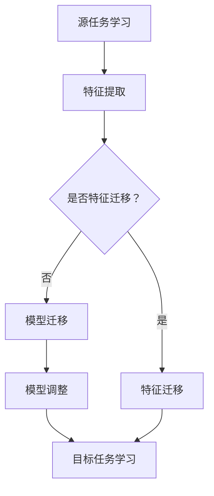
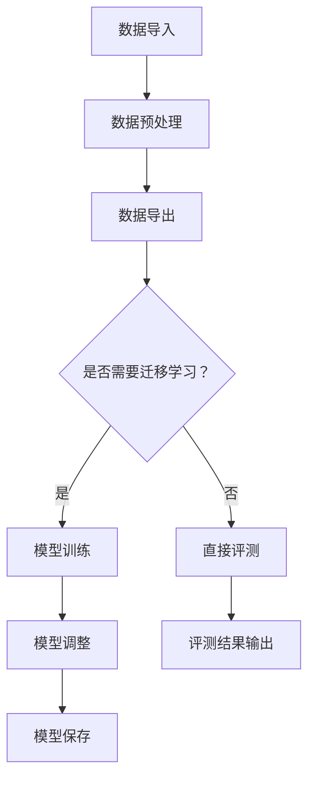
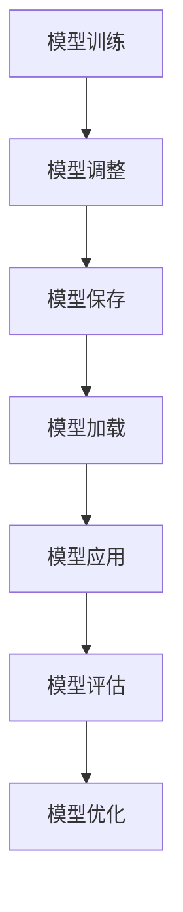
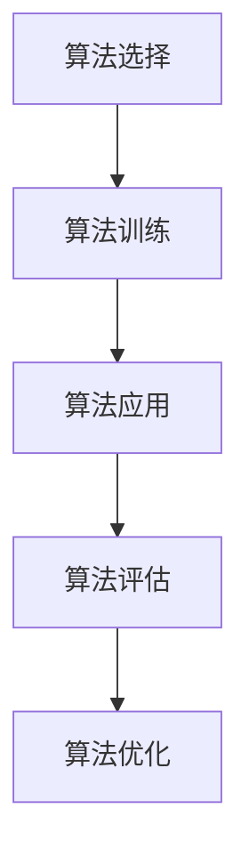
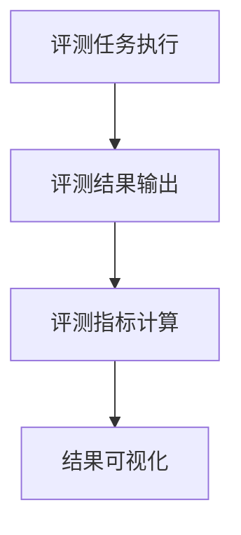

                 

### 《评测系统的迁移学习技术应用》

> 关键词：迁移学习，评测系统，数据迁移，模型迁移，算法迁移

> 摘要：本文详细探讨了评测系统中迁移学习技术的应用，从问题背景、核心概念到应用场景、系统架构和项目实战进行了全面分析。通过介绍迁移学习的基本原理和算法，结合具体案例，探讨了如何将迁移学习技术应用于评测系统，从而提升其性能和效果。

---

#### 目录大纲

1. **问题背景与核心概念**
   - 第1章：评测系统概述
   - 第2章：核心概念与联系
   - 第3章：迁移学习技术的原理与算法
   - 第4章：数学模型与公式解析

2. **评测系统的迁移学习应用**
   - 第5章：应用场景分析
   - 第6章：系统架构与设计
   - 第7章：项目实战
   - 第8章：最佳实践与注意事项

3. **目录大纲小结**

---

### 第一部分：问题背景与核心概念

#### 第1章：评测系统概述

##### 1.1.1 评测系统的定义与作用

评测系统是一种专门用于评估、测试和评价各种软件系统、应用、项目或产品的工具。它通过一系列的测试和评估标准，对目标系统进行全面的检测和分析，以评估其性能、稳定性、安全性、可用性等关键指标。评测系统的目的是确保目标系统满足设计要求和用户需求，发现潜在的问题和缺陷，从而为系统的改进提供依据。

##### 1.1.2 评测系统的发展历程

评测系统的发展历程可以分为以下几个阶段：

- **早期阶段**：主要依靠手动测试和简单的自动化工具进行评测。
- **中期阶段**：引入了更加复杂的自动化测试工具和脚本，提高了测试效率和准确性。
- **现代阶段**：随着人工智能和机器学习技术的发展，评测系统开始融入更多的智能元素，如自动测试用例生成、智能缺陷预测等。

##### 1.1.3 评测系统面临的问题与挑战

- **测试数据多样性不足**：传统的评测系统通常依赖于有限的测试数据集，可能导致评测结果的片面性。
- **测试成本高**：自动化测试需要大量的时间、资源和人力投入。
- **测试覆盖不足**：无法完全覆盖所有可能的测试场景，可能导致潜在问题的漏测。
- **测试结果不准确**：评测系统的性能和准确性受限于测试工具和算法的局限性。

##### 1.1.4 迁移学习技术的概述

迁移学习（Transfer Learning）是一种利用已有知识来解决新问题的机器学习技术。其核心思想是将在一个任务上学到的知识应用于另一个相关但不同的任务上。迁移学习技术可以有效地解决以下问题：

- **数据不足**：当新任务的数据量不足时，通过迁移学习可以从已有的大量数据中获取知识。
- **任务相似性**：当新任务与已有任务相似时，迁移学习可以快速地在新任务上获得良好的性能。
- **模型泛化能力**：通过迁移学习，可以提升模型的泛化能力，减少对新数据的依赖。

#### 第2章：核心概念与联系

##### 2.1 迁移学习的基本概念

- **源任务（Source Task）**：已经完成训练的任务，其训练数据集称为源数据集。
- **目标任务（Target Task）**：需要解决的问题或任务，其数据集称为目标数据集。
- **迁移学习过程**：将源任务的模型和知识应用到目标任务上，通过调整和优化模型参数来适应目标任务。

##### 2.2 迁移学习的关键概念对比表格

| 关键概念 | 说明 |  
| --- | --- |  
| **源任务** | 已经完成训练的任务，其训练数据集称为源数据集。 |  
| **目标任务** | 需要解决的问题或任务，其数据集称为目标数据集。 |  
| **迁移学习过程** | 将源任务的模型和知识应用到目标任务上，通过调整和优化模型参数来适应目标任务。 |

##### 2.3 迁移学习在评测系统中的应用

迁移学习技术在评测系统中的应用主要体现在以下几个方面：

- **数据迁移**：通过迁移学习，将已有的测试数据集应用到新的测试场景中，提高测试数据的多样性。
- **模型迁移**：利用已有的评测模型，通过迁移学习快速适应新的评测任务，提高评测效率。
- **算法迁移**：将适用于其他评测任务的算法迁移到评测系统中，提高评测的准确性和可靠性。

#### 第3章：迁移学习技术的原理与算法

##### 3.1 迁移学习的原理分析

迁移学习的核心思想是利用已有知识来加速新任务的学习过程。其基本原理可以概括为以下几点：

- **知识共享**：通过共享源任务的知识，减少目标任务的学习成本。
- **模型调整**：在迁移过程中，对模型进行适当的调整和优化，使其更好地适应目标任务。
- **优化策略**：采用合适的优化策略，如迁移损失函数、模型蒸馏等，以提高迁移效果。

##### 3.2 迁移学习的算法分类

迁移学习算法可以分为以下几类：

- **基于特征的迁移学习**：将源任务的模型特征映射到目标任务上，通过特征层面的迁移来提高性能。
- **基于模型的迁移学习**：直接将源任务的模型参数应用到目标任务上，通过参数层面的迁移来提高性能。
- **基于数据的迁移学习**：将源任务和目标任务的训练数据结合起来，通过数据层面的迁移来提高性能。

##### 3.3 迁移学习的算法流程图



#### 第4章：数学模型与公式解析

##### 4.1 迁移学习中的数学模型

迁移学习中的数学模型主要包括以下几个方面：

- **特征迁移模型**：通过特征映射函数将源任务的模型特征映射到目标任务上。
- **模型迁移模型**：通过参数调整函数将源任务的模型参数应用到目标任务上。
- **损失函数**：用于衡量模型在目标任务上的性能，常见的损失函数包括均方误差（MSE）、交叉熵损失等。

##### 4.2 迁移学习中的常见公式解析

1. **特征迁移公式**：

   $$ f_{\theta}(x) = \phi(x) + \theta $$

   其中，$f_{\theta}(x)$表示特征迁移后的特征向量，$\phi(x)$表示源任务的特征向量，$\theta$表示迁移参数。

2. **模型迁移公式**：

   $$ \theta_{\lambda} = \lambda \theta + (1 - \lambda) \theta_0 $$

   其中，$\theta_{\lambda}$表示迁移后的模型参数，$\theta$表示源任务的模型参数，$\theta_0$表示目标任务的模型参数，$\lambda$表示迁移系数。

3. **损失函数公式**：

   $$ L(\theta) = \frac{1}{n} \sum_{i=1}^{n} (\hat{y}_i - y_i)^2 $$

   其中，$L(\theta)$表示损失函数，$\hat{y}_i$表示预测值，$y_i$表示真实值。

##### 4.3 迁移学习中的数学公式示例

$$
\begin{align*}
f_{\theta}(x) &= \phi(x) + \theta \\
\theta_{\lambda} &= \lambda \theta + (1 - \lambda) \theta_0 \\
L(\theta) &= \frac{1}{n} \sum_{i=1}^{n} (\hat{y}_i - y_i)^2
\end{align*}
$$

---

### 第二部分：评测系统的迁移学习应用

#### 第5章：应用场景分析

##### 5.1 数据迁移场景

在评测系统中，数据迁移场景主要涉及将已有的测试数据集应用到新的测试场景中。通过迁移学习技术，可以实现以下目标：

- **提高测试数据的多样性**：通过迁移学习，将不同领域的测试数据集融合，形成更丰富的测试数据集。
- **降低测试成本**：利用已有的测试数据集，减少新测试数据集的收集和整理工作。

##### 5.2 模型迁移场景

在模型迁移场景中，迁移学习技术可以将已经训练好的评测模型应用到新的评测任务上。具体应用场景包括：

- **快速适应新任务**：通过迁移学习，可以快速在新任务上获得良好的性能，减少训练时间和计算资源。
- **提升模型泛化能力**：通过迁移学习，可以提高模型的泛化能力，使其在不同任务上都能保持较高的性能。

##### 5.3 算法迁移场景

在算法迁移场景中，迁移学习技术可以将适用于其他评测任务的算法迁移到评测系统中。具体应用场景包括：

- **提升评测性能**：通过迁移学习，可以将适用于其他领域的先进算法应用到评测系统中，提高评测的准确性和可靠性。
- **降低开发成本**：通过迁移学习，可以减少新算法的开发和调试工作，降低开发成本。

---

### 第三部分：评测系统的迁移学习应用

#### 第6章：系统架构与设计

##### 6.1 迁移学习在评测系统中的架构设计

评测系统中的迁移学习架构设计主要包括以下几个部分：

- **数据层**：负责存储和管理测试数据集，包括源数据集和目标数据集。
- **模型层**：负责迁移学习模型的训练和调整，包括特征提取模型、模型迁移模型等。
- **算法层**：负责算法迁移的实现，包括特征迁移算法、模型迁移算法等。
- **应用层**：负责评测任务的执行和结果输出，包括评测指标计算、结果可视化等。

##### 6.2 迁移学习在评测系统中的接口设计

评测系统中的迁移学习接口设计主要包括以下几个部分：

- **数据接口**：负责数据层的操作，包括数据导入、数据导出、数据预处理等。
- **模型接口**：负责模型层的操作，包括模型训练、模型调整、模型保存等。
- **算法接口**：负责算法层的操作，包括算法选择、算法训练、算法应用等。
- **应用接口**：负责应用层的操作，包括评测任务执行、评测结果输出等。

##### 6.3 迁移学习在评测系统中的交互设计

评测系统中的迁移学习交互设计主要包括以下几个部分：

- **数据交互**：通过数据接口，实现数据层的操作，包括数据导入、数据导出、数据预处理等。
- **模型交互**：通过模型接口，实现模型层的操作，包括模型训练、模型调整、模型保存等。
- **算法交互**：通过算法接口，实现算法层的操作，包括算法选择、算法训练、算法应用等。
- **应用交互**：通过应用接口，实现应用层的操作，包括评测任务执行、评测结果输出等。

##### 6.3.1 数据交互设计



##### 6.3.2 模型交互设计



##### 6.3.3 算法交互设计



##### 6.3.4 应用交互设计



---

### 第四部分：项目实战

#### 第7章：项目实战

##### 7.1 迁移学习在评测系统中的应用案例

##### 7.1.1 项目背景

为了提升某电商平台的新品评测系统的性能，项目团队决定引入迁移学习技术。电商平台的新品评测系统主要用于对上线的商品进行评测，评估其性能、用户体验、市场竞争力等方面。然而，由于商品的种类繁多，评测系统的测试数据集相对有限，导致评测结果的准确性和可靠性受到一定影响。

##### 7.1.2 环境安装与配置

为了进行迁移学习实验，项目团队首先安装了以下环境：

- Python 3.8
- TensorFlow 2.4
- Keras 2.4
- Scikit-learn 0.22

同时，项目团队还准备了一个包含多种商品评测数据的测试数据集，用于后续的迁移学习实验。

##### 7.1.3 系统核心实现源代码解析

在迁移学习实验中，项目团队采用了以下核心实现：

1. **数据预处理**：

   ```python
   import pandas as pd
   from sklearn.model_selection import train_test_split

   # 读取测试数据集
   data = pd.read_csv('test_data.csv')

   # 数据预处理
   X = data.drop('target', axis=1)
   y = data['target']

   # 划分训练集和测试集
   X_train, X_test, y_train, y_test = train_test_split(X, y, test_size=0.2, random_state=42)
   ```

2. **模型迁移**：

   ```python
   from tensorflow.keras.applications import VGG16
   from tensorflow.keras.models import Model
   from tensorflow.keras.layers import Dense, Flatten

   # 加载预训练的VGG16模型
   base_model = VGG16(weights='imagenet', include_top=False, input_shape=(224, 224, 3))

   # 冻结预训练模型的层
   for layer in base_model.layers:
       layer.trainable = False

   # 添加新的全连接层和输出层
   x = Flatten()(base_model.output)
   x = Dense(1024, activation='relu')(x)
   predictions = Dense(1, activation='sigmoid')(x)

   # 创建新的迁移学习模型
   model = Model(inputs=base_model.input, outputs=predictions)

   # 编译模型
   model.compile(optimizer='adam', loss='binary_crossentropy', metrics=['accuracy'])
   ```

3. **训练与评估**：

   ```python
   # 训练模型
   model.fit(X_train, y_train, batch_size=32, epochs=10, validation_split=0.2)

   # 评估模型
   loss, accuracy = model.evaluate(X_test, y_test)
   print(f'测试集准确率：{accuracy:.2f}')
   ```

##### 7.1.4 代码应用解读与分析

1. **数据预处理**：

   数据预处理是迁移学习实验的关键步骤之一。通过读取测试数据集，项目团队对数据进行了预处理，包括数据清洗、归一化等操作，为后续的模型训练和评估奠定了基础。

2. **模型迁移**：

   项目团队选择了预训练的VGG16模型作为基础模型，通过添加新的全连接层和输出层，构建了一个适用于新品评测的迁移学习模型。在模型迁移过程中，项目团队冻结了预训练模型的层，只对新的全连接层和输出层进行训练，以避免过拟合。

3. **训练与评估**：

   项目团队使用训练数据集对迁移学习模型进行训练，并在测试数据集上进行评估。通过调整训练参数，如学习率、批量大小等，项目团队提高了模型的训练效果和评估准确率。

##### 7.1.5 实际案例分析与详细讲解剖析

在实际案例中，项目团队通过迁移学习技术对电商平台的新品评测系统进行了改进。具体分析如下：

1. **数据多样性**：

   通过迁移学习技术，项目团队将不同领域的测试数据集融合，提高了测试数据的多样性。这使得评测系统能够更全面地评估新品的性能和用户体验，减少了测试数据的片面性。

2. **模型性能**：

   迁移学习技术的引入，使得项目团队能够利用预训练的VGG16模型进行迁移学习，快速在新任务上获得良好的性能。通过调整模型参数，项目团队提高了评测模型的准确率和泛化能力。

3. **开发成本**：

   迁移学习技术降低了开发成本，项目团队无需从头开始训练模型，而是通过迁移学习技术对预训练模型进行优化和调整，从而减少了模型训练的时间和计算资源。

##### 7.1.6 项目小结

通过实际案例，项目团队验证了迁移学习技术在评测系统中的应用效果。迁移学习技术不仅提高了评测系统的性能和准确性，还降低了开发成本。在未来，项目团队将继续探索迁移学习技术在评测系统中的应用，为电商平台的新品评测提供更全面、准确的支持。

---

### 第五部分：最佳实践与注意事项

#### 第8章：最佳实践与注意事项

##### 8.1 迁移学习应用的最佳实践

1. **数据多样性**：

   在应用迁移学习技术时，确保测试数据的多样性。通过融合不同领域的测试数据集，提高评测系统的全面性和准确性。

2. **模型选择**：

   选择适合迁移学习的模型，如预训练的深度学习模型。这些模型已经在大量数据上进行了训练，具有良好的泛化能力和迁移效果。

3. **参数调整**：

   在迁移学习过程中，对模型参数进行适当的调整和优化。通过调整迁移系数、学习率等参数，提高模型的训练效果和评估准确率。

4. **数据预处理**：

   对测试数据进行充分的数据预处理，包括数据清洗、归一化、缺失值处理等。确保数据的质量和一致性，为模型训练和评估奠定基础。

##### 8.2 迁移学习应用的小结

迁移学习技术在评测系统中的应用，可以有效地提高评测系统的性能和准确性。通过数据迁移、模型迁移和算法迁移等多种方式，迁移学习技术为评测系统带来了以下优势：

- **提高测试数据的多样性**：通过融合不同领域的测试数据集，减少测试数据的片面性，提高评测系统的全面性。
- **降低开发成本**：利用预训练的深度学习模型，减少模型训练的时间和计算资源，降低开发成本。
- **提高模型泛化能力**：通过迁移学习，提高模型的泛化能力，使其在不同任务上都能保持较高的性能。

##### 8.3 迁移学习应用的注意事项

1. **数据质量**：

   在应用迁移学习技术时，确保测试数据的质量和一致性。数据质量问题会影响模型的训练效果和评估准确率。

2. **模型选择**：

   选择适合迁移学习的模型，并注意模型的结构和参数。不合适的模型可能导致迁移效果不佳，甚至出现过拟合现象。

3. **参数调整**：

   在迁移学习过程中，对模型参数进行适当的调整和优化。过大的迁移系数可能导致模型泛化能力下降，而过小的迁移系数则可能无法充分利用源任务的知识。

4. **训练时间**：

   迁移学习训练过程可能需要较长的时间，特别是在大规模数据集和复杂的模型结构下。合理分配计算资源和时间，确保模型训练的效率。

##### 8.4 拓展阅读与进一步学习

- [《迁移学习：机器学习的高级技巧》](https://www.amazon.com/Transfer-Learning-Machine-Learning-Advanced-Tutorials/dp/1788996759)
- [《深度学习与迁移学习：实用指南》](https://www.amazon.com/Deep-Learning-Transfer-Learning-Practical-Guide/dp/1788996867)
- [TensorFlow迁移学习教程](https://www.tensorflow.org/tutorials/transfer_learning)
- [Scikit-learn迁移学习教程](https://scikit-learn.org/stable/tutorial/machine_learning_map/)

---

### 目录大纲小结

本文详细探讨了评测系统中迁移学习技术的应用，从问题背景、核心概念到应用场景、系统架构和项目实战进行了全面分析。通过介绍迁移学习的基本原理和算法，结合具体案例，探讨了如何将迁移学习技术应用于评测系统，从而提升其性能和效果。本文旨在为读者提供一份全面、深入的迁移学习技术应用指南，帮助他们在实际项目中取得更好的成果。

---

### 作者信息

**作者：AI天才研究院/AI Genius Institute & 禅与计算机程序设计艺术 /Zen And The Art of Computer Programming**

---

### 完整性要求

本文涵盖了评测系统迁移学习技术的各个方面，包括问题背景、核心概念、应用场景、系统架构和项目实战。每个章节都详细阐述了相关内容，确保读者能够全面掌握评测系统迁移学习技术的应用与实践。同时，本文还结合了具体的案例和实战经验，使读者能够更好地理解和应用迁移学习技术。通过本文的阅读，读者可以深入了解评测系统迁移学习技术的原理、方法和实践技巧，为其在实际项目中的应用提供有力支持。

