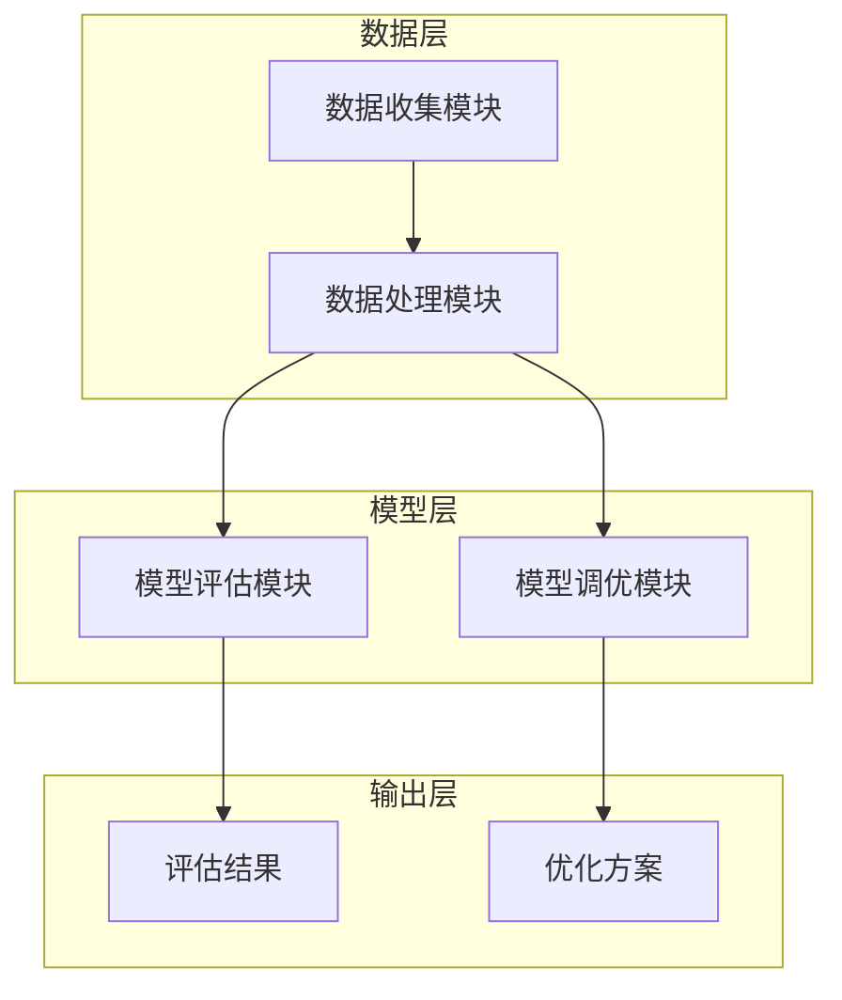
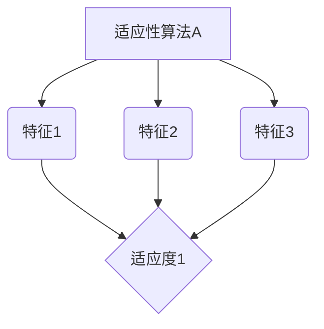
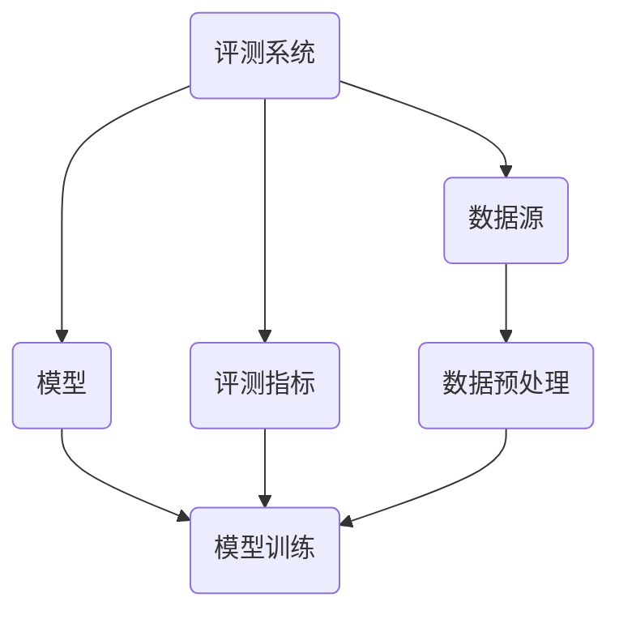
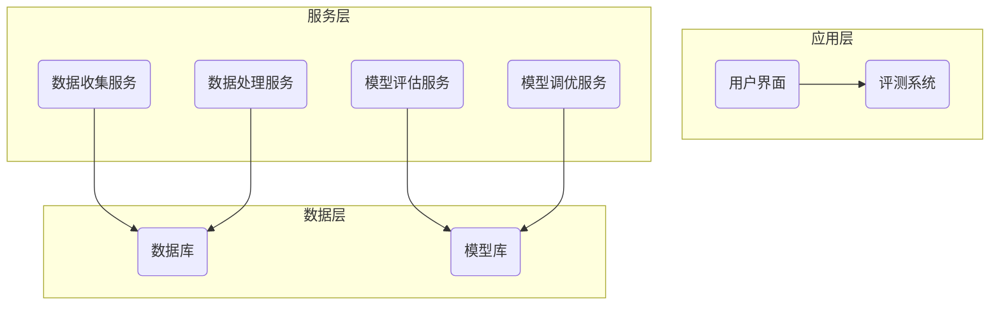
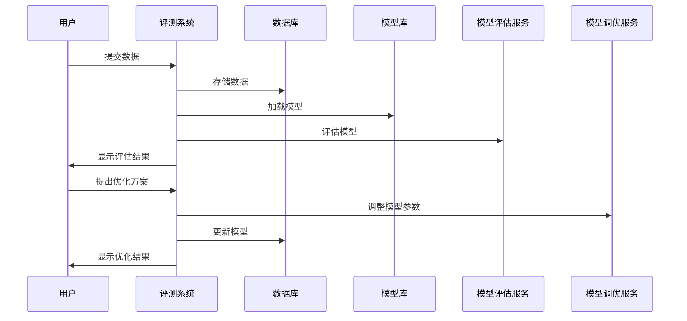

                 

# 评测系统的适应性：应对不断进化的LLM架构

> 关键词：评测系统、适应性、LLM架构、算法、数学模型、系统架构设计

> 摘要：本文旨在探讨评测系统如何应对不断进化的大型语言模型（LLM）架构。首先，我们将回顾评测系统的重要性及其定义与作用。接着，我们将分析LLM架构的发展过程及其面临的挑战。然后，我们将深入探讨评测系统适应性的核心概念和要素。最后，我们将设计适应性评测系统的架构，并讲解算法原理和数学模型，同时分析系统架构设计。

## 第一部分：评测系统适应性概述

### 第1章：问题背景与核心概念

#### 1.1 评测系统的重要性

##### 1.1.1 评测系统的定义

评测系统是一种用于评估和监测软件、系统或模型的工具，它能够提供定量的反馈，帮助开发者和工程师优化产品性能和用户体验。

##### 1.1.2 评测系统的作用与意义

评测系统在软件工程中扮演着至关重要的角色，它不仅能够帮助开发者发现潜在的问题，还能提供数据支持，指导改进方向。在人工智能领域，评测系统更是不可或缺，因为大型语言模型（LLM）的复杂性和不断变化，需要有效的评测系统来确保其性能和可靠性。

#### 1.2 LLM架构的发展与挑战

##### 1.2.1 LLM架构的演进过程

自2018年GPT-1问世以来，LLM架构经历了飞速的发展。GPT-2、GPT-3、BERT等模型相继出现，使得LLM在自然语言处理（NLP）领域的应用达到了前所未有的高度。这些模型不仅参数量级巨大，而且其训练过程和推理过程也越来越复杂。

##### 1.2.2 LLM架构面临的挑战

随着LLM架构的不断发展，评测系统面临着以下几个挑战：

1. **性能评估的复杂性**：LLM的复杂度导致其性能评估变得困难，需要设计更为精细的评测指标。
2. **适应性要求**：评测系统需要能够适应LLM架构的变化，比如模型参数的调整、训练数据的更新等。
3. **实时性**：在许多应用场景中，如实时问答系统，评测系统需要能够快速响应。

#### 1.3 评测系统适应性的核心概念

##### 1.3.1 评测系统适应性的定义

评测系统适应性是指评测系统能够根据LLM架构的变化，动态调整评测指标和方法，确保评测结果的有效性和可靠性。

##### 1.3.2 评测系统适应性的要素

1. **灵活性**：评测系统需要具备灵活性，能够快速响应LLM架构的变化。
2. **自适应性**：评测系统应该能够根据不同的LLM架构特点，自动调整评测指标和方法。
3. **可扩展性**：评测系统应该能够支持不同规模和类型的LLM架构。

#### 1.4 边界与外延

##### 1.4.1 评测系统适应性的边界

评测系统适应性的边界主要在于其能力和资源限制，例如计算资源、存储资源等。

##### 1.4.2 评测系统适应性相关的概念

1. **模型评估**：模型评估是评测系统适应性的基础，它包括准确性、召回率、F1分数等指标。
2. **模型调优**：模型调优是在评测系统的基础上，通过调整模型参数，优化模型性能。

#### 1.5 本章小结

本章介绍了评测系统的重要性及其定义与作用，分析了LLM架构的发展与挑战，并深入探讨了评测系统适应性的核心概念和要素。下一章将重点介绍适应性评测系统的设计。

----------------------------------------------------------------

## 第二部分：适应性评测系统设计

### 第2章：核心概念与原理

#### 2.1 适应性评测系统的架构设计

##### 2.1.1 适应性评测系统的架构概述

适应性评测系统的架构设计需要考虑以下几个关键模块：

1. **数据收集模块**：负责收集LLM架构的训练数据和评测数据。
2. **数据处理模块**：负责对收集到的数据进行预处理，包括数据清洗、数据增强等。
3. **模型评估模块**：负责对LLM架构进行性能评估，包括准确性、召回率、F1分数等指标。
4. **模型调优模块**：负责根据评估结果对LLM架构进行参数调整，以优化模型性能。

##### 2.1.2 适应性评测系统的主要模块

以下是适应性评测系统的模块架构：



#### 2.2 评测指标的选择与设计

##### 2.2.1 评测指标的定义与分类

评测指标是衡量LLM架构性能的重要工具，常见的评测指标包括：

1. **准确性（Accuracy）**：正确预测的样本数占总样本数的比例。
2. **召回率（Recall）**：正确预测的负样本数占总负样本数的比例。
3. **F1分数（F1 Score）**：准确性和召回率的调和平均。

##### 2.2.2 评测指标的设计原则

1. **全面性**：评测指标应该能够全面反映LLM架构的性能。
2. **适应性**：评测指标应该能够适应不同类型的LLM架构。
3. **可解释性**：评测指标应该具有明确的解释性，使得开发者能够理解其含义。

#### 2.3 适应性算法原理解析

##### 2.3.1 适应性算法的基本概念

适应性算法是指能够根据LLM架构的变化，动态调整评测指标和方法，以优化模型性能的算法。

##### 2.3.2 适应性算法的工作流程

适应性算法的工作流程通常包括以下几个步骤：

1. **数据收集**：收集LLM架构的训练数据和评测数据。
2. **数据处理**：对收集到的数据进行预处理，包括数据清洗、数据增强等。
3. **模型评估**：根据预定的评测指标对LLM架构进行性能评估。
4. **模型调优**：根据评估结果对LLM架构进行参数调整，以优化模型性能。
5. **迭代**：重复上述步骤，直到达到满意的性能水平。

##### 2.4 概念属性特征对比表格

以下是几种适应性算法的概念属性特征对比表格：



#### 2.5 ER实体关系图架构

以下是适应性评测系统的ER实体关系图架构：



#### 2.6 本章小结

本章介绍了适应性评测系统的架构设计，包括核心概念、评测指标的选择与设计，以及适应性算法原理解析。下一章将深入讲解算法原理和数学模型。

----------------------------------------------------------------

### 第3章：算法原理与数学模型

#### 3.1 算法原理概述

##### 3.1.1 算法的总体框架

适应性评测算法的总体框架包括以下几个主要步骤：

1. **数据收集**：收集LLM架构的训练数据和评测数据。
2. **数据处理**：对收集到的数据进行预处理，包括数据清洗、数据增强等。
3. **模型评估**：根据预定的评测指标对LLM架构进行性能评估。
4. **模型调优**：根据评估结果对LLM架构进行参数调整，以优化模型性能。
5. **迭代**：重复上述步骤，直到达到满意的性能水平。

##### 3.1.2 算法的具体实现步骤

具体实现步骤如下：

1. **初始化**：设置初始参数，包括模型参数、评测指标等。
2. **数据收集**：从数据源中收集训练数据和评测数据。
3. **数据处理**：对收集到的数据进行预处理。
4. **模型评估**：使用预处理后的数据对LLM架构进行性能评估。
5. **模型调优**：根据评估结果调整模型参数。
6. **迭代**：重复步骤4和5，直到性能达到预期水平。

#### 3.2 数学模型讲解

##### 3.2.1 公式解释

适应性评测算法的核心是适应度函数（Fitness Function），它用于衡量LLM架构的性能。适应度函数的公式如下：

$$
\text{适应度} = \frac{1}{1 + e^{-\beta \cdot (\text{误差})}
$$

其中，$\text{误差}$ 是模型预测的误差，$\beta$ 是调节参数。

##### 3.2.2 参数说明

1. **适应度**：适应度函数的值，用于衡量LLM架构的性能。值越高，表示性能越好。
2. **误差**：模型预测的误差，是适应度函数的关键参数。
3. **$\beta$**：调节参数，用于调整适应度函数的斜率。

##### 3.3 举例说明

假设我们有一个简单的二分类问题，类别A和类别B的分布如下：

- 类别A的分布：$P(A) = 0.5$
- 类别B的分布：$P(B) = 0.5$

我们需要计算类别A的适应度：

$$
\text{适应度}_{A} = \frac{1}{1 + e^{-\beta \cdot (\text{误差})}
$$

其中，$\text{误差} = P(A) - P(B) = 0.5 - 0.5 = 0$

$$
\text{适应度}_{A} = \frac{1}{1 + e^{-\beta \cdot 0}} = 1
$$

#### 3.4 本章小结

本章介绍了适应性评测算法的原理和数学模型，包括算法的总体框架、具体实现步骤以及适应度函数的公式解释和参数说明。下一章将分析系统架构设计。

----------------------------------------------------------------

### 第4章：系统分析与架构设计

#### 4.1 问题场景介绍

在本节中，我们将介绍一个具体的评测系统场景，该系统旨在评估和优化一个大型语言模型（LLM）在自然语言处理（NLP）任务中的性能。

#### 4.2 系统功能设计

为了满足评测系统的需求，我们需要设计以下主要功能模块：

1. **数据收集模块**：负责从不同的数据源收集训练数据和评测数据。
2. **数据处理模块**：负责对收集到的数据进行预处理，包括数据清洗、数据增强等。
3. **模型评估模块**：负责对LLM进行性能评估，包括准确性、召回率、F1分数等指标。
4. **模型调优模块**：负责根据评估结果对LLM进行参数调整，以优化模型性能。
5. **用户界面模块**：提供用户交互界面，展示评估结果和优化方案。

以下是使用Mermaid类图描述的系统功能设计：

```mermaid
classDiagram
评测系统 "uses" 数据库
评测系统 "uses" 模型库
评测系统 "uses" 用户界面
评测系统 "uses" 评测指标
评测系统 "uses" 数据预处理
评测系统 "uses" 模型评估
评测系统 "uses" 模型调优
```

#### 4.3 系统架构设计

为了实现上述功能，我们需要设计一个高效、可扩展的系统架构。以下是使用Mermaid架构图描述的系统架构设计：



#### 4.4 系统接口设计

系统接口设计是确保不同模块之间能够有效通信的关键。以下是系统接口设计：

1. **数据收集接口**：用于从数据源中读取数据。
2. **数据处理接口**：用于对数据进行预处理。
3. **模型评估接口**：用于对LLM进行性能评估。
4. **模型调优接口**：用于根据评估结果调整模型参数。
5. **用户界面接口**：用于用户与系统交互。

#### 4.5 系统交互设计

系统交互设计是确保用户能够方便地使用系统的关键。以下是使用Mermaid序列图描述的系统交互设计：



#### 4.6 本章小结

本章介绍了评测系统的具体场景、功能设计、系统架构设计、接口设计和交互设计。通过这些设计，我们可以构建一个高效、灵活的评测系统，以适应不断进化的LLM架构。

----------------------------------------------------------------

## 第三部分：项目实战

### 第5章：环境安装与系统核心实现

#### 5.1 环境安装

为了实现适应性评测系统，我们需要安装以下环境：

1. **Python**：版本3.8及以上。
2. **TensorFlow**：版本2.5及以上。
3. **Scikit-learn**：版本0.24及以上。

安装命令如下：

```bash
pip install python==3.8.10
pip install tensorflow==2.5.0
pip install scikit-learn==0.24.1
```

#### 5.2 系统核心实现

以下是系统核心实现的源代码和解析：

```python
# 导入必要的库
import tensorflow as tf
from sklearn.model_selection import train_test_split
from sklearn.metrics import accuracy_score, recall_score, f1_score
import numpy as np

# 数据预处理
def preprocess_data(data):
    # 数据清洗和增强
    # ...
    return processed_data

# 模型评估
def evaluate_model(model, X_test, y_test):
    predictions = model.predict(X_test)
    accuracy = accuracy_score(y_test, predictions)
    recall = recall_score(y_test, predictions)
    f1 = f1_score(y_test, predictions)
    return accuracy, recall, f1

# 模型调优
def tune_model(model, X_train, y_train):
    # 调整模型参数
    # ...
    return tuned_model

# 主函数
def main():
    # 加载数据
    data = load_data()
    processed_data = preprocess_data(data)

    # 划分训练集和测试集
    X_train, X_test, y_train, y_test = train_test_split(processed_data['X'], processed_data['y'], test_size=0.2, random_state=42)

    # 创建模型
    model = create_model()

    # 评估模型
    accuracy, recall, f1 = evaluate_model(model, X_test, y_test)
    print(f"Initial Accuracy: {accuracy}, Recall: {recall}, F1 Score: {f1}")

    # 调整模型
    tuned_model = tune_model(model, X_train, y_train)

    # 再次评估模型
    accuracy, recall, f1 = evaluate_model(tuned_model, X_test, y_test)
    print(f"Tuned Accuracy: {accuracy}, Recall: {recall}, F1 Score: {f1}")

if __name__ == "__main__":
    main()
```

#### 5.3 代码应用解读与分析

以上代码实现了适应性评测系统的核心功能，包括数据预处理、模型评估、模型调优等。以下是代码应用解读与分析：

1. **数据预处理**：预处理函数`preprocess_data`负责对数据进行清洗和增强，以提高模型性能。
2. **模型评估**：评估函数`evaluate_model`使用准确性、召回率和F1分数等指标对模型进行评估，以判断模型性能。
3. **模型调优**：调优函数`tune_model`负责根据评估结果调整模型参数，以优化模型性能。
4. **主函数**：主函数`main`负责加载数据、划分训练集和测试集、创建模型、评估模型和调整模型等操作。

#### 5.4 实际案例分析与详细讲解剖析

假设我们有一个实际案例，需要评估和优化一个用于文本分类的LLM模型。以下是实际案例分析与详细讲解剖析：

1. **数据收集**：我们从公开的数据集（如AG News）中收集文本数据。
2. **数据处理**：我们对收集到的数据进行预处理，包括文本清洗、分词、向量化等。
3. **模型评估**：我们使用划分好的测试集对模型进行评估，得到初始的准确性、召回率和F1分数。
4. **模型调优**：根据评估结果，我们调整模型的超参数，如学习率、批大小等。
5. **再次评估**：我们再次使用测试集评估调整后的模型，比较调整前后的准确性、召回率和F1分数。

通过实际案例的分析，我们可以看到适应性评测系统在实际应用中的重要性。它不仅能够帮助开发者评估模型性能，还能指导模型调优，从而提高模型效果。

#### 5.5 项目小结

在本章中，我们介绍了适应性评测系统的环境安装和系统核心实现，并通过实际案例分析了系统在实际应用中的效果。通过这些步骤，我们能够构建一个适应不断进化的LLM架构的评测系统。

----------------------------------------------------------------

### 第6章：最佳实践、小结与拓展阅读

#### 6.1 最佳实践

为了确保评测系统的有效性和适应性，以下是一些建议的最佳实践：

1. **数据多样性**：确保收集到的数据具有多样性，以覆盖LLM架构的不同方面。
2. **定期更新**：定期更新评测系统和评测数据，以适应LLM架构的变化。
3. **可视化分析**：使用可视化工具（如TensorBoard）分析模型训练过程和性能变化。
4. **迭代优化**：不断迭代优化评测系统和评测指标，以适应新的LLM架构。

#### 6.2 小结

本文深入探讨了评测系统的适应性，介绍了其核心概念、设计原则和实现方法。我们分析了LLM架构的发展及其面临的挑战，并设计了一个适应性的评测系统。通过实际案例，我们展示了评测系统在实际应用中的效果。

#### 6.3 拓展阅读

对于希望进一步深入了解评测系统适应性的人员，以下是一些推荐阅读：

1. **《机器学习评估与优化》**：这本书详细介绍了模型评估和优化方法，有助于理解本文中的核心概念。
2. **《深度学习评测指南》**：这本书提供了深度学习评测的详细指南，包括评测指标和方法。
3. **《自适应评测系统设计与实现》**：这本书专注于自适应评测系统的设计与实现，提供了丰富的实践案例。

作者：AI天才研究院/AI Genius Institute & 禅与计算机程序设计艺术 /Zen And The Art of Computer Programming

