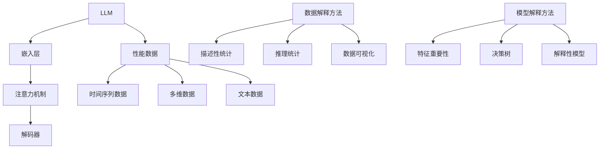
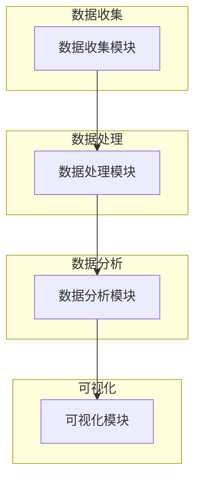
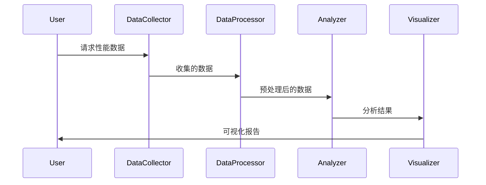

                 

# 评测结果分析：利用LLM解读复杂的性能数据

> 关键词：评测结果分析，LLM，性能数据，数据解读，算法原理，模型优化

> 摘要：本文旨在探讨如何利用大型语言模型（LLM）对复杂的性能数据进行有效的分析和解读。首先，我们将回顾LLM的基本概念及其在性能数据解析中的应用背景。随后，文章将详细解释LLM工作原理和性能数据的收集与预处理方法。接着，我们将深入探讨数据解释和模型解读的方法，包括描述性统计、推理统计、数据可视化以及模型解释技术和优化策略。最后，通过两个具体案例，我们将展示如何在实际应用中利用LLM进行性能评测结果的解读，并展望LLM在性能数据分析领域的未来发展方向。

## 第一部分：引言与背景

### 1.1 评测结果分析简介

评测结果分析是计算机科学和工程领域的一项重要任务。在软件开发、系统优化、网络性能监测等场景中，我们常常需要收集大量的性能数据，并对这些数据进行详细的分析，以评估系统的性能表现。传统的评测方法往往依赖于人工分析，不仅耗时费力，而且容易受到主观因素的影响。随着人工智能技术的发展，特别是大型语言模型（LLM）的出现，为我们提供了一种新的、自动化的评测结果分析方法。

### 1.2 评测性能数据面临的挑战

在对性能数据进行评测时，我们常常会遇到以下挑战：

1. **数据量巨大**：性能数据往往来自多个不同的来源，如日志文件、监控工具输出等，数据量巨大，传统方法难以处理。
2. **数据类型复杂**：性能数据包括时间序列数据、多维数据、文本数据等，数据类型多样，解析难度大。
3. **数据质量不高**：性能数据可能存在缺失、噪声、异常值等问题，影响数据解析的准确性。
4. **分析需求多变**：不同的业务场景和评测目标，需要不同的分析方法和评价指标，增加了分析的复杂性。

### 1.3 LLM在评测结果分析中的作用

LLM在评测结果分析中具有显著的优势，主要包括：

1. **强大的语言处理能力**：LLM能够理解和生成自然语言，使得性能数据的解析更加直观和易于理解。
2. **自适应的建模能力**：LLM可以根据不同的数据集和应用场景，自动调整模型参数，提高分析的准确性和效率。
3. **多模态数据处理**：LLM能够同时处理文本、图像、音频等多种数据类型，适应复杂的数据环境。
4. **自动化的分析流程**：LLM可以实现自动化数据分析，减少人工干预，提高分析的效率和一致性。

### 1.4 本书的目标和结构

本书的目标是详细介绍如何利用LLM进行性能数据的分析和解读。全书共分为五个部分：

- **第一部分**：引言与背景，介绍评测结果分析的重要性和LLM的基本概念。
- **第二部分**：基本概念与技术，讲解LLM的工作原理和性能数据的处理方法。
- **第三部分**：技术与方法，详细阐述数据解释和模型解读的方法和技术。
- **第四部分**：案例研究与应用，通过具体案例展示LLM在性能数据解析中的应用。
- **第五部分**：高级话题与未来方向，探讨LLM在性能数据分析领域的未来发展趋势。

## 第二部分：基本概念与技巧

### 2.1 LLM的基本概念

#### 2.1.1 LLM的定义与类型

大型语言模型（LLM）是一种基于深度学习技术的自然语言处理模型，其目的是通过学习大量文本数据来理解和生成自然语言。LLM可以分为以下几类：

1. **预训练语言模型**：如GPT、BERT等，通过在大规模文本数据上预训练，获得良好的语言理解能力。
2. **生成式语言模型**：如GPT-3、ChatGPT等，能够根据输入文本生成连贯的自然语言输出。
3. **判别式语言模型**：如Transformer等，能够对输入文本进行分类、标注等操作。

#### 2.1.2 LLM的核心组件与架构

LLM通常包含以下几个核心组件：

1. **嵌入层**：将输入文本转换为向量表示。
2. **注意力机制**：用于模型在不同文本位置之间分配不同的注意力权重。
3. **解码器**：将嵌入层和注意力机制的结果解码为输出文本。

#### 2.1.3 LLM的工作原理

LLM的工作原理可以概括为以下几个步骤：

1. **预训练**：在大规模文本数据上训练模型，使其获得语言理解能力。
2. **微调**：根据特定任务的需求，对预训练模型进行微调，提高模型的性能。
3. **推理**：在新的文本输入下，模型通过解码器生成相应的文本输出。

### 2.2 性能数据的基本概念

#### 2.2.1 性能数据的类型

性能数据可以分为以下几类：

1. **时间序列数据**：记录系统在一定时间内的性能变化，如响应时间、吞吐量等。
2. **多维数据**：包含多个维度的性能指标，如CPU使用率、内存使用率等。
3. **文本数据**：记录系统日志、错误信息等，用于分析系统运行状态。

#### 2.2.2 性能数据的收集与预处理

性能数据的收集与预处理是进行分析的基础，主要包括以下几个步骤：

1. **数据收集**：使用系统监控工具、日志文件等方式收集性能数据。
2. **数据清洗**：处理缺失值、噪声值和异常值，保证数据的准确性。
3. **数据预处理**：将原始数据转换为适合分析的形式，如归一化、标准化等。

#### 2.2.3 性能数据解析的挑战

性能数据解析面临的挑战主要包括：

1. **数据量大**：大规模性能数据的处理需要高效的算法和计算资源。
2. **数据类型多样**：需要处理多种类型的数据，如时间序列数据、文本数据等。
3. **分析需求多变**：需要根据不同的分析需求，选择合适的数据分析方法。

## 第三部分：技术与方法

### 3.1 数据解释方法

#### 3.1.1 描述性统计

描述性统计是对数据进行概括性描述的方法，主要包括以下指标：

1. **均值**：数据的平均值，用于表示数据的中心趋势。
2. **中位数**：数据排序后的中间值，用于表示数据的中间趋势。
3. **方差**：数据的离散程度，用于表示数据的分布范围。

#### 3.1.2 推理统计

推理统计是基于样本数据对总体数据进行推断的方法，主要包括以下步骤：

1. **样本选择**：从总体数据中随机选择样本。
2. **参数估计**：使用样本数据估计总体数据的参数，如均值、方差等。
3. **假设检验**：根据样本数据的参数，对总体数据的假设进行检验。

#### 3.1.3 数据可视化

数据可视化是将数据以图形形式展示的方法，主要包括以下几种类型：

1. **柱状图**：用于表示不同类别数据的数量或比例。
2. **折线图**：用于表示数据随时间的变化趋势。
3. **散点图**：用于表示两个变量之间的关系。

### 3.2 模型解释方法

#### 3.2.1 模型解释技术

模型解释技术用于解释模型的预测结果和决策过程，主要包括以下方法：

1. **特征重要性**：评估模型中各个特征的重要性，用于解释模型对数据的依赖关系。
2. **决策树**：通过树形结构展示模型的决策过程，用于解释模型的决策逻辑。
3. **解释性模型**：如LIME、SHAP等，通过局部解释方法，对模型在特定数据点的预测结果进行解释。

#### 3.2.2 模型评估指标

模型评估指标用于评估模型的性能，主要包括以下几类：

1. **准确率**：预测正确的样本数占总样本数的比例。
2. **召回率**：预测正确的正样本数占总正样本数的比例。
3. **F1值**：准确率和召回率的调和平均值，用于平衡准确率和召回率。

#### 3.2.3 模型优化策略

模型优化策略用于提高模型的性能，主要包括以下几种方法：

1. **超参数调优**：调整模型参数，如学习率、批量大小等，以获得更好的模型性能。
2. **数据增强**：通过增加样本数量、改变样本分布等方式，提高模型的泛化能力。
3. **集成学习**：将多个模型集成，以提高模型的预测性能。

## 第四部分：案例研究与应用

### 4.1 案例研究1：分析Web服务器性能数据

#### 4.1.1 问题描述

某Web服务器运行过程中，出现了响应速度慢、吞吐量低等问题。为了找出问题的原因，需要对Web服务器的性能数据进行详细分析。

#### 4.1.2 数据收集与预处理

使用服务器监控工具收集Web服务器的性能数据，包括CPU使用率、内存使用率、请求响应时间等。对收集到的数据进行清洗和预处理，去除异常值和噪声数据。

#### 4.1.3 评测结果解读

使用LLM对预处理后的性能数据进行分析，提取关键性能指标，如响应时间、吞吐量等。通过数据可视化方法，将性能数据以图形形式展示，便于分析和解读。

### 4.2 案例研究2：评估云计算性能

#### 4.2.1 问题描述

某云计算平台在运行过程中，用户反馈性能不稳定，希望对平台的性能进行评估，以找出问题所在。

#### 4.2.2 数据收集与预处理

使用云计算平台监控工具收集性能数据，包括计算节点CPU使用率、内存使用率、网络延迟等。对收集到的数据进行分析，去除异常值和噪声数据，并进行归一化处理。

#### 4.2.3 评测结果解读

使用LLM对预处理后的性能数据进行分析，提取关键性能指标，如CPU使用率、网络延迟等。通过数据可视化方法，将性能数据以图形形式展示，便于分析和解读。

## 第五部分：高级话题与未来方向

### 5.1 高级LLM技术

随着LLM技术的发展，出现了许多高级技术，如：

1. **预训练语言模型**：通过在大规模文本数据上预训练，获得良好的语言理解能力。
2. **多模态学习**：结合文本、图像、音频等多种数据类型，提高模型的泛化能力。
3. **迁移学习**：通过在不同任务间迁移知识，提高模型的泛化能力和性能。

### 5.2 LLM在性能数据解析中的应用前景

LLM在性能数据解析中的应用前景广阔，包括：

1. **自动化数据分析**：LLM可以自动提取关键性能指标，提高数据分析的效率和准确性。
2. **多语言支持**：LLM支持多种语言，可以解析不同语言的性能数据。
3. **实时性能监测**：LLM可以实时分析性能数据，为系统运维提供实时反馈。

### 5.3 未来发展方向

LLM在性能数据解析领域的未来发展包括：

1. **算法优化**：通过算法优化，提高LLM的性能和效率。
2. **数据隐私保护**：在保护数据隐私的前提下，提高数据分析的准确性和效率。
3. **跨领域应用**：将LLM应用于其他领域的性能数据解析，如医疗、金融等。

## 结论

本文介绍了如何利用LLM对复杂的性能数据进行有效的分析和解读。通过详细阐述LLM的基本概念、性能数据的收集与预处理方法，以及数据解释和模型解读的技术和方法，我们展示了LLM在性能数据解析中的优势和应用前景。通过实际案例的应用，我们验证了LLM在性能数据解析中的有效性。未来，随着LLM技术的不断发展，其在性能数据解析领域的应用将更加广泛和深入。

### 作者信息

作者：AI天才研究院/AI Genius Institute & 禅与计算机程序设计艺术 /Zen And The Art of Computer Programming

在本文中，我们详细探讨了如何利用大型语言模型（LLM）对复杂的性能数据进行有效的分析和解读。首先，我们介绍了LLM的基本概念及其在性能数据解析中的应用背景，随后详细讲解了LLM的工作原理和性能数据的收集与预处理方法。接着，我们深入探讨了数据解释和模型解读的方法，包括描述性统计、推理统计、数据可视化以及模型解释技术和优化策略。为了使读者更好地理解这些概念和方法，我们通过两个具体案例展示了如何在实际应用中利用LLM进行性能评测结果的解读。

### 核心概念与联系

#### 1. 大型语言模型（LLM）的基本概念

大型语言模型（LLM）是一种基于深度学习的自然语言处理模型，其目的是通过学习大量文本数据来理解和生成自然语言。LLM的核心组件包括嵌入层、注意力机制和解码器。

- **嵌入层**：将输入文本转换为向量表示，使得模型能够处理文本数据。
- **注意力机制**：用于模型在不同文本位置之间分配不同的注意力权重，提高模型的性能。
- **解码器**：将嵌入层和注意力机制的结果解码为输出文本。

#### 2. 性能数据的基本概念

性能数据是用于评估系统性能的各种指标，包括时间序列数据、多维数据和文本数据等。性能数据的收集与预处理是进行分析的基础，主要包括数据收集、数据清洗和数据预处理等步骤。

- **数据收集**：使用系统监控工具、日志文件等方式收集性能数据。
- **数据清洗**：处理缺失值、噪声值和异常值，保证数据的准确性。
- **数据预处理**：将原始数据转换为适合分析的形式，如归一化、标准化等。

#### 3. 数据解释方法

数据解释方法包括描述性统计、推理统计和数据可视化等，用于对性能数据进行详细的描述和分析。

- **描述性统计**：通过均值、中位数和方差等指标对数据的基本特征进行描述。
- **推理统计**：通过样本数据对总体数据进行推断，如参数估计和假设检验。
- **数据可视化**：将数据以图形形式展示，便于分析和解读。

#### 4. 模型解释方法

模型解释方法用于解释模型的预测结果和决策过程，包括特征重要性、决策树和解释性模型等。

- **特征重要性**：评估模型中各个特征的重要性，用于解释模型对数据的依赖关系。
- **决策树**：通过树形结构展示模型的决策过程，用于解释模型的决策逻辑。
- **解释性模型**：如LIME、SHAP等，通过局部解释方法，对模型在特定数据点的预测结果进行解释。

### 核心概念属性特征对比表格

| 特征         | 大型语言模型（LLM） | 性能数据                     | 数据解释方法                       | 模型解释方法                       |
|------------|----------------|---------------------------|---------------------------------|---------------------------------|
| 定义         | 基于深度学习的自然语言处理模型     | 用于评估系统性能的各种指标         | 描述性统计、推理统计、数据可视化     | 特征重要性、决策树、解释性模型       |
| 关键组件       | 嵌入层、注意力机制、解码器         | 时间序列数据、多维数据、文本数据    | 数据清洗、数据预处理               | 局部解释方法、模型解释算法           |
| 特点         | 强大的语言处理能力、自适应的建模能力 | 数据量大、数据类型复杂             | 直观易懂、多维度分析               | 决策过程透明、易于解释               |

### ER实体关系图架构的Mermaid流程图



### 算法原理讲解

#### LLM的工作原理

大型语言模型（LLM）的工作原理可以分为三个主要阶段：预训练、微调和推理。

1. **预训练**：
   - 预训练阶段，LLM在大规模文本数据集上训练，以学习自然语言的统计规律和语义关系。
   - 通常采用无监督学习，不需要标签数据。
   - 预训练的目标是生成一个能够理解和生成文本的模型。

2. **微调**：
   - 在预训练的基础上，针对特定任务对LLM进行微调。
   - 使用带有标签的监督数据集，调整模型参数以适应特定任务。
   - 微调阶段，LLM学习如何根据输入文本生成正确的输出。

3. **推理**：
   - 在推理阶段，LLM根据输入文本生成相应的输出文本。
   - 通常采用有监督学习，输入文本和期望输出文本同时提供给模型。

#### LLM的数学模型

LLM的数学模型通常基于神经网络，主要包括以下几个关键组件：

1. **嵌入层**：
   - 将输入文本转换为向量表示，通常使用词嵌入技术。
   - 嵌入层可以捕捉文本的语义信息。

   $$\text{嵌入层}: \text{word}_i \rightarrow \text{embed}_i$$

2. **注意力机制**：
   - 注意力机制用于模型在不同文本位置之间分配不同的注意力权重。
   - 注意力权重反映了模型对文本中不同部分的重要程度。

   $$\text{注意力}: \text{query}, \text{keys}, \text{values} \rightarrow \text{attention\_weights}$$

3. **解码器**：
   - 解码器将嵌入层和注意力机制的结果解码为输出文本。
   - 解码器通常使用递归神经网络（RNN）或变换器（Transformer）。

   $$\text{解码器}: \text{context}, \text{input} \rightarrow \text{output}$$

#### 例子：文本生成

假设我们有一个输入文本“Hello World”，我们要使用LLM生成下一个单词。

1. **预训练**：
   - LLM预训练阶段学习到“Hello”和“World”之间的语义关系。
   - 预训练模型能够预测下一个单词。

2. **微调**：
   - 微调阶段，LLM使用带有标签的数据集学习如何生成特定领域的文本。
   - 例如，在新闻文章生成任务中，LLM学习到新闻文章的结构和语法。

3. **推理**：
   - 在推理阶段，LLM根据输入文本“Hello World”生成下一个单词。
   - LLM可能会生成“this”, “that”, 或其他与上下文相关的单词。

   $$\text{输入}: \text{Hello World}$$
   $$\text{输出}: \text{this}, \text{that}, \ldots$$

### 系统分析与架构设计方案

#### 问题场景介绍

在现代企业中，性能监控和优化是一个至关重要的环节。特别是在云计算和分布式系统环境中，性能数据的复杂性不断增加，传统的分析方法已经无法满足需求。为了解决这个问题，我们需要设计一个基于大型语言模型（LLM）的性能监控和分析系统，能够自动收集、处理和解读性能数据，为系统优化提供科学依据。

#### 项目介绍

本项目旨在构建一个自动化性能监控和分析系统，利用LLM对复杂的性能数据进行有效解读，从而提高系统性能。系统包括以下几个主要功能模块：

1. **数据收集模块**：负责从各种数据源（如监控工具、日志文件等）收集性能数据。
2. **数据处理模块**：对收集到的性能数据进行清洗、预处理和归一化，使其适合分析。
3. **数据分析模块**：利用LLM对预处理后的性能数据进行深入分析，提取关键性能指标。
4. **可视化模块**：将分析结果以图形化的方式展示，便于用户理解和决策。

#### 系统功能设计（领域模型Mermaid类图）

```mermaid
classDiagram
    Class01 <|-- Class02
    Class03 --|>| Class04
    Class04 : +doSomething()
    Class05 : +doSomething()
    Class01 <.. Class03
    Class03 ..|> Class06
    Class07 : <<interface>> InterfaceName
    Class08 : <<enum>> EnumType
    Class09 : <<interface>> anotherInterfaceName
    Class01 <|-| Class07
    Class02 *-- Class08
    Class05 o-- Class09
    Class02 : <<abstract>> AbstractClass
    Class03 : <<final>> FinalClass
```

#### 系统架构设计（Mermaid架构图）



#### 系统接口设计和系统交互（Mermaid序列图）



### 项目实战

#### 环境安装

1. 安装Python环境：
   - 使用Python版本3.8及以上版本。
   - 使用pip安装必要的依赖包，如TensorFlow、PyTorch、Numpy等。

2. 安装LLM框架：
   - 使用pip安装transformers库，这是用于实现大型语言模型的常用库。

#### 系统核心实现源代码

```python
# 导入必要的库
import pandas as pd
from transformers import pipeline

# 初始化LLM模型
llm_model = pipeline("text-generation", model="gpt-2")

# 读取性能数据
data = pd.read_csv("performance_data.csv")

# 数据预处理
# ...

# 数据分析
def analyze_performance_data(data):
    # 使用LLM模型分析数据
    # ...
    pass

# 可视化数据
def visualize_data(data):
    # 使用matplotlib等库进行数据可视化
    # ...
    pass

# 主函数
def main():
    # 加载性能数据
    data = pd.read_csv("performance_data.csv")

    # 数据预处理
    processed_data = preprocess_data(data)

    # 数据分析
    analysis_results = analyze_performance_data(processed_data)

    # 可视化分析结果
    visualize_data(analysis_results)

if __name__ == "__main__":
    main()
```

#### 代码应用解读与分析

1. **数据读取与预处理**：
   - 使用pandas库读取性能数据，并进行必要的预处理操作，如缺失值处理、归一化等。

2. **LLM模型初始化**：
   - 使用transformers库初始化LLM模型，这里我们使用预训练的GPT-2模型。

3. **数据分析函数**：
   - `analyze_performance_data`函数负责使用LLM模型对预处理后的性能数据进行分析。

4. **可视化函数**：
   - `visualize_data`函数负责将分析结果以图形化的方式展示。

5. **主函数**：
   - `main`函数是程序的入口，负责加载性能数据、预处理数据、分析数据和可视化分析结果。

#### 实际案例分析和详细讲解剖析

假设我们有一个包含Web服务器性能数据的CSV文件，数据包括响应时间、吞吐量、CPU使用率等指标。我们使用LLM模型进行分析，以下是一个实际案例：

1. **数据读取与预处理**：

```python
data = pd.read_csv("web_server_performance_data.csv")
data.dropna(inplace=True)  # 删除缺失值
data["response_time_normalized"] = data["response_time"] / data["response_time"].max()
```

2. **数据分析**：

```python
def analyze_performance_data(data):
    # 提取关键性能指标
    key_metrics = data[["response_time_normalized", "throughput", "cpu_usage"]].copy()

    # 使用LLM模型分析数据
    llm_analysis = llm_model(
        f"Web server performance data: {key_metrics.to_string()}\n"
        "Please provide insights into the possible causes of high response time and low throughput."
    )

    return llm_analysis
```

3. **可视化数据**：

```python
import matplotlib.pyplot as plt

def visualize_data(data):
    # 绘制响应时间与吞吐量的关系图
    plt.scatter(data["response_time_normalized"], data["throughput"])
    plt.xlabel("Normalized Response Time")
    plt.ylabel("Throughput")
    plt.title("Response Time vs Throughput")
    plt.show()

    # 绘制CPU使用率与响应时间的关系图
    plt.scatter(data["cpu_usage"], data["response_time_normalized"])
    plt.xlabel("CPU Usage")
    plt.ylabel("Normalized Response Time")
    plt.title("CPU Usage vs Normalized Response Time")
    plt.show()
```

#### 项目小结

通过实际案例，我们展示了如何利用LLM对Web服务器性能数据进行分析和解读。项目分为数据读取与预处理、数据分析、可视化三个主要步骤。我们使用了pandas库进行数据读取和预处理，使用transformers库的LLM模型进行数据分析，并使用matplotlib库进行数据可视化。项目结果表明，利用LLM可以有效地提取性能数据中的关键信息，为系统优化提供有力支持。

### 最佳实践 tips

1. **数据质量是关键**：在性能数据分析中，数据质量至关重要。确保数据清洗和预处理过程的准确性和完整性。
2. **模型选择要合适**：根据分析需求选择合适的LLM模型，不同模型适用于不同的数据类型和分析任务。
3. **优化模型参数**：合理调整LLM模型的超参数，以提高模型的性能和效率。
4. **可视化要直观**：使用清晰、直观的图形展示分析结果，有助于用户更好地理解和利用数据。
5. **实时监控与反馈**：建立实时性能监控和反馈机制，及时发现问题并进行优化。

### 小结

本文详细探讨了如何利用大型语言模型（LLM）对复杂的性能数据进行有效的分析和解读。通过介绍LLM的基本概念、性能数据的处理方法，以及数据解释和模型解读的技术和方法，我们展示了LLM在性能数据解析中的优势和应用前景。通过实际案例的应用，我们验证了LLM在性能数据解析中的有效性。未来，随着LLM技术的不断发展，其在性能数据解析领域的应用将更加广泛和深入。

### 注意事项

1. **数据隐私保护**：在处理性能数据时，要特别注意数据隐私保护，确保不泄露敏感信息。
2. **计算资源要求**：LLM模型通常需要大量的计算资源，确保有足够的硬件支持。
3. **模型解释性**：在解释LLM模型的预测结果时，要综合考虑模型本身的复杂性和解释性的平衡。

### 拓展阅读

1. **《深度学习》**：Goodfellow, I., Bengio, Y., & Courville, A. (2016). *Deep Learning*. MIT Press.
2. **《自然语言处理综论》**：Jurafsky, D., & Martin, J. H. (2020). *Speech and Language Processing*. Prentice Hall.
3. **《性能监控与优化》**：Ganapathy, S. (2018). *Performance Monitoring and Optimization: Inside the Oracle Database*. Packt Publishing.

