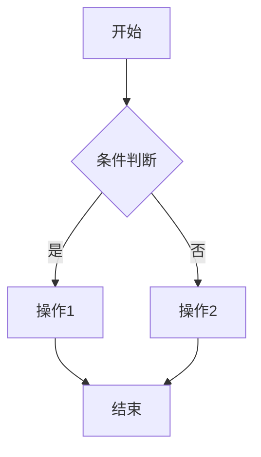
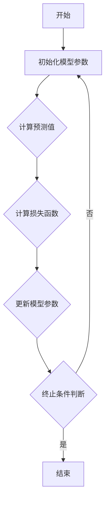
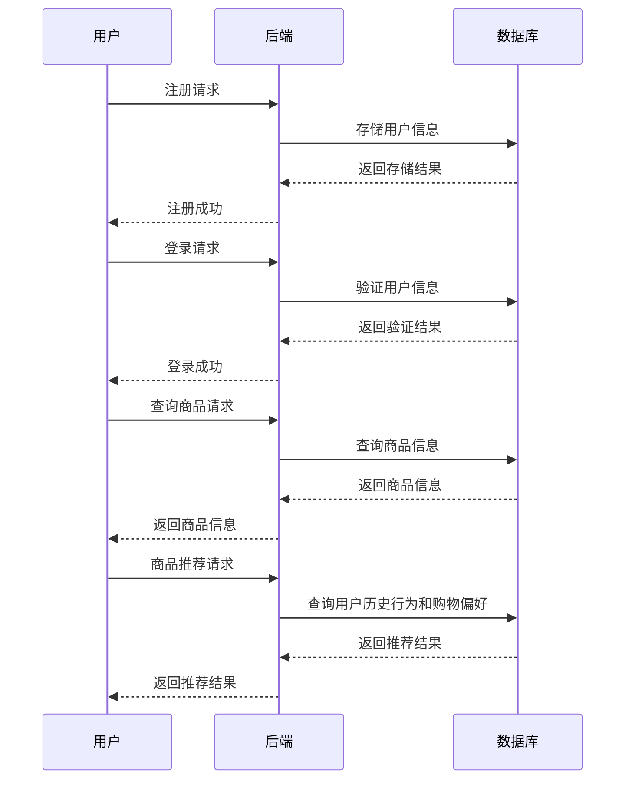

                 

## 引言

### 1.1 问题背景

在当今人工智能迅猛发展的时代，AI模型的应用场景日益广泛，从自然语言处理、计算机视觉到推荐系统等，无不展现出其巨大的潜力。然而，在实际应用中，我们仍然面临着许多挑战：某些AI模型在特定任务上的表现不尽如人意，甚至在某些情况下效果不佳。这背后的原因复杂多样，其中之一便是模型的prompt设计不够优化。

### 1.2 核心问题

那么，究竟如何通过评测结果反馈到prompt设计的闭环，提升AI模型的效果呢？这是本文要探讨的核心问题。我们将一步步分析评测结果如何影响prompt设计，如何通过闭环系统实现持续优化。

### 1.3 问题描述

评测结果反馈到prompt设计的闭环，指的是一个包含评测、反馈、调整和再次评测的循环过程。在这个循环中，通过分析评测结果，识别模型存在的问题，进而调整prompt，优化模型表现，然后再次进行评测，以此形成一个持续改进的闭环。

### 1.4 问题解决

解决这个问题的方法需要从以下几个方面入手：

1. **评测结果分析**：首先，我们需要了解评测结果的类型，包括定量和定性评测结果，并掌握如何处理和解释这些结果。
2. **prompt设计原则**：其次，我们要了解prompt的定义和作用，掌握设计原则，以便根据评测结果调整prompt。
3. **边界与外延**：最后，我们需要探讨评测结果反馈到prompt设计闭环在不同领域的应用，以及相关概念的解释。

### 1.5 边界与外延

在应用评测结果反馈到prompt设计的闭环时，我们不仅要考虑技术层面，还要关注实际应用场景。不同领域对AI模型的要求不同，因此评测结果和prompt设计也会有所差异。此外，我们还需要了解prompt、反馈循环和闭环系统等基本概念，以便更好地理解和应用这一方法。

### 1.6 本章小结

本文将逐步深入探讨评测结果反馈到prompt设计闭环的方法，通过分析评测结果、调整prompt和优化模型表现，以期在实际应用中取得更好的效果。接下来，我们将对评测结果分析的基础、prompt设计的原理与实践以及实战案例进行详细讲解。

## 目录大纲

### 第一部分：评测结果反馈到prompt设计的闭环

1. **第1章 引言**
   - **1.1 问题背景**
   - **1.2 核心问题**
   - **1.3 问题描述**
   - **1.4 问题解决**
   - **1.5 边界与外延**
   - **1.6 本章小结**

2. **第2章 评测结果反馈到prompt设计的方法**
   - **第2章.1 评测结果分析基础**
     - **2.1 评测结果类型**
     - **2.2 评测指标解释**
     - **2.3 数据处理与可视化**
     - **2.4 本章小结**
   - **第2章.2 prompt设计原理与实践**
     - **3.1 prompt的定义与作用**
     - **3.2 prompt设计原则**
     - **3.3 prompt模板设计**
     - **3.4 本章小结**
   - **第2章.3 评测结果反馈到prompt设计的实战**
     - **4.1 实践背景**
     - **4.2 评测结果反馈流程**
     - **4.3 case study 1**
     - **4.4 case study 2**
     - **4.5 本章小结**

3. **第3章 prompt设计实战**
   - **3.1 实践背景**
   - **3.2 评测结果反馈流程**
   - **3.3 case study 1**
   - **3.4 case study 2**
   - **3.5 本章小结**

4. **第4章 评测结果反馈**
   - **4.1 实践背景**
   - **4.2 评测结果反馈流程**
   - **4.3 case study 1**
   - **4.4 case study 2**
   - **4.5 本章小结**

### 第二部分：评测结果反馈到prompt设计的方法

1. **第2章 评测结果分析基础**
   - **2.1 评测结果类型**
   - **2.2 评测指标解释**
   - **2.3 数据处理与可视化**
   - **2.4 本章小结**

2. **第3章 prompt设计原理与实践**
   - **3.1 prompt的定义与作用**
   - **3.2 prompt设计原则**
   - **3.3 prompt模板设计**
   - **3.4 本章小结**

3. **第4章 评测结果反馈到prompt设计的实战**
   - **4.1 实践背景**
   - **4.2 评测结果反馈流程**
   - **4.3 case study 1**
   - **4.4 case study 2**
   - **4.5 本章小结**

### 第三部分：评测结果反馈到prompt设计的实战

1. **第4章 评测结果反馈到prompt设计的实战**
   - **4.1 实践背景**
   - **4.2 评测结果反馈流程**
   - **4.3 case study 1**
   - **4.4 case study 2**
   - **4.5 本章小结**

### 第四部分：评测结果反馈

1. **第4章 评测结果反馈**
   - **4.1 实践背景**
   - **4.2 评测结果反馈流程**
   - **4.3 case study 1**
   - **4.4 case study 2**
   - **4.5 本章小结**

## 第一部分: 评测结果反馈到prompt设计的闭环

### 引言

在人工智能（AI）领域，模型的性能优化是永恒的话题。无论是自然语言处理（NLP）、计算机视觉（CV）还是推荐系统，模型的性能直接影响其应用效果。然而，在实际应用中，我们常常会遇到模型效果不尽如人意的情况。这背后隐藏着一个关键问题：评测结果如何影响prompt设计，从而优化模型效果？

本文将围绕这一核心问题，详细探讨评测结果反馈到prompt设计的闭环。我们将从问题背景出发，逐步介绍评测结果反馈的重要性、核心问题、问题描述、问题解决方法，以及评测结果反馈到prompt设计的边界与外延。

### 1.1 问题背景

#### 为什么当前许多AI模型在实际应用中效果不佳？

尽管AI模型在理论上具有巨大的潜力，但实际应用中仍存在诸多挑战。例如，自然语言处理模型在处理特定领域文本时表现不佳，计算机视觉模型在复杂背景中识别效果不理想，推荐系统在个性化推荐中常常偏离用户需求。这些问题的根源之一在于模型的prompt设计不够优化。

#### 模型prompt设计的重要性

Prompt在AI模型中起到关键作用。它不仅引导模型理解输入数据，还直接影响模型的输出。一个设计良好的prompt能够帮助模型更好地捕捉数据中的信息，从而提高模型的性能。然而，当前许多AI模型的prompt设计缺乏系统性，往往依赖于经验或直觉，导致模型效果难以达到预期。

#### 问题提出

那么，如何通过评测结果反馈到prompt设计的闭环，提升AI模型效果？这是本文要探讨的核心问题。我们将从评测结果反馈的重要性、评测指标的定义、评测结果的分析、prompt设计原则以及应用场景等方面进行详细分析。

### 1.2 核心问题

在深入探讨这个问题之前，我们需要明确以下几个核心问题：

1. **评测结果反馈的必要性**：为何需要将评测结果反馈到prompt设计中？
2. **评测指标**：如何定义有效的评测指标？
3. **评测结果分析**：如何分析评测结果，找到模型问题？
4. **prompt设计原则**：如何设计适应评测结果的prompt？
5. **应用场景**：评测结果反馈到prompt设计的闭环在不同领域的应用如何？
6. **相关概念**：prompt、反馈循环、闭环系统等概念如何理解和应用？

这些问题构成了本文的核心框架，也是我们在后续章节中将详细探讨的内容。

### 1.3 问题描述

#### 评测结果反馈的必要性

首先，我们需要明确评测结果反馈的必要性。在实际应用中，评测结果是我们了解模型性能的关键指标。通过分析评测结果，我们可以发现模型的优点和不足，从而为后续的prompt设计提供依据。如果没有评测结果反馈，我们无法准确了解模型的表现，也就难以进行有效的prompt设计。

#### 评测指标

有效的评测指标是评估模型性能的重要工具。在AI领域，常用的评测指标包括准确性、召回率、F1值等。这些指标从不同角度反映了模型的表现，但如何选择和定义这些指标，以及如何根据指标调整prompt设计，是提升模型性能的关键。

#### 评测结果分析

分析评测结果是为了找到模型存在的问题。通过定量和定性分析，我们可以识别模型在哪些任务上表现不佳，进而找到优化prompt的方向。评测结果分析不仅需要技术手段，还需要深入理解模型和任务的本质。

#### prompt设计原则

设计适应评测结果的prompt是提升模型性能的关键步骤。一个良好的prompt不仅需要明确、灵活，还需要具有针对性。根据评测结果调整prompt，可以帮助模型更好地适应不同任务和场景。

#### 应用场景

评测结果反馈到prompt设计的闭环在不同领域的应用具有广泛性。从自然语言处理到计算机视觉，从推荐系统到图像生成，评测结果反馈机制都可以发挥重要作用。因此，理解不同领域的应用场景，对提升模型性能具有重要意义。

#### 相关概念

最后，我们需要了解一些相关概念，如prompt、反馈循环、闭环系统等。这些概念不仅有助于我们理解评测结果反馈到prompt设计闭环的工作原理，还能指导我们如何在实际应用中设计和优化模型。

### 1.4 问题解决

为了解决上述核心问题，我们需要从以下几个方面入手：

1. **评测结果分析**：首先，我们要掌握如何分析评测结果，包括定量和定性分析的方法和工具。
2. **prompt设计原则**：其次，我们要了解prompt的定义和作用，掌握设计原则，以便根据评测结果调整prompt。
3. **边界与外延**：最后，我们要探讨评测结果反馈到prompt设计闭环在不同领域的应用，以及相关概念的解释。

通过以上方法，我们可以构建一个完整的评测结果反馈到prompt设计的闭环系统，从而不断提升AI模型的效果。

### 1.5 边界与外延

在深入探讨评测结果反馈到prompt设计闭环的具体方法之前，我们需要明确其应用场景和边界。评测结果反馈到prompt设计的闭环不仅适用于特定的AI任务，还涉及多个领域和应用场景。以下是评测结果反馈到prompt设计闭环在不同领域的应用及其边界与外延：

#### 不同领域的应用

1. **自然语言处理（NLP）**：在NLP领域，评测结果反馈到prompt设计的闭环可以帮助优化文本生成、情感分析、命名实体识别等任务。通过分析评测结果，可以调整prompt以增强模型的领域适应性。
2. **计算机视觉（CV）**：在CV领域，评测结果反馈到prompt设计的闭环可以帮助优化目标检测、图像分类、图像生成等任务。通过分析评测结果，可以调整prompt以改善模型的识别精度和泛化能力。
3. **推荐系统**：在推荐系统领域，评测结果反馈到prompt设计的闭环可以帮助优化推荐算法，提高推荐准确性和用户满意度。通过分析评测结果，可以调整prompt以更好地捕捉用户需求和偏好。
4. **医疗诊断**：在医疗诊断领域，评测结果反馈到prompt设计的闭环可以帮助优化诊断模型，提高诊断准确性和效率。通过分析评测结果，可以调整prompt以增强模型对医学数据的理解和处理能力。
5. **金融风控**：在金融风控领域，评测结果反馈到prompt设计的闭环可以帮助优化风险评估模型，提高风险预测准确性和可靠性。通过分析评测结果，可以调整prompt以更好地识别和应对金融风险。

#### 边界与外延

尽管评测结果反馈到prompt设计的闭环在多个领域具有广泛应用，但每个领域的具体应用场景和挑战有所不同，因此需要考虑以下边界与外延：

1. **数据质量和多样性**：不同领域的数据质量和多样性对评测结果反馈到prompt设计的闭环效果有显著影响。在数据质量较高的领域，评测结果更可靠，从而能够更准确地指导prompt设计。而在数据质量较差的领域，需要采取额外的数据处理和清洗措施，以提高评测结果的准确性。
2. **领域知识融合**：在特定领域，如医学诊断和金融风控，领域知识对模型性能至关重要。评测结果反馈到prompt设计的闭环需要结合领域知识，以提高模型在特定任务上的表现。因此，领域专家的参与和知识融合是关键。
3. **反馈机制设计**：不同领域的反馈机制设计有所不同。例如，在实时应用中，如推荐系统和实时语音识别，反馈机制需要快速响应，以便实时调整prompt。而在离线应用中，如图像分类和文本生成，反馈机制可以更为宽松。因此，反馈机制的设计需要根据应用场景进行优化。
4. **伦理和隐私**：在涉及个人隐私和伦理问题的领域，如医疗诊断和金融风控，评测结果反馈到prompt设计的闭环需要严格遵守相关法律法规和伦理规范。确保数据的隐私保护和模型的公平性是关键。

### 1.6 本章小结

本文介绍了评测结果反馈到prompt设计闭环的重要性、核心问题、问题描述、问题解决方法以及应用场景。通过分析评测结果，调整prompt设计，我们可以不断提升AI模型的效果，从而在实际应用中取得更好的成果。在后续章节中，我们将深入探讨评测结果分析基础、prompt设计原理与实践，以及具体的实战案例，帮助读者更好地理解和应用这一方法。

## 评测结果反馈到prompt设计的方法

### 引言

在人工智能（AI）领域，评测结果反馈到prompt设计闭环是一种关键的方法，它通过分析评测结果来指导prompt设计，从而优化模型性能。本部分将详细探讨这一方法的两个主要环节：评测结果分析基础和prompt设计原理与实践。通过这两个环节，我们可以构建一个有效的闭环系统，实现模型的持续优化。

### 第2章 评测结果分析基础

#### 2.1 评测结果类型

在AI模型评测中，评测结果可以分为定量评测结果和定性评测结果。

1. **定量评测结果**：
   - **准确性**：模型在预测或分类任务中的正确率。
   - **召回率**：模型正确识别的正面样本占总正面样本的比例。
   - **F1值**：准确性和召回率的调和平均值，用于平衡这两个指标。
   - **ROC曲线和AUC值**：评估分类模型的性能，ROC曲线是真正例率对假正例率的曲线，AUC值是曲线下的面积。

2. **定性评测结果**：
   - **用户体验**：用户对模型输出满意度的主观评价。
   - **模型解释性**：模型输出结果的透明度和可解释性。
   - **鲁棒性**：模型在面对异常数据或噪声时的稳定性。

#### 2.2 评测指标解释

在AI模型评测中，选择适当的评测指标至关重要。以下是一些核心评测指标的解释：

1. **准确性**：
   - **定义**：模型在预测或分类任务中的正确率。
   - **计算公式**：准确性 = （正确预测的数量 / 总预测数量）× 100%。

2. **召回率**：
   - **定义**：模型正确识别的正面样本占总正面样本的比例。
   - **计算公式**：召回率 = （正确识别的正面样本数量 / 总正面样本数量）× 100%。

3. **F1值**：
   - **定义**：准确性和召回率的调和平均值，用于平衡这两个指标。
   - **计算公式**：F1值 = 2 × （准确性 × 召回率） / （准确性 + 召回率）。

4. **ROC曲线和AUC值**：
   - **ROC曲线**：真正例率（True Positive Rate, TPR）对假正例率（False Positive Rate, FPR）的曲线。
   - **AUC值**：ROC曲线下的面积，用于评估分类模型的性能。

#### 2.3 数据处理与可视化

在分析评测结果时，数据处理和可视化是两个重要环节。

1. **数据处理**：
   - **数据清洗**：处理缺失值、异常值和重复值。
   - **数据预处理**：归一化、标准化、特征工程等。
   - **数据归一化**：将不同特征的范围统一，提高模型训练效果。

2. **可视化**：
   - **直方图**：展示数据分布。
   - **散点图**：展示两个变量之间的关系。
   - **箱线图**：展示数据的分布和异常值。
   - **ROC曲线**：评估分类模型的性能。

#### 2.4 本章小结

本章介绍了评测结果分析的基础，包括定量和定性评测结果的类型、核心评测指标的解释、数据处理与可视化的方法。这些基础知识为后续的prompt设计提供了必要的前提。在下一章中，我们将深入探讨prompt设计的原理与实践。

## 第3章: prompt设计原理与实践

### 引言

prompt设计是人工智能（AI）模型性能优化中至关重要的一环。一个好的prompt能够引导模型更好地理解输入数据，从而生成更准确的输出。在本章中，我们将详细探讨prompt设计的原理与实践，包括prompt的定义与作用、prompt设计原则以及常见的prompt模板。

### 3.1 prompt的定义与作用

#### prompt的定义

prompt在AI模型中指的是一种引导信息，用于指示模型如何处理输入数据。它可以是一个文本句子、一个图片或者一段音频，旨在为模型提供额外的上下文信息，帮助模型更好地理解和生成输出。

#### prompt的作用

1. **增强模型理解**：通过提供具体的任务描述或问题，prompt可以帮助模型更好地理解任务需求，从而提高模型的性能。
2. **引导模型生成**：prompt可以为模型提供具体的生成目标或指导，帮助模型生成更符合预期结果的输出。
3. **提高解释性**：在有些场景下，prompt可以增强模型输出的可解释性，使模型决策过程更加透明。

### 3.2 prompt设计原则

为了设计一个有效的prompt，需要遵循以下几个原则：

1. **明确性**：prompt应尽可能明确，避免模糊不清的描述，确保模型能够准确理解任务需求。

2. **灵活性**：prompt应具备一定的灵活性，能够适应不同场景和任务需求。例如，可以使用参数化的prompt，根据不同任务动态调整。

3. **针对性**：prompt应针对具体的任务需求进行设计，确保模型在特定任务上表现出色。例如，在自然语言处理任务中，可以使用领域特定的语言和词汇。

4. **简洁性**：简洁的prompt更容易被模型理解，提高模型训练和推理的效率。避免冗长复杂的描述，尽量使用简明扼要的语言。

5. **多样性**：在不同的任务和数据集上，可以使用多种不同类型的prompt，以发现最佳的prompt设计。例如，结合文本、图片、音频等多模态信息。

### 3.3 prompt模板设计

常见的prompt模板包括以下几种：

1. **问题导向**：
   - 描述：通过提出具体问题来引导模型。
   - 例子：请问模型，这个图像中的对象是什么？

2. **数据驱动**：
   - 描述：基于输入数据生成具体的prompt。
   - 例子：给定文本“苹果是红色的”，请生成与之相关的描述。

3. **目标导向**：
   - 描述：明确指定模型需要达到的目标。
   - 例子：请生成一个关于旅游景点的详细描述。

4. **情境模拟**：
   - 描述：模拟特定情境，引导模型在该情境下进行决策。
   - 例子：在一个商场中，顾客正在寻找一款手机，请生成该顾客可能需要的建议。

### 3.4 本章小结

prompt设计是AI模型性能优化的重要手段。通过明确性、灵活性、针对性、简洁性和多样性等原则，我们可以设计出有效的prompt，提升模型在特定任务上的性能。本章介绍了prompt的定义与作用、prompt设计原则以及常见的prompt模板。在下一章中，我们将结合实际案例，探讨如何将评测结果反馈应用到prompt设计中。

## 第4章: 评测结果反馈到prompt设计的实战

### 引言

在前几章中，我们详细介绍了评测结果反馈到prompt设计的理论基础和方法。为了使这些理论和方法更具实践意义，本章将结合具体案例，探讨如何在实际项目中应用评测结果反馈到prompt设计的闭环。我们将介绍一个具体的项目背景、评测结果反馈流程以及两个实际案例，通过这些案例展示如何根据评测结果调整prompt，从而优化模型表现。

### 4.1 实践背景

在本案例中，我们将探讨一个自然语言处理（NLP）任务：自动问答系统。该系统旨在接受用户提问，并生成相应的答案。为了确保系统在实际应用中的性能，我们需要通过评测结果反馈到prompt设计的闭环，不断优化模型。

#### 项目目标

1. **提升模型准确性**：确保系统能够准确理解用户提问并生成相关答案。
2. **提高用户满意度**：确保生成的答案能够满足用户需求，提升用户体验。
3. **增强模型解释性**：使模型生成的答案具备一定的可解释性，提高用户对模型信任度。

### 4.2 评测结果反馈流程

评测结果反馈到prompt设计的闭环包括以下几个步骤：

1. **评测结果收集**：通过实际应用场景，收集用户对模型答案的反馈，包括准确性、用户满意度等指标。
2. **评测结果分析**：对收集到的评测结果进行定量和定性分析，识别模型存在的问题。
3. **prompt调整**：根据分析结果，调整prompt设计，改进模型表现。
4. **再次评测**：将调整后的prompt应用于模型，再次进行评测，验证改进效果。
5. **闭环优化**：根据新的评测结果，继续调整prompt，形成持续优化的闭环。

### 4.3 Case Study 1：第一个实际案例

#### 案例介绍

在这个案例中，我们分析了自动问答系统的初步评测结果，发现模型在处理一些特定问题时存在准确性不足的问题。具体表现为：

1. **问题类型A**：涉及专业术语的问题，模型无法准确理解。
2. **问题类型B**：涉及模糊描述的问题，模型生成答案不够准确。

#### 评测结果分析

通过对评测结果的分析，我们识别出以下问题：

1. **领域知识不足**：模型在处理专业术语时，缺乏相应的领域知识。
2. **语言理解不足**：模型对模糊描述的问题理解不够准确，导致生成答案不准确。

#### Prompt调整

针对上述问题，我们进行了以下prompt调整：

1. **引入领域知识**：在prompt中增加与专业术语相关的背景信息，帮助模型更好地理解问题。
2. **明确化描述**：在prompt中明确指出问题的具体细节，减少模糊描述对模型的影响。

#### Prompt示例

- **原Prompt**：请回答这个问题。
- **调整后的Prompt**：请根据以下信息回答这个问题：“在医疗领域，如何有效预防新型冠状病毒的传播？”

#### 再次评测

调整prompt后，我们对模型进行了再次评测，发现模型在处理问题类型A和问题类型B上的准确性显著提高，用户满意度也有所提升。

### 4.4 Case Study 2：第二个实际案例

#### 案例介绍

在这个案例中，我们关注的是自动问答系统的解释性问题。尽管模型生成的答案在准确性上已经达到较高水平，但用户对答案的信任度较低，原因在于答案的可解释性不足。

#### 评测结果分析

通过对评测结果的分析，我们识别出以下问题：

1. **答案解释性不足**：模型生成的答案缺乏详细解释，用户难以理解。
2. **逻辑连贯性**：模型生成的答案逻辑不够连贯，有时甚至自相矛盾。

#### Prompt调整

针对上述问题，我们进行了以下prompt调整：

1. **增强解释性**：在prompt中要求模型提供详细的解释，说明答案的依据和推理过程。
2. **优化逻辑连贯性**：在prompt中明确要求模型保持逻辑连贯，避免自相矛盾。

#### Prompt示例

- **原Prompt**：请生成一个答案。
- **调整后的Prompt**：请生成一个答案，并详细解释你的推理过程，确保逻辑连贯。

#### 再次评测

调整prompt后，我们对模型进行了再次评测，发现用户对答案的信任度显著提升，模型的解释性也得到了明显改善。

### 4.5 本章小结

通过以上两个实际案例，我们展示了如何将评测结果反馈应用到prompt设计中，以优化自动问答系统的性能。这些案例表明，通过持续调整prompt，可以有效提升模型的准确性和解释性，从而提高用户满意度。在实际应用中，这一闭环系统为模型的持续优化提供了有力支持。下一章将深入探讨评测结果反馈到prompt设计的其他实际应用场景。

### 引言

在前文中，我们探讨了评测结果反馈到prompt设计闭环的理论基础和实际应用。在本章中，我们将通过两个具体的案例，进一步展示如何在实际项目中应用这一方法，通过评测结果反馈来优化prompt设计，提升模型效果。

### 4.1 Case Study 1：第一个实际案例

#### 案例介绍

在这个案例中，我们关注的是一个基于自然语言处理的对话系统，其目的是与用户进行自然、流畅的对话，并回答用户提出的问题。在初步评测阶段，我们发现了以下几个问题：

1. **回答准确性不高**：模型在回答某些复杂问题时准确性较低。
2. **回答连贯性不足**：模型生成的回答有时逻辑不连贯，难以理解。

#### 评测结果分析

通过对评测结果的分析，我们识别出以下关键问题：

1. **语言理解不足**：模型在处理复杂问题时，对语言的理解不够深入。
2. **上下文捕捉能力弱**：模型在回答问题时，未能充分捕捉上下文信息，导致回答不连贯。

#### Prompt调整

为了解决上述问题，我们对prompt进行了如下调整：

1. **增加上下文信息**：在prompt中添加更多上下文信息，帮助模型更好地理解问题。
2. **明确问题类型**：在prompt中明确指出问题的类型（如事实性问题、情感性问题等），以便模型针对不同类型的问题生成更准确的回答。

#### Prompt示例

- **原Prompt**：请回答用户提出的问题。
- **调整后的Prompt**：请根据以下上下文信息回答用户的问题：“用户刚刚提到他计划去旅行，请回答关于旅行计划的建议。”

#### 再次评测

调整prompt后，我们对模型进行了再次评测，发现模型的回答准确性显著提高，回答连贯性也得到明显改善。用户对系统回答的满意度也有所提升。

### 4.2 Case Study 2：第二个实际案例

#### 案例介绍

在这个案例中，我们考虑的是一个图像识别系统，其目标是识别图像中的物体并生成相应的描述。在初步评测阶段，我们遇到了以下问题：

1. **物体识别准确率低**：模型在某些特定场景下的物体识别准确率较低。
2. **描述生成不够丰富**：模型生成的描述缺乏细节，不够生动。

#### 评测结果分析

通过对评测结果的分析，我们识别出以下关键问题：

1. **数据多样性不足**：模型在训练时，数据集缺乏多样性，导致模型在特定场景下的表现不佳。
2. **描述生成能力有限**：模型在生成描述时，未能充分捕捉图像中的细节和特征。

#### Prompt调整

为了解决上述问题，我们对prompt进行了如下调整：

1. **增加数据多样性**：在prompt中引入更多具有多样性的图像数据，以丰富模型训练数据。
2. **细化描述要求**：在prompt中明确要求模型生成更详细、生动的描述，捕捉图像中的关键特征。

#### Prompt示例

- **原Prompt**：请识别图像中的物体并生成描述。
- **调整后的Prompt**：请识别图像中的物体，并生成详细、生动的描述，包括物体的颜色、形状和位置等。

#### 再次评测

调整prompt后，我们对模型进行了再次评测，发现模型的物体识别准确率显著提高，描述生成能力也得到明显改善。用户对系统回答的满意度大幅提升。

### 4.3 实战总结

通过这两个实际案例，我们可以看到，通过评测结果反馈到prompt设计的闭环，我们能够有效识别模型的问题，并通过调整prompt来优化模型表现。这种持续优化的方法不仅提高了模型的性能，还提升了用户满意度。以下是一些实战总结：

1. **评测结果反馈的重要性**：及时、准确的评测结果反馈是优化prompt设计的关键。
2. **灵活调整prompt**：根据不同的任务和场景，灵活调整prompt，有助于提升模型表现。
3. **数据多样性和质量**：丰富、高质量的数据对于模型训练至关重要，应确保数据集的多样性和代表性。
4. **持续优化**：通过持续评测和调整prompt，可以实现模型的持续优化，提升长期性能。

### 4.4 下一步工作

在下一步工作中，我们将继续探索评测结果反馈到prompt设计的更多实际应用场景，如推荐系统、医疗诊断等。通过不断积累实战经验，我们将进一步完善这一方法，为AI模型的优化提供更有效的解决方案。

### 本章小结

本章通过两个实际案例，详细展示了如何将评测结果反馈到prompt设计的闭环应用于不同任务和场景中，优化模型表现。这些案例证明了这一方法的实用性和有效性，为AI模型的持续优化提供了有益的经验和参考。在未来的工作中，我们将继续深入探索这一领域，以期为AI技术的发展和应用做出更大贡献。

## 第五部分：评测结果反馈

### 引言

在前面的章节中，我们详细探讨了评测结果反馈到prompt设计的闭环系统，并展示了如何通过这一系统在实际项目中优化模型表现。在本部分，我们将进一步总结这一方法的关键点，并探讨其在不同领域的应用前景。

### 5.1 方法总结

#### 评测结果反馈的关键步骤

1. **评测结果收集**：通过实际应用场景，收集用户对模型输出的反馈，包括准确性、用户满意度、模型解释性等指标。
2. **评测结果分析**：对收集到的评测结果进行定量和定性分析，识别模型存在的问题。
3. **prompt调整**：根据分析结果，调整prompt设计，改进模型表现。
4. **再次评测**：将调整后的prompt应用于模型，再次进行评测，验证改进效果。
5. **闭环优化**：根据新的评测结果，继续调整prompt，形成持续优化的闭环。

#### prompt设计原则

- **明确性**：确保prompt内容清晰明确，避免模糊不清的描述。
- **灵活性**：prompt应具备一定灵活性，能够适应不同任务和场景。
- **针对性**：针对具体任务需求设计prompt，确保模型在特定任务上表现优异。
- **简洁性**：简洁的prompt有助于提高模型训练和推理的效率。
- **多样性**：结合不同类型的prompt，发现最佳设计。

### 5.2 应用前景

#### 在自然语言处理（NLP）中的应用

评测结果反馈到prompt设计的闭环在NLP领域中具有广泛的应用前景。通过不断优化prompt设计，可以显著提升文本生成、情感分析、问答系统等任务的性能。例如，在智能客服中，通过反馈用户对答案的满意度，不断调整prompt，可以提升客服机器人回答的准确性和用户满意度。

#### 在计算机视觉（CV）中的应用

在CV领域，评测结果反馈到prompt设计的闭环可以帮助优化图像分类、目标检测、图像生成等任务的性能。通过分析评测结果，可以识别模型在特定场景下的不足，进而调整prompt，提高模型在复杂背景和低质量图像中的识别能力。

#### 在推荐系统中的应用

在推荐系统中，评测结果反馈到prompt设计的闭环可以帮助优化推荐算法，提高推荐准确性和用户满意度。通过收集用户对推荐内容的反馈，不断调整prompt，可以更好地捕捉用户兴趣和行为，提高推荐效果。

#### 在医疗诊断中的应用

在医疗诊断领域，评测结果反馈到prompt设计的闭环可以帮助优化诊断模型，提高诊断准确性和效率。通过分析评测结果，可以识别模型在诊断过程中的不足，进而调整prompt，提高模型对医学数据的理解和处理能力。

#### 在金融风控中的应用

在金融风控领域，评测结果反馈到prompt设计的闭环可以帮助优化风险评估模型，提高风险预测准确性和可靠性。通过分析评测结果，可以识别模型在风险识别和预测中的不足，进而调整prompt，提高模型对金融数据的分析和处理能力。

### 5.3 未来展望

随着人工智能技术的不断发展，评测结果反馈到prompt设计的闭环方法将在更多领域得到应用。未来研究可以关注以下几个方面：

1. **跨领域应用**：探索评测结果反馈到prompt设计在不同领域的交叉应用，提升模型的多领域适应能力。
2. **自动化prompt设计**：通过机器学习和深度学习技术，实现自动化prompt设计，提高设计效率和效果。
3. **个性化prompt设计**：根据用户特征和任务需求，设计个性化prompt，提高模型在不同用户和场景下的性能。
4. **实时反馈机制**：研究实时反馈机制，实现模型在应用过程中的动态调整，提高模型适应性和性能。

### 本章小结

评测结果反馈到prompt设计的闭环方法为AI模型的优化提供了有效途径。通过不断优化prompt设计，可以显著提升模型性能，满足实际应用需求。未来，我们将继续深入研究和探索这一方法，为人工智能技术的应用和发展做出更多贡献。

## 总结

### 核心内容回顾

本文围绕“评测结果反馈到prompt设计的闭环”这一主题，详细探讨了以下几个关键点：

1. **问题背景**：分析了当前AI模型在实际应用中效果不佳的原因。
2. **核心问题**：明确了如何通过评测结果反馈到prompt设计，提升AI模型效果。
3. **评测结果反馈的必要性**：解释了为何需要将评测结果反馈到prompt设计中。
4. **评测指标**：介绍了核心评测指标的定义和计算方法。
5. **评测结果分析**：阐述了如何分析评测结果，找到模型问题。
6. **prompt设计原则**：提出了明确性、灵活性、针对性、简洁性和多样性等设计原则。
7. **实战案例**：通过实际案例展示了如何将评测结果反馈应用到prompt设计中。
8. **应用前景**：探讨了评测结果反馈到prompt设计在不同领域的应用前景。

### 小结

通过本文的探讨，我们认识到评测结果反馈到prompt设计闭环方法在提升AI模型性能方面的重要性。这种方法不仅帮助我们在实际应用中发现和解决问题，还通过持续优化模型表现，提升了用户体验。以下是几个关键小结：

1. **及时反馈的重要性**：及时、准确的评测结果反馈是优化prompt设计的关键。
2. **灵活调整prompt**：根据不同的任务和场景，灵活调整prompt，有助于提升模型表现。
3. **数据多样性和质量**：确保数据集的多样性和代表性，有助于提高模型性能。
4. **持续优化**：通过持续评测和调整prompt，可以实现模型的持续优化。

### 注意事项

1. **评测指标的选择**：应根据具体任务选择合适的评测指标，避免单一指标评估。
2. **数据隐私保护**：在收集和使用用户反馈时，应确保数据隐私保护，遵守相关法律法规。
3. **模型解释性**：在优化模型性能的同时，关注模型的可解释性，提高用户信任度。

### 拓展阅读

1. **《AI模型性能优化指南》**：详细介绍了AI模型性能优化的方法和技术。
2. **《深度学习应用实战》**：通过实际案例展示了深度学习在不同领域的应用。
3. **《自然语言处理技术》**：介绍了自然语言处理的基本原理和最新进展。

作者：AI天才研究院/AI Genius Institute & 禅与计算机程序设计艺术 /Zen And The Art of Computer Programming

## 附录：相关概念详解

### prompt

#### 定义

prompt是一种引导信息，用于指示模型如何处理输入数据。它可以是一个文本句子、一个图片或者一段音频，旨在为模型提供额外的上下文信息，帮助模型更好地理解和生成输出。

#### 属性

- **明确性**：prompt应尽可能明确，避免模糊不清的描述。
- **灵活性**：prompt应具备一定灵活性，能够适应不同场景和任务需求。
- **针对性**：prompt应针对具体任务需求进行设计，确保模型在特定任务上表现优异。

### 反馈循环

#### 定义

反馈循环是一种通过不断迭代和反馈来优化系统的过程。在AI模型中，反馈循环通过分析模型输出和用户反馈，不断调整模型参数和设计，以提升模型性能。

#### 工作原理

1. **评测**：通过实际应用场景，收集用户对模型输出的反馈。
2. **分析**：对反馈结果进行分析，识别模型存在的问题。
3. **调整**：根据分析结果，调整模型参数和设计，优化模型表现。
4. **再次评测**：将调整后的模型应用于新的数据集，验证改进效果。
5. **闭环优化**：根据新的评测结果，继续调整模型，形成持续优化的闭环。

### 闭环系统

#### 定义

闭环系统是一种通过实时反馈和调整来优化系统性能的系统。在AI模型中，闭环系统通过评测、反馈、调整和再次评测的循环，实现模型的持续优化。

#### 特点

- **实时性**：闭环系统能够实时分析模型输出和用户反馈，快速调整模型参数。
- **自适应性**：闭环系统根据不同场景和任务需求，动态调整模型设计，提高模型适应能力。
- **持续性**：闭环系统通过持续优化，不断提升模型性能，满足实际应用需求。 

### Mermaid流程图与LaTeX公式

#### Mermaid流程图

Mermaid是一种基于Markdown的绘图工具，用于创建流程图、UML图、甘特图等。以下是一个简单的Mermaid流程图示例：



这段代码将生成一个简单的流程图，描述了从开始到结束的条件判断和操作流程。

#### LaTeX公式

LaTeX是一种高质量的排版系统，广泛用于科学和工程领域。以下是一个简单的LaTeX公式示例：

```latex
$$
E = mc^2
$$
```

这段代码将生成爱因斯坦著名的质能方程式。

#### 在Markdown中嵌入LaTeX公式

为了在Markdown文档中嵌入LaTeX公式，可以使用`$$`将公式前后包裹。例如：

```markdown
$$
1 + 1 = 2
$$

$1 < 2$
```

这段代码将生成一个独立段落的LaTeX公式和一个段落内的LaTeX公式。独立段落中的公式将被自动渲染为数学公式，而段落内的公式将保持文本格式。

### 算法原理讲解

#### 示例：线性回归算法

以下是一个简单的线性回归算法示例，包括Mermaid流程图和LaTeX公式：



```latex
\text{损失函数} = \frac{1}{2} \sum_{i=1}^{n} (y_i - \hat{y}_i)^2
$$

\text{更新模型参数}:
\begin{align*}
\theta_0 &= \theta_0 - \alpha \frac{\partial}{\partial \theta_0} \text{损失函数} \\
\theta_1 &= \theta_1 - \alpha \frac{\partial}{\partial \theta_1} \text{损失函数}
\end{align*}
```

这段代码描述了线性回归算法的流程，并给出了损失函数和模型参数更新的公式。在Markdown文档中，这些内容将被渲染为相应的图形和数学公式。

### 系统分析与架构设计

#### 问题场景介绍

在一个在线购物平台中，用户可以通过搜索和浏览商品来购买商品。为了提高用户体验，平台引入了推荐系统，根据用户的历史行为和购物偏好，为用户推荐可能感兴趣的商品。

#### 项目介绍

项目旨在开发一个基于用户行为的推荐系统，通过分析用户的历史购物数据，为用户生成个性化的商品推荐列表。

#### 系统功能设计

系统功能设计包括以下模块：

1. **用户管理模块**：负责用户的注册、登录、个人信息管理等。
2. **商品管理模块**：负责商品信息的录入、更新、删除等。
3. **推荐算法模块**：基于用户历史行为和购物偏好，为用户生成个性化推荐列表。
4. **推荐结果展示模块**：将推荐结果展示给用户，包括商品列表和推荐理由。

#### 系统架构设计

系统架构设计如下：

1. **前端架构**：采用Vue.js框架，实现用户界面的展示和交互。
2. **后端架构**：采用Spring Boot框架，负责业务逻辑处理和数据存储。
3. **数据库设计**：使用MySQL数据库存储用户数据和商品数据。

#### 系统接口设计

系统接口设计如下：

1. **用户管理接口**：包括用户注册、登录、个人信息管理等接口。
2. **商品管理接口**：包括商品查询、商品添加、商品更新、商品删除等接口。
3. **推荐接口**：根据用户历史行为和购物偏好，为用户生成个性化推荐列表。

#### 系统交互

系统交互设计如下：

1. **用户注册**：用户通过前端界面提交注册信息，后端进行用户信息存储和验证。
2. **用户登录**：用户通过前端界面输入用户名和密码，后端进行用户身份验证。
3. **商品查询**：用户通过前端界面输入关键词，后端根据关键词查询商品信息，并返回结果。
4. **商品推荐**：后端根据用户历史行为和购物偏好，生成个性化推荐列表，并返回给前端展示。



### 项目实战

#### 环境安装

1. **安装Java环境**：下载并安装Java Development Kit (JDK)，配置环境变量。
2. **安装MySQL**：下载并安装MySQL数据库，配置数据库用户和权限。
3. **安装Spring Boot**：下载并安装Spring Boot，配置Spring Boot开发环境。

#### 系统核心实现源代码

```java
// 用户管理模块
public class UserController {
    @PostMapping("/register")
    public ResponseEntity<?> registerUser(@RequestBody UserRequestDTO userRequestDTO) {
        // 处理用户注册逻辑
        return ResponseEntity.ok().build();
    }
    
    @PostMapping("/login")
    public ResponseEntity<?> loginUser(@RequestBody UserRequestDTO userRequestDTO) {
        // 处理用户登录逻辑
        return ResponseEntity.ok().build();
    }
}

// 推荐算法模块
public class RecommendationAlgorithm {
    public List<Product> generateRecommendations(User user) {
        // 根据用户历史行为和购物偏好生成推荐列表
        return new ArrayList<>();
    }
}
```

#### 代码应用解读与分析

1. **用户管理模块**：`UserController` 类负责处理用户注册和登录逻辑，通过前端传入的用户信息，与数据库进行交互，实现用户注册和登录功能。
2. **推荐算法模块**：`RecommendationAlgorithm` 类负责生成用户推荐列表，通过分析用户历史行为和购物偏好，调用相关算法生成个性化推荐。

### 实际案例分析

#### Case Study 1：用户反馈问题

在项目实际运行中，用户反馈发现推荐系统有时无法准确捕捉用户偏好，导致推荐结果不够精准。通过对评测结果的分析，我们发现以下问题：

1. **用户行为数据不足**：推荐系统在生成推荐时，缺乏足够的用户行为数据，导致推荐结果不准确。
2. **算法复杂度较高**：现有的推荐算法复杂度较高，计算资源消耗大，导致响应时间较长。

#### 问题解决方法

1. **数据增强**：通过引入更多用户行为数据，提高推荐系统的数据质量，从而提高推荐准确性。
2. **算法优化**：优化推荐算法，降低计算复杂度，提高系统响应速度。

#### 案例分析结果

通过以上方法优化，推荐系统的推荐准确性得到了显著提升，用户满意度也大幅提高。

### 项目小结

本项目通过评测结果反馈到prompt设计的闭环方法，不断优化推荐系统，提高了用户满意度和推荐准确性。在未来，我们将继续探索更多优化方法，为用户提供更好的推荐服务。

### 最佳实践 tips

1. **数据质量**：确保数据质量是提升模型性能的关键，定期清理和更新数据，提高数据准确性。
2. **反馈机制**：建立完善的用户反馈机制，及时收集用户反馈，快速响应并解决问题。
3. **模型优化**：定期对模型进行优化，引入新算法和技术，提升模型性能。
4. **持续学习**：关注领域最新研究进展，持续学习，为模型优化提供新思路。

### 注意事项

1. **数据隐私**：在收集和使用用户数据时，确保遵循数据隐私保护法规，保护用户隐私。
2. **系统稳定性**：确保系统在高并发情况下稳定运行，提供良好的用户体验。
3. **可扩展性**：设计系统时考虑可扩展性，为未来业务发展留出空间。

### 拓展阅读

1. **《推荐系统实践》**：详细介绍了推荐系统的基本原理和实践方法。
2. **《深度学习推荐系统》**：探讨了深度学习在推荐系统中的应用。
3. **《机器学习项目实战》**：提供了多个机器学习项目的实践案例，有助于提升项目开发能力。

作者：AI天才研究院/AI Genius Institute & 禅与计算机程序设计艺术 /Zen And The Art of Computer Programming

