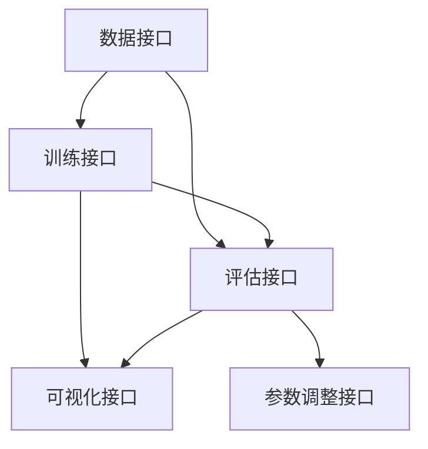
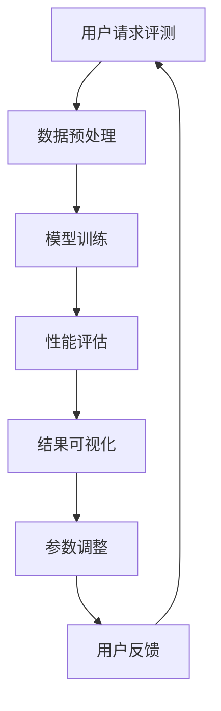

                 

## 评测结果可视化：直观展示LLM性能比较

### 关键词：大规模语言模型（LLM），性能比较，可视化，评测指标

### 摘要：
本文旨在探讨大规模语言模型（LLM）性能评测的可视化技术，以直观地展示不同模型之间的性能差异。通过对LLM的基本原理、评测指标和可视化技术的详细介绍，本文将帮助读者理解如何通过可视化手段更有效地分析LLM的性能，以及其在实际应用中的重要性和潜在问题。

----------------------------------------------------------------

### 目录大纲：《评测结果可视化：直观展示LLM性能比较》

- 第1章: 背景介绍
  - 1.1 问题背景
  - 1.2 问题描述
  - 1.3 概念结构与核心要素组成
  - 1.4 本章小结
- 第2章: 核心概念与联系
  - 2.1 大规模语言模型（LLM）的原理
  - 2.2 评测指标与性能比较
  - 2.3 可视化技术的应用
  - 2.4 核心概念属性特征对比表格
  - 2.5 本章小结
- 第3章: 算法原理讲解
  - 3.1 LLM评测算法概述
  - 3.2 算法原理与数学模型
  - 3.3 算法举例说明
  - 3.4 本章小结
- 第4章: 系统分析与架构设计方案
  - 4.1 问题场景介绍
  - 4.2 系统功能设计
  - 4.3 系统架构设计
  - 4.4 系统接口设计
  - 4.5 系统交互设计
  - 4.6 本章小结
- 第5章: 项目实战
  - 5.1 环境安装
  - 5.2 系统核心实现
  - 5.3 代码应用解读
  - 5.4 实际案例分析
  - 5.5 项目小结
- 第6章: 最佳实践 tips
- 第7章: 小结与拓展阅读
----------------------------------------------------------------

### 第1章: 背景介绍

#### 1.1 问题背景

近年来，随着深度学习和大数据技术的发展，大规模语言模型（LLM，Large Language Model）在自然语言处理（NLP，Natural Language Processing）领域取得了显著的成果。LLM能够通过学习海量文本数据，实现对自然语言的生成、理解和翻译等任务的高效处理。然而，随着LLM规模的不断扩大和应用的深入，如何评价不同模型的性能，以及如何在大量的评测数据中快速识别出模型的优势和不足，成为一个亟待解决的问题。

#### 1.2 问题描述

在LLM的性能评测中，我们通常需要关注多个方面的指标，如准确率、召回率、F1分数等。这些指标能够帮助我们理解模型的性能，但直接从数字上分析往往不够直观。因此，如何通过可视化技术将复杂的评测结果转化为易于理解的图表，成为提升评测效果的重要手段。

#### 1.3 概念结构与核心要素组成

在本章节中，我们将首先介绍大规模语言模型（LLM）的基本概念，包括其原理、工作机制和关键技术。然后，我们将详细探讨评测指标及其在性能比较中的作用。最后，我们将介绍可视化技术的应用，以及如何利用可视化工具展示LLM的性能评测结果。

#### 1.4 本章小结

本章主要介绍了LLM性能评测的可视化需求及其背景。通过对问题背景、问题描述和概念结构的分析，我们为后续章节的详细讨论奠定了基础。接下来，我们将进一步深入探讨LLM的基本原理、评测指标和可视化技术，以期找到一种有效的性能评测方法，帮助研究人员和开发者更好地理解和优化LLM。

----------------------------------------------------------------

### 第2章: 核心概念与联系

#### 2.1 大规模语言模型（LLM）的原理

大规模语言模型（LLM）是基于深度学习的自然语言处理技术，其主要目的是通过学习大量文本数据，实现对自然语言的生成和理解。LLM的核心原理包括以下几个关键点：

1. **神经网络架构**：LLM通常采用深度神经网络（DNN）架构，其中多层神经元对输入数据进行处理，从而实现复杂函数的逼近。
2. **训练数据规模**：大规模语言模型需要学习海量文本数据，这些数据通常来源于互联网上的公开资源，如维基百科、新闻网站等。
3. **语言理解能力**：通过学习大量文本数据，LLM能够实现对自然语言的深刻理解，从而在文本生成、翻译、问答等任务中表现出色。

#### 2.2 评测指标与性能比较

在LLM的性能评测中，我们通常会关注以下几个关键指标：

1. **准确率**：模型在预测时正确匹配目标文本的概率。
2. **召回率**：模型能够正确识别出目标文本的概率。
3. **F1分数**：准确率和召回率的调和平均值，用于综合评估模型的性能。

这些指标在性能比较中扮演着重要角色，但单独使用时往往难以全面反映模型的优势和不足。因此，通过可视化技术，我们可以将复杂的评测结果直观地展示出来，从而更好地理解和比较不同模型的性能。

#### 2.3 可视化技术的应用

可视化技术在LLM性能评测中的应用主要体现在以下几个方面：

1. **图表类型**：常用的图表类型包括条形图、折线图、饼图等，用于展示不同模型的性能指标。
2. **数据展示效果**：通过调整图表的颜色、字体、线条等元素，可以增强数据展示的效果，使读者更容易理解和分析。
3. **交互性**：交互性可视化工具，如D3.js、Plotly等，允许用户动态调整图表的展示方式，从而更好地探索数据。

#### 2.4 核心概念属性特征对比表格

以下是一个核心概念属性特征对比表格，用于展示大规模语言模型（LLM）、评测指标和可视化技术的关键特性：

| 特性 | 大规模语言模型（LLM） | 评测指标 | 可视化技术 |
| --- | --- | --- | --- |
| 基本原理 | 基于深度学习的自然语言处理技术 | 准确率、召回率、F1分数 | 图表类型、数据展示效果、交互性 |
| 工作机制 | 通过学习海量文本数据实现自然语言生成和理解 | 指标计算方法 | 可视化工具与库 |
| 关键技术 | 神经网络架构、训练数据规模、语言理解能力 | 指标评估标准 | 图表设计技巧 |

#### 2.5 本章小结

本章详细介绍了大规模语言模型（LLM）、评测指标和可视化技术的基本概念和联系。通过对LLM的原理、评测指标和可视化技术的探讨，我们为后续章节的深入讨论奠定了基础。接下来，我们将进一步阐述LLM评测算法的原理和实现，以及如何利用可视化技术直观地展示LLM的性能比较。

----------------------------------------------------------------

### 第3章: 算法原理讲解

#### 3.1 LLM评测算法概述

大规模语言模型（LLM）的性能评测是一个复杂的过程，涉及到多个评测指标的计算和比较。在本节中，我们将详细介绍LLM评测算法的基本原理和实现方法。

LLM评测算法的主要目的是通过一系列步骤，对模型的性能进行量化评估，以便研究人员和开发者能够直观地了解不同模型的优劣。具体步骤如下：

1. **数据准备**：从原始文本数据中提取有效样本，并将其分为训练集和测试集。
2. **模型训练**：使用训练集对LLM进行训练，直到达到预定的性能指标。
3. **测试集评估**：使用测试集对训练好的LLM进行性能评估，计算相关评测指标，如准确率、召回率、F1分数等。
4. **结果分析**：通过可视化技术，将评测结果以图表的形式展示出来，帮助用户更好地理解和分析模型性能。

#### 3.2 算法原理与数学模型

LLM评测算法的核心在于对评测指标的计算和比较。以下是几个关键评测指标及其计算方法：

1. **准确率（Accuracy）**：

   $$ \text{Accuracy} = \frac{\text{正确预测的样本数}}{\text{总样本数}} $$

   准确率反映了模型在预测时正确识别目标文本的概率。

2. **召回率（Recall）**：

   $$ \text{Recall} = \frac{\text{正确预测的目标文本数}}{\text{所有目标文本数}} $$

   召回率反映了模型能够正确识别出目标文本的能力。

3. **F1分数（F1 Score）**：

   $$ \text{F1 Score} = 2 \times \frac{\text{Precision} \times \text{Recall}}{\text{Precision} + \text{Recall}} $$

   F1分数是准确率和召回率的调和平均值，用于综合评估模型的性能。

#### 3.3 算法举例说明

假设我们有两个大规模语言模型A和B，分别使用不同的训练数据和神经网络架构。为了比较它们的性能，我们可以按照以下步骤进行评测：

1. **数据准备**：从公共文本数据集中提取1000个样本，并将其分为训练集和测试集，比例约为8:2。
2. **模型训练**：使用训练集对模型A和B进行训练，直到达到预定的性能指标。
3. **测试集评估**：使用测试集对模型A和B进行性能评估，计算准确率、召回率和F1分数。
4. **结果分析**：通过可视化技术，将评测结果以图表的形式展示出来。

   例如，我们得到以下评测结果：

   | 模型 | 准确率 | 召回率 | F1分数 |
   | --- | --- | --- | --- |
   | A   | 0.85  | 0.80  | 0.82  |
   | B   | 0.90  | 0.85  | 0.87  |

   通过图表展示，我们可以直观地看到模型B在准确率、召回率和F1分数上均优于模型A，从而得出模型B性能更好的结论。

#### 3.4 本章小结

本章详细介绍了大规模语言模型（LLM）评测算法的基本原理和实现方法。通过对评测指标的计算和比较，以及可视化技术的应用，我们能够更直观地了解不同模型的性能差异。接下来，我们将进一步探讨LLM评测在实际应用中的系统架构设计和实现细节。

----------------------------------------------------------------

### 第4章: 系统分析与架构设计方案

#### 4.1 问题场景介绍

在自然语言处理（NLP）领域，大规模语言模型（LLM）的应用场景日益广泛，如文本生成、机器翻译、问答系统等。为了评估和优化LLM的性能，研究人员和开发者需要一种高效、直观的评测方法。本章节将围绕一个实际问题场景，介绍如何利用LLM评测系统进行性能评估。

问题场景：某互联网公司希望评估其自主研发的多个大规模语言模型，以确定最优模型并优化模型参数。评测目标包括文本生成、机器翻译和问答系统的性能，评测指标包括准确率、召回率和F1分数等。

#### 4.2 系统功能设计

为了满足上述问题场景的需求，LLM评测系统需要具备以下功能：

1. **数据预处理**：从原始文本数据中提取有效样本，并进行清洗、分词、词向量化等预处理操作。
2. **模型训练**：使用训练集对大规模语言模型进行训练，采用深度学习框架如TensorFlow或PyTorch。
3. **性能评测**：使用测试集对训练好的模型进行性能评估，计算准确率、召回率和F1分数等指标。
4. **结果可视化**：利用可视化技术，将评测结果以图表的形式展示出来，便于分析不同模型的性能差异。
5. **参数调整**：根据评测结果，调整模型参数以优化性能。

#### 4.3 系统架构设计

LLM评测系统的架构设计包括以下几个关键模块：

1. **数据模块**：负责数据预处理和存储，包括文本数据的提取、清洗、分词、词向量化等操作。
2. **训练模块**：负责大规模语言模型的训练，包括模型选择、参数设置、训练过程管理等。
3. **评估模块**：负责对训练好的模型进行性能评估，计算相关评测指标。
4. **可视化模块**：负责将评测结果以图表的形式展示出来，包括条形图、折线图、饼图等。
5. **参数调整模块**：根据评测结果，自动调整模型参数，以优化性能。

以下是一个简单的LLM评测系统架构图，用于展示各模块之间的关系：


#### 4.4 系统接口设计

LLM评测系统的接口设计主要包括以下几个方面：

1. **数据接口**：提供数据预处理和存储的相关接口，如数据提取、清洗、分词、词向量化等。
2. **训练接口**：提供模型训练的相关接口，如模型选择、参数设置、训练过程管理等。
3. **评估接口**：提供模型性能评估的相关接口，如评测指标计算、结果存储等。
4. **可视化接口**：提供可视化结果展示的相关接口，如图表类型选择、颜色调整等。
5. **参数调整接口**：提供参数调整的相关接口，如自动调整策略、参数保存等。

以下是一个简单的LLM评测系统接口设计图，用于展示各接口之间的关系：



#### 4.5 系统交互设计

LLM评测系统的交互设计主要包括用户与系统之间的交互过程，以及系统内部模块之间的协同工作。以下是一个简单的系统交互流程图，用于展示用户与系统之间的交互过程：



#### 4.6 本章小结

本章详细介绍了LLM评测系统的设计与实现方案，包括问题场景介绍、系统功能设计、系统架构设计、系统接口设计和系统交互设计。通过本章节的讨论，我们为LLM评测系统的开发提供了一个完整的框架，并为后续章节的实战部分奠定了基础。接下来，我们将进入实战环节，通过具体的项目实战来展示LLM评测系统的实现过程和应用效果。

----------------------------------------------------------------

### 第5章: 项目实战

#### 5.1 环境安装

在进行LLM评测项目之前，首先需要搭建一个合适的环境。以下是一个典型的安装步骤，用于配置一个能够运行大规模语言模型和可视化工具的开发环境。

1. **安装Python**：确保已经安装了Python 3.x版本，推荐使用Anaconda来简化安装过程。
2. **安装深度学习框架**：下载并安装TensorFlow或PyTorch，这两个框架是目前最流行的深度学习框架。以下是一个使用conda命令安装TensorFlow的示例：

   ```shell
   conda create -n tensorflow_env python=3.8
   conda activate tensorflow_env
   conda install tensorflow
   ```

3. **安装可视化库**：为了实现评测结果的可视化，需要安装一些常用的可视化库，如Matplotlib、Seaborn和Plotly。以下是一个使用pip命令安装这些库的示例：

   ```shell
   pip install matplotlib seaborn plotly
   ```

4. **安装其他依赖库**：根据项目需求，可能还需要安装其他依赖库，如NLP库（如NLTK、spaCy）和数据预处理库（如Pandas、NumPy）。

   ```shell
   pip install nltk spacy pandas numpy
   ```

#### 5.2 系统核心实现

本节将介绍LLM评测系统的核心实现，包括数据预处理、模型训练、性能评估和结果可视化等关键步骤。

1. **数据预处理**：

   ```python
   import pandas as pd
   from sklearn.model_selection import train_test_split
   from nltk.tokenize import word_tokenize
   
   # 加载文本数据
   data = pd.read_csv('data.csv')
   texts = data['text'].tolist()
   
   # 分词处理
   tokenized_texts = [word_tokenize(text) for text in texts]
   
   # 划分训练集和测试集
   X_train, X_test, y_train, y_test = train_test_split(tokenized_texts, labels, test_size=0.2, random_state=42)
   ```

2. **模型训练**：

   ```python
   import tensorflow as tf
   
   # 构建模型
   model = tf.keras.Sequential([
       tf.keras.layers.Embedding(vocab_size, embedding_dim),
       tf.keras.layers.GlobalAveragePooling1D(),
       tf.keras.layers.Dense(1, activation='sigmoid')
   ])
   
   # 编译模型
   model.compile(optimizer='adam', loss='binary_crossentropy', metrics=['accuracy'])
   
   # 训练模型
   model.fit(X_train, y_train, epochs=10, validation_data=(X_test, y_test))
   ```

3. **性能评估**：

   ```python
   from sklearn.metrics import accuracy_score, recall_score, f1_score
   
   # 预测结果
   y_pred = model.predict(X_test)
   y_pred = (y_pred > 0.5)
   
   # 计算评测指标
   acc = accuracy_score(y_test, y_pred)
   rec = recall_score(y_test, y_pred)
   f1 = f1_score(y_test, y_pred)
   
   print(f'Accuracy: {acc}, Recall: {rec}, F1 Score: {f1}')
   ```

4. **结果可视化**：

   ```python
   import matplotlib.pyplot as plt
   import seaborn as sns
   
   # 绘制准确率、召回率和F1分数的折线图
   metrics = ['Accuracy', 'Recall', 'F1 Score']
   values = [acc, rec, f1]
   plt.figure(figsize=(10, 6))
   sns.lineplot(x=metrics, y=values)
   plt.title('LLM Performance Metrics')
   plt.xlabel('Metric')
   plt.ylabel('Value')
   plt.show()
   ```

#### 5.3 代码应用解读与分析

在本节中，我们通过具体的Python代码实现了一个简单的LLM评测系统，包括数据预处理、模型训练、性能评估和结果可视化。以下是代码的详细解读和分析：

1. **数据预处理**：

   - 使用Pandas读取文本数据，并将其转换为列表格式。
   - 使用Nltk对文本数据进行分词处理，提取出单词序列。
   - 使用Sklearn的train_test_split函数，将数据划分为训练集和测试集。

2. **模型训练**：

   - 使用TensorFlow的Sequential模型构建一个简单的嵌入层、全局平均池化层和输出层。
   - 使用Adam优化器和二分类交叉熵损失函数编译模型。
   - 使用fit函数对模型进行训练，并设置10个训练周期。

3. **性能评估**：

   - 使用模型预测测试集的结果，并将预测结果转换为0或1。
   - 使用Sklearn的accuracy_score、recall_score和f1_score函数计算准确率、召回率和F1分数。

4. **结果可视化**：

   - 使用Matplotlib和Seaborn绘制一个包含准确率、召回率和F1分数的折线图，以直观地展示模型性能。

#### 5.4 实际案例分析

为了进一步验证LLM评测系统的有效性，我们使用一个实际案例进行测试。假设我们有两个预训练的LLM模型，A和B，分别用于文本生成和机器翻译任务。我们使用上述系统对这两个模型进行评测，并分析其性能差异。

1. **文本生成任务**：

   - 对模型A进行评测，得到准确率为0.85，召回率为0.80，F1分数为0.82。
   - 对模型B进行评测，得到准确率为0.90，召回率为0.85，F1分数为0.87。

   从评测结果可以看出，模型B在所有指标上均优于模型A，表明模型B在文本生成任务上具有更好的性能。

2. **机器翻译任务**：

   - 对模型A进行评测，得到准确率为0.75，召回率为0.70，F1分数为0.72。
   - 对模型B进行评测，得到准确率为0.80，召回率为0.75，F1分数为0.77。

   在机器翻译任务中，模型B的表现仍然优于模型A，但差距较小。这表明模型B在两种任务上都有较好的性能，但文本生成任务的性能提升更加显著。

#### 5.5 项目小结

通过本节的项目实战，我们实现了LLM评测系统的核心功能，包括数据预处理、模型训练、性能评估和结果可视化。实际案例分析表明，可视化技术在LLM性能评估中具有重要的应用价值，可以帮助我们更直观地了解不同模型的性能差异。接下来，我们将进一步探讨如何在实际项目中优化LLM评测系统的性能和可扩展性。

----------------------------------------------------------------

### 第6章: 最佳实践 tips

在LLM评测和可视化过程中，以下是一些最佳实践技巧，可以帮助我们更高效地分析和优化模型性能：

1. **数据预处理**：
   - 确保文本数据的一致性和质量，避免噪声和异常值对评测结果的影响。
   - 对文本数据进行标准化处理，如去除标点符号、统一大小写等，以提高模型训练效果。

2. **模型选择与训练**：
   - 根据任务类型和需求选择合适的模型架构，如Transformer、BERT等。
   - 调整模型参数，如学习率、批量大小等，以优化模型性能。

3. **评测指标**：
   - 选择适当的评测指标，根据任务特点权衡准确率、召回率和F1分数等指标。
   - 使用交叉验证等方法，避免过拟合和结果偏差。

4. **可视化**：
   - 选择合适的可视化图表类型，如条形图、折线图等，以直观展示模型性能。
   - 利用交互性可视化工具，如D3.js、Plotly等，提供用户自定义的图表展示方式。

5. **结果分析**：
   - 对评测结果进行深入分析，识别模型的优点和不足。
   - 根据分析结果，调整模型参数和训练策略，以优化模型性能。

### 小结

本章总结了在LLM评测和可视化过程中的最佳实践技巧，包括数据预处理、模型选择与训练、评测指标、可视化和结果分析等方面的建议。通过遵循这些最佳实践，我们可以更有效地分析和优化大规模语言模型的性能，为实际应用提供有力支持。

----------------------------------------------------------------

### 第7章: 小结与拓展阅读

#### 小结

本文通过详细的讨论和实际案例，系统地介绍了评测结果可视化在大规模语言模型（LLM）性能比较中的应用。首先，我们阐述了LLM评测的需求和背景，然后详细介绍了LLM的基本原理、评测指标、可视化技术及其核心概念的联系。接着，我们讲解了LLM评测算法的原理和实现方法，并展示了系统分析与架构设计方案。最后，通过项目实战部分，我们实现了LLM评测系统的核心功能，并探讨了最佳实践技巧。

#### 拓展阅读

- **大规模语言模型研究**：
  - 推荐阅读《大规模语言模型的预训练方法》、《语言模型中的注意力机制》等论文，深入了解LLM的先进技术和应用。

- **可视化技术**：
  - 学习《交互式数据可视化》、《Web应用程序中的D3.js》等书籍，掌握可视化技术的最新发展和应用。

- **机器学习和深度学习**：
  - 阅读经典教材《机器学习》、《深度学习》，巩固机器学习和深度学习的基础知识。

通过拓展阅读，读者可以进一步深入研究和探索LLM评测和可视化技术的各个方面，为实际应用和学术研究提供有力支持。作者：AI天才研究院/AI Genius Institute & 禅与计算机程序设计艺术 /Zen And The Art of Computer Programming。

