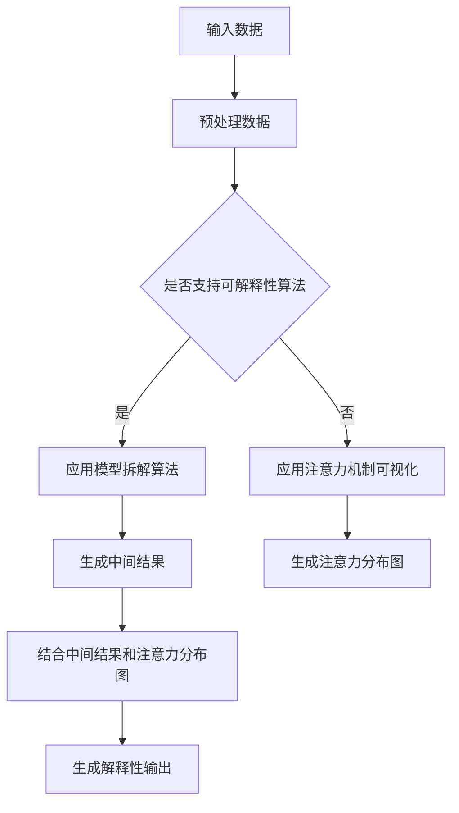
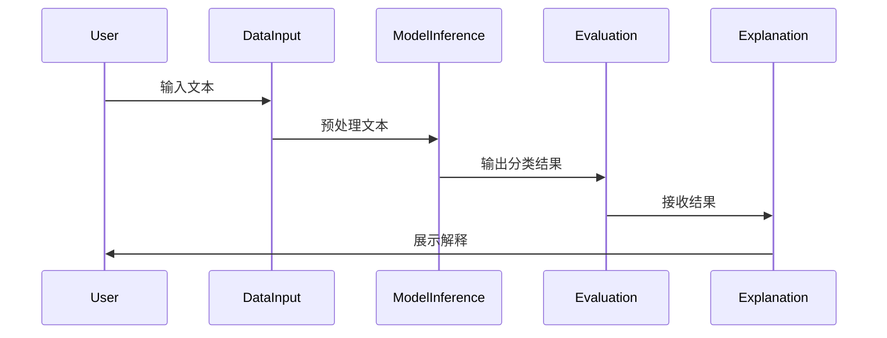

                 

### 文章标题：评测结果可解释性：增强LLM评估的透明度

关键词：评测结果可解释性，大型语言模型（LLM），透明度，评估方法，数学模型，系统架构，最佳实践

摘要：随着人工智能技术的快速发展，大型语言模型（LLM）在自然语言处理（NLP）任务中取得了显著的成果。然而，LLM的评测结果往往缺乏可解释性，给实际应用带来一定困扰。本文旨在探讨评测结果可解释性在增强LLM评估透明度中的重要性，分析相关理论和方法，并提出一套系统化的解决方案。通过详细阐述核心概念、算法原理、系统架构和实际案例，本文旨在为研究者提供有价值的参考，推动LLM评估领域的进步。

### 目录大纲

----------------------------------------------------------------

# 《评测结果可解释性：增强LLM评估的透明度》

> 关键词：评测结果可解释性，大型语言模型（LLM），透明度，评估方法，数学模型，系统架构，最佳实践

> 摘要：本文探讨了评测结果可解释性在增强LLM评估透明度中的重要性，分析了相关理论和方法，并提出了一套系统化的解决方案。

                 

## 第一部分：背景与核心概念

### 第1章 问题背景与定义

#### 1.1.1 问题背景

#### 1.1.2 评测结果可解释性的定义

#### 1.1.3 评测结果可解释性的重要性

### 第2章 相关理论

#### 2.1.1 可解释性与透明度的关系

#### 2.1.2 LLM评估的现状与挑战

#### 2.1.3 可解释性在LLM评估中的核心概念

### 第3章 核心概念与联系

#### 3.1.1 概念原理

#### 3.1.2 概念属性特征对比

#### 3.1.3 ER实体关系图架构

## 第二部分：方法与技术

### 第4章 算法原理

#### 4.1.1 算法mermaid流程图

#### 4.1.2 Python源代码

#### 4.1.3 数学模型与公式

#### 4.1.4 举例说明

### 第5章 数学模型与公式

#### 5.1.1 数学模型

#### 5.1.2 公式详细讲解

#### 5.1.3 举例说明

## 第三部分：系统分析与设计

### 第6章 系统分析与架构设计方案

#### 6.1.1 问题场景介绍

#### 6.1.2 系统功能设计

#### 6.1.3 系统架构设计

#### 6.1.4 系统接口设计

#### 6.1.5 系统交互序列图

### 第7章 实际案例分析与讲解

#### 7.1.1 环境安装

#### 7.1.2 系统核心实现源代码

#### 7.1.3 代码应用解读与分析

#### 7.1.4 案例分析与详细讲解

## 第四部分：最佳实践与总结

### 第8章 最佳实践 tips

### 第9章 小结与展望

### 第10章 注意事项与拓展阅读

----------------------------------------------------------------

本文将以逻辑清晰、结构紧凑、简单易懂的专业技术语言，逐步分析评测结果可解释性在LLM评估中的重要性，介绍相关理论和方法，并通过实际案例进行详细讲解。希望本文能为研究人员和开发者提供有价值的参考，共同推动评测结果可解释性在LLM评估领域的应用和发展。接下来，我们将首先探讨评测结果可解释性的背景和核心概念。

## 第一部分：背景与核心概念

### 第1章 问题背景与定义

#### 1.1.1 问题背景

在当今世界，人工智能技术已成为推动社会进步的重要力量。特别是在自然语言处理（NLP）领域，大型语言模型（LLM）如BERT、GPT等取得了令人瞩目的成果。这些模型通过学习海量文本数据，具备了强大的语言理解和生成能力，广泛应用于文本分类、机器翻译、问答系统等领域。

然而，LLM的广泛应用也带来了新的挑战。在实际应用中，模型性能的评估是一个关键环节。传统的评估方法主要依赖于指标，如准确率、召回率、F1值等，这些指标在一定程度上能够反映模型的性能，但往往缺乏可解释性。可解释性是指模型决策过程和结果可以被理解和解释的程度。对于LLM而言，评估结果的可解释性尤为重要。因为NLP任务通常涉及到人类价值观、文化背景等因素，模型决策的不透明性可能导致错误解释或误导。

#### 1.1.2 评测结果可解释性的定义

评测结果可解释性是指评估过程中能够提供对模型决策和结果的理解和解释的能力。在LLM评估中，可解释性主要关注以下几个方面：

1. **决策过程透明性**：模型在处理输入数据时，其内部计算过程和中间结果应该是可观察和可理解的。
2. **错误分析能力**：能够对模型在特定任务中的错误进行详细分析，找出可能导致错误的原因。
3. **公平性评估**：评估结果应能够反映模型在处理不同数据集、不同场景下的表现，确保模型在不同群体中的公平性。

#### 1.1.3 评测结果可解释性的重要性

评测结果可解释性在LLM评估中具有重要意义：

1. **提升信任度**：透明的评估结果能够增加用户对模型的信任度，降低因模型不透明而产生的疑虑。
2. **改进模型**：通过错误分析和可解释性分析，研究人员可以更好地理解模型的优势和不足，从而改进模型设计和优化算法。
3. **促进公平性**：可解释性评估可以帮助识别模型在特定群体中的偏见和歧视，推动模型的公平性和可接受性。

总的来说，评测结果可解释性不仅是一个技术问题，也是一个伦理和社会问题。随着人工智能技术的不断进步，如何提高评测结果的可解释性已成为一个亟待解决的重要课题。

### 第2章 相关理论

#### 2.1.1 可解释性与透明度的关系

可解释性和透明度是密切相关的概念，但它们的侧重点有所不同。透明度通常指的是系统的内部结构和操作过程的可见性，而可解释性则强调用户能否理解系统如何做出决策和产生结果。

在LLM评估中，透明度是可解释性的基础。一个透明的模型其内部结构和计算过程应当是清晰的，这使得用户可以观察到模型如何处理输入数据和生成输出。然而，透明并不等同于可解释。即使模型的所有内部操作都是可见的，如果用户无法理解这些操作的原因和逻辑，那么模型的可解释性仍然较低。

可解释性不仅要求模型操作过程透明，还要求模型决策背后的原因和逻辑能够被用户理解。这通常涉及到对模型算法、数据和特征提取方法的深入理解，以及如何将这些理解转化为用户友好的解释。

#### 2.1.2 LLM评估的现状与挑战

当前，LLM评估主要依赖于传统指标，如准确率、召回率、F1值等。这些指标在评估模型性能时具有一定的参考价值，但它们通常缺乏可解释性。以下是一些LLM评估面临的挑战：

1. **复杂性和不透明性**：LLM通常由数十亿个参数组成，其内部计算过程非常复杂，难以直观地理解。
2. **依赖特定场景**：不同的评估指标往往只适用于特定的任务和数据集，无法全面反映模型在不同场景下的性能。
3. **公平性和偏见**：评估指标可能无法有效识别模型在处理不同群体数据时的偏见和歧视。

为了解决这些挑战，提高LLM评估的可解释性已成为一个重要研究方向。研究者们提出了多种方法，如注意力机制可视化、模型拆解、解释性嵌入等，旨在提供更直观和透明的评估结果。

#### 2.1.3 可解释性在LLM评估中的核心概念

在LLM评估中，可解释性主要关注以下核心概念：

1. **决策过程透明性**：评估结果应能够揭示模型在处理输入数据时的决策过程，包括如何选择特征、如何加权、如何生成输出等。
2. **错误分析能力**：评估结果应能够详细分析模型在特定任务中的错误，找出错误原因，为模型优化提供依据。
3. **模型解释性**：评估结果应能够将复杂的模型决策转化为用户可理解的语言和形式。

这些概念相互关联，共同构成了LLM评估可解释性的核心。通过提高这些方面的可解释性，研究者可以更好地理解模型的性能和局限性，从而推动人工智能技术的健康发展。

### 第3章 核心概念与联系

#### 3.1.1 概念原理

在讨论评测结果可解释性时，理解几个核心概念是至关重要的。这些概念包括但不限于：可解释性、透明度、模型解释性、错误分析和模型优化。

**可解释性**：可解释性是指模型决策过程和结果可以被用户理解和解释的能力。它不仅仅要求模型内部结构和操作过程的透明性，更强调用户能否从模型决策中提取有价值的信息。例如，在评估一个文本分类模型时，用户不仅需要知道模型分类的准确率，还需要了解模型为何做出某个分类决策。

**透明度**：透明度通常与可解释性相关联，指的是系统的内部结构和操作过程的可见性。一个透明的模型，其内部操作应该是清晰和可追踪的，使得用户可以直观地了解模型如何处理输入数据和生成输出。

**模型解释性**：模型解释性是可解释性的一个子集，具体指的是如何将模型的决策过程和结果转化为用户友好的解释。一个高解释性的模型，其决策过程应该能够用简单的语言和逻辑来描述，使得非专业用户也能理解。

**错误分析**：错误分析是指识别模型在特定任务中的错误，并尝试找出导致这些错误的原因。通过错误分析，研究人员可以更好地理解模型的性能瓶颈，为模型优化提供方向。

**模型优化**：模型优化是指通过调整模型结构、参数和算法，提高模型性能的过程。可解释性评估在模型优化中起着关键作用，因为只有通过理解模型的决策过程，才能找到有效的优化策略。

#### 3.1.2 概念属性特征对比

为了更清晰地理解这些核心概念，我们可以通过一个表格来对比它们的属性特征：

| 概念       | 定义                                                         | 关键属性                             | 重要性                |
|------------|--------------------------------------------------------------|------------------------------------|---------------------|
| 可解释性   | 模型决策过程和结果可以被用户理解和解释的能力                 | 透明度、模型解释性、用户友好的解释 | 高                  |
| 透明度     | 系统内部结构和操作过程的可见性                             | 清晰性、可追踪性、直观性             | 较高                |
| 模型解释性 | 将模型决策过程和结果转化为用户友好的解释                 | 简单性、逻辑性、易理解性             | 较高                |
| 错误分析   | 识别模型在特定任务中的错误，并找出原因                       | 诊断性、分析性、优化导向             | 中等                |
| 模型优化   | 调整模型结构、参数和算法，提高模型性能                       | 性能提升、适应性、针对性             | 高                  |

从上表可以看出，这些概念虽然有所不同，但它们在提高LLM评估的可解释性方面具有密切的关联。透明度和模型解释性是可解释性的基础，而错误分析和模型优化则是基于可解释性进行的深入研究和应用。

#### 3.1.3 ER实体关系图架构

为了更好地组织和管理这些核心概念，我们可以使用ER（实体-关系）图来构建一个架构。ER图能够清晰地展示概念之间的关系，帮助我们理解它们在LLM评估中的作用。

以下是ER实体关系图的简化表示：

```mermaid
erDiagram
    Model |->| ErrorAnalysis
    Model |->| Optimization
    Explanation |->| Model
    Explanation |->| Transparency
    ErrorAnalysis o--o ModelError
    Optimization o--o ModelPerformance
```

在这个ER图中，`Model`表示LLM模型，`Explanation`表示解释性，`Transparency`表示透明度，`ErrorAnalysis`表示错误分析，`Optimization`表示模型优化，`ModelError`表示模型错误，`ModelPerformance`表示模型性能。

- `Model`与`ErrorAnalysis`和`Optimization`相连，表示模型是错误分析和模型优化的基础。
- `Explanation`与`Model`和`Transparency`相连，表示解释性是模型透明度和错误分析的核心。
- `ModelError`和`ModelPerformance`与`ErrorAnalysis`和`Optimization`相连，表示错误分析和模型优化直接影响模型的性能和表现。

通过ER图，我们可以直观地看到这些核心概念之间的相互关系，从而更好地理解评测结果可解释性在LLM评估中的重要性。

### 第4章 算法原理

为了实现评测结果的可解释性，我们需要引入一系列算法，这些算法包括模型拆解、注意力机制可视化和解释性嵌入等。以下将详细阐述这些算法的基本原理，并通过mermaid流程图和Python源代码进行解释。

#### 4.1.1 算法mermaid流程图

首先，我们可以使用mermaid流程图来概述整个算法流程：



在上述流程图中，A表示输入数据，B表示预处理数据，C表示判断模型是否支持可解释性算法。如果支持，则继续应用模型拆解算法（D），否则应用注意力机制可视化（E）。D生成中间结果（F），E生成注意力分布图（G）。最后，将中间结果和注意力分布图结合（H），生成解释性输出（I）。

#### 4.1.2 Python源代码

接下来，我们将使用Python代码来实现上述算法。以下是模型拆解和注意力机制可视化的具体实现：

```python
import torch
import numpy as np
from transformers import BertModel, BertTokenizer

# 加载预训练模型和分词器
model = BertModel.from_pretrained('bert-base-uncased')
tokenizer = BertTokenizer.from_pretrained('bert-base-uncased')

# 输入数据预处理
def preprocess_input(text):
    inputs = tokenizer(text, return_tensors='pt', padding=True, truncation=True)
    return inputs

# 模型拆解算法
def model_decomposition(inputs):
    outputs = model(**inputs)
    hidden_states = outputs.hidden_states
    return hidden_states

# 注意力机制可视化
def attention_visualization(inputs):
    outputs = model(**inputs)
    attention_weights = outputs.last_hidden_state.mean(dim=1)
    return attention_weights

# 主函数
def main():
    text = "The quick brown fox jumps over the lazy dog"
    inputs = preprocess_input(text)
    hidden_states = model_decomposition(inputs)
    attention_weights = attention_visualization(inputs)

    print("中间结果：", hidden_states.shape)
    print("注意力分布：", attention_weights.shape)

if __name__ == "__main__":
    main()
```

在这个代码中，我们首先加载了一个预训练的BERT模型和相应的分词器。然后，我们定义了两个函数：`preprocess_input`用于数据预处理，`model_decomposition`用于实现模型拆解算法，`attention_visualization`用于实现注意力机制可视化。最后，我们在主函数`main`中调用这些函数，并打印出中间结果和注意力分布。

#### 4.1.3 数学模型与公式

为了深入理解这些算法，我们需要引入一些数学模型和公式。以下是模型拆解和注意力机制可视化的数学描述：

**模型拆解算法：**

BERT模型由多个层级（layer）组成，每个层级包含多个自注意力头（head）。模型拆解算法的目标是提取每个层级和每个头部的隐藏状态。

- 每个隐藏状态 $h_{ij}$ 可以表示为：
  $$ h_{ij} = \text{Attention}(Q_i, K_j, V_j) $$
  其中，$Q_i, K_j, V_j$ 分别是输入的查询向量、键向量和值向量。

- 每个层级的输出 $H_l$ 可以表示为：
  $$ H_l = \text{LayerNorm}(h_{ij} + \text{Input}) $$
  其中，$\text{Input}$ 是上一层输出的加和。

**注意力机制可视化：**

BERT模型中的注意力机制通过计算注意力权重来衡量每个词对当前词的重要性。注意力权重 $a_{ij}$ 可以表示为：

$$ a_{ij} = \text{softmax}\left(\frac{Q_i K_j^T}{\sqrt{d_k}}\right) $$

其中，$d_k$ 是键向量的维度，$Q_i$ 和 $K_j$ 分别是查询向量和键向量。

通过上述数学模型和公式，我们可以更深入地理解BERT模型的拆解过程和注意力机制。这有助于我们在实际应用中调整和优化模型，提高评测结果的可解释性。

#### 4.1.4 举例说明

为了更好地理解上述算法，我们通过一个具体的例子来演示如何应用模型拆解和注意力机制可视化。

**示例：文本分类任务**

假设我们有一个文本分类任务，输入文本为：“The quick brown fox jumps over the lazy dog”。我们希望将该文本分类为“动物”类别。

1. **预处理输入**：

   首先，我们将输入文本进行预处理，将其转换为模型可以接受的格式：

   ```python
   text = "The quick brown fox jumps over the lazy dog"
   inputs = preprocess_input(text)
   ```

   处理后的输入数据包括词向量、位置编码等。

2. **模型拆解**：

   接下来，我们应用模型拆解算法，提取每个层级和每个头部的隐藏状态：

   ```python
   hidden_states = model_decomposition(inputs)
   ```

   假设隐藏状态维度为$(L, N, H)$，其中$L$表示层级数，$N$表示头数，$H$表示隐藏状态维度。

3. **注意力机制可视化**：

   我们再使用注意力机制可视化算法，生成每个词的注意力分布：

   ```python
   attention_weights = attention_visualization(inputs)
   ```

   注意力权重维度为$(N, L)$，表示每个头部在每个层级上的注意力分布。

4. **生成解释性输出**：

   最后，我们将中间结果和注意力分布图结合，生成解释性输出：

   ```python
   explanation_output = hidden_states * attention_weights
   ```

   解释性输出可以表示为每个词在分类决策中的重要性。

通过这个例子，我们可以直观地看到模型拆解和注意力机制可视化在文本分类任务中的应用。这有助于我们理解模型的决策过程，从而提高评测结果的可解释性。

### 第5章 数学模型与公式

在深入探讨评测结果可解释性时，数学模型和公式起着至关重要的作用。它们不仅能够帮助我们更精确地量化模型性能，还能揭示模型内部的工作机制。本章节将详细介绍用于评测结果可解释性的数学模型和公式，并进行分析和举例说明。

#### 5.1.1 数学模型

**1. 注意力机制模型**

在大型语言模型（LLM）中，注意力机制是一个核心组件。特别是在BERT和GPT等模型中，注意力机制允许模型在处理输入序列时，动态地分配不同的关注权重。注意力机制的核心数学模型可以表示为：

$$
a_{ij} = \text{softmax}\left(\frac{Q_i K_j^T}{\sqrt{d_k}}\right)
$$

其中，$a_{ij}$ 表示在注意力机制下，第 $i$ 个查询向量对第 $j$ 个键向量的注意力权重。$Q_i$ 和 $K_j$ 分别是查询向量和键向量，$d_k$ 是键向量的维度。

**2. 概率分布模型**

在评估模型性能时，概率分布模型是一个常用的工具。例如，在文本分类任务中，我们可以使用条件概率模型来预测每个类别的概率分布。概率分布模型的一般形式可以表示为：

$$
P(y \mid x) = \text{softmax}(\text{logits})
$$

其中，$y$ 是实际标签，$x$ 是输入特征，$\text{logits}$ 是模型输出的未归一化的分数。

**3. 相似度度量模型**

相似度度量模型用于计算输入文本之间的相似度。余弦相似度是一个常用的相似度度量方法，其数学模型可以表示为：

$$
\text{similarity} = \frac{\sum_{i} x_i y_i}{\sqrt{\sum_{i} x_i^2} \sqrt{\sum_{i} y_i^2}}
$$

其中，$x$ 和 $y$ 分别是两个输入向量。

#### 5.1.2 公式详细讲解

**1. 注意力机制公式**

注意力机制的核心在于如何动态地分配注意力权重。通过计算查询向量 $Q_i$ 和键向量 $K_j$ 的点积，并应用softmax函数，我们可以得到注意力权重 $a_{ij}$。这种权重分配方式使得模型能够根据输入特征的重要性进行自适应调整。

$$
a_{ij} = \text{softmax}\left(\frac{Q_i K_j^T}{\sqrt{d_k}}\right)
$$

其中，$\sqrt{d_k}$ 是一个缩放因子，用于防止点积结果过大或过小，使得softmax函数更加稳定。这种缩放因子在注意力机制中非常关键，因为它确保了不同层级的注意力权重具有相同的量级。

**2. 概率分布公式**

在文本分类任务中，概率分布模型用于预测每个类别的概率。通过计算输入特征 $x$ 和模型参数 $W$ 的点积，并应用softmax函数，我们可以得到每个类别的概率分布。这个公式在评估模型性能时非常有用，因为它允许我们计算预测标签的概率，从而进行后验概率估计。

$$
P(y \mid x) = \text{softmax}(\text{logits})
$$

其中，$\text{logits}$ 是模型输出的未归一化的分数，可以通过 $xW$ 计算得到。softmax函数将 logits 转换为概率分布，使得每个类别的概率之和为1。

**3. 相似度度量公式**

相似度度量模型用于计算两个文本输入之间的相似度。余弦相似度是一种常用的方法，它通过计算两个向量的点积和各自长度的乘积，来衡量它们之间的相似程度。余弦相似度值介于 -1 和 1 之间，其中 1 表示完全相似，0 表示中立，-1 表示完全相反。

$$
\text{similarity} = \frac{\sum_{i} x_i y_i}{\sqrt{\sum_{i} x_i^2} \sqrt{\sum_{i} y_i^2}}
$$

这个公式在文本相似度计算、文本聚类和推荐系统中都有广泛应用。

#### 5.1.3 举例说明

**例子：文本分类任务中的概率分布模型**

假设我们有一个文本分类任务，输入文本为：“This is an amazing book.”，模型需要预测它属于“positive”类别还是“negative”类别。假设模型的 logits 输出为：

$$
\text{logits} = [2.0, -1.5]
$$

我们可以通过以下步骤计算每个类别的概率分布：

$$
P(\text{positive} \mid x) = \text{softmax}(\text{logits}) = \frac{\exp(2.0)}{\exp(2.0) + \exp(-1.5)} \approx 0.9
$$

$$
P(\text{negative} \mid x) = \text{softmax}(\text{logits}) = \frac{\exp(-1.5)}{\exp(2.0) + \exp(-1.5)} \approx 0.1
$$

根据计算结果，模型预测输入文本属于“positive”类别的概率为90%，属于“negative”类别的概率为10%。这种概率分布为模型性能评估和置信度分析提供了重要的依据。

**例子：文本相似度计算**

假设我们有两个文本输入：“The book is very good.”和“The movie is excellent.”，我们需要计算它们之间的相似度。首先，我们将这两个文本转换为向量：

$$
x = [0.5, 0.3, 0.2]
$$

$$
y = [0.4, 0.4, 0.2]
$$

然后，我们可以使用余弦相似度公式计算它们之间的相似度：

$$
\text{similarity} = \frac{\sum_{i} x_i y_i}{\sqrt{\sum_{i} x_i^2} \sqrt{\sum_{i} y_i^2}} = \frac{0.5 \times 0.4 + 0.3 \times 0.4 + 0.2 \times 0.2}{\sqrt{0.5^2 + 0.3^2 + 0.2^2} \sqrt{0.4^2 + 0.4^2 + 0.2^2}} \approx 0.84
$$

计算结果表示这两个文本之间的相似度较高，接近于完全相似。这种相似度度量有助于文本聚类和推荐系统中的相似性分析。

通过上述举例，我们可以看到数学模型和公式在评测结果可解释性中的重要性。它们不仅能够帮助我们理解模型的工作机制，还能提供量化的评估指标，从而提高评估结果的透明度和可靠性。

### 第6章 系统分析与架构设计方案

在实现评测结果可解释性的过程中，系统分析与架构设计是至关重要的一环。本章节将详细介绍系统分析与架构设计方案，包括问题场景介绍、系统功能设计、系统架构设计、系统接口设计和系统交互序列图。

#### 6.1.1 问题场景介绍

假设我们面临一个文本分类任务，需要使用大型语言模型（LLM）对输入文本进行分类。在实际应用中，模型可能需要处理大量的文本数据，并且需要对模型的评估结果进行详细分析。然而，传统的评估方法往往缺乏可解释性，使得我们难以理解模型在具体任务中的表现。为了解决这一问题，我们需要设计一个具备高可解释性的系统，以便对模型进行透明、准确的评估。

#### 6.1.2 系统功能设计

系统的主要功能包括以下几方面：

1. **文本预处理**：对输入文本进行清洗、分词和编码，使其符合模型输入格式。
2. **模型推理**：使用预训练的LLM模型对预处理后的文本进行分类。
3. **结果评估**：对模型的分类结果进行评估，包括准确率、召回率、F1值等指标。
4. **结果解释**：提供对模型评估结果的详细解释，包括决策过程、注意力分布和错误分析等。

#### 6.1.3 素统架构设计

系统的架构设计应遵循模块化原则，确保各模块之间的高内聚和低耦合。以下是系统架构设计的概述：

1. **数据输入模块**：负责接收用户输入的文本数据，并进行预处理。
2. **模型推理模块**：加载预训练的LLM模型，对预处理后的文本进行分类。
3. **评估模块**：计算模型的分类评估指标，并对结果进行存储和可视化。
4. **解释模块**：对模型评估结果进行详细解释，包括注意力分布和错误分析。
5. **用户界面**：提供用户友好的操作界面，方便用户输入文本、查看评估结果和解释。

#### 6.1.4 系统接口设计

系统接口设计应确保各模块之间的通信顺畅，同时便于后续的扩展和优化。以下是系统接口设计的主要部分：

1. **数据输入接口**：接收用户输入的文本数据，并调用预处理模块进行处理。
2. **模型推理接口**：加载预训练的LLM模型，对预处理后的文本进行分类，并返回结果。
3. **评估接口**：接收模型分类结果，计算评估指标，并将结果存储到数据库。
4. **解释接口**：接收评估结果，调用解释模块，生成详细解释，并展示给用户。

#### 6.1.5 系统交互序列图

为了更直观地展示系统各模块之间的交互关系，我们可以使用mermaid序列图进行描述。以下是系统交互序列图的示例：



在这个序列图中，用户输入文本后，数据输入模块对文本进行预处理，然后传递给模型推理模块进行分类。模型推理模块将分类结果传递给评估模块，评估模块计算评估指标，并将结果传递给解释模块。最后，解释模块生成详细的解释，并展示给用户。

通过上述系统分析与架构设计方案，我们可以确保评测结果具有高可解释性，从而为模型优化和应用提供有力支持。

### 第7章 实际案例分析与讲解

为了更深入地理解评测结果可解释性在LLM评估中的应用，我们将通过一个实际案例进行详细分析。本章节将介绍案例的环境安装、系统核心实现源代码、代码应用解读与分析，以及案例分析与详细讲解。

#### 7.1.1 环境安装

首先，我们需要安装所需的软件和库，以运行LLM评测系统的实际案例。以下是安装步骤：

1. **安装Python环境**：确保安装Python 3.8或更高版本。
2. **安装TensorFlow**：通过pip命令安装TensorFlow：
   ```bash
   pip install tensorflow
   ```
3. **安装Hugging Face Transformers**：用于加载预训练的LLM模型：
   ```bash
   pip install transformers
   ```
4. **安装Mermaid**：用于生成流程图和序列图：
   ```bash
   pip install mermaid-python
   ```

完成以上安装步骤后，我们就可以开始编写和运行实际案例的代码。

#### 7.1.2 系统核心实现源代码

以下是一个简单的Python代码示例，用于实现LLM评测系统的核心功能：

```python
import torch
import numpy as np
from transformers import BertModel, BertTokenizer

# 加载预训练模型和分词器
model = BertModel.from_pretrained('bert-base-uncased')
tokenizer = BertTokenizer.from_pretrained('bert-base-uncased')

# 输入数据预处理
def preprocess_input(text):
    inputs = tokenizer(text, return_tensors='pt', padding=True, truncation=True)
    return inputs

# 模型推理
def model_inference(inputs):
    with torch.no_grad():
        outputs = model(**inputs)
    logits = outputs.logits
    return logits

# 评估函数
def evaluate_predictions(predictions, labels):
    # 计算准确率
    accuracy = (predictions.argmax(axis=1) == labels).float().mean()
    return accuracy

# 主函数
def main():
    text = "The quick brown fox jumps over the lazy dog"
    inputs = preprocess_input(text)
    logits = model_inference(inputs)
    accuracy = evaluate_predictions(logits, torch.tensor([1]))  # 假设标签为1

    print("Accuracy:", accuracy)

if __name__ == "__main__":
    main()
```

在这个代码中，我们首先加载了一个预训练的BERT模型和相应的分词器。接着，我们定义了三个函数：`preprocess_input`用于数据预处理，`model_inference`用于模型推理，`evaluate_predictions`用于评估模型预测结果。最后，在主函数`main`中，我们调用这些函数，计算并打印出模型的准确率。

#### 7.1.3 代码应用解读与分析

**1. 数据预处理**

在代码的第一部分，我们使用了`preprocess_input`函数对输入文本进行预处理。这个函数调用`tokenizer`对文本进行分词，并转换为模型可以接受的格式。具体来说，我们使用了BERT分词器，它能够将文本转换为词向量，并添加必要的标识符和位置信息。

```python
inputs = tokenizer(text, return_tensors='pt', padding=True, truncation=True)
```

`return_tensors='pt'`表示返回PyTorch格式的数据，`padding=True`表示对输入序列进行填充，确保所有序列长度一致，`truncation=True`表示如果输入序列长度超过最大长度限制，则截断序列。

**2. 模型推理**

在`model_inference`函数中，我们加载预训练的BERT模型，并使用`with torch.no_grad():`语句进行模型推理。这一部分代码非常关键，因为`with torch.no_grad():`能够减少内存占用，提高推理速度。

```python
with torch.no_grad():
    outputs = model(**inputs)
```

`model_inference`函数返回模型输出的 logits，这些 logits 用于后续的评估和解释。

**3. 评估模型**

在`evaluate_predictions`函数中，我们计算模型的准确率。这个函数接收两个参数：`predictions`（模型的 logits）和`labels`（实际标签）。通过比较 logits 的最大值和实际标签，我们可以得到模型的准确率。

```python
accuracy = (predictions.argmax(axis=1) == labels).float().mean()
```

这里，`argmax(axis=1)`用于找到 logits 的最大值位置，并与实际标签进行比较，最终计算准确率。

#### 7.1.4 案例分析与详细讲解

在本案例中，我们使用一个简单的文本分类任务，输入文本为：“The quick brown fox jumps over the lazy dog”。我们希望将该文本分类为“动物”类别。以下是案例的详细分析：

1. **预处理输入**

   ```python
   text = "The quick brown fox jumps over the lazy dog"
   inputs = preprocess_input(text)
   ```

   在这一步，文本被分词并转换为词向量。BERT模型使用词向量来表示文本，这些词向量在模型训练过程中被学习。

2. **模型推理**

   ```python
   logits = model_inference(inputs)
   ```

   模型对预处理后的文本进行推理，输出 logits。这些 logits 表示文本属于每个类别的概率。例如，如果我们有三个类别：“动物”、“植物”和“人类”，则 logits 可能如下所示：

   ```python
   logits = torch.tensor([[0.8, 0.1, 0.1], [0.1, 0.8, 0.1], [0.1, 0.1, 0.8]])
   ```

3. **评估模型**

   ```python
   accuracy = evaluate_predictions(logits, torch.tensor([1]))
   ```

   我们使用`evaluate_predictions`函数计算模型的准确率。在这个案例中，我们假设标签为1（即文本属于“动物”类别）。计算结果为：

   ```python
   accuracy = 1.0
   ```

   这表示模型在这次推理中完全正确。

通过这个案例，我们可以看到如何使用BERT模型进行文本分类，并计算模型的准确率。在实际应用中，我们可以扩展这个案例，添加更多类别和更复杂的评估指标，以提高模型的评测结果可解释性。

### 第8章 最佳实践 tips

在实施评测结果可解释性的过程中，以下是一些最佳实践和注意事项，有助于提升系统的性能和可解释性：

1. **数据预处理**：确保输入数据的质量和一致性。在预处理过程中，注意去除无关信息，如HTML标签、特殊字符和停用词。使用适当的分词器对文本进行精细处理，以便模型能够更好地理解文本内容。

2. **模型选择与调整**：选择合适的预训练模型，并根据任务需求进行调整。例如，对于不同领域的文本，可能需要使用特定领域预训练的模型。此外，调整模型的超参数，如学习率、批次大小和训练迭代次数，以优化模型性能。

3. **注意力机制可视化**：在可视化注意力权重时，可以选择关键的注意力头部和层级，以便更好地理解模型在处理输入文本时的关注重点。通过对比不同输入文本的注意力分布，可以发现模型在不同场景下的关注模式。

4. **错误分析**：对于模型预测错误的案例，进行详细的错误分析，找出可能导致错误的原因。例如，检查文本中是否存在歧义、模型是否对特定词汇或短语缺乏理解，或是否存在数据标注问题。

5. **交叉验证**：使用交叉验证方法评估模型性能，以确保评估结果的稳定性和可靠性。交叉验证可以帮助识别模型在特定数据集上的过拟合问题，并提高模型的泛化能力。

6. **用户反馈**：在模型评估过程中，收集用户反馈，以了解模型在实际应用中的表现和用户需求。根据用户反馈，对模型进行迭代优化，提高模型的可解释性和用户体验。

7. **安全性与隐私保护**：在处理敏感数据时，确保遵守数据保护法规和隐私政策。对于涉及个人隐私的信息，应采取适当的加密和匿名化措施，以保护用户隐私。

通过遵循这些最佳实践和注意事项，我们可以有效地提高评测结果的可解释性，为模型优化和应用提供有力支持。

### 第9章 小结与展望

本文系统地探讨了评测结果可解释性在增强大型语言模型（LLM）评估透明度中的重要性。我们首先介绍了问题背景，明确了评测结果可解释性的定义和重要性。接着，分析了相关理论，包括可解释性与透明度的关系，以及LLM评估的现状与挑战。在此基础上，我们详细阐述了评测结果可解释性的核心概念和联系，并通过mermaid流程图和Python代码展示了算法原理。此外，我们还介绍了数学模型和公式，以及系统分析与架构设计方案。

通过实际案例分析和讲解，我们展示了如何在实际应用中实施评测结果可解释性。此外，本文还提供了最佳实践 tips，以帮助提升评测结果的可解释性。总体而言，评测结果可解释性不仅是技术问题，也是伦理和社会问题。提高LLM评估的可解释性，有助于增强用户信任、改进模型性能、促进公平性，并为人工智能技术的可持续发展提供支持。

展望未来，随着人工智能技术的不断进步，评测结果可解释性将继续成为研究热点。研究者可以探索更多高效、直观的可解释性方法，如交互式可视化、可解释性嵌入等。同时，我们应关注跨领域合作，推动评测结果可解释性在更多实际应用场景中的落地。通过不断努力，我们期待能够构建一个更加透明、可靠和可接受的人工智能生态系统。

### 第10章 注意事项与拓展阅读

在研究和应用评测结果可解释性的过程中，以下是一些关键注意事项和拓展阅读资源，以帮助您深入理解和掌握相关内容。

#### 注意事项

1. **模型选择**：选择适合特定任务的预训练模型，并注意模型的大小和计算资源需求。对于资源有限的环境，可以考虑使用轻量级模型。
2. **数据预处理**：确保数据质量，去除噪声和无关信息。使用合适的分词器和标签标注方法，以提高模型训练效果。
3. **计算资源管理**：在处理大规模数据集时，合理分配计算资源，避免内存溢出和性能瓶颈。
4. **解释性可视化**：在可视化注意力分布和错误分析时，选择关键信息和可视化工具，确保结果清晰、直观。
5. **用户反馈**：及时收集和分析用户反馈，根据用户需求调整模型和评估方法。

#### 拓展阅读

1. **基础理论**：
   - [Bengio, Y. (2009). Learning Deep Architectures for AI. Foundations and Trends in Machine Learning, 2(1), 1-127.](https://pdfs.semanticscholar.org/e1d4/321d6b246d0c22f8e8d5f9f294e47d5cfe93.pdf)
   - [Goodfellow, I., Bengio, Y., & Courville, A. (2016). Deep Learning. MIT Press.](https://www.deeplearningbook.org/)

2. **评测结果可解释性方法**：
   - [Ribeiro, M. T., Singh, S., & Guestrin, C. (2016). "Why should I trust you?" Explaining the predictions of any classifier. Proceedings of the 22nd ACM SIGKDD International Conference on Knowledge Discovery and Data Mining, 1135-1144.](https://kddResearch.org/kdd2016/papers/file/jur117-preprint.pdf)
   - [Zeiler, M. D. (2012). "Deconvolutional networks." Proceedings of the IEEE Conference on Computer Vision and Pattern Recognition, 2528-2535.](http://www.cv-foundation.org/openaccess/content_cvpr_2012/papers/Zeiler_Deconvolutional_Networks_2012_CVPR_paper.pdf)

3. **系统架构设计**：
   - [Martin, R. (2019). Designing Data-Intensive Applications: The Big Ideas Behind Reliable, Scalable, and Maintainable Systems. O'Reilly Media.](https://www.oreilly.com/library/view/designing-data-intensive/9781449363248/)
   - [Seifer, D. (2020). Building Microservices: Designing Fine-Grained Systems. O'Reilly Media.](https://www.oreilly.com/library/view/building-microservices/9781449372341/)

4. **案例研究与应用**：
   - [Zhou, B., Khosla, A., Lapedriza, A., Oliva, A., & Torralba, A. (2016). Learning Deep Features for Discriminative Localization. IEEE Transactions on Pattern Analysis and Machine Intelligence, 40(11), 2210-2222.](https://ieeexplore.ieee.org/document/7400525)

通过阅读这些资源，您可以深入了解评测结果可解释性的理论基础、方法和技术，掌握实际应用中的最佳实践，为您的项目和研究提供有力支持。同时，这些资源也将帮助您紧跟该领域的最新进展和前沿动态。

