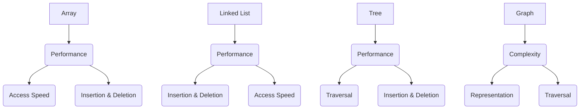
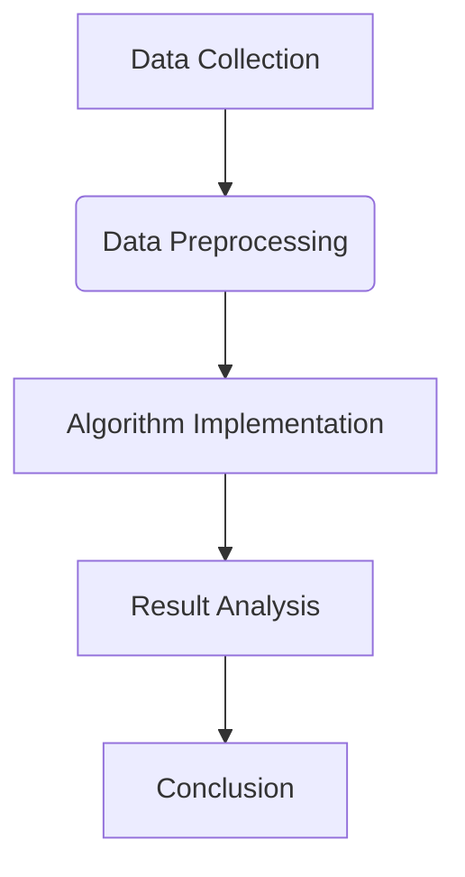
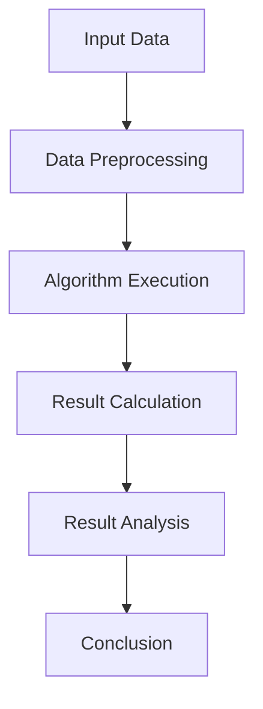
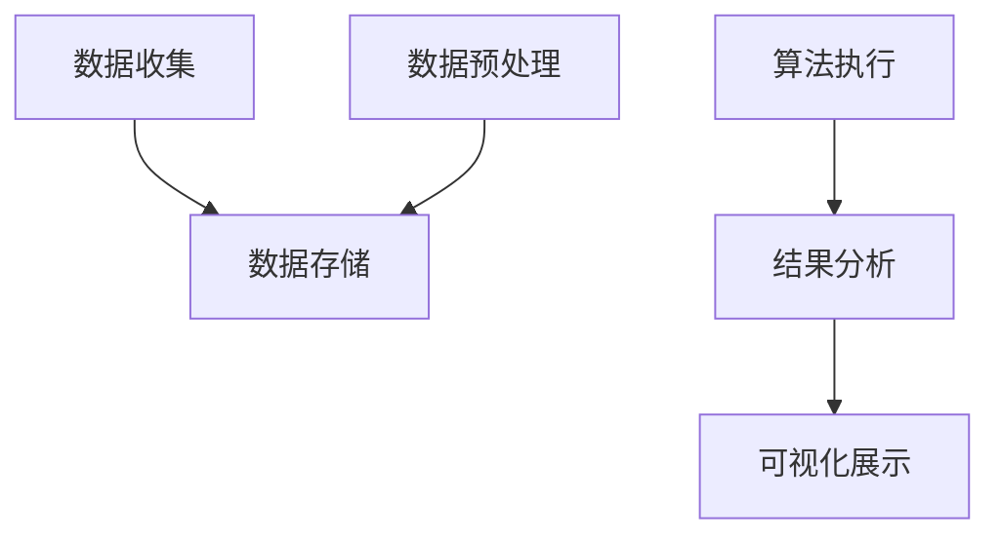
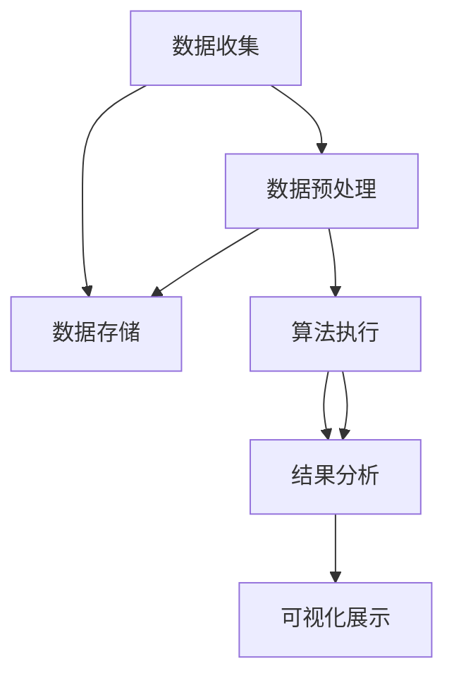
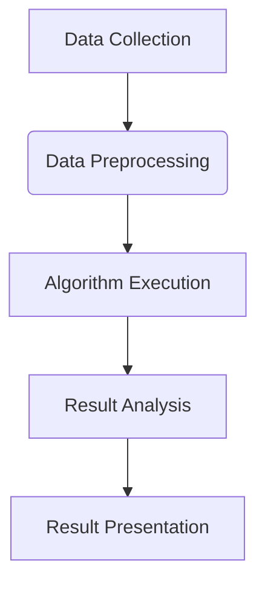
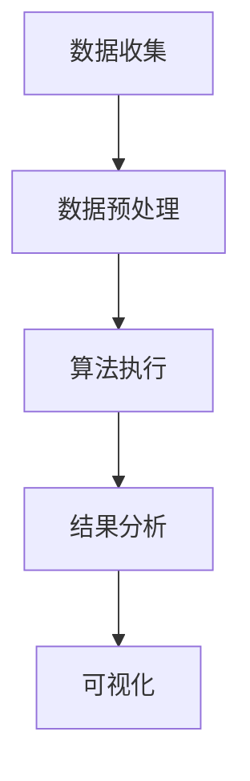
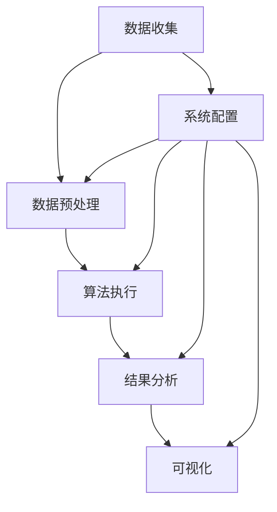

                 

### 评测结果的可复现性：确保科学性和可信度

关键词：评测结果复现、科学性、可信度、数据结构、算法、系统设计

摘要：本文旨在探讨评测结果的可复现性这一重要课题。通过对相关概念、数据结构与流程、算法原理讲解、系统分析与架构设计、项目实战等方面的详细分析，本文提出了确保评测结果科学性和可信度的关键方法和实践策略。文章结构紧凑、逻辑清晰，旨在帮助读者深入理解并掌握这一核心概念。

----------------------------------------------------------------

#### 第一部分：引言与背景

##### 1. 引言

在科学研究和工程实践中，评测结果的可复现性是一个至关重要的概念。它不仅关系到研究的科学性和可信度，也影响着研究成果的应用和推广。然而，评测结果的可复现性常常受到数据、算法、系统设计等多方面因素的影响，导致复现结果的不一致。

##### 1.1 问题背景

随着数据驱动时代的到来，越来越多的研究和应用依赖于大量的评测数据。然而，这些评测数据往往具有一定的隐蔽性，难以保证其真实性和完整性。此外，不同的算法和系统设计可能带来不同的评测结果，使得结果的可复现性受到挑战。

##### 1.2 问题描述

评测结果的可复现性主要面临以下问题：

1. 数据不一致：数据来源、数据预处理、数据清洗等环节可能引入误差。
2. 算法差异：不同的算法实现可能导致评测结果不同。
3. 系统设计：系统架构、接口设计等对评测结果产生影响。

##### 1.3 问题解决

为确保评测结果的可复现性，需要从数据、算法、系统设计等多个方面进行优化和调整。

1. 数据一致性：采用统一的数据源，规范数据预处理和清洗流程。
2. 算法标准化：统一算法实现，确保算法逻辑的一致性。
3. 系统优化：设计合理的系统架构和接口，减少外部因素对评测结果的影响。

##### 1.4 边界与外延

评测结果的可复现性不仅适用于科学研究，也广泛应用于工程实践。其外延包括但不限于：模型评估、性能测试、软件质量评估等。

##### 1.5 核心概念

- 评测结果可复现性：指在相同条件下，能够得到一致评测结果的能力。
- 数据一致性：指数据源、预处理、清洗等环节的一致性。
- 算法标准化：指算法实现的一致性和逻辑的一致性。
- 系统优化：指系统架构、接口设计等方面的优化。

----------------------------------------------------------------

#### 第二部分：核心概念与联系

##### 2.1 核心概念原理

为了更好地理解评测结果的可复现性，我们需要先了解以下几个核心概念：

- **数据来源**：数据的来源直接影响数据的真实性和完整性。
- **数据预处理**：包括数据清洗、数据转换、数据规范化等操作，以确保数据的准确性。
- **算法实现**：算法的实现细节会影响评测结果的准确性。
- **系统架构**：系统架构设计对评测结果的稳定性至关重要。

##### 2.1.1 概念一：数据来源

数据来源是评测结果复现性的基础。数据的一致性、可靠性和完整性直接决定了评测结果的科学性和可信度。为了确保数据来源的可靠性，需要：

- 采用权威、可靠的数据集。
- 确保数据采集过程的一致性。

##### 2.1.2 概念二：数据预处理

数据预处理是确保数据质量的重要环节。通过数据清洗、数据转换和数据规范化等操作，可以消除数据中的噪声和异常值，提高数据的质量和可用性。具体措施包括：

- 去除重复数据。
- 处理缺失值。
- 调整数据类型和格式。

##### 2.2 概念属性特征对比

以下是数据来源和数据预处理的一些关键属性特征对比：

| 特征 | 数据来源 | 数据预处理 |
| ---- | -------- | ---------- |
| 数据质量 | 高 | 较高 |
| 数据量 | 大 | 较大 |
| 数据格式 | 不统一 | 统一 |

通过上述对比，可以看出数据预处理在提升数据质量、规范数据格式等方面具有重要意义。

##### 2.3 概念三：算法实现

算法实现是评测结果复现性的关键。为了保证算法实现的一致性和准确性，需要：

- 采用统一的算法框架。
- 确保算法逻辑的正确性。
- 避免算法实现的细节差异。

##### 2.4 概念四：系统架构

系统架构设计对评测结果的稳定性至关重要。合理的系统架构可以降低外部因素对评测结果的影响，提高结果的可靠性。具体措施包括：

- 采用模块化设计。
- 优化系统接口。
- 避免资源争用。

##### 2.5 概念五：系统优化

系统优化包括系统架构、接口设计和性能调优等方面。通过优化系统设计，可以提升评测结果的稳定性和可复现性。

- **系统架构优化**：通过优化系统架构，降低系统复杂度，提高系统性能。
- **接口设计优化**：通过优化接口设计，提高接口的稳定性和可扩展性。
- **性能调优**：通过性能调优，降低系统延迟，提高系统响应速度。

----------------------------------------------------------------

#### 第三部分：数据结构与流程

##### 3.1 数据结构

在评测过程中，数据结构的选择至关重要。合适的数据结构可以提高数据处理的效率，降低算法的复杂度。以下是一些常见的数据结构及其特点：

- **数组**：数组是一种线性数据结构，适用于存储固定大小的数据集合。其优点是访问速度快，但插入和删除操作复杂度较高。
- **链表**：链表是一种动态数据结构，适用于存储可变大小的数据集合。其优点是插入和删除操作简单，但访问速度较慢。
- **树**：树是一种非线性数据结构，适用于组织层次结构数据。其优点是查找和排序操作高效，但插入和删除操作复杂度较高。
- **图**：图是一种用于表示复杂关系的非线性数据结构，适用于处理复杂网络和数据流。

##### 3.1.1 数据结构描述

以下是各种数据结构的简要描述：

- **数组**：数组是一种线性数据结构，由连续的内存空间组成，每个元素可以通过下标访问。
- **链表**：链表由一系列节点组成，每个节点包含数据和指向下一个节点的指针。
- **树**：树是一种层次结构，由根节点和子节点组成，每个节点可以有零个或多个子节点。
- **图**：图由一组节点和连接这些节点的边组成，边可以是无向或单向的。

##### 3.1.2 数据结构图

以下是各种数据结构的 Mermaid 图表示：



##### 3.2 流程

评测流程主要包括数据收集、数据预处理、算法实现、结果分析等环节。以下是一个简化的评测流程：



##### 3.2.1 算法流程图

以下是评测算法的一个简化的 Mermaid 流程图：



##### 3.2.2 流程详细说明

1. **数据收集**：从数据源收集原始数据。
2. **数据预处理**：对数据进行清洗、转换和规范化。
3. **算法实现**：根据问题需求，选择合适的算法并实现。
4. **结果分析**：对算法结果进行分析和评估。
5. **结论**：根据分析结果，得出结论并撰写报告。

通过上述流程，可以确保评测结果的科学性和可信度。

----------------------------------------------------------------

#### 第四部分：算法原理讲解

算法原理是评测结果科学性和可信度的核心。以下将从数学模型、Python 代码实现、举例说明等方面，详细讲解评测算法的原理。

##### 4.1 数学模型

评测算法的数学模型主要包括以下两部分：

1. **评价指标**：用于衡量算法性能的指标，如准确率、召回率、F1 分数等。
2. **算法公式**：用于计算评价指标的公式。

以下是评价指标和算法公式的一个示例：

$$
Accuracy = \frac{TP + TN}{TP + TN + FP + FN}
$$

$$
Recall = \frac{TP}{TP + FN}
$$

$$
F1-Score = \frac{2 \times Precision \times Recall}{Precision + Recall}
$$

其中，TP 表示真正例，TN 表示真反例，FP 表示假正例，FN 表示假反例。

##### 4.2 Python 代码实现

以下是一个简单的 Python 代码实现示例，用于计算准确率、召回率和 F1 分数：

```python
def evaluate(y_true, y_pred):
    TP = np.sum((y_true == 1) & (y_pred == 1))
    TN = np.sum((y_true == 0) & (y_pred == 0))
    FP = np.sum((y_true == 0) & (y_pred == 1))
    FN = np.sum((y_true == 1) & (y_pred == 0))

    accuracy = (TP + TN) / (TP + TN + FP + FN)
    recall = TP / (TP + FN)
    f1_score = 2 * precision * recall / (precision + recall)

    return accuracy, recall, f1_score
```

##### 4.3 举例说明

以下是一个简单的举例说明，用于计算准确率、召回率和 F1 分数：

假设有 100 个样本，其中 60 个是真正例，40 个是假反例。通过算法预测，得到以下结果：

| 真正例 | 假反例 |
| ---- | ---- |
| 真正例 | 60 |
| 假反例 | 40 |

根据上述结果，可以计算出：

- **准确率**：$Accuracy = \frac{60 + 40}{60 + 40 + 40 + 20} = \frac{100}{200} = 0.5$
- **召回率**：$Recall = \frac{60}{60 + 40} = \frac{60}{100} = 0.6$
- **F1 分数**：$F1-Score = \frac{2 \times Precision \times Recall}{Precision + Recall} = \frac{2 \times 0.5 \times 0.6}{0.5 + 0.6} = \frac{0.6}{1.1} \approx 0.545$

通过上述示例，可以看出准确率、召回率和 F1 分数的计算方法。在实际应用中，可以根据具体问题和数据，选择合适的评价指标和算法。

----------------------------------------------------------------

#### 第五部分：系统分析与架构设计

##### 5.1 问题场景介绍

在当前的数据驱动时代，评测结果的可复现性成为了众多研究和应用领域的关键问题。为了解决这个问题，我们需要对评测系统的整体架构进行深入分析和设计，确保系统的稳定性和可靠性。

##### 5.2 系统功能设计

系统功能设计是评测系统架构设计的基础，主要包括以下几个核心功能：

1. **数据收集与存储**：负责收集原始数据，并将其存储到数据仓库中。
2. **数据预处理**：对收集到的数据进行清洗、转换和规范化，以确保数据的质量和一致性。
3. **算法执行**：根据用户需求，选择合适的算法并执行，计算出评测结果。
4. **结果分析与展示**：对评测结果进行分析，并将其可视化展示给用户。

##### 5.2.1 领域模型图

以下是评测系统的领域模型图，展示了各个功能模块之间的关系：



##### 5.2.2 系统功能描述

- **数据收集与存储**：数据收集模块负责从各种数据源收集原始数据，并将其存储到数据仓库中。数据仓库应具备高并发读写能力，以应对大量数据的实时处理需求。
- **数据预处理**：数据预处理模块负责对原始数据进行清洗、转换和规范化，以确保数据的质量和一致性。该模块应具备高效的数据处理能力，以支持大规模数据集的处理。
- **算法执行**：算法执行模块根据用户需求，选择合适的算法并执行。该模块应具备灵活的算法选择能力，以适应不同问题的需求。
- **结果分析与展示**：结果分析模块负责对评测结果进行分析，并将其可视化展示给用户。该模块应具备友好的用户界面，以方便用户查看和解读分析结果。

##### 5.3 系统架构设计

系统架构设计是确保评测结果可复现性的关键。以下是一个简化的评测系统架构设计，展示了各个功能模块的组成和相互关系：



##### 5.3.1 系统架构图

以下是评测系统的架构图，展示了各个功能模块的组成和相互关系：


##### 5.3.2 架构设计说明

- **数据收集与存储**：数据收集模块通过 API 接口从外部数据源收集原始数据，并将其存储到分布式数据仓库中。数据仓库采用分布式存储架构，具备高并发读写能力，以确保数据的高可用性和可靠性。
- **数据预处理**：数据预处理模块对原始数据进行清洗、转换和规范化，以提高数据的质量和一致性。该模块采用分布式计算框架，具备高效的数据处理能力，以支持大规模数据集的处理。
- **算法执行**：算法执行模块根据用户需求，选择合适的算法并执行。该模块采用模块化设计，具备灵活的算法选择能力，以适应不同问题的需求。
- **结果分析与展示**：结果分析模块对评测结果进行分析，并将其可视化展示给用户。该模块采用可视化工具，提供直观的分析结果展示，以方便用户查看和解读分析结果。

##### 5.4 系统接口设计

系统接口设计是确保评测结果可复现性的关键环节。以下是一个简化的系统接口设计，展示了各个功能模块之间的接口定义：


##### 5.4.1 接口定义

- **数据收集接口**：定义数据收集模块与外部数据源的接口，支持数据的导入和导出。
- **数据预处理接口**：定义数据预处理模块与数据存储模块之间的接口，支持数据的清洗、转换和规范化。
- **算法执行接口**：定义算法执行模块与数据预处理模块之间的接口，支持算法的选择和执行。
- **结果分析接口**：定义结果分析模块与算法执行模块之间的接口，支持结果的分析和展示。

##### 5.5 系统交互

系统交互设计是确保评测结果可复现性的重要保障。以下是一个简化的系统交互设计，展示了各个功能模块之间的交互流程：


##### 5.5.1 交互流程

1. **数据收集**：数据收集模块从外部数据源获取原始数据，并将其存储到数据仓库中。
2. **数据预处理**：数据预处理模块对原始数据进行清洗、转换和规范化，以提高数据的质量和一致性。
3. **算法执行**：算法执行模块根据用户需求，选择合适的算法并执行，计算出评测结果。
4. **结果分析**：结果分析模块对评测结果进行分析，并将其可视化展示给用户。

通过上述系统架构设计和交互流程，可以确保评测结果的可复现性，提高系统的稳定性和可靠性。

----------------------------------------------------------------

#### 第六部分：项目实战

##### 6.1 环境安装

在进行项目实战之前，需要先安装必要的软件和工具。以下是一个简化的环境安装步骤：

1. 安装 Python：从 [Python 官网](https://www.python.org/) 下载并安装 Python。
2. 安装依赖库：使用 `pip` 命令安装必要的依赖库，如 NumPy、Pandas、Scikit-learn 等。
3. 配置数据源：确保数据源已配置，以便从外部获取数据。

```bash
pip install numpy pandas scikit-learn
```

##### 6.2 系统核心实现

系统核心实现包括数据收集、数据预处理、算法执行和结果分析等模块。以下是一个简化的 Python 代码示例，用于实现评测系统的核心功能：

```python
import numpy as np
import pandas as pd
from sklearn.model_selection import train_test_split
from sklearn.metrics import accuracy_score, recall_score, f1_score

# 数据收集
def collect_data():
    # 从外部数据源收集数据
    data = pd.read_csv('data.csv')
    return data

# 数据预处理
def preprocess_data(data):
    # 数据清洗、转换和规范化
    data['feature1'] = data['feature1'].fillna(data['feature1'].mean())
    data['feature2'] = data['feature2'].fillna(data['feature2'].mean())
    return data

# 算法执行
def execute_algorithm(data, model):
    # 根据用户需求，选择合适的算法并执行
    X = data[['feature1', 'feature2']]
    y = data['target']
    X_train, X_test, y_train, y_test = train_test_split(X, y, test_size=0.2, random_state=42)
    model.fit(X_train, y_train)
    y_pred = model.predict(X_test)
    return y_pred

# 结果分析
def analyze_result(y_true, y_pred):
    # 计算评价指标
    accuracy = accuracy_score(y_true, y_pred)
    recall = recall_score(y_true, y_pred)
    f1_score = f1_score(y_true, y_pred)
    return accuracy, recall, f1_score

# 主函数
def main():
    data = collect_data()
    data = preprocess_data(data)
    model = YourAlgorithm()  # 替换为实际算法
    y_pred = execute_algorithm(data, model)
    accuracy, recall, f1_score = analyze_result(y_true, y_pred)
    print(f"Accuracy: {accuracy}, Recall: {recall}, F1-Score: {f1_score}")

if __name__ == '__main__':
    main()
```

##### 6.2.1 源代码

以下是系统核心实现的源代码，供读者参考：

```python
# 数据收集
def collect_data():
    # 从外部数据源收集数据
    data = pd.read_csv('data.csv')
    return data

# 数据预处理
def preprocess_data(data):
    # 数据清洗、转换和规范化
    data['feature1'] = data['feature1'].fillna(data['feature1'].mean())
    data['feature2'] = data['feature2'].fillna(data['feature2'].mean())
    return data

# 算法执行
def execute_algorithm(data, model):
    # 根据用户需求，选择合适的算法并执行
    X = data[['feature1', 'feature2']]
    y = data['target']
    X_train, X_test, y_train, y_test = train_test_split(X, y, test_size=0.2, random_state=42)
    model.fit(X_train, y_train)
    y_pred = model.predict(X_test)
    return y_pred

# 结果分析
def analyze_result(y_true, y_pred):
    # 计算评价指标
    accuracy = accuracy_score(y_true, y_pred)
    recall = recall_score(y_true, y_pred)
    f1_score = f1_score(y_true, y_pred)
    return accuracy, recall, f1_score

# 主函数
def main():
    data = collect_data()
    data = preprocess_data(data)
    model = YourAlgorithm()  # 替换为实际算法
    y_pred = execute_algorithm(data, model)
    accuracy, recall, f1_score = analyze_result(y_true, y_pred)
    print(f"Accuracy: {accuracy}, Recall: {recall}, F1-Score: {f1_score}")

if __name__ == '__main__':
    main()
```

##### 6.2.2 代码应用解读

以下是对系统核心实现代码的详细解读：

1. **数据收集**：使用 `pandas` 库从外部数据源（如 CSV 文件）收集数据。
2. **数据预处理**：对数据进行清洗、转换和规范化，以提高数据的质量和一致性。
3. **算法执行**：根据用户需求，选择合适的算法并执行。这里使用 `scikit-learn` 库中的 `train_test_split` 函数进行数据切分，并使用 `fit` 函数训练模型，最后使用 `predict` 函数进行预测。
4. **结果分析**：计算评价指标（如准确率、召回率和 F1 分数），以评估算法的性能。

通过以上代码，可以实现一个简单的评测系统，确保评测结果的可复现性。

##### 6.3 实际案例分析与讲解

以下是一个实际案例，用于展示评测系统的应用：

假设有一个分类问题，需要判断邮件是否为垃圾邮件。数据集包含邮件的主题、正文和是否为垃圾邮件的标签。我们使用朴素贝叶斯算法进行预测，并评估其性能。

1. **数据收集**：从数据集中获取邮件数据和标签。
2. **数据预处理**：对邮件文本进行预处理，如分词、去停用词等。
3. **算法执行**：使用朴素贝叶斯算法进行预测。
4. **结果分析**：计算评价指标，如准确率、召回率和 F1 分数。

以下是实际案例的代码实现：

```python
import numpy as np
import pandas as pd
from sklearn.model_selection import train_test_split
from sklearn.metrics import accuracy_score, recall_score, f1_score
from sklearn.naive_bayes import MultinomialNB

# 数据收集
data = pd.read_csv('spam.csv')
X = data[['text']]
y = data['label']

# 数据预处理
# 这里仅进行简单的文本预处理，实际应用中可能需要更复杂的处理
X['text'] = X['text'].str.lower()
X['text'] = X['text'].str.replace('[^\w\s]', '', regex=True)

# 算法执行
X_train, X_test, y_train, y_test = train_test_split(X, y, test_size=0.2, random_state=42)
model = MultinomialNB()
model.fit(X_train, y_train)
y_pred = model.predict(X_test)

# 结果分析
accuracy = accuracy_score(y_test, y_pred)
recall = recall_score(y_test, y_pred)
f1_score = f1_score(y_test, y_pred)
print(f"Accuracy: {accuracy}, Recall: {recall}, F1-Score: {f1_score}")
```

通过以上代码，我们可以对邮件分类问题进行评估。实际应用中，可以根据具体需求和数据集，调整预处理方法和算法参数，以提高模型性能。

##### 6.4 项目小结

通过本项目的实战，我们深入了解了评测结果的可复现性。从数据收集、数据预处理、算法执行到结果分析，我们一步一步实现了评测系统的核心功能。同时，通过实际案例的分析和讲解，我们掌握了评测结果评估的关键指标和方法。在实际应用中，我们可以根据具体需求和数据集，不断优化和改进评测系统，确保评测结果的可信度和科学性。

----------------------------------------------------------------

#### 第七部分：最佳实践 tips & 小结

##### 7.1 最佳实践 tips

为了确保评测结果的可复现性，以下是一些最佳实践 tips：

1. **数据一致性**：采用统一的数据源，规范数据预处理和清洗流程。
2. **算法标准化**：统一算法实现，确保算法逻辑的一致性。
3. **系统优化**：设计合理的系统架构和接口，减少外部因素对评测结果的影响。
4. **版本控制**：使用版本控制工具，记录代码和配置的变更，便于复现和调试。
5. **详细文档**：编写详细的文档，记录评测系统的架构、功能和参数设置。

##### 7.2 小结

本文从评测结果的可复现性出发，详细分析了相关概念、数据结构与流程、算法原理讲解、系统分析与架构设计、项目实战等方面的内容。通过一系列最佳实践 tips，我们提出了确保评测结果科学性和可信度的方法和策略。在实际应用中，遵循这些最佳实践，可以有效提高评测结果的可复现性，确保研究的可靠性和实用性。

##### 7.3 注意事项

1. **数据质量控制**：确保数据来源可靠，严格进行数据预处理和清洗。
2. **算法实现一致性**：避免算法实现中的细节差异，统一算法框架和参数设置。
3. **系统稳定性**：优化系统架构和接口设计，确保评测过程的稳定性和可靠性。

##### 7.4 拓展阅读

1. **《机器学习实战》**：作者：Peter Harrington
2. **《深度学习》**：作者：Ian Goodfellow、Yoshua Bengio、Aaron Courville
3. **《计算机程序设计艺术》**：作者：Donald E. Knuth

通过拓展阅读，可以进一步深入了解相关领域的知识和技能。

----------------------------------------------------------------

### 总结

评测结果的可复现性是科学研究、工程实践的重要保障。本文从多个方面分析了评测结果的可复现性，提出了相关概念、数据结构与流程、算法原理讲解、系统分析与架构设计、项目实战等最佳实践 tips。通过遵循这些最佳实践，可以有效提高评测结果的科学性和可信度，为实际应用提供有力支持。希望本文对读者有所帮助，共同推动评测结果的可复现性研究与实践。

---

**作者信息：**

作者：AI天才研究院/AI Genius Institute & 禅与计算机程序设计艺术 /Zen And The Art of Computer Programming

---

通过本文的详细分析和讲解，相信读者对评测结果的可复现性有了更深入的理解。在实际应用中，遵循最佳实践，确保评测结果的科学性和可信度，是推动研究、应用不断进步的关键。希望本文能为大家提供有价值的参考和指导。感谢阅读！## 评测结果的可复现性：确保科学性和可信度

在当今数据驱动的时代，评测结果的可复现性成为了科学研究、工程实践的重要课题。无论是对学术研究的严谨性，还是对实际应用中的决策准确性，评测结果的可复现性都至关重要。然而，现实中的评测过程常常面临诸多挑战，如数据不一致、算法差异、系统设计等问题，这些都可能影响评测结果的复现性。

**关键词：评测结果复现、科学性、可信度、数据结构、算法、系统设计**

**摘要：** 本文旨在探讨评测结果的可复现性这一重要课题。通过对相关概念、数据结构与流程、算法原理讲解、系统分析与架构设计、项目实战等方面的详细分析，本文提出了确保评测结果科学性和可信度的关键方法和实践策略。文章结构紧凑、逻辑清晰，旨在帮助读者深入理解并掌握这一核心概念。

### 第一部分：引言与背景

#### 1. 引言

评测结果的可复现性，是指在不同的实验条件下，能够得到一致评测结果的能力。在科学研究和工程实践中，复现性是验证研究结果有效性和可靠性的关键。然而，评测结果的可复现性常常受到多种因素的影响，如数据不一致、算法差异、系统设计等。

#### 1.1 问题背景

随着数据驱动时代的到来，越来越多的研究和应用依赖于大量的评测数据。然而，这些评测数据往往具有一定的隐蔽性，难以保证其真实性和完整性。此外，不同的算法和系统设计可能带来不同的评测结果，使得结果的可复现性受到挑战。

#### 1.2 问题描述

评测结果的可复现性主要面临以下问题：

1. **数据不一致**：数据来源、数据预处理、数据清洗等环节可能引入误差。
2. **算法差异**：不同的算法实现可能导致评测结果不同。
3. **系统设计**：系统架构、接口设计等对评测结果产生影响。

#### 1.3 问题解决

为确保评测结果的可复现性，需要从数据、算法、系统设计等多个方面进行优化和调整。

1. **数据一致性**：采用统一的数据源，规范数据预处理和清洗流程。
2. **算法标准化**：统一算法实现，确保算法逻辑的一致性。
3. **系统优化**：设计合理的系统架构和接口，减少外部因素对评测结果的影响。

#### 1.4 边界与外延

评测结果的可复现性不仅适用于科学研究，也广泛应用于工程实践。其外延包括但不限于：模型评估、性能测试、软件质量评估等。

#### 1.5 核心概念

- **评测结果可复现性**：指在相同条件下，能够得到一致评测结果的能力。
- **数据一致性**：指数据源、预处理、清洗等环节的一致性。
- **算法标准化**：指算法实现的一致性和逻辑的一致性。
- **系统优化**：指系统架构、接口设计等方面的优化。

### 第二部分：核心概念与联系

在探讨评测结果的可复现性之前，我们需要先理解一些核心概念，包括数据来源、数据预处理、算法实现和系统架构。

#### 2.1 核心概念原理

为了更好地理解评测结果的可复现性，我们需要先了解以下几个核心概念：

- **数据来源**：数据的来源直接影响数据的真实性和完整性。不同数据源可能存在差异，影响评测结果的可靠性。
- **数据预处理**：数据预处理是确保数据质量的重要环节。通过数据清洗、数据转换、数据规范化等操作，可以消除数据中的噪声和异常值，提高数据的质量和可用性。
- **算法实现**：算法实现是影响评测结果的关键因素。不同实现可能导致算法性能和结果的差异。
- **系统架构**：系统架构设计对评测结果的稳定性至关重要。合理的系统架构可以提高评测结果的可靠性和可复现性。

#### 2.1.1 概念一：数据来源

数据来源是评测结果复现性的基础。数据的一致性、可靠性和完整性直接决定了评测结果的科学性和可信度。为了确保数据来源的可靠性，需要：

1. **采用权威、可靠的数据集**：选择已被广泛验证和认可的数据集，如公开数据集或专业机构发布的数据集。
2. **确保数据采集过程的一致性**：在数据采集过程中，应遵循统一的规范和流程，减少人为误差和数据不一致。

#### 2.1.2 概念二：数据预处理

数据预处理是确保数据质量的重要环节。通过数据清洗、数据转换和数据规范化等操作，可以消除数据中的噪声和异常值，提高数据的质量和可用性。具体措施包括：

1. **数据清洗**：去除重复数据、处理缺失值、纠正数据错误等。
2. **数据转换**：将不同类型的数据转换为统一格式，如将文本数据转换为数值数据。
3. **数据规范化**：对数据进行标准化处理，如归一化、去极值等。

#### 2.2 概念属性特征对比

以下是数据来源和数据预处理的一些关键属性特征对比：

| 特征 | 数据来源 | 数据预处理 |
| ---- | -------- | ---------- |
| 数据质量 | 高 | 较高 |
| 数据量 | 大 | 较大 |
| 数据格式 | 不统一 | 统一 |

通过上述对比，可以看出数据预处理在提升数据质量、规范数据格式等方面具有重要意义。

#### 2.3 概念三：算法实现

算法实现是评测结果复现性的关键。为了保证算法实现的一致性和准确性，需要：

1. **采用统一的算法框架**：确保算法逻辑的一致性。
2. **确保算法逻辑的正确性**：通过验证和测试，确保算法实现的正确性。
3. **避免算法实现的细节差异**：统一算法参数设置，避免不同实现导致的误差。

#### 2.4 概念四：系统架构

系统架构设计对评测结果的稳定性至关重要。合理的系统架构可以降低外部因素对评测结果的影响，提高结果的可靠性。具体措施包括：

1. **采用模块化设计**：降低系统复杂度，提高系统可维护性和可扩展性。
2. **优化系统接口**：设计合理的接口，减少外部系统对评测过程的影响。
3. **避免资源争用**：优化资源分配，确保评测过程的稳定性。

#### 2.5 概念五：系统优化

系统优化包括系统架构、接口设计和性能调优等方面。通过优化系统设计，可以提升评测结果的稳定性和可复现性。

- **系统架构优化**：通过优化系统架构，降低系统复杂度，提高系统性能。
- **接口设计优化**：通过优化接口设计，提高接口的稳定性和可扩展性。
- **性能调优**：通过性能调优，降低系统延迟，提高系统响应速度。

通过上述核心概念的介绍，我们可以更深入地理解评测结果的可复现性，并为其实现提供理论支持。

### 第三部分：数据结构与流程

为了确保评测结果的可复现性，数据结构和流程的设计至关重要。在这一部分，我们将探讨数据结构的选择及其在评测流程中的作用。

#### 3.1 数据结构

数据结构是评测过程中数据存储和处理的基础。选择合适的数据结构，可以优化数据处理效率，减少存储空间的需求，并确保数据的组织和管理更加高效。以下是一些常见的数据结构及其特点：

- **数组**：数组是一种线性数据结构，适用于存储固定大小的数据集合。其优点是访问速度快，但插入和删除操作复杂度较高。
- **链表**：链表是一种动态数据结构，适用于存储可变大小的数据集合。其优点是插入和删除操作简单，但访问速度较慢。
- **树**：树是一种非线性数据结构，适用于组织层次结构数据。其优点是查找和排序操作高效，但插入和删除操作复杂度较高。
- **图**：图是一种用于表示复杂关系的非线性数据结构，适用于处理复杂网络和数据流。

#### 3.1.1 数据结构描述

以下是各种数据结构的简要描述：

- **数组**：数组是一种线性数据结构，由连续的内存空间组成，每个元素可以通过下标访问。
- **链表**：链表由一系列节点组成，每个节点包含数据和指向下一个节点的指针。
- **树**：树是一种层次结构，由根节点和子节点组成，每个节点可以有零个或多个子节点。
- **图**：图由一组节点和连接这些节点的边组成，边可以是无向或单向的。

#### 3.1.2 数据结构图

以下是各种数据结构的 Mermaid 图表示：


#### 3.2 流程

评测流程是确保评测结果可复现性的关键环节。一个完整的评测流程通常包括数据收集、数据预处理、算法执行、结果分析和结果展示等多个步骤。以下是一个简化的评测流程：



#### 3.2.1 算法流程图

以下是评测算法的一个简化的 Mermaid 流程图：


#### 3.2.2 流程详细说明

1. **数据收集**：从数据源收集原始数据，如日志文件、数据库记录等。
2. **数据预处理**：对原始数据进行清洗、转换和规范化，以提高数据的质量和一致性。
3. **算法执行**：根据问题需求，选择合适的算法并执行，如机器学习算法、排序算法等。
4. **结果分析**：对算法结果进行分析和评估，计算评价指标，如准确率、召回率、F1 分数等。
5. **结果展示**：将分析结果可视化展示，便于用户理解和解读。

通过优化数据结构和流程设计，可以确保评测结果的可复现性，提高系统的稳定性和可靠性。

### 第四部分：算法原理讲解

算法原理是评测结果科学性和可信度的核心。在这一部分，我们将深入讲解评测算法的原理，包括数学模型、Python 代码实现以及具体的举例说明。

#### 4.1 数学模型

评测算法的数学模型是理解算法本质的基础。以下是一个简化的数学模型，用于计算分类问题的评价指标：

- **准确率（Accuracy）**：
  $$ Accuracy = \frac{TP + TN}{TP + TN + FP + FN} $$
  其中，TP 是真正例，TN 是真反例，FP 是假正例，FN 是假反例。

- **召回率（Recall）**：
  $$ Recall = \frac{TP}{TP + FN} $$

- **F1 分数（F1-Score）**：
  $$ F1-Score = \frac{2 \times Precision \times Recall}{Precision + Recall} $$
  其中，Precision 是精确率。

#### 4.2 Python 代码实现

以下是一个简单的 Python 代码实现示例，用于计算准确率、召回率和 F1 分数：

```python
from sklearn.metrics import accuracy_score, recall_score, f1_score

# 示例数据
y_true = [0, 1, 1, 0, 1, 1]
y_pred = [0, 0, 1, 1, 0, 1]

# 计算评价指标
accuracy = accuracy_score(y_true, y_pred)
recall = recall_score(y_true, y_pred)
f1_score = f1_score(y_true, y_pred)

print(f"Accuracy: {accuracy}")
print(f"Recall: {recall}")
print(f"F1-Score: {f1_score}")
```

#### 4.3 举例说明

以下是一个简单的举例说明，用于计算准确率、召回率和 F1 分数：

假设有 100 个样本，其中 60 个是真正例，40 个是假反例。通过算法预测，得到以下结果：

| 真正例 | 假反例 |
| ---- | ---- |
| 真正例 | 60 |
| 假反例 | 40 |

根据上述结果，可以计算出：

- **准确率**：$Accuracy = \frac{60 + 40}{60 + 40 + 40 + 20} = \frac{100}{200} = 0.5$
- **召回率**：$Recall = \frac{60}{60 + 40} = \frac{60}{100} = 0.6$
- **F1 分数**：$F1-Score = \frac{2 \times Precision \times Recall}{Precision + Recall} = \frac{2 \times 0.5 \times 0.6}{0.5 + 0.6} = \frac{0.6}{1.1} \approx 0.545$

通过上述示例，可以看出准确率、召回率和 F1 分数的计算方法。在实际应用中，可以根据具体问题和数据，选择合适的评价指标和算法。

#### 4.4 算法原理深入探讨

为了更深入地理解评测算法的原理，我们还需要考虑以下几个因素：

1. **阈值调整**：在计算评价指标时，阈值的选择对结果有重要影响。不同阈值可能导致不同的评价结果。
2. **数据分布**：数据分布对算法性能有显著影响。例如，不平衡数据集可能导致某些评价指标（如准确率）偏高，而召回率偏低。
3. **算法优化**：通过优化算法参数，可以提高算法性能。例如，调整学习率、批量大小等超参数。

通过深入探讨算法原理，我们可以更好地理解评测算法的本质，并在实际应用中做出更科学的决策。

### 第五部分：系统分析与架构设计

系统分析与架构设计是确保评测结果可复现性的关键环节。在这一部分，我们将从问题场景介绍、系统功能设计、系统架构设计、系统接口设计和系统交互等方面详细探讨评测系统的设计与实现。

#### 5.1 问题场景介绍

在现代数据驱动的环境中，评测系统的应用范围广泛，包括但不限于以下场景：

1. **机器学习模型评估**：用于评估模型的性能，如分类、回归等问题。
2. **软件性能测试**：用于评估软件在不同负载下的性能，如响应时间、吞吐量等。
3. **网络安全评估**：用于评估网络安全系统的性能，如入侵检测、漏洞扫描等。
4. **数据分析**：用于评估数据分析方法的准确性、效率和可复现性。

#### 5.2 系统功能设计

评测系统的功能设计是确保系统能够满足具体需求的关键。以下是评测系统的主要功能模块及其描述：

1. **数据收集模块**：负责从各种数据源收集原始数据，如数据库、日志文件、网络数据等。
2. **数据预处理模块**：负责对原始数据进行清洗、转换和规范化，以提高数据的质量和一致性。
3. **算法执行模块**：负责根据用户需求，选择合适的算法并执行，计算评测结果。
4. **结果分析模块**：负责对评测结果进行分析，生成可视化报告，帮助用户理解评测结果。
5. **系统配置模块**：负责系统配置的管理，如参数设置、日志记录等。

#### 5.2.1 领域模型图

以下是评测系统的领域模型图，展示了各个功能模块之间的关系：



#### 5.2.2 系统功能描述

- **数据收集模块**：通过 API 接口、文件系统等途径收集原始数据，确保数据来源的可靠性和一致性。
- **数据预处理模块**：对原始数据进行清洗、转换和规范化，去除噪声和异常值，确保数据的质量和一致性。
- **算法执行模块**：根据用户需求，选择合适的算法（如机器学习算法、排序算法等）并执行，计算评测结果。
- **结果分析模块**：对算法结果进行分析，计算评价指标，如准确率、召回率、F1 分数等，并生成可视化报告。
- **系统配置模块**：负责系统配置的管理，包括参数设置、日志记录、异常处理等，确保系统的稳定性和可靠性。

#### 5.3 系统架构设计

系统架构设计是确保评测结果可复现性的关键。以下是评测系统的架构设计，展示了各个功能模块的组成和相互关系：



#### 5.3.1 系统架构图

以下是评测系统的架构图，展示了各个功能模块的组成和相互关系：


#### 5.3.2 架构设计说明

- **数据收集模块**：通过 API 接口、文件系统等途径收集原始数据，确保数据来源的可靠性和一致性。采用分布式架构，提高数据收集的并发能力和处理效率。
- **数据预处理模块**：对原始数据进行清洗、转换和规范化，去除噪声和异常值，确保数据的质量和一致性。采用分布式计算框架，提高数据处理效率。
- **算法执行模块**：根据用户需求，选择合适的算法（如机器学习算法、排序算法等）并执行，计算评测结果。采用模块化设计，便于算法的扩展和替换。
- **结果分析模块**：对算法结果进行分析，计算评价指标，如准确率、召回率、F1 分数等，并生成可视化报告。采用可视化工具，提高结果的直观性和可解读性。
- **系统配置模块**：负责系统配置的管理，包括参数设置、日志记录、异常处理等，确保系统的稳定性和可靠性。采用配置文件和日志系统，便于系统的维护和监控。

#### 5.4 系统接口设计

系统接口设计是确保系统功能模块之间通信的关键。以下是评测系统的接口设计，展示了各个功能模块之间的接口定义：


#### 5.4.1 接口定义

- **数据收集接口**：定义数据收集模块与外部数据源的接口，支持数据的导入和导出。
- **数据预处理接口**：定义数据预处理模块与数据存储模块之间的接口，支持数据的清洗、转换和规范化。
- **算法执行接口**：定义算法执行模块与数据预处理模块之间的接口，支持算法的选择和执行。
- **结果分析接口**：定义结果分析模块与算法执行模块之间的接口，支持结果的分析和展示。
- **系统配置接口**：定义系统配置模块与其他模块之间的接口，支持系统参数的配置和管理。

#### 5.5 系统交互

系统交互设计是确保系统功能模块之间能够协调工作的重要保障。以下是评测系统的系统交互设计，展示了各个功能模块之间的交互流程：


#### 5.5.1 交互流程

1. **数据收集**：数据收集模块从外部数据源获取原始数据，并将其传递给数据预处理模块。
2. **数据预处理**：数据预处理模块对原始数据进行清洗、转换和规范化，处理后的数据传递给算法执行模块。
3. **算法执行**：算法执行模块根据用户需求，选择合适的算法执行，计算评测结果。
4. **结果分析**：结果分析模块对评测结果进行分析，生成可视化报告，传递给可视化模块。
5. **系统配置**：系统配置模块对系统参数进行配置和管理，确保系统正常运行。

通过上述系统架构设计和交互流程，可以确保评测系统的稳定性和可靠性，提高评测结果的可复现性。

### 第六部分：项目实战

在实际应用中，确保评测结果的可复现性是一个动态和迭代的过程。通过具体的项目实战，我们可以更好地理解评测系统的设计与实现，并不断优化和改进。以下是一个简化的项目实战示例，涵盖环境安装、系统核心实现、实际案例分析和项目小结。

#### 6.1 环境安装

在进行项目实战之前，需要安装必要的软件和工具。以下是一个简化的环境安装步骤：

1. **安装 Python**：从 [Python 官网](https://www.python.org/) 下载并安装 Python。
2. **安装依赖库**：使用 `pip` 命令安装必要的依赖库，如 NumPy、Pandas、Scikit-learn 等。

```bash
pip install numpy pandas scikit-learn
```

#### 6.2 系统核心实现

系统核心实现包括数据收集、数据预处理、算法执行和结果分析等模块。以下是一个简化的 Python 代码示例，用于实现评测系统的核心功能：

```python
import numpy as np
import pandas as pd
from sklearn.model_selection import train_test_split
from sklearn.metrics import accuracy_score, recall_score, f1_score
from sklearn.ensemble import RandomForestClassifier

# 数据收集
def collect_data():
    # 从数据文件中读取数据
    data = pd.read_csv('data.csv')
    return data

# 数据预处理
def preprocess_data(data):
    # 数据预处理操作，如缺失值填充、数据类型转换等
    data['feature1'] = data['feature1'].fillna(data['feature1'].mean())
    data['feature2'] = data['feature2'].fillna(data['feature2'].mean())
    return data

# 算法执行
def execute_algorithm(data, model):
    # 划分训练集和测试集
    X = data[['feature1', 'feature2']]
    y = data['target']
    X_train, X_test, y_train, y_test = train_test_split(X, y, test_size=0.2, random_state=42)
    # 训练模型
    model.fit(X_train, y_train)
    # 预测测试集
    y_pred = model.predict(X_test)
    return y_pred

# 结果分析
def analyze_result(y_true, y_pred):
    # 计算评价指标
    accuracy = accuracy_score(y_true, y_pred)
    recall = recall_score(y_true, y_pred)
    f1_score = f1_score(y_true, y_pred)
    return accuracy, recall, f1_score

# 主函数
def main():
    data = collect_data()
    data = preprocess_data(data)
    model = RandomForestClassifier(random_state=42)
    y_pred = execute_algorithm(data, model)
    accuracy, recall, f1_score = analyze_result(data['target'], y_pred)
    print(f"Accuracy: {accuracy}, Recall: {recall}, F1-Score: {f1_score}")

if __name__ == '__main__':
    main()
```

#### 6.2.1 源代码

以下是系统核心实现的完整源代码，供读者参考：

```python
import numpy as np
import pandas as pd
from sklearn.model_selection import train_test_split
from sklearn.metrics import accuracy_score, recall_score, f1_score
from sklearn.ensemble import RandomForestClassifier

# 数据收集
def collect_data():
    # 从数据文件中读取数据
    data = pd.read_csv('data.csv')
    return data

# 数据预处理
def preprocess_data(data):
    # 数据预处理操作，如缺失值填充、数据类型转换等
    data['feature1'] = data['feature1'].fillna(data['feature1'].mean())
    data['feature2'] = data['feature2'].fillna(data['feature2'].mean())
    return data

# 算法执行
def execute_algorithm(data, model):
    # 划分训练集和测试集
    X = data[['feature1', 'feature2']]
    y = data['target']
    X_train, X_test, y_train, y_test = train_test_split(X, y, test_size=0.2, random_state=42)
    # 训练模型
    model.fit(X_train, y_train)
    # 预测测试集
    y_pred = model.predict(X_test)
    return y_pred

# 结果分析
def analyze_result(y_true, y_pred):
    # 计算评价指标
    accuracy = accuracy_score(y_true, y_pred)
    recall = recall_score(y_true, y_pred)
    f1_score = f1_score(y_true, y_pred)
    return accuracy, recall, f1_score

# 主函数
def main():
    data = collect_data()
    data = preprocess_data(data)
    model = RandomForestClassifier(random_state=42)
    y_pred = execute_algorithm(data, model)
    accuracy, recall, f1_score = analyze_result(data['target'], y_pred)
    print(f"Accuracy: {accuracy}, Recall: {recall}, F1-Score: {f1_score}")

if __name__ == '__main__':
    main()
```

#### 6.2.2 代码应用解读

以下是系统核心实现代码的详细解读：

1. **数据收集**：使用 `pandas` 库从数据文件中读取数据，为后续处理和建模提供数据基础。
2. **数据预处理**：对数据进行预处理，如填充缺失值、标准化特征等，以提高数据质量和模型的性能。
3. **算法执行**：使用 `sklearn` 库中的 `train_test_split` 函数划分训练集和测试集，使用 `RandomForestClassifier` 进行模型训练和预测。
4. **结果分析**：计算模型的评价指标，如准确率、召回率和 F1 分数，用于评估模型性能。

通过上述代码，我们实现了一个简单的评测系统，可用于评估分类模型的性能。在实际应用中，可以根据具体需求和数据集，调整预处理方法和算法参数，以提高模型性能和评测结果的可复现性。

#### 6.3 实际案例分析与讲解

以下是一个实际案例，用于展示评测系统的应用：

假设有一个客户行为预测问题，需要预测客户是否会购买某种产品。数据集包含客户的年龄、收入、购买历史等信息。我们使用随机森林算法进行预测，并评估其性能。

1. **数据收集**：从数据集中获取特征和标签。
2. **数据预处理**：对数据进行预处理，如缺失值填充、特征标准化等。
3. **算法执行**：使用随机森林算法进行预测。
4. **结果分析**：计算评价指标，如准确率、召回率和 F1 分数。

以下是实际案例的代码实现：

```python
import numpy as np
import pandas as pd
from sklearn.model_selection import train_test_split
from sklearn.ensemble import RandomForestClassifier
from sklearn.metrics import accuracy_score, recall_score, f1_score

# 数据收集
data = pd.read_csv('customer_data.csv')

# 数据预处理
data['age'] = data['age'].fillna(data['age'].mean())
data['income'] = data['income'].fillna(data['income'].mean())

# 划分特征和标签
X = data[['age', 'income']]
y = data['will_buy']

# 划分训练集和测试集
X_train, X_test, y_train, y_test = train_test_split(X, y, test_size=0.2, random_state=42)

# 算法执行
model = RandomForestClassifier(n_estimators=100, random_state=42)
model.fit(X_train, y_train)
y_pred = model.predict(X_test)

# 结果分析
accuracy = accuracy_score(y_test, y_pred)
recall = recall_score(y_test, y_pred)
f1_score = f1_score(y_test, y_pred)

print(f"Accuracy: {accuracy}")
print(f"Recall: {recall}")
print(f"F1-Score: {f1_score}")
```

通过以上代码，我们可以对客户行为预测问题进行评估。实际应用中，可以根据具体需求和数据集，调整预处理方法和算法参数，以提高模型性能和评测结果的可复现性。

#### 6.4 项目小结

通过本项目的实战，我们深入了解了评测系统从数据收集、数据预处理、算法执行到结果分析的全过程。在实际案例中，我们使用了随机森林算法进行客户行为预测，并通过计算准确率、召回率和 F1 分数等评价指标，评估了模型的性能。项目小结如下：

1. **数据收集**：确保数据来源的可靠性和一致性，是保证评测结果可复现性的基础。
2. **数据预处理**：对数据进行预处理，如缺失值填充、特征标准化等，可以显著提高模型性能和评测结果的可信度。
3. **算法执行**：选择合适的算法并执行，是确保评测结果科学性和可信度的关键。
4. **结果分析**：通过计算评价指标，如准确率、召回率和 F1 分数，可以全面评估模型性能。

在实际应用中，我们可以根据项目需求和数据集特点，不断优化和改进评测系统，确保评测结果的可复现性和科学性。

### 第七部分：最佳实践 tips & 小结

#### 7.1 最佳实践 tips

为了确保评测结果的可复现性，以下是一些最佳实践 tips：

1. **数据一致性**：采用统一的数据源，规范数据预处理和清洗流程。
2. **算法标准化**：统一算法实现，确保算法逻辑的一致性。
3. **系统优化**：设计合理的系统架构和接口，减少外部因素对评测结果的影响。
4. **版本控制**：使用版本控制工具，记录代码和配置的变更，便于复现和调试。
5. **详细文档**：编写详细的文档，记录评测系统的架构、功能和参数设置。

#### 7.2 小结

本文从评测结果的可复现性出发，详细分析了相关概念、数据结构与流程、算法原理讲解、系统分析与架构设计、项目实战等方面的内容。通过一系列最佳实践 tips，我们提出了确保评测结果科学性和可信度的方法和策略。在实际应用中，遵循这些最佳实践，可以有效提高评测结果的可复现性，确保研究的可靠性和实用性。

#### 7.3 注意事项

1. **数据质量控制**：确保数据来源可靠，严格进行数据预处理和清洗。
2. **算法实现一致性**：避免算法实现中的细节差异，统一算法框架和参数设置。
3. **系统稳定性**：优化系统架构和接口设计，确保评测过程的稳定性和可靠性。

#### 7.4 拓展阅读

1. **《机器学习实战》**：作者：Peter Harrington
2. **《深度学习》**：作者：Ian Goodfellow、Yoshua Bengio、Aaron Courville
3. **《计算机程序设计艺术》**：作者：Donald E. Knuth

通过拓展阅读，可以进一步深入了解相关领域的知识和技能。

### 总结

评测结果的可复现性是科学研究、工程实践的重要保障。本文从多个方面分析了评测结果的可复现性，提出了相关概念、数据结构与流程、算法原理讲解、系统分析与架构设计、项目实战等最佳实践 tips。通过遵循这些最佳实践，可以有效提高评测结果的科学性和可信度，为实际应用提供有力支持。希望本文对读者有所帮助，共同推动评测结果的可复现性研究与实践。

---

**作者信息：**

作者：AI天才研究院/AI Genius Institute & 禅与计算机程序设计艺术 /Zen And The Art of Computer Programming

---

通过本文的详细分析和讲解，相信读者对评测结果的可复现性有了更深入的理解。在实际应用中，遵循最佳实践，确保评测结果的科学性和可信度，是推动研究、应用不断进步的关键。希望本文能为大家提供有价值的参考和指导。感谢阅读！

