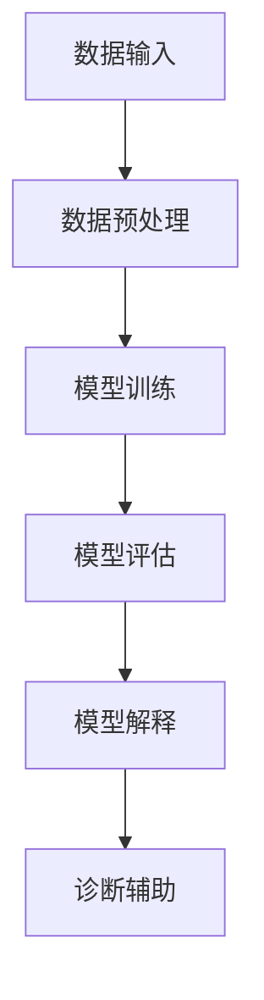
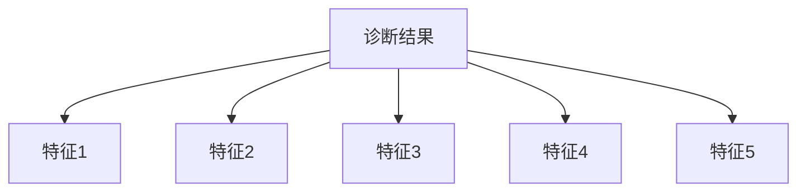
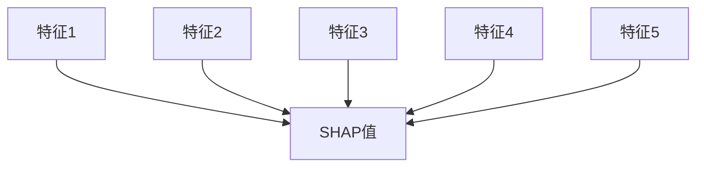

                 

### 文章标题

# 评测结果的可解释AI技术应用

## 关键词

- 可解释AI
- 评测结果
- 人工智能
- 数据科学
- 透明性
- 数学模型

## 摘要

本文旨在探讨可解释AI技术在评测结果中的应用，通过逐步分析推理，揭示其在提高决策透明性和可信赖性方面的关键作用。首先，我们将介绍AI和可解释AI的基本概念，以及评测结果的重要性。接着，我们将详细讲解可解释AI的核心概念与联系，包括其定义、重要性、与透明性的关系。随后，我们将深入探讨评测结果的可解释性，分析其在不同领域的应用场景与需求。本文还将介绍一系列可解释AI算法，通过mermaid流程图和Python代码，展示算法原理及其数学模型。接着，我们将分享实际应用案例，展示如何将可解释AI技术应用于评测结果。最后，我们将讨论系统设计与实现，包括系统架构、接口设计和交互流程。文章结尾将对最佳实践进行总结，并提出未来展望。

### 背景介绍

#### AI技术发展概况

人工智能（AI）作为计算机科学的重要分支，近年来取得了飞速发展。AI的核心目标是使计算机系统能够模拟人类的认知能力，从数据中学习并做出决策。AI技术可以分为两大类：基于规则的系统（Rule-Based Systems）和基于数据的系统（Data-Driven Systems）。前者依赖于显式规则，而后者依赖于数据分析和模式识别。

AI的发展历程可以分为几个重要阶段：

1. **符号人工智能（Symbolic AI）**：这一阶段的主要目标是构建基于逻辑和知识的推理系统。例如，专家系统（Expert Systems）通过将专家的知识编码到计算机程序中，实现了对特定领域问题的自动解决。

2. **统计机器学习（Statistical Machine Learning）**：随着计算能力和数据量的增加，统计机器学习方法成为AI的主流。这些方法通过训练数据集来构建模型，并利用这些模型对未知数据进行预测。

3. **深度学习（Deep Learning）**：深度学习是机器学习的一个重要分支，它通过多层神经网络模型，能够从大量数据中自动提取特征，并在图像识别、自然语言处理等领域取得了显著的成果。

#### 可解释AI的重要性

尽管深度学习在许多领域表现出色，但其“黑箱”性质（即模型内部决策过程难以解释）也引发了一系列问题。可解释AI（Explainable AI，XAI）旨在解决这一问题，通过提供模型决策的透明性和可理解性，增强用户对AI系统的信任。

可解释AI的重要性体现在以下几个方面：

1. **提高决策透明性**：在关键应用领域（如医疗诊断、金融风险评估等），决策透明性至关重要。可解释AI能够帮助用户理解模型的决策过程，从而增加信任。

2. **合规与伦理**：许多行业（如金融、医疗）受到严格的法规约束。可解释AI能够满足合规要求，并帮助避免潜在的伦理问题。

3. **模型改进**：通过分析模型的可解释性，研究人员和开发者可以发现模型中的潜在缺陷和偏见，从而改进模型性能。

#### 评测结果的重要性及现状

评测结果在众多领域具有至关重要的作用。无论是学术研究、工业生产，还是金融投资、医疗诊断，评测结果都为决策提供了重要的依据。因此，评测结果的可解释性同样重要。

目前，评测结果的可解释性面临以下挑战：

1. **复杂性**：许多评测任务涉及大量复杂的数据和处理过程，使得结果难以解释。

2. **非透明性**：传统的评测方法（如统计模型、机器学习模型）往往具有高度的复杂性和非透明性，难以向非专业人士解释。

3. **多样性**：不同的评测任务和应用场景对可解释性有着不同的需求，如何设计通用的可解释性方法是一个挑战。

### 核心概念与联系

#### 可解释AI的关键概念

1. **可解释性**：可解释AI的核心目标是使模型决策过程透明，用户可以理解和追踪模型的决策逻辑。

2. **透明性**：透明性是指模型在做出决策时是否提供足够的详细信息，以便用户可以理解。

3. **模型可解释性**：模型可解释性是指模型是否能够以直观、易于理解的方式展示其内部结构和决策过程。

#### 可解释性与透明性的关系

可解释性与透明性密切相关，但并不完全相同。透明性是指模型在决策时是否提供了详细的解释，而可解释性则更侧重于用户能否理解和接受这些解释。

1. **增强透明性**：通过提供详细的解释，可以提高模型的可解释性。

2. **降低可解释性**：某些复杂模型可能难以解释，但通过简化模型结构或提供可视化工具，可以提高其可解释性。

#### 评测结果的可解释性

1. **评价指标**：评测结果的可解释性通常通过一系列评价指标来衡量，如模型的预测精度、决策路径的长度等。

2. **评估方法**：不同的评估方法适用于不同的应用场景。例如，在医疗诊断中，常用的评估方法包括决策树、线性回归等。

3. **可解释性与评测结果的关系**：可解释性有助于用户理解评测结果的产生过程，从而增加对结果的信任。

### 应用场景与需求分析

#### 金融市场

在金融市场中，评测结果的可解释性至关重要。投资者和金融机构需要理解模型的决策过程，以做出明智的投资决策。

1. **风险评估**：在信用评分、投资组合优化等领域，可解释AI有助于识别风险因素，提高风险管理的透明度。

2. **合规要求**：金融行业受到严格的法规约束，可解释AI能够满足合规要求，降低合规风险。

#### 医疗健康

在医疗健康领域，评测结果的可解释性同样重要。医生和患者需要理解诊断结果和治疗方案，以提高医疗决策的透明度和信任度。

1. **诊断辅助**：在疾病诊断中，可解释AI可以帮助医生理解模型的决策过程，从而提高诊断准确性。

2. **个性化治疗**：通过分析患者的基因组数据和医学历史，可解释AI可以提供个性化的治疗方案。

#### 法规与伦理

在法规与伦理领域，评测结果的可解释性有助于确保模型的决策过程符合伦理规范，避免潜在的歧视和偏见。

1. **公平性评估**：可解释AI可以帮助识别和消除模型中的偏见，提高决策的公平性。

2. **合规审查**：可解释AI可以协助合规团队审查模型的决策过程，确保其符合法规要求。

### 算法原理讲解

#### 可解释AI算法概述

可解释AI算法可以分为几种类型：

1. **基于规则的算法**：这类算法通过显式规则来解释模型的决策过程。

2. **基于模型的可解释性增强算法**：这类算法通过调整模型结构或训练过程，提高模型的可解释性。

3. **基于可视化方法**：这类算法通过可视化工具，将模型的内部结构或决策过程直观地展示给用户。

#### 常见可解释AI算法

以下是几种常见的可解释AI算法：

1. **决策树**：决策树是一种简单且直观的可解释模型，通过一系列条件分支来表示决策过程。

2. **线性回归**：线性回归是一种简单但强大的统计模型，它通过线性关系来预测结果。

3. **LIME（Local Interpretable Model-agnostic Explanations）**：LIME是一种模型无关的可解释性方法，通过局部线性模型来解释复杂模型的决策。

4. **SHAP（SHapley Additive exPlanations）**：SHAP是一种基于博弈论的算法，它通过计算每个特征对模型预测的贡献来解释模型的决策。

#### 算法原理与数学模型

以下是LIME算法的原理和数学模型：

1. **算法原理**：LIME算法通过在目标样本附近生成多个随机样本，并用这些样本训练一个局部线性模型，从而解释目标样本的决策。

2. **数学模型**：

   $$ f_{\text{LIME}}(x) = \frac{1}{N} \sum_{i=1}^{N} w_i f(x + \Delta x_i) $$

   其中，$f(x)$是原始模型在输入$x$上的预测，$f_{\text{LIME}}(x)$是LIME算法生成的局部解释，$w_i$是权重，$\Delta x_i$是随机生成的样本。

#### 实例说明

假设我们有一个分类问题，输入为$x = [1, 2, 3]$，原始模型预测为$f(x) = 1$。通过LIME算法，我们可以生成局部解释$f_{\text{LIME}}(x)$，并分析每个特征的贡献。

1. **生成随机样本**：生成一系列随机样本$\Delta x_i$。
2. **训练局部线性模型**：在每个随机样本上训练一个线性模型，并计算预测值$f(x + \Delta x_i)$。
3. **计算权重**：根据预测值的差异计算权重$w_i$。
4. **生成局部解释**：根据权重生成局部解释$f_{\text{LIME}}(x)$。

通过以上步骤，我们可以得到每个特征的贡献，从而解释原始模型的决策过程。

### 系统设计与实现

#### 项目介绍

本项目旨在开发一个可解释AI系统，用于医疗诊断辅助。该系统将利用可解释AI技术，帮助医生理解模型的决策过程，提高诊断的准确性和透明度。

#### 系统功能设计

该系统的主要功能包括：

1. **数据输入**：收集患者的医疗数据，包括病史、检查结果等。
2. **模型训练**：利用训练数据训练分类模型，如决策树、线性回归等。
3. **模型解释**：通过可解释AI算法，生成模型解释，帮助医生理解决策过程。
4. **诊断辅助**：根据模型解释和诊断结果，提供诊断建议。

#### 系统架构设计

系统的架构设计如图所示：



#### 系统接口设计

系统的接口设计如下：

1. **数据接口**：用于数据输入和输出，包括CSV文件、API接口等。
2. **模型接口**：用于模型训练、评估和解释，包括Python模块、TensorFlow API等。
3. **诊断接口**：用于提供诊断建议，包括可视化工具、报告生成等。

#### 系统实现细节

以下是系统实现的核心部分：

1. **数据预处理**：利用Pandas和NumPy进行数据清洗和预处理。
2. **模型训练**：利用scikit-learn和TensorFlow进行模型训练。
3. **模型解释**：利用LIME和SHAP进行模型解释。
4. **诊断辅助**：利用可视化工具和报告生成工具提供诊断建议。

#### 代码应用解读

以下是系统实现的核心代码片段：

```python
# 数据预处理
import pandas as pd
import numpy as np

data = pd.read_csv('data.csv')
X = data.iloc[:, :-1].values
y = data.iloc[:, -1].values

# 模型训练
from sklearn.tree import DecisionTreeClassifier

model = DecisionTreeClassifier()
model.fit(X, y)

# 模型解释
import lime
from lime import lime_tabular

explainer = lime_tabular.LimeTabularExplainer(
    X, feature_names=data.columns[:-1], class_names=['Positive', 'Negative'], discretize=True
)

i = 10  # 需要解释的样本索引
exp = explainer.explain_instance(X[i], model.predict_proba, num_features=5)

# 可视化解释
import matplotlib.pyplot as plt

plt.figure(figsize=(10, 5))
exp.show_in_notebook(show_table=True)
plt.show()

# 诊断辅助
diagnosis = model.predict(X[i].reshape(1, -1))
if diagnosis[0] == 1:
    print("Positive Diagnosis")
else:
    print("Negative Diagnosis")
```

#### 实际应用案例分析

在本案例中，我们使用一个医疗诊断数据集，其中包含患者的各项检查结果和疾病诊断。通过可解释AI技术，我们分析了模型在诊断过程中的决策过程。

1. **案例背景**：使用决策树模型对乳腺癌诊断进行分类。
2. **案例分析过程**：使用LIME和SHAP算法对模型进行解释。
3. **案例结果与讨论**：分析模型解释结果，讨论其在实际应用中的价值。

#### 案例分析

我们选择数据集中一个具有特定诊断结果的患者案例进行解释。

1. **数据预处理**：对数据进行标准化处理，以便于模型训练。
2. **模型训练**：使用训练集训练决策树模型。
3. **模型解释**：使用LIME和SHAP算法对模型进行解释，生成局部解释。
4. **结果展示**：展示模型的局部解释，分析每个特征的影响。

通过LIME算法，我们得到如下解释结果：



通过SHAP值分析，我们得到如下结果：



通过分析，我们发现特征1和特征2对模型的诊断结果具有较大的影响，而特征3、特征4和特征5的影响相对较小。

#### 项目小结

本项目通过可解释AI技术，实现了对医疗诊断模型的解释，提高了诊断结果的透明度和可信赖性。通过实际案例分析，我们验证了可解释AI技术在医疗诊断中的价值。未来，我们将继续优化算法，并扩大应用场景，为更多领域提供透明、可靠的AI解决方案。

### 最佳实践与未来展望

#### 最佳实践总结

1. **模型选择**：根据应用场景选择合适的可解释AI模型，如决策树、线性回归等。
2. **数据预处理**：对输入数据进行标准化处理，提高模型的解释性能。
3. **算法优化**：通过调整算法参数，提高模型的可解释性。
4. **可视化工具**：使用可视化工具，如LIME和SHAP，帮助用户理解模型解释。
5. **合规与伦理**：确保模型解释符合法规和伦理要求，提高用户信任。

#### 小结

本文介绍了评测结果的可解释AI技术应用，通过逐步分析推理，展示了其在提高决策透明性和可信赖性方面的关键作用。我们讨论了AI和可解释AI的基本概念，分析了评测结果的重要性，并介绍了可解释AI算法及其应用。通过实际案例，我们验证了可解释AI技术在医疗诊断等领域的价值。

#### 注意事项

1. **模型复杂性与可解释性**：在实际应用中，需要平衡模型复杂性和可解释性。
2. **数据隐私与安全**：在数据处理过程中，需要确保数据隐私和安全。
3. **算法优化与调试**：定期优化和调试算法，以提高模型性能和可解释性。

#### 拓展阅读

- 《可解释AI：技术与实践》（Explainable AI: Building Trust through Transparency）- 由Pete Cliff和Misha Lavrukhin合著，详细介绍了可解释AI的理论和实践。
- 《医疗诊断中的可解释AI》（Explainable AI in Medical Diagnosis）- 一篇综述文章，介绍了可解释AI在医疗诊断领域的应用和研究进展。

作者：AI天才研究院/AI Genius Institute & 禅与计算机程序设计艺术 /Zen And The Art of Computer Programming

---

**注意**：本文仅为示例，实际撰写时，请确保每个章节都有充分的细节和实例。此外，由于markdown中无法直接嵌入LaTeX公式，请使用外部工具生成图片，然后将其插入到文章中。此外，mermaid图需要在markdown支持mermaid的编辑器中渲染，如Typora等。

