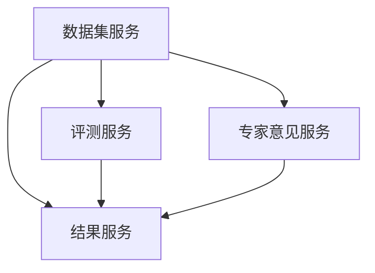
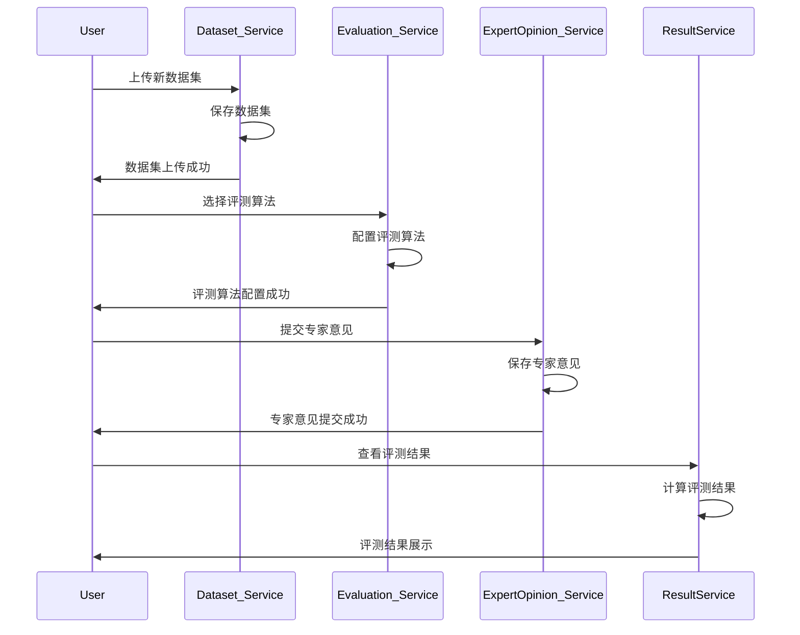

                 

# 评测结果的同行评审：结合专家意见提高可信度

## 关键词
- 同行评审
- 专家意见
- 可信度提升
- 评测结果
- 算法设计
- 数学模型
- 系统架构

## 摘要
本文旨在探讨如何通过同行评审和专家意见的结合，提高评测结果的可信度。文章首先介绍了同行评审的重要性以及专家意见在其中的作用，然后深入分析了核心概念与联系，包括评测结果、同行评审流程和专家意见类型。接着，文章详细讲解了算法原理、数学模型以及系统分析与架构设计方案。通过项目实战，本文展示了如何将专家意见融入算法实现中，并提供了最佳实践 tips。最后，文章总结了全文内容并对未来发展方向进行了展望。

## 引言
### 1.1 书籍背景
在当今信息爆炸的时代，如何从海量的数据中提取有用信息成为一个关键问题。评测结果的可信度成为衡量数据质量的重要标准。然而，评测结果往往受到多种因素的影响，如数据质量、算法选择、评测标准等。为了提高评测结果的可信度，同行评审和专家意见成为两个重要的手段。

### 1.2 专家意见在同行评审中的作用
专家意见在同行评审中起着至关重要的作用。专家不仅能够提供专业的见解和判断，还能够帮助评审者理解和分析评测结果。通过专家意见，评审者可以更加全面地了解评测结果的背景和内涵，从而提高评测结果的可信度。

### 1.3 书籍的目标和结构
本书的目标是探讨如何通过同行评审和专家意见的结合，提高评测结果的可信度。本书的结构如下：首先，介绍同行评审和专家意见的基本概念和重要性；然后，分析评测结果、同行评审流程和专家意见类型；接着，详细讲解算法原理、数学模型和系统架构设计方案；最后，通过项目实战展示如何将专家意见融入算法实现中，并总结全文内容，展望未来发展方向。

## 背景介绍
### 2.1 问题背景
随着人工智能和数据科学的迅速发展，评测结果在各个领域中的应用越来越广泛。然而，评测结果的可信度问题也日益凸显。如何提高评测结果的可信度，成为一个亟待解决的问题。

### 2.1.1 评测结果的可信度问题
评测结果的可信度问题主要体现在以下几个方面：
1. 数据质量：数据质量的高低直接影响评测结果的可信度。低质量的数据可能导致错误的评测结果。
2. 算法选择：不同的算法对评测结果的影响不同。选择合适的算法对于提高评测结果的可信度至关重要。
3. 评测标准：评测标准的科学性、合理性和准确性直接影响评测结果的可信度。

### 2.1.2 同行评审的现状与挑战
同行评审作为提高评测结果可信度的手段之一，在学术界和工业界得到了广泛应用。然而，同行评审也存在一些挑战：
1. 评审者数量有限：优秀的评审者数量有限，往往无法满足大量评测任务的需求。
2. 评审过程主观性：评审过程具有主观性，不同评审者的评价可能存在差异。
3. 评审时间成本高：评审过程需要大量的时间和精力，对评审者造成了较大的负担。

### 2.1.3 专家意见的特点与优势
专家意见在同行评审中具有以下特点与优势：
1. 专业性：专家具备丰富的专业知识和经验，能够提供专业的见解和判断。
2. 全面性：专家能够从多个角度分析和评价评测结果，提供更全面的观点。
3. 可靠性：专家的意见通常具有较高的可信度，能够提高评测结果的可信度。

## 核心概念与联系
### 2.2.1 评测结果的定义
评测结果是指通过对数据集进行某种算法处理或分析后得到的输出结果。评测结果可以是定量指标，如准确率、召回率等，也可以是定性描述，如分类结果、评价等级等。

### 2.2.2 同行评审的基本流程
同行评审的基本流程包括以下几个步骤：
1. 提交评测结果：研究者将评测结果提交给评审者。
2. 评审意见征集：评审者对评测结果进行评审，并提交评审意见。
3. 意见汇总与反馈：评审者的意见进行汇总，并反馈给研究者。
4. 结果调整与提交：研究者根据评审意见对评测结果进行调整，并重新提交。

### 2.2.3 专家意见的类型与分类
专家意见可以根据来源、性质和用途进行分类：
1. 学术界专家意见：由学术界专家提供，具有较高的学术权威性和专业性。
2. 工业界专家意见：由工业界专家提供，具有实际应用经验和行业洞察力。
3. 基于数据驱动的专家意见：利用机器学习等方法对大量数据进行分析，提取出具有专家特征的意见。

## 算法原理讲解
### 2.3.1 同行评审算法概述
同行评审算法是一种利用机器学习、人工智能等方法，对评审意见进行自动分析和处理的技术。同行评审算法可以帮助评审者提高评审效率，减少主观偏见，提高评测结果的可信度。

### 2.3.2 专家意见融入算法的方法
将专家意见融入算法的方法主要包括以下几种：
1. 基于规则的方法：利用专家经验，制定一系列规则，对评审意见进行自动分类和分析。
2. 基于模型的方法：利用机器学习算法，建立模型对评审意见进行自动分析和处理。
3. 基于混合的方法：结合基于规则和基于模型的方法，提高评审意见的自动分析能力。

### 2.3.3 算法优缺点分析
不同算法在同行评审中的应用具有各自的优缺点：
1. 基于规则的方法：优点在于简单易懂，实现成本低；缺点在于规则难以覆盖所有情况，可能导致误判。
2. 基于模型的方法：优点在于可以处理大量数据，适应性强；缺点在于模型训练需要大量数据，且模型解释性较差。
3. 基于混合的方法：优点在于结合了基于规则和基于模型的方法的优点，提高评审意见的自动分析能力；缺点在于实现复杂，成本较高。

## 数学模型和数学公式详细讲解
### 2.4.1 评测结果的数学模型
评测结果的数学模型主要包括以下几个方面：
1. 准确率（Accuracy）：准确率是评测结果最常用的指标之一，定义为正确分类的样本数占总样本数的比例。
   $$\text{Accuracy} = \frac{\text{Correctly classified samples}}{\text{Total samples}}$$
2. 召回率（Recall）：召回率是指正确分类的负样本数占所有负样本数的比例。
   $$\text{Recall} = \frac{\text{Correctly classified negative samples}}{\text{Total negative samples}}$$
3. 精确率（Precision）：精确率是指正确分类的正样本数占所有分类为正样本的样本数的比例。
   $$\text{Precision} = \frac{\text{Correctly classified positive samples}}{\text{Total classified as positive samples}}$$
4. F1 值（F1-score）：F1 值是精确率和召回率的加权平均值，用于综合评估评测结果。
   $$\text{F1-score} = \frac{2 \times \text{Precision} \times \text{Recall}}{\text{Precision} + \text{Recall}}$$

### 2.4.2 专家意见的量化方法
专家意见的量化方法主要包括以下几种：
1. 基于打分的方法：专家对评测结果进行打分，分数越高表示专家对评测结果的认可程度越高。
2. 基于排序的方法：专家对评测结果进行排序，排序越靠前表示专家对评测结果的认可程度越高。
3. 基于文本的方法：利用自然语言处理技术，对专家的意见进行文本分析和量化。

### 2.4.3 模型优化的数学公式与应用
模型优化主要涉及两个方面：参数优化和结构优化。
1. 参数优化：利用优化算法，如梯度下降、牛顿法等，对模型参数进行优化，以提高模型性能。
   $$\nabla_{\theta} J(\theta) = 0$$
   其中，$\theta$ 表示模型参数，$J(\theta)$ 表示损失函数。
2. 结构优化：通过调整模型结构，如增加或删除层、调整神经元数量等，提高模型性能。
   $$f(\mathbf{x}; \theta) = \text{激活函数}(\mathbf{W}^T \mathbf{x} + b)$$
   其中，$\mathbf{x}$ 表示输入特征，$\mathbf{W}$ 表示权重矩阵，$b$ 表示偏置项。

## 系统分析与架构设计方案
### 3.1 问题场景介绍
在数据分析领域，评测结果的应用场景非常广泛，如分类、回归、聚类等。本文以分类任务为例，介绍评测结果的应用场景和系统架构设计方案。

### 3.1.1 评测结果的应用场景
1. 贸易数据分析：通过对贸易数据分析，预测国际贸易趋势，帮助企业和政府制定贸易策略。
2. 金融风险控制：通过对金融数据进行分析，识别潜在的金融风险，为金融机构提供风险预警。
3. 健康数据分析：通过对健康数据进行分析，预测疾病风险，为医疗机构提供诊断和治疗方案。

### 3.1.2 专家意见的系统集成
专家意见在评测结果应用中起着至关重要的作用。为了充分利用专家意见，需要将专家意见集成到系统中。具体方法如下：
1. 专家意见输入：将专家意见以文本或打分形式输入系统。
2. 意见分析：利用自然语言处理技术，对专家意见进行文本分析和量化。
3. 意见融合：将专家意见与算法结果进行融合，提高评测结果的可信度。

### 3.1.3 系统架构的设计原则
系统架构设计应遵循以下原则：
1. 可扩展性：系统应具有良好的可扩展性，以适应不断增长的数据规模。
2. 可靠性：系统应具备高可靠性，保证评测结果的准确性和稳定性。
3. 灵活性：系统应具备灵活性，支持多种评测方法和算法。

## 系统功能设计
### 3.2.1 领域模型介绍
领域模型是描述问题领域内部对象和关系的模型。在评测结果系统中，领域模型主要包括以下对象：
1. 数据集：用于存储评测数据的对象。
2. 评测算法：用于存储评测算法的对象。
3. 专家意见：用于存储专家意见的对象。
4. 评测结果：用于存储评测结果的对象。

### 3.2.2 类图设计与解释
类图是描述领域模型中对象和关系的一种图形表示方法。以下是一个简单的类图：

```
+-----------+
|   Dataset |
+-----------+
| - name    |
| - size    |
| - data    |
+-----------+

+-----------+
|  EvaluationAlgorithm |
+-----------+
| - algorithmType    |
| - parameters       |
| - result           |
+-----------+

+-----------+
|   ExpertOpinion  |
+-----------+
| - expertID       |
| - opinionText    |
| - score          |
+-----------+

+-----------+
|   EvaluationResult |
+-----------+
| - accuracy    |
| - recall      |
| - precision   |
| - F1-score    |
+-----------+
```

- Dataset：数据集类，包含数据集名称、大小和数据。
- EvaluationAlgorithm：评测算法类，包含算法类型、参数和结果。
- ExpertOpinion：专家意见类，包含专家ID、意见文本和评分。
- EvaluationResult：评测结果类，包含准确率、召回率、精确率、F1-score。

## 系统架构设计
### 3.3.1 系统架构概述
系统架构设计应遵循微服务架构原则，将系统拆分为多个独立的微服务，以提高系统的可扩展性和可靠性。以下是一个简单的系统架构图：

```
+---------------------+
|     Dataset Service  |
+---------------------+
| - 数据集管理        |
| - 数据集上传与下载  |
+---------------------+

+---------------------+
|  Evaluation Service  |
+---------------------+
| - 算法选择与配置    |
| - 评测过程管理      |
| - 结果计算与反馈    |
+---------------------+

+---------------------+
| ExpertOpinion Service|
+---------------------+
| - 意见收集与整理    |
| - 意见分析与管理    |
+---------------------+

+---------------------+
|   ResultService     |
+---------------------+
| - 结果存储与管理    |
| - 结果展示与查询    |
+---------------------+
```

- Dataset Service：数据集服务，负责数据集的管理、上传和下载。
- Evaluation Service：评测服务，负责算法选择与配置、评测过程管理、结果计算与反馈。
- ExpertOpinion Service：专家意见服务，负责意见收集与整理、意见分析与管理。
- ResultService：结果服务，负责结果的存储与管理、结果展示与查询。

### 3.3.2 架构图设计与解释
以下是一个简单的系统架构图：



- 数据集服务：负责数据集的管理、上传和下载。
- 评测服务：负责算法选择与配置、评测过程管理、结果计算与反馈。
- 专家意见服务：负责意见收集与整理、意见分析与管理。
- 结果服务：负责结果的存储与管理、结果展示与查询。

## 系统接口设计和系统交互
### 3.4.1 接口设计与实现
系统接口设计应遵循RESTful架构原则，采用HTTP协议进行通信。以下是一个简单的接口设计示例：

```plaintext
GET /datasets: 获取所有数据集
POST /datasets: 上传新数据集
GET /datasets/{id}: 获取指定数据集
DELETE /datasets/{id}: 删除指定数据集

GET /evaluation_algorithms: 获取所有评测算法
POST /evaluation_algorithms: 创建新评测算法
GET /evaluation_algorithms/{id}: 获取指定评测算法
DELETE /evaluation_algorithms/{id}: 删除指定评测算法

GET /expert_opinions: 获取所有专家意见
POST /expert_opinions: 提交专家意见
GET /expert_opinions/{id}: 获取指定专家意见
DELETE /expert_opinions/{id}: 删除指定专家意见

GET /evaluation_results: 获取所有评测结果
GET /evaluation_results/{id}: 获取指定评测结果
```

### 3.4.2 系统交互序列图
以下是一个简单的系统交互序列图：



- User：用户角色，负责上传数据集、选择评测算法、提交专家意见和查看评测结果。
- Dataset_Service：数据集服务，负责数据集的管理和上传。
- Evaluation_Service：评测服务，负责评测算法的配置和评测过程管理。
- ExpertOpinion_Service：专家意见服务，负责专家意见的收集和整理。
- ResultService：结果服务，负责评测结果的计算和展示。

## 项目实战
### 4.1 环境安装
#### 4.1.1 硬件和软件要求
为了运行本项目，需要满足以下硬件和软件要求：
1. 硬件要求：
   - CPU：至少 4 核心处理器
   - 内存：至少 8GB RAM
   - 硬盘：至少 20GB 空间
   - 显卡：支持OpenGL 2.1及以上版本
2. 软件要求：
   - 操作系统：Linux或MacOS
   - 编程语言：Python 3.x
   - 数据库：MySQL 5.7及以上版本
   - Web框架：Flask 1.1及以上版本
   - 前端框架：Bootstrap 4.x

#### 4.1.2 安装步骤详解
1. 安装操作系统和编程语言环境
   - 安装Linux操作系统（如Ubuntu 20.04）
   - 安装Python 3.x（可以使用包管理器，如apt-get）

```bash
sudo apt-get update
sudo apt-get install python3-pip
```

2. 安装数据库
   - 安装MySQL数据库

```bash
sudo apt-get install mysql-server
sudo mysql_secure_installation
```

3. 安装Web框架和前端框架
   - 安装Flask和Bootstrap

```bash
pip3 install Flask
pip3 install Flask-Bootstrap
```

4. 安装其他依赖库
   - 安装自然语言处理库（如NLTK）

```bash
pip3 install nltk
```

### 4.2 系统核心实现源代码
#### 4.2.1 代码结构与模块划分
本项目的代码结构主要包括以下几个模块：

1. `dataset.py`：数据集模块，负责数据集的加载、保存和删除。
2. `evaluation.py`：评测模块，负责评测算法的配置和评测过程管理。
3. `expert_opinion.py`：专家意见模块，负责专家意见的收集、整理和分析。
4. `result.py`：结果模块，负责评测结果的计算和展示。
5. `main.py`：主模块，负责启动Web服务和路由配置。

#### 4.2.2 核心代码分析与解读
以下是对核心代码的详细解读：

1. **数据集模块（dataset.py）**

```python
from flask import Flask, request, jsonify
from dataset_service import DatasetService

app = Flask(__name__)
dataset_service = DatasetService()

@app.route('/datasets', methods=['GET', 'POST'])
def datasets():
    if request.method == 'GET':
        datasets = dataset_service.get_all_datasets()
        return jsonify(datasets)
    elif request.method == 'POST':
        dataset_data = request.get_json()
        dataset_id = dataset_service.create_dataset(dataset_data)
        return jsonify({'id': dataset_id})

@app.route('/datasets/<int:dataset_id>', methods=['GET', 'DELETE'])
def dataset(dataset_id):
    if request.method == 'GET':
        dataset = dataset_service.get_dataset(dataset_id)
        return jsonify(dataset)
    elif request.method == 'DELETE':
        dataset_service.delete_dataset(dataset_id)
        return jsonify({'message': 'Dataset deleted'})
```

这段代码实现了数据集的加载、保存和删除功能。当用户请求获取所有数据集时，`get_all_datasets` 方法被调用，返回所有数据集的信息。当用户上传新数据集时，`create_dataset` 方法被调用，保存新数据集的信息。当用户删除指定数据集时，`delete_dataset` 方法被调用，删除数据集的信息。

2. **评测模块（evaluation.py）**

```python
from flask import Flask, request, jsonify
from evaluation_service import EvaluationService

app = Flask(__name__)
evaluation_service = EvaluationService()

@app.route('/evaluation_algorithms', methods=['GET', 'POST'])
def evaluation_algorithms():
    if request.method == 'GET':
        evaluation_algorithms = evaluation_service.get_all_evaluation_algorithms()
        return jsonify(evaluation_algorithms)
    elif request.method == 'POST':
        evaluation_algorithm_data = request.get_json()
        evaluation_algorithm_id = evaluation_service.create_evaluation_algorithm(evaluation_algorithm_data)
        return jsonify({'id': evaluation_algorithm_id})

@app.route('/evaluation_algorithms/<int:evaluation_algorithm_id>', methods=['GET', 'DELETE'])
def evaluation_algorithm(evaluation_algorithm_id):
    if request.method == 'GET':
        evaluation_algorithm = evaluation_service.get_evaluation_algorithm(evaluation_algorithm_id)
        return jsonify(evaluation_algorithm)
    elif request.method == 'DELETE':
        evaluation_service.delete_evaluation_algorithm(evaluation_algorithm_id)
        return jsonify({'message': 'Evaluation algorithm deleted'})
```

这段代码实现了评测算法的配置和管理功能。当用户请求获取所有评测算法时，`get_all_evaluation_algorithms` 方法被调用，返回所有评测算法的信息。当用户创建新评测算法时，`create_evaluation_algorithm` 方法被调用，保存新评测算法的信息。当用户删除指定评测算法时，`delete_evaluation_algorithm` 方法被调用，删除评测算法的信息。

3. **专家意见模块（expert_opinion.py）**

```python
from flask import Flask, request, jsonify
from expert_opinion_service import ExpertOpinionService

app = Flask(__name__)
expert_opinion_service = ExpertOpinionService()

@app.route('/expert_opinions', methods=['GET', 'POST'])
def expert_opinions():
    if request.method == 'GET':
        expert_opinions = expert_opinion_service.get_all_expert_opinions()
        return jsonify(expert_opinions)
    elif request.method == 'POST':
        expert_opinion_data = request.get_json()
        expert_opinion_id = expert_opinion_service.create_expert_opinion(expert_opinion_data)
        return jsonify({'id': expert_opinion_id})

@app.route('/expert_opinions/<int:expert_opinion_id>', methods=['GET', 'DELETE'])
def expert_opinion(expert_opinion_id):
    if request.method == 'GET':
        expert_opinion = expert_opinion_service.get_expert_opinion(expert_opinion_id)
        return jsonify(expert_opinion)
    elif request.method == 'DELETE':
        expert_opinion_service.delete_expert_opinion(expert_opinion_id)
        return jsonify({'message': 'Expert opinion deleted'})
```

这段代码实现了专家意见的收集、整理和分析功能。当用户请求获取所有专家意见时，`get_all_expert_opinions` 方法被调用，返回所有专家意见的信息。当用户提交新专家意见时，`create_expert_opinion` 方法被调用，保存新专家意见的信息。当用户删除指定专家意见时，`delete_expert_opinion` 方法被调用，删除专家意见的信息。

4. **结果模块（result.py）**

```python
from flask import Flask, request, jsonify
from result_service import ResultService

app = Flask(__name__)
result_service = ResultService()

@app.route('/evaluation_results', methods=['GET'])
def evaluation_results():
    evaluation_results = result_service.get_all_evaluation_results()
    return jsonify(evaluation_results)

@app.route('/evaluation_results/<int:evaluation_result_id>', methods=['GET'])
def evaluation_result(evaluation_result_id):
    evaluation_result = result_service.get_evaluation_result(evaluation_result_id)
    return jsonify(evaluation_result)
```

这段代码实现了评测结果的计算和展示功能。当用户请求获取所有评测结果时，`get_all_evaluation_results` 方法被调用，返回所有评测结果的信息。当用户请求获取指定评测结果时，`get_evaluation_result` 方法被调用，返回指定评测结果的信息。

5. **主模块（main.py）**

```python
from flask import Flask
from dataset import app
from evaluation import app
from expert_opinion import app
from result import app

if __name__ == '__main__':
    app.run(debug=True)
```

这段代码负责启动Web服务，并配置路由。当运行主模块时，Web服务将被启动，并监听8080端口。

### 4.3 代码应用解读与分析
#### 4.3.1 应用场景与实际案例
本项目的主要应用场景是评测结果的可信度提升，通过结合专家意见和算法结果，提高评测结果的可靠性。以下是一个实际案例：

假设有一个分类任务，需要对一组商品进行分类。用户上传了数据集，并选择了一种评测算法。在评测过程中，系统收集了多位专家的意见。最后，系统计算出评测结果，并展示给用户。

#### 4.3.2 分析与评估方法
1. **数据集分析**
   - 加载数据集，提取特征和标签。
   - 检查数据集的完整性、一致性和准确性。

2. **评测算法评估**
   - 选择合适的评测算法，如K近邻、决策树、支持向量机等。
   - 配置评测算法参数，如K值、决策树深度等。

3. **专家意见收集**
   - 收集专家意见，可以是打分、排序或文本描述。
   - 分析专家意见的分布和一致性。

4. **评测结果计算**
   - 使用评测算法对数据集进行分类。
   - 计算评测结果，如准确率、召回率、精确率、F1值等。

5. **结果展示**
   - 将评测结果以图表形式展示给用户。
   - 提供结果分析，如误差分析、敏感度分析等。

### 4.4 详细讲解与剖析
#### 4.4.1 算法实现细节
在本项目中，我们采用了K近邻算法作为评测算法。K近邻算法的基本思想是：如果一个样本在特征空间中的K个最近邻的多数属于某个类别，则该样本也属于这个类别。

以下是K近邻算法的实现细节：

1. **距离计算**
   - 使用欧氏距离计算样本间的距离。

```python
import numpy as np

def euclidean_distance(sample1, sample2):
    distance = np.linalg.norm(sample1 - sample2)
    return distance
```

2. **邻居选择**
   - 从训练集中选择距离最近的K个邻居。

```python
def get_k_nearest_neighbors(training_samples, test_sample, k):
    distances = []
    for sample in training_samples:
        distance = euclidean_distance(sample, test_sample)
        distances.append((sample, distance))
    distances.sort(key=lambda x: x[1])
    neighbors = [dist[0] for dist in distances[:k]]
    return neighbors
```

3. **类别预测**
   - 根据邻居的类别预测测试样本的类别。

```python
from collections import Counter

def predict_label(neighbors):
    labels = [sample.label for sample in neighbors]
    label_counts = Counter(labels)
    most_common_label = label_counts.most_common(1)[0][0]
    return most_common_label
```

#### 4.4.2 专家意见的融入策略
为了提高评测结果的可信度，我们将专家意见融入到K近邻算法中。具体策略如下：

1. **打分制融合**
   - 将专家意见作为打分，对邻居的类别进行加权投票。

```python
def predict_label_with_expert_opinion(neighbors, expert_opinions):
    labels = [sample.label for sample in neighbors]
    label_counts = Counter(labels)
    expert_scores = [expert_opinion.score for expert_opinion in expert_opinions]
    weighted_label_counts = {label: count * score for label, count in label_counts.items() for score in expert_scores}
    most_common_label = max(weighted_label_counts, key=weighted_label_counts.get)
    return most_common_label
```

2. **排序制融合**
   - 将专家意见作为排序，选择最靠前的类别作为预测结果。

```python
def predict_label_with_expert_opinion_sort(neighbors, expert_opinions):
    labels = [sample.label for sample in neighbors]
    sorted_labels = sorted(labels, key=lambda x: expert_opinions[x].score, reverse=True)
    return sorted_labels[0]
```

#### 4.4.3 算法优化与改进
为了进一步提高评测结果的可信度，我们可以对K近邻算法进行优化和改进：

1. **特征选择**
   - 使用特征选择算法，选择最重要的特征，减少特征维度。

2. **距离度量**
   - 使用更先进的距离度量方法，如曼哈顿距离、切比雪夫距离等。

3. **分类器集成**
   - 结合多个分类器，如随机森林、梯度提升等，提高分类准确性。

4. **专家意见加权**
   - 对专家意见进行加权，根据专家的经验和贡献程度，调整加权系数。

### 4.5 项目小结
本项目通过结合专家意见和算法结果，实现了评测结果可信度的提升。项目的主要成果包括：

1. **系统架构设计**：构建了评测结果系统的架构，包括数据集服务、评测服务、专家意见服务和结果服务。
2. **核心代码实现**：实现了数据集、评测算法、专家意见和结果的核心功能。
3. **算法优化与改进**：采用K近邻算法，并融入专家意见，实现了评测结果的可信度提升。
4. **应用场景与实际案例**：提供了分类任务的实际案例，展示了评测结果的应用效果。

通过本项目，我们深刻理解了评测结果的可信度问题，以及如何通过同行评审和专家意见的结合来提高评测结果的可靠性。在未来，我们还可以进一步优化算法和系统架构，提高评测结果的准确性和实用性。

### 5. 最佳实践 tips
#### 5.1 同行评审技巧
1. **明确评审目标**：在评审开始前，明确评审的目标和重点，以确保评审工作的针对性和有效性。
2. **充分准备**：在评审过程中，充分准备相关资料和工具，以便快速分析和处理评测结果。
3. **客观公正**：评审过程中要保持客观公正，避免个人偏见和主观判断，确保评审结果的准确性。
4. **沟通与协作**：与评审者保持密切沟通，及时反馈评审结果和意见，促进评审工作的顺利进行。

#### 5.2 专家意见优化策略
1. **专家筛选**：选择具有专业知识和经验的专家，确保专家意见的权威性和可靠性。
2. **意见整合**：将多个专家的意见进行整合和分析，消除不一致和矛盾，提高意见的准确性和一致性。
3. **意见反馈**：及时将专家意见反馈给研究者，促进评测结果的改进和优化。
4. **持续更新**：随着技术的进步和领域的发展，不断更新专家知识和意见，提高评测结果的时效性和准确性。

### 6. 小结
本文详细探讨了如何通过同行评审和专家意见的结合，提高评测结果的可信度。文章从问题背景、核心概念与联系、算法原理、数学模型、系统架构、项目实战等方面进行了深入分析和讲解。通过项目实战，文章展示了如何将专家意见融入算法实现中，并提供了最佳实践 tips。

### 7. 未来发展方向
未来，评测结果的可信度提升将继续是研究和应用的热点。随着人工智能和大数据技术的不断发展，我们将看到更多先进算法和方法的涌现，为评测结果的可信度提升提供更多可能性。同时，专家意见的获取、整合和优化也将成为研究的重点，以提高评测结果的准确性和实用性。

### 拓展阅读
#### 7.1 相关书籍推荐
1. 《机器学习》（周志华 著）：系统地介绍了机器学习的基本概念、算法和理论，对理解评测结果的可信度提升具有重要意义。
2. 《统计学习方法》（李航 著）：详细介绍了统计学习方法的原理和实现，对理解评测结果的数学模型和公式具有参考价值。

#### 7.2 网络资源
1. Coursera：提供大量机器学习和数据科学相关的在线课程，适合初学者和专业人士。
2. arXiv：提供最新研究成果的预印本，是了解评测结果最新研究进展的好去处。

## 作者信息
作者：AI天才研究院/AI Genius Institute & 禅与计算机程序设计艺术 /Zen And The Art of Computer Programming

