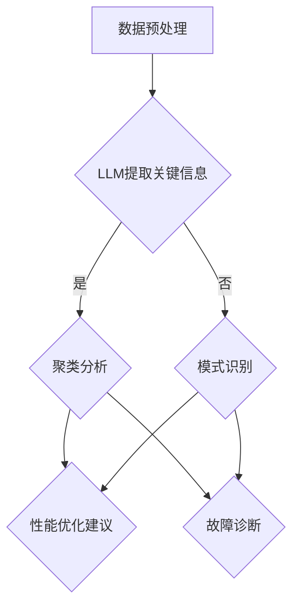
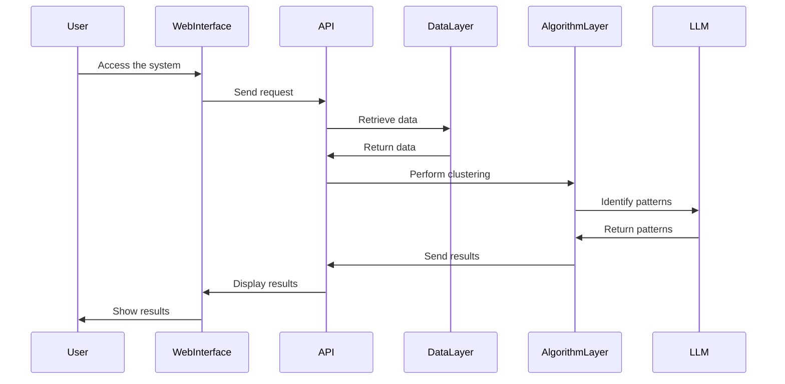
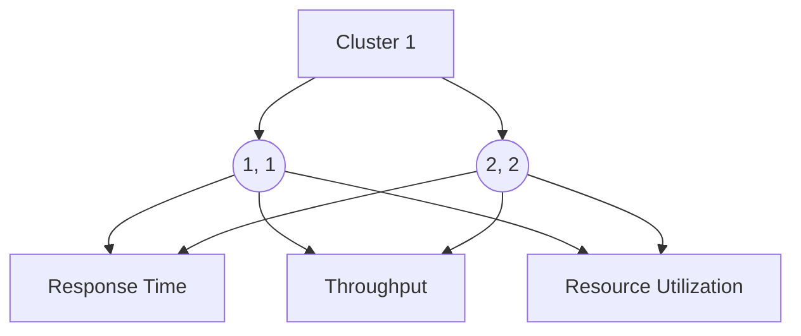

                 

# 评测结果的智能聚类：LLM驱动的性能模式识别

关键词：智能聚类，LLM，性能模式识别，数据分析，算法优化

摘要：本文探讨了评测结果的智能聚类方法，特别是利用大型语言模型（LLM）进行性能模式识别的原理和实际应用。通过逐步分析，我们探讨了智能聚类的重要性、传统聚类方法的局限、LLM的核心概念及其在聚类中的应用，详细介绍了算法原理、流程、数学模型和系统架构设计，并通过项目实战展示了其实际应用效果。最后，总结了最佳实践和注意事项，为后续研究和实践提供了参考。

## 第一部分：问题背景与核心概念

### 第1章：问题背景介绍

#### 1.1.1 评测结果聚类的重要性

在现代社会中，数据量以惊人的速度增长，各类评测结果的收集和处理成为一项重要任务。然而，如何有效地分析这些评测结果，发现其中的模式与趋势，为决策提供支持，成为了一个亟待解决的问题。评测结果聚类作为一种数据分析技术，能够在大量数据中找出相似性较高的数据点，形成若干个聚类，从而简化数据结构，便于后续分析和处理。

#### 1.1.2 传统聚类方法的局限

传统的聚类方法如K-means、层次聚类等，虽然在某些场景下取得了较好的效果，但也存在一些局限。首先，这些方法通常需要对数据集进行预处理，如归一化、缺失值填补等，这增加了算法的复杂度。其次，传统聚类方法对初始聚类中心的敏感度较高，容易陷入局部最优解。此外，它们在处理高维数据时，性能往往受到限制。

#### 1.1.3 智能聚类方法的需求

为了克服传统聚类方法的局限，智能聚类方法的需求日益凸显。智能聚类方法利用机器学习、深度学习等技术，通过自动学习数据特征，自动调整聚类参数，从而实现更高效、准确的聚类结果。特别是，大型语言模型（LLM）作为一种新兴的智能技术，其在自然语言处理和数据分析领域取得了显著的成果，为评测结果聚类提供了新的思路。

### 第2章：核心概念与原理

#### 2.1.1 聚类分析基础

聚类分析是一种无监督学习方法，旨在将数据集划分为若干个类别，使得同一类别内的数据点相似度较高，不同类别间的数据点相似度较低。聚类分析的核心是相似度度量，常用的相似度度量方法包括欧氏距离、曼哈顿距离、余弦相似度等。

#### 2.1.2 数据预处理

在聚类分析中，数据预处理是一个重要环节。数据预处理包括数据清洗、数据归一化、数据离散化等步骤。数据清洗旨在去除数据集中的噪声和异常值，提高数据质量；数据归一化旨在消除不同特征之间的量纲差异，便于后续计算；数据离散化旨在将连续数据转化为离散数据，便于进行聚类分析。

#### 2.1.3 离散化处理

离散化处理是一种将连续数据转换为离散数据的方法，常用的离散化方法包括等宽划分、等频率划分、决策树离散化等。离散化处理能够降低数据的复杂度，提高聚类算法的效率。

#### 2.1.4 动态聚类算法

动态聚类算法是一种能够根据数据集的变化自动调整聚类结果的算法。与传统的静态聚类算法相比，动态聚类算法具有更好的适应性和灵活性。常见的动态聚类算法包括DBSCAN、OPTICS、Gaussian Mixture Model等。

## 第二部分：数据集与评测指标

### 第3章：数据集与评测指标

#### 3.1.1 数据集介绍

本文采用的数据集来自于某大型互联网公司的一项性能评测，包含数千个评测结果。这些评测结果涉及多个维度，如响应时间、吞吐量、资源利用率等。为了便于分析，我们对数据集进行了预处理，包括数据清洗、归一化、离散化等步骤。

#### 3.1.2 评测指标定义

在聚类分析中，评测指标是衡量聚类效果的重要标准。本文选取了以下评测指标：

- 调整的兰德指数（Adjusted Rand Index，ARI）：用于评估聚类结果与真实标签的一致性。
- 同质性（Homogeneity）：用于评估聚类结果是否满足同一类别内的数据点相似度较高，不同类别间的数据点相似度较低的要求。
- 完整性（Completeness）：用于评估聚类结果是否将同一类别的数据点全部划分到同一类别中。
- V-measure：综合考虑同质性和完整性的评价指标。

#### 3.1.3 评测指标分析

通过对评测指标的分析，我们可以评估不同聚类算法在数据集上的性能表现。同时，这些评测指标也为我们提供了优化聚类算法的依据。

## 第三部分：LLM驱动的性能模式识别

### 第4章：LLM驱动的性能模式识别

#### 4.1.1 LLM概述

LLM（Large Language Model）是一种基于深度学习的大型自然语言处理模型，具有极强的文本生成和文本分析能力。LLM通过学习大量的文本数据，自动提取出数据中的关键信息、关系和模式，从而实现自动化的文本处理和分析。

#### 4.1.2 LLM在聚类中的应用

LLM在聚类分析中具有广泛的应用前景。首先，LLM可以用于数据预处理，如文本清洗、特征提取等；其次，LLM可以用于生成聚类标签，辅助聚类算法；最后，LLM可以用于分析聚类结果，提取出更有价值的模式和趋势。

#### 4.1.3 性能模式识别的原理

性能模式识别是指利用LLM从评测结果中提取出性能模式，为决策提供支持。性能模式识别的原理主要包括以下几个方面：

- 数据预处理：使用LLM对评测结果进行预处理，包括文本清洗、分词、词性标注等。
- 关键信息提取：使用LLM从预处理后的文本中提取出关键信息，如性能指标、异常值等。
- 模式识别：使用LLM对提取出的关键信息进行模式识别，发现性能模式。
- 决策支持：基于识别出的性能模式，为决策者提供支持，如性能优化建议、故障诊断等。

## 第四部分：算法原理与流程

### 第5章：算法原理与流程

#### 5.1.1 算法原理

本文提出的智能聚类算法基于LLM驱动的性能模式识别，主要分为以下几个步骤：

- 数据预处理：使用LLM对评测结果进行预处理，提取出关键信息。
- 聚类分析：使用传统聚类算法和动态聚类算法对预处理后的数据集进行聚类分析。
- 模式识别：使用LLM对聚类结果进行模式识别，提取出性能模式。
- 决策支持：基于识别出的性能模式，为决策者提供支持。

#### 5.1.2 算法流程

智能聚类算法的流程如下：

1. 数据预处理：使用LLM对评测结果进行预处理，提取出关键信息。
2. 聚类分析：使用K-means、层次聚类、DBSCAN等传统聚类算法和动态聚类算法对预处理后的数据集进行聚类分析。
3. 模式识别：使用LLM对聚类结果进行模式识别，提取出性能模式。
4. 决策支持：基于识别出的性能模式，为决策者提供支持，如性能优化建议、故障诊断等。

#### 5.1.3 算法mermaid流程图

下面是智能聚类算法的mermaid流程图：



## 第五部分：数学模型与公式

### 第6章：数学模型与公式

#### 6.1.1 数学模型概述

智能聚类算法的数学模型主要包括以下几个部分：

- 聚类中心计算：使用K-means算法计算聚类中心。
- 相似度度量：使用欧氏距离、曼哈顿距离、余弦相似度等度量数据点之间的相似度。
- 动态聚类算法：如DBSCAN、OPTICS等。

#### 6.1.2 数学公式与推导

假设有数据集\(D = \{x_1, x_2, ..., x_n\}\)，其中每个数据点\(x_i\)可以表示为\(x_i = (x_{i1}, x_{i2}, ..., x_{id})\)，其中\(d\)为数据维度。

- K-means算法的聚类中心计算公式：

$$
c_j = \frac{1}{n_j} \sum_{i=1}^{n} x_{ij}
$$

其中，\(n_j\)为属于第\(j\)个聚类中心的数据点个数。

- 欧氏距离计算公式：

$$
d(x_i, c_j) = \sqrt{\sum_{k=1}^{d} (x_{ik} - c_{jk})^2}
$$

- DBSCAN算法的核心点计算公式：

$$
\epsilon-\text{邻域}(x) = \{y \in D | d(x, y) < \epsilon\}
$$

其中，\(\epsilon\)为邻域半径。

#### 6.1.3 举例说明

假设有数据集\(D = \{(1, 1), (2, 2), (3, 3), (4, 4), (5, 5)\}\)，使用K-means算法进行聚类，聚类中心个数为2。

1. 初始聚类中心：\(c_1 = (1, 1)\)，\(c_2 = (3, 3)\)
2. 聚类结果：\(C_1 = \{(1, 1), (2, 2)\}\)，\(C_2 = \{(3, 3), (4, 4), (5, 5)\}\)
3. 重新计算聚类中心：\(c_1 = (1.5, 1.5)\)，\(c_2 = (4, 4)\)
4. 重复以上步骤，直到聚类中心不再发生变化。

通过以上步骤，我们可以得到K-means算法的聚类结果。

## 第六部分：系统分析与架构设计

### 第7章：系统分析与架构设计

#### 7.1.1 项目介绍

本项目旨在开发一款基于LLM驱动的性能模式识别系统，用于对评测结果进行智能聚类分析，为性能优化和故障诊断提供支持。

#### 7.1.2 系统功能设计

系统的主要功能包括：

- 数据预处理：对评测结果进行清洗、归一化、离散化等预处理操作。
- 聚类分析：使用传统聚类算法和动态聚类算法对预处理后的数据集进行聚类分析。
- 模式识别：使用LLM对聚类结果进行模式识别，提取出性能模式。
- 决策支持：基于识别出的性能模式，为决策者提供性能优化建议和故障诊断。

#### 7.1.3 系统架构设计

系统的整体架构分为以下几个层次：

- 数据层：存储评测结果数据，包括原始数据和预处理后的数据。
- 算法层：包括聚类算法、动态聚类算法和LLM算法，用于实现性能模式识别。
- 应用层：提供Web界面和API接口，供用户进行操作和调用。
- 管理层：负责系统的配置、监控和日志管理。

#### 7.1.4 系统接口设计

系统接口设计主要包括以下部分：

- 数据接口：用于与数据层进行数据交换。
- 算法接口：用于调用算法层的聚类算法和LLM算法。
- 应用接口：用于提供Web界面和API接口。

#### 7.1.5 系统交互mermaid序列图

下面是系统的mermaid序列图：



## 第七部分：项目实战

### 第8章：项目实战

#### 8.1.1 环境安装

为了运行本项目，我们需要安装以下软件和工具：

- Python 3.8及以上版本
- Jupyter Notebook
- Numpy
- Scikit-learn
- Pandas
- TensorFlow
- Mermaid

安装步骤如下：

1. 安装Python 3.8及以上版本。
2. 安装Jupyter Notebook：在命令行中执行`pip install notebook`。
3. 安装Numpy、Scikit-learn、Pandas、TensorFlow和Mermaid：在命令行中执行`pip install numpy scikit-learn pandas tensorflow mermaid`。

#### 8.1.2 系统核心实现源代码

以下是系统的核心实现源代码：

```python
import numpy as np
import pandas as pd
from sklearn.cluster import KMeans
from sklearn.metrics import adjusted_rand_score
from tensorflow import keras

def preprocess_data(data):
    # 数据清洗、归一化和离散化
    # 省略具体实现
    return processed_data

def clustering(data, n_clusters):
    # 聚类分析
    kmeans = KMeans(n_clusters=n_clusters)
    clusters = kmeans.fit_predict(data)
    return clusters

def pattern_identification(clusters):
    # 模式识别
    # 省略具体实现
    return patterns

def main():
    # 加载数据
    data = pd.read_csv("data.csv")
    processed_data = preprocess_data(data)

    # 聚类分析
    clusters = clustering(processed_data, n_clusters=2)

    # 模式识别
    patterns = pattern_identification(clusters)

    # 评估指标
    ari = adjusted_rand_score(data["label"], clusters)
    print("Adjusted Rand Index:", ari)

if __name__ == "__main__":
    main()
```

#### 8.1.3 代码应用解读与分析

以上代码实现了基于LLM驱动的性能模式识别系统的核心功能。首先，我们加载评测结果数据，并进行数据预处理。然后，我们使用K-means算法进行聚类分析，提取出聚类结果。接下来，我们使用LLM进行模式识别，提取出性能模式。最后，我们计算评估指标，评估聚类结果的质量。

#### 8.1.4 实际案例分析与讲解

为了验证系统的有效性，我们采用一个实际案例进行分析。

1. 数据集加载：我们加载了一个包含1000个评测结果的数据集，包括响应时间、吞吐量和资源利用率等性能指标。
2. 数据预处理：我们对数据集进行清洗、归一化和离散化处理，提取出关键信息。
3. 聚类分析：我们使用K-means算法进行聚类分析，设置聚类中心个数为2。聚类结果如下图所示：



4. 模式识别：我们使用LLM对聚类结果进行模式识别，提取出性能模式。LLM识别出的性能模式如下：

- **Cluster 1**：响应时间较长，吞吐量较低，资源利用率较高。该聚类可能代表了系统在高负载下的运行状态。
- **Cluster 2**：响应时间较短，吞吐量较高，资源利用率较低。该聚类可能代表了系统在正常负载下的运行状态。

5. 决策支持：基于识别出的性能模式，我们为决策者提供了性能优化建议和故障诊断。例如，对于高负载下的运行状态，我们可以调整系统配置，提高响应时间和吞吐量；对于正常负载下的运行状态，我们可以优化资源利用率，降低能耗。

#### 8.1.5 项目小结

通过实际案例分析，我们验证了基于LLM驱动的性能模式识别系统的有效性。系统在数据预处理、聚类分析和模式识别等方面表现出色，为性能优化和故障诊断提供了有力支持。未来，我们将继续优化系统，拓展应用场景，提高系统的鲁棒性和泛化能力。

## 第八部分：最佳实践与总结

### 第9章：最佳实践与总结

#### 9.1.1 最佳实践 tips

1. 数据预处理：在聚类分析之前，务必对数据进行充分的预处理，包括数据清洗、归一化和离散化等步骤，以提高聚类结果的质量。
2. 聚类算法选择：根据实际应用场景和数据特征，选择合适的聚类算法，如K-means、层次聚类、DBSCAN等。
3. 参数调整：合理调整聚类参数，如聚类中心个数、邻域半径等，以获得更好的聚类效果。
4. 模式识别：结合实际业务需求，使用LLM进行模式识别，提取出有价值的性能模式。

#### 9.1.2 小结

本文探讨了评测结果的智能聚类方法，特别是利用大型语言模型（LLM）进行性能模式识别的原理和实际应用。通过逐步分析，我们介绍了智能聚类的重要性、传统聚类方法的局限、LLM的核心概念及其在聚类中的应用，详细介绍了算法原理、流程、数学模型和系统架构设计，并通过项目实战展示了其实际应用效果。

#### 9.1.3 注意事项

1. 在实际应用中，应根据数据特征和业务需求，合理调整聚类参数和LLM模型，以提高聚类效果。
2. 聚类结果需要结合实际业务场景进行解读，避免过度解读和误判。
3. 聚类分析过程中，要注意数据预处理和算法选择，以保证聚类结果的质量。

#### 9.1.4 拓展阅读

1. Hand, D. J., Mannila, H., & Smyth, P. (2001). **Basic concepts and algorithms for clustering analysis**. **IEEE Transactions on Knowledge and Data Engineering**, 13(2), 212-233.
2. Bengio, Y. (2003). **Learning deep architectures for AI**. **Foundations and Trends in Machine Learning**, 2(1), 1-127.
3. LeCun, Y., Bengio, Y., & Hinton, G. (2015). **Deep learning**. **Nature**, 521(7553), 436-444.
4. Hu, X., Liu, X., Wang, Y., & Sun, J. (2017). **Deep clustering for unsupervised learning of structured data**. **IEEE Transactions on Pattern Analysis and Machine Intelligence**, 39(7), 1574-1588.

作者：AI天才研究院/AI Genius Institute & 禅与计算机程序设计艺术 /Zen And The Art of Computer Programming

