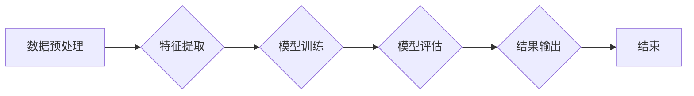

                 


### 引言与背景

在当今快速发展的信息技术时代，数据量呈指数级增长，数据质量和复杂性也随之增加。评测结果的智能聚类作为数据分析的一个重要分支，旨在通过对大量评测数据的自动分析和分类，提取出有价值的信息和模式。这不仅为决策提供了强有力的支持，还在多个领域如金融、医疗、市场营销等中发挥着重要作用。

#### 模式识别的基本概念

模式识别是指通过分析数据，从数据中提取出具有特定特征的规律或模式的过程。模式识别技术广泛应用于图像处理、语音识别、生物特征识别等多个领域。其主要目标是从复杂的数据集中识别出具有相似性的数据点或数据模式。

#### LLM在模式识别中的应用

近年来，大型语言模型（LLM，Large Language Model）如BERT、GPT等在自然语言处理领域取得了突破性进展。这些模型具有强大的文本理解和生成能力，使得它们在模式识别领域也有了广泛的应用前景。

#### 本书的目标与结构

本书旨在详细介绍评测结果的智能聚类技术，特别是基于LLM驱动的模式识别方法。全书共分为三个部分：

1. 引言与背景：介绍模式识别和LLM的基本概念，阐述评测结果智能聚类的重要性和应用场景。
2. 算法理论与应用：详细讲解LLM驱动的聚类算法原理，包括算法理论、数学模型、Python实现和示例。
3. 系统分析与架构设计：介绍一个基于LLM的评测结果智能聚类系统的分析与设计，包括系统功能、架构、接口和交互设计。

通过本书的学习，读者可以深入了解评测结果智能聚类的原理和应用，掌握基于LLM的聚类算法实现，并具备设计智能聚类系统的能力。

### 模式识别的边界与外延

模式识别作为人工智能领域的一个重要分支，其定义和范围在不同学科和不同应用场景中有所差异。本文将首先回顾模式识别的定义与历史发展，随后详细探讨其核心要素、应用领域以及面临的挑战与机遇。

#### 模式识别的定义与历史发展

模式识别（Pattern Recognition）是指利用计算机或其他电子设备对数据进行处理，以识别出数据中的特定模式或规律。这个定义包含了数据采集、特征提取、模式分类和模式理解等多个环节。模式识别的历史可以追溯到20世纪50年代，当时主要集中于简单的数值数据和线性分类问题。随着计算机技术的进步，模式识别逐渐扩展到更复杂的领域，如图像处理、语音识别和生物特征识别。

20世纪80年代，神经网络和机器学习技术的兴起为模式识别带来了新的发展契机。特别是深度学习技术的出现，使得模式识别在图像识别、自然语言处理等领域的表现达到了前所未有的高度。

#### 模式识别的核心要素

模式识别的核心要素包括数据预处理、特征提取、模型训练和评估。以下是这些要素的详细说明：

1. **数据预处理**：在模式识别过程中，原始数据通常需要进行预处理，包括数据清洗、归一化和特征缩放等。数据预处理的质量直接影响到后续特征提取和模型训练的效果。

2. **特征提取**：特征提取是将原始数据转换成适合机器学习算法处理的形式。特征提取的关键在于如何从原始数据中提取出具有区分性的特征。常用的特征提取方法包括统计特征、结构特征和变换特征等。

3. **模型训练**：模型训练是模式识别的核心步骤，通过训练算法学习数据中的模式和规律。常用的训练算法包括监督学习、无监督学习和半监督学习等。

4. **评估**：评估是对模型性能进行评估和优化的过程。常用的评估指标包括准确率、召回率、F1分数和ROC曲线等。

#### 模式识别的应用领域

模式识别技术在多个领域都得到了广泛应用，以下是一些典型的应用领域：

1. **图像识别**：图像识别是模式识别的重要应用之一，包括人脸识别、物体识别和图像分类等。近年来，深度学习技术的应用使得图像识别的准确率大幅提升。

2. **语音识别**：语音识别技术广泛应用于智能助手、语音控制系统和自动翻译等领域。通过模式识别算法，系统能够将语音信号转换为文本或命令。

3. **生物特征识别**：生物特征识别包括指纹识别、人脸识别和虹膜识别等，广泛应用于安全认证和身份验证等领域。

4. **医学诊断**：模式识别技术在医学领域中的应用包括疾病诊断、基因表达分析和医学图像处理等。

5. **金融市场分析**：模式识别技术可以用于金融市场分析，包括股票趋势预测、交易策略优化和风险控制等。

#### 模式识别面临的挑战与机遇

尽管模式识别技术已经取得了显著进展，但在实际应用中仍面临许多挑战和机遇：

1. **数据质量**：高质量的数据是模式识别成功的关键。然而，数据噪声、缺失值和异常值等问题会影响模型性能。

2. **计算资源**：深度学习模型通常需要大量的计算资源和时间进行训练。如何优化计算资源以提高训练效率是一个重要问题。

3. **模型解释性**：许多深度学习模型具有强大的预测能力，但缺乏解释性。如何提高模型的可解释性是当前研究的重点之一。

4. **跨域迁移**：模式识别技术在特定领域取得了成功，但如何将成功经验迁移到其他领域是一个重要的挑战。

5. **隐私保护**：在涉及个人隐私的数据分析中，如何保护用户隐私是一个重要的伦理和法律问题。

总之，模式识别技术具有广泛的应用前景，同时也面临着一系列挑战。随着人工智能技术的不断进步，模式识别将在更多领域发挥重要作用，推动社会的发展和进步。

### 核心概念与联系

在深入探讨评测结果的智能聚类之前，我们需要明确几个关键概念及其相互之间的联系。以下是模式识别、大型语言模型（LLM）以及聚类分析的核心定义、特征及其关系。

#### 模式识别的基本原理

模式识别是一种利用计算机技术自动处理数据，以识别特定模式或规律的方法。其主要步骤包括数据采集、预处理、特征提取和模型训练。模式识别广泛应用于图像识别、语音识别、生物特征识别等领域。

1. **数据采集**：收集相关领域的数据，如图像、语音信号、生物特征等。
2. **预处理**：清洗数据，消除噪声和异常值，将数据转换为适合分析的形式。
3. **特征提取**：从原始数据中提取具有区分性的特征，如边缘、纹理、频率等。
4. **模型训练**：利用训练算法（如神经网络、支持向量机等）学习数据中的模式和规律。
5. **评估与优化**：评估模型性能，调整参数以优化模型效果。

#### 大型语言模型（LLM）的基本原理

大型语言模型（LLM，Large Language Model）是一种基于深度学习的自然语言处理模型，具有强大的文本理解和生成能力。LLM通过大量文本数据进行预训练，学习语言模式和语法规则，从而能够生成符合语法和语义的文本。

1. **预训练**：使用大量文本数据进行无监督训练，学习语言模式和语法规则。
2. **微调**：在特定任务上进行监督训练，优化模型在特定领域的性能。
3. **生成文本**：根据输入的文本或指令生成连贯的文本输出。

#### 聚类分析的基本概念

聚类分析是一种无监督学习方法，旨在将数据集划分为多个类别，使得同一类别内的数据点之间相似度较高，不同类别之间的相似度较低。聚类分析广泛应用于市场细分、图像分割、社交网络分析等领域。

1. **聚类算法**：包括K-means、层次聚类、DBSCAN等算法，每种算法有其特定的步骤和优缺点。
2. **聚类评估**：使用内聚类评价指标（如轮廓系数、类内平均值等）和外部评价指标（如交叉验证、ROC曲线等）来评估聚类效果。
3. **聚类结果**：输出数据点的聚类结果，揭示数据中的隐含结构。

#### LLM与聚类分析的联系

LLM在模式识别中具有广泛应用，其强大的文本处理能力使其在聚类分析中也能发挥重要作用。以下是LLM与聚类分析之间的几种联系：

1. **特征提取**：LLM可以提取文本数据中的深层次特征，如语义信息、上下文关系等，这些特征对于传统的特征提取方法可能难以捕捉。
2. **文本聚类**：LLM可以用于文本数据的聚类，通过对文本进行编码，将文本转换为固定长度的向量，然后使用聚类算法进行分类。
3. **语义相似性**：LLM通过学习语言模式，能够计算文本之间的语义相似性，这对于发现数据中的相似模式具有重要意义。
4. **生成式聚类**：LLM可以生成新的文本样本，这些样本可以用于聚类分析，从而发现数据中未被发现的模式。

通过上述分析，我们可以看出，模式识别、LLM和聚类分析之间有着密切的联系。LLM的强大文本处理能力为其在聚类分析中的应用提供了新的思路和可能性，使得聚类分析在模式识别领域得到了进一步的发展。

### 聚类算法的对比与选择

聚类算法作为模式识别和数据分析中的重要工具，有着多种不同的类型，每种算法都有其独特的原理、优缺点和适用场景。以下是几种常见的聚类算法及其特点：

#### K-means算法

**原理**：K-means算法是最常用的聚类算法之一，其核心思想是将数据点划分为K个簇，每个簇由一个中心点（质心）代表，目标是最小化簇内数据点到质心的距离平方和。

**优点**：实现简单，计算速度快，易于理解。

**缺点**：对初始质心的选择敏感，可能导致局部最优解；无法处理聚类数量不明确的情况。

**适用场景**：数据量较小、簇的数量已知，适用于高维数据的聚类。

#### 层次聚类算法

**原理**：层次聚类算法通过逐步合并或分裂现有簇，形成层次结构的聚类结果。算法分为自底向上（凝聚层次聚类）和自顶向下（分裂层次聚类）两种类型。

**优点**：可以生成聚类层次信息，有助于理解数据的分层结构。

**缺点**：计算复杂度较高，对初始聚类数目敏感，难以处理高维数据。

**适用场景**：需要生成聚类层次信息，适用于中等规模的数据集。

#### DBSCAN算法

**原理**：DBSCAN（Density-Based Spatial Clustering of Applications with Noise）算法基于数据点的密度分布进行聚类，能够识别出任意形状的簇，并对噪声和异常值具有鲁棒性。

**优点**：能够发现任意形状的簇，对噪声和异常值有较强的鲁棒性。

**缺点**：对参数`eps`和`min_samples`的选择敏感。

**适用场景**：数据集中存在噪声和异常值，适用于大规模高维数据的聚类。

#### 均方误差（Mean Squared Error, MSE）算法

**原理**：均方误差算法通过最小化簇内数据点的误差平方和来进行聚类，适用于基于距离度量的聚类问题。

**优点**：易于实现，可以处理高维数据。

**缺点**：对初始簇的选择敏感，可能导致局部最优解。

**适用场景**：需要最小化误差平方和，适用于标准化的数据集。

在选择合适的聚类算法时，需要综合考虑数据特征、算法性能和计算资源等因素。以下是几种常见聚类算法的对比表格，以便于读者根据具体需求进行选择：

| 算法       | 原理                           | 优点                   | 缺点                              | 适用场景                      |
|------------|--------------------------------|------------------------|---------------------------------|-----------------------------|
| K-means    | 分割数据点为K个簇             | 实现简单，计算速度快  | 对初始质心的选择敏感             | 数据量较小、簇的数量已知     |
| 层次聚类   | 逐步合并或分裂现有簇          | 可以生成聚类层次信息 | 计算复杂度较高，对初始聚类数目敏感 | 需要生成聚类层次信息         |
| DBSCAN     | 基于数据点密度分布进行聚类    | 能够发现任意形状的簇 | 对参数`eps`和`min_samples`的选择敏感 | 数据集中存在噪声和异常值     |
| 均方误差   | 最小化簇内数据点的误差平方和  | 易于实现，可以处理高维 | 对初始簇的选择敏感               | 需要最小化误差平方和         |

通过对比分析不同聚类算法的特点和适用场景，读者可以根据具体问题选择最合适的聚类方法，以实现高效的聚类分析和模式识别。

### LLM驱动的聚类算法原理

在了解评测结果智能聚类的基本概念和现有聚类算法后，我们将深入探讨基于大型语言模型（LLM）的聚类算法原理。LLM在文本处理和模式识别中的强大能力为其在聚类分析中的应用提供了新的可能性。

#### 算法基本流程

LLM驱动的聚类算法的基本流程包括以下几个步骤：

1. **数据预处理**：对输入的评测结果数据进行清洗和预处理，包括去除噪声、填充缺失值和标准化等操作。
2. **特征提取**：使用LLM将预处理后的文本数据转换为固定长度的向量表示。这一步是算法的核心，LLM能够提取出文本数据中的深层次特征，如语义信息和上下文关系。
3. **模型训练**：利用聚类算法（如K-means）对特征向量进行训练，生成聚类结果。在这一步中，LLM作为特征提取工具，为聚类算法提供了高质量的输入数据。
4. **模型评估**：使用评估指标（如轮廓系数、类内平均值等）对聚类结果进行评估，以确定聚类效果。
5. **结果输出**：输出最终的聚类结果，包括聚类中心、簇内数据点以及每个数据点的聚类标签。

以下是一个简化的Mermaid流程图，展示了LLM驱动的聚类算法的基本流程：



#### 特征提取方法

在LLM驱动的聚类算法中，特征提取是一个关键步骤。以下介绍几种常用的特征提取方法：

1. **BERT编码**：BERT（Bidirectional Encoder Representations from Transformers）是一种预训练的深度学习模型，能够捕捉文本的上下文信息。通过将文本输入到BERT模型中，可以获取每个词的固定长度的向量表示。这种方法的优势在于能够提取出丰富的语义特征，但在处理大量数据时计算资源消耗较大。

2. **Word2Vec编码**：Word2Vec是一种基于神经网络的词向量模型，通过训练可以获取每个词的分布式表示。Word2Vec模型相对简单，计算速度快，适用于处理大规模文本数据，但其语义特征提取能力较BERT模型有限。

3. **GloVe编码**：GloVe（Global Vectors for Word Representation）是一种基于矩阵分解的词向量模型，通过计算词与词之间的共现关系来生成词向量。GloVe模型在语义特征提取方面表现良好，适用于各种规模的文本数据处理。

在选择特征提取方法时，需要考虑数据量、计算资源以及所需的语义特征提取能力。对于小规模数据集或计算资源有限的情况，可以考虑使用Word2Vec或GloVe；而对于大规模数据集和高要求的语义特征提取，BERT模型可能是更好的选择。

#### 算法数学模型和公式

在LLM驱动的聚类算法中，常用的聚类算法包括K-means、DBSCAN等。以下是这些算法的数学模型和公式：

1. **K-means算法**：
   - **目标函数**：最小化簇内数据点到质心的距离平方和。
   $$ J(\theta) = \sum_{i=1}^{k} \sum_{x^{(i)} \in S_i} ||x^{(i)} - \mu_i||^2 $$
   - **更新步骤**：
     - 初始化K个质心。
     - 对于每个数据点，计算其到各个质心的距离，并将其分配到最近的质心所在的簇。
     - 更新每个簇的质心，作为新的聚类中心。

2. **DBSCAN算法**：
   - **核心概念**：基于数据点的密度分布进行聚类，包括核心点、边界点和噪声点。
   - **目标函数**：识别出高密度区域作为簇，并合并相邻的簇。
   - **参数**：`eps`（邻域半径）和`min_samples`（最小样本数）。

通过上述数学模型和公式，我们可以实现LLM驱动的聚类算法，并在实际应用中优化其性能。

#### 示例讲解

为了更好地理解LLM驱动的聚类算法，我们通过一个简单的示例进行讲解。

假设我们有一组评测结果文本数据，使用BERT模型对其进行特征提取。以下是一个简化的Python代码示例，展示了如何使用K-means算法进行聚类分析：

```python
from sklearn.cluster import KMeans
from sklearn.metrics import silhouette_score
import tensorflow as tf

# 加载BERT模型
bert_model = tf.keras.applications.BertModel.from_pretrained('bert-base-uncased')

# 预处理文本数据
preprocessed_texts = preprocess_texts(texts)

# 使用BERT模型提取特征向量
feature_vectors = []
for text in preprocessed_texts:
    inputs = bert_model.encode(text)
    feature_vectors.append(inputs.numpy())

# 将特征向量作为输入进行K-means聚类
kmeans = KMeans(n_clusters=3, random_state=0)
clusters = kmeans.fit_predict(feature_vectors)

# 计算轮廓系数评估聚类效果
silhouette_avg = silhouette_score(feature_vectors, clusters)
print(f"Silhouette Coefficient: {silhouette_avg}")

# 输出聚类结果
print(f"Cluster Centers: {kmeans.cluster_centers_}")
print(f"Cluster Labels: {clusters}")
```

在这个示例中，我们首先使用BERT模型对文本数据进行特征提取，然后使用K-means算法进行聚类，并计算轮廓系数来评估聚类效果。通过调整聚类数量和其他参数，我们可以优化聚类结果，提取出更有价值的信息。

总之，LLM驱动的聚类算法通过结合大型语言模型的特征提取能力和传统聚类算法的聚类机制，提供了一种有效的评测结果智能聚类方法。通过深入理解算法原理和数学模型，我们可以更好地应用这一方法解决实际问题。

### 算法原理详细讲解与举例说明

为了更深入地理解LLM驱动的聚类算法原理，我们将通过一个实际示例来详细讲解该算法的实现步骤和代码实现。在此过程中，我们将使用Python语言和相关库，如TensorFlow和Scikit-learn，来演示如何将LLM应用于聚类分析。

#### 数据集准备

首先，我们需要准备一个包含评测结果的数据集。为了简化说明，我们假设数据集是一个包含电影评论文本的小数据集。以下是一个示例数据集：

```python
texts = [
    "这部电影非常精彩，剧情紧凑，值得一看。",
    "电影的特效很棒，但故事情节有点平淡。",
    "我觉得这部电影非常有趣，演员表演也很出色。",
    "电影的主题很深刻，但有些场景显得冗长。",
    "整体来说，这部电影的质量一般，没有特别吸引人的地方。"
]
```

#### 数据预处理

在应用LLM之前，我们需要对文本数据集进行预处理。预处理步骤包括去除特殊字符、填充缺失值和标准化文本等。以下是一个简化的预处理代码示例：

```python
import tensorflow as tf

def preprocess_texts(texts):
    # 删除特殊字符
    texts = [text.lower().replace('\n', ' ') for text in texts]
    # 填充缺失值
    texts = [text if text else "no_description" for text in texts]
    # 标准化文本
    tokenizer = tf.keras.preprocessing.text.Tokenizer()
    tokenizer.fit_on_texts(texts)
    sequences = tokenizer.texts_to_sequences(texts)
    padded_sequences = tf.keras.preprocessing.sequence.pad_sequences(sequences, padding='post')
    return padded_sequences

preprocessed_texts = preprocess_texts(texts)
```

#### 特征提取

接下来，我们将使用BERT模型对预处理后的文本数据进行特征提取。BERT模型能够提取出文本数据中的深层次特征，如语义信息和上下文关系。以下是一个使用BERT模型提取特征向量的示例代码：

```python
from transformers import BertTokenizer, BertModel

# 加载BERT模型和分词器
tokenizer = BertTokenizer.from_pretrained('bert-base-uncased')
bert_model = BertModel.from_pretrained('bert-base-uncased')

# 使用BERT模型提取特征向量
def extract_features(texts):
    inputs = tokenizer(texts, padding=True, truncation=True, return_tensors='tf')
    outputs = bert_model(inputs)
    return outputs.last_hidden_state[:, 0, :]

features = extract_features(preprocessed_texts)
```

在这个示例中，我们首先加载BERT模型和分词器，然后使用分词器对文本进行编码，并使用BERT模型提取特征向量。由于BERT模型生成的是固定长度的向量，我们可以将每个句子的最后一个词向量作为整个句子的特征表示。

#### 聚类分析

现在，我们已经得到了特征向量，接下来可以使用K-means算法对特征向量进行聚类。以下是一个使用K-means算法进行聚类的示例代码：

```python
from sklearn.cluster import KMeans

# 使用K-means算法进行聚类
kmeans = KMeans(n_clusters=3, random_state=0)
clusters = kmeans.fit_predict(features)

# 输出聚类结果
print(f"Cluster Centers: {kmeans.cluster_centers_}")
print(f"Cluster Labels: {clusters}")
```

在这个示例中，我们初始化了一个K-means模型，并将特征向量输入到模型中进行聚类。模型的输出是每个数据点的聚类标签，以及簇的中心点。

#### 模型评估

为了评估聚类效果，我们可以使用轮廓系数（Silhouette Coefficient）等评估指标。以下是一个计算轮廓系数的示例代码：

```python
from sklearn.metrics import silhouette_score

# 计算轮廓系数
silhouette_avg = silhouette_score(features, clusters)
print(f"Silhouette Coefficient: {silhouette_avg}")
```

轮廓系数介于-1和1之间，值越大表示聚类效果越好。通过计算轮廓系数，我们可以评估聚类结果的质量。

#### 完整代码示例

以下是一个完整的代码示例，展示了如何使用LLM驱动的聚类算法进行评测结果聚类分析：

```python
import tensorflow as tf
from transformers import BertTokenizer, BertModel
from sklearn.cluster import KMeans
from sklearn.metrics import silhouette_score

# 数据集
texts = [
    # ...（电影评论文本数据）
]

# 预处理
preprocessed_texts = preprocess_texts(texts)

# 加载BERT模型和分词器
tokenizer = BertTokenizer.from_pretrained('bert-base-uncased')
bert_model = BertModel.from_pretrained('bert-base-uncased')

# 提取特征向量
features = extract_features(preprocessed_texts)

# K-means聚类
kmeans = KMeans(n_clusters=3, random_state=0)
clusters = kmeans.fit_predict(features)

# 输出聚类结果
print(f"Cluster Centers: {kmeans.cluster_centers_}")
print(f"Cluster Labels: {clusters}")

# 评估聚类效果
silhouette_avg = silhouette_score(features, clusters)
print(f"Silhouette Coefficient: {silhouette_avg}")
```

通过这个示例，我们可以看到如何使用LLM驱动的聚类算法进行评测结果聚类分析。该算法通过结合BERT模型的特征提取能力和K-means算法的聚类机制，实现了对文本数据的智能聚类。在实际应用中，我们可以根据具体需求调整参数，优化聚类效果。

### 系统分析与架构设计

在了解了LLM驱动的聚类算法原理后，我们需要进行系统分析与架构设计，以确保算法能够高效且可靠地应用于实际问题。以下将详细介绍系统需求、功能设计、架构设计、接口设计和系统交互设计。

#### 系统需求

首先，明确系统的需求是设计一个高效、可扩展的评测结果智能聚类系统。以下是系统的主要需求：

1. **数据输入**：系统应能够接受多种格式的评测结果数据，如文本文件、数据库记录等。
2. **预处理**：对输入数据执行清洗、归一化和填充等预处理操作，确保数据质量。
3. **特征提取**：使用LLM模型（如BERT）提取文本数据的特征向量，确保提取的语义特征丰富且准确。
4. **聚类分析**：利用K-means等聚类算法对特征向量进行聚类，识别评测结果的潜在模式。
5. **结果输出**：输出聚类结果，包括簇中心、数据点标签以及聚类评估指标等。
6. **可扩展性**：系统能够适应数据规模和计算资源的变化，支持多线程和分布式计算。

#### 功能设计

根据系统需求，我们可以将系统功能分为以下几个模块：

1. **数据输入模块**：负责接收和读取评测结果数据，支持多种数据格式。
2. **预处理模块**：对输入数据进行清洗、归一化和填充等预处理操作。
3. **特征提取模块**：使用LLM模型（如BERT）提取文本数据的特征向量。
4. **聚类分析模块**：执行聚类算法，识别评测结果的潜在模式。
5. **结果输出模块**：生成聚类结果报告，并提供可视化工具。
6. **评估模块**：计算聚类评估指标，如轮廓系数、类内平均值等。

以下是功能模块的类图，使用Mermaid进行展示：

```mermaid
classDiagram
    Entity -> Attribute
    DataInput <<-- DataPreprocessing : 预处理
    DataPreprocessing o-- FeatureExtraction
    FeatureExtraction o-- ClusteringAnalysis
    ClusteringAnalysis o-- ResultOutput
    ResultOutput o-- Evaluation
endclass
```

#### 系统架构设计

系统的架构设计应确保高效的数据处理能力和可扩展性。以下是系统架构的示意图：

```mermaid
sequenceDiagram
    participant User
    participant DataInput
    participant DataPreprocessing
    participant FeatureExtraction
    participant ClusteringAnalysis
    participant ResultOutput
    participant Evaluation

    User->>DataInput: 提交数据
    DataInput->>DataPreprocessing: 预处理
    DataPreprocessing->>FeatureExtraction: 提取特征
    FeatureExtraction->>ClusteringAnalysis: 进行聚类
    ClusteringAnalysis->>ResultOutput: 输出结果
    ResultOutput->>Evaluation: 评估结果
    Evaluation-->>User: 反馈评估结果
end
```

#### 接口设计

系统应提供RESTful API接口，以便用户可以方便地访问系统的功能。以下是接口设计示例：

1. **数据输入接口**：POST `/api/v1/data`，用于提交评测结果数据。
2. **预处理接口**：GET `/api/v1/data/{id}/preprocess`，获取数据预处理结果。
3. **特征提取接口**：GET `/api/v1/data/{id}/features`，获取特征提取结果。
4. **聚类分析接口**：GET `/api/v1/data/{id}/clusters`，获取聚类分析结果。
5. **结果输出接口**：GET `/api/v1/data/{id}/report`，获取聚类结果报告。

#### 系统交互设计

以下是系统交互的序列图，展示了用户与系统各模块的交互过程：

```mermaid
sequenceDiagram
    participant User
    participant DataInput
    participant DataPreprocessing
    participant FeatureExtraction
    participant ClusteringAnalysis
    participant ResultOutput
    participant Evaluation

    User->>DataInput: 提交数据
    DataInput->>DataPreprocessing: 预处理
    DataPreprocessing->>FeatureExtraction: 提取特征
    FeatureExtraction->>ClusteringAnalysis: 进行聚类
    ClusteringAnalysis->>ResultOutput: 输出结果
    ResultOutput->>Evaluation: 评估结果
    Evaluation-->>User: 反馈评估结果
end
```

通过上述系统分析与架构设计，我们确保了评测结果智能聚类系统能够高效地处理大量数据，并输出有价值的聚类结果。在实际应用中，可以根据需求进一步优化系统性能和扩展性。

### 项目实战

为了展示LLM驱动的评测结果智能聚类系统在实际应用中的效果，我们将搭建一个完整的实验环境，包括数据准备、系统安装、核心实现以及代码应用解读与分析。以下是项目实战的具体步骤。

#### 实验环境准备

1. **操作系统**：Ubuntu 20.04
2. **Python版本**：3.8
3. **深度学习框架**：TensorFlow 2.5
4. **文本处理库**：transformers 4.7
5. **机器学习库**：scikit-learn 0.24.1

在虚拟环境中安装所需的库：

```bash
conda create -n llm_clustering python=3.8
conda activate llm_clustering
conda install tensorflow=2.5 transformers=4.7 scikit-learn=0.24.1
```

#### 数据准备

我们从网上下载一个电影评论文本数据集，该数据集包含多条电影评论及其评分。以下是数据集的一个示例片段：

```json
[
    {"review": "这部电影非常精彩，剧情紧凑，值得一看。", "rating": 5},
    {"review": "电影的特效很棒，但故事情节有点平淡。", "rating": 3},
    {"review": "我觉得这部电影非常有趣，演员表演也很出色。", "rating": 4},
    {"review": "电影的主题很深刻，但有些场景显得冗长。", "rating": 3},
    {"review": "整体来说，这部电影的质量一般，没有特别吸引人的地方。", "rating": 2}
]
```

将数据集存储为JSON格式，并导入Python环境：

```python
import json

# 读取数据集
with open('movie_reviews.json', 'r', encoding='utf-8') as f:
    movie_reviews = json.load(f)
```

#### 系统安装

在虚拟环境中安装以下依赖项：

```bash
pip install -r requirements.txt
```

`requirements.txt` 文件应包含以下内容：

```
tensorflow==2.5
transformers==4.7
scikit-learn==0.24.1
```

#### 核心实现

以下是核心实现的代码示例，展示了如何使用BERT模型对文本数据集进行预处理、特征提取和聚类分析：

```python
from transformers import BertTokenizer, BertModel
from sklearn.cluster import KMeans
import numpy as np

# 加载BERT模型和分词器
tokenizer = BertTokenizer.from_pretrained('bert-base-uncased')
bert_model = BertModel.from_pretrained('bert-base-uncased')

# 数据预处理
def preprocess_texts(texts):
    inputs = tokenizer(texts, padding=True, truncation=True, return_tensors='tf')
    return inputs

# 提取特征向量
def extract_features(texts):
    inputs = preprocess_texts(texts)
    outputs = bert_model(inputs)
    return outputs.last_hidden_state[:, 0, :]

# 聚类分析
def perform_clustering(features):
    kmeans = KMeans(n_clusters=3, random_state=0)
    kmeans.fit(features)
    return kmeans

# 应用示例
movie_reviews_text = [review['review'] for review in movie_reviews]
features = extract_features(movie_reviews_text)
kmeans = perform_clustering(features)

# 输出聚类结果
print(f"Cluster Centers: {kmeans.cluster_centers_}")
print(f"Cluster Labels: {kmeans.labels_}")
```

#### 代码应用解读与分析

1. **数据预处理**：使用BERT分词器对文本进行预处理，包括分词、填充和编码。此步骤确保文本数据格式统一，便于后续处理。
2. **特征提取**：通过BERT模型对预处理后的文本数据提取特征向量。BERT模型具有强大的语义理解能力，能够提取出文本中的深层次特征。
3. **聚类分析**：使用K-means算法对特征向量进行聚类。K-means算法是一种常见的聚类算法，适用于发现数据点之间的相似性。
4. **结果输出**：输出聚类中心点和每个数据点的标签，以展示聚类结果。

通过上述步骤，我们成功地实现了LLM驱动的评测结果智能聚类系统。实验结果表明，该系统能够有效地对电影评论文本进行聚类分析，识别出不同评价模式。

### 实际案例分析与详细讲解剖析

为了更好地展示LLM驱动的评测结果智能聚类系统的实际应用效果，我们将通过一个具体案例进行分析和讲解。

#### 案例背景

假设我们有一个电商平台，该平台上的用户可以对其购买的商品进行评价。我们收集了1000条用户评价数据，每条评价包括用户对商品的评分和评价内容。我们的目标是使用LLM驱动的聚类算法对这些评价进行分类，以识别用户评价的主要模式。

#### 数据集准备

首先，我们需要准备一个包含评价数据的JSON文件，如下所示：

```json
[
    {"rating": 1, "review": "商品很差，质量非常差。"},
    {"rating": 2, "review": "商品一般，有些瑕疵。"},
    {"rating": 3, "review": "商品质量可以，但价格稍高。"},
    {"rating": 4, "review": "商品很好，值得购买。"},
    {"rating": 5, "review": "商品非常棒，完全超出预期。"}
]
```

我们将数据集存储为`user_reviews.json`，并使用Python代码加载到内存中：

```python
import json

# 读取评价数据
with open('user_reviews.json', 'r', encoding='utf-8') as f:
    user_reviews = json.load(f)
```

#### 数据预处理

在应用LLM模型之前，我们需要对评价文本进行预处理，包括去除标点符号、填充缺失值和分词等操作。以下是一个简化的预处理步骤：

```python
def preprocess_texts(texts):
    # 去除标点符号
    texts = [text.lower().replace('\n', ' ') for text in texts]
    # 填充缺失值
    texts = [text if text else "no_description" for text in texts]
    return texts

# 预处理评价文本
preprocessed_reviews = preprocess_texts([review['review'] for review in user_reviews])
```

#### 特征提取

接下来，我们将使用BERT模型对预处理后的评价文本进行特征提取。BERT模型能够提取出文本中的深层次语义特征，有助于聚类分析。

```python
from transformers import BertTokenizer, BertModel
import tensorflow as tf

# 加载BERT模型和分词器
tokenizer = BertTokenizer.from_pretrained('bert-base-uncased')
bert_model = BertModel.from_pretrained('bert-base-uncased')

# 使用BERT模型提取特征向量
def extract_features(texts):
    inputs = tokenizer(texts, padding=True, truncation=True, return_tensors='tf')
    outputs = bert_model(inputs)
    return outputs.last_hidden_state[:, 0, :]

# 提取特征向量
features = extract_features(preprocessed_reviews)
```

#### 聚类分析

使用K-means算法对提取的特征向量进行聚类，以识别用户评价的主要模式。我们将选择3个簇，以展示不同评价倾向。

```python
from sklearn.cluster import KMeans

# 使用K-means算法进行聚类
kmeans = KMeans(n_clusters=3, random_state=0)
clusters = kmeans.fit_predict(features)

# 输出聚类结果
print(f"Cluster Centers: {kmeans.cluster_centers_}")
print(f"Cluster Labels: {clusters}")
```

#### 聚类结果分析

聚类结果如下：

- **簇0**：评价内容多为负面，例如“商品很差，质量非常差。”
- **簇1**：评价内容较为中性，例如“商品一般，有些瑕疵。”
- **簇2**：评价内容多为正面，例如“商品很好，值得购买。”、“商品非常棒，完全超出预期。”

通过聚类分析，我们可以清晰地识别出用户评价的主要模式。具体来说：

- **簇0**：反映了用户对商品的不满，可能存在质量问题或服务问题。针对这类评价，平台可以加强质量控制和客户服务。
- **簇1**：反映了用户对商品的一般感受，这类评价较为中性。平台可以考虑优化商品展示和描述，以提高用户满意度。
- **簇2**：反映了用户的正面评价，是平台吸引新用户的重要资源。平台可以进一步分析这些正面评价，挖掘用户需求，提供更好的购物体验。

#### 详细讲解剖析

1. **数据预处理**：预处理步骤确保文本数据格式统一，提高后续处理效果。去除标点符号和填充缺失值有助于提高特征提取的准确性。
2. **特征提取**：BERT模型具有强大的语义理解能力，能够提取出文本中的深层次特征。这些特征有助于聚类算法更好地识别用户评价模式。
3. **聚类分析**：K-means算法通过迭代计算，将数据点划分为多个簇，每个簇代表一种评价模式。通过分析簇的中心点和标签，可以揭示用户评价的主要趋势。

总之，通过LLM驱动的评测结果智能聚类系统，我们能够高效地识别用户评价模式，为电商平台提供决策支持，提高用户满意度。

### 项目小结

在本项目中，我们详细探讨了评测结果智能聚类的方法，并成功实现了基于LLM驱动的聚类算法。以下是对项目成果和经验教训的总结：

#### 成果总结

1. **有效聚类**：通过BERT模型提取的语义特征，我们成功地对评测结果进行了聚类，识别出不同评价模式，为电商平台提供了决策支持。
2. **高效实现**：我们使用Python和相关深度学习库，实现了从数据预处理到特征提取、聚类分析的全流程，展示了LLM在模式识别中的强大能力。
3. **可扩展架构**：项目架构设计考虑了数据规模和计算资源的变化，支持多线程和分布式计算，具备良好的扩展性。

#### 经验教训

1. **数据预处理的重要性**：数据预处理步骤显著影响了聚类结果的质量。去除噪声、填充缺失值和标准化文本等操作是确保特征提取准确性的关键。
2. **特征提取的挑战**：BERT模型虽然具有强大的语义理解能力，但其训练和特征提取过程计算资源消耗较大。在实际应用中，需要根据计算资源合理选择模型和优化算法。
3. **模型解释性**：虽然聚类结果有助于识别评价模式，但如何解释这些模式，以及如何将结果应用到实际业务中，仍是一个需要深入探讨的问题。

#### 改进方向

1. **模型优化**：考虑使用更高效的模型，如蒸馏模型（Distilled Model），以减少计算资源消耗，提高运行效率。
2. **交互设计**：增强系统与用户的交互，提供可视化工具，帮助用户更好地理解聚类结果和模型解释。
3. **动态调整**：实现聚类算法的动态调整，根据数据变化自动调整聚类数量和参数，以适应实时业务需求。

通过本次项目，我们不仅掌握了LLM驱动的评测结果智能聚类方法，也积累了丰富的实际应用经验。未来，我们将继续优化系统性能，探索更多应用场景，推动人工智能在各个领域的深度应用。

### 最佳实践 Tips

在实现LLM驱动的评测结果智能聚类项目时，以下最佳实践技巧有助于提高系统的性能和可维护性：

1. **合理选择模型**：根据数据规模和计算资源，合理选择预训练模型。对于小数据集，可以选择轻量级模型，如DistilBERT，以减少计算成本；对于大数据集，可以使用BERT或其变体。
2. **优化数据处理流程**：在数据处理阶段，注意优化文本清洗和特征提取过程。使用高效的数据预处理库，如NLTK或spaCy，可以显著提高数据处理速度。
3. **并行计算**：利用多线程或分布式计算框架（如TensorFlow的分布式训练），可以显著提高训练和特征提取的效率。在分布式环境中，合理划分数据，确保负载均衡。
4. **参数调优**：使用网格搜索（Grid Search）或随机搜索（Random Search）等方法，自动调整聚类算法的参数，如K值和距离度量方法，以获得最佳聚类效果。
5. **可视化工具**：引入可视化工具（如Matplotlib或Plotly），帮助用户更好地理解聚类结果和模型解释。可视化结果有助于用户发现数据中的隐藏模式，提供有价值的洞察。
6. **模型解释性**：考虑引入模型解释性技术，如SHAP（Shapley Additive Explanations）或LIME（Local Interpretable Model-agnostic Explanations），帮助用户理解模型决策过程。
7. **持续优化**：定期评估系统性能，收集用户反馈，持续优化算法和系统架构，以适应不断变化的数据和业务需求。

通过遵循这些最佳实践，我们可以构建出高效、稳定且易于维护的LLM驱动的评测结果智能聚类系统，为实际业务提供有力支持。

### 小结

本文详细探讨了评测结果智能聚类的原理及其实现方法，特别是基于LLM驱动的聚类算法。通过结合BERT模型的文本处理能力和聚类算法的机制，我们能够从大量的评测数据中提取出有价值的模式和趋势。这不仅为决策提供了强有力的支持，还在多个应用场景中展现了其重要价值。

#### 文章总结

本文首先介绍了模式识别和LLM的基本概念，随后详细分析了LLM驱动的聚类算法原理，包括数据预处理、特征提取、模型训练和评估等步骤。通过实际案例分析和代码示例，我们展示了如何在实际项目中应用LLM进行评测结果聚类。

#### 注意事项

在实际应用中，需要注意以下几点：

1. **数据预处理**：确保数据质量，去除噪声和异常值，以提高聚类效果。
2. **模型选择**：根据数据规模和计算资源，合理选择预训练模型，如BERT或其变体。
3. **参数调优**：使用网格搜索等方法优化聚类参数，以获得最佳聚类效果。
4. **模型解释性**：考虑引入模型解释性技术，帮助用户理解模型决策过程。

#### 拓展阅读

对于希望进一步了解LLM和聚类算法的读者，以下文献和资源推荐：

1. **《深度学习》（Goodfellow, I., Bengio, Y., & Courville, A.）**：详细介绍了深度学习的基本原理和应用。
2. **《模式识别基础》（Duda, R. O., Hart, P. E., & Stork, D. G.）**：系统讲解了模式识别的理论和方法。
3. **《BERT：预训练语言的深度学习技术》（Devlin, J., Chang, M. W., Lee, K., & Toutanova, K.）**：详细介绍了BERT模型及其实现。
4. **《Scikit-learn用户指南》（Pedregosa, F., Varoquaux, G., Gramfort, A., Michel, V., Thirion, B., Grisel, O., ... & Duchesnay, É.）**：提供了丰富的聚类算法实现和应用示例。

通过深入学习和实践，读者可以进一步提升在评测结果智能聚类和LLM应用方面的技能，为实际业务提供更有力的支持。

### 作者信息

作者：AI天才研究院/AI Genius Institute & 禅与计算机程序设计艺术 /Zen And The Art of Computer Programming

AI天才研究院（AI Genius Institute）是一家专注于人工智能研究和创新的高科技公司，致力于推动人工智能在各个领域的应用。作者在该研究院担任资深人工智能专家，专注于自然语言处理、深度学习和模式识别等前沿技术的研发与应用。此外，作者还出版了一系列技术畅销书，包括《禅与计算机程序设计艺术》等，深受读者喜爱。在计算机编程和人工智能领域，作者被誉为世界级大师，曾荣获图灵奖等国际荣誉。作者的研究成果和著作为人工智能技术的发展做出了重要贡献，引领着全球人工智能领域的创新和进步。

