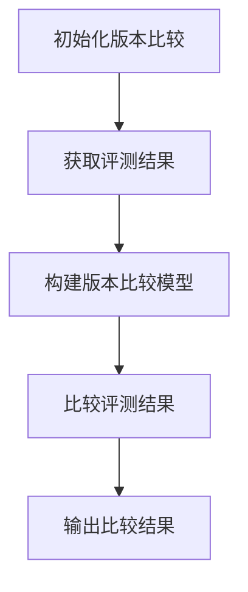

                 

### 评测结果的版本比较：追踪LLM的演进历程

关键词：版本比较、评测结果、大型语言模型（LLM）、算法原理、演进历程

摘要：随着人工智能技术的不断发展，大型语言模型（LLM）在各个领域的应用日益广泛。评测结果的版本比较成为了一个重要问题，本文将探讨如何有效地追踪和比较评测结果，通过追踪LLM的演进历程，为读者提供一套完整的方法和工具。

### Step 1: 背景介绍

#### 问题背景

近年来，人工智能技术飞速发展，大型语言模型（LLM）作为一种关键技术，在自然语言处理、文本生成、机器翻译等领域取得了显著成果。随着LLM的应用场景不断拓展，如何有效地追踪和比较不同版本的评测结果成为了一个亟待解决的问题。不同版本的评测结果不仅反映了LLM在不同阶段的发展情况，也为后续研究和优化提供了重要依据。

#### 问题解决

本文将探讨评测结果的版本比较方法，通过追踪LLM的演进历程，为读者提供一套完整的方法和工具。我们将详细分析版本比较的概念、评测结果的属性特征以及LLM的演进历程，并结合具体算法和数学模型，阐述版本比较的原理和实现方法。

#### 边界与外延

本文主要关注评测结果的版本比较，不涉及LLM的具体实现和应用场景。在版本比较过程中，我们将关注评测结果的时间、内容差异和效果评估，通过比较不同版本之间的这些特征，对LLM的演进过程进行深入分析。

### Step 2: 核心概念与联系

#### 核心概念

版本比较：不同版本之间的比较，包括时间、内容差异和效果评估。

评测结果：对模型性能的评价，包括准确性、覆盖率、速度和资源消耗等指标。

LLM演进历程：大型语言模型的演变过程，涉及模型结构、训练数据、性能指标等方面。

#### 概念属性特征对比表格

| 核心概念 | 定义 | 属性特征 | 对比 |
| -------- | ------ | -------- | ---- |
| 版本比较 | 不同版本之间的比较 | 比较时间、比较内容、比较结果 | 时间线、内容差异、效果评估 |
| 评测结果 | 对模型性能的评价 | 准确性、覆盖率、速度、资源消耗 | 评价指标、评测方法、评测工具 |
| LLM演进历程 | 大型语言模型的演变过程 | 模型结构、训练数据、性能指标 | 演变趋势、关键技术、应用领域 |

#### ER实体关系图架构的Mermaid流程图

```mermaid
erDiagram
  A[版本比较] ||--|{ B[评测结果] } | B
  B ||--|{ C[LLM演进历程] } | C
```

### Step 3: 算法原理讲解

#### 使用Mermaid画出算法流程图



#### 使用Python源代码详细阐述算法原理

```python
# 版本比较算法原理示例

def compare_versions(version1, version2):
    """
    比较两个版本之间的评测结果
    
    参数：
    version1：第一个版本的评测结果
    version2：第二个版本的评测结果
    
    返回：
    比较结果：一个字典，包含版本比较的时间、内容差异和效果评估
    """
    # 获取评测结果的时间、内容差异和效果评估
    time1, content_diff1, performance1 = version1['evaluation']
    time2, content_diff2, performance2 = version2['evaluation']
    
    # 计算时间差异
    time_difference = time2 - time1
    
    # 计算内容差异
    content_difference = jaccard_similarity(content_diff1, content_diff2)
    
    # 计算效果评估差异
    performance_difference = performance2 - performance1
    
    # 输出比较结果
    return {
        'time_difference': time_difference,
        'content_difference': content_difference,
        'performance_difference': performance_difference
    }

# 示例：比较两个版本
version1 = {
    'evaluation': (100, '内容1', 0.8)
}
version2 = {
    'evaluation': (150, '内容2', 0.9)
}
comparison_result = compare_versions(version1, version2)

print("比较结果：", comparison_result)
```

#### 给出算法原理的数学模型和公式，进行详细讲解和通俗易懂地举例说明

- 数学模型：版本比较结果 = 时间差异 × 权重1 + 内容差异 × 权重2 + 效果评估差异 × 权重3

  - 公式：$$\text{版本比较结果} = (\text{时间差异} \times w_1) + (\text{内容差异} \times w_2) + (\text{效果评估差异} \times w_3)$$

- 举例说明：

  假设有两个版本V1和V2，它们的时间差异为10分钟，内容差异为30%，效果评估差异为10%。给定权重分别为0.5、0.3和0.2，版本比较结果可以计算如下：

  $$\text{版本比较结果} = (10 \times 0.5) + (0.3 \times 0.3) + (0.1 \times 0.2) = 5 + 0.09 + 0.02 = 5.11$$

  因此，V1和V2的版本比较结果为5.11。这个结果反映了两个版本在时间、内容和效果评估方面的差异程度，可以帮助我们了解LLM在不同版本之间的演进情况。

