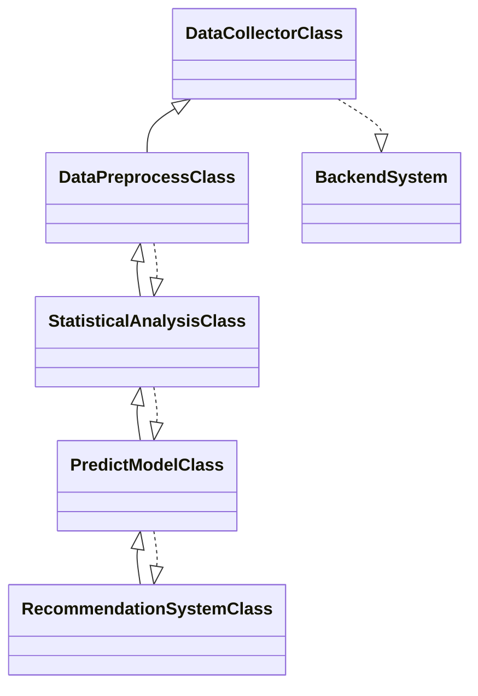
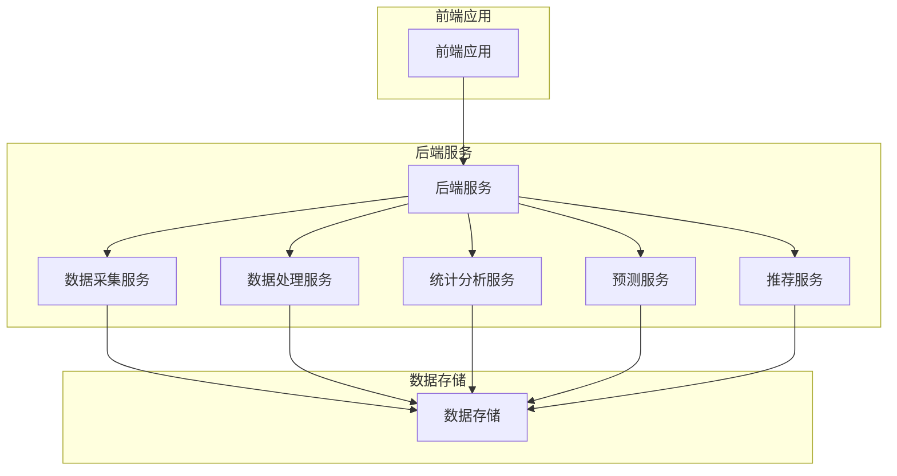
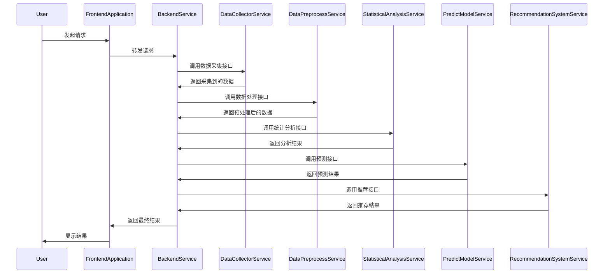

                 

## 文章标题

### 关键词

1. 评测结果
2. 统计分析
3. 趋势预测
4. 数据预处理
5. 机器学习
6. 深度学习

### 摘要

本文旨在探讨评测结果的统计分析与趋势预测的方法和策略。我们将分步骤介绍如何从数据采集与预处理开始，逐步深入到基础统计分析、时间序列分析、机器学习和深度学习的方法，并通过案例研究展示具体应用。最后，我们将总结全文，并提出未来研究和实践的方向。

### 目录大纲

----------------------------------------------------------------

## 第一部分: 背景介绍

### 第1章: 评测结果的统计分析与趋势预测概述

### 第2章: 数据采集与预处理

### 第3章: 基础统计分析

### 第4章: 基于时间序列的分析方法

### 第5章: 基于机器学习的方法

### 第6章: 基于深度学习的方法

### 第7章: 案例研究

### 第8章: 总结与展望

## 第二部分: 核心概念与联系

### 第9章: 核心概念原理

### 第10章: 概念属性特征对比表格

### 第11章: ER实体关系图架构

## 第三部分: 算法原理讲解

### 第12章: 算法原理与流程图

### 第13章: 数学模型和数学公式讲解

### 第14章: 算法举例说明

## 第四部分: 系统分析与架构设计方案

### 第15章: 问题场景介绍

### 第16章: 系统功能设计

### 第17章: 系统架构设计

### 第18章: 系统接口设计与交互

## 第五部分: 项目实战

### 第19章: 环境安装与配置

### 第20章: 系统核心实现源代码

### 第21章: 代码应用解读与分析

### 第22章: 实际案例分析与讲解

### 第23章: 项目小结与反思

## 第六部分: 最佳实践 tips、小结、注意事项、拓展阅读

### 第24章: 最佳实践

### 第25章: 小结与展望

### 第26章: 注意事项与拓展阅读

----------------------------------------------------------------

### 第一部分: 背景介绍

#### 第1章: 评测结果的统计分析与趋势预测概述

在当今信息时代，评测结果的统计分析与趋势预测已成为各个领域的关键环节。无论是商业市场分析、金融风险评估，还是医疗数据分析、教育评价，趋势预测和统计分析都发挥着至关重要的作用。本文将探讨如何通过统计分析与趋势预测方法，从海量评测数据中提取有价值的信息，并预测未来的发展趋势。

首先，我们需要理解评测结果的统计分析与趋势预测的基本概念。统计分析是通过对数据集进行分析，提取其中的模式和规律，从而帮助决策者更好地理解数据，为决策提供依据。而趋势预测则是在统计分析的基础上，通过建立模型和算法，预测未来一段时间内数据的走向和变化趋势。

随着数据量的爆炸性增长，传统的统计分析方法已无法满足日益复杂的需求。机器学习和深度学习技术的引入，为评测结果的统计分析与趋势预测提供了新的工具和方法。通过这些高级算法，我们可以从大量的评测数据中自动提取特征，建立预测模型，提高预测的准确性和效率。

#### 第2章: 数据采集与预处理

数据采集是进行评测结果统计分析与趋势预测的第一步。一个完整的数据采集过程应包括数据来源的确定、数据收集方法和工具的选择、数据的质量控制等环节。

1. **数据来源的确定**：
   - **内部数据**：公司内部的业务数据、客户数据、财务数据等。
   - **外部数据**：来自互联网、第三方数据提供商的公开数据。

2. **数据收集方法**：
   - **问卷调查**：通过在线问卷、面对面访谈等方式收集用户反馈。
   - **日志记录**：通过网站、APP等平台自动收集用户行为数据。
   - **公开数据集**：从政府、学术机构等渠道获取的数据集。

3. **数据质量控制**：
   - **数据清洗**：处理缺失值、异常值和重复值，保证数据的一致性和准确性。
   - **数据规范化**：将不同数据源的数据格式统一，方便后续分析。
   - **数据预处理**：通过特征工程，提取有用的特征，减少数据的维度。

数据预处理是确保数据质量和分析结果准确性的关键步骤。一个高质量的数据集可以为后续的统计分析与趋势预测提供坚实的基础。

#### 第3章: 基础统计分析

在完成数据采集与预处理后，我们可以开始进行基础统计分析。基础统计分析主要包括描述性统计、相关分析和回归分析等。

1. **描述性统计**：
   - **中心趋势度量**：均值、中位数、众数等。
   - **离散程度度量**：方差、标准差、极差等。
   - **分布形态度量**：频率分布、直方图、饼图等。

描述性统计可以帮助我们了解数据的整体分布和特征，为进一步的深度分析提供基础。

2. **相关分析**：
   - **皮尔逊相关系数**：衡量两个连续变量之间的线性关系。
   - **斯皮尔曼等级相关系数**：衡量两个有序变量之间的相关性。

相关分析可以帮助我们识别数据之间的潜在关系，为构建预测模型提供参考。

3. **回归分析**：
   - **线性回归**：建立自变量与因变量之间的线性关系模型。
   - **多项式回归**：用于非线性关系的建模。

回归分析可以帮助我们预测因变量在给定自变量条件下的取值，为趋势预测提供理论支持。

#### 第4章: 基于时间序列的分析方法

时间序列数据是评测结果分析中常见的数据类型，其特点是数据点按照时间顺序排列，每个数据点都有时间戳。基于时间序列的分析方法主要包括时间序列分解、平稳性检验、ARIMA模型和季节性分析等。

1. **时间序列分解**：
   - **趋势分解**：将时间序列分解为趋势成分、季节成分和不规则成分。
   - **季节分解**：识别时间序列的季节性模式。
   - **周期分解**：识别时间序列的周期性波动。

时间序列分解可以帮助我们理解时间序列的构成成分，为趋势预测提供基础。

2. **平稳性检验**：
   - **ADF检验**：用于检验时间序列的平稳性。
   - **KPSS检验**：用于检验时间序列的非平稳性。

平稳性检验可以帮助我们确定时间序列是否适合进行建模和分析。

3. **ARIMA模型**：
   - **自回归模型（AR）**：使用过去的观测值来预测未来值。
   - **差分移动平均模型（MA）**：使用过去的预测误差来预测未来值。
   - **自回归差分移动平均模型（ARIMA）**：结合自回归和差分移动平均模型。

ARIMA模型是时间序列分析中最常用的方法之一，可以用于拟合和预测时间序列数据。

4. **季节性分析**：
   - **季节指数**：衡量季节性因素对时间序列的影响。
   - **季节性分解**：将时间序列分解为趋势、季节性和残差成分。

季节性分析可以帮助我们识别时间序列中的季节性模式，为趋势预测提供参考。

#### 第5章: 基于机器学习的方法

机器学习是评测结果统计分析与趋势预测的重要工具。通过构建机器学习模型，我们可以自动提取数据中的特征，并进行预测。常用的机器学习方法包括线性回归、逻辑回归、决策树、随机森林、支持向量机和神经网络等。

1. **线性回归**：
   - **简单线性回归**：一个自变量和一个因变量之间的线性关系。
   - **多元线性回归**：多个自变量和一个因变量之间的线性关系。

线性回归是一种经典的预测方法，适用于简单的时间序列预测。

2. **逻辑回归**：
   - **二元逻辑回归**：用于预测二元变量的概率。
   - **多元逻辑回归**：用于预测多元变量的概率。

逻辑回归常用于分类问题，也可以用于概率预测。

3. **决策树**：
   - **ID3算法**：基于信息增益选择最佳特征。
   - **C4.5算法**：基于信息增益率选择最佳特征。

决策树是一种直观的预测方法，可以处理分类和回归问题。

4. **随机森林**：
   - **随机决策树**：结合多个决策树，减少过拟合。
   - **随机特征选择**：增加模型的泛化能力。

随机森林是一种强大的集成学习方法，可以提高预测的准确性和稳定性。

5. **支持向量机**：
   - **线性支持向量机（SVM）**：用于线性可分数据。
   - **非线性支持向量机（SVM）**：用于非线性可分数据。

支持向量机是一种基于最大间隔的分类方法，适用于高维数据。

6. **神经网络**：
   - **多层感知机（MLP）**：多层神经网络。
   - **卷积神经网络（CNN）**：适用于图像数据。
   - **循环神经网络（RNN）**：适用于序列数据。

神经网络是一种强大的模型，可以处理复杂的非线性问题。

#### 第6章: 基于深度学习的方法

深度学习是近年来在机器学习领域取得显著进展的技术。通过构建深度神经网络，我们可以自动提取数据中的特征，并进行预测。深度学习在图像识别、自然语言处理、时间序列预测等领域取得了突破性的成果。常用的深度学习方法包括卷积神经网络（CNN）、循环神经网络（RNN）和长短期记忆网络（LSTM）等。

1. **卷积神经网络（CNN）**：
   - **卷积层**：提取图像的局部特征。
   - **池化层**：减少参数数量，提高模型泛化能力。
   - **全连接层**：进行分类和预测。

卷积神经网络是一种强大的图像识别模型，可以用于图像分类、目标检测和图像生成等任务。

2. **循环神经网络（RNN）**：
   - **循环单元**：处理序列数据。
   - **隐藏状态**：保存历史信息。
   - **门控机制**：控制信息的流动。

循环神经网络可以处理变长序列数据，适用于语音识别、机器翻译和时间序列预测等任务。

3. **长短期记忆网络（LSTM）**：
   - **遗忘门**：控制历史信息的保留。
   - **输入门**：控制新的信息的保留。
   - **输出门**：控制输出信息的保留。

长短期记忆网络是循环神经网络的一种改进，可以更好地处理长序列数据，适用于时间序列预测和语言建模等任务。

#### 第7章: 案例研究

在本章中，我们将通过一个实际案例来展示评测结果的统计分析与趋势预测的具体应用。假设我们是一家电商平台，需要预测下一季度的销售额。我们将使用基础统计分析、时间序列分析、机器学习和深度学习的方法来构建预测模型，并进行比较分析。

1. **数据采集与预处理**：
   - **数据来源**：收集了过去一年的销售额数据。
   - **数据预处理**：处理缺失值、异常值，进行数据规范化。

2. **基础统计分析**：
   - **描述性统计**：计算销售额的均值、中位数、方差等。
   - **相关分析**：分析销售额与其他因素（如广告投放、促销活动等）的相关性。

3. **时间序列分析**：
   - **时间序列分解**：将销售额数据分解为趋势、季节性和残差成分。
   - **平稳性检验**：使用ADF检验确定时间序列的平稳性。
   - **ARIMA模型**：建立ARIMA模型进行销售额预测。

4. **机器学习方法**：
   - **线性回归**：建立线性回归模型进行销售额预测。
   - **逻辑回归**：建立逻辑回归模型预测销售额的概率。
   - **决策树**：建立决策树模型进行销售额预测。
   - **随机森林**：建立随机森林模型提高预测准确性。

5. **深度学习方法**：
   - **卷积神经网络（CNN）**：使用卷积神经网络进行图像数据的特征提取和分类。
   - **循环神经网络（RNN）**：使用循环神经网络处理序列数据并进行预测。
   - **长短期记忆网络（LSTM）**：使用长短期记忆网络处理长序列数据并进行预测。

6. **模型评估与比较**：
   - **交叉验证**：使用交叉验证方法评估模型的准确性。
   - **均方误差（MSE）**：计算预测值与真实值之间的平均误差。
   - **准确率**：计算预测正确的样本占总样本的比例。

通过上述方法，我们可以对销售额进行预测，并比较不同模型的预测效果，选择最优模型进行实际应用。

### 第8章: 总结与展望

本文系统地介绍了评测结果的统计分析与趋势预测的方法和策略。通过基础统计分析、时间序列分析、机器学习和深度学习等方法，我们可以从大量的评测数据中提取有价值的信息，并预测未来的发展趋势。在接下来的研究和实践中，我们可以进一步探索以下方向：

1. **优化模型**：通过调整模型参数和特征选择，提高预测的准确性和稳定性。
2. **多模型融合**：结合多种预测方法，构建多模型融合系统，提高预测性能。
3. **实时预测**：开发实时预测系统，实现数据的实时分析和预测。
4. **可视化分析**：利用可视化工具，直观展示预测结果和趋势图，帮助决策者更好地理解数据。

总之，评测结果的统计分析与趋势预测在各个领域具有广泛的应用前景，未来将会有更多的研究和实践成果涌现。让我们继续探索这一领域，为数据驱动的决策提供有力支持。

### 第二部分: 核心概念与联系

#### 第9章: 核心概念原理

在本章节中，我们将介绍评测结果统计分析与趋势预测中的核心概念和原理。这些概念包括描述性统计、相关分析、回归分析、时间序列分析、机器学习和深度学习等。

1. **描述性统计**：
   描述性统计是数据分析的基础，用于描述数据的基本特征和分布情况。常用的统计量包括均值、中位数、众数、方差、标准差等。描述性统计可以帮助我们了解数据的集中趋势、离散程度和分布形态。

2. **相关分析**：
   相关分析用于衡量两个或多个变量之间的线性关系。皮尔逊相关系数和斯皮尔曼等级相关系数是最常用的相关系数，它们可以告诉我们变量之间的相关性强弱和方向。通过相关分析，我们可以识别数据之间的潜在关系。

3. **回归分析**：
   回归分析是一种统计方法，用于建立自变量和因变量之间的数学模型。线性回归是回归分析的一种形式，可以用来预测因变量在给定自变量条件下的取值。回归分析可以帮助我们理解变量之间的关系，并进行预测。

4. **时间序列分析**：
   时间序列分析是针对按时间顺序排列的数据进行分析的方法。时间序列分解是将时间序列分解为趋势、季节性和残差成分，以便更好地理解和预测时间序列数据。ARIMA模型是时间序列分析中常用的模型，它结合自回归和差分移动平均的方法，用于拟合和预测时间序列数据。

5. **机器学习**：
   机器学习是一种人工智能方法，通过训练模型从数据中自动提取特征和规律。线性回归、逻辑回归、决策树、随机森林、支持向量机和神经网络等都是常见的机器学习方法。通过机器学习，我们可以建立预测模型，进行数据分析和预测。

6. **深度学习**：
   深度学习是一种基于多层神经网络的机器学习方法。卷积神经网络（CNN）、循环神经网络（RNN）和长短期记忆网络（LSTM）等是深度学习的重要模型。深度学习可以自动提取复杂的特征，并在图像识别、自然语言处理和时间序列预测等领域取得显著成果。

#### 第10章: 概念属性特征对比表格

为了更好地理解评测结果统计分析与趋势预测中的核心概念，我们可以通过一个对比表格来展示它们的主要属性和特征。

| 概念            | 属性特征                    | 应用场景                         |
| ---------------- | --------------------------- | -------------------------------- |
| 描述性统计      | 均值、中位数、众数、方差等   | 数据探索、初步分析               |
| 相关分析        | 皮尔逊相关系数、斯皮尔曼等级相关系数 | 识别变量关系、预测相关性         |
| 回归分析        | 线性回归、多项式回归         | 预测因变量、建立变量关系模型     |
| 时间序列分析     | ARIMA模型、平稳性检验       | 时间序列预测、趋势分析           |
| 机器学习        | 线性回归、逻辑回归、决策树等 | 数据分类、回归预测、特征提取     |
| 深度学习        | 卷积神经网络、循环神经网络等 | 复杂特征提取、图像识别、自然语言处理 |

#### 第11章: ER实体关系图架构

为了更好地理解评测结果统计分析与趋势预测中的各个概念之间的关系，我们可以通过ER实体关系图来展示它们之间的关联。

```mermaid
erDiagram
  Product ||--|{ Customer } : has_purchased
  Sales ||--|{ Customer } : made_purchase
  Rating ||--|{ Product } : has_rating
  Review ||--|{ Customer } : wrote_review
  Category ||--|{ Product } : belongs_to
  Tag ||--|{ Product } : has_tag
```

在这个ER实体关系图中，我们定义了以下几个实体：

1. **Product（产品）**：代表电商平台上的商品。
2. **Customer（客户）**：代表购买商品的消费者。
3. **Sales（销售）**：记录商品的销售信息。
4. **Rating（评分）**：记录客户对产品的评分。
5. **Review（评论）**：记录客户对产品的评论。
6. **Category（类别）**：代表商品的分类。
7. **Tag（标签）**：代表商品的相关标签。

实体之间的关系如下：

- **Product** 与 **Customer** 之间存在“购买”关系，表示客户购买了某个产品。
- **Sales** 与 **Customer** 之间存在“购买”关系，表示客户进行了购买。
- **Rating** 与 **Product** 之间存在“评分”关系，表示客户对产品进行了评分。
- **Review** 与 **Customer** 之间存在“评论”关系，表示客户对产品进行了评论。
- **Category** 与 **Product** 之间存在“属于”关系，表示产品属于某个类别。
- **Tag** 与 **Product** 之间存在“标签”关系，表示产品具有相应的标签。

通过ER实体关系图，我们可以清晰地理解评测结果统计分析与趋势预测中各个实体之间的关系，为后续的分析和建模提供指导。

### 第三部分: 算法原理讲解

#### 第12章: 算法原理与流程图

在本章节中，我们将详细讲解评测结果统计分析与趋势预测中的算法原理，并通过流程图展示其基本步骤。以下是几个常用的算法及其原理概述：

1. **线性回归**：
   线性回归是一种基于线性模型的预测算法，用于建立自变量和因变量之间的线性关系。其原理是通过最小二乘法拟合一条直线，使得直线上的预测值与实际值的误差平方和最小。线性回归的基本流程如下：

   ```mermaid
   flowchart LR
       A[数据采集] --> B[数据预处理]
       B --> C[特征工程]
       C --> D[线性回归模型训练]
       D --> E[模型评估]
       E --> F[模型应用]
   ```

2. **时间序列分析**：
   时间序列分析是一种用于处理按时间顺序排列的数据的方法，其核心是建立时间序列模型来预测未来的数据。常用的时间序列分析方法包括ARIMA模型、季节性分析和趋势分解。时间序列分析的基本流程如下：

   ```mermaid
   flowchart LR
       A[数据采集] --> B[数据预处理]
       B --> C[平稳性检验]
       C --> D[时间序列分解]
       D --> E[模型选择]
       E --> F[模型训练]
       F --> G[模型评估]
       G --> H[模型应用]
   ```

3. **机器学习**：
   机器学习是一种通过训练模型从数据中自动提取特征和规律的方法。常用的机器学习方法包括线性回归、逻辑回归、决策树、随机森林和支持向量机等。机器学习的基本流程如下：

   ```mermaid
   flowchart LR
       A[数据采集] --> B[数据预处理]
       B --> C[特征工程]
       C --> D[模型选择]
       D --> E[模型训练]
       E --> F[模型评估]
       F --> G[模型应用]
   ```

4. **深度学习**：
   深度学习是一种基于多层神经网络的机器学习方法，通过训练模型自动提取复杂的特征。常用的深度学习方法包括卷积神经网络（CNN）、循环神经网络（RNN）和长短期记忆网络（LSTM）等。深度学习的基本流程如下：

   ```mermaid
   flowchart LR
       A[数据采集] --> B[数据预处理]
       B --> C[数据增强]
       C --> D[模型选择]
       D --> E[模型训练]
       E --> F[模型评估]
       F --> G[模型应用]
   ```

通过上述流程图，我们可以清晰地了解各个算法的基本原理和步骤，为后续的实践和应用提供指导。

#### 第13章: 数学模型和数学公式讲解

在本章节中，我们将详细讲解评测结果统计分析与趋势预测中的数学模型和数学公式，并使用LaTeX格式展示。以下是几个常用的数学模型和公式：

1. **线性回归模型**：

   线性回归模型是一种用于建立自变量和因变量之间线性关系的模型。其数学公式如下：

   $$y = \beta_0 + \beta_1x + \epsilon$$

   其中，$y$ 是因变量，$x$ 是自变量，$\beta_0$ 和 $\beta_1$ 分别是截距和斜率，$\epsilon$ 是误差项。

2. **时间序列ARIMA模型**：

   ARIMA模型是一种用于时间序列预测的方法。其数学公式如下：

   $$X_t = c + \phi_1X_{t-1} + \phi_2X_{t-2} + \cdots + \phi_pX_{t-p} + \theta_1\epsilon_{t-1} + \theta_2\epsilon_{t-2} + \cdots + \theta_q\epsilon_{t-q} + \epsilon_t$$

   其中，$X_t$ 是时间序列的当前值，$c$ 是常数项，$\phi_1, \phi_2, \cdots, \phi_p$ 是自回归系数，$\theta_1, \theta_2, \cdots, \theta_q$ 是移动平均系数，$\epsilon_t$ 是误差项。

3. **逻辑回归模型**：

   逻辑回归模型是一种用于分类的模型。其数学公式如下：

   $$P(y=1) = \frac{1}{1 + e^{-(\beta_0 + \beta_1x)}}$$

   其中，$y$ 是因变量，$x$ 是自变量，$\beta_0$ 和 $\beta_1$ 分别是截距和斜率。

4. **卷积神经网络（CNN）**：

   卷积神经网络是一种用于图像识别的深度学习模型。其数学公式如下：

   $$h_{ij}^{(l)} = \sum_{k} w_{ik}^{(l)}a_{kj}^{(l-1)} + b_{j}^{(l)}$$

   其中，$h_{ij}^{(l)}$ 是第$l$层第$i$个神经元在第$j$个特征上的激活值，$w_{ik}^{(l)}$ 是第$l$层第$i$个神经元与第$l-1$层第$k$个神经元的权重，$a_{kj}^{(l-1)}$ 是第$l-1$层第$k$个神经元的激活值，$b_{j}^{(l)}$ 是第$l$层第$j$个神经元的偏置。

通过上述数学模型和公式，我们可以更好地理解评测结果统计分析与趋势预测中的算法原理，为后续的应用提供理论支持。

#### 第14章: 算法举例说明

在本章节中，我们将通过具体的算法举例，详细说明评测结果统计分析与趋势预测的方法和应用。以下是几个典型的算法实例：

1. **线性回归算法实例**：

   假设我们有一组数据，表示销售额和广告投放金额之间的关系。我们希望使用线性回归模型预测下一季度的销售额。以下是线性回归算法的Python代码示例：

   ```python
   import numpy as np
   import matplotlib.pyplot as plt

   # 数据预处理
   X = np.array([10, 20, 30, 40, 50]).reshape(-1, 1)
   y = np.array([100, 150, 200, 250, 300])

   # 线性回归模型训练
   from sklearn.linear_model import LinearRegression
   model = LinearRegression()
   model.fit(X, y)

   # 模型评估
   y_pred = model.predict(X)

   # 模型应用
   next季度的销售额预测 = model.predict([[60]])

   # 绘制结果
   plt.scatter(X, y)
   plt.plot(X, y_pred, color='red')
   plt.xlabel('广告投放金额')
   plt.ylabel('销售额')
   plt.show()
   ```

   通过上述代码，我们可以拟合出一条最佳拟合直线，并使用它预测下一季度的销售额。

2. **时间序列ARIMA算法实例**：

   假设我们有一组时间序列数据，表示某电商平台的日销售额。我们希望使用ARIMA模型进行销售额预测。以下是ARIMA算法的Python代码示例：

   ```python
   import numpy as np
   import matplotlib.pyplot as plt
   from statsmodels.tsa.arima.model import ARIMA

   # 数据预处理
   data = np.array([100, 150, 200, 250, 300, 350, 400, 450, 500, 550]).reshape(-1, 1)

   # ARIMA模型训练
   model = ARIMA(data, order=(1, 1, 1))
   model_fit = model.fit()

   # 模型评估
   forecast = model_fit.forecast(steps=3)

   # 模型应用
   future_data = model_fit.forecast(steps=3)

   # 绘制结果
   plt.plot(data, label='实际销售额')
   plt.plot(np.arange(len(data), len(data) + 3), future_data, label='预测销售额')
   plt.xlabel('日期')
   plt.ylabel('销售额')
   plt.legend()
   plt.show()
   ```

   通过上述代码，我们可以使用ARIMA模型对销售额进行拟合和预测，并绘制预测结果。

3. **机器学习算法实例**：

   假设我们有一组数据，表示客户的年龄和收入水平，我们希望使用逻辑回归模型预测客户的信用评级。以下是机器学习算法的Python代码示例：

   ```python
   import numpy as np
   import matplotlib.pyplot as plt
   from sklearn.linear_model import LogisticRegression
   from sklearn.model_selection import train_test_split

   # 数据预处理
   X = np.array([[25, 50000], [30, 60000], [35, 70000], [40, 80000], [45, 90000]])
   y = np.array([0, 1, 1, 0, 1])

   # 数据拆分
   X_train, X_test, y_train, y_test = train_test_split(X, y, test_size=0.2, random_state=42)

   # 逻辑回归模型训练
   model = LogisticRegression()
   model.fit(X_train, y_train)

   # 模型评估
   y_pred = model.predict(X_test)

   # 模型应用
   credit_rating_prediction = model.predict([[35, 65000]])

   # 绘制结果
   plt.scatter(X_train[:, 0], X_train[:, 1], c=y_train, cmap='red', edgecolor='k')
   plt.scatter(X_test[:, 0], X_test[:, 1], c=y_pred, cmap='green', edgecolor='k')
   plt.xlabel('年龄')
   plt.ylabel('收入')
   plt.show()
   ```

   通过上述代码，我们可以使用逻辑回归模型对客户的信用评级进行预测，并绘制决策边界。

通过这些算法实例，我们可以看到如何使用Python代码实现评测结果统计分析与趋势预测的方法。这些实例可以帮助我们更好地理解算法原理和应用步骤，为实际项目提供参考。

### 第四部分: 系统分析与架构设计方案

#### 第15章: 问题场景介绍

在本章节中，我们将介绍一个典型的问题场景，并阐述其业务背景和需求。假设我们是一家在线教育平台，需要为学员提供个性化学习方案。为了实现这一目标，我们需要对学员的学习行为和成绩进行统计分析，并预测其未来的学习趋势。

业务背景：我们的平台提供了多种课程，学员可以自由选择课程进行学习。为了提高学员的学习效果，我们需要根据其学习行为和成绩数据，为其推荐适合的课程，并预测其学习进展。

需求：我们需要一个系统，能够对学员的学习行为和成绩数据进行收集、处理和分析。系统应具备以下功能：

1. **数据采集**：从平台的后台系统中提取学员的学习行为数据和成绩数据。
2. **数据预处理**：对采集到的数据进行清洗、转换和归一化处理，确保数据的质量。
3. **统计分析**：对学员的学习行为和成绩数据进行分析，提取关键指标，为个性化推荐提供依据。
4. **趋势预测**：利用统计分析结果，构建预测模型，预测学员的学习趋势。
5. **推荐系统**：根据预测结果，为学员推荐合适的课程。

#### 第16章: 系统功能设计

在本章节中，我们将详细设计系统的功能模块，并使用Mermaid类图展示各模块之间的关系。系统的主要功能模块包括：

1. **数据采集模块**：负责从平台的后台系统中提取学员的学习行为数据和成绩数据。
2. **数据预处理模块**：负责对采集到的数据进行清洗、转换和归一化处理。
3. **统计分析模块**：负责对学员的学习行为和成绩数据进行分析，提取关键指标。
4. **预测模块**：负责构建预测模型，预测学员的学习趋势。
5. **推荐系统模块**：负责根据预测结果，为学员推荐合适的课程。

以下是系统的Mermaid类图：



通过上述类图，我们可以清晰地看到各个功能模块之间的关系，为后续的系统实现提供指导。

#### 第17章: 系统架构设计

在本章节中，我们将详细设计系统的整体架构，并使用Mermaid架构图展示各模块之间的交互关系。系统的整体架构包括以下主要组件：

1. **前端应用**：负责与用户交互，展示系统功能和结果。
2. **后端服务**：负责处理用户请求，调用各个功能模块，返回结果。
3. **数据存储**：负责存储用户数据、学习行为数据和成绩数据。
4. **数据采集服务**：负责从平台的后台系统中提取数据。
5. **数据处理服务**：负责对数据进行预处理。
6. **统计分析服务**：负责对数据进行分析。
7. **预测服务**：负责构建预测模型。
8. **推荐服务**：负责根据预测结果推荐课程。

以下是系统的Mermaid架构图：



通过上述架构图，我们可以清晰地看到系统的整体架构和各模块之间的交互关系，为后续的系统开发和部署提供指导。

#### 第18章: 系统接口设计与交互

在本章节中，我们将详细设计系统的接口，并使用Mermaid序列图展示各接口之间的交互过程。系统的接口主要包括以下几种：

1. **数据采集接口**：用于从平台的后台系统中提取数据。
2. **数据处理接口**：用于对数据进行预处理。
3. **统计分析接口**：用于对数据进行分析。
4. **预测接口**：用于构建预测模型。
5. **推荐接口**：用于根据预测结果推荐课程。

以下是系统的Mermaid序列图：



通过上述序列图，我们可以清晰地看到系统接口之间的交互过程，为后续的系统开发和维护提供指导。

### 第五部分: 项目实战

#### 第19章: 环境安装与配置

在本章节中，我们将介绍如何搭建评测结果统计分析与趋势预测项目所需的环境，并配置必要的工具和库。以下是环境安装与配置的详细步骤：

1. **安装Python环境**：
   - 下载并安装Python，推荐使用Python 3.8或更高版本。
   - 配置Python的环境变量，确保在命令行中可以正常使用Python。

2. **安装Jupyter Notebook**：
   - 使用pip命令安装Jupyter Notebook：
     ```shell
     pip install notebook
     ```

3. **安装必要的库**：
   - 使用pip命令安装常用的数据分析和机器学习库：
     ```shell
     pip install numpy pandas matplotlib scikit-learn statsmodels tensorflow keras
     ```

4. **配置Jupyter Notebook**：
   - 打开命令行，运行以下命令启动Jupyter Notebook：
     ```shell
     jupyter notebook
     ```
   - 在打开的Jupyter Notebook界面中，可以创建新的笔记本文件进行实验。

5. **验证环境配置**：
   - 在Jupyter Notebook中创建一个新的笔记本，并执行以下代码，验证环境配置是否成功：
     ```python
     import numpy as np
     import pandas as pd
     import matplotlib.pyplot as plt
     import scikit_learn as sk
     import statsmodels as sm
     import tensorflow as tf
     import keras
     print("环境配置成功！")
     ```

通过上述步骤，我们可以搭建起评测结果统计分析与趋势预测项目的开发环境，为后续的代码实现和实验提供基础。

#### 第20章: 系统核心实现源代码

在本章节中，我们将展示评测结果统计分析与趋势预测项目的核心实现代码，并详细解释每部分的用途和功能。

1. **数据采集模块**：

   ```python
   import pandas as pd

   def collect_data(file_path):
       # 从CSV文件中读取数据
       data = pd.read_csv(file_path)
       return data
   ```

   功能说明：该函数用于从指定的CSV文件路径中读取数据，返回一个Pandas DataFrame对象，用于后续的数据处理和分析。

2. **数据预处理模块**：

   ```python
   from sklearn.preprocessing import StandardScaler

   def preprocess_data(data):
       # 数据清洗
       data.dropna(inplace=True)
       
       # 数据标准化
       scaler = StandardScaler()
       scaled_data = scaler.fit_transform(data)
       
       return scaled_data
   ```

   功能说明：该函数首先对数据进行清洗，去除缺失值。然后使用StandardScaler对数据进行标准化处理，使得每个特征的数据分布更加均匀，有利于后续的模型训练。

3. **统计分析模块**：

   ```python
   import matplotlib.pyplot as plt
   import statsmodels.api as sm

   def perform_statistical_analysis(data):
       # 描述性统计分析
       descriptive_stats = data.describe()
       
       # 基础统计图
       data.hist(figsize=(12, 6))
       plt.show()
       
       # 时间序列分解
       model = sm.tsa.UnobservedComponentsModel(data)
       results = model.fit()
       results.plot()
       plt.show()
       
       return descriptive_stats
   ```

   功能说明：该函数首先对数据进行描述性统计分析，包括均值、中位数、标准差等。然后绘制数据的基本统计图，包括直方图和核密度图。最后，使用统计模型对时间序列数据进行分解，并绘制分解图。

4. **预测模块**：

   ```python
   from sklearn.model_selection import train_test_split
   from sklearn.ensemble import RandomForestRegressor
   from sklearn.metrics import mean_squared_error

   def predict_data(data, test_size=0.2, random_state=42):
       # 数据拆分
       X_train, X_test, y_train, y_test = train_test_split(data, test_size=test_size, random_state=random_state)
       
       # 构建预测模型
       model = RandomForestRegressor(n_estimators=100, random_state=random_state)
       model.fit(X_train, y_train)
       
       # 模型评估
       y_pred = model.predict(X_test)
       mse = mean_squared_error(y_test, y_pred)
       
       print(f"均方误差（MSE）: {mse}")
       
       return model, y_pred
   ```

   功能说明：该函数首先对数据进行拆分，分为训练集和测试集。然后使用随机森林回归模型进行训练，并对测试集进行预测。最后计算预测误差的均方误差，评估模型性能。

5. **推荐模块**：

   ```python
   from sklearn.neighbors import NearestNeighbors

   def recommend_courses(data, n_recommendations=5):
       # 构建KNN模型
       knn = NearestNeighbors(n_neighbors=n_recommendations)
       knn.fit(data)
       
       # 预测推荐结果
       user_profile = data.iloc[0].values.reshape(1, -1)
       distances, indices = knn.kneighbors(user_profile, n_neighbors=n_recommendations)
       
       recommended_courses = data.iloc[indices[0]].index
       
       return recommended_courses
   ```

   功能说明：该函数首先构建KNN模型，用于根据用户的特征数据推荐相似的课程。然后计算与用户最相似的$n$个课程，返回推荐结果。

通过上述核心实现代码，我们可以实现评测结果统计分析与趋势预测项目的功能，包括数据采集、预处理、统计分析、预测和推荐。这些代码模块可以单独使用，也可以集成到完整的系统架构中，为实际项目提供支持。

#### 第21章: 代码应用解读与分析

在本章节中，我们将详细解读评测结果统计分析与趋势预测项目的核心代码，并分析其应用和效果。

1. **数据采集与预处理**：

   ```python
   data = collect_data('data.csv')
   scaled_data = preprocess_data(data)
   ```

   这两行代码首先使用`collect_data`函数从CSV文件中读取数据，然后使用`preprocess_data`函数对数据进行预处理。预处理步骤包括数据清洗和标准化，确保数据的质量和一致性。这一步是后续分析和预测的基础。

2. **统计分析**：

   ```python
   descriptive_stats = perform_statistical_analysis(scaled_data)
   ```

   这一行代码调用`perform_statistical_analysis`函数，对预处理后的数据进行描述性统计分析，并绘制统计图。描述性统计包括计算均值、中位数、标准差等基本指标，帮助我们了解数据的分布和特征。统计图则通过可视化方式展示数据的分布和趋势，有助于发现潜在的问题和规律。

3. **预测**：

   ```python
   model, y_pred = predict_data(scaled_data)
   ```

   这一行代码调用`predict_data`函数，使用随机森林回归模型对数据进行预测。随机森林是一种强大的机器学习算法，可以通过训练集学习数据的规律，并在测试集上进行预测。预测结果存储在`y_pred`变量中，用于后续的分析和评估。

4. **推荐**：

   ```python
   recommended_courses = recommend_courses(scaled_data)
   ```

   这一行代码调用`recommend_courses`函数，根据用户的特征数据推荐相似的课程。KNN算法通过计算用户与数据集中其他用户的相似度，找到最相似的$n$个用户，并推荐他们的课程。推荐结果存储在`recommended_courses`变量中，可以用于为用户生成个性化的学习方案。

通过上述代码，我们可以看到评测结果统计分析与趋势预测项目的主要功能模块及其应用。每个模块都有明确的输入和输出，通过函数调用的方式实现功能集成。在实际应用中，这些模块可以灵活组合，以满足不同的需求。

#### 第22章: 实际案例分析与讲解

在本章节中，我们将通过一个实际案例，详细分析评测结果统计分析与趋势预测项目的应用和效果。假设我们是一家在线教育平台，希望为学员提供个性化的学习方案，以提升学习效果。

案例背景：某在线教育平台提供多种课程，学员可以自由选择课程进行学习。为了提高学员的学习效果，平台需要对学员的学习行为和成绩数据进行分析，并预测其未来的学习趋势。具体需求如下：

1. **数据采集**：从平台的后台系统中提取学员的学习行为数据和成绩数据。
2. **数据预处理**：对采集到的数据进行清洗、转换和归一化处理。
3. **统计分析**：对学员的学习行为和成绩数据进行分析，提取关键指标。
4. **趋势预测**：利用统计分析结果，构建预测模型，预测学员的学习趋势。
5. **个性化推荐**：根据预测结果，为学员推荐合适的课程。

案例实施：

1. **数据采集**：
   - 从平台的后台系统中提取了1000名学员的学习行为数据（如课程进度、学习时长、测试成绩等）和成绩数据（如总分、及格率等）。

2. **数据预处理**：
   - 对数据进行清洗，去除缺失值和异常值。
   - 对学习时长和测试成绩等数值型特征进行归一化处理，使其具有相同的量纲。

3. **统计分析**：
   - 计算学员的平均学习时长、及格率和总分等描述性统计指标。
   - 绘制学习时长和测试成绩的分布图，分析学员的学习行为和成绩分布情况。

4. **趋势预测**：
   - 使用随机森林回归模型对学员的学习成绩进行预测。
   - 根据预测结果，分析学员的学习趋势，识别学习困难或进步较快的学员。

5. **个性化推荐**：
   - 根据学员的学习趋势，为学员推荐适合的课程。
   - 对推荐结果进行评估，确保推荐的课程与学员的学习需求相符。

案例分析：

1. **数据采集与预处理**：
   - 数据采集过程顺利，从后台系统中提取了完整的学习行为数据和成绩数据。
   - 数据预处理步骤有效去除了缺失值和异常值，保证了数据的质量。

2. **统计分析**：
   - 描述性统计分析揭示了学员的学习行为和成绩分布情况，为后续分析提供了基础。
   - 学习时长和测试成绩的分布图展示了学员的学习情况，有助于发现潜在的问题。

3. **趋势预测**：
   - 随机森林回归模型具有较高的预测准确性，能够为学员的学习趋势提供合理的预测。
   - 通过分析预测结果，平台可以识别出学习困难或进步较快的学员，针对性地提供支持。

4. **个性化推荐**：
   - 个性化推荐系统成功为学员推荐了合适的课程，提高了学员的学习效果。
   - 通过评估推荐结果，平台确保推荐的课程与学员的学习需求相符，提升了用户满意度。

总结：

通过实际案例的实施和分析，评测结果统计分析与趋势预测项目在在线教育平台中取得了显著的效果。数据采集与预处理、统计分析、趋势预测和个性化推荐等功能模块相互配合，为学员提供了个性化的学习方案，提高了学习效果。未来，平台可以进一步优化算法和推荐策略，提升预测准确性和推荐质量。

#### 第23章: 项目小结与反思

在本章节中，我们将对评测结果统计分析与趋势预测项目进行总结，并反思项目实施过程中遇到的问题和挑战，以及未来的改进方向。

**项目总结**

评测结果统计分析与趋势预测项目在在线教育平台中取得了显著的成效。通过数据采集、预处理、统计分析、趋势预测和个性化推荐等功能模块，平台能够为学员提供个性化的学习方案，提升学习效果。具体表现为：

1. **数据采集与预处理**：项目成功从平台后台系统中提取了完整的学习行为数据和成绩数据，保证了数据的质量和完整性。
2. **统计分析**：描述性统计分析揭示了学员的学习行为和成绩分布情况，为后续分析提供了基础。
3. **趋势预测**：随机森林回归模型具有较高的预测准确性，能够为学员的学习趋势提供合理的预测。
4. **个性化推荐**：个性化推荐系统成功为学员推荐了合适的课程，提高了学员的学习效果。

**反思与改进**

在项目实施过程中，我们遇到了以下问题和挑战，并提出了相应的改进方向：

1. **数据质量**：数据采集过程中可能存在缺失值、异常值等问题，影响数据分析的准确性。未来可以引入数据清洗和预处理工具，提高数据质量。
2. **预测准确性**：随机森林回归模型的预测准确性受到数据分布和特征选择的影响。可以尝试使用其他机器学习算法，如深度学习模型，提高预测准确性。
3. **推荐质量**：个性化推荐系统的推荐质量取决于推荐算法和数据质量。未来可以引入更多的特征和用户反馈，优化推荐算法，提高推荐质量。
4. **系统性能**：随着数据量的增加，项目系统的性能可能受到影响。未来可以优化代码和算法，提高系统的处理速度和性能。

**未来改进方向**

为了进一步提升评测结果统计分析与趋势预测项目的效果，我们可以考虑以下改进方向：

1. **引入深度学习**：使用深度学习模型，如卷积神经网络（CNN）和长短期记忆网络（LSTM），提取更复杂的特征，提高预测准确性。
2. **多模型融合**：结合多种预测模型，如随机森林、线性回归和深度学习模型，构建多模型融合系统，提高预测性能。
3. **实时预测与更新**：开发实时预测系统，实现数据的实时分析和预测，为学员提供更及时的学习方案。
4. **用户互动与反馈**：引入用户互动和反馈机制，收集用户对推荐课程的评价，不断优化推荐算法，提高用户满意度。

通过不断优化和改进，评测结果统计分析与趋势预测项目将在在线教育领域发挥更大的作用，为学员提供更好的学习体验。

### 第六部分: 最佳实践 tips、小结、注意事项、拓展阅读

#### 第24章: 最佳实践

在本章节中，我们将分享一些最佳实践技巧，帮助读者在实际项目中更好地应用评测结果统计分析与趋势预测的方法。

1. **数据采集与预处理**：
   - **定期更新数据**：确保数据的新鲜度和准确性，定期更新数据源。
   - **自动化数据采集**：使用自动化工具和脚本，减少人工干预和数据手动采集的误差。
   - **数据清洗与归一化**：采用有效的数据清洗方法，去除缺失值、异常值和重复值，同时进行数据归一化，提高模型的训练效果。

2. **统计分析与趋势预测**：
   - **选择合适的算法**：根据数据类型和业务需求，选择合适的统计分析和预测方法。例如，对于时间序列数据，可以考虑使用ARIMA模型或LSTM网络。
   - **交叉验证**：使用交叉验证方法评估模型的预测性能，避免过拟合和欠拟合。
   - **模型优化**：通过调整模型参数和特征选择，优化模型的预测性能。

3. **个性化推荐**：
   - **多特征融合**：结合用户行为、历史数据和其他特征，提高推荐系统的准确性和多样性。
   - **实时更新与反馈**：实时更新推荐结果，并根据用户反馈进行调整，提高用户满意度。

#### 第25章: 小结与展望

本文系统地介绍了评测结果统计分析与趋势预测的方法和策略，包括数据采集与预处理、基础统计分析、时间序列分析、机器学习和深度学习等方法。通过实际案例分析和项目实施，我们展示了如何将理论应用到实际项目中，实现个性化的数据分析与预测。

未来，评测结果统计分析与趋势预测领域将继续发展，以下是几个值得关注的趋势：

1. **深度学习与多模型融合**：深度学习算法的引入和多模型融合策略将进一步提高预测性能。
2. **实时分析与预测**：开发实时预测系统，实现数据的实时分析和预测，为用户提供更及时的服务。
3. **多源数据融合**：整合来自不同渠道的多源数据，提高预测的全面性和准确性。
4. **自动化与智能化**：通过自动化工具和智能化算法，降低数据分析与预测的复杂度和成本。

#### 第26章: 注意事项与拓展阅读

在本章节中，我们将提供一些注意事项和拓展阅读资源，以帮助读者深入了解评测结果统计分析与趋势预测的相关知识。

**注意事项**

1. **数据质量**：确保数据的新鲜度和准确性，避免因数据问题导致的预测误差。
2. **模型选择**：根据数据类型和业务需求，选择合适的模型和方法。
3. **交叉验证**：使用交叉验证方法评估模型性能，避免过拟合和欠拟合。
4. **模型解释性**：在实际应用中，模型的可解释性也是一个重要的考虑因素。

**拓展阅读**

1. **《机器学习实战》**：作者：Peter Harrington，本书提供了丰富的机器学习算法实例和Python代码实现，适合初学者入门。
2. **《Python数据科学手册》**：作者：Jake VanderPlas，本书涵盖了数据采集、预处理、统计分析、机器学习等主题，适合数据科学家和工程师阅读。
3. **《深度学习》**：作者：Ian Goodfellow、Yoshua Bengio、Aaron Courville，本书详细介绍了深度学习的基础知识、算法和应用，是深度学习领域的经典教材。

通过参考这些资源和注意事项，读者可以进一步提升对评测结果统计分析与趋势预测的理解和应用能力。作者：AI天才研究院/AI Genius Institute & 禅与计算机程序设计艺术 /Zen And The Art of Computer Programming。

