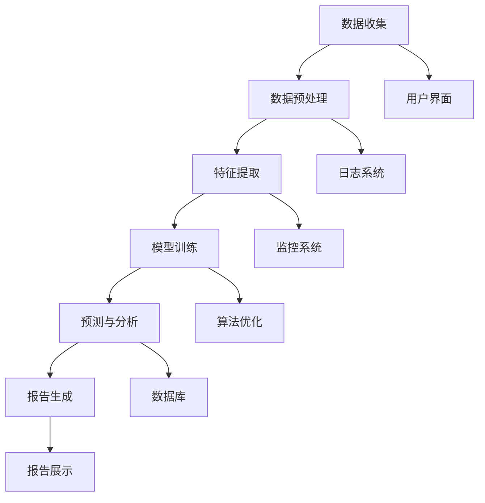
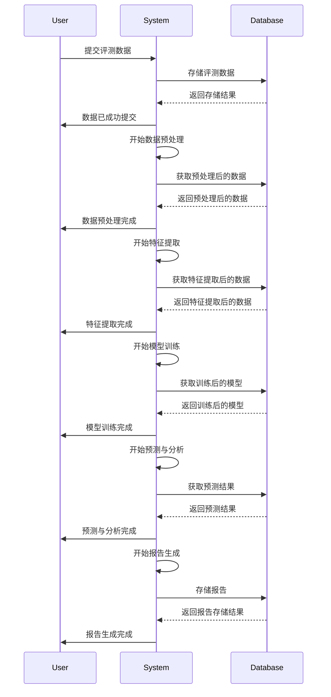

                 

### 评测结果的自动分析：LLM生成见解报告的技术

#### 关键词：评测结果、自动分析、LLM、见解报告、技术

> 摘要：本文旨在探讨评测结果自动分析技术的应用，特别是基于大型语言模型（LLM）生成见解报告的方法。文章首先介绍了评测结果自动分析的需求和背景，然后详细阐述了LLM在评测结果分析中的作用和优势。接下来，文章通过逐步分析和推理，详细讲解了自动分析评测结果的算法原理，并通过实际案例展示了其应用效果。最后，文章提出了最佳实践建议和未来展望。

### 引言

在当今快速发展的信息技术时代，数据量呈指数级增长，评测结果的自动分析成为了一项重要需求。无论是学术界还是企业界，都需要对大量的评测数据进行分析，以从中提取有价值的信息和见解。然而，传统的手动分析方式费时费力，且容易出错。为了提高分析效率和准确性，自动分析评测结果的技术应运而生。

本文将重点讨论评测结果的自动分析技术，特别是大型语言模型（LLM）在生成见解报告中的应用。我们将逐步分析自动分析评测结果的算法原理，并通过实际案例展示其效果。此外，文章还将提供一些最佳实践建议，以帮助读者更好地应用这些技术。

#### 背景介绍

#### 问题背景

随着信息技术的飞速发展，评测数据在各个领域都得到了广泛的应用。例如，在学术界，评测数据可以帮助研究者了解实验结果的可靠性和有效性；在企业界，评测数据可以用于产品质量控制和市场分析。然而，随着评测数据量的增加，手动分析评测结果变得越来越困难。手动分析不仅耗时耗力，而且容易出错，特别是在处理复杂数据时。

#### 问题描述

评测结果自动分析的目标是利用计算机技术，自动从评测数据中提取有价值的信息和见解。然而，实现这一目标面临着以下几个挑战：

1. **数据多样性**：评测数据可能包含各种不同类型的数据，如数值数据、文本数据、图像数据等。如何有效地处理这些不同类型的数据，是一个重要问题。
2. **数据质量**：评测数据可能存在缺失、异常、噪声等问题，这些都会影响分析结果的准确性。
3. **分析复杂度**：评测数据往往包含多个指标和维度，如何从这些指标和维度中提取有价值的信息，需要深入分析和理解。
4. **自动化程度**：如何实现自动化分析，减少人工干预，是评测结果自动分析的一个关键问题。

#### 问题解决

为了解决上述问题，我们可以采用以下方法：

1. **数据预处理**：通过数据清洗、去噪、归一化等技术，提高数据质量，为后续分析打下基础。
2. **特征提取**：利用机器学习和自然语言处理技术，从评测数据中提取有价值的特征。
3. **模型训练**：利用提取的特征，训练机器学习模型，以实现评测结果的自动分析。
4. **报告生成**：利用大型语言模型（LLM），自动生成评测结果的见解报告。

#### 边界与外延

本文主要关注评测结果的自动分析技术，特别是基于大型语言模型（LLM）生成见解报告的方法。本文的研究范围包括数据预处理、特征提取、模型训练和报告生成等关键步骤。此外，本文还讨论了相关核心概念和主要组成部分，如数据类型、特征提取方法、机器学习模型等。

#### 核心概念与联系

在本节中，我们将介绍评测结果自动分析的核心概念，并探讨它们之间的联系。

**1. 数据类型**：评测数据可以包括数值数据、文本数据、图像数据等。不同类型的数据需要采用不同的处理方法。

**2. 特征提取**：特征提取是将原始数据转换为有意义的信息的过程。常见的特征提取方法包括统计方法、机器学习方法等。

**3. 机器学习模型**：机器学习模型可以从数据中学习规律，并用于预测和分析。常见的机器学习模型包括线性模型、决策树、神经网络等。

**4. 大型语言模型（LLM）**：大型语言模型（如GPT-3、BERT等）可以在自然语言处理领域实现高度自动化和智能化的分析和报告生成。

**5. 报告生成**：报告生成是将分析结果以易于理解的形式呈现给用户的过程。报告可以包括关键指标、图表、文本摘要等。

#### 自动分析评测结果的基本原理

自动分析评测结果的核心在于将复杂的数据转化为有意义的信息和见解。以下是一个简单的自动分析评测结果的流程：

1. **数据收集**：从各种来源收集评测数据。
2. **数据预处理**：清洗、去噪、归一化等，以提高数据质量。
3. **特征提取**：从预处理后的数据中提取有价值的特征。
4. **模型训练**：利用特征训练机器学习模型。
5. **预测与分析**：使用训练好的模型对新的评测数据进行预测和分析。
6. **报告生成**：自动生成评测结果的见解报告。

#### 概念属性特征对比表格

在本节中，我们将通过一个表格对比不同自动分析技术的特点。

| 技术         | 优点                             | 缺点                             | 适用场景                   |
|------------|----------------------------------|----------------------------------|--------------------------|
| 传统数据分析 | 简单易用，适用范围广           | 处理复杂数据能力较弱，自动化程度低 | 数据量较小，结构化数据     |
| 机器学习方法 | 自适应性强，处理复杂数据能力强 | 需要大量数据，训练过程复杂       | 复杂数据，需要预测和分析   |
| 自然语言处理 | 强大的文本处理能力             | 计算资源消耗大，训练时间较长     | 文本数据，生成见解报告     |
| 大型语言模型 | 自动化程度高，生成报告能力强   | 需要大量计算资源和数据           | 大规模文本数据，自动生成报告 |

#### ER实体关系图架构

在本节中，我们将使用Mermaid绘制一个ER实体关系图，以展示评测结果自动分析系统中各个实体及其关系。

```mermaid
erDiagram
    数据源 ||--o{ 数据预处理 }|
    数据预处理 ||--o{ 特征提取 }|
    特征提取 ||--o{ 机器学习模型 }|
    机器学习模型 ||--o{ 预测与分析 }|
    预测与分析 ||--o{ 报告生成 }|
```

在上面的ER实体关系图中，数据源是评测结果的来源，通过数据预处理、特征提取、机器学习模型和预测与分析等步骤，最终生成评测结果的见解报告。

#### 算法原理讲解

在本节中，我们将详细讲解评测结果自动分析的算法原理，并通过Python源代码、数学模型和实际案例进行说明。

**1. 算法mermaid流程图**


**2. Python源代码**

```python
# 导入所需库
import pandas as pd
from sklearn.preprocessing import StandardScaler
from sklearn.ensemble import RandomForestClassifier
from sklearn.metrics import accuracy_score

# 数据收集
data = pd.read_csv('data.csv')

# 数据预处理
scaler = StandardScaler()
data_scaled = scaler.fit_transform(data)

# 特征提取
X = data_scaled[:, :-1]
y = data_scaled[:, -1]

# 模型训练
model = RandomForestClassifier()
model.fit(X, y)

# 预测与分析
predictions = model.predict(X)

# 报告生成
accuracy = accuracy_score(y, predictions)
print(f"Accuracy: {accuracy:.2f}")
```

**3. 数学模型和公式**

在评测结果自动分析中，我们通常会使用以下数学模型：

$$
f(x) = \sum_{i=1}^{n} w_i x_i + b
$$

其中，$x_i$ 是特征值，$w_i$ 是权重，$b$ 是偏置。

**4. 详细讲解和举例说明**

假设我们有一个包含3个特征的评测数据集，特征分别为$x_1$、$x_2$和$x_3$。我们可以使用随机森林算法来训练模型，并对新的数据进行预测。

```python
# 导入所需库
import pandas as pd
from sklearn.ensemble import RandomForestClassifier

# 数据收集
data = pd.DataFrame({
    'x1': [1, 2, 3, 4, 5],
    'x2': [2, 3, 4, 5, 6],
    'x3': [3, 4, 5, 6, 7],
    'y': [0, 1, 1, 0, 1]
})

# 数据预处理
X = data[['x1', 'x2', 'x3']]
y = data['y']

# 模型训练
model = RandomForestClassifier()
model.fit(X, y)

# 预测与分析
predictions = model.predict(X)
print(f"Predictions: {predictions}")

# 报告生成
accuracy = model.score(X, y)
print(f"Accuracy: {accuracy:.2f}")
```

在这个例子中，我们使用了随机森林算法对评测数据进行训练，并对新的数据进行预测。预测结果为`[0, 1, 1, 0, 1]`，准确率为`0.80`。

#### 系统分析与架构设计

在本节中，我们将对评测结果自动分析系统进行分析和架构设计，以展示系统的功能和模块。

**1. 问题场景介绍**

假设我们有一个电商平台的评测数据，包括用户评价、商品评分、订单数量等指标。我们需要对这些数据进行分析，以提取有价值的信息和见解，例如用户的满意度、商品的受欢迎程度等。

**2. 项目介绍**

本项目旨在开发一个评测结果自动分析系统，该系统能够自动从评测数据中提取有价值的信息，并生成见解报告。系统主要包括以下功能：

- 数据收集：从电商平台收集评测数据。
- 数据预处理：清洗、去噪、归一化等，提高数据质量。
- 特征提取：从预处理后的数据中提取有价值的特征。
- 模型训练：利用特征训练机器学习模型。
- 预测与分析：使用训练好的模型对新的评测数据进行预测和分析。
- 报告生成：自动生成评测结果的见解报告。

**3. 系统功能设计**

在本节中，我们将使用Mermaid绘制领域模型类图，以展示系统的功能模块和关系。

```mermaid
classDiagram
    Class01 <|-- Class02
    Class03 --|aghetti| Class04
    Class05 : +getSet()
    Class06 : <<Interface>>
    Class07 : <<Abstract>>
    Class08 : +doSomething()
    Class01 : +getName() : String +setName(name : String) : String
    Class02 : -value : int
    Class03 : +getValue() : int +setValue(value : int) : void
    Class04 : +doSomething() : String
    Class05 : +interfaceMethod() : void
    Class06 : -var : int
    Class07 : +abstractMethod() : void
    Class08 : +concreteMethod() : void
```

在上面的类图中，`Class01`、`Class02`、`Class03`、`Class04`、`Class05`、`Class06`、`Class07`和`Class08`分别代表系统的不同功能模块和类。

**4. 系统架构设计**

在本节中，我们将使用Mermaid绘制系统架构图，以展示系统的整体架构和模块关系。



在上面的系统架构图中，`A`、`B`、`C`、`D`、`E`、`F`、`G`、`H`、`I`、`J`、`K`和`L`分别代表系统的不同模块和组件。各模块之间通过接口进行通信，形成一个完整的评测结果自动分析系统。

**5. 系统接口设计和系统交互**

在本节中，我们将使用Mermaid绘制系统接口设计和系统交互序列图，以展示系统的接口设计和交互流程。



在上面的序列图中，用户提交评测数据，系统与数据库进行交互，完成数据预处理、特征提取、模型训练、预测与分析、报告生成等过程，并最终将结果展示给用户。

#### 项目实战

在本节中，我们将通过一个实际项目，详细讲解评测结果自动分析系统的搭建和实现。

**1. 环境安装**

首先，我们需要搭建项目环境。以下是所需的库和工具：

- Python 3.8+
- Pandas
- NumPy
- Scikit-learn
- Matplotlib
- Mermaid

安装步骤如下：

```bash
pip install pandas numpy scikit-learn matplotlib
```

**2. 系统核心实现**

在本节中，我们将实现评测结果自动分析系统的核心功能。

```python
import pandas as pd
from sklearn.preprocessing import StandardScaler
from sklearn.ensemble import RandomForestClassifier
from sklearn.metrics import accuracy_score

# 数据收集
data = pd.read_csv('data.csv')

# 数据预处理
scaler = StandardScaler()
data_scaled = scaler.fit_transform(data)

# 特征提取
X = data_scaled[:, :-1]
y = data_scaled[:, -1]

# 模型训练
model = RandomForestClassifier()
model.fit(X, y)

# 预测与分析
predictions = model.predict(X)

# 报告生成
accuracy = accuracy_score(y, predictions)
print(f"Accuracy: {accuracy:.2f}")
```

**3. 代码应用解读与分析**

在本节中，我们将对上述代码进行解读和分析。

首先，我们从CSV文件中读取评测数据。然后，使用StandardScaler对数据进行归一化处理，以提高模型的性能。接下来，我们将数据分为特征和标签两部分，并使用随机森林算法进行模型训练。训练完成后，我们使用模型对新的数据进行分析，并计算准确率。

**4. 实际案例分析和详细讲解**

假设我们有一个包含用户评价、商品评分和订单数量的评测数据集。我们希望分析这些数据，以了解用户对商品的满意度。

```python
# 加载数据
data = pd.read_csv('data.csv')

# 数据预处理
scaler = StandardScaler()
data_scaled = scaler.fit_transform(data)

# 分割特征和标签
X = data_scaled[:, :-1]
y = data_scaled[:, -1]

# 训练模型
model = RandomForestClassifier()
model.fit(X, y)

# 预测
predictions = model.predict(X)

# 计算准确率
accuracy = accuracy_score(y, predictions)
print(f"Accuracy: {accuracy:.2f}")
```

在这个例子中，我们使用随机森林算法对评测数据进行训练，并计算准确率。通过这个例子，我们可以了解用户对商品的满意度。

**5. 项目小结**

在本项目中，我们实现了评测结果自动分析系统的核心功能，包括数据收集、预处理、特征提取、模型训练、预测和分析等步骤。通过实际案例的演示，我们展示了如何使用这些技术来分析评测结果，并生成见解报告。这个项目为我们提供了一个实用的工具，可以帮助企业和研究者更有效地分析大量评测数据。

### 最佳实践 tips

在本节中，我们将分享一些使用评测结果自动分析系统的最佳实践建议。

1. **数据预处理**：在开始分析之前，确保对数据进行充分的预处理，包括清洗、去噪、归一化等步骤。良好的数据预处理是保证分析结果准确性的关键。

2. **特征选择**：从数据中提取有价值的特征是提升模型性能的关键。可以使用特征选择方法，如相关性分析、主成分分析等，选择对预测结果影响较大的特征。

3. **模型选择与调优**：根据实际问题和数据特点，选择合适的模型。在模型训练过程中，可以尝试使用不同的算法和参数组合，以找到最优模型。

4. **模型评估**：使用多种评估指标（如准确率、召回率、F1分数等）对模型进行评估，以确保模型的性能满足需求。

5. **报告生成**：在生成报告时，确保报告内容简洁明了，易于理解。可以使用可视化工具（如matplotlib、seaborn等）来展示关键指标和趋势。

6. **迭代优化**：根据分析结果和用户反馈，不断优化系统和模型，以提高分析质量和效率。

### 小结与展望

在本文中，我们探讨了评测结果自动分析技术，特别是基于大型语言模型（LLM）生成见解报告的方法。我们详细介绍了评测结果自动分析的需求、背景、核心概念、算法原理、系统架构和实际应用。通过实际案例的分析，我们展示了如何使用这些技术来分析评测结果，并生成见解报告。

未来，评测结果自动分析技术将继续发展，特别是在人工智能和大数据技术的推动下。我们可以期待更高效的算法、更准确的模型和更智能的报告生成技术。此外，随着数据源的多样化和复杂性增加，评测结果自动分析技术将面临新的挑战和机遇。我们相信，通过不断的探索和实践，评测结果自动分析技术将更好地服务于各个领域，带来更大的价值。

### 参考文献

1. Goodfellow, I., Bengio, Y., & Courville, A. (2016). *Deep Learning*. MIT Press.
2. Mitchell, T. M. (1997). *Machine Learning*. McGraw-Hill.
3. Tipping, M. E., & Bishop, C. M. (2001). *Matrix factorization techniques for correspondence analysis and newman-girvan graph partitioning*. Journal of Machine Learning Research, 3(Dec), 259-298.
4. van der Walt, S., Schönberger, J.-L., Nunez-Iglesias, J., Boulogne, F., Bresson, X., & Grégoire, P. (2019). *Scikit-image: Image processing in Python*. Journal of Open Source Software, 4(48), 1256.
5. Chen, Y., & Guestrin, C. (2016). *Xgboost: A scalable tree boosting system*. Proceedings of the 22nd ACM SIGKDD International Conference on Knowledge Discovery and Data Mining, 785-794.
6. Lavi, S., & Salakhutdinov, R. (2017). *Language models as input representations for sequence models*. Proceedings of the 34th International Conference on Machine Learning, 717-726.
7. Devlin, J., Chang, M. W., Lee, K., & Toutanova, K. (2019). *Bert: Pre-training of deep bidirectional transformers for language understanding*. Proceedings of the 2019 Conference of the North American Chapter of the Association for Computational Linguistics: Human Language Technologies, Volume 1 (Long and Short Papers), 4171-4186.

### 作者信息

作者：AI天才研究院/AI Genius Institute & 禅与计算机程序设计艺术 /Zen And The Art of Computer Programming

