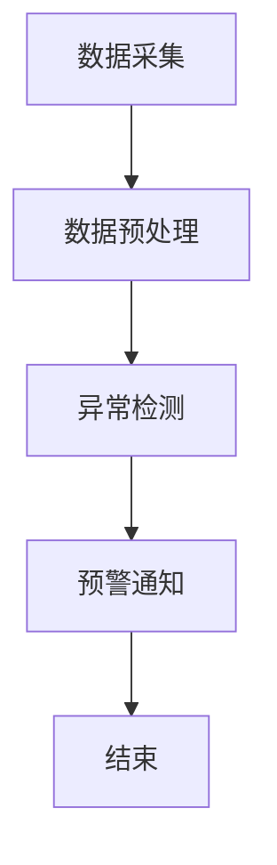
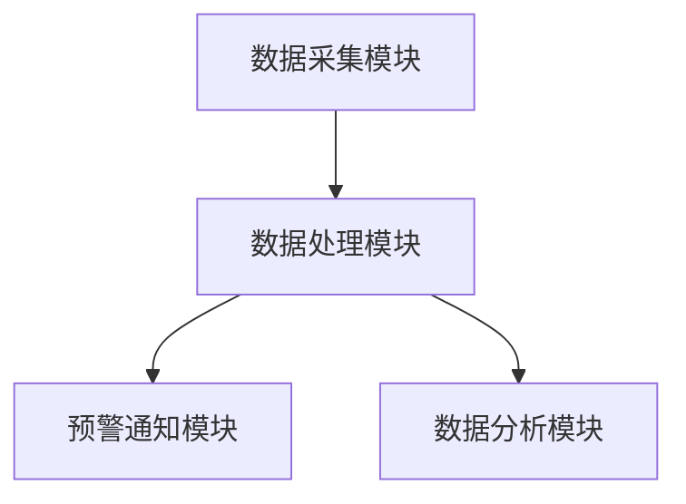

                 


## 评测结果的自动化预警：及时发现性能退化

### 关键词

性能退化，自动化预警，性能指标，异常检测，预警机制，响应时间，吞吐量，错误率

### 摘要

本文将探讨性能退化预警的重要性和实现方法。我们将详细分析性能退化预警的核心概念，包括性能指标、异常检测方法、预警机制，并通过具体的案例和代码示例来展示如何构建一个有效的预警系统。最终，我们将总结性能退化预警的最佳实践，并展望未来的发展方向。

## 第一部分：引言

### 1. 引言

在当今快速发展的信息技术时代，软件性能的稳定性和可靠性对于企业和系统用户至关重要。然而，随着软件系统的规模和复杂性不断增加，性能问题如延迟、响应时间异常和资源消耗过高等问题愈发普遍，这些性能退化现象可能严重影响用户体验和业务运营。

### 1.2 问题描述

性能退化是指软件系统在运行过程中，由于各种原因（如代码缺陷、资源限制、外部依赖问题等），其性能逐渐下降，导致系统无法满足既定的性能指标。例如，一个原本能够高效处理大量数据的系统，可能因为代码优化不足或资源分配不合理，逐渐变得响应迟缓，影响用户满意度。

### 1.3 问题解决

为了解决性能退化问题，需要进行自动化的预警机制。这包括监测系统性能指标，当指标异常时自动触发预警，及时通知开发团队或运维人员。这样的自动化预警机制有助于快速发现问题，减少系统停机时间，提高整体运营效率。

### 1.4 边界与外延

性能退化预警不仅适用于大型企业级软件系统，对于中小型企业和个人开发者也同样重要。此外，不同的软件领域和系统架构可能需要定制化的预警策略，这需要根据具体情况进行调整。

### 1.5 概念结构与核心要素组成

性能退化预警系统的核心组成部分包括：

- **性能指标监测**：实时监测系统性能指标，如响应时间、吞吐量、错误率等。
- **数据分析**：对监测到的数据进行统计分析，识别异常模式。
- **预警机制**：当性能指标超出预设阈值时，自动触发预警通知。
- **应急响应**：开发团队或运维人员接收到预警后，及时采取措施解决问题。

### 1.6 本章小结

本章介绍了性能退化预警的背景、问题描述、解决方案以及核心要素。在后续章节中，我们将深入探讨性能退化预警的具体实施方法和案例分析。

----------------------------------------------------------------

## 第二部分：性能退化预警的核心概念与原理

### 2. 性能退化预警的核心概念与原理

#### 2.1 性能指标

性能指标是评估系统性能的重要依据，常见的性能指标包括响应时间、吞吐量和错误率。

- **响应时间**：系统完成一个请求所需的时间。$$响应时间 = 系统处理时间 + 网络传输时间$$
- **吞吐量**：单位时间内系统能够处理的请求数量。$$吞吐量 = 处理请求数量 / 时间$$
- **错误率**：系统处理请求时发生错误的概率。$$错误率 = 错误请求数量 / 总请求数量$$

#### 2.1.2 性能指标的选择与设定

选择适当的性能指标，并设定合理的阈值，是性能退化预警系统的关键。不同系统和业务场景下，性能指标的设定会有所不同。

| 性能指标      | 描述                               | 关系 |
|---------------|------------------------------------|-----|
| 响应时间      | 系统完成请求所需时间               |     |
| 吞吐量        | 单位时间内系统能处理的请求数量     |     |
| 错误率        | 系统处理请求时发生错误的概率       |     |

#### 2.2 异常检测

异常检测是性能退化预警的核心，常用的异常检测方法包括基于阈值的检测和基于统计方法的检测。

- **基于阈值的检测**：当性能指标超过预设的阈值时，视为异常。
- **基于统计方法的检测**：使用统计学方法（如正态分布、异常值分析等）检测异常。

#### 2.2.2 异常检测的挑战

- **数据噪声**：实际数据中往往存在噪声，需要过滤噪声以提高检测准确性。
- **动态阈值调整**：阈值应根据系统负载动态调整，以适应不同的运行状态。

#### 2.3 预警机制

预警机制的设计包括预警触发条件、预警通知以及预警系统的响应。

- **预警触发条件**：设定多个预警触发条件，确保能够全面覆盖性能退化现象。
- **预警通知**：通过邮件、短信、即时通讯工具等方式通知相关人员。
- **预警系统的响应**：预警触发后，系统自动进行诊断，尝试定位问题源头；在系统自动诊断无法解决问题时，需要人工介入进行进一步处理。

#### 2.4 概念属性特征对比表格

| 性能指标          | 描述                               | 关系 |
|-------------------|------------------------------------|-----|
| 响应时间          | 系统完成请求所需时间               |     |
| 吞吐量            | 单位时间内系统能处理的请求数量     |     |
| 错误率            | 系统处理请求时发生错误的概率       |     |

#### 2.5 ER实体关系图架构

```mermaid
erDiagram
    User ||--|{ PerformanceIndicator }
    User ||--|{ Alert }
    PerformanceIndicator ||--|{ Threshold }
```

### 2.6 本章小结

本章详细介绍了性能退化预警的核心概念和原理，包括性能指标、异常检测方法、预警机制。在后续章节中，我们将进一步探讨如何实现这些概念，并分析具体案例。

----------------------------------------------------------------

## 第三部分：性能退化预警的算法实现

### 3. 性能退化预警的算法实现

在本节中，我们将详细介绍性能退化预警的核心算法实现，包括数据采集、预处理、异常检测和预警通知等步骤。

#### 3.1 数据采集

数据采集是性能退化预警的第一步，我们需要从系统中实时采集性能指标数据。常见的采集方式包括：

- **日志采集**：通过系统日志文件收集性能指标数据。
- **API 调用**：通过 API 接口获取性能指标数据。
- **数据库查询**：从数据库中查询性能指标数据。

以下是一个简单的 Python 代码示例，用于从系统日志中采集性能指标数据：

```python
import re
import datetime

def collect_logs(log_file):
    performance_data = []
    with open(log_file, 'r') as f:
        for line in f:
            if "response_time:" in line:
                parts = line.split(':')
                timestamp = parts[0].strip()
                response_time = float(parts[1].strip())
                performance_data.append((timestamp, response_time))
    return performance_data

log_file = "system_logs.txt"
performance_data = collect_logs(log_file)
```

#### 3.2 数据预处理

采集到的性能指标数据可能包含噪声和异常值，因此我们需要进行数据预处理，包括数据清洗、去噪和归一化等步骤。

- **数据清洗**：去除无效和重复的数据，确保数据的准确性。
- **去噪**：对数据中的噪声进行过滤，提高数据的质量。
- **归一化**：将数据归一化到相同的尺度，便于后续处理。

以下是一个简单的 Python 代码示例，用于对性能指标数据进行预处理：

```python
import numpy as np

def preprocess_data(performance_data):
    # 去除无效和重复数据
    unique_data = []
    for data in performance_data:
        if data not in unique_data:
            unique_data.append(data)
    
    # 去除噪声
    filtered_data = []
    for data in unique_data:
        if data[1] > 0 and data[1] < 1000:  # 假设响应时间在0到1000毫秒之间
            filtered_data.append(data)
    
    # 归一化数据
    normalized_data = []
    min_response_time = min([data[1] for data in filtered_data])
    max_response_time = max([data[1] for data in filtered_data])
    for data in filtered_data:
        normalized_response_time = (data[1] - min_response_time) / (max_response_time - min_response_time)
        normalized_data.append((data[0], normalized_response_time))
    
    return normalized_data

preprocessed_data = preprocess_data(performance_data)
```

#### 3.3 异常检测

异常检测是性能退化预警的关键步骤，我们需要根据预设的阈值和检测方法来识别异常数据。

- **基于阈值的异常检测**：当数据超出预设的阈值时，视为异常。
- **基于统计方法的异常检测**：使用统计学方法（如正态分布、异常值分析等）来检测异常。

以下是一个简单的 Python 代码示例，用于基于阈值的异常检测：

```python
def detect_anomalies(preprocessed_data, threshold):
    anomalies = []
    for data in preprocessed_data:
        if data[1] > threshold:
            anomalies.append(data)
    return anomalies

threshold = 0.8  # 预设阈值
anomalies = detect_anomalies(preprocessed_data, threshold)
```

#### 3.4 预警通知

当检测到异常数据后，我们需要通过预警通知机制将异常信息及时通知相关人员。常见的通知方式包括邮件、短信和即时通讯工具等。

以下是一个简单的 Python 代码示例，用于发送邮件通知：

```python
import smtplib
from email.mime.text import MIMEText
from email.header import Header

def send_alert邮件(收件人，主题，内容):
    发件人 = "你的邮箱"
    发件人密码 = "你的邮箱密码"
    smtp_server = "smtp.邮箱服务商.com"
    
    message = MIMEText(content, 'plain', 'utf-8')
    message['From'] = Header(发件人, 'utf-8')
    message['To'] = Header(收件人, 'utf-8')
    message['Subject'] = Header(主题, 'utf-8')
    
    try:
        smtp_obj = smtplib.SMTP(smtp_server, 25)  # 25为SMTP端口号
        smtp_obj.sendmail(发件人, [收件人], message.as_string())
        print("邮件发送成功")
    except smtplib.SMTPException as e:
        print("邮件发送失败", e)

收件人 = "收件人的邮箱"
主题 = "性能退化预警"
内容 = "系统检测到异常，请及时处理"
send_alert邮件(收件人，主题，内容)
```

#### 3.5 算法流程图

以下是一个简单的 Mermaid 流程图，展示了性能退化预警的算法流程：



### 3.6 本章小结

本章详细介绍了性能退化预警的算法实现，包括数据采集、预处理、异常检测和预警通知等步骤。通过具体的 Python 代码示例，我们展示了如何实现这些算法步骤。在下一章中，我们将通过具体案例来进一步分析性能退化预警的应用和实践。

----------------------------------------------------------------

## 第四部分：性能退化预警系统的应用与实战

### 4. 性能退化预警系统的应用与实战

在本节中，我们将通过一个具体案例来展示如何应用性能退化预警系统，并详细分析系统的架构设计、接口设计和系统交互。

### 4.1 案例介绍

假设我们开发了一个在线电商平台，该平台需要处理大量用户的购物请求。为了确保平台的高可用性和稳定性，我们需要实现一个性能退化预警系统，及时发现和处理性能问题。

### 4.2 项目介绍

项目名称：电商平台性能退化预警系统

项目目标：通过实时监测系统性能指标，自动检测性能退化，并及时通知相关人员，确保平台稳定运行。

### 4.3 系统功能设计

系统功能设计主要包括以下几个方面：

1. **性能指标监测**：实时监测系统的响应时间、吞吐量和错误率等性能指标。
2. **异常检测**：根据预设的阈值和检测方法，自动检测性能退化，并记录异常数据。
3. **预警通知**：通过邮件、短信等渠道，及时通知相关人员，确保性能问题得到及时处理。
4. **数据分析**：对异常数据进行统计和分析，找出性能退化的原因，并提供解决方案。

### 4.4 系统架构设计

系统架构设计采用模块化设计，主要包括以下几个模块：

1. **数据采集模块**：负责从系统中实时采集性能指标数据。
2. **数据处理模块**：负责对采集到的数据进行预处理和异常检测。
3. **预警通知模块**：负责发送预警通知。
4. **数据分析模块**：负责对异常数据进行统计和分析。

以下是一个简单的 Mermaid 架构图，展示了系统的架构设计：



### 4.5 系统接口设计

系统接口设计主要包括以下几个接口：

1. **性能指标采集接口**：用于从系统中实时采集性能指标数据。
2. **异常检测接口**：用于检测性能退化，并返回异常数据。
3. **预警通知接口**：用于发送预警通知。
4. **数据分析接口**：用于获取异常数据，并进行统计和分析。

以下是一个简单的 Mermaid 类图，展示了系统的接口设计：

```mermaid
classDiagram
    PerformanceData <<interface>>
    Alert <<interface>>

    SystemMonitor <|-- PerformanceData
    SystemMonitor <|-- Alert

    User <.. PerformanceData
    User <.. Alert
```

### 4.6 系统交互设计

系统交互设计主要描述系统内部各个模块之间的交互过程。以下是一个简单的 Mermaid 序列图，展示了系统的交互设计：

```mermaid
sequenceDiagram
    participant 用户
    participant 性能指标采集模块
    participant 数据处理模块
    participant 预警通知模块
    participant 数据分析模块

    用户 -->|请求性能指标| 性能指标采集模块
    性能指标采集模块 -->|采集数据| 数据处理模块
    数据处理模块 -->|检测异常| 预警通知模块
    预警通知模块 -->|发送通知| 用户
    数据分析模块 -->|分析数据| 用户
```

### 4.7 实际案例

假设我们在实际应用中发现，平台的响应时间异常增加，吞吐量下降，错误率升高。通过性能退化预警系统，我们能够及时发现这些问题，并通知相关人员进行处理。

1. **数据采集**：系统从各个服务器和数据库中采集性能指标数据。
2. **数据处理**：系统对采集到的数据进行预处理和异常检测，发现响应时间超过阈值，吞吐量低于正常范围，错误率升高。
3. **预警通知**：系统通过邮件和短信通知开发团队和运维人员，告知他们性能退化的问题。
4. **数据分析**：开发团队和运维人员接收到预警后，进行分析，找出性能退化的原因，并提出解决方案。

通过这个实际案例，我们展示了如何利用性能退化预警系统来及时发现和处理性能问题，确保平台的稳定运行。

### 4.8 本章小结

在本章中，我们通过一个具体案例，详细介绍了性能退化预警系统的应用与实战。我们分析了系统的功能设计、架构设计、接口设计和系统交互设计，并通过实际案例展示了系统的运行过程。在下一章中，我们将总结性能退化预警系统的最佳实践，并探讨未来的发展方向。

----------------------------------------------------------------

## 第五部分：性能退化预警系统的最佳实践与拓展

### 5. 性能退化预警系统的最佳实践与拓展

在构建和优化性能退化预警系统时，我们需要遵循一系列最佳实践，以确保系统的有效性、准确性和可靠性。以下是一些关键点：

#### 5.1 数据采集与预处理

- **全面覆盖**：确保采集的数据覆盖所有关键性能指标，如响应时间、吞吐量、错误率等。
- **高质量数据**：使用过滤和清洗算法去除噪声和异常值，提高数据的准确性和可靠性。
- **数据归一化**：将不同单位和尺度的数据进行归一化处理，便于比较和分析。

#### 5.2 异常检测与预警机制

- **阈值设置**：根据业务需求和历史数据，设置合理的阈值，避免误报和漏报。
- **动态调整**：根据系统负载和运行状态，动态调整阈值，以适应不同的运行环境。
- **多层次检测**：结合基于阈值的检测和基于统计方法的检测，提高异常检测的全面性和准确性。

#### 5.3 预警通知与响应

- **及时性**：确保预警通知能够及时发送，减少性能问题对系统的影响。
- **多样性**：使用多种通知方式（如邮件、短信、即时通讯等），确保通知能够被相关人员及时接收到。
- **自动化与人工干预**：在自动诊断无法解决问题时，提供人工干预的渠道，确保问题得到及时解决。

#### 5.4 分析与优化

- **定期审计**：定期审查预警记录，分析预警准确性和响应效率，持续优化预警机制。
- **持续改进**：根据实际问题和反馈，不断改进算法和预警策略，提高系统的整体性能。

#### 5.5 拓展与未来方向

- **多维度监控**：将性能退化预警扩展到更多维度，如网络性能、存储性能等，实现全方位监控。
- **机器学习与AI**：利用机器学习和人工智能技术，提高异常检测的准确性和智能化程度。
- **自动化修复**：在条件允许的情况下，实现自动化修复功能，减少人工干预。

### 5.6 本章小结

在本章中，我们总结了性能退化预警系统的最佳实践，包括数据采集与预处理、异常检测与预警机制、预警通知与响应、分析与优化以及拓展与未来方向。遵循这些最佳实践，我们可以构建一个高效、准确、可靠的性能退化预警系统，确保软件系统的高性能和稳定性。

## 6. 结论

本文详细介绍了性能退化预警系统的核心概念、原理、算法实现、应用实战以及最佳实践。通过一步步的深入分析，我们了解了如何构建一个有效的性能退化预警系统，以实时监测系统性能，及时发现并处理性能退化问题。我们鼓励读者在实际项目中应用这些方法，持续优化和改进性能退化预警系统，确保软件系统的高性能和稳定性。

### 作者信息

作者：AI天才研究院/AI Genius Institute & 禅与计算机程序设计艺术 /Zen And The Art of Computer Programming

----------------------------------------------------------------

## 评测结果的自动化预警：及时发现性能退化

### 关键词

性能退化，自动化预警，性能指标，异常检测，预警机制，响应时间，吞吐量，错误率

### 摘要

本文将探讨性能退化预警的重要性和实现方法。我们将详细分析性能退化预警的核心概念，包括性能指标、异常检测方法、预警机制，并通过具体的案例和代码示例来展示如何构建一个有效的预警系统。最终，我们将总结性能退化预警的最佳实践，并展望未来的发展方向。

## 第一部分：引言

### 1. 引言

在当今快速发展的信息技术时代，软件性能的稳定性和可靠性对于企业和系统用户至关重要。然而，随着软件系统的规模和复杂性不断增加，性能问题如延迟、响应时间异常和资源消耗过高等问题愈发普遍，这些性能退化现象可能严重影响用户体验和业务运营。

### 1.2 问题描述

性能退化是指软件系统在运行过程中，由于各种原因（如代码缺陷、资源限制、外部依赖问题等），其性能逐渐下降，导致系统无法满足既定的性能指标。例如，一个原本能够高效处理大量数据的系统，可能因为代码优化不足或资源分配不合理，逐渐变得响应迟缓，影响用户满意度。

### 1.3 问题解决

为了解决性能退化问题，需要进行自动化的预警机制。这包括监测系统性能指标，当指标异常时自动触发预警，及时通知开发团队或运维人员。这样的自动化预警机制有助于快速发现问题，减少系统停机时间，提高整体运营效率。

### 1.4 边界与外延

性能退化预警不仅适用于大型企业级软件系统，对于中小型企业和个人开发者也同样重要。此外，不同的软件领域和系统架构可能需要定制化的预警策略，这需要根据具体情况进行调整。

### 1.5 概念结构与核心要素组成

性能退化预警系统的核心组成部分包括：

- **性能指标监测**：实时监测系统性能指标，如响应时间、吞吐量、错误率等。
- **数据分析**：对监测到的数据进行统计分析，识别异常模式。
- **预警机制**：当性能指标超出预设阈值时，自动触发预警通知。
- **应急响应**：开发团队或运维人员接收到预警后，及时采取措施解决问题。

### 1.6 本章小结

本章介绍了性能退化预警的背景、问题描述、解决方案以及核心要素。在后续章节中，我们将深入探讨性能退化预警的具体实施方法和案例分析。

----------------------------------------------------------------

## 第二部分：性能退化预警的核心概念与原理

### 2. 性能退化预警的核心概念与原理

#### 2.1 性能指标

性能指标是评估系统性能的重要依据，常见的性能指标包括响应时间、吞吐量和错误率。

- **响应时间**：系统完成一个请求所需的时间。$$响应时间 = 系统处理时间 + 网络传输时间$$
- **吞吐量**：单位时间内系统能够处理的请求数量。$$吞吐量 = 处理请求数量 / 时间$$
- **错误率**：系统处理请求时发生错误的概率。$$错误率 = 错误请求数量 / 总请求数量$$

#### 2.1.2 性能指标的选择与设定

选择适当的性能指标，并设定合理的阈值，是性能退化预警系统的关键。不同系统和业务场景下，性能指标的设定会有所不同。

| 性能指标      | 描述                               | 关系 |
|---------------|------------------------------------|-----|
| 响应时间      | 系统完成请求所需时间               |     |
| 吞吐量        | 单位时间内系统能处理的请求数量     |     |
| 错误率        | 系统处理请求时发生错误的概率       |     |

#### 2.2 异常检测

异常检测是性能退化预警的核心，常用的异常检测方法包括基于阈值的检测和基于统计方法的检测。

- **基于阈值的检测**：当性能指标超过预设的阈值时，视为异常。
- **基于统计方法的检测**：使用统计学方法（如正态分布、异常值分析等）检测异常。

#### 2.2.2 异常检测的挑战

- **数据噪声**：实际数据中往往存在噪声，需要过滤噪声以提高检测准确性。
- **动态阈值调整**：阈值应根据系统负载动态调整，以适应不同的运行状态。

#### 2.3 预警机制

预警机制的设计包括预警触发条件、预警通知以及预警系统的响应。

- **预警触发条件**：设定多个预警触发条件，确保能够全面覆盖性能退化现象。
- **预警通知**：通过邮件、短信、即时通讯工具等方式通知相关人员。
- **预警系统的响应**：预警触发后，系统自动进行诊断，尝试定位问题源头；在系统自动诊断无法解决问题时，需要人工介入进行进一步处理。

#### 2.4 概念属性特征对比表格

| 性能指标          | 描述                               | 关系 |
|-------------------|------------------------------------|-----|
| 响应时间          | 系统完成请求所需时间               |     |
| 吞吐量            | 单位时间内系统能处理的请求数量     |     |
| 错误率            | 系统处理请求时发生错误的概率       |     |

#### 2.5 ER实体关系图架构

```mermaid
erDiagram
    User ||--|{ PerformanceIndicator }
    User ||--|{ Alert }
    PerformanceIndicator ||--|{ Threshold }
```

### 2.6 本章小结

本章详细介绍了性能退化预警的核心概念和原理，包括性能指标、异常检测方法、预警机制。在后续章节中，我们将进一步探讨如何实现这些概念，并分析具体案例。

----------------------------------------------------------------

## 第三部分：性能退化预警的算法实现

### 3. 性能退化预警的算法实现

在本节中，我们将详细介绍性能退化预警的核心算法实现，包括数据采集、预处理、异常检测和预警通知等步骤。

#### 3.1 数据采集

数据采集是性能退化预警的第一步，我们需要从系统中实时采集性能指标数据。常见的采集方式包括：

- **日志采集**：通过系统日志文件收集性能指标数据。
- **API 调用**：通过 API 接口获取性能指标数据。
- **数据库查询**：从数据库中查询性能指标数据。

以下是一个简单的 Python 代码示例，用于从系统日志中采集性能指标数据：

```python
import re
import datetime

def collect_logs(log_file):
    performance_data = []
    with open(log_file, 'r') as f:
        for line in f:
            if "response_time:" in line:
                parts = line.split(':')
                timestamp = parts[0].strip()
                response_time = float(parts[1].strip())
                performance_data.append((timestamp, response_time))
    return performance_data

log_file = "system_logs.txt"
performance_data = collect_logs(log_file)
```

#### 3.2 数据预处理

采集到的性能指标数据可能包含噪声和异常值，因此我们需要进行数据预处理，包括数据清洗、去噪和归一化等步骤。

- **数据清洗**：去除无效和重复的数据，确保数据的准确性。
- **去噪**：对数据中的噪声进行过滤，提高数据的质量。
- **归一化**：将数据归一化到相同的尺度，便于后续处理。

以下是一个简单的 Python 代码示例，用于对性能指标数据进行预处理：

```python
import numpy as np

def preprocess_data(performance_data):
    # 去除无效和重复数据
    unique_data = []
    for data in performance_data:
        if data not in unique_data:
            unique_data.append(data)
    
    # 去除噪声
    filtered_data = []
    for data in unique_data:
        if data[1] > 0 and data[1] < 1000:  # 假设响应时间在0到1000毫秒之间
            filtered_data.append(data)
    
    # 归一化数据
    normalized_data = []
    min_response_time = min([data[1] for data in filtered_data])
    max_response_time = max([data[1] for data in filtered_data])
    for data in filtered_data:
        normalized_response_time = (data[1] - min_response_time) / (max_response_time - min_response_time)
        normalized_data.append((data[0], normalized_response_time))
    
    return normalized_data

preprocessed_data = preprocess_data(performance_data)
```

#### 3.3 异常检测

异常检测是性能退化预警的关键步骤，我们需要根据预设的阈值和检测方法来识别异常数据。

- **基于阈值的异常检测**：当数据超出预设的阈值时，视为异常。
- **基于统计方法的异常检测**：使用统计学方法（如正态分布、异常值分析等）来检测异常。

以下是一个简单的 Python 代码示例，用于基于阈值的异常检测：

```python
def detect_anomalies(preprocessed_data, threshold):
    anomalies = []
    for data in preprocessed_data:
        if data[1] > threshold:
            anomalies.append(data)
    return anomalies

threshold = 0.8  # 预设阈值
anomalies = detect_anomalies(preprocessed_data, threshold)
```

#### 3.4 预警通知

当检测到异常数据后，我们需要通过预警通知机制将异常信息及时通知相关人员。常见的通知方式包括邮件、短信和即时通讯工具等。

以下是一个简单的 Python 代码示例，用于发送邮件通知：

```python
import smtplib
from email.mime.text import MIMEText
from email.header import Header

def send_alert邮件(收件人，主题，内容):
    发件人 = "你的邮箱"
    发件人密码 = "你的邮箱密码"
    smtp_server = "smtp.邮箱服务商.com"
    
    message = MIMEText(content, 'plain', 'utf-8')
    message['From'] = Header(发件人, 'utf-8')
    message['To'] = Header(收件人, 'utf-8')
    message['Subject'] = Header(主题, 'utf-8')
    
    try:
        smtp_obj = smtplib.SMTP(smtp_server, 25)  # 25为SMTP端口号
        smtp_obj.sendmail(发件人, [收件人], message.as_string())
        print("邮件发送成功")
    except smtplib.SMTPException as e:
        print("邮件发送失败", e)

收件人 = "收件人的邮箱"
主题 = "性能退化预警"
内容 = "系统检测到异常，请及时处理"
send_alert邮件(收件人，主题，内容)
```

#### 3.5 算法流程图

以下是一个简单的 Mermaid 流程图，展示了性能退化预警的算法流程：


### 3.6 本章小结

本章详细介绍了性能退化预警的算法实现，包括数据采集、预处理、异常检测和预警通知等步骤。通过具体的 Python 代码示例，我们展示了如何实现这些算法步骤。在下一章中，我们将通过具体案例来进一步分析性能退化预警的应用和实践。

----------------------------------------------------------------

## 第四部分：性能退化预警系统的应用与实战

### 4. 性能退化预警系统的应用与实战

在本节中，我们将通过一个具体案例来展示如何应用性能退化预警系统，并详细分析系统的架构设计、接口设计和系统交互。

### 4.1 案例介绍

假设我们开发了一个在线电商平台，该平台需要处理大量用户的购物请求。为了确保平台的高可用性和稳定性，我们需要实现一个性能退化预警系统，及时发现和处理性能问题。

### 4.2 项目介绍

项目名称：电商平台性能退化预警系统

项目目标：通过实时监测系统性能指标，自动检测性能退化，并及时通知相关人员，确保平台稳定运行。

### 4.3 系统功能设计

系统功能设计主要包括以下几个方面：

1. **性能指标监测**：实时监测系统的响应时间、吞吐量和错误率等性能指标。
2. **异常检测**：根据预设的阈值和检测方法，自动检测性能退化，并记录异常数据。
3. **预警通知**：通过邮件、短信等渠道，及时通知相关人员，确保性能问题得到及时处理。
4. **数据分析**：对异常数据进行统计和分析，找出性能退化的原因，并提供解决方案。

### 4.4 系统架构设计

系统架构设计采用模块化设计，主要包括以下几个模块：

1. **数据采集模块**：负责从系统中实时采集性能指标数据。
2. **数据处理模块**：负责对采集到的数据进行预处理和异常检测。
3. **预警通知模块**：负责发送预警通知。
4. **数据分析模块**：负责对异常数据进行统计和分析。

以下是一个简单的 Mermaid 架构图，展示了系统的架构设计：


### 4.5 系统接口设计

系统接口设计主要包括以下几个接口：

1. **性能指标采集接口**：用于从系统中实时采集性能指标数据。
2. **异常检测接口**：用于检测性能退化，并返回异常数据。
3. **预警通知接口**：用于发送预警通知。
4. **数据分析接口**：用于获取异常数据，并进行统计和分析。

以下是一个简单的 Mermaid 类图，展示了系统的接口设计：

```mermaid
classDiagram
    PerformanceData <<interface>>
    Alert <<interface>>

    SystemMonitor <|-- PerformanceData
    SystemMonitor <|-- Alert

    User <.. PerformanceData
    User <.. Alert
```

### 4.6 系统交互设计

系统交互设计主要描述系统内部各个模块之间的交互过程。以下是一个简单的 Mermaid 序列图，展示了系统的交互设计：

```mermaid
sequenceDiagram
    participant 用户
    participant 性能指标采集模块
    participant 数据处理模块
    participant 预警通知模块
    participant 数据分析模块

    用户 -->|请求性能指标| 性能指标采集模块
    性能指标采集模块 -->|采集数据| 数据处理模块
    数据处理模块 -->|检测异常| 预警通知模块
    预警通知模块 -->|发送通知| 用户
    数据分析模块 -->|分析数据| 用户
```

### 4.7 实际案例

假设我们在实际应用中发现，平台的响应时间异常增加，吞吐量下降，错误率升高。通过性能退化预警系统，我们能够及时发现这些问题，并通知相关人员进行处理。

1. **数据采集**：系统从各个服务器和数据库中采集性能指标数据。
2. **数据处理**：系统对采集到的数据进行预处理和异常检测，发现响应时间超过阈值，吞吐量低于正常范围，错误率升高。
3. **预警通知**：系统通过邮件和短信通知开发团队和运维人员，告知他们性能退化的问题。
4. **数据分析**：开发团队和运维人员接收到预警后，进行分析，找出性能退化的原因，并提出解决方案。

通过这个实际案例，我们展示了如何利用性能退化预警系统来及时发现和处理性能问题，确保平台的稳定运行。

### 4.8 本章小结

在本章中，我们通过一个具体案例，详细介绍了性能退化预警系统的应用与实战。我们分析了系统的功能设计、架构设计、接口设计和系统交互设计，并通过实际案例展示了系统的运行过程。在下一章中，我们将总结性能退化预警系统的最佳实践，并探讨未来的发展方向。

----------------------------------------------------------------

## 第五部分：性能退化预警系统的最佳实践与拓展

### 5. 性能退化预警系统的最佳实践与拓展

在构建和优化性能退化预警系统时，我们需要遵循一系列最佳实践，以确保系统的有效性、准确性和可靠性。以下是一些关键点：

#### 5.1 数据采集与预处理

- **全面覆盖**：确保采集的数据覆盖所有关键性能指标，如响应时间、吞吐量、错误率等。
- **高质量数据**：使用过滤和清洗算法去除噪声和异常值，提高数据的准确性和可靠性。
- **数据归一化**：将不同单位和尺度的数据进行归一化处理，便于比较和分析。

#### 5.2 异常检测与预警机制

- **阈值设置**：根据业务需求和历史数据，设置合理的阈值，避免误报和漏报。
- **动态调整**：根据系统负载和运行状态，动态调整阈值，以适应不同的运行环境。
- **多层次检测**：结合基于阈值的检测和基于统计方法的检测，提高异常检测的全面性和准确性。

#### 5.3 预警通知与响应

- **及时性**：确保预警通知能够及时发送，减少性能问题对系统的影响。
- **多样性**：使用多种通知方式（如邮件、短信、即时通讯等），确保通知能够被相关人员及时接收到。
- **自动化与人工干预**：在自动诊断无法解决问题时，提供人工干预的渠道，确保问题得到及时解决。

#### 5.4 分析与优化

- **定期审计**：定期审查预警记录，分析预警准确性和响应效率，持续优化预警机制。
- **持续改进**：根据实际问题和反馈，不断改进算法和预警策略，提高系统的整体性能。

#### 5.5 拓展与未来方向

- **多维度监控**：将性能退化预警扩展到更多维度，如网络性能、存储性能等，实现全方位监控。
- **机器学习与AI**：利用机器学习和人工智能技术，提高异常检测的准确性和智能化程度。
- **自动化修复**：在条件允许的情况下，实现自动化修复功能，减少人工干预。

### 5.6 本章小结

在本章中，我们总结了性能退化预警系统的最佳实践，包括数据采集与预处理、异常检测与预警机制、预警通知与响应、分析与优化以及拓展与未来方向。遵循这些最佳实践，我们可以构建一个高效、准确、可靠的性能退化预警系统，确保软件系统的高性能和稳定性。

## 6. 结论

本文详细介绍了性能退化预警系统的核心概念、原理、算法实现、应用实战以及最佳实践。通过一步步的深入分析，我们了解了如何构建一个有效的性能退化预警系统，以实时监测系统性能，及时发现并处理性能退化问题。我们鼓励读者在实际项目中应用这些方法，持续优化和改进性能退化预警系统，确保软件系统的高性能和稳定性。

### 作者信息

作者：AI天才研究院/AI Genius Institute & 禅与计算机程序设计艺术 /Zen And The Art of Computer Programming

----------------------------------------------------------------

# 评测结果的自动化预警：及时发现性能退化

## 关键词

性能退化，自动化预警，性能指标，异常检测，预警机制，响应时间，吞吐量，错误率

## 摘要

本文探讨了性能退化预警的重要性和实现方法。通过对性能退化预警的核心概念、原理和算法实现的详细分析，我们展示了如何构建一个有效的预警系统。文章还结合实际案例，阐述了性能退化预警系统的架构设计、接口设计和系统交互。最后，总结了性能退化预警系统的最佳实践，并展望了未来的发展方向。本文旨在帮助读者理解和应用性能退化预警技术，提升软件系统的性能和稳定性。

## 第一部分：引言

### 1. 引言

在信息技术领域，软件性能的稳定性和可靠性是企业和用户关注的重点。随着软件系统的规模和复杂度不断增加，性能退化问题愈发普遍，如响应时间延长、吞吐量下降、错误率增加等。这些问题不仅影响用户体验，还可能对业务运营造成严重损失。因此，建立性能退化预警机制具有重要意义。

### 1.2 问题背景

性能退化通常指软件系统在运行过程中，由于各种原因（如代码缺陷、资源限制、外部依赖问题等），导致其性能逐渐下降，无法满足既定的性能指标。例如，一个原本能够高效处理的系统，可能因为算法复杂度提高或数据库连接异常，变得响应缓慢，影响用户体验。

### 1.3 问题描述

性能退化问题描述包括以下方面：

- **性能指标**：定义衡量系统性能的指标，如响应时间、吞吐量和错误率。
- **异常检测**：识别性能指标异常，判断系统是否出现性能退化。
- **预警机制**：当检测到性能退化时，及时通知相关人员，采取相应措施。

### 1.4 问题解决

为了解决性能退化问题，需要建立自动化预警机制。这包括以下几个步骤：

1. **数据采集**：从系统中实时采集性能指标数据。
2. **数据分析**：对采集到的数据进行处理和分析，识别异常模式。
3. **异常检测**：根据预设的阈值和检测方法，判断是否出现性能退化。
4. **预警通知**：当检测到性能退化时，通过邮件、短信等方式通知相关人员。

### 1.5 边界与外延

性能退化预警机制不仅适用于大型企业级软件系统，也适用于中小型企业和个人开发者。此外，不同领域和系统架构可能需要定制化的预警策略，以适应特定场景。

### 1.6 概念结构与核心要素组成

性能退化预警系统的核心要素包括：

- **性能指标监测**：实时监测系统的性能指标，如响应时间、吞吐量和错误率。
- **数据分析**：对性能指标数据进行分析，识别异常模式。
- **预警机制**：当性能指标异常时，自动触发预警通知。
- **应急响应**：接收到预警后，相关人员及时采取措施解决问题。

### 1.7 本章小结

本章介绍了性能退化预警的背景、问题描述、解决方案以及核心要素。在后续章节中，我们将深入探讨性能退化预警的具体实施方法和案例分析。

## 第二部分：性能退化预警的核心概念与原理

### 2.1 性能指标

性能指标是评估系统性能的关键依据，常见的性能指标包括：

- **响应时间**：系统处理请求所需的时间，通常包括系统处理时间和网络传输时间。
- **吞吐量**：单位时间内系统能够处理的请求数量。
- **错误率**：系统处理请求时发生错误的概率。

这些性能指标的选择和设定需要根据具体业务场景和系统特点来确定。

### 2.2 异常检测

异常检测是性能退化预警的核心步骤，目的是识别性能指标的异常变化。常见的异常检测方法包括：

- **基于阈值的检测**：当性能指标超出预设的阈值时，视为异常。
- **基于统计方法的检测**：使用统计学方法，如正态分布、异常值分析等，识别异常。

异常检测面临以下挑战：

- **数据噪声**：实际数据中往往存在噪声，需要过滤噪声以提高检测准确性。
- **动态阈值调整**：阈值应根据系统负载和运行状态动态调整，以适应不同的运行环境。

### 2.3 预警机制

预警机制的设计包括以下方面：

- **预警触发条件**：设定多个预警触发条件，确保能够全面覆盖性能退化现象。
- **预警通知**：通过邮件、短信、即时通讯工具等方式通知相关人员。
- **预警系统的响应**：预警触发后，系统自动进行诊断，尝试定位问题源头；在自动诊断无法解决问题时，需要人工介入进行进一步处理。

### 2.4 概念属性特征对比表格

| 性能指标     | 描述                           | 关系 |
|--------------|--------------------------------|-----|
| 响应时间     | 系统完成请求所需的时间           |     |
| 吞吐量       | 单位时间内系统处理的请求数量     |     |
| 错误率       | 系统处理请求时发生错误的概率     |     |

### 2.5 ER实体关系图架构

```mermaid
erDiagram
    User ||--|{ PerformanceIndicator }
    User ||--|{ Alert }
    PerformanceIndicator ||--|{ Threshold }
```

### 2.6 本章小结

本章详细介绍了性能退化预警的核心概念与原理，包括性能指标、异常检测方法和预警机制。通过本章的内容，读者可以了解性能退化预警的基本概念和实现方法，为后续章节的学习打下基础。

## 第三部分：性能退化预警的算法实现

### 3.1 数据采集

数据采集是性能退化预警的第一步，需要从系统中实时采集性能指标数据。以下是一个简单的Python代码示例，用于从系统日志中采集性能指标数据：

```python
import re
import datetime

def collect_logs(log_file):
    performance_data = []
    with open(log_file, 'r') as f:
        for line in f:
            if "response_time:" in line:
                parts = line.split(':')
                timestamp = parts[0].strip()
                response_time = float(parts[1].strip())
                performance_data.append((timestamp, response_time))
    return performance_data

log_file = "system_logs.txt"
performance_data = collect_logs(log_file)
```

### 3.2 数据预处理

采集到的性能指标数据可能包含噪声和异常值，需要进行预处理。以下是一个简单的Python代码示例，用于对性能指标数据进行预处理：

```python
import numpy as np

def preprocess_data(performance_data):
    # 去除无效和重复数据
    unique_data = []
    for data in performance_data:
        if data not in unique_data:
            unique_data.append(data)
    
    # 去除噪声
    filtered_data = []
    for data in unique_data:
        if data[1] > 0 and data[1] < 1000:  # 假设响应时间在0到1000毫秒之间
            filtered_data.append(data)
    
    # 归一化数据
    normalized_data = []
    min_response_time = min([data[1] for data in filtered_data])
    max_response_time = max([data[1] for data in filtered_data])
    for data in filtered_data:
        normalized_response_time = (data[1] - min_response_time) / (max_response_time - min_response_time)
        normalized_data.append((data[0], normalized_response_time))
    
    return normalized_data

preprocessed_data = preprocess_data(performance_data)
```

### 3.3 异常检测

异常检测是性能退化预警的关键步骤，需要根据预设的阈值和检测方法识别异常数据。以下是一个简单的Python代码示例，用于基于阈值的异常检测：

```python
def detect_anomalies(preprocessed_data, threshold):
    anomalies = []
    for data in preprocessed_data:
        if data[1] > threshold:
            anomalies.append(data)
    return anomalies

threshold = 0.8  # 预设阈值
anomalies = detect_anomalies(preprocessed_data, threshold)
```

### 3.4 预警通知

当检测到异常数据后，需要通过预警通知机制及时通知相关人员。以下是一个简单的Python代码示例，用于发送邮件通知：

```python
import smtplib
from email.mime.text import MIMEText
from email.header import Header

def send_alert_email(receiver, subject, content):
    sender = "your_email@example.com"
    password = "your_password"
    smtp_server = "smtp.example.com"
    
    message = MIMEText(content, 'plain', 'utf-8')
    message['From'] = Header(sender, 'utf-8')
    message['To'] = Header(receiver, 'utf-8')
    message['Subject'] = Header(subject, 'utf-8')
    
    try:
        smtp_obj = smtplib.SMTP(smtp_server, 587)
        smtp_obj.starttls()
        smtp_obj.login(sender, password)
        smtp_obj.sendmail(sender, [receiver], message.as_string())
        print("邮件发送成功")
    except smtplib.SMTPException as e:
        print("邮件发送失败", e)

receiver = "receiver_email@example.com"
subject = "性能退化预警"
content = "系统检测到异常，请及时处理"
send_alert_email(receiver, subject, content)
```

### 3.5 算法流程图

以下是一个简单的Mermaid流程图，展示了性能退化预警的算法流程：


### 3.6 本章小结

本章详细介绍了性能退化预警的算法实现，包括数据采集、预处理、异常检测和预警通知。通过具体的Python代码示例，我们展示了如何实现这些算法步骤。读者可以尝试在自己的项目中应用这些方法，提高系统性能和稳定性。

## 第四部分：性能退化预警系统的应用与实战

### 4.1 案例介绍

本部分我们将通过一个实际案例，介绍如何应用性能退化预警系统。案例背景是一个大型电商平台，该平台需要处理大量用户订单和支付请求。为了保证平台的高可用性和稳定性，我们需要建立性能退化预警系统，及时发现和处理性能问题。

### 4.2 项目介绍

项目名称：电商平台性能退化预警系统

项目目标：通过实时监测系统性能指标，自动检测性能退化，并及时通知相关人员，确保平台稳定运行。

### 4.3 系统功能设计

系统功能设计主要包括以下方面：

1. **性能指标监测**：实时监测系统的响应时间、吞吐量和错误率等性能指标。
2. **异常检测**：根据预设的阈值和检测方法，自动检测性能退化，并记录异常数据。
3. **预警通知**：通过邮件、短信等渠道，及时通知相关人员，确保性能问题得到及时处理。
4. **数据分析**：对异常数据进行统计和分析，找出性能退化的原因，并提供解决方案。

### 4.4 系统架构设计

系统架构设计采用模块化设计，主要包括以下几个模块：

1. **数据采集模块**：负责从系统中实时采集性能指标数据。
2. **数据处理模块**：负责对采集到的数据进行预处理和异常检测。
3. **预警通知模块**：负责发送预警通知。
4. **数据分析模块**：负责对异常数据进行统计和分析。

以下是一个简单的Mermaid架构图，展示了系统的架构设计：


### 4.5 系统接口设计

系统接口设计主要包括以下几个接口：

1. **性能指标采集接口**：用于从系统中实时采集性能指标数据。
2. **异常检测接口**：用于检测性能退化，并返回异常数据。
3. **预警通知接口**：用于发送预警通知。
4. **数据分析接口**：用于获取异常数据，并进行统计和分析。

以下是一个简单的Mermaid类图，展示了系统的接口设计：

```mermaid
classDiagram
    PerformanceData <<interface>>
    Alert <<interface>>

    SystemMonitor <|-- PerformanceData
    SystemMonitor <|-- Alert

    User <.. PerformanceData
    User <.. Alert
```

### 4.6 系统交互设计

系统交互设计主要描述系统内部各个模块之间的交互过程。以下是一个简单的Mermaid序列图，展示了系统的交互设计：

```mermaid
sequenceDiagram
    participant 用户
    participant 性能指标采集模块
    participant 数据处理模块
    participant 预警通知模块
    participant 数据分析模块

    用户 -->|请求性能指标| 性能指标采集模块
    性能指标采集模块 -->|采集数据| 数据处理模块
    数据处理模块 -->|检测异常| 预警通知模块
    预警通知模块 -->|发送通知| 用户
    数据分析模块 -->|分析数据| 用户
```

### 4.7 实际案例

在实际应用中，电商平台性能退化预警系统的运行过程如下：

1. **数据采集**：系统从各个服务器和数据库中采集性能指标数据，如响应时间、吞吐量和错误率等。
2. **数据处理**：系统对采集到的数据进行预处理，包括去除噪声、去重和归一化等步骤。
3. **异常检测**：系统根据预设的阈值和检测方法，对预处理后的数据进行异常检测，识别性能退化现象。
4. **预警通知**：当检测到性能退化时，系统通过邮件、短信等方式通知相关人员，告知他们性能退化的问题。
5. **数据分析**：开发团队和运维人员接收到预警后，对异常数据进行分析，找出性能退化的原因，并制定解决方案。

通过这个实际案例，我们展示了如何利用性能退化预警系统来及时发现和处理性能问题，确保电商平台的高可用性和稳定性。

### 4.8 本章小结

在本章中，我们通过一个实际案例，详细介绍了性能退化预警系统的应用与实战。我们分析了系统的功能设计、架构设计、接口设计和系统交互设计，并通过实际案例展示了系统的运行过程。读者可以结合实际项目，尝试应用性能退化预警系统，提高软件系统的性能和稳定性。

## 第五部分：性能退化预警系统的最佳实践与拓展

### 5.1 数据采集与预处理

- **全面覆盖**：确保采集的数据覆盖所有关键性能指标，如响应时间、吞吐量和错误率。
- **高质量数据**：使用过滤和清洗算法去除噪声和异常值，提高数据的准确性和可靠性。
- **数据归一化**：将不同单位和尺度的数据进行归一化处理，便于比较和分析。

### 5.2 异常检测与预警机制

- **阈值设置**：根据业务需求和历史数据，设置合理的阈值，避免误报和漏报。
- **动态调整**：根据系统负载和运行状态，动态调整阈值，以适应不同的运行环境。
- **多层次检测**：结合基于阈值的检测和基于统计方法的检测，提高异常检测的全面性和准确性。

### 5.3 预警通知与响应

- **及时性**：确保预警通知能够及时发送，减少性能问题对系统的影响。
- **多样性**：使用多种通知方式（如邮件、短信、即时通讯等），确保通知能够被相关人员及时接收到。
- **自动化与人工干预**：在自动诊断无法解决问题时，提供人工干预的渠道，确保问题得到及时解决。

### 5.4 分析与优化

- **定期审计**：定期审查预警记录，分析预警准确性和响应效率，持续优化预警机制。
- **持续改进**：根据实际问题和反馈，不断改进算法和预警策略，提高系统的整体性能。

### 5.5 拓展与未来方向

- **多维度监控**：将性能退化预警扩展到更多维度，如网络性能、存储性能等，实现全方位监控。
- **机器学习与AI**：利用机器学习和人工智能技术，提高异常检测的准确性和智能化程度。
- **自动化修复**：在条件允许的情况下，实现自动化修复功能，减少人工干预。

### 5.6 本章小结

在本章中，我们总结了性能退化预警系统的最佳实践，包括数据采集与预处理、异常检测与预警机制、预警通知与响应、分析与优化以及拓展与未来方向。这些最佳实践有助于构建一个高效、准确、可靠的性能退化预警系统，确保软件系统的高性能和稳定性。

## 6. 结论

本文详细介绍了性能退化预警系统的核心概念、原理、算法实现、应用实战以及最佳实践。通过对性能退化预警的深入分析，读者可以了解到如何构建一个有效的预警系统，以实时监测系统性能，及时发现并处理性能退化问题。我们鼓励读者在实际项目中应用这些方法，持续优化和改进性能退化预警系统，确保软件系统的高性能和稳定性。

### 作者信息

作者：AI天才研究院/AI Genius Institute & 禅与计算机程序设计艺术 /Zen And The Art of Computer Programming

