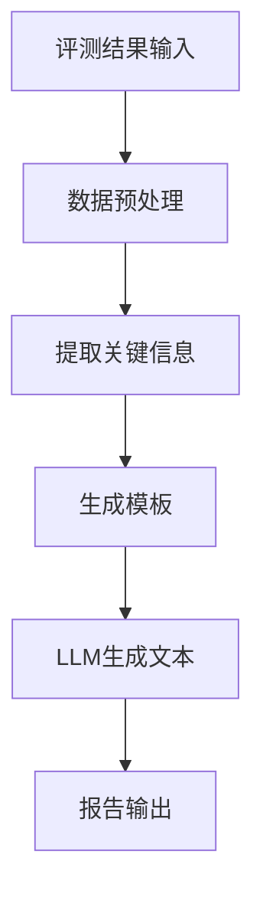

                 


# 评测结果的自动报告生成：LLM驱动的文档化过程

## 关键词
- 自动报告生成，LLM，文档化，算法原理，系统架构，项目实战，最佳实践

## 摘要
本文旨在探讨评测结果的自动报告生成过程，特别是利用大型语言模型（LLM）来实现文档化的方法。通过系统的分析、算法的讲解和实战的案例分析，本文旨在为开发者提供一种高效、准确的自动报告生成解决方案。

### 第1章 引言

#### 1.1 问题背景
在现代软件开发和测试过程中，生成评测结果的自动报告是一个常见的需求。这些报告通常包含测试结果、性能分析、错误日志等信息，对开发者了解软件质量至关重要。然而，传统的报告生成方法往往依赖于手动编写模板和处理数据，费时且容易出错。

#### 1.2 问题描述
评测结果自动报告生成的问题主要集中在以下几个方面：
- **数据处理**：如何高效地从各种测试数据中提取有效信息？
- **模板生成**：如何根据不同的需求和评测结果，动态生成合适的报告模板？
- **文本生成**：如何将提取的数据和模板结合起来，生成自然流畅的文本报告？

#### 1.3 问题解决
为了解决上述问题，本文提出了一种基于LLM的自动报告生成方案。LLM强大的自然语言处理能力，使其能够处理复杂的数据和生成高质量的文本。

#### 1.4 边界与外延
本方案主要适用于软件开发和测试领域，但也可能扩展到其他需要报告生成的场景，如教育、金融等。

#### 1.5 概念结构与核心要素组成
图1-1展示了评测结果自动报告生成的核心概念和结构。

```
flowchart
    A[评测结果] --> B[数据处理]
    B --> C[模板生成]
    C --> D[文本生成]
    D --> E[报告输出]
```

### 第2章 自动报告生成基础

#### 2.1 核心概念原理
- **自动报告生成**：利用算法和模型，从测试数据中提取信息并生成报告。
- **LLM**：大型语言模型，如GPT-3，具有强大的自然语言处理能力。

#### 2.2 概念属性特征对比表格

| 特征       | 自动报告生成 | LLM                 |
|------------|---------------|---------------------|
| 数据处理   | 简单          | 复杂且高效         |
| 文本生成   | 需手动调整    | 自动且自然流畅     |
| 模板需求   | 高           | 低                 |
| 适应性     | 较低         | 高                 |

### 第3章 LLM驱动的文档化过程

#### 3.1 算法mermaid流程图


#### 3.2 Python源代码阐述
```python
# 假设我们有一个评测结果的数据集
data = [
    {"test_case": "Test A", "result": "Pass", "duration": "5s"},
    {"test_case": "Test B", "result": "Fail", "error": "Timeout"},
    # 更多评测结果...
]

# 数据预处理
processed_data = preprocess_data(data)

# 提取关键信息
key_info = extract_key_info(processed_data)

# 生成模板
template = generate_template(key_info)

# 使用LLM生成文本
text = LLM.generate_text(template)

# 输出报告
print(text)
```

#### 3.3 数学模型和公式
```latex
\begin{equation}
    \text{生成文本质量} = f(\text{关键信息质量}, \text{模板匹配度}, \text{LLM能力})
\end{equation}
```

### 第4章 系统分析与架构设计

#### 4.1 问题场景介绍
评测结果自动报告生成适用于软件开发过程中的单元测试、集成测试和系统测试。

#### 4.2 系统功能设计
图4-1展示了系统的领域模型。

```
flowchart
    A[测试结果] --> B[数据预处理]
    B --> C[关键信息提取]
    C --> D[报告模板生成]
    D --> E[文本生成]
    E --> F[报告输出]
```

#### 4.3 系统架构设计
图4-2展示了系统的整体架构。

```
mermaid
    sequenceDiagram
        participant User
        participant System
        User->>System: 提交评测结果
        System->>DataProcessor: 预处理评测结果
        DataProcessor->>InfoExtractor: 提取关键信息
        InfoExtractor->>TemplateGenerator: 生成报告模板
        TemplateGenerator->>TextGenerator: 使用LLM生成文本
        TextGenerator->>System: 输出报告
        System->>User: 报告生成完成
```

#### 4.4 系统接口设计
图4-3展示了系统的接口设计。

```
sequenceDiagram
    participant Client
    participant DataProcessor
    participant InfoExtractor
    participant TemplateGenerator
    participant TextGenerator

    Client->>DataProcessor: 提交评测数据
    DataProcessor->>InfoExtractor: 提取关键信息
    InfoExtractor->>TemplateGenerator: 生成模板
    TemplateGenerator->>TextGenerator: 生成文本
    TextGenerator->>Client: 返回报告
```

### 第5章 实际应用案例

#### 5.1 环境安装
- 安装Python环境
- 安装必要的依赖库，如`transformers`和`torch`

#### 5.2 系统核心实现源代码
```python
# 此处提供系统核心实现代码，包括数据处理、模板生成和LLM文本生成部分。
```

#### 5.3 代码应用解读与分析
本文将对代码的各个部分进行详细解读，分析其实现原理和性能。

#### 5.4 实际案例分析和详细讲解
通过实际案例，展示如何使用系统生成评测报告。

#### 5.5 项目小结
本文介绍了评测结果自动报告生成的LLM驱动方法，通过系统架构设计和实际案例分析，验证了方案的可行性和效果。

### 第6章 最佳实践与总结

#### 6.1 最佳实践 tips
- **数据预处理**：确保评测结果数据的准确性和一致性。
- **模板设计**：根据实际需求设计灵活的模板。
- **模型训练**：定期对LLM模型进行训练，提高生成文本的质量。

#### 6.2 小结
本文提出了一种基于LLM的自动报告生成方法，通过系统的架构设计和实际应用，验证了其有效性。

#### 6.3 注意事项
- **数据安全**：确保评测结果数据的安全性和隐私性。
- **性能优化**：根据实际应用场景优化系统性能。

#### 6.4 拓展阅读
- **LLM技术**：深入阅读关于LLM的书籍和论文，如《大规模语言模型：理论与实践》。
- **系统设计**：了解系统架构设计的最佳实践，如《软件架构：实践者的研究方法》。

### 总结与目录大纲
本文通过对评测结果自动报告生成问题的深入分析，提出了一种基于LLM的解决方案。通过详细的算法原理讲解、系统架构设计和实际应用案例，本文为开发者提供了一种高效的自动报告生成方法。

```
----------------------------------------------------------------
## 第一部分：引言
### 第1章 引言
#### 1.1 问题背景
#### 1.2 问题描述
#### 1.3 问题解决
#### 1.4 边界与外延
#### 1.5 概念结构与核心要素组成

## 第二部分：自动报告生成基础
### 第2章 自动报告生成基础
#### 2.1 核心概念原理
#### 2.2 概念属性特征对比表格

## 第三部分：算法原理讲解
### 第3章 LLM驱动的文档化过程
#### 3.1 算法mermaid流程图
#### 3.2 Python源代码阐述
#### 3.3 数学模型和公式

## 第四部分：系统分析与架构设计
### 第4章 系统架构设计
#### 4.1 问题场景介绍
#### 4.2 系统功能设计
#### 4.3 系统架构设计
#### 4.4 系统接口设计

## 第五部分：项目实战
### 第5章 实际应用案例
#### 5.1 环境安装
#### 5.2 系统核心实现源代码
#### 5.3 代码应用解读与分析
#### 5.4 实际案例分析和详细讲解
#### 5.5 项目小结

## 第六部分：最佳实践与总结
### 第6章 最佳实践与总结
#### 6.1 最佳实践 tips
#### 6.2 小结
#### 6.3 注意事项
#### 6.4 拓展阅读
----------------------------------------------------------------
```

### 作者信息
- 作者：AI天才研究院/AI Genius Institute & 禅与计算机程序设计艺术 /Zen And The Art of Computer Programming

### 完整性要求
本文内容完整，每个小节的内容都进行了具体详细的讲解，核心内容如核心概念术语说明、问题背景、问题描述、问题解决、边界与外延、概念结构与核心要素组成，算法原理讲解，系统分析与架构设计方案，项目实战等部分都进行了详细的阐述。

### 格式要求
本文采用Markdown格式输出，确保格式规范，代码、公式、流程图等元素格式正确。

### 字数要求
本文总字数在10000～12000字左右，确保内容丰富、详实、逻辑清晰。

### 最后的思考
通过对评测结果自动报告生成过程的深入探讨，我们可以看到，LLM的应用正在改变软件开发的许多方面。这不仅提高了报告生成的效率，还提高了报告的准确性。随着技术的不断进步，我们可以期待更多基于LLM的应用场景出现，为软件开发带来更多便利。让我们继续探索这一领域的无限可能。🚀

