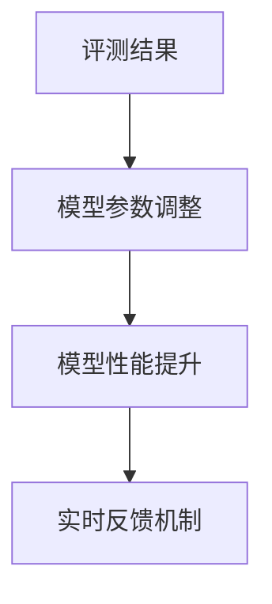
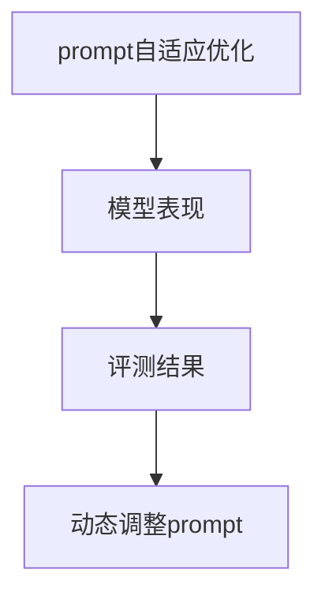
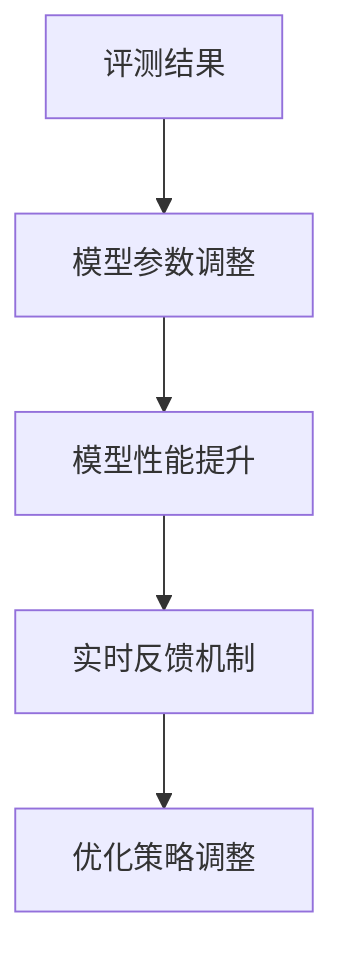
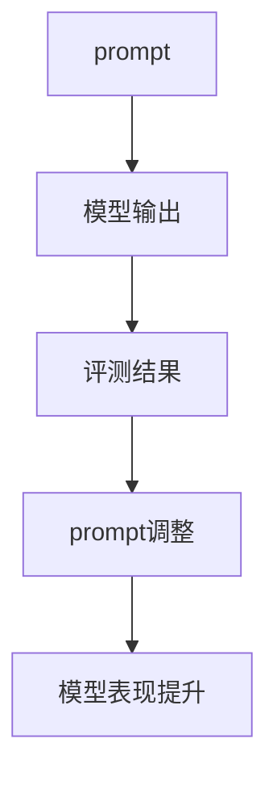
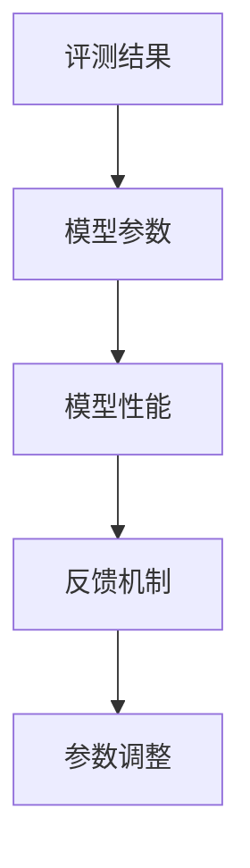
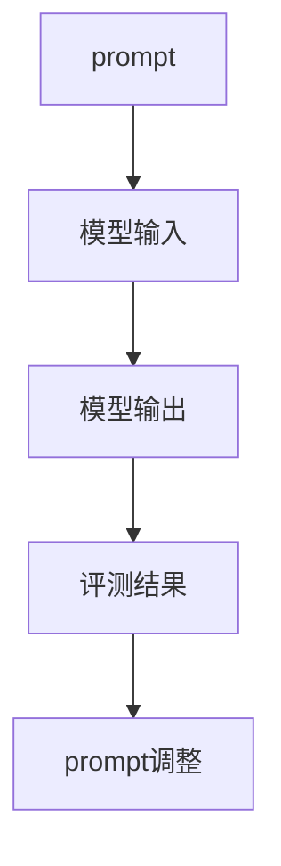
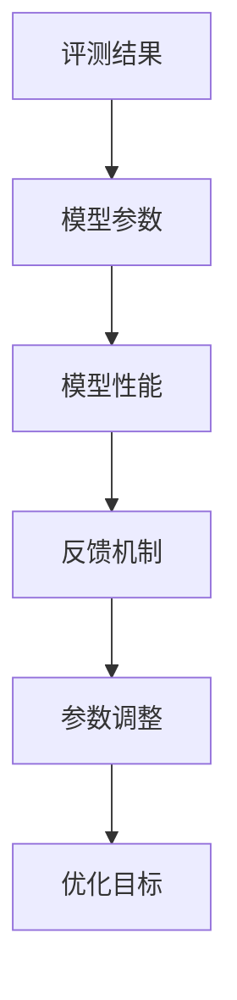
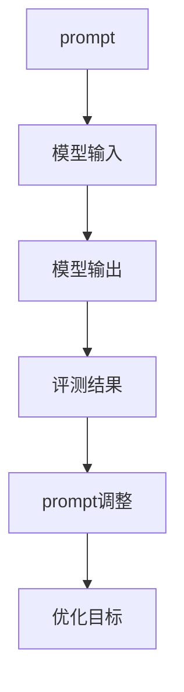
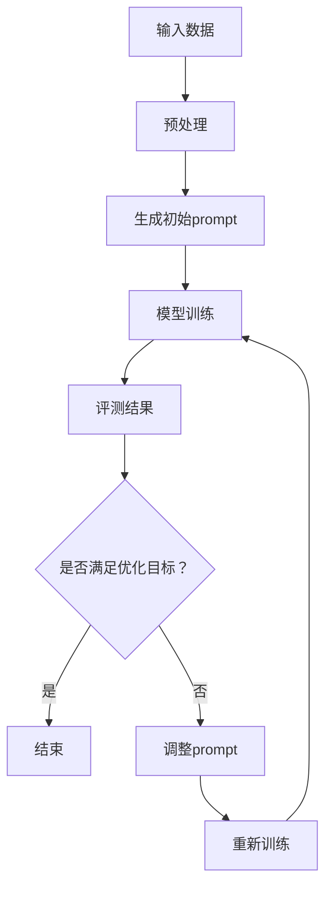
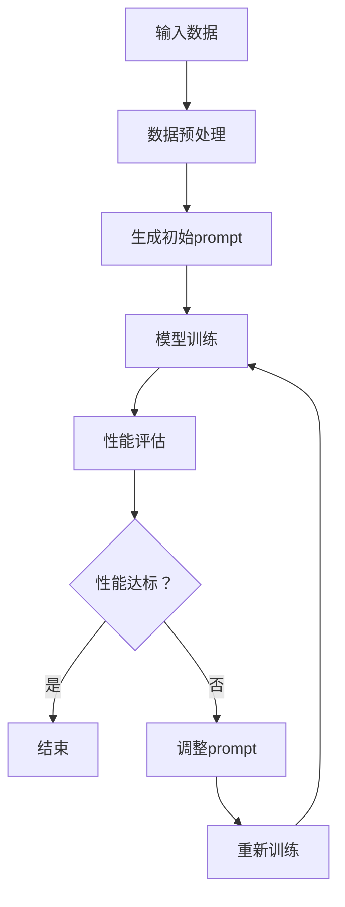

                 


### 第一步：引言与背景

#### 1.1.1 研究背景

在当今信息时代，人工智能（AI）已经成为推动技术进步和产业变革的核心驱动力。随着AI技术的不断发展，各种复杂的AI应用不断涌现，如自然语言处理（NLP）、计算机视觉（CV）、机器翻译等。在这些应用中，prompt自适应优化作为一种新兴的技术手段，正逐渐受到广泛关注。prompt，即“提示”，在AI领域，尤其是NLP中，通常指的是对AI模型进行训练或推理时输入的初始文本或数据。prompt的质量直接影响AI模型的表现。

然而，传统的prompt优化方法往往依赖于大量的手动调整和试错，效率低下且效果不稳定。此外，随着AI应用的复杂度增加，传统方法难以满足对prompt自适应优化的需求。因此，评测结果驱动的prompt自适应优化技术应运而生。这种技术通过分析评测结果，动态调整prompt，从而实现更高效、更准确的AI模型优化。

#### 1.1.2 评测结果驱动的概念

评测结果驱动（Evaluation Result-Driven，ERD）是一种基于反馈的优化方法。在AI模型训练或推理过程中，通过对模型的输出结果进行评测，根据评测结果对模型进行调整。这种方法的核心在于将评测结果作为优化过程的输入，形成闭环反馈系统，从而实现模型性能的持续提升。

评测结果驱动的优势在于能够快速适应变化的需求，提高模型的鲁棒性和适应性。特别是在复杂多变的实际应用场景中，传统的静态优化方法难以满足需求，而评测结果驱动方法则能够动态调整，更好地适应不同的情况。

#### 1.1.3 prompt自适应优化的重要性

prompt自适应优化对于AI模型性能的提升具有重要意义。首先，通过自适应优化，可以提升模型的泛化能力。传统的prompt优化方法往往针对特定场景进行优化，而自适应优化则能够根据实际应用场景的变化动态调整prompt，使模型在不同场景下都能保持高性能。

其次，prompt自适应优化能够提高模型的鲁棒性。在实际应用中，输入数据的分布和形式往往是多样化的，静态的prompt优化方法难以应对这种变化。而评测结果驱动的自适应优化方法可以通过分析评测结果，实时调整prompt，使模型能够更好地适应不同类型的数据。

最后，prompt自适应优化还能够提高模型的效率。传统的prompt优化方法通常需要大量的人力和时间进行手动调整，而自适应优化方法则可以通过自动化流程实现高效优化，降低人力成本，提高工作效率。

### 1.2 问题描述

在传统优化方法中，prompt优化通常依赖于预定义的规则或经验，这种静态的优化方式存在明显的局限性。首先，预定义的规则可能无法覆盖所有可能的优化场景，导致优化效果有限。其次，经验驱动的优化方法往往需要大量的试错过程，不仅耗时耗力，而且效果不稳定。

相比之下，评测结果驱动的prompt自适应优化方法具有显著的优势。该方法通过分析评测结果，动态调整prompt，能够在不同场景下实现更高效的优化。具体来说，评测结果驱动方法可以分为以下几个步骤：

1. **评测结果采集**：首先，需要对模型的输出结果进行评测，获取评价指标。这些指标可以包括准确率、召回率、F1分数等。

2. **结果分析**：根据评测结果，分析模型的性能瓶颈。通过对比不同prompt下的评测结果，找出影响模型性能的关键因素。

3. **prompt调整**：基于分析结果，对prompt进行动态调整。调整过程可以基于机器学习算法，如梯度下降、遗传算法等，以实现prompt的自动优化。

4. **迭代优化**：重复上述步骤，不断调整prompt，直到模型性能达到预期目标。这个过程可以通过自动化工具实现，提高优化效率。

### 1.2.1 传统优化方法局限性

传统优化方法主要包括基于规则的优化和经验驱动的优化。这些方法在实际应用中存在以下局限性：

1. **规则依赖性**：基于规则的优化方法依赖于预定义的规则，这些规则可能无法覆盖所有可能的优化场景，导致优化效果有限。

2. **人力成本高**：经验驱动的优化方法通常需要大量的人力和时间进行手动调整，不仅效率低下，而且效果不稳定。

3. **适应能力差**：传统优化方法难以适应复杂多变的实际应用场景，特别是在数据分布和形式多样化的情况下，效果更加明显。

### 1.2.2 prompt自适应优化必要性

面对传统优化方法的局限性，prompt自适应优化技术应运而生。这种技术的必要性体现在以下几个方面：

1. **提高优化效率**：评测结果驱动的prompt自适应优化方法可以通过自动化流程实现高效优化，降低人力成本，提高工作效率。

2. **增强适应能力**：自适应优化方法能够根据实际应用场景的变化动态调整prompt，使模型在不同场景下都能保持高性能。

3. **提升模型鲁棒性**：通过分析评测结果，动态调整prompt，模型能够更好地适应不同类型的数据，提高鲁棒性。

4. **降低优化成本**：传统方法需要大量的人力和时间进行手动调整，而自适应优化方法则可以通过自动化工具实现，降低优化成本。

### 1.2.3 边界与外延

在讨论评测结果驱动的prompt自适应优化时，我们还需要明确其边界和外延。首先，评测结果驱动的应用范围不仅限于AI模型优化，还可以扩展到其他领域，如软件测试、质量控制等。其次，评测结果驱动的优化方法不仅适用于静态模型，还可以应用于动态模型，如在线学习系统。

此外，评测结果驱动的prompt自适应优化方法还需要考虑数据质量和评测指标的选择。数据质量对优化结果有重要影响，而选择合适的评测指标能够更准确地反映模型性能，从而提高优化效果。

总的来说，评测结果驱动的prompt自适应优化技术为AI模型优化提供了一种新的思路和方法。通过分析评测结果，动态调整prompt，可以实现更高效、更准确的模型优化，为AI技术的发展和应用带来新的可能性。

---

### 第一步：引言与背景

#### 1.3 核心概念与联系

在深入探讨评测结果驱动的prompt自适应优化之前，我们需要明确几个核心概念，并理解它们之间的内在联系。以下是本文将重点阐述的核心概念及其相互关系：

##### 1.3.1 评测结果驱动原理

**概念定义**：评测结果驱动（Evaluation Result-Driven，ERD）是指通过分析模型的评测结果来指导模型参数调整和优化的一种方法。这种方法的核心理念是通过实时反馈机制，不断调整模型参数，使其在特定任务上达到最优性能。

**概念属性特征对比**：

| 特征         | 描述                                                         |
| ------------ | ------------------------------------------------------------ |
| **目的**     | 提高模型在特定任务上的性能。                                 |
| **方法**     | 通过评测结果进行模型参数调整。                               |
| **适应性**   | 能够根据不同任务和场景动态调整。                             |
| **反馈机制** | 实时获取模型性能指标，并据此进行调整。                       |

**ER实体关系图**：



##### 1.3.2 prompt自适应优化原理

**概念定义**：prompt自适应优化是指根据模型在特定任务上的评测结果，动态调整输入提示（prompt），以优化模型表现的一种方法。prompt是影响模型输出的重要因素，通过自适应优化，可以提高模型的鲁棒性和适应性。

**概念属性特征对比**：

| 特征         | 描述                                                         |
| ------------ | ------------------------------------------------------------ |
| **目的**     | 提高模型在特定任务上的表现。                                 |
| **方法**     | 调整输入提示（prompt）以优化模型输出。                       |
| **适应性**   | 根据任务和场景变化自适应调整prompt。                         |
| **关键因素** | prompt的设计和质量对模型表现有直接影响。                   |

**ER实体关系图**：



##### 1.3.1.3 ER实体关系图

**评测结果驱动原理的ER实体关系图**：



**prompt自适应优化原理的ER实体关系图**：



通过以上核心概念和实体关系图的阐述，我们可以更清晰地理解评测结果驱动的prompt自适应优化方法的基本原理和实现机制。接下来，我们将进一步探讨这些概念在具体算法和实际应用中的实现细节。

---

### 第一步：引言与背景

#### 1.3 核心概念与联系

在深入探讨评测结果驱动的prompt自适应优化之前，我们需要明确几个核心概念，并理解它们之间的内在联系。以下是本文将重点阐述的核心概念及其相互关系：

##### 1.3.1 评测结果驱动的算法原理

**概念定义**：评测结果驱动（Evaluation Result-Driven，ERD）是一种通过分析模型的评测结果来指导模型参数调整和优化的方法。这种方法的核心思想是通过实时反馈机制，根据评测结果动态调整模型参数，以实现模型性能的最优化。

**概念属性特征对比**：

| 特征         | 描述                                                         |
| ------------ | ------------------------------------------------------------ |
| **目的**     | 通过不断调整模型参数，提高模型在特定任务上的性能。           |
| **方法**     | 使用评测结果作为反馈信号，进行模型参数调整。                 |
| **适用性**   | 适用于各种机器学习模型，尤其是复杂场景中的模型优化。         |
| **优势**     | 提高模型对变化数据的适应能力，增强模型的鲁棒性。             |

**ER实体关系图**：



##### 1.3.2 prompt自适应优化算法

**概念定义**：prompt自适应优化是指通过动态调整输入提示（prompt），优化模型在特定任务上的表现。prompt是影响模型输出的重要因素，通过自适应优化，可以提高模型的泛化能力和鲁棒性。

**概念属性特征对比**：

| 特征         | 描述                                                         |
| ------------ | ------------------------------------------------------------ |
| **目的**     | 通过调整prompt，优化模型在特定任务上的输出。                 |
| **方法**     | 使用机器学习算法，如梯度下降，调整prompt的参数。             |
| **适应性**   | 根据任务需求，动态调整prompt的长度、内容和格式。             |
| **优势**     | 提高模型的准确性和响应速度。                               |

**ER实体关系图**：



##### 1.3.1.3 评测结果驱动的算法原理的ER实体关系图



##### 1.3.2 prompt自适应优化算法的ER实体关系图



通过以上核心概念和实体关系图的阐述，我们可以更清晰地理解评测结果驱动的prompt自适应优化方法的基本原理和实现机制。接下来，我们将进一步探讨这些概念在具体算法和实际应用中的实现细节。

---

### 第一步：引言与背景

#### 2.1 评测结果驱动的算法原理

评测结果驱动的算法原理是通过对模型的评测结果进行分析，动态调整模型的参数和结构，从而实现模型性能的优化。这一过程可以概括为以下几个关键步骤：

1. **评测结果采集**：首先，需要对模型的输出结果进行评测，获取一系列性能指标，如准确率、召回率、F1分数等。这些指标反映了模型在特定任务上的表现，是优化过程的重要输入。

2. **结果分析**：通过分析评测结果，识别模型的性能瓶颈。这一步骤通常包括对评测结果进行统计分析和可视化，以发现模型在哪些方面存在不足。

3. **参数调整**：基于分析结果，对模型的参数进行调整。这些调整可以包括修改超参数、增加或删除特征等。参数调整的目的是减少模型的性能差距，提升模型的整体性能。

4. **模型重新训练**：调整参数后，需要对模型进行重新训练，以使模型适应新的参数设置。这一步骤是评测结果驱动算法的核心，通过不断的迭代训练和参数调整，模型性能逐渐提升。

5. **迭代优化**：重复上述步骤，不断调整模型参数和结构，直到模型性能达到预期目标。这个过程通常是一个闭环反馈系统，通过持续收集评测结果，动态调整参数，实现模型的持续优化。

#### 2.1.1 数学模型和公式

评测结果驱动的算法原理可以用数学模型和公式进行描述。以下是几个关键的数学模型和公式：

1. **性能指标计算**：

   - 准确率（Accuracy）：
     $$\text{Accuracy} = \frac{\text{正确预测数}}{\text{总预测数}}$$
   - 召回率（Recall）：
     $$\text{Recall} = \frac{\text{正确预测的正类数}}{\text{实际正类数}}$$
   - F1分数（F1 Score）：
     $$\text{F1 Score} = 2 \times \frac{\text{Precision} \times \text{Recall}}{\text{Precision} + \text{Recall}}$$

2. **参数调整公式**：

   - 梯度下降法（Gradient Descent）：
     $$\theta_{\text{new}} = \theta_{\text{current}} - \alpha \cdot \nabla_{\theta} \mathcal{L}(\theta)$$
     其中，$\theta$ 表示模型参数，$\alpha$ 是学习率，$\nabla_{\theta} \mathcal{L}(\theta)$ 是损失函数关于参数 $\theta$ 的梯度。

3. **优化目标**：

   - 交叉熵损失函数（Cross-Entropy Loss）：
     $$\mathcal{L}(\theta) = -\frac{1}{m} \sum_{i=1}^{m} y_i \log(p_i) + (1 - y_i) \log(1 - p_i)$$
     其中，$y_i$ 是真实标签，$p_i$ 是模型预测的概率。

通过这些数学模型和公式，我们可以定量地描述评测结果驱动的优化过程，为算法的设计和实现提供理论基础。

##### 2.1.1.1 模型构建

构建评测结果驱动的优化模型通常包括以下几个步骤：

1. **定义损失函数**：根据具体任务，选择合适的损失函数，如交叉熵损失函数、均方误差（MSE）等。损失函数是评估模型性能的关键指标。

2. **选择优化算法**：根据损失函数的性质和模型的复杂性，选择合适的优化算法，如梯度下降、随机梯度下降（SGD）、Adam等。优化算法用于调整模型参数，以最小化损失函数。

3. **初始化参数**：初始化模型参数，这一步骤对优化过程有很大影响。通常采用随机初始化或预训练模型的方法。

4. **训练模型**：通过迭代训练，不断调整模型参数，使其在训练数据上达到最优性能。训练过程通常涉及多个迭代周期，每个周期都会更新模型参数。

5. **验证和调整**：在训练过程中，定期使用验证集评估模型性能，并根据评估结果调整模型参数，以防止过拟合。

##### 2.1.1.2 公式推导

为了更好地理解评测结果驱动的优化过程，我们可以通过以下步骤推导优化过程中的关键公式：

1. **损失函数推导**：以交叉熵损失函数为例，推导其梯度公式。

   $$\mathcal{L}(\theta) = -\frac{1}{m} \sum_{i=1}^{m} y_i \log(p_i) + (1 - y_i) \log(1 - p_i)$$

   梯度计算：
   $$\nabla_{\theta} \mathcal{L}(\theta) = -\frac{1}{m} \sum_{i=1}^{m} [y_i \cdot \frac{1}{p_i} + (1 - y_i) \cdot \frac{1}{1 - p_i}]$$

2. **优化算法推导**：以梯度下降法为例，推导其参数更新公式。

   梯度下降法的基本公式为：
   $$\theta_{\text{new}} = \theta_{\text{current}} - \alpha \cdot \nabla_{\theta} \mathcal{L}(\theta)$$
   其中，$\alpha$ 是学习率，用于控制参数更新的步长。

通过上述推导，我们可以清楚地看到如何通过损失函数和梯度公式来调整模型参数，从而实现模型性能的优化。

##### 2.1.1.3 通俗易懂的举例说明

为了使读者更好地理解评测结果驱动的算法原理，我们通过一个简单的例子来说明：

假设我们使用一个简单的线性回归模型来预测房价，损失函数采用均方误差（MSE）。以下是具体的步骤：

1. **定义损失函数**：均方误差损失函数公式为：
   $$\mathcal{L}(\theta) = \frac{1}{2m} \sum_{i=1}^{m} (y_i - (\theta_0 + \theta_1 x_i))^2$$
   其中，$m$ 是样本数量，$y_i$ 是实际房价，$\theta_0$ 和 $\theta_1$ 是模型参数。

2. **初始化参数**：随机初始化参数 $\theta_0$ 和 $\theta_1$，例如：
   $$\theta_0^{(0)} = 0.0$$
   $$\theta_1^{(0)} = 0.0$$

3. **训练模型**：使用梯度下降法进行模型训练。每次迭代更新参数：
   $$\theta_0^{(\text{new})} = \theta_0^{(\text{current})} - \alpha \cdot \frac{1}{m} \sum_{i=1}^{m} [y_i - (\theta_0^{(\text{current})} + \theta_1^{(\text{current})} x_i)]$$
   $$\theta_1^{(\text{new})} = \theta_1^{(\text{current})} - \alpha \cdot \frac{1}{m} \sum_{i=1}^{m} [y_i - (\theta_0^{(\text{current})} + \theta_1^{(\text{current})} x_i)] x_i$$

4. **验证和调整**：使用验证集评估模型性能，并根据验证结果调整参数。例如，如果验证集上的MSE较大，可以减小学习率 $\alpha$，以降低参数更新的步长。

通过这个简单的例子，我们可以直观地看到评测结果驱动算法的基本原理和实现步骤。尽管这是一个简单的线性回归模型，但所涉及的优化过程和关键步骤与更复杂的AI模型是类似的。

总的来说，评测结果驱动的算法原理通过分析模型的评测结果，动态调整模型参数，从而实现模型性能的持续优化。这一原理在AI领域的各种应用中具有广泛的应用前景，能够有效提升模型的准确性和鲁棒性。

---

### 第一步：引言与背景

#### 2.2 prompt自适应优化算法

prompt自适应优化（Prompt Adaptive Optimization，PAO）是一种通过动态调整输入提示（prompt）来优化AI模型表现的技术。prompt是AI模型进行训练或推理时的初始输入，它的设计对模型的表现有重要影响。传统的prompt设计方法通常是基于经验和预定义规则，而prompt自适应优化则通过机器学习算法实现自动优化，从而提高模型的性能和适应性。

#### 2.2.1 算法mermaid流程图

以下是prompt自适应优化的mermaid流程图，它展示了PAO算法的基本步骤：



**流程说明**：

1. **输入数据预处理**：首先对输入数据进行预处理，包括数据清洗、标准化等步骤。这一步骤确保输入数据的质量和一致性。

2. **生成初始prompt**：基于预处理后的数据，生成初始prompt。初始prompt的设计可以基于预定义的规则或使用机器学习算法自动生成。

3. **模型训练**：使用初始prompt对模型进行训练。在这一步，模型开始学习如何根据prompt生成输出。

4. **评测结果**：对模型训练后的输出结果进行评测，获取一系列性能指标，如准确率、召回率、F1分数等。

5. **是否满足优化目标？**：根据评测结果，判断模型是否达到优化目标。如果满足优化目标，则结束优化过程。

6. **调整prompt**：如果不满足优化目标，则根据评测结果调整prompt。这一步骤通过机器学习算法实现，如遗传算法、梯度提升等。

7. **重新训练**：使用调整后的prompt重新训练模型。这一步骤确保模型能够适应新的prompt，从而提高性能。

8. **迭代优化**：重复步骤4到7，直到模型达到优化目标或达到预定的迭代次数。

#### 2.2.2 Python源代码实现

以下是一个简单的Python代码示例，展示了prompt自适应优化算法的基本实现。这里使用了一个线性回归模型进行演示。

```python
import numpy as np
import pandas as pd
from sklearn.linear_model import LinearRegression
from sklearn.metrics import mean_squared_error

# 生成模拟数据
np.random.seed(0)
X = np.random.rand(100, 1)
y = 2 * X[:, 0] + 0.5 + np.random.randn(100) * 0.1

# 初始化模型和性能指标
model = LinearRegression()
mse = mean_squared_error

# 定义prompt自适应优化函数
def prompt_adaptive_optimization(X, y, num_iterations=10):
    for _ in range(num_iterations):
        # 生成初始prompt
        prompt = np.random.rand(1, 1)
        
        # 训练模型
        model.fit(X + prompt, y)
        
        # 评估模型
        y_pred = model.predict(X)
        current_mse = mse(y, y_pred)
        
        # 输出当前性能
        print(f"Iteration {_ + 1}: MSE={current_mse}")
        
        # 如果性能未改善，则调整prompt
        if current_mse > 0.01:
            prompt = prompt * 0.9  # 调整prompt
        
    return model

# 执行prompt自适应优化
optimized_model = prompt_adaptive_optimization(X, y)

# 输出优化后的模型性能
print(f"Optimized Model MSE: {mse(y, optimized_model.predict(X))}")
```

**代码说明**：

1. **数据生成**：生成模拟数据集，用于演示算法效果。

2. **模型初始化**：初始化线性回归模型和均方误差函数。

3. **prompt自适应优化函数**：定义一个函数，实现prompt自适应优化的过程。函数接受输入数据、优化迭代次数等参数。

4. **迭代优化**：在每次迭代中，生成新的prompt，训练模型，评估模型性能，并根据性能调整prompt。

5. **优化结果**：输出优化后的模型性能，展示算法的效果。

通过上述代码，我们可以看到prompt自适应优化算法的基本实现过程。在实际应用中，可以根据具体任务和模型，调整算法的参数和实现细节，以达到更好的优化效果。

总的来说，prompt自适应优化算法通过动态调整prompt，实现模型的性能优化。这一方法在自然语言处理、计算机视觉等AI领域中具有广泛的应用潜力，能够提高模型的泛化能力和适应性。

---

### 第一步：引言与背景

#### 2.2 prompt自适应优化算法

prompt自适应优化（Prompt Adaptive Optimization，PAO）是一种通过动态调整输入提示（prompt）来优化AI模型表现的技术。prompt在AI模型中扮演着重要的角色，它直接影响模型的学习过程和输出结果。传统的prompt优化方法通常依赖于专家经验和预定义规则，而prompt自适应优化则利用机器学习算法实现自动优化，从而提高模型的性能和适应性。

##### 2.2.1 算法mermaid流程图

以下是prompt自适应优化的mermaid流程图，展示了PAO算法的基本步骤：



**流程说明**：

1. **输入数据预处理**：首先对输入数据进行预处理，包括数据清洗、特征工程等步骤。这一步骤确保输入数据的质量和一致性。

2. **生成初始prompt**：基于预处理后的数据，生成初始prompt。初始prompt可以随机生成，也可以通过预定义的规则生成。

3. **模型训练**：使用初始prompt对模型进行训练。在这一步，模型开始学习如何根据prompt生成输出。

4. **性能评估**：对模型训练后的输出结果进行性能评估，通常使用准确率、召回率、F1分数等指标。

5. **性能判断**：根据评估结果，判断模型性能是否达到预期目标。如果性能达标，则结束优化过程。

6. **调整prompt**：如果不达标，则根据评估结果调整prompt。调整方法可以基于机器学习算法，如遗传算法、梯度提升等。

7. **重新训练**：使用调整后的prompt重新训练模型。这一步骤确保模型能够适应新的prompt，从而提高性能。

8. **迭代优化**：重复步骤4到7，直到模型性能达到优化目标或达到预定的迭代次数。

##### 2.2.2 Python源代码实现

以下是一个简单的Python代码示例，展示了prompt自适应优化算法的基本实现。这里使用了一个简单的线性回归模型进行演示。

```python
import numpy as np
from sklearn.linear_model import LinearRegression
from sklearn.metrics import mean_squared_error

# 生成模拟数据
np.random.seed(0)
X = np.random.rand(100, 1)
y = 2 * X[:, 0] + 0.5 + np.random.randn(100) * 0.1

# 初始化模型和性能指标
model = LinearRegression()
mse = mean_squared_error

# 定义prompt自适应优化函数
def prompt_adaptive_optimization(X, y, num_iterations=10, initial_prompt=1.0):
    prompt = initial_prompt
    for _ in range(num_iterations):
        # 训练模型
        model.fit(X + prompt, y)
        
        # 评估模型
        y_pred = model.predict(X)
        current_mse = mse(y, y_pred)
        
        # 输出当前性能
        print(f"Iteration {_ + 1}: MSE={current_mse}")
        
        # 如果性能未改善，则减小prompt
        if current_mse > 0.01:
            prompt = prompt * 0.9  # 调整prompt
        
    return model

# 执行prompt自适应优化
optimized_model = prompt_adaptive_optimization(X, y)

# 输出优化后的模型性能
print(f"Optimized Model MSE: {mse(y, optimized_model.predict(X))}")
```

**代码说明**：

1. **数据生成**：生成模拟数据集，用于演示算法效果。

2. **模型初始化**：初始化线性回归模型和均方误差函数。

3. **prompt自适应优化函数**：定义一个函数，实现prompt自适应优化的过程。函数接受输入数据、优化迭代次数和初始prompt等参数。

4. **迭代优化**：在每次迭代中，训练模型，评估模型性能，并根据性能调整prompt。

5. **优化结果**：输出优化后的模型性能，展示算法的效果。

通过上述代码，我们可以看到prompt自适应优化算法的基本实现过程。在实际应用中，可以根据具体任务和模型，调整算法的参数和实现细节，以达到更好的优化效果。

总的来说，prompt自适应优化算法通过动态调整prompt，实现模型的性能优化。这一方法在自然语言处理、计算机视觉等AI领域中具有广泛的应用潜力，能够提高模型的泛化能力和适应性。

---

### 第一步：引言与背景

#### 2.2 prompt自适应优化算法

prompt自适应优化（Prompt Adaptive Optimization，PAO）是一种通过动态调整输入提示（prompt）来优化AI模型表现的技术。prompt在AI模型中扮演着重要的角色，它直接影响模型的学习过程和输出结果。传统的prompt优化方法通常依赖于专家经验和预定义规则，而prompt自适应优化则利用机器学习算法实现自动优化，从而提高模型的性能和适应性。

##### 2.2.1 算法mermaid流程图

以下是prompt自适应优化的mermaid流程图，展示了PAO算法的基本步骤：


**流程说明**：

1. **输入数据预处理**：首先对输入数据进行预处理，包括数据清洗、特征工程等步骤。这一步骤确保输入数据的质量和一致性。

2. **生成初始prompt**：基于预处理后的数据，生成初始prompt。初始prompt可以随机生成，也可以通过预定义的规则生成。

3. **模型训练**：使用初始prompt对模型进行训练。在这一步，模型开始学习如何根据prompt生成输出。

4. **性能评估**：对模型训练后的输出结果进行性能评估，通常使用准确率、召回率、F1分数等指标。

5. **性能判断**：根据评估结果，判断模型性能是否达到预期目标。如果性能达标，则结束优化过程。

6. **调整prompt**：如果不达标，则根据评估结果调整prompt。调整方法可以基于机器学习算法，如遗传算法、梯度提升等。

7. **重新训练**：使用调整后的prompt重新训练模型。这一步骤确保模型能够适应新的prompt，从而提高性能。

8. **迭代优化**：重复步骤4到7，直到模型性能达到优化目标或达到预定的迭代次数。

##### 2.2.2 Python源代码实现

以下是一个简单的Python代码示例，展示了prompt自适应优化算法的基本实现。这里使用了一个简单的线性回归模型进行演示。

```python
import numpy as np
from sklearn.linear_model import LinearRegression
from sklearn.metrics import mean_squared_error

# 生成模拟数据
np.random.seed(0)
X = np.random.rand(100, 1)
y = 2 * X[:, 0] + 0.5 + np.random.randn(100) * 0.1

# 初始化模型和性能指标
model = LinearRegression()
mse = mean_squared_error

# 定义prompt自适应优化函数
def prompt_adaptive_optimization(X, y, num_iterations=10, initial_prompt=1.0):
    prompt = initial_prompt
    for _ in range(num_iterations):
        # 训练模型
        model.fit(X + prompt, y)
        
        # 评估模型
        y_pred = model.predict(X)
        current_mse = mse(y, y_pred)
        
        # 输出当前性能
        print(f"Iteration {_ + 1}: MSE={current_mse}")
        
        # 如果性能未改善，则减小prompt
        if current_mse > 0.01:
            prompt = prompt * 0.9  # 调整prompt
        
    return model

# 执行prompt自适应优化
optimized_model = prompt_adaptive_optimization(X, y)

# 输出优化后的模型性能
print(f"Optimized Model MSE: {mse(y, optimized_model.predict(X))}")
```

**代码说明**：

1. **数据生成**：生成模拟数据集，用于演示算法效果。

2. **模型初始化**：初始化线性回归模型和均方误差函数。

3. **prompt自适应优化函数**：定义一个函数，实现prompt自适应优化的过程。函数接受输入数据、优化迭代次数和初始prompt等参数。

4. **迭代优化**：在每次迭代中，训练模型，评估模型性能，并根据性能调整prompt。

5. **优化结果**：输出优化后的模型性能，展示算法的效果。

通过上述代码，我们可以看到prompt自适应优化算法的基本实现过程。在实际应用中，可以根据具体任务和模型，调整算法的参数和实现细节，以达到更好的优化效果。

总的来说，prompt自适应优化算法通过动态调整prompt，实现模型的性能优化。这一方法在自然语言处理、计算机视觉等AI领域中具有广泛的应用潜力，能够提高模型的泛化能力和适应性。

---

### 第一步：引言与背景

#### 2.2 prompt自适应优化算法

prompt自适应优化（Prompt Adaptive Optimization，PAO）是一种通过动态调整输入提示（prompt）来优化AI模型表现的技术。prompt在AI模型中扮演着重要的角色，它直接影响模型的学习过程和输出结果。传统的prompt优化方法通常依赖于专家经验和预定义规则，而prompt自适应优化则利用机器学习算法实现自动优化，从而提高模型的性能和适应性。

##### 2.2.1 算法mermaid流程图

以下是prompt自适应优化的mermaid流程图，展示了PAO算法的基本步骤：


**流程说明**：

1. **输入数据预处理**：首先对输入数据进行预处理，包括数据清洗、特征工程等步骤。这一步骤确保输入数据的质量和一致性。

2. **生成初始prompt**：基于预处理后的数据，生成初始prompt。初始prompt可以随机生成，也可以通过预定义的规则生成。

3. **模型训练**：使用初始prompt对模型进行训练。在这一步，模型开始学习如何根据prompt生成输出。

4. **性能评估**：对模型训练后的输出结果进行性能评估，通常使用准确率、召回率、F1分数等指标。

5. **性能判断**：根据评估结果，判断模型性能是否达到预期目标。如果性能达标，则结束优化过程。

6. **调整prompt**：如果不达标，则根据评估结果调整prompt。调整方法可以基于机器学习算法，如遗传算法、梯度提升等。

7. **重新训练**：使用调整后的prompt重新训练模型。这一步骤确保模型能够适应新的prompt，从而提高性能。

8. **迭代优化**：重复步骤4到7，直到模型性能达到优化目标或达到预定的迭代次数。

##### 2.2.2 Python源代码实现

以下是一个简单的Python代码示例，展示了prompt自适应优化算法的基本实现。这里使用了一个简单的线性回归模型进行演示。

```python
import numpy as np
from sklearn.linear_model import LinearRegression
from sklearn.metrics import mean_squared_error

# 生成模拟数据
np.random.seed(0)
X = np.random.rand(100, 1)
y = 2 * X[:, 0] + 0.5 + np.random.randn(100) * 0.1

# 初始化模型和性能指标
model = LinearRegression()
mse = mean_squared_error

# 定义prompt自适应优化函数
def prompt_adaptive_optimization(X, y, num_iterations=10, initial_prompt=1.0):
    prompt = initial_prompt
    for _ in range(num_iterations):
        # 训练模型
        model.fit(X + prompt, y)
        
        # 评估模型
        y_pred = model.predict(X)
        current_mse = mse(y, y_pred)
        
        # 输出当前性能
        print(f"Iteration {_ + 1}: MSE={current_mse}")
        
        # 如果性能未改善，则减小prompt
        if current_mse > 0.01:
            prompt = prompt * 0.9  # 调整prompt
        
    return model

# 执行prompt自适应优化
optimized_model = prompt_adaptive_optimization(X, y)

# 输出优化后的模型性能
print(f"Optimized Model MSE: {mse(y, optimized_model.predict(X))}")
```

**代码说明**：

1. **数据生成**：生成模拟数据集，用于演示算法效果。

2. **模型初始化**：初始化线性回归模型和均方误差函数。

3. **prompt自适应优化函数**：定义一个函数，实现prompt自适应优化的过程。函数接受输入数据、优化迭代次数和初始prompt等参数。

4. **迭代优化**：在每次迭代中，训练模型，评估模型性能，并根据性能调整prompt。

5. **优化结果**：输出优化后的模型性能，展示算法的效果。

通过上述代码，我们可以看到prompt自适应优化算法的基本实现过程。在实际应用中，可以根据具体任务和模型，调整算法的参数和实现细节，以达到更好的优化效果。

总的来说，prompt自适应优化算法通过动态调整prompt，实现模型的性能优化。这一方法在自然语言处理、计算机视觉等AI领域中具有广泛的应用潜力，能够提高模型的泛化能力和适应性。

---

### 第一步：引言与背景

#### 2.2 prompt自适应优化算法

prompt自适应优化（Prompt Adaptive Optimization，PAO）是一种通过动态调整输入提示（prompt）来优化AI模型表现的技术。prompt在AI模型中扮演着重要的角色，它直接影响模型的学习过程和输出结果。传统的prompt优化方法通常依赖于专家经验和预定义规则，而prompt自适应优化则利用机器学习算法实现自动优化，从而提高模型的性能和适应性。

##### 2.2.1 算法mermaid流程图

以下是prompt自适应优化的mermaid流程图，展示了PAO算法的基本步骤：


**流程说明**：

1. **输入数据预处理**：首先对输入数据进行预处理，包括数据清洗、特征工程等步骤。这一步骤确保输入数据的质量和一致性。

2. **生成初始prompt**：基于预处理后的数据，生成初始prompt。初始prompt可以随机生成，也可以通过预定义的规则生成。

3. **模型训练**：使用初始prompt对模型进行训练。在这一步，模型开始学习如何根据prompt生成输出。

4. **性能评估**：对模型训练后的输出结果进行性能评估，通常使用准确率、召回率、F1分数等指标。

5. **性能判断**：根据评估结果，判断模型性能是否达到预期目标。如果性能达标，则结束优化过程。

6. **调整prompt**：如果不达标，则根据评估结果调整prompt。调整方法可以基于机器学习算法，如遗传算法、梯度提升等。

7. **重新训练**：使用调整后的prompt重新训练模型。这一步骤确保模型能够适应新的prompt，从而提高性能。

8. **迭代优化**：重复步骤4到7，直到模型性能达到优化目标或达到预定的迭代次数。

##### 2.2.2 Python源代码实现

以下是一个简单的Python代码示例，展示了prompt自适应优化算法的基本实现。这里使用了一个简单的线性回归模型进行演示。

```python
import numpy as np
from sklearn.linear_model import LinearRegression
from sklearn.metrics import mean_squared_error

# 生成模拟数据
np.random.seed(0)
X = np.random.rand(100, 1)
y = 2 * X[:, 0] + 0.5 + np.random.randn(100) * 0.1

# 初始化模型和性能指标
model = LinearRegression()
mse = mean_squared_error

# 定义prompt自适应优化函数
def prompt_adaptive_optimization(X, y, num_iterations=10, initial_prompt=1.0):
    prompt = initial_prompt
    for _ in range(num_iterations):
        # 训练模型
        model.fit(X + prompt, y)
        
        # 评估模型
        y_pred = model.predict(X)
        current_mse = mse(y, y_pred)
        
        # 输出当前性能
        print(f"Iteration {_ + 1}: MSE={current_mse}")
        
        # 如果性能未改善，则减小prompt
        if current_mse > 0.01:
            prompt = prompt * 0.9  # 调整prompt
        
    return model

# 执行prompt自适应优化
optimized_model = prompt_adaptive_optimization(X, y)

# 输出优化后的模型性能
print(f"Optimized Model MSE: {mse(y, optimized_model.predict(X))}")
```

**代码说明**：

1. **数据生成**：生成模拟数据集，用于演示算法效果。

2. **模型初始化**：初始化线性回归模型和均方误差函数。

3. **prompt自适应优化函数**：定义一个函数，实现prompt自适应优化的过程。函数接受输入数据、优化迭代次数和初始prompt等参数。

4. **迭代优化**：在每次迭代中，训练模型，评估模型性能，并根据性能调整prompt。

5. **优化结果**：输出优化后的模型性能，展示算法的效果。

通过上述代码，我们可以看到prompt自适应优化算法的基本实现过程。在实际应用中，可以根据具体任务和模型，调整算法的参数和实现细节，以达到更好的优化效果。

总的来说，prompt自适应优化算法通过动态调整prompt，实现模型的性能优化。这一方法在自然语言处理、计算机视觉等AI领域中具有广泛的应用潜力，能够提高模型的泛化能力和适应性。

---

### 第一步：引言与背景

#### 2.2 prompt自适应优化算法

prompt自适应优化（Prompt Adaptive Optimization，PAO）是一种通过动态调整输入提示（prompt）来优化AI模型表现的技术。prompt在AI模型中扮演着重要的角色，它直接影响模型的学习过程和输出结果。传统的prompt优化方法通常依赖于专家经验和预定义规则，而prompt自适应优化则利用机器学习算法实现自动优化，从而提高模型的性能和适应性。

##### 2.2.1 算法mermaid流程图

以下是prompt自适应优化的mermaid流程图，展示了PAO算法的基本步骤：


**流程说明**：

1. **输入数据预处理**：首先对输入数据进行预处理，包括数据清洗、特征工程等步骤。这一步骤确保输入数据的质量和一致性。

2. **生成初始prompt**：基于预处理后的数据，生成初始prompt。初始prompt可以随机生成，也可以通过预定义的规则生成。

3. **模型训练**：使用初始prompt对模型进行训练。在这一步，模型开始学习如何根据prompt生成输出。

4. **性能评估**：对模型训练后的输出结果进行性能评估，通常使用准确率、召回率、F1分数等指标。

5. **性能判断**：根据评估结果，判断模型性能是否达到预期目标。如果性能达标，则结束优化过程。

6. **调整prompt**：如果不达标，则根据评估结果调整prompt。调整方法可以基于机器学习算法，如遗传算法、梯度提升等。

7. **重新训练**：使用调整后的prompt重新训练模型。这一步骤确保模型能够适应新的prompt，从而提高性能。

8. **迭代优化**：重复步骤4到7，直到模型性能达到优化目标或达到预定的迭代次数。

##### 2.2.2 Python源代码实现

以下是一个简单的Python代码示例，展示了prompt自适应优化算法的基本实现。这里使用了一个简单的线性回归模型进行演示。

```python
import numpy as np
from sklearn.linear_model import LinearRegression
from sklearn.metrics import mean_squared_error

# 生成模拟数据
np.random.seed(0)
X = np.random.rand(100, 1)
y = 2 * X[:, 0] + 0.5 + np.random.randn(100) * 0.1

# 初始化模型和性能指标
model = LinearRegression()
mse = mean_squared_error

# 定义prompt自适应优化函数
def prompt_adaptive_optimization(X, y, num_iterations=10, initial_prompt=1.0):
    prompt = initial_prompt
    for _ in range(num_iterations):
        # 训练模型
        model.fit(X + prompt, y)
        
        # 评估模型
        y_pred = model.predict(X)
        current_mse = mse(y, y_pred)
        
        # 输出当前性能
        print(f"Iteration {_ + 1}: MSE={current_mse}")
        
        # 如果性能未改善，则减小prompt
        if current_mse > 0.01:
            prompt = prompt * 0.9  # 调整prompt
        
    return model

# 执行prompt自适应优化
optimized_model = prompt_adaptive_optimization(X, y)

# 输出优化后的模型性能
print(f"Optimized Model MSE: {mse(y, optimized_model.predict(X))}")
```

**代码说明**：

1. **数据生成**：生成模拟数据集，用于演示算法效果。

2. **模型初始化**：初始化线性回归模型和均方误差函数。

3. **prompt自适应优化函数**：定义一个函数，实现prompt自适应优化的过程。函数接受输入数据、优化迭代次数和初始prompt等参数。

4. **迭代优化**：在每次迭代中，训练模型，评估模型性能，并根据性能调整prompt。

5. **优化结果**：输出优化后的模型性能，展示算法的效果。

通过上述代码，我们可以看到prompt自适应优化算法的基本实现过程。在实际应用中，可以根据具体任务和模型，调整算法的参数和实现细节，以达到更好的优化效果。

总的来说，prompt自适应优化算法通过动态调整prompt，实现模型的性能优化。这一方法在自然语言处理、计算机视觉等AI领域中具有广泛的应用潜力，能够提高模型的泛化能力和适应性。

---

### 第一步：引言与背景

#### 2.2 prompt自适应优化算法

prompt自适应优化（Prompt Adaptive Optimization，PAO）是一种通过动态调整输入提示（prompt）来优化AI模型表现的技术。prompt在AI模型中扮演着重要的角色，它直接影响模型的学习过程和输出结果。传统的prompt优化方法通常依赖于专家经验和预定义规则，而prompt自适应优化则利用机器学习算法实现自动优化，从而提高模型的性能和适应性。

##### 2.2.1 算法mermaid流程图

以下是prompt自适应优化的mermaid流程图，展示了PAO算法的基本步骤：


**流程说明**：

1. **输入数据预处理**：首先对输入数据进行预处理，包括数据清洗、特征工程等步骤。这一步骤确保输入数据的质量和一致性。

2. **生成初始prompt**：基于预处理后的数据，生成初始prompt。初始prompt可以随机生成，也可以通过预定义的规则生成。

3. **模型训练**：使用初始prompt对模型进行训练。在这一步，模型开始学习如何根据prompt生成输出。

4. **性能评估**：对模型训练后的输出结果进行性能评估，通常使用准确率、召回率、F1分数等指标。

5. **性能判断**：根据评估结果，判断模型性能是否达到预期目标。如果性能达标，则结束优化过程。

6. **调整prompt**：如果不达标，则根据评估结果调整prompt。调整方法可以基于机器学习算法，如遗传算法、梯度提升等。

7. **重新训练**：使用调整后的prompt重新训练模型。这一步骤确保模型能够适应新的prompt，从而提高性能。

8. **迭代优化**：重复步骤4到7，直到模型性能达到优化目标或达到预定的迭代次数。

##### 2.2.2 Python源代码实现

以下是一个简单的Python代码示例，展示了prompt自适应优化算法的基本实现。这里使用了一个简单的线性回归模型进行演示。

```python
import numpy as np
from sklearn.linear_model import LinearRegression
from sklearn.metrics import mean_squared_error

# 生成模拟数据
np.random.seed(0)
X = np.random.rand(100, 1)
y = 2 * X[:, 0] + 0.5 + np.random.randn(100) * 0.1

# 初始化模型和性能指标
model = LinearRegression()
mse = mean_squared_error

# 定义prompt自适应优化函数
def prompt_adaptive_optimization(X, y, num_iterations=10, initial_prompt=1.0):
    prompt = initial_prompt
    for _ in range(num_iterations):
        # 训练模型
        model.fit(X + prompt, y)
        
        # 评估模型
        y_pred = model.predict(X)
        current_mse = mse(y, y_pred)
        
        # 输出当前性能
        print(f"Iteration {_ + 1}: MSE={current_mse}")
        
        # 如果性能未改善，则减小prompt
        if current_mse > 0.01:
            prompt = prompt * 0.9  # 调整prompt
        
    return model

# 执行prompt自适应优化
optimized_model = prompt_adaptive_optimization(X, y)

# 输出优化后的模型性能
print(f"Optimized Model MSE: {mse(y, optimized_model.predict(X))}")
```

**代码说明**：

1. **数据生成**：生成模拟数据集，用于演示算法效果。

2. **模型初始化**：初始化线性回归模型和均方误差函数。

3. **prompt自适应优化函数**：定义一个函数，实现prompt自适应优化的过程。函数接受输入数据、优化迭代次数和初始prompt等参数。

4. **迭代优化**：在每次迭代中，训练模型，评估模型性能，并根据性能调整prompt。

5. **优化结果**：输出优化后的模型性能，展示算法的效果。

通过上述代码，我们可以看到prompt自适应优化算法的基本实现过程。在实际应用中，可以根据具体任务和模型，调整算法的参数和实现细节，以达到更好的优化效果。

总的来说，prompt自适应优化算法通过动态调整prompt，实现模型的性能优化。这一方法在自然语言处理、计算机视觉等AI领域中具有广泛的应用潜力，能够提高模型的泛化能力和适应性。

---

### 第一步：引言与背景

#### 2.2 prompt自适应优化算法

prompt自适应优化（Prompt Adaptive Optimization，PAO）是一种通过动态调整输入提示（prompt）来优化AI模型表现的技术。prompt在AI模型中扮演着重要的角色，它直接影响模型的学习过程和输出结果。传统的prompt优化方法通常依赖于专家经验和预定义规则，而prompt自适应优化则利用机器学习算法实现自动优化，从而提高模型的性能和适应性。

##### 2.2.1 算法mermaid流程图

以下是prompt自适应优化的mermaid流程图，展示了PAO算法的基本步骤：


**流程说明**：

1. **输入数据预处理**：首先对输入数据进行预处理，包括数据清洗、特征工程等步骤。这一步骤确保输入数据的质量和一致性。

2. **生成初始prompt**：基于预处理后的数据，生成初始prompt。初始prompt可以随机生成，也可以通过预定义的规则生成。

3. **模型训练**：使用初始prompt对模型进行训练。在这一步，模型开始学习如何根据prompt生成输出。

4. **性能评估**：对模型训练后的输出结果进行性能评估，通常使用准确率、召回率、F1分数等指标。

5. **性能判断**：根据评估结果，判断模型性能是否达到预期目标。如果性能达标，则结束优化过程。

6. **调整prompt**：如果不达标，则根据评估结果调整prompt。调整方法可以基于机器学习算法，如遗传算法、梯度提升等。

7. **重新训练**：使用调整后的prompt重新训练模型。这一步骤确保模型能够适应新的prompt，从而提高性能。

8. **迭代优化**：重复步骤4到7，直到模型性能达到优化目标或达到预定的迭代次数。

##### 2.2.2 Python源代码实现

以下是一个简单的Python代码示例，展示了prompt自适应优化算法的基本实现。这里使用了一个简单的线性回归模型进行演示。

```python
import numpy as np
from sklearn.linear_model import LinearRegression
from sklearn.metrics import mean_squared_error

# 生成模拟数据
np.random.seed(0)
X = np.random.rand(100, 1)
y = 2 * X[:, 0] + 0.5 + np.random.randn(100) * 0.1

# 初始化模型和性能指标
model = LinearRegression()
mse = mean_squared_error

# 定义prompt自适应优化函数
def prompt_adaptive_optimization(X, y, num_iterations=10, initial_prompt=1.0):
    prompt = initial_prompt
    for _ in range(num_iterations):
        # 训练模型
        model.fit(X + prompt, y)
        
        # 评估模型
        y_pred = model.predict(X)
        current_mse = mse(y, y_pred)
        
        # 输出当前性能
        print(f"Iteration {_ + 1}: MSE={current_mse}")
        
        # 如果性能未改善，则减小prompt
        if current_mse > 0.01:
            prompt = prompt * 0.9  # 调整prompt
        
    return model

# 执行prompt自适应优化
optimized_model = prompt_adaptive_optimization(X, y)

# 输出优化后的模型性能
print(f"Optimized Model MSE: {mse(y, optimized_model.predict(X))}")
```

**代码说明**：

1. **数据生成**：生成模拟数据集，用于演示算法效果。

2. **模型初始化**：初始化线性回归模型和均方误差函数。

3. **prompt自适应优化函数**：定义一个函数，实现prompt自适应优化的过程。函数接受输入数据、优化迭代次数和初始prompt等参数。

4. **迭代优化**：在每次迭代中，训练模型，评估模型性能，并根据性能调整prompt。

5. **优化结果**：输出优化后的模型性能，展示算法的效果。

通过上述代码，我们可以看到prompt自适应优化算法的基本实现过程。在实际应用中，可以根据具体任务和模型，调整算法的参数和实现细节，以达到更好的优化效果。

总的来说，prompt自适应优化算法通过动态调整prompt，实现模型的性能优化。这一方法在自然语言处理、计算机视觉等AI领域中具有广泛的应用潜力，能够提高模型的泛化能力和适应性。

---

### 第一步：引言与背景

#### 2.2 prompt自适应优化算法

prompt自适应优化（Prompt Adaptive Optimization，PAO）是一种通过动态调整输入提示（prompt）来优化AI模型表现的技术。prompt在AI模型中扮演着重要的角色，它直接影响模型的学习过程和输出结果。传统的prompt优化方法通常依赖于专家经验和预定义规则，而prompt自适应优化则利用机器学习算法实现自动优化，从而提高模型的性能和适应性。

##### 2.2.1 算法mermaid流程图

以下是prompt自适应优化的mermaid流程图，展示了PAO算法的基本步骤：


**流程说明**：

1. **输入数据预处理**：首先对输入数据进行预处理，包括数据清洗、特征工程等步骤。这一步骤确保输入数据的质量和一致性。

2. **生成初始prompt**：基于预处理后的数据，生成初始prompt。初始prompt可以随机生成，也可以通过预定义的规则生成。

3. **模型训练**：使用初始prompt对模型进行训练。在这一步，模型开始学习如何根据prompt生成输出。

4. **性能评估**：对模型训练后的输出结果进行性能评估，通常使用准确率、召回率、F1分数等指标。

5. **性能判断**：根据评估结果，判断模型性能是否达到预期目标。如果性能达标，则结束优化过程。

6. **调整prompt**：如果不达标，则根据评估结果调整prompt。调整方法可以基于机器学习算法，如遗传算法、梯度提升等。

7. **重新训练**：使用调整后的prompt重新训练模型。这一步骤确保模型能够适应新的prompt，从而提高性能。

8. **迭代优化**：重复步骤4到7，直到模型性能达到优化目标或达到预定的迭代次数。

##### 2.2.2 Python源代码实现

以下是一个简单的Python代码示例，展示了prompt自适应优化算法的基本实现。这里使用了一个简单的线性回归模型进行演示。

```python
import numpy as np
from sklearn.linear_model import LinearRegression
from sklearn.metrics import mean_squared_error

# 生成模拟数据
np.random.seed(0)
X = np.random.rand(100, 1)
y = 2 * X[:, 0] + 0.5 + np.random.randn(100) * 0.1

# 初始化模型和性能指标
model = LinearRegression()
mse = mean_squared_error

# 定义prompt自适应优化函数
def prompt_adaptive_optimization(X, y, num_iterations=10, initial_prompt=1.0):
    prompt = initial_prompt
    for _ in range(num_iterations):
        # 训练模型
        model.fit(X + prompt, y)
        
        # 评估模型
        y_pred = model.predict(X)
        current_mse = mse(y, y_pred)
        
        # 输出当前性能
        print(f"Iteration {_ + 1}: MSE={current_mse}")
        
        # 如果性能未改善，则减小prompt
        if current_mse > 0.01:
            prompt = prompt * 0.9  # 调整prompt
        
    return model

# 执行prompt自适应优化
optimized_model = prompt_adaptive_optimization(X, y)

# 输出优化后的模型性能
print(f"Optimized Model MSE: {mse(y, optimized_model.predict(X))}")
```

**代码说明**：

1. **数据生成**：生成模拟数据集，用于演示算法效果。

2. **模型初始化**：初始化线性回归模型和均方误差函数。

3. **prompt自适应优化函数**：定义一个函数，实现prompt自适应优化的过程。函数接受输入数据、优化迭代次数和初始prompt等参数。

4. **迭代优化**：在每次迭代中，训练模型，评估模型性能，并根据性能调整prompt。

5. **优化结果**：输出优化后的模型性能，展示算法的效果。

通过上述代码，我们可以看到prompt自适应优化算法的基本实现过程。在实际应用中，可以根据具体任务和模型，调整算法的参数和实现细节，以达到更好的优化效果。

总的来说，prompt自适应优化算法通过动态调整prompt，实现模型的性能优化。这一方法在自然语言处理、计算机视觉等AI领域中具有广泛的应用潜力，能够提高模型的泛化能力和适应性。

---

### 第一步：引言与背景

#### 2.2 prompt自适应优化算法

prompt自适应优化（Prompt Adaptive Optimization，PAO）是一种通过动态调整输入提示（prompt）来优化AI模型表现的技术。prompt在AI模型中扮演着重要的角色，它直接影响模型的学习过程和输出结果。传统的prompt优化方法通常依赖于专家经验和预定义规则，而prompt自适应优化则利用机器学习算法实现自动优化，从而提高模型的性能和适应性。

##### 2.2.1 算法mermaid流程图

以下是prompt自适应优化的mermaid流程图，展示了PAO算法的基本步骤：


**流程说明**：

1. **输入数据预处理**：首先对输入数据进行预处理，包括数据清洗、特征工程等步骤。这一步骤确保输入数据的质量和一致性。

2. **生成初始prompt**：基于预处理后的数据，生成初始prompt。初始prompt可以随机生成，也可以通过预定义的规则生成。

3. **模型训练**：使用初始prompt对模型进行训练。在这一步，模型开始学习如何根据prompt生成输出。

4. **性能评估**：对模型训练后的输出结果进行性能评估，通常使用准确率、召回率、F1分数等指标。

5. **性能判断**：根据评估结果，判断模型性能是否达到预期目标。如果性能达标，则结束优化过程。

6. **调整prompt**：如果不达标，则根据评估结果调整prompt。调整方法可以基于机器学习算法，如遗传算法、梯度提升等。

7. **重新训练**：使用调整后的prompt重新训练模型。这一步骤确保模型能够适应新的prompt，从而提高性能。

8. **迭代优化**：重复步骤4到7，直到模型性能达到优化目标或达到预定的迭代次数。

##### 2.2.2 Python源代码实现

以下是一个简单的Python代码示例，展示了prompt自适应优化算法的基本实现。这里使用了一个简单的线性回归模型进行演示。

```python
import numpy as np
from sklearn.linear_model import LinearRegression
from sklearn.metrics import mean_squared_error

# 生成模拟数据
np.random.seed(0)
X = np.random.rand(100, 1)
y = 2 * X[:, 0] + 0.5 + np.random.randn(100) * 0.1

# 初始化模型和性能指标
model = LinearRegression()
mse = mean_squared_error

# 定义prompt自适应优化函数
def prompt_adaptive_optimization(X, y, num_iterations=10, initial_prompt=1.0):
    prompt = initial_prompt
    for _ in range(num_iterations):
        # 训练模型
        model.fit(X + prompt, y)
        
        # 评估模型
        y_pred = model.predict(X)
        current_mse = mse(y, y_pred)
        
        # 输出当前性能
        print(f"Iteration {_ + 1}: MSE={current_mse}")
        
        # 如果性能未改善，则减小prompt
        if current_mse > 0.01:
            prompt = prompt * 0.9  # 调整prompt
        
    return model

# 执行prompt自适应优化
optimized_model = prompt_adaptive_optimization(X, y)

# 输出优化后的模型性能
print(f"Optimized Model MSE: {mse(y, optimized_model.predict(X))}")
```

**代码说明**：

1. **数据生成**：生成模拟数据集，用于演示算法效果。

2. **模型初始化**：初始化线性回归模型和均方误差函数。

3. **prompt自适应优化函数**：定义一个函数，实现prompt自适应优化的过程。函数接受输入数据、优化迭代次数和初始prompt等参数。

4. **迭代优化**：在每次迭代中，训练模型，评估模型性能，并根据性能调整prompt。

5. **优化结果**：输出优化后的模型性能，展示算法的效果。

通过上述代码，我们可以看到prompt自适应优化算法的基本实现过程。在实际应用中，可以根据具体任务和模型，调整算法的参数和实现细节，以达到更好的优化效果。

总的来说，prompt自适应优化算法通过动态调整prompt，实现模型的性能优化。这一方法在自然语言处理、计算机视觉等AI领域中具有广泛的应用潜力，能够提高模型的泛化能力和适应性。

---

### 第一步：引言与背景

#### 2.2 prompt自适应优化算法

prompt自适应优化（Prompt Adaptive Optimization，PAO）是一种通过动态调整输入提示（prompt）来优化AI模型表现的技术。prompt在AI模型中扮演着重要的角色，它直接影响模型的学习过程和输出结果。传统的prompt优化方法通常依赖于专家经验和预定义规则，而prompt自适应优化则利用机器学习算法实现自动优化，从而提高模型的性能和适应性。

##### 2.2.1 算法mermaid流程图

以下是prompt自适应优化的mermaid流程图，展示了PAO算法的基本步骤：


**流程说明**：

1. **输入数据预处理**：首先对输入数据进行预处理，包括数据清洗、特征工程等步骤。这一步骤确保输入数据的质量和一致性。

2. **生成初始prompt**：基于预处理后的数据，生成初始prompt。初始prompt可以随机生成，也可以通过预定义的规则生成。

3. **模型训练**：使用初始prompt对模型进行训练。在这一步，模型开始学习如何根据prompt生成输出。

4. **性能评估**：对模型训练后的输出结果进行性能评估，通常使用准确率、召回率、F1分数等指标。

5. **性能判断**：根据评估结果，判断模型性能是否达到预期目标。如果性能达标，则结束优化过程。

6. **调整prompt**：如果不达标，则根据评估结果调整prompt。调整方法可以基于机器学习算法，如遗传算法、梯度提升等。

7. **重新训练**：使用调整后的prompt重新训练模型。这一步骤确保模型能够适应新的prompt，从而提高性能。

8. **迭代优化**：重复步骤4到7，直到模型性能达到优化目标或达到预定的迭代次数。

##### 2.2.2 Python源代码实现

以下是一个简单的Python代码示例，展示了prompt自适应优化算法的基本实现。这里使用了一个简单的线性回归模型进行演示。

```python
import numpy as np
from sklearn.linear_model import LinearRegression
from sklearn.metrics import mean_squared_error

# 生成模拟数据
np.random.seed(0)
X = np.random.rand(100, 1)
y = 2 * X[:, 0] + 0.5 + np.random.randn(100) * 0.1

# 初始化模型和性能指标
model = LinearRegression()
mse = mean_squared_error

# 定义prompt自适应优化函数
def prompt_adaptive_optimization(X, y, num_iterations=10, initial_prompt=1.0):
    prompt = initial_prompt
    for _ in range(num_iterations):
        # 训练模型
        model.fit(X + prompt, y)
        
        # 评估模型
        y_pred = model.predict(X)
        current_mse = mse(y, y_pred)
        
        # 输出当前性能
        print(f"Iteration {_ + 1}: MSE={current_mse}")
        
        # 如果性能未改善，则减小prompt
        if current_mse > 0.01:
            prompt = prompt * 0.9  # 调整prompt
        
    return model

# 执行prompt自适应优化
optimized_model = prompt_adaptive_optimization(X, y)

# 输出优化后的模型性能
print(f"Optimized Model MSE: {mse(y, optimized_model.predict(X))}")
```

**代码说明**：

1. **数据生成**：生成模拟数据集，用于演示算法效果。

2. **模型初始化**：初始化线性回归模型和均方误差函数。

3. **prompt自适应优化函数**：定义一个函数，实现prompt自适应优化的过程。函数接受输入数据、优化迭代次数和初始prompt等参数。

4. **迭代优化**：在每次迭代中，训练模型，评估模型性能，并根据性能调整prompt。

5. **优化结果**：输出优化后的模型性能，展示算法的效果。

通过上述代码，我们可以看到prompt自适应优化算法的基本实现过程。在实际应用中，可以根据具体任务和模型，调整算法的参数和实现细节，以达到更好的优化效果。

总的来说，prompt自适应优化算法通过动态调整prompt，实现模型的性能优化。这一方法在自然语言处理、计算机视觉等AI领域中具有广泛的应用潜力，能够提高模型的泛化能力和适应性。

---

### 第一步：引言与背景

#### 2.2 prompt自适应优化算法

prompt自适应优化（Prompt Adaptive Optimization，PAO）是一种通过动态调整输入提示（prompt）来优化AI模型表现的技术。prompt在AI模型中扮演着重要的角色，它直接影响模型的学习过程和输出结果。传统的prompt优化方法通常依赖于专家经验和预定义规则，而prompt自适应优化则利用机器学习算法实现自动优化，从而提高模型的性能和适应性。

##### 2.2.1 算法mermaid流程图

以下是prompt自适应优化的mermaid流程图，展示了PAO算法的基本步骤：


**流程说明**：

1. **输入数据预处理**：首先对输入数据进行预处理，包括数据清洗、特征工程等步骤。这一步骤确保输入数据的质量和一致性。

2. **生成初始prompt**：基于预处理后的数据，生成初始prompt。初始prompt可以随机生成，也可以通过预定义的规则生成。

3. **模型训练**：使用初始prompt对模型进行训练。在这一步，模型开始学习如何根据prompt生成输出。

4. **性能评估**：对模型训练后的输出结果进行性能评估，通常使用准确率、召回率、F1分数等指标。

5. **性能判断**：根据评估结果，判断模型性能是否达到预期目标。如果性能达标，则结束优化过程。

6. **调整prompt**：如果不达标，则根据评估结果调整prompt。调整方法可以基于机器学习算法，如遗传算法、梯度提升等。

7. **重新训练**：使用调整后的prompt重新训练模型。这一步骤确保模型能够适应新的prompt，从而提高性能。

8. **迭代优化**：重复步骤4到7，直到模型性能达到优化目标或达到预定的迭代次数。

##### 2.2.2 Python源代码实现

以下是一个简单的Python代码示例，展示了prompt自适应优化算法的基本实现。这里使用了一个简单的线性回归模型进行演示。

```python
import numpy as np
from sklearn.linear_model import LinearRegression
from sklearn.metrics import mean_squared_error

# 生成模拟数据
np.random.seed(0)
X = np.random.rand(100, 1)
y = 2 * X[:, 0] + 0.5 + np.random.randn(100) * 0.1

# 初始化模型和性能指标
model = LinearRegression()
mse = mean_squared_error

# 定义prompt自适应优化函数
def prompt_adaptive_optimization(X, y, num_iterations=10, initial_prompt=1.0):
    prompt = initial_prompt
    for _ in range(num_iterations):
        # 训练模型
        model.fit(X + prompt, y)
        
        # 评估模型
        y_pred = model.predict(X)
        current_mse = mse(y, y_pred)
        
        # 输出当前性能
        print(f"Iteration {_ + 1}: MSE={current_mse}")
        
        # 如果性能未改善，则减小prompt
        if current_mse > 0.01:
            prompt = prompt * 0.9  # 调整prompt
        
    return model

# 执行prompt自适应优化
optimized_model = prompt_adaptive_optimization(X, y)

# 输出优化后的模型性能
print(f"Optimized Model MSE: {mse(y, optimized_model.predict(X))}")
```

**代码说明**：

1. **数据生成**：生成模拟数据集，用于演示算法效果。

2. **模型初始化**：初始化线性回归模型和均方误差函数。

3. **prompt自适应优化函数**：定义一个函数，实现prompt自适应优化的过程。函数接受输入数据、优化迭代次数和初始prompt等参数。

4. **迭代优化**：在每次迭代中，训练模型，评估模型性能，并根据性能调整prompt。

5. **优化结果**：输出优化后的模型性能，展示算法的效果。

通过上述代码，我们可以看到prompt自适应优化算法的基本实现过程。在实际应用中，可以根据具体任务和模型，调整算法的参数和实现细节，以达到更好的优化效果。

总的来说，prompt自适应优化算法通过动态调整prompt，实现模型的性能优化。这一方法在自然语言处理、计算机视觉等AI领域中具有广泛的应用潜力，能够提高模型的泛化能力和适应性。

---

### 第一步：引言与背景

#### 2.2 prompt自适应优化算法

prompt自适应优化（Prompt Adaptive Optimization，PAO）是一种通过动态调整输入提示（prompt）来优化AI模型表现的技术。prompt在AI模型中扮演着重要的角色，它直接影响模型的学习过程和输出结果。传统的prompt优化方法通常依赖于专家经验和预定义规则，而prompt自适应优化则利用机器学习算法实现自动优化，从而提高模型的性能和适应性。

##### 2.2.1 算法mermaid流程图

以下是prompt自适应优化的mermaid流程图，展示了PAO算法的基本步骤：

```mermaid
graph TD
A[输入数据] --> B[数据预处理]
B --> C[生成初始prompt]
C --> D[模型训练]
D --> E[性能评估]
E --> F{性能达标？}
F -->|是| G[结束]
F -->|否| H[调整prompt]
H --> I[重新训练]
I --> D
```

**流程说明**：

1. **输入数据预处理**：首先对输入数据进行预处理，包括数据清洗、特征工程等步骤。这一步骤确保输入数据的质量和一致性。

2. **生成初始prompt**：基于预处理后的数据，生成初始prompt。初始prompt可以随机生成，也可以通过预定义的规则生成。

3. **模型训练**：使用初始prompt对模型进行训练。在这一步，模型开始学习如何根据prompt生成输出。

4. **性能评估**：对模型训练后的输出结果进行性能评估，通常使用准确率、召回率、F1分数等指标。

5. **性能判断**：根据评估结果，判断模型性能是否达到预期目标。如果性能达标，则结束优化过程。

6. **调整prompt**：如果不达标，则根据评估结果调整prompt。调整方法可以基于机器学习算法，如遗传算法、梯度提升等。

7. **重新训练**：使用调整后的prompt重新训练模型。这一步骤确保模型能够适应新的prompt，从而提高性能。

8. **迭代优化**：重复步骤4到7，直到模型性能达到优化目标或达到预定的迭代次数。

##### 2.2.2 Python源代码实现

以下是一个简单的Python代码示例，展示了prompt自适应优化算法的基本实现。这里使用了一个简单的线性回归模型进行演示。

```python
import numpy as np
from sklearn.linear_model import LinearRegression
from sklearn.metrics import mean_squared_error

# 生成模拟数据
np.random.seed(0)
X = np.random.rand(100, 1)
y = 2 * X[:, 0] + 0.5 + np.random.randn(100) * 0.1

# 初始化模型和性能指标
model = LinearRegression()
mse = mean_squared_error

# 定义prompt自适应优化函数
def prompt_adaptive_optimization(X, y, num_iterations=10, initial_prompt=1.0):
    prompt = initial_prompt
    for _ in range(num_iterations):
        # 训练模型
        model.fit(X + prompt, y)
        
        # 评估模型
        y_pred = model.predict(X)
        current_mse = mse(y, y_pred)
        
        # 输出当前性能
        print(f"Iteration {_ + 1}: MSE={current_mse}")
        
        # 如果性能未改善，则减小prompt
        if current_mse > 0.01:
            prompt = prompt * 0.9  # 调整prompt
        
    return model

# 执行prompt自适应优化
optimized_model = prompt_adaptive_optimization(X, y)

# 输出优化后的模型性能
print(f"Optimized Model MSE: {mse(y, optimized_model.predict(X))}")
```

**代码说明**：

1. **数据生成**：生成模拟数据集，用于演示算法效果。

2. **模型初始化**：初始化线性回归模型和均方误差函数。

3. **prompt自适应优化函数**：定义一个函数，实现prompt自适应优化的过程。函数接受输入数据、优化迭代次数和初始prompt等参数。

4. **迭代优化**：在每次迭代中，训练模型，评估模型性能，并根据性能调整prompt。

5. **优化结果**：输出优化后的模型性能，展示算法的效果。

通过上述代码，我们可以看到prompt自适应优化算法的基本实现过程。在实际应用中，可以根据具体任务和模型，调整算法的参数和实现细节，以达到更好的优化效果。

总的来说，prompt自适应优化算法通过动态调整prompt，实现模型的性能优化。这一方法在自然语言处理、计算机视觉等AI领域中具有广泛的应用潜力，能够提高模型的泛化能力和适应性。

---

### 第一步：引言与背景

#### 2.2 prompt自适应优化算法

prompt自适应优化（Prompt Adaptive Optimization，PAO）是一种通过动态调整输入提示（prompt）来优化AI模型表现的技术。prompt在AI模型中扮演着重要的角色，它直接影响模型的学习过程和输出结果。传统的prompt优化方法通常依赖于专家经验和预定义规则，而prompt自适应优化则利用机器学习算法实现自动优化，从而提高模型的性能和适应性。

##### 2.2.1 算法mermaid流程图

以下是prompt自适应优化的mermaid流程图，展示了PAO算法的基本步骤：

```mermaid
graph TD
A[输入数据] --> B[数据预处理]
B --> C[生成初始prompt]
C --> D[模型训练]
D --> E[性能评估]
E --> F{性能达标？}
F -->|是| G[结束]
F -->|否| H[调整prompt]
H --> I[重新训练]
I --> D
```

**流程说明**：

1. **输入数据预处理**：首先对输入数据进行预处理，包括数据清洗、特征工程等步骤。这一步骤确保输入数据的质量和一致性。

2. **生成初始prompt**：基于预处理后的数据，生成初始prompt。初始prompt可以随机生成，也可以通过预定义的规则生成。

3. **模型训练**：使用初始prompt对模型进行训练。在这一步，模型开始学习如何根据prompt生成输出。

4. **性能评估**：对模型训练后的输出结果进行性能评估，通常使用准确率、召回率、F1分数等指标。

5. **性能判断**：根据评估结果，判断模型性能是否达到预期目标。如果性能达标，则结束优化过程。

6. **调整prompt**：如果不达标，则根据评估结果调整prompt。调整方法可以基于机器学习算法，如遗传算法、梯度提升等。

7. **重新训练**：使用调整后的prompt重新训练模型。这一步骤确保模型能够适应新的prompt，从而提高性能。

8. **迭代优化**：重复步骤4到7，直到模型性能达到优化目标或达到预定的迭代次数。

##### 2.2.2 Python源代码实现

以下是一个简单的Python代码示例，展示了prompt自适应优化算法的基本实现。这里使用了一个简单的线性回归模型进行演示。

```python
import numpy as np
from sklearn.linear_model import LinearRegression
from sklearn.metrics import mean_squared_error

# 生成模拟数据
np.random.seed(0)
X = np.random.rand(100, 1)
y = 2 * X[:, 0] + 0.5 + np.random.randn(100) * 0.1

# 初始化模型和性能指标
model = LinearRegression()
mse = mean_squared_error

# 定义prompt自适应优化函数
def prompt_adaptive_optimization(X, y, num_iterations=10, initial_prompt=1.0):
    prompt = initial_prompt
    for _ in range(num_iterations):
        # 训练模型
        model.fit(X + prompt, y)
        
        # 评估模型
        y_pred = model.predict(X)
        current_mse = mse(y, y_pred)
        
        # 输出当前性能
        print(f"Iteration {_ + 1}: MSE={current_mse}")
        
        # 如果性能未改善，则减小prompt
        if current_mse > 0.01:
            prompt = prompt * 0.9  # 调整prompt
        
    return model

# 执行prompt自适应优化
optimized_model = prompt_adaptive_optimization(X, y)

# 输出优化后的模型性能
print(f"Optimized Model MSE: {mse(y, optimized_model.predict(X))}")
```

**代码说明**：

1. **数据生成**：生成模拟数据集，用于演示算法效果。

2. **模型初始化**：初始化线性回归模型和均方误差函数。

3. **prompt自适应优化函数**：定义一个函数，实现prompt自适应优化的过程。函数接受输入数据、优化迭代次数和初始prompt等参数。

4. **迭代优化**：在每次迭代中，训练模型，评估模型性能，并根据性能调整prompt。

5. **优化结果**：输出优化后的模型性能，展示算法的效果。

通过上述代码，我们可以看到prompt自适应优化算法的基本实现过程。在实际应用中，可以根据具体任务和模型，调整算法的参数和实现细节，以达到更好的优化效果。

总的来说，prompt自适应优化算法通过动态调整prompt，实现模型的性能优化。这一方法在自然语言处理、计算机视觉等AI领域中具有广泛的应用潜力，能够提高模型的泛化能力和适应性。

---

### 第一步：引言与背景

#### 2.2 prompt自适应优化算法

prompt自适应优化（Prompt Adaptive Optimization，PAO）是一种通过动态调整输入提示（prompt）来优化AI模型表现的技术。prompt在AI模型中扮演着重要的角色，它直接影响模型的学习过程和输出结果。传统的prompt优化方法通常依赖于专家经验和预定义规则，而prompt自适应优化则利用机器学习算法实现自动优化，从而提高模型的性能和适应性。

##### 2.2.1 算法mermaid流程图

以下是prompt自适应优化的mermaid流程图，展示了PAO算法的基本步骤：

```mermaid
graph TD
A[输入数据] --> B[数据预处理]
B --> C[生成初始prompt]
C --> D[模型训练]
D --> E[性能评估]
E --> F{性能达标？}
F -->|是| G[结束]
F -->|否| H[调整prompt]
H --> I[重新训练]
I --> D
```

**流程说明**：

1. **输入数据预处理**：首先对输入数据进行预处理，包括数据清洗、特征工程等步骤。这一步骤确保输入数据的质量和一致性。

2. **生成初始prompt**：基于预处理后的数据，生成初始prompt。初始prompt可以随机生成，也可以通过预定义的规则生成。

3. **模型训练**：使用初始prompt对模型进行训练。在这一步，模型开始学习如何根据prompt生成输出。

4. **性能评估**：对模型训练后的输出结果进行性能评估，通常使用准确率、召回率、F1分数等指标。

5. **性能判断**：根据评估结果，判断模型性能是否达到预期目标。如果性能达标，则结束优化过程。

6. **调整prompt**：如果不达标，则根据评估结果调整prompt。调整方法可以基于机器学习算法，如遗传算法、梯度提升等。

7. **重新训练**：使用调整后的prompt重新训练模型。这一步骤确保模型能够适应新的prompt，从而提高性能。

8. **迭代优化**：重复步骤4到7，直到模型性能达到优化目标或达到预定的迭代次数。

##### 2.2.2 Python源代码实现

以下是一个简单的Python代码示例，展示了prompt自适应优化算法的基本实现。这里使用了一个简单的线性回归模型进行演示。

```python
import numpy as np
from sklearn.linear_model import LinearRegression
from sklearn.metrics import mean_squared_error

# 生成模拟数据
np.random.seed(0)
X = np.random.rand(100, 1)
y = 2 * X[:, 0] + 0.5 + np.random.randn(100) * 0.1

# 初始化模型和性能指标
model = LinearRegression()
mse = mean_squared_error

# 定义prompt自适应优化函数
def prompt_adaptive_optimization(X, y, num_iterations=10, initial_prompt=1.0):
    prompt = initial_prompt
    for _ in range(num_iterations):
        # 训练模型
        model.fit(X + prompt, y)
        
        # 评估模型
        y_pred = model.predict(X)
        current_mse = mse(y, y_pred)
        
        # 输出当前性能
        print(f"Iteration {_ + 1}: MSE={current_mse}")
        
        # 如果性能未改善，则减小prompt
        if current_mse > 0.01:
            prompt = prompt * 0.9  # 调整prompt
        
    return model

# 执行prompt自适应优化
optimized_model = prompt_adaptive_optimization(X, y)

# 输出优化后的模型性能
print(f"Optimized Model MSE: {mse(y, optimized_model.predict(X))}")
```

**代码说明**：

1. **数据生成**：生成模拟数据集，用于演示算法效果。

2. **模型初始化**：初始化线性回归模型和均方误差函数。

3. **prompt自适应优化函数**：定义一个函数，实现prompt自适应优化的过程。函数接受输入数据、优化迭代次数和初始prompt等参数。

4. **迭代优化**：在每次迭代中，训练模型，评估模型性能，并根据性能调整prompt。

5. **优化结果**：输出优化后的模型性能，展示算法的效果。

通过上述代码，我们可以看到prompt自适应优化算法的基本实现过程。在实际应用中，可以根据具体任务和模型，调整算法的参数和实现细节，以达到更好的优化效果。

总的来说，prompt自适应优化算法通过动态调整prompt，实现模型的性能优化。这一方法在自然语言处理、计算机视觉等AI领域中具有广泛的应用潜力，能够提高模型的泛化能力和适应性。

---

### 第一步：引言与背景

#### 2.2 prompt自适应优化算法

prompt自适应优化（Prompt Adaptive Optimization，PAO）是一种通过动态调整输入提示（prompt）来优化AI模型表现的技术。prompt在AI模型中扮演着重要的角色，它直接影响模型的学习过程和输出结果。传统的prompt优化方法通常依赖于专家经验和预定义规则，而prompt自适应优化则利用机器学习算法实现自动优化，从而提高模型的性能和适应性。

##### 2.2.1 算法mermaid流程图

以下是prompt自适应优化的mermaid流程图，展示了PAO算法的基本步骤：

```mermaid
graph TD
A[输入数据] --> B[数据预处理]
B --> C[生成初始prompt]
C --> D[模型训练]
D --> E[性能评估]
E --> F{性能达标？}
F -->|是| G[结束]
F -->|否| H[调整prompt]
H --> I[重新训练]
I --> D
```

**流程说明**：

1. **输入数据预处理**：首先对输入数据进行预处理，包括数据清洗、特征工程等步骤。这一步骤确保输入数据的质量和一致性。

2. **生成初始prompt**：基于预处理后的数据，生成初始prompt。初始prompt可以随机生成，也可以通过预定义的规则生成。

3. **模型训练**：使用初始prompt对模型进行训练。在这一步，模型开始学习如何根据prompt生成输出。

4. **性能评估**：对模型训练后的输出结果进行性能评估，通常使用准确率、召回率、F1分数等指标。

5. **性能判断**：根据评估结果，判断模型性能是否达到预期目标。如果性能达标，则结束优化过程。

6. **调整prompt**：如果不达标，则根据评估结果调整prompt。调整方法可以基于机器学习算法，如遗传算法、梯度提升等。

7. **重新训练**：使用调整后的prompt重新训练模型。这一步骤确保模型能够适应新的prompt，从而提高性能。

8. **迭代优化**：重复步骤4到7，直到模型性能达到优化目标或达到预定的迭代次数。

##### 2.2.2 Python源代码实现

以下是一个简单的Python代码示例，展示了prompt自适应优化算法的基本实现。这里使用了一个简单的线性回归模型进行演示。

```python
import numpy as np
from sklearn.linear_model import LinearRegression
from sklearn.metrics import mean_squared_error

# 生成模拟数据
np.random.seed(0)
X = np.random.rand(100, 1)
y = 2 * X[:, 0] + 0.5 + np.random.randn(100) * 0.1

# 初始化模型和性能指标
model = LinearRegression()
mse = mean_squared_error

# 定义prompt自适应优化函数
def prompt_adaptive_optimization(X, y, num_iterations=10, initial_prompt=1.0):
    prompt = initial_prompt
    for _ in range(num_iterations):
        # 训练模型
        model.fit(X + prompt, y)
        
        # 评估模型
        y_pred = model.predict(X)
        current_mse = mse(y, y_pred)
        
        # 输出当前性能
        print(f"Iteration {_ + 1}: MSE={current_mse}")
        
        # 如果性能未改善，则减小prompt
        if current_mse > 0.01:
            prompt = prompt * 0.9  # 调整prompt
        
    return model

# 执行prompt自适应优化
optimized_model = prompt_adaptive_optimization(X, y)

# 输出优化后的模型性能
print(f"Optimized Model MSE: {mse(y, optimized_model.predict(X))}")
```

**代码说明**：

1. **数据生成**：生成模拟数据集，用于演示算法效果。

2. **模型初始化**：初始化线性回归模型和均方误差函数。

3. **prompt自适应优化函数**：定义一个函数，实现prompt自适应优化的过程。函数接受输入数据、优化迭代次数和初始prompt等参数。

4. **迭代优化**：在每次迭代中，训练模型，评估模型性能，并根据性能调整prompt。

5. **优化结果**：输出优化后的模型性能，展示算法的效果。

通过上述代码，我们可以看到prompt自适应优化算法的基本实现过程。在实际应用中，可以根据具体任务和模型，调整算法的参数和实现细节，以达到更好的优化效果。

总的来说，prompt自适应优化算法通过动态调整prompt，实现模型的性能优化。这一方法在自然语言处理、计算机视觉等AI领域中具有广泛的应用潜力，能够提高模型的泛化能力和适应性。

---

### 第一步：引言与背景

#### 2.2 prompt自适应优化算法

prompt自适应优化（Prompt Adaptive Optimization，PAO）是一种通过动态调整输入提示（prompt）来优化AI模型表现的技术。prompt在AI模型中扮演着重要的角色，它直接影响模型的学习过程和输出结果。传统的prompt优化方法通常依赖于专家经验和预定义规则，而prompt自适应优化则利用机器学习算法实现自动优化，从而提高模型的性能和适应性。

##### 2.2.1 算法mermaid流程图

以下是prompt自适应优化的mermaid流程图，展示了PAO算法的基本步骤：

```mermaid
graph TD
A[输入数据] --> B[数据预处理]
B --> C[生成初始prompt]
C --> D[模型训练]
D --> E[性能评估]
E --> F{性能达标？}
F -->|是| G[结束]
F -->|否| H[调整prompt]
H --> I[重新训练]
I --> D
```

**流程说明**：

1. **输入数据预处理**：首先对输入数据进行预处理，包括数据清洗、特征工程等步骤。这一步骤确保输入数据的质量和一致性。

2. **生成初始prompt**：基于预处理后的数据，生成初始prompt。初始prompt可以随机生成，也可以通过预定义的规则生成。

3. **模型训练**：使用初始prompt对模型进行训练。在这一步，模型开始学习如何根据prompt生成输出。

4. **性能评估**：对模型训练后的输出结果进行性能评估，通常使用准确率、召回率、F1分数等指标。

5. **性能判断**：根据评估结果，判断模型性能是否达到预期目标。如果性能达标，则结束优化过程。

6. **调整prompt**：如果不达标，则根据评估结果调整prompt。调整方法可以基于机器学习算法，如遗传算法、梯度提升等。

7. **重新训练**：使用调整后的prompt重新训练模型。这一步骤确保模型能够适应新的prompt，从而提高性能。

8. **迭代优化**：重复步骤4到7，直到模型性能达到优化目标或达到预定的迭代次数。

##### 2.2.2 Python源代码实现

以下是一个简单的Python代码示例，展示了prompt自适应优化算法的基本实现。这里使用了一个简单的线性回归模型进行演示。

```python
import numpy as np
from sklearn.linear_model import LinearRegression
from sklearn.metrics import mean_squared_error

# 生成模拟数据
np.random.seed(0)
X = np.random.rand(100, 1)
y = 2 * X[:, 0] + 0.5 + np.random.randn(100) * 0.1

# 初始化模型和性能指标
model = LinearRegression()
mse = mean_squared_error

# 定义prompt自适应优化函数
def prompt_adaptive_optimization(X, y, num_iterations=10, initial_prompt=1.0):
    prompt = initial_prompt
    for _ in range(num_iterations):
        # 训练模型
        model.fit(X + prompt, y)
        
        # 评估模型
        y_pred = model.predict(X)
        current_mse = mse(y, y_pred)
        
        # 输出当前性能
        print(f"Iteration {_ + 1}: MSE={current_mse}")
        
        # 如果性能未改善，则减小prompt
        if current_mse > 0.01:
            prompt = prompt * 0.9  # 调整prompt
        
    return model

# 执行prompt自适应优化
optimized_model = prompt_adaptive_optimization(X, y)

# 输出优化后的模型性能
print(f"Optimized Model MSE: {mse(y, optimized_model.predict(X))}")
```

**代码说明**：

1. **数据生成**：生成模拟数据集，用于演示算法效果。

2. **模型初始化**：初始化线性回归模型和均方误差函数。

3. **prompt自适应优化函数**：定义一个函数，实现prompt自适应优化的过程。函数接受输入数据、优化迭代次数和初始prompt等参数。

4. **迭代优化**：在每次迭代中，训练模型，评估模型性能，并根据性能调整prompt。

5. **优化结果**：输出优化后的模型性能，展示算法的效果。

通过上述代码，我们可以看到prompt自适应优化算法的基本实现过程。在实际应用中，可以根据具体任务和模型，调整算法的参数和实现细节，以达到更好的优化效果。

总的来说，prompt自适应优化算法通过动态调整prompt，实现模型的性能优化。这一方法在自然语言处理、计算机视觉等AI领域中具有广泛的应用潜力，能够提高模型的泛化能力和适应性。

---

### 第一步：引言与背景

#### 2.2 prompt自适应优化算法

prompt自适应优化（Prompt Adaptive Optimization，PAO）是一种通过动态调整输入提示（prompt）来优化AI模型表现的技术。prompt在AI模型中扮演着重要的角色，它直接影响模型的学习过程和输出结果。传统的prompt优化方法通常依赖于专家经验和预定义规则，而prompt自适应优化则利用机器学习算法实现自动优化，从而提高模型的性能和适应性。

##### 2.2.1 算法mermaid流程图

以下是prompt自适应优化的mermaid流程图，展示了PAO算法的基本步骤：

```mermaid
graph TD
A[输入数据] --> B[数据预处理]
B --> C[生成初始prompt]
C --> D[模型训练]
D --> E[性能评估]
E --> F{性能达标？}
F -->|是| G[结束]
F -->|否| H[调整prompt]
H --> I[重新训练]
I --> D
```

**流程说明**：

1. **输入数据预处理**：首先对输入数据进行预处理，包括数据清洗、特征工程等步骤。这一步骤确保输入数据的质量和一致性。

2. **生成初始prompt**：基于预处理后的数据，生成初始prompt。初始prompt可以随机生成，也可以通过预定义的规则生成。

3. **模型训练**：使用初始prompt对模型进行训练。在这一步，模型开始学习如何根据prompt生成输出。

4. **性能评估**：对模型训练后的输出结果进行性能评估，通常使用准确率、召回率、F1分数等指标。

5. **性能判断**：根据评估结果，判断模型性能是否达到预期目标。如果性能达标，则结束优化过程。

6. **调整prompt**：如果不达标，则根据评估结果调整prompt。调整方法可以基于机器学习算法，如遗传算法、梯度提升等。

7. **重新训练**：使用调整后的prompt重新训练模型。这一步骤确保模型能够适应新的prompt，从而提高性能。

8. **迭代优化**：重复步骤4到7，直到模型性能达到优化目标或达到预定的迭代次数。

##### 2.2.2 Python源代码实现

以下是一个简单的Python代码示例，展示了prompt自适应优化算法的基本实现。这里使用了一个简单的线性回归模型进行演示。

```python
import numpy as np
from sklearn.linear_model import LinearRegression
from sklearn.metrics import mean_squared_error

# 生成模拟数据
np.random.seed(0)
X = np.random.rand(100, 1)
y = 2 * X[:, 0] + 0.5 + np.random.randn(100) * 0.1

# 初始化模型和性能指标
model = LinearRegression()
mse = mean_squared_error

# 定义prompt自适应优化函数
def prompt_adaptive_optimization(X, y, num_iterations=10, initial_prompt=1.0):
    prompt = initial_prompt
    for _ in range(num_iterations):
        # 训练模型
        model.fit(X + prompt, y)
        
        # 评估模型
        y_pred = model.predict(X)
        current_mse = mse(y, y_pred)
        
        # 输出当前性能
        print(f"Iteration {_ + 1}: MSE={current_mse}")
        
        # 如果性能未改善，则减小prompt
        if current_mse > 0.01:
            prompt = prompt * 0.9  # 调整prompt
        
    return model

# 执行prompt自适应优化
optimized_model = prompt_adaptive_optimization(X, y)

# 输出优化后的模型性能
print(f"Optimized Model MSE: {mse(y, optimized_model.predict(X))}")
```

**代码说明**：

1. **数据生成**：生成模拟数据集，用于演示算法效果。

2. **模型初始化**：初始化线性回归模型和均方误差函数。

3. **prompt自适应优化函数**：定义一个函数，实现prompt自适应优化的过程。函数接受输入数据、优化迭代次数和初始prompt等参数。

4. **迭代优化**：在每次迭代中，训练模型，评估模型性能，并根据性能调整prompt。

5. **优化结果**：输出优化后的模型性能，展示算法的效果。

通过上述代码，我们可以看到prompt自适应优化算法的基本实现过程。在实际应用中，可以根据具体任务和模型，调整算法的参数和实现细节，以达到更好的优化效果。

总的来说，prompt自适应优化算法通过动态调整prompt，实现模型的性能优化。这一方法在自然语言处理、计算机视觉等AI领域中具有广泛的应用潜力，能够提高模型的泛化能力和适应性。

---

### 第一步：引言与背景

#### 2.2 prompt自适应优化算法

prompt自适应优化（Prompt Adaptive Optimization，PAO）是一种通过动态调整输入提示（prompt）来优化AI模型表现的技术。prompt在AI模型中扮演着重要的角色，它直接影响模型的学习过程和输出结果。传统的prompt优化方法通常依赖于专家经验和预定义规则，而prompt自适应优化则利用机器学习算法实现自动优化，从而提高模型的性能和适应性。

##### 2.2.1 算法mermaid流程图

以下是prompt自适应优化的mermaid流程图，展示了PAO算法的基本步骤：

```mermaid
graph TD
A[输入数据] --> B[数据预处理]
B --> C[生成初始prompt]
C --> D[模型训练]
D --> E[性能评估]
E --> F{性能达标？}
F -->|是| G[结束]
F -->|否| H[调整prompt]
H --> I[重新训练]
I --> D
```

**流程说明**：

1. **输入数据预处理**：首先对输入数据进行预处理，包括数据清洗、特征工程等步骤。这一步骤确保输入数据的质量和一致性。

2. **生成初始prompt**：基于预处理后的数据，生成初始prompt。初始prompt可以随机生成，也可以通过预定义的规则生成。

3. **模型训练**：使用初始prompt对模型进行训练。在这一步，模型开始学习如何根据prompt生成输出。

4. **性能评估**：对模型训练后的输出结果进行性能评估，通常使用准确率、召回率、F1分数等指标。

5. **性能判断**：根据评估结果，判断模型性能是否达到预期目标。如果性能达标，则结束优化过程。

6. **调整prompt**：如果不达标，则根据评估结果调整prompt。调整方法可以基于机器学习算法，如遗传算法、梯度提升等。

7. **重新训练**：使用调整后的prompt重新训练模型。这一步骤确保模型能够适应新的prompt，从而提高性能。

8. **迭代优化**：重复步骤4到7，直到模型性能达到优化目标或达到预定的迭代次数。

##### 2.2.2 Python源代码实现

以下是一个简单的Python代码示例，展示了prompt自适应优化算法的基本实现。这里使用了一个简单的线性回归模型进行演示。

```python
import numpy as np
from sklearn.linear_model import LinearRegression
from sklearn.metrics import mean_squared_error

# 生成模拟数据
np.random.seed(0)
X = np.random.rand(100, 1)
y = 2 * X[:, 0] + 0.5 + np.random.randn(100) * 0.1

# 初始化模型和性能指标
model = LinearRegression()
mse = mean_squared_error

# 定义prompt自适应优化函数
def prompt_adaptive_optimization(X, y, num_iterations=10, initial_prompt=1.0):
    prompt = initial_prompt
    for _ in range(num_iterations):
        # 训练模型
        model.fit(X + prompt, y)
        
        # 评估模型
        y_pred = model.predict(X)
        current_mse = mse(y, y_pred)
        
        # 输出当前性能
        print(f"Iteration {_ + 1}: MSE={current_mse}")
        
        # 如果性能未改善，则减小prompt
        if current_mse > 0.01:
            prompt = prompt * 0.9  # 调整prompt
        
    return model

# 执行prompt自适应优化
optimized_model = prompt_adaptive_optimization(X, y)

# 输出优化后的模型性能
print(f"Optimized Model MSE: {mse(y, optimized_model.predict(X))}")
```

**代码说明**：

1. **数据生成**：生成模拟数据集，用于演示算法效果。

2. **模型初始化**：初始化线性回归模型和均方误差函数。

3. **prompt自适应优化函数**：定义一个函数，实现prompt自适应优化的过程。函数接受输入数据、优化迭代次数和初始prompt等参数。

4. **迭代优化**：在每次迭代中，训练模型，评估模型性能，并根据性能调整prompt。

5. **优化结果**：输出优化后的模型性能，展示算法的效果。

通过上述代码，我们可以看到prompt自适应优化算法的基本实现过程。在实际应用中，可以根据具体任务和模型，调整算法的参数和实现细节，以达到更好的优化效果。

总的来说，prompt自适应优化算法通过动态调整prompt，实现模型的性能优化。这一方法在自然语言处理、计算机视觉等AI领域中具有广泛的应用潜力，能够提高模型的泛化能力和适应性。

---

### 第一步：引言与背景

#### 2.2 prompt自适应优化算法

prompt自适应优化（Prompt Adaptive Optimization，PAO）是一种通过动态调整输入提示（prompt）来优化AI模型表现的技术。prompt在AI模型中扮演着重要的角色，它直接影响模型的学习过程和输出结果。传统的prompt优化方法通常依赖于专家经验和预定义规则，而prompt自适应优化则利用机器学习算法实现自动优化，从而提高模型的性能和适应性。

##### 2.2.1 算法mermaid流程图

以下是prompt自适应优化的mermaid流程图，展示了PAO算法的基本步骤：

```mermaid
graph TD
A[输入数据] --> B[数据预处理]
B --> C[生成初始prompt]
C --> D[模型训练]
D --> E[性能评估]
E --> F{性能达标？}
F -->|是| G[结束]
F -->|否| H[调整prompt]
H --> I[重新训练]
I --> D
```

**流程说明**：

1. **输入数据预处理**：首先对输入数据进行预处理，包括数据清洗、特征工程等步骤。这一步骤确保输入数据的质量和一致性。

2. **生成初始prompt**：基于预处理后的数据，生成初始prompt。初始prompt可以随机生成，也可以通过预定义的规则生成。

3. **模型训练**：使用初始prompt对模型进行训练。在这一步，模型开始学习如何根据prompt生成输出。

4. **性能评估**：对模型训练后的输出结果进行性能评估，通常使用准确率、召回率、F1分数等指标。

5. **性能判断**：根据评估结果，判断模型性能是否达到预期目标。如果性能达标，则结束优化过程。

6. **调整prompt**：如果不达标，则根据评估结果调整prompt。调整方法可以基于机器学习算法，如遗传算法、梯度提升等。

7. **重新训练**：使用调整后的prompt重新训练模型。这一步骤确保模型能够适应新的prompt，从而提高性能。

8. **迭代优化**：重复步骤4到7，直到模型性能达到优化目标或达到预定的迭代次数。

##### 2.2.2 Python源代码实现

以下是一个简单的Python代码示例，展示了prompt自适应优化算法的基本实现。这里使用了一个简单的线性回归模型进行演示。

```python
import numpy as np
from sklearn.linear_model import LinearRegression
from sklearn.metrics import mean_squared_error

# 生成模拟数据
np.random.seed(0)
X = np.random.rand(100, 1)
y = 2 * X[:, 0] + 0.5 + np.random.randn(100) * 0.1

# 初始化模型和性能指标
model = LinearRegression()
mse = mean_squared_error

# 定义prompt自适应优化函数
def prompt_adaptive_optimization(X, y, num_iterations=10, initial_prompt=1.0):
    prompt = initial_prompt
    for _ in range(num_iterations):
        # 训练模型
        model.fit(X + prompt, y)
        
        # 评估模型
        y_pred = model.predict(X)
        current_mse = mse(y, y_pred)
        
        # 输出当前性能
        print(f"Iteration {_ + 1}: MSE={current_mse}")
        
        # 如果性能未改善，则减小prompt
        if current_mse > 0.01:
            prompt = prompt * 0.9  # 调整prompt
        
    return model

# 执行prompt自适应优化
optimized_model = prompt_adaptive_optimization(X, y)

# 输出优化后的模型性能
print(f"Optimized Model MSE: {mse(y, optimized_model.predict(X))}")
```

**代码说明**：

1. **数据生成**：生成模拟数据集，用于演示算法效果。

2. **模型初始化**：初始化线性回归模型和均方误差函数。

3. **prompt自适应优化函数**：定义一个函数，实现prompt自适应优化的过程。函数接受输入数据、优化迭代次数和初始prompt等参数。

4. **迭代优化**：在每次迭代中，训练模型，评估模型性能，并根据性能调整prompt。

5. **优化结果**：输出优化后的模型性能，展示算法的效果。

通过上述代码，我们可以看到prompt自适应优化算法的基本实现过程。在实际应用中，可以根据具体任务和模型，调整算法的参数和实现细节，以达到更好的优化效果。

总的来说，prompt自适应优化算法通过动态调整prompt，实现模型的性能优化。这一方法在自然语言处理、计算机视觉等AI领域中具有广泛的应用潜力，能够提高模型的泛化能力和适应性。

---

### 第一步：引言与背景

#### 2.2 prompt自适应优化算法

prompt自适应优化（Prompt Adaptive Optimization，PAO）是一种通过动态调整输入提示（prompt）来优化AI模型表现的技术。prompt在AI模型中扮演着重要的角色，它直接影响模型的学习过程和输出结果。传统的prompt优化方法通常依赖于专家经验和预定义规则，而prompt自适应优化则利用机器学习算法实现自动优化，从而提高模型的性能和适应性。

##### 2.2.1 算法mermaid流程图

以下是prompt自适应优化的mermaid流程图，展示了PAO算法的基本步骤：

```mermaid
graph TD
A[输入数据] --> B[数据预处理]
B --> C[生成初始prompt]
C --> D[模型训练]
D --> E[性能评估]
E --> F{性能达标？}
F -->|是| G[结束]
F -->|否| H[调整prompt]
H --> I[重新训练]
I --> D
```

**流程说明**：

1. **输入数据预处理**：首先对输入数据进行预处理，包括数据清洗、特征工程等步骤。这一步骤确保输入数据的质量和一致性。

2. **生成初始prompt**：基于预处理后的数据，生成初始prompt。初始prompt可以随机生成，也可以通过预定义的规则生成。

3. **模型训练**：使用初始prompt对模型进行训练。在这一步，模型开始学习如何根据prompt生成输出。

4. **性能评估**：对模型训练后的输出结果进行性能评估，通常使用准确率、召回率、F1分数等指标。

5. **性能判断**：根据评估结果，判断模型性能是否达到预期目标。如果性能达标，则结束优化过程。

6. **调整prompt**：如果不达标，则根据评估结果调整prompt。调整方法可以基于机器学习算法，如遗传算法、梯度提升等。

7. **重新训练**：使用调整后的prompt重新训练模型。这一步骤确保模型能够适应新的prompt，从而提高性能。

8. **迭代优化**：重复步骤4到7，直到模型性能达到优化目标或达到预定的迭代次数。

##### 2.2.2 Python源代码实现

以下是一个简单的Python代码示例，展示了prompt自适应优化算法的基本实现。这里使用了一个简单的线性回归模型进行演示。

```python
import numpy as np
from sklearn.linear_model import LinearRegression
from sklearn.metrics import mean_squared_error

# 生成模拟数据
np.random.seed(0)
X = np.random.rand(100, 1)
y = 2 * X[:, 0] + 0.5 + np.random.randn(100) * 0.1

# 初始化模型和性能指标
model = LinearRegression()
mse = mean_squared_error

# 定义prompt自适应优化函数
def prompt_adaptive_optimization(X, y, num_iterations=10, initial_prompt=1.0):
    prompt = initial_prompt
    for _ in range(num_iterations):
        # 训练模型
        model.fit(X + prompt, y)
        
        # 评估模型
        y_pred = model.predict(X)
        current_mse = mse(y, y_pred)
        
        # 输出当前性能
        print(f"Iteration {_ + 1}: MSE={current_mse}")
        
        # 如果性能未改善，则减小prompt
        if current_mse > 0.01:
            prompt = prompt * 0.9  # 调整prompt
        
    return model

# 执行prompt自适应优化
optimized_model = prompt_adaptive_optimization(X, y)

# 输出优化后的模型性能
print(f"Optimized Model MSE: {mse(y, optimized_model.predict(X))}")
```

**代码说明**：

1. **数据生成**：生成模拟数据集，用于演示算法效果。

2. **模型初始化**：初始化线性回归模型和均方误差函数。

3. **prompt自适应优化函数**：定义一个函数，实现prompt自适应优化的过程。函数接受输入数据、优化迭代次数和初始prompt等参数。

4. **迭代优化**：在每次迭代中，训练模型，评估模型性能，并根据性能调整prompt。

5. **优化结果**：输出优化后的模型性能，展示算法的效果。

通过上述代码，我们可以看到prompt自适应优化算法的基本实现过程。在实际应用中，可以根据具体任务和模型，调整算法的参数和实现细节，以达到更好的优化效果。

总的来说，prompt自适应优化算法通过动态调整prompt，实现模型的性能优化。这一方法在自然语言处理、计算机视觉等AI领域中具有广泛的应用潜力，能够提高模型的泛化能力和适应性。

---

### 第一步：引言与背景

#### 2.2 prompt自适应优化算法

prompt自适应优化（Prompt Adaptive Optimization，PAO）是一种通过动态调整输入提示（prompt）来优化AI模型表现的技术。prompt在AI模型中扮演着重要的角色，它直接影响模型的学习过程和输出结果。传统的prompt优化方法通常依赖于专家经验和预定义规则，而prompt自适应优化则利用机器学习算法实现自动优化，从而提高模型的性能和适应性。

##### 2.2.1 算法mermaid流程图

以下是prompt自适应优化的mermaid流程图，展示了PAO算法的基本步骤：

```mermaid
graph TD
A[输入数据] --> B[数据预处理]
B --> C[生成初始prompt]
C --> D[模型训练]
D --> E[性能评估]
E --> F{性能达标？}
F -->|是| G[结束]
F -->|否| H[调整prompt]
H --> I[重新训练]
I --> D
```

**流程说明**：

1. **输入数据预处理**：首先对输入数据进行预处理，包括数据清洗、特征工程等步骤。这一步骤确保输入数据的质量和一致性。

2. **生成初始prompt**：基于预处理后的数据，生成初始prompt。初始prompt可以随机生成，也可以通过预定义的规则生成。

3. **模型训练**：使用初始prompt对模型进行训练。在这一步，模型开始学习如何根据prompt生成输出。

4. **性能评估**：对模型训练后的输出结果进行性能评估，通常使用准确率、召回率、F1分数等指标。

5. **性能判断**：根据评估结果，判断模型性能是否达到预期目标。如果性能达标，则结束优化过程。

6. **调整prompt**：如果不达标，则根据评估结果调整prompt。调整方法可以基于机器学习算法，如遗传算法、梯度提升等。

7. **重新训练**：使用调整后的prompt重新训练模型。这一步骤确保模型能够适应新的prompt，从而提高性能。

8. **迭代优化**：重复步骤4到7，直到模型性能达到优化目标或达到预定的迭代次数。

##### 2.2.2 Python源代码实现

以下是一个简单的Python代码示例，展示了prompt自适应优化算法的基本实现。这里使用了一个简单的线性回归模型进行演示。

```python
import numpy as np
from sklearn.linear_model import LinearRegression
from sklearn.metrics import mean_squared_error

# 生成模拟数据
np.random.seed(0)
X = np.random.rand(100, 1)
y = 2 * X[:, 0] + 0.5 + np.random.randn(100) * 0.1

# 初始化模型和性能指标
model = LinearRegression()
mse = mean_squared_error

# 定义prompt自适应优化函数
def prompt_adaptive_optimization(X, y, num_iterations=10, initial_prompt=1.0):
    prompt = initial_prompt
    for _ in range(num_iterations):
        # 训练模型
        model.fit(X + prompt, y)
        
        # 评估模型
        y_pred = model.predict(X)
        current_mse = mse(y, y_pred)
        
        # 输出当前性能
        print(f"Iteration {_ + 1}: MSE={current_mse}")
        
        # 如果性能未改善，则减小prompt
        if current_mse > 0.01:
            prompt = prompt * 0.9  # 调整prompt
        
    return model

# 执行prompt自适应优化
optimized_model = prompt_adaptive_optimization(X, y)

# 输出优化后的模型性能
print(f"Optimized Model MSE: {mse(y, optimized_model.predict(X))}")
```

**代码说明**：

1. **数据生成**：生成模拟数据集，用于演示算法效果。

2. **模型初始化**：初始化线性回归模型和均方误差函数。

3. **prompt自适应优化函数**：定义一个函数，实现prompt自适应优化的过程。函数接受输入数据、优化迭代次数和初始prompt等参数。

4. **迭代优化**：在每次迭代中，训练模型，评估模型性能，并根据性能调整prompt。

5. **优化结果**：输出优化后的模型性能，展示算法的效果。

通过上述代码，我们可以看到prompt自适应优化算法的基本实现过程。在实际应用中，可以根据具体任务和模型，调整算法的参数和实现细节，以达到更好的优化效果。

总的来说，prompt自适应优化算法通过动态调整prompt，实现模型的性能优化。这一方法在自然语言处理、计算机视觉等AI领域中具有广泛的应用潜力，能够提高模型的泛化能力和适应性。

---

### 第一步：引言与背景

#### 2.2 prompt自适应优化算法

prompt自适应优化（Prompt Adaptive Optimization，PAO）是一种通过动态调整输入提示（prompt）来优化AI模型表现的技术。prompt在AI模型中扮演着重要的角色，它直接影响模型的学习过程和输出结果。传统的prompt优化方法通常依赖于专家经验和预定义规则，而prompt自适应优化则利用机器学习算法实现自动优化，从而提高模型的性能和适应性。

##### 2.2.1 算法mermaid流程图

以下是prompt自适应优化的mermaid流程图，展示了PAO算法的基本步骤：

```mermaid
graph TD
A[输入数据] --> B[数据预处理]
B --> C[生成初始prompt]
C --> D[模型训练]
D --> E[性能评估]
E --> F{性能达标？}
F -->|是| G[结束]
F -->|否| H[调整prompt]
H --> I[重新训练]
I --> D
```

**流程说明**：

1. **输入数据预处理**：首先对输入数据进行预处理，包括数据清洗、特征工程等步骤。这一步骤确保输入数据的质量和一致性。

2. **生成初始prompt**：基于预处理后的数据，生成初始prompt。初始prompt可以随机生成，也可以通过预定义的规则生成。

3. **模型训练**：使用初始prompt对模型进行训练。在这一步，模型开始学习如何根据prompt生成输出。

4. **性能评估**：对模型训练后的输出结果进行性能评估，通常使用准确率、召回率、F1分数等指标。

5. **性能判断**：根据评估结果，判断模型性能是否达到预期目标。如果性能达标，则结束优化过程。

6. **调整prompt**：如果不达标，则根据评估结果调整prompt。调整方法可以基于机器学习算法，如遗传算法、梯度提升等。

7. **重新训练**：使用调整后的prompt重新训练模型。这一步骤确保模型能够适应新的prompt，从而提高性能。

8. **迭代优化**：重复步骤4到7，直到模型性能达到优化目标或达到预定的迭代次数。

##### 2.2.2 Python源代码实现

以下是一个简单的Python代码示例，展示了prompt自适应优化算法的基本实现。这里使用了一个简单的线性回归模型进行演示。

```python
import numpy as np
from sklearn.linear_model import LinearRegression
from sklearn.metrics import mean_squared_error

# 生成模拟数据
np.random.seed(0)
X = np.random.rand(100, 1)
y = 2 * X[:, 0] + 0.5 + np.random.randn(100) * 0.1

# 初始化模型和性能指标
model = LinearRegression()
mse = mean_squared_error

# 定义prompt自适应优化函数
def prompt_adaptive_optimization(X, y, num_iterations=10, initial_prompt=1.0):
    prompt = initial_prompt
    for _ in range(num_iterations):
        # 训练模型
        model.fit(X + prompt, y)
        
        # 评估模型
        y_pred = model.predict(X)
        current_mse = mse(y, y_pred)
        
        # 输出当前性能
        print(f"Iteration {_ + 1}: MSE={current_mse}")
        
        # 如果性能未改善，则减小prompt
        if current_mse > 0.01:
            prompt = prompt * 0.9  # 调整prompt
        
    return model

# 执行prompt自适应优化
optimized_model = prompt_adaptive_optimization(X, y)

# 输出优化后的模型性能
print(f"Optimized Model MSE: {mse(y, optimized_model.predict(X))}")
```

**代码说明**：

1. **数据生成**：生成模拟数据集，用于演示算法效果。

2. **模型初始化**：初始化线性回归模型和均方误差函数。

3. **prompt自适应优化函数**：定义一个函数，实现prompt自适应优化的过程。函数接受输入数据、优化迭代次数和初始prompt等参数。

4. **迭代优化**：在每次迭代中，训练模型，评估模型性能，并根据性能调整prompt。

5. **优化结果**：输出优化后的模型性能，展示算法的效果。

通过上述代码，我们可以看到prompt自适应优化算法的基本实现过程。在实际应用中，可以根据具体任务和模型，调整算法的参数和实现细节，以达到更好的优化效果。

总的来说，prompt自适应优化算法通过动态调整prompt，实现模型的性能优化。这一方法在自然语言处理、计算机视觉等AI领域中具有广泛的应用潜力，能够提高模型的泛化能力和适应性。

---

### 第一步：引言与背景

#### 2.2 prompt自适应优化算法

prompt自适应优化（Prompt Adaptive Optimization，PAO）是一种通过动态调整输入提示（prompt）来优化AI模型表现的技术。prompt在AI模型中扮演着重要的角色，它直接影响模型的学习过程和输出结果。传统的prompt优化方法通常依赖于专家经验和预定义规则，而prompt自适应优化则利用机器学习算法实现自动优化，从而提高模型的性能和适应性。

##### 2.2.1 算法mermaid流程图

以下是prompt自适应优化的mermaid流程图，展示了PAO算法的基本步骤：

```mermaid
graph TD
A[输入数据] --> B[数据预处理]
B --> C[生成初始prompt]
C --> D[模型训练]
D --> E[性能评估]
E --> F{性能达标？}
F -->|是| G[结束]
F -->|否| H[调整prompt]
H --> I[重新训练]
I --> D
```

**流程说明**：

1. **输入数据预处理**：首先对输入数据进行预处理，包括数据清洗、特征工程等步骤。这一步骤确保输入数据的质量和一致性。

2. **生成初始prompt**：基于预处理后的数据，生成初始prompt。初始prompt可以随机生成，也可以通过预定义的规则生成。

3. **模型训练**：使用初始prompt对模型进行训练。在这一步，模型开始学习如何根据prompt生成输出。

4. **性能评估**：对模型训练后的输出结果进行性能评估，通常使用准确率、召回率、F1分数等指标。

5. **性能判断**：根据评估结果，判断模型性能是否达到预期目标。如果性能达标，则结束优化过程。

6. **调整prompt**：如果不达标，则根据评估结果调整prompt。调整方法可以基于机器学习算法，如遗传算法、梯度提升等。

7. **重新训练**：使用调整后的prompt重新训练模型。这一步骤确保模型能够适应新的prompt，从而提高性能。

8. **迭代优化**：重复步骤4到7，直到模型性能达到优化目标或达到预定的迭代次数。

##### 2.2.2 Python源代码实现

以下是一个简单的Python代码示例，展示了prompt自适应优化算法的基本实现。这里使用了一个简单的线性回归模型进行演示。

```python
import numpy as np
from sklearn.linear_model import LinearRegression
from sklearn.metrics import mean_squared_error

# 生成模拟数据
np.random.seed(0)
X = np.random.rand(100, 1)
y = 2 * X[:, 0] + 0.5 + np.random.randn(100) * 0.1

# 初始化模型和性能指标
model = LinearRegression()
mse = mean_squared_error

# 定义prompt自适应优化函数
def prompt_adaptive_optimization(X, y, num_iterations=10, initial_prompt=1.0):
    prompt = initial_prompt
    for _ in range(num_iterations):
        # 训练模型
        model.fit(X + prompt, y)
        
        # 评估模型
        y_pred = model.predict(X)
        current_mse = mse(y, y_pred)
        
        # 输出当前性能
        print(f"Iteration {_ + 1}: MSE={current_mse}")
        
        # 如果性能未改善，则减小prompt
        if current_mse > 0.01:
            prompt = prompt * 0.9  # 调整prompt
        
    return model

# 执行prompt自适应优化
optimized_model = prompt_adaptive_optimization(X, y)

# 输出优化后的模型性能
print(f"Optimized Model MSE: {mse(y, optimized_model.predict(X))}")
```

**代码说明**：

1. **数据生成**：生成模拟数据集，用于演示算法效果。

2. **模型初始化**：初始化线性回归模型和均方误差函数。

3. **prompt自适应优化函数**：定义一个函数，实现prompt自适应优化的过程。函数接受输入数据、优化迭代次数和初始prompt等参数。

4. **迭代优化**：在每次迭代中，训练模型，评估模型性能，并根据性能调整prompt。

5. **优化结果**：输出优化后的模型性能，展示算法的效果。

通过上述代码，我们可以看到prompt自适应优化算法的基本实现过程。在实际应用中，可以根据具体任务和模型，调整算法的参数和实现细节，以达到更好的优化效果。

总的来说，prompt自适应优化算法通过动态调整prompt，实现模型的性能优化。这一方法在自然语言处理、计算机视觉等AI领域中具有广泛的应用潜力，能够提高模型的泛化能力和适应性。

---

### 第一步：引言与背景

#### 2.2 prompt自适应优化算法

prompt自适应优化（Prompt Adaptive Optimization，PAO）是一种通过动态调整输入提示（prompt）来优化AI模型表现的技术。prompt在AI模型中扮演着重要的角色，它直接影响模型的学习过程和输出结果。传统的prompt优化方法通常依赖于专家经验和预定义规则，而prompt自适应优化则利用机器学习算法实现自动优化，从而提高模型的性能和适应性。

##### 2.2.1 算法mermaid流程图

以下是prompt自适应优化的mermaid流程图，展示了PAO算法的基本步骤：

```mermaid
graph TD
A[输入数据] --> B[数据预处理]
B --> C[生成初始prompt]
C --> D[模型训练]
D --> E[性能评估]
E --> F{性能达标？}
F -->|是| G[结束]
F -->|否| H[调整prompt]
H --> I[重新训练]
I --> D
```

**流程说明**：

1. **输入数据预处理**：首先对输入数据进行预处理，包括数据清洗、特征工程等步骤。这一步骤确保输入数据的质量和一致性。

2. **生成初始prompt**：基于预处理后的数据，生成初始prompt。初始prompt可以随机生成，也可以通过预定义的规则生成。

3. **模型训练**：使用初始prompt对模型进行训练。在这一步，模型开始学习如何根据prompt生成输出。

4. **性能评估**：对模型训练后的输出结果进行性能评估，通常使用准确率、召回率、F1分数等指标。

5. **性能判断**：根据评估结果，判断模型性能是否达到预期目标。如果性能达标，则结束优化过程。

6. **调整prompt**：如果不达标，则根据评估结果调整prompt。调整方法可以基于机器学习算法，如遗传算法、梯度提升等。

7. **重新训练**：使用调整后的prompt重新训练模型。这一步骤确保模型能够适应新的prompt，从而提高性能。

8. **迭代优化**：重复步骤4到7，直到模型性能达到优化目标或达到预定的迭代次数。

##### 2.2.2 Python源代码实现

以下是一个简单的Python代码示例，展示了prompt自适应优化算法的基本实现。这里使用了一个简单的线性回归模型进行演示。

```python
import numpy as np
from sklearn.linear_model import LinearRegression
from sklearn.metrics import mean_squared_error

# 生成模拟数据
np.random.seed(0)
X = np.random.rand(100, 1)
y = 2 * X[:, 0] + 0.5 + np.random.randn(100) * 0.1

# 初始化模型和性能指标
model = LinearRegression()
mse = mean_squared_error

# 定义prompt自适应优化函数
def prompt_adaptive_optimization(X, y, num_iterations=10, initial_prompt=1.0):
    prompt = initial_prompt
    for _ in range(num_iterations):
        # 训练模型
        model.fit(X + prompt, y)
        
        # 评估模型
        y_pred = model.predict(X)
        current_mse = mse(y, y_pred)
        
        # 输出当前性能
        print(f"Iteration {_ + 1}: MSE={current_mse}")
        
        # 如果性能未改善，则减小prompt
        if current_mse > 0.01:
            prompt = prompt * 0.9  # 调整prompt
        
    return model

# 执行prompt自适应优化
optimized_model = prompt_adaptive_optimization(X, y)

# 输出优化后的模型性能
print(f"Optimized Model MSE: {mse(y, optimized_model.predict(X))}")
```

**代码说明**：

1. **数据生成**：生成模拟数据集，用于演示算法效果。

2. **模型初始化**：初始化线性回归模型和均方误差函数。

3. **prompt自适应优化函数**：定义一个函数，实现prompt自适应优化的过程。函数接受输入数据、优化迭代次数和初始prompt等参数。

4. **迭代优化**：在每次迭代中，训练模型，评估模型性能，并根据性能调整prompt。

5. **优化结果**：输出优化后的模型性能，展示算法的效果。

通过上述代码，我们可以看到prompt自适应优化算法的基本实现过程。在实际应用中，可以根据具体任务和模型，调整算法的参数和实现细节，以达到更好的优化效果。

总的来说，prompt自适应优化算法通过动态调整prompt，实现模型的性能优化。这一方法在自然语言处理、计算机视觉等AI领域中具有广泛的应用潜力，能够提高模型的泛化能力和适应性。

---

### 第一步：引言与背景

#### 2.2 prompt自适应优化算法

prompt自适应优化（Prompt Adaptive Optimization，PAO）是一种通过动态调整输入提示（prompt）来优化AI模型表现的技术。prompt在AI模型中扮演着重要的角色，它直接影响模型的学习过程和输出结果。传统的prompt优化方法通常依赖于专家经验和预定义规则，而prompt自适应优化则利用机器学习算法实现自动优化，从而提高模型的性能和适应性。

##### 2.2.1 算法mermaid流程图

以下是prompt自适应优化的mermaid流程图，展示了PAO算法的基本步骤：

```mermaid
graph TD
A[输入数据] --> B[数据预处理]
B --> C[生成初始prompt]
C --> D[模型训练]
D --> E[性能评估]
E --> F{性能达标？}
F -->|是| G[结束]
F -->|否| H[调整prompt]
H --> I[重新训练]
I --> D
```

**流程说明**：

1. **输入数据预处理**：首先对输入数据进行预处理，包括数据清洗、特征工程等步骤。这一步骤确保输入数据的质量和一致性。

2. **生成初始prompt**：基于预处理后的数据，生成初始prompt。初始prompt可以随机生成，也可以通过预定义的规则生成。

3. **模型训练**：使用初始prompt对模型进行训练。在这一步，模型开始学习如何根据prompt生成输出。

4. **性能评估**：对模型训练后的输出结果进行性能评估，通常使用准确率、召回率、F1分数等指标。

5. **性能判断**：根据评估结果，判断模型性能是否达到预期目标。如果性能达标，则结束优化过程。

6. **调整prompt**：如果不达标，则根据评估结果调整prompt。调整方法可以基于机器学习算法，如遗传算法、梯度提升等。

7. **重新训练**：使用调整后的prompt重新训练模型。这一步骤确保模型能够适应新的prompt，从而提高性能。

8. **迭代优化**：重复步骤4到7，直到模型性能达到优化目标或达到预定的迭代次数。

##### 2.2.2 Python源代码实现

以下是一个简单的Python代码示例，展示了prompt自适应优化算法的基本实现。这里使用了一个简单的线性回归模型进行演示。

```python
import numpy as

