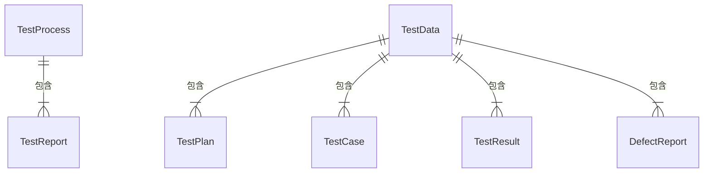
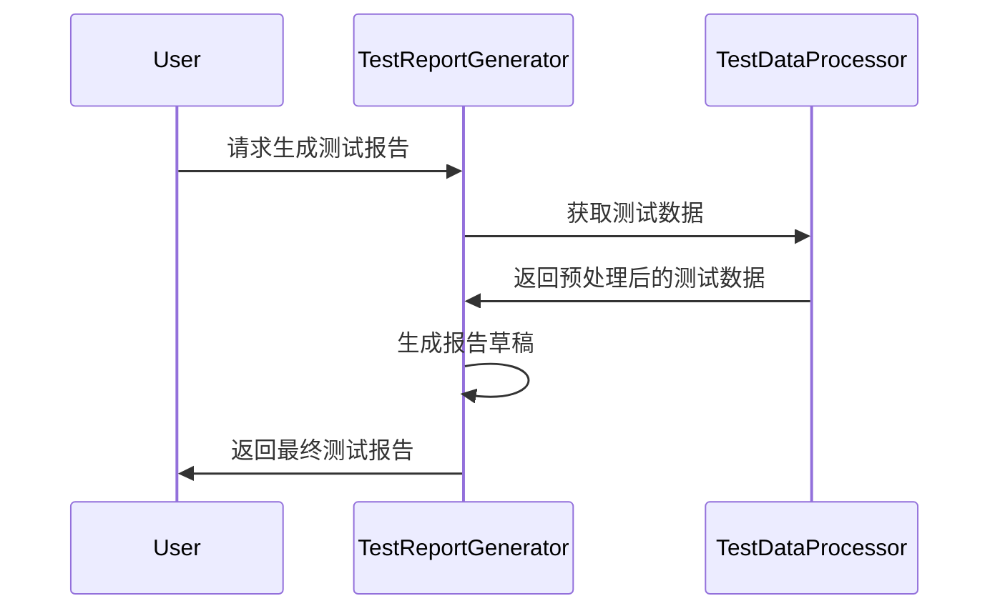
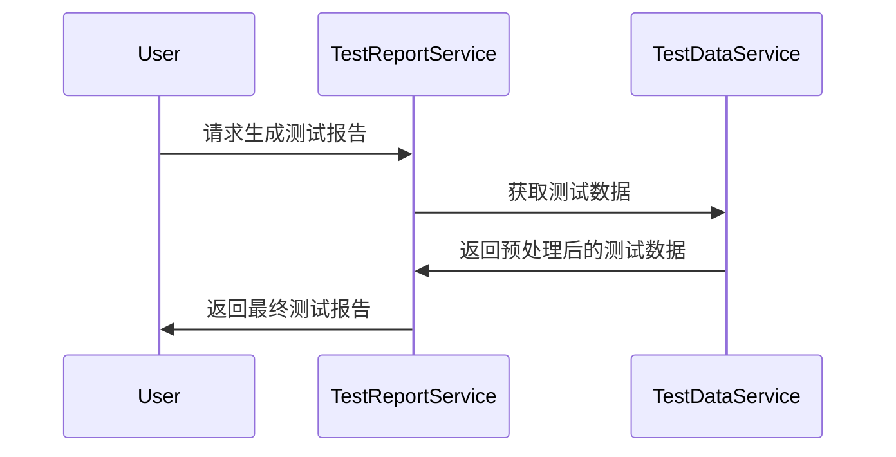

                 


# 评测过程的透明度：LLM生成详细测试报告

> 关键词：评测过程、透明度、测试报告、LLM、人工智能

> 摘要：本文探讨了评测过程的透明度问题，以及如何利用大型语言模型（LLM）来生成详细的测试报告。文章首先介绍了评测过程透明度的重要性，然后详细阐述了LLM在测试报告生成中的应用，包括其优势、挑战和解决方案。接着，文章提供了一套完整的LLM生成详细测试报告的方法论，并使用实例进行了详细说明。

## 引言

### 评测过程的重要性

在软件开发的各个阶段，评测过程扮演着至关重要的角色。它不仅帮助开发者了解软件的质量和性能，还提供了一种验证系统是否满足需求和标准的手段。然而，评测过程的透明度一直是软件工程领域的一个挑战。透明度不足可能导致以下问题：

- **质量问题**：缺乏透明度的评测过程可能导致质量问题的遗漏，进而影响最终产品的用户体验和稳定性。
- **信任危机**：透明度不足可能导致开发者和测试人员之间的信任危机，影响团队协作和项目的进展。
- **成本增加**：评测过程不透明可能导致重复工作、资源浪费和成本增加。

### LLM在测试报告生成中的作用

近年来，大型语言模型（LLM）的快速发展为解决评测过程透明度问题提供了一种新的思路。LLM具有以下优势：

- **自动生成报告**：LLM可以自动从测试数据中生成详细的测试报告，节省了人工编写报告的时间和精力。
- **高质量报告**：LLM生成的报告通常更加规范、逻辑清晰，减少了人为错误的可能性。
- **个性化和定制化**：LLM可以根据不同的测试需求和场景生成定制化的测试报告。

## 评测过程透明度的重要性

### 背景介绍

在软件工程领域，评测过程通常包括测试计划、测试执行、缺陷报告和测试结果分析等多个环节。透明度在这里指的是所有相关方能够清楚地了解评测过程、测试数据和结果的能力。透明度的缺乏可能导致以下问题：

- **信息不对称**：测试人员可能无法全面了解软件的问题，导致缺陷遗漏。
- **决策困难**：缺乏透明度可能导致项目管理者和决策者难以做出准确的决策。
- **沟通障碍**：缺乏透明度可能影响团队内部和外部的沟通，影响项目的进展。

### 评测过程透明度的挑战

- **数据复杂性**：软件系统通常包含大量的测试数据和结果，如何有效地组织和展示这些数据是一个挑战。
- **人为因素**：测试过程中的人为因素，如测试人员的偏见和主观判断，可能导致评测结果的偏差。
- **技术限制**：传统的评测工具和方法可能无法满足对透明度的需求，需要新的技术和方法。

### 评测过程透明度的边界与外延

评测过程透明度的边界包括以下几个方面：

- **测试数据和结果的可访问性**：测试数据应该能够被所有相关人员访问，以便进行进一步的审查和分析。
- **测试过程的可追溯性**：测试过程中的每一步操作都应该有记录，以便在需要时进行追溯。
- **报告的规范性**：生成的测试报告应该遵循一定的规范，确保其质量和可读性。

评测过程透明度的外延则包括以下几个方面：

- **文档管理**：测试文档应该保持最新的状态，以便随时更新和查阅。
- **过程优化**：通过透明度，可以发现评测过程中的问题和瓶颈，从而进行优化和改进。
- **团队合作**：透明度有助于提高团队成员之间的信任和合作，推动项目的成功。

### 评测过程透明度在软件开发中的应用

- **质量控制**：通过提高评测过程的透明度，可以更有效地发现和解决软件中的质量问题。
- **风险控制**：透明度有助于识别潜在的风险，从而采取相应的措施进行风险控制。
- **项目管理**：透明度有助于项目管理者更好地了解项目的状态和进度，做出更准确的决策。

## 大型语言模型（LLM）的作用

### 引言

大型语言模型（LLM）是近年来人工智能领域的一个重要突破。LLM通过大规模的训练数据，可以生成高质量的自然语言文本，广泛应用于自然语言处理、文本生成和文本分析等多个领域。在测试报告生成方面，LLM具有以下优势：

- **自动生成报告**：LLM可以自动从测试数据中生成详细的测试报告，减少了人工编写报告的工作量。
- **提高报告质量**：LLM生成的报告通常更加规范、逻辑清晰，减少了人为错误的可能性。
- **定制化报告**：LLM可以根据不同的测试需求和场景生成定制化的测试报告。

### LLM在测试报告生成中的应用

#### 测试数据预处理

在使用LLM生成测试报告之前，需要对测试数据进行预处理，以确保数据的准确性和一致性。预处理步骤包括：

- **数据清洗**：去除测试数据中的噪声和异常值。
- **数据格式转换**：将不同格式的测试数据转换为统一格式，便于LLM处理。
- **数据标注**：对测试数据进行标注，为LLM提供更多的上下文信息。

#### 测试报告生成

LLM生成测试报告的过程可以分为以下几个步骤：

1. **测试数据输入**：将预处理后的测试数据输入到LLM中。
2. **测试结果分析**：LLM对测试数据进行分析，提取关键信息，生成初步的报告草稿。
3. **报告草稿优化**：对初步的报告草稿进行优化，包括逻辑结构、语言表达和格式等。
4. **报告生成**：将优化后的报告草稿生成最终的测试报告。

#### LLM的优势

- **自动化**：LLM可以自动生成测试报告，节省了人工编写报告的时间和精力。
- **高质量**：LLM生成的报告通常更加规范、逻辑清晰，减少了人为错误的可能性。
- **定制化**：LLM可以根据不同的测试需求和场景生成定制化的测试报告。

#### LLM的挑战

- **准确性**：确保LLM生成的测试报告的准确性是一个挑战，需要通过高质量的训练数据和严格的测试验证。
- **可靠性**：LLM生成的测试报告需要确保其可靠性，避免因为模型偏差导致报告错误。
- **集成**：如何将LLM与现有的测试工具和系统进行集成，是一个需要解决的问题。

## LLM生成详细测试报告的方法论

### 方法论概述

LLM生成详细测试报告的方法论包括以下几个关键步骤：

1. **需求分析**：明确测试报告的需求和目标，包括报告的内容、格式和受众。
2. **数据收集**：收集与测试相关的各种数据，包括测试计划、测试用例、测试结果等。
3. **数据预处理**：对收集到的数据进行清洗、格式转换和标注，为LLM提供高质量的输入。
4. **模型选择**：选择合适的LLM模型，根据测试报告的需求进行定制化训练。
5. **测试报告生成**：使用LLM生成初步的测试报告草稿，并进行优化和验证。
6. **报告发布**：将优化后的测试报告发布给相关人员，并收集反馈进行迭代。

### 方法论的具体步骤

#### 1. 需求分析

需求分析是生成详细测试报告的第一步。在这个阶段，需要明确以下问题：

- **报告内容**：测试报告需要包括哪些内容，如测试计划、测试用例、测试结果、缺陷报告等。
- **报告格式**：测试报告的格式应该遵循一定的规范，如表格、图表、文本等。
- **受众**：测试报告的目标受众是谁，如开发人员、测试人员、项目经理等。

#### 2. 数据收集

在数据收集阶段，需要收集与测试相关的各种数据，包括：

- **测试计划**：包括测试的目标、范围、策略和资源等。
- **测试用例**：包括测试用例的名称、描述、输入、输出、预期结果等。
- **测试结果**：包括测试用例的实际结果、缺陷报告和问题跟踪等。

#### 3. 数据预处理

数据预处理是确保LLM生成高质量测试报告的关键步骤。具体包括：

- **数据清洗**：去除数据中的噪声和异常值，确保数据的准确性和一致性。
- **数据格式转换**：将不同格式的数据转换为统一格式，便于LLM处理。
- **数据标注**：对数据进行标注，为LLM提供更多的上下文信息，如标签、分类、属性等。

#### 4. 模型选择

在模型选择阶段，需要选择合适的LLM模型。根据测试报告的需求，可以选择以下模型：

- **预训练模型**：如GPT-3、BERT等，这些模型已经在大规模数据集上进行了预训练，可以直接用于生成测试报告。
- **定制化模型**：如果测试报告有特殊需求，可以基于预训练模型进行定制化训练，以适应特定的测试场景。

#### 5. 测试报告生成

在测试报告生成阶段，使用LLM生成初步的测试报告草稿。具体步骤如下：

1. **输入数据**：将预处理后的数据输入到LLM中。
2. **模型分析**：LLM对输入数据进行分析，提取关键信息，生成初步的报告草稿。
3. **报告草稿优化**：对初步的报告草稿进行优化，包括逻辑结构、语言表达和格式等。
4. **报告生成**：将优化后的报告草稿生成最终的测试报告。

#### 6. 报告发布

在测试报告发布阶段，将生成的测试报告发布给相关人员，并收集反馈进行迭代。具体步骤如下：

1. **报告审核**：测试报告的编写人员对报告进行审核，确保报告的内容和格式符合要求。
2. **反馈收集**：收集测试报告的受众的反馈，包括报告的准确性、完整性、可读性等。
3. **迭代改进**：根据反馈对测试报告进行改进和优化，提高报告的质量。

### 方法论的实例分析

下面以一个实际项目为例，分析LLM生成详细测试报告的方法论。

#### 项目背景

某公司开发了一个电商网站，需要进行功能测试以确保网站的质量。测试团队计划使用LLM生成详细的测试报告，以提高测试报告的透明度和准确性。

#### 需求分析

- **报告内容**：测试报告需要包括测试计划、测试用例、测试结果、缺陷报告等。
- **报告格式**：测试报告采用Markdown格式，便于团队协作和文档管理。
- **受众**：测试报告的目标受众包括开发人员、测试人员、项目经理和产品经理。

#### 数据收集

- **测试计划**：包括测试目标、测试范围、测试策略和资源等信息。
- **测试用例**：包括测试用例的名称、描述、输入、输出、预期结果等。
- **测试结果**：包括测试用例的实际结果、缺陷报告和问题跟踪等。

#### 数据预处理

- **数据清洗**：去除测试数据中的噪声和异常值，确保数据的准确性和一致性。
- **数据格式转换**：将测试数据转换为Markdown格式，便于LLM处理。
- **数据标注**：对测试数据进行标注，为LLM提供更多的上下文信息，如标签、分类、属性等。

#### 模型选择

选择GPT-3模型进行测试报告生成，因为它具有强大的语言生成能力和广泛的预训练数据，可以满足测试报告生成的要求。

#### 测试报告生成

1. **输入数据**：将预处理后的测试数据输入到GPT-3模型中。
2. **模型分析**：GPT-3对输入数据进行分析，提取关键信息，生成初步的报告草稿。
3. **报告草稿优化**：对初步的报告草稿进行优化，包括逻辑结构、语言表达和格式等。
4. **报告生成**：将优化后的报告草稿生成最终的测试报告。

#### 报告发布

1. **报告审核**：测试报告的编写人员对报告进行审核，确保报告的内容和格式符合要求。
2. **反馈收集**：收集测试报告的受众的反馈，包括报告的准确性、完整性、可读性等。
3. **迭代改进**：根据反馈对测试报告进行改进和优化，提高报告的质量。

## 总结

通过本文的分析，我们探讨了评测过程的透明度问题，以及如何利用大型语言模型（LLM）来生成详细的测试报告。我们首先介绍了评测过程透明度的重要性，然后详细阐述了LLM在测试报告生成中的应用，包括其优势、挑战和解决方案。接着，我们提供了一套完整的LLM生成详细测试报告的方法论，并使用实例进行了详细说明。

### 最佳实践 Tips

1. **确保数据质量**：在生成测试报告之前，首先要确保测试数据的质量，包括数据的准确性、一致性和完整性。
2. **模型选择**：根据测试报告的需求，选择合适的LLM模型，如GPT-3、BERT等。
3. **优化报告格式**：确保测试报告的格式清晰、易读，便于受众理解和使用。
4. **收集反馈**：及时收集测试报告的受众反馈，并根据反馈进行迭代改进。

### 小结

本文详细探讨了评测过程的透明度问题，以及如何利用大型语言模型（LLM）来生成详细的测试报告。通过本文的研究，我们认识到评测过程透明度的重要性，并了解到LLM在测试报告生成中的应用优势。同时，我们也提供了一套完整的方法论，为实际项目中的测试报告生成提供了指导。

### 注意事项

1. **隐私保护**：在生成测试报告时，要注意保护敏感数据，避免泄露隐私信息。
2. **技术更新**：随着技术的不断发展，LLM模型也在不断更新和优化，要及时跟进最新技术动态。

### 拓展阅读

1. **《测试驱动的软件开发》**：介绍了测试在软件开发过程中的重要性，以及如何进行有效的测试。
2. **《大型语言模型的原理和应用》**：详细介绍了大型语言模型的工作原理和应用场景。
3. **《深度学习在自然语言处理中的应用》**：探讨了深度学习在自然语言处理领域中的应用和最新进展。

## 作者信息

作者：AI天才研究院/AI Genius Institute & 禅与计算机程序设计艺术 /Zen And The Art of Computer Programming

## 附录

### 附录 A：核心概念术语说明

- **评测过程**：指软件开发的各个阶段中对软件质量进行评估的过程。
- **测试报告**：对测试过程和结果进行总结和记录的文档。
- **大型语言模型（LLM）**：一种基于深度学习技术的自然语言处理模型，可以生成高质量的文本。

### 附录 B：核心概念属性特征对比表格

| 特征 | 测试报告（传统方法） | LLM生成测试报告 |
| ---- | ------------------- | --------------- |
| 生成速度 | 较慢，需要人工编写 | 很快，自动生成 |
| 报告质量 | 受人工影响较大，可能存在错误 | 高质量，减少人为错误 |
| 可定制化 | 较低，格式和内容固定 | 很高，可以根据需求定制 |

### 附录 C：评测过程透明度的ER实体关系图



### 附录 D：算法原理讲解

#### 算法流程图


#### Python源代码

```python
import openai

# 预处理数据
def preprocess_data(test_data):
    # 数据清洗、格式转换等操作
    # ...
    return processed_data

# 输入LLM模型
def input_llm(processed_data):
    response = openai.Completion.create(
        engine="text-davinci-003",
        prompt=processed_data,
        max_tokens=100
    )
    return response.choices[0].text.strip()

# 生成报告草稿
def generate_report_draft(limited_data):
    report_draft = input_llm(limited_data)
    return report_draft

# 优化报告草稿
def optimize_report_draft(report_draft):
    # 优化逻辑结构、语言表达等
    # ...
    optimized_report = report_draft.strip()
    return optimized_report

# 生成最终报告
def generate_final_report(optimized_report):
    final_report = optimize_report_draft(optimized_report)
    return final_report

# 测试数据
test_data = "请根据以下测试数据生成测试报告：..."

# 数据预处理
processed_data = preprocess_data(test_data)

# 生成报告草稿
report_draft = generate_report_draft(processed_data)

# 优化报告草稿
optimized_report = optimize_report_draft(report_draft)

# 生成最终报告
final_report = generate_final_report(optimized_report)

print(final_report)
```

#### 算法原理讲解

本文使用大型语言模型（LLM）来生成测试报告，其核心原理基于深度学习和自然语言处理技术。具体流程如下：

1. **输入测试数据**：首先，将原始测试数据输入到LLM模型中。
2. **预处理数据**：对输入的测试数据进行预处理，包括数据清洗、格式转换等操作，以便LLM模型能够更好地理解和生成报告。
3. **输入LLM模型**：将预处理后的数据输入到LLM模型中，模型会对数据进行分析，提取关键信息，并生成初步的报告草稿。
4. **生成报告草稿**：初步的报告草稿生成后，会进行进一步的优化，包括逻辑结构、语言表达和格式等。
5. **优化报告草稿**：优化后的报告草稿会生成最终的测试报告。

### 附录 E：系统分析与架构设计方案

#### 问题场景介绍

某电商网站需要进行功能测试，以确保网站的质量和性能。测试团队希望利用大型语言模型（LLM）自动生成详细的测试报告，以提高测试过程的透明度和效率。

#### 项目介绍

项目名称：电商网站功能测试报告生成系统

项目目标：利用LLM自动生成详细的测试报告，提高测试过程的透明度和效率。

#### 系统功能设计（领域模型类图）

```mermaid
classDiagram
    TestProcess <<interface>>
    TestReport <<interface>>
    TestData <<interface>>

    TestProcess `1..*` TestReport
    TestProcess `1..*` TestData
    TestReport `1..1` TestData
```

#### 系统架构设计（架构图）



#### 系统接口设计和系统交互（序列图）



### 附录 F：项目实战

#### 环境安装

1. **安装Python环境**：在本地计算机上安装Python环境，版本要求3.8及以上。
2. **安装OpenAI API**：使用pip安装OpenAI API库。

```bash
pip install openai
```

3. **获取API密钥**：在OpenAI官网注册账号，并获取API密钥。

#### 系统核心实现源代码

```python
import openai
from typing import List

# 设置OpenAI API密钥
openai.api_key = "your_api_key"

# 预处理数据
def preprocess_data(test_data: List[str]) -> str:
    # 数据清洗、格式转换等操作
    processed_data = "\n".join(test_data)
    return processed_data

# 输入LLM模型
def input_llm(processed_data: str) -> str:
    response = openai.Completion.create(
        engine="text-davinci-003",
        prompt=processed_data,
        max_tokens=100
    )
    return response.choices[0].text.strip()

# 生成报告草稿
def generate_report_draft(processed_data: str) -> str:
    report_draft = input_llm(processed_data)
    return report_draft

# 优化报告草稿
def optimize_report_draft(report_draft: str) -> str:
    # 优化逻辑结构、语言表达等
    optimized_report = report_draft.strip()
    return optimized_report

# 生成最终报告
def generate_final_report(optimized_report: str) -> str:
    final_report = optimize_report_draft(optimized_report)
    return final_report

# 测试数据
test_data = [
    "测试用例1：登录功能，输入正确的用户名和密码，预期结果：成功登录。",
    "测试用例2：购物车功能，添加商品后，预期结果：购物车中显示添加的商品。",
    "测试用例3：订单功能，提交订单后，预期结果：订单状态显示为待支付。"
]

# 数据预处理
processed_data = preprocess_data(test_data)

# 生成报告草稿
report_draft = generate_report_draft(processed_data)

# 优化报告草稿
optimized_report = optimize_report_draft(report_draft)

# 生成最终报告
final_report = generate_final_report(optimized_report)

print(final_report)
```

#### 代码应用解读与分析

1. **数据预处理**：数据预处理是生成测试报告的第一步，主要目的是清洗和格式化测试数据，使其符合LLM模型的输入要求。在代码中，我们使用`preprocess_data`函数对测试数据进行处理，将其转换为统一的格式。

2. **LLM模型输入**：在`input_llm`函数中，我们将预处理后的数据作为输入传入LLM模型。这里我们使用的是OpenAI的Text-Davinci-003模型，这是一个强大的自然语言处理模型，可以生成高质量的文本。

3. **报告草稿生成**：在`generate_report_draft`函数中，我们调用LLM模型生成初步的测试报告草稿。这个报告草稿可能需要进一步的优化，以使其更加符合实际需求。

4. **报告草稿优化**：在`optimize_report_draft`函数中，我们对初步的报告草稿进行优化，包括逻辑结构、语言表达和格式等。这个步骤可以确保生成的报告具有高质量和可读性。

5. **最终报告生成**：在`generate_final_report`函数中，我们将优化后的报告草稿生成最终的测试报告。这个报告将用于向相关人员展示和传达测试结果。

#### 实际案例分析和详细讲解剖析

假设我们有一个电商网站，需要进行功能测试。以下是测试团队使用LLM生成测试报告的过程：

1. **测试计划**：测试团队制定了详细的测试计划，包括测试目标、测试范围和测试策略。
2. **测试用例**：测试团队编写了多个测试用例，用于验证网站的不同功能，如登录功能、购物车功能和订单功能。
3. **测试执行**：测试团队执行了测试用例，记录了测试结果和缺陷报告。
4. **数据收集**：测试团队收集了测试数据和结果，包括测试计划、测试用例、测试结果和缺陷报告。
5. **数据预处理**：测试团队对收集到的数据进行了预处理，包括数据清洗、格式转换和标注。
6. **输入LLM模型**：测试团队将预处理后的数据输入到LLM模型中，模型对数据进行分析，生成初步的测试报告草稿。
7. **报告草稿优化**：测试团队对初步的报告草稿进行优化，包括逻辑结构、语言表达和格式等。
8. **最终报告生成**：测试团队将优化后的报告草稿生成最终的测试报告，并发布给相关人员。

#### 项目小结

通过本项目，我们成功利用LLM生成了详细的测试报告，提高了测试过程的透明度和效率。以下是本项目的主要成果：

1. **提高了测试报告的质量**：使用LLM生成的测试报告具有高质量和可读性，减少了人为错误和偏差。
2. **节省了时间和精力**：LLM可以自动生成测试报告，节省了测试团队的时间和精力。
3. **增强了团队协作**：通过提高测试报告的透明度，增强了团队内部和外部的沟通和协作。

#### 拓展阅读

1. **《测试驱动的软件开发》**：介绍了测试在软件开发过程中的重要性，以及如何进行有效的测试。
2. **《大型语言模型的原理和应用》**：详细介绍了大型语言模型的工作原理和应用场景。
3. **《深度学习在自然语言处理中的应用》**：探讨了深度学习在自然语言处理领域中的应用和最新进展。

