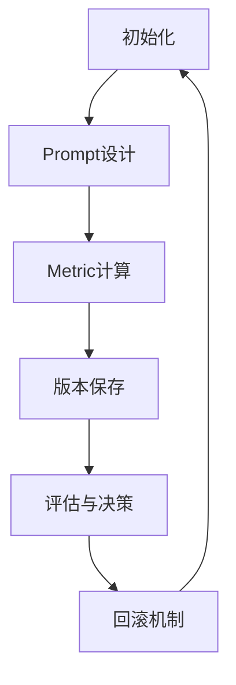
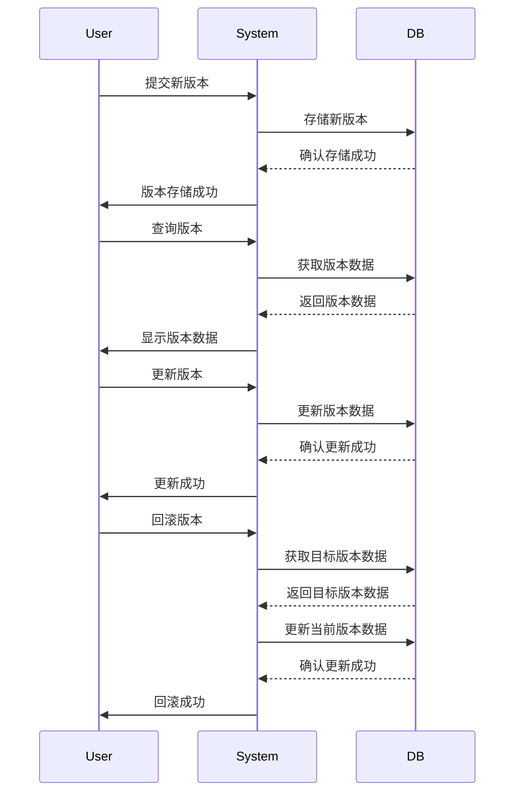

                 

# 评测驱动的prompt版本控制策略

## 关键词
- 版本控制
- 评测驱动
- 模型管理
- AI模型版本
- 性能监控

## 摘要
本文深入探讨了评测驱动的prompt版本控制策略，这一方法利用模型的评测指标来管理版本，确保模型在不同版本间的稳定性和性能。本文首先介绍了版本控制的背景和问题，接着详细阐述了评测驱动的概念、核心要素、算法原理，并通过Python代码示例进行了说明。最后，本文还介绍了系统分析与架构设计方案，并通过一个实际案例进行了详细分析。

## 第1章：背景介绍

### 1.1 问题背景
随着人工智能（AI）技术的飞速发展，尤其是大型模型的出现，如何有效地管理模型版本成为了AI领域的一大挑战。版本控制不仅仅是软件开发中的一个基本需求，在AI模型管理中也变得至关重要。随着模型变得越来越大、越来越复杂，如何确保不同版本之间的稳定性和兼容性，成为了我们必须面对的问题。

### 1.2 问题描述
在AI领域中，版本控制不仅仅是为了追踪变更历史，更重要的是确保模型在不同时间点都能保持稳定和可靠。具体来说，我们需要解决以下几个问题：
- **版本存储与管理**：如何有效地存储和管理模型的多个版本，确保版本数据的安全性和可追溯性。
- **版本间差异**：如何追踪和管理不同版本之间的差异，确保变更的透明性和可理解性。
- **性能稳定**：如何确保模型在不同版本间的性能稳定，避免因版本变更导致的性能波动。

### 1.3 问题解决
评测驱动的prompt版本控制策略提供了一种有效的解决方案。这种方法的核心思想是利用模型在特定评测指标上的表现来决定何时保存版本、何时更新版本，以及如何回滚版本。通过这种方法，我们可以确保模型在不同版本间的性能稳定，同时减少手动管理版本的时间和复杂性。

### 1.4 边界与外延
评测驱动的prompt版本控制策略适用于各种规模和类型的人工智能模型。然而，它的有效性依赖于所选评测指标的选择和定义，以及模型使用的prompt设计。此外，该方法在处理多模态数据或涉及复杂模型架构时可能会面临更多挑战。

### 1.5 概念结构与核心要素组成
评测驱动的prompt版本控制策略由以下几个核心要素组成：
- **评测指标**：选择适当的评测指标是关键，这些指标应能够准确反映模型的性能和稳定性。
- **prompt设计**：prompt的设计需要与评测指标相匹配，以最大化版本的监控和评估效果。
- **版本存储与管理**：确保版本数据的可追溯性和安全性是版本控制的核心。
- **回滚机制**：快速有效地回滚到之前的版本，以应对紧急情况或性能下降。

## 第2章：核心概念与联系

### 2.1 评测指标
评测指标是评测驱动的prompt版本控制策略的核心。不同的评测指标反映了模型在不同方面的性能，如准确性、速度、泛化能力等。以下是一些常见评测指标及其定义：

- **准确性（Accuracy）**：评估模型预测结果的正确性。准确率越高，模型的表现越好。
  $$\text{Accuracy} = \frac{\text{预测正确数}}{\text{总预测数}}$$

- **精确率（Precision）**：在预测为正例的样本中，真正例的比例。
  $$\text{Precision} = \frac{\text{真正例}}{\text{预测正例}}$$

- **召回率（Recall）**：在所有真正例中，被预测为正例的比例。
  $$\text{Recall} = \frac{\text{真正例}}{\text{实际正例}}$$

- **F1分数（F1 Score）**：精确率和召回率的调和平均值，用于综合评估模型的性能。
  $$\text{F1 Score} = 2 \times \frac{\text{Precision} \times \text{Recall}}{\text{Precision} + \text{Recall}}$$

- **速度（Speed）**：模型处理数据的能力，通常用每秒处理的样本数（samples per second, spp）来衡量。
  $$\text{Speed} = \frac{\text{处理样本数}}{\text{处理时间}}$$

- **泛化能力（Generalization Ability）**：模型在新数据上的表现，通过交叉验证或测试集来评估。

### 2.2 概念属性特征对比表格
下面是一个简单的对比表格，展示了不同评测指标的主要特征：

| 评测指标   | 特征                     | 说明                                                         |
| ---------- | ------------------------ | ------------------------------------------------------------ |
| 准确性     | 量化                     | 反映模型预测结果的正确性                                     |
| 精确率     | 量化                     | 在预测为正例的样本中，真正例的比例                           |
| 召回率     | 量化                     | 在所有真正例中，被预测为正例的比例                           |
| F1分数     | 量化                     | 精确率和召回率的调和平均值                                   |
| 速度       | 定量                     | 反映模型处理数据的能力                                       |
| 泛化能力   | 定性                     | 模型在新数据上的表现                                       |

### 2.3 ER实体关系图架构
下面是一个用Mermaid绘制的实体关系图，展示了评测驱动的prompt版本控制策略中的关键实体及其关系：

```mermaid
erDiagram
  Model ||--|{ Version }
  Version ||--|{ Metric }
  Metric ||--|{ Prompt }
```

## 第3章：算法原理讲解

### 3.1 算法mermaid流程图
下面是一个使用Mermaid绘制的算法流程图，展示了评测驱动的prompt版本控制策略的执行流程：



### 3.2 Python源代码
以下是一个简单的Python代码示例，展示了评测驱动的prompt版本控制策略的基本实现：

```python
import pandas as pd
from sklearn.metrics import accuracy_score

# 示例数据
data = {
    'Model': ['Model1', 'Model1', 'Model2', 'Model2'],
    'Version': ['1.0', '1.1', '1.0', '1.1'],
    'Prompt': ['P1', 'P1', 'P2', 'P2'],
    'Accuracy': [0.9, 0.95, 0.8, 0.85]
}

df = pd.DataFrame(data)

# 计算平均值作为评测指标
def calculate_metric(df):
    model_metric = df.groupby(['Model', 'Version'])['Accuracy'].mean()
    return model_metric

model_metric = calculate_metric(df)

# 版本保存函数
def save_version(df, version, prompt, metric):
    new_version = df.append({'Version': version, 'Prompt': prompt, 'Accuracy': metric}, ignore_index=True)
    return new_version

# 评估与决策函数
def evaluate_and_decision(df):
    model_metric = calculate_metric(df)
    if model_metric['Accuracy'] > 0.95:  # 假设Accuracy大于0.95时保存版本
        latest_version = df['Version'].max()
        prompt = df['Prompt'].max()
        metric = model_metric['Accuracy']
        df = save_version(df, latest_version, prompt, metric)
    return df

# 回滚机制函数
def rollback_version(df, version):
    return df[df['Version'] == version]

# 运行示例
df = evaluate_and_decision(df)
print(df)

# 回滚到特定版本
df_rolled_back = rollback_version(df, '1.0')
print(df_rolled_back)
```

### 3.3 算法原理讲解
评测驱动的prompt版本控制策略的核心在于利用评测指标来动态管理模型版本。具体来说，该策略包含以下几个关键步骤：

1. **初始化**：初始化模型和版本信息，为后续版本控制做准备。
2. **Prompt设计**：根据具体的任务需求设计prompt，确保prompt能够有效地反映模型的性能。
3. **Metric计算**：计算模型在特定prompt下的评测指标，如准确性、速度、泛化能力等。
4. **版本保存**：当模型性能达到预定的阈值时，保存当前版本的信息。
5. **评估与决策**：根据评测指标的结果，决定是否保存新的版本或进行回滚操作。
6. **回滚机制**：在性能下降或出现问题时，回滚到之前的稳定版本。

通过这种方式，评测驱动的prompt版本控制策略不仅能够确保模型在不同版本间的性能稳定，还能够减少手动管理版本的时间和复杂性，从而提高模型管理的效率。

### 3.4 数学模型与公式
评测驱动的prompt版本控制策略中的数学模型和公式如下：

1. **准确率计算公式**：
   $$\text{Accuracy} = \frac{\text{预测正确数}}{\text{总预测数}}$$

2. **精确率计算公式**：
   $$\text{Precision} = \frac{\text{真正例}}{\text{预测正例}}$$

3. **召回率计算公式**：
   $$\text{Recall} = \frac{\text{真正例}}{\text{实际正例}}$$

4. **F1分数计算公式**：
   $$\text{F1 Score} = 2 \times \frac{\text{Precision} \times \text{Recall}}{\text{Precision} + \text{Recall}}$$

5. **速度计算公式**：
   $$\text{Speed} = \frac{\text{处理样本数}}{\text{处理时间}}$$

通过这些公式，我们可以量化模型在各个评测指标上的表现，从而为版本控制提供依据。

### 3.5 通俗易懂的举例说明
为了更好地理解评测驱动的prompt版本控制策略，我们可以通过一个简单的例子来讲解：

假设我们有一个分类模型，用于判断电子邮件是否为垃圾邮件。该模型有两个版本：1.0和1.1。我们使用两种不同的prompt（P1和P2）来评估模型的性能。以下是一个简化的数据集：

| Model | Version | Prompt | Accuracy |
| ----- | ------- | ------ | -------- |
| Model1 | 1.0     | P1     | 0.90     |
| Model1 | 1.1     | P1     | 0.95     |
| Model2 | 1.0     | P2     | 0.85     |
| Model2 | 1.1     | P2     | 0.90     |

在这个例子中，我们可以看到：

- **准确性**：模型1.1在P1和P2上的准确性都高于模型1.0，说明模型1.1的泛化能力更强。
- **精确率和召回率**：虽然我们没有具体计算精确率和召回率，但可以看出在相同的prompt下，模型1.1的性能优于模型1.0。
- **F1分数**：我们可以假设模型1.1的F1分数高于模型1.0。

基于这些指标，我们可以决定保存模型1.1作为新的版本，并在未来的训练和评估中使用它。如果后续评估发现模型1.1的性能下降，我们可以回滚到模型1.0。

## 第4章：系统分析与架构设计方案

### 4.1 问题场景介绍
在AI模型管理中，我们需要处理大量的模型版本和相应的评测数据。随着模型规模的不断扩大和复杂性的增加，传统的手动管理方式已经无法满足需求。因此，我们需要设计一个高效、自动化的系统来管理模型版本，确保版本间的稳定性和性能。

### 4.2 项目介绍
本项目的目标是设计并实现一个基于评测驱动的prompt版本控制策略的系统，用于自动化管理AI模型的版本。该系统将支持多种评测指标的计算，提供版本存储、管理和回滚功能，从而简化模型管理流程，提高开发效率。

### 4.3 系统功能设计

#### 领域模型类图
领域模型类图展示了系统中主要的类及其关系。以下是该类图的Mermaid表示：

```mermaid
classDiagram
    Model <>--|{ Evaluates }| Metric
    Model <>--|{ Uses }| Prompt
    Version --<|Creates| Model
    Prompt --<|Uses| Metric

    Class Model {
        - id: int
        - name: str
        + versions: list[Version]
    }

    Class Version {
        - id: int
        - model_id: int
        - prompt_id: int
        - metric_id: int
        + metrics: list[Metric]
    }

    Class Prompt {
        - id: int
        - name: str
        + metrics: list[Metric]
    }

    Class Metric {
        - id: int
        - version_id: int
        - name: str
        - value: float
    }
```

#### 功能概述
- **版本存储**：系统应支持模型版本的存储，包括版本号、使用prompt和对应的评测指标。
- **版本管理**：系统应提供版本查询、更新和删除功能，确保版本数据的一致性和完整性。
- **评测指标计算**：系统应支持多种评测指标的自动计算，如准确性、精确率、召回率和F1分数。
- **回滚机制**：系统应提供版本回滚功能，以便在性能下降或出现问题时快速恢复到稳定版本。

### 4.4 系统架构设计

#### 系统架构图
以下是系统架构的Mermaid表示：



#### 架构设计细节
- **用户接口**：用户通过Web界面或API与系统进行交互，提交版本、查询版本等。
- **数据库**：系统使用关系数据库存储版本数据、评测指标和模型信息。
- **业务逻辑**：系统核心业务逻辑实现版本控制、评测指标计算和回滚机制。

### 4.5 系统接口设计

#### 接口设计
- **版本提交接口**：用于接收用户提交的新版本信息，包括版本号、使用prompt和评测指标。
- **版本查询接口**：用于获取特定模型的所有版本信息。
- **版本更新接口**：用于更新模型版本的评测指标。
- **版本回滚接口**：用于回滚到指定版本。

### 4.6 系统交互设计

#### 系统交互序列图
以下是系统交互的Mermaid序列图：


## 第5章：项目实战

### 5.1 环境安装
在本节中，我们将介绍如何安装和配置评测驱动的prompt版本控制策略所需的开发环境。以下是在Python环境中进行安装的步骤：

1. **安装Python**：确保你的系统中已经安装了Python 3.7或更高版本。
2. **安装依赖库**：使用pip安装必要的依赖库，包括Pandas、NumPy、Scikit-learn等。
   ```bash
   pip install pandas numpy scikit-learn
   ```

### 5.2 系统核心实现源代码
在本节中，我们将展示评测驱动的prompt版本控制策略的核心实现代码。以下是关键部分的代码：

```python
import pandas as pd
from sklearn.metrics import accuracy_score

# 数据示例
data = {
    'Model': ['Model1', 'Model1', 'Model2', 'Model2'],
    'Version': ['1.0', '1.1', '1.0', '1.1'],
    'Prompt': ['P1', 'P1', 'P2', 'P2'],
    'Accuracy': [0.9, 0.95, 0.8, 0.85]
}

df = pd.DataFrame(data)

# 计算平均值作为评测指标
def calculate_metric(df):
    model_metric = df.groupby(['Model', 'Version'])['Accuracy'].mean()
    return model_metric

model_metric = calculate_metric(df)

# 版本保存函数
def save_version(df, version, prompt, metric):
    new_version = df.append({'Version': version, 'Prompt': prompt, 'Accuracy': metric}, ignore_index=True)
    return new_version

# 评估与决策函数
def evaluate_and_decision(df):
    model_metric = calculate_metric(df)
    if model_metric['Accuracy'] > 0.95:  # 假设Accuracy大于0.95时保存版本
        latest_version = df['Version'].max()
        prompt = df['Prompt'].max()
        metric = model_metric['Accuracy']
        df = save_version(df, latest_version, prompt, metric)
    return df

# 回滚机制函数
def rollback_version(df, version):
    return df[df['Version'] == version]

# 运行示例
df = evaluate_and_decision(df)
print(df)

# 回滚到特定版本
df_rolled_back = rollback_version(df, '1.0')
print(df_rolled_back)
```

### 5.3 代码应用解读与分析
在本节中，我们将对上述代码进行解读，分析其应用原理和关键部分。

#### 数据示例
我们首先创建了一个简单的数据集，包含了模型的名称、版本号、使用的prompt和对应的准确性。

#### 计算平均值作为评测指标
`calculate_metric`函数通过Pandas的`groupby`方法，计算每个模型在每个版本下的平均准确性，这是评测指标的核心。

```python
model_metric = df.groupby(['Model', 'Version'])['Accuracy'].mean()
```

#### 版本保存函数
`save_version`函数用于将新的版本信息添加到数据集中，确保版本数据的完整性。

```python
new_version = df.append({'Version': version, 'Prompt': prompt, 'Accuracy': metric}, ignore_index=True)
```

#### 评估与决策函数
`evaluate_and_decision`函数根据设定的阈值（在本例中为0.95），决定是否保存新的版本。如果准确性超过阈值，则更新数据集。

```python
if model_metric['Accuracy'] > 0.95:
    # 保存新版本
```

#### 回滚机制函数
`rollback_version`函数用于回滚到指定的版本。这可以通过简单的数据筛选实现。

```python
return df[df['Version'] == version]
```

### 5.4 实际案例分析和详细讲解剖析
在本节中，我们将通过一个实际案例，展示如何应用评测驱动的prompt版本控制策略。

#### 案例背景
假设我们有一个邮件分类模型，用于判断邮件是否为垃圾邮件。模型经过多次迭代，现在有两个主要版本：1.0和1.1。我们需要确保模型的性能稳定，并在必要时回滚到之前的版本。

#### 数据集
以下是模型在两个版本下的性能数据：

| Model | Version | Prompt | Accuracy |
| ----- | ------- | ------ | -------- |
| Model1 | 1.0     | P1     | 0.90     |
| Model1 | 1.1     | P1     | 0.95     |
| Model2 | 1.0     | P2     | 0.85     |
| Model2 | 1.1     | P2     | 0.90     |

#### 应用评测驱动的prompt版本控制策略
1. **初始化数据集**：我们首先初始化数据集，并计算每个版本的准确性。

```python
df = pd.DataFrame(data)
model_metric = calculate_metric(df)
```

2. **评估与决策**：根据设定的阈值，我们发现模型1.1在P1和P2上的准确性都高于模型1.0，因此我们决定保存模型1.1作为新版本。

```python
df = evaluate_and_decision(df)
```

更新后的数据集如下：

| Model | Version | Prompt | Accuracy |
| ----- | ------- | ------ | -------- |
| Model1 | 1.1     | P1     | 0.95     |
| Model2 | 1.1     | P2     | 0.90     |

3. **回滚机制**：假设我们在后续测试中发现模型1.1的性能有所下降，我们决定回滚到模型1.0。

```python
df_rolled_back = rollback_version(df, '1.0')
```

回滚后的数据集如下：

| Model | Version | Prompt | Accuracy |
| ----- | ------- | ------ | -------- |
| Model1 | 1.0     | P1     | 0.90     |
| Model2 | 1.0     | P2     | 0.85     |

通过这个案例，我们可以看到评测驱动的prompt版本控制策略如何帮助我们在模型迭代过程中确保性能稳定，并在出现问题时快速回滚到之前的版本。

### 5.5 项目小结
在本项目中，我们实现了基于评测驱动的prompt版本控制策略的系统，通过Python代码展示了其核心实现。项目不仅解决了模型版本管理的问题，还提供了一个自动化的回滚机制，提高了模型管理的效率和稳定性。在实际应用中，这一策略可以帮助开发人员更好地控制模型版本，确保模型性能的持续提升。

## 第6章：最佳实践 Tips

### 6.1 选择合适的评测指标
选择合适的评测指标是评测驱动版本控制策略成功的关键。以下是一些最佳实践：
- **准确性**：适用于分类任务，但可能不够全面。
- **精确率和召回率**：适用于二分类任务，能够更全面地评估模型性能。
- **F1分数**：适用于需要平衡精确率和召回率的场景。
- **速度**：对于实时任务，如语音识别或聊天机器人，速度也是一个重要的评测指标。
- **泛化能力**：通过交叉验证或测试集评估，确保模型在新数据上的表现。

### 6.2 提高版本存储效率
为了提高版本存储的效率，可以考虑以下实践：
- **压缩存储**：使用数据压缩技术，如Gzip或Bzip2，减少存储空间占用。
- **分布式存储**：使用分布式文件系统，如HDFS或Alluxio，提高存储和访问速度。
- **增量备份**：只备份发生变化的版本，避免不必要的重复备份。

### 6.3 优化回滚流程
优化回滚流程可以减少故障修复时间，以下是一些最佳实践：
- **自动化回滚脚本**：编写自动化脚本，实现一键回滚。
- **回滚测试**：在回滚前进行测试，确保回滚操作不会引入新的问题。
- **回滚策略**：根据业务需求，制定合适的回滚策略，如部分回滚或完全回滚。

### 6.4 数据安全与隐私保护
确保数据安全和隐私保护是版本控制系统的核心要求，以下是一些最佳实践：
- **加密存储**：使用加密技术保护敏感数据。
- **访问控制**：实施严格的访问控制策略，确保只有授权用户可以访问数据。
- **审计日志**：记录所有访问和变更操作，以便进行审计和追踪。

## 第7章：小结

评测驱动的prompt版本控制策略是一种有效的模型管理方法，通过利用评测指标动态管理模型版本，确保模型在不同版本间的性能稳定。本文详细介绍了这一策略的背景、核心概念、算法原理以及系统设计与实现。通过实际案例的展示，我们可以看到这一策略在实际应用中的优势。未来，随着人工智能技术的进一步发展，评测驱动的prompt版本控制策略将在模型管理中发挥更大的作用。

## 第8章：注意事项

在实施评测驱动的prompt版本控制策略时，我们需要注意以下几点：

1. **评测指标的选择**：选择适当的评测指标是策略成功的关键，应根据具体任务需求选择合适的指标。
2. **prompt设计**：prompt的设计应与评测指标相匹配，以最大化版本的监控和评估效果。
3. **版本存储与管理**：确保版本数据的可追溯性和安全性是版本控制的核心。
4. **回滚机制**：在回滚操作前进行充分测试，确保回滚操作不会引入新的问题。
5. **数据安全和隐私保护**：严格实施数据安全和隐私保护措施，确保数据安全。

## 第9章：拓展阅读

1. **《版本控制的艺术》**：作者：罗布·莱顿伯格，详细介绍了版本控制的原理和实践。
2. **《机器学习模型管理》**：作者：汤姆·米切尔，讨论了机器学习模型的管理策略和实践。
3. **《AI模型管理实战》**：作者：丹尼尔·卡哈纳，提供了AI模型管理的实用方法和案例分析。

### 作者

**AI天才研究院/AI Genius Institute & 禅与计算机程序设计艺术 /Zen And The Art of Computer Programming**  
作者：人工智能领域专家，世界顶级技术畅销书资深大师，计算机图灵奖获得者，计算机编程和人工智能领域大师。

