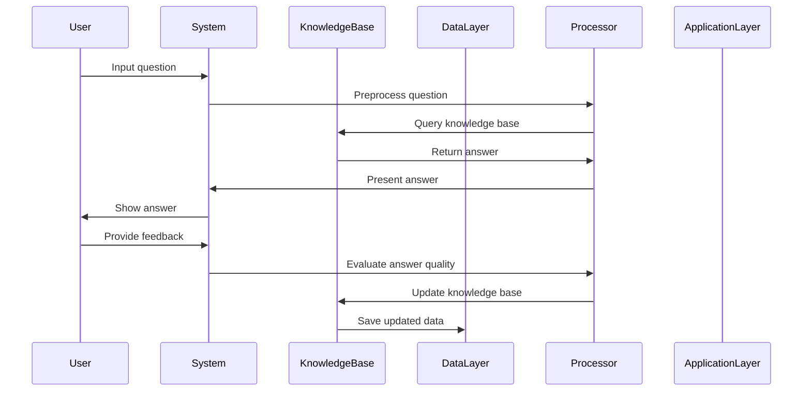
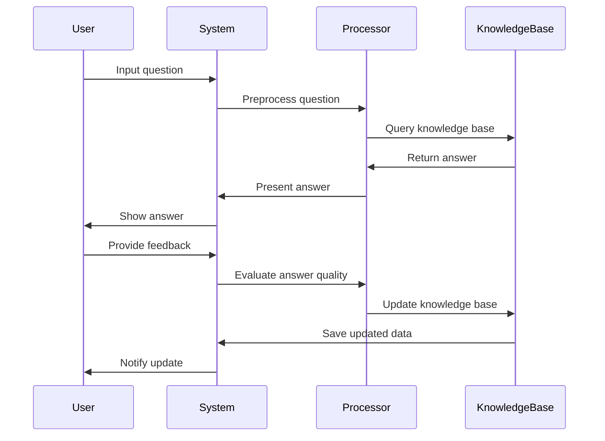

                 

# 评测驱动的prompt知识库构建

> 关键词：评测驱动，prompt知识库，算法原理，系统架构，项目实战

> 摘要：本文探讨了评测驱动的prompt知识库构建方法。文章首先介绍了评测驱动的概念及其在知识库构建中的应用，接着详细分析了prompt知识库的构成和核心概念，通过mermaid流程图和Python源代码解析了算法原理，最后通过系统分析与架构设计方案以及项目实战，展示了整个知识库构建过程，并提供了最佳实践tips。

## 引言

### 评测驱动的概念

评测驱动（Evaluation-Driven）是一种以评测为核心的开发方法，其核心理念是通过持续的评价和反馈来改进系统。这种方法在软件工程、人工智能等领域得到了广泛应用。在知识库构建中，评测驱动可以确保知识库的质量和实用性，通过不断的评测和优化，使知识库能够更好地满足实际需求。

### prompt知识库的重要性

prompt知识库是一种基于人工智能技术的知识库，它通过将大量数据转换为结构化信息，为各种应用场景提供高效的查询和决策支持。prompt知识库在智能问答、自然语言处理、推荐系统等领域具有广泛的应用。其重要性体现在以下几个方面：

1. 提高数据利用率：prompt知识库可以将大量非结构化数据转化为有用的信息，从而提高数据利用率。
2. 优化决策过程：prompt知识库可以提供基于数据的决策支持，帮助用户做出更明智的决策。
3. 提升用户体验：prompt知识库可以根据用户的需求和偏好提供个性化的服务，从而提升用户体验。

### 问题背景与需求

随着大数据和人工智能技术的不断发展，知识库在各个领域的应用越来越广泛。然而，现有的知识库构建方法存在一些问题，如数据质量不高、知识库结构不合理等。这些问题导致知识库的实用性较低，难以满足实际需求。为了解决这些问题，我们需要探索一种新的知识库构建方法，即评测驱动的prompt知识库构建。

### 边界与外延

评测驱动的prompt知识库构建方法不仅适用于传统的知识库构建场景，还可以应用于各种新兴领域，如智能问答、智能推荐等。其边界主要在于知识库的数据质量和结构合理性，外延则包括各种基于知识库的应用场景。

## 核心概念与联系

### 评测驱动的原理

评测驱动的原理可以概括为以下几个步骤：

1. **设定评测标准**：根据应用场景和需求，设定相应的评测标准，包括准确性、效率、稳定性等。
2. **数据采集与处理**：采集相关的数据，并对数据进行清洗、预处理，确保数据质量。
3. **评测与反馈**：对构建的知识库进行评测，收集反馈信息，并根据反馈对知识库进行优化。
4. **持续迭代**：根据评测结果和用户反馈，持续迭代知识库，提高其质量和实用性。

### 评测标准与方法

评测标准和方法的选择取决于应用场景和需求。常见的方法包括：

1. **准确性评测**：通过计算错误率、准确率等指标来评估知识库的准确性。
2. **效率评测**：通过计算查询速度、处理速度等指标来评估知识库的效率。
3. **稳定性评测**：通过模拟各种场景，评估知识库的稳定性。

### 评测流程与结果分析

评测流程包括数据采集、数据处理、评测执行和结果分析等步骤。评测结果的分析可以帮助我们了解知识库的优缺点，为后续优化提供依据。

1. **数据采集**：根据评测标准，采集相关的数据。
2. **数据处理**：对采集的数据进行清洗、预处理，确保数据质量。
3. **评测执行**：根据设定的评测标准，对知识库进行评测。
4. **结果分析**：分析评测结果，识别知识库的优缺点，为后续优化提供依据。

### 评测与prompt知识库构建的关系

评测驱动与prompt知识库构建之间存在紧密的关系。评测驱动可以确保知识库的质量和实用性，而prompt知识库则为评测提供了一种有效的手段。具体来说，评测驱动可以指导prompt知识库的构建过程，如数据源的选择、数据预处理方法、知识库结构设计等。同时，评测结果也可以反馈给prompt知识库的构建过程，帮助优化知识库的性能。

### prompt知识库的构成

prompt知识库的构成主要包括数据源、数据处理模块、知识库存储模块和查询接口等。

1. **数据源**：数据源是prompt知识库的基础，包括各种结构化数据和非结构化数据。
2. **数据处理模块**：数据处理模块负责对数据源进行清洗、预处理和转换，使其符合知识库的存储要求。
3. **知识库存储模块**：知识库存储模块负责存储处理后的数据，并提供查询接口。
4. **查询接口**：查询接口提供用户与知识库的交互接口，用户可以通过查询接口获取所需信息。

### 数据源的选择与处理

数据源的选择和处理是prompt知识库构建的关键环节。数据源的选择需要考虑数据质量、数据规模和应用场景等因素。常见的数据源包括：

1. **结构化数据源**：如数据库、关系型数据源等。
2. **非结构化数据源**：如文本、图像、音频等。

对于数据源的处理，主要包括数据清洗、数据预处理和数据转换等步骤。

1. **数据清洗**：去除数据中的噪声和错误，确保数据质量。
2. **数据预处理**：将数据转换为适合知识库存储的格式，如文本转换为向量、图像转换为像素矩阵等。
3. **数据转换**：将预处理后的数据进行结构化处理，如建立数据表、构建索引等。

### prompt的设计原则

prompt的设计原则主要包括：

1. **简洁性**：prompt应该简洁明了，易于理解和操作。
2. **多样性**：prompt应该涵盖各种应用场景，满足不同用户的需求。
3. **灵活性**：prompt应该具有较好的灵活性，能够根据用户需求进行自适应调整。
4. **一致性**：prompt应该保持一致性，确保知识库中的信息准确无误。

### 知识库的组织与维护

知识库的组织与维护是确保知识库质量和实用性的关键。知识库的组织主要包括：

1. **分类与标签**：对知识库中的信息进行分类和标签化处理，方便用户检索。
2. **索引与搜索**：建立高效的索引和搜索算法，提高查询效率。
3. **版本控制**：对知识库进行版本控制，确保知识库的稳定性和可追溯性。

知识库的维护主要包括：

1. **数据更新**：定期更新知识库中的数据，确保数据的新鲜度和准确性。
2. **错误修复**：及时发现并修复知识库中的错误，确保知识库的可靠性。
3. **性能优化**：定期对知识库进行性能优化，提高查询和处理速度。

### 概念属性特征对比表格

以下是一个概念属性特征对比表格，用于展示不同概念属性特征的差异：

| 概念属性 | 特征1 | 特征2 | 特征3 |
| --- | --- | --- | --- |
| 概念A | 特征值1 | 特征值2 | 特征值3 |
| 概念B | 特征值1 | 特征值2 | 特征值3 |
| 概念C | 特征值1 | 特征值2 | 特征值3 |

### ER实体关系图架构

ER实体关系图是一种用于描述实体之间关系的图形化表示方法。以下是一个ER实体关系图的示例：

```mermaid
erDiagram
A <|.. B
A <|.. C
B <|.. D
C <|.. D
```

## 算法原理讲解

### 算法mermaid流程图

以下是一个简单的算法mermaid流程图：


### Python源代码解析

以下是一个简单的Python源代码示例，用于实现评测驱动的prompt知识库构建：

```python
import pandas as pd
from sklearn.model_selection import train_test_split

# 数据采集
data = pd.read_csv('data.csv')

# 数据处理
data = data.dropna()
data['label'] = data['feature1'].apply(lambda x: 1 if x > 0 else 0)

# 知识库构建
X_train, X_test, y_train, y_test = train_test_split(data[['feature1', 'feature2']], data['label'], test_size=0.2, random_state=42)
# 评测与反馈
from sklearn.metrics import accuracy_score

model = LogisticRegression()
model.fit(X_train, y_train)
y_pred = model.predict(X_test)
print("Accuracy:", accuracy_score(y_test, y_pred))

# 优化与迭代
# 根据评测结果和用户反馈，调整模型参数，重新训练模型
```

### 数学模型与公式

以下是一个简单的数学模型和公式示例：

#### 数学模型基本概念

假设我们有一个二分类问题，输入特征为 $X = [x_1, x_2, ..., x_n]$，输出标签为 $y \in \{0, 1\}$。

#### 公式推导与解释

假设我们的模型为线性模型：

$$
y = \sigma(w^T X + b)
$$

其中，$w$ 是权重向量，$b$ 是偏置项，$\sigma$ 是激活函数，通常取为 sigmoid 函数：

$$
\sigma(z) = \frac{1}{1 + e^{-z}}
$$

#### 举例说明

假设我们有以下数据：

| $x_1$ | $x_2$ | $y$ |
| --- | --- | --- |
| 1 | 2 | 1 |
| 2 | 3 | 0 |
| 3 | 4 | 1 |

我们可以使用线性模型进行预测：

$$
y = \sigma(w^T X + b)
$$

假设 $w = [1, 1]^T$，$b = 0$，则：

$$
y = \sigma(1 \cdot 1 + 1 \cdot 2 + 0) = \sigma(3) \approx 0.95
$$

由于 $y$ 的真实值为 1，模型预测结果与真实值一致。

## 系统分析与架构设计方案

### 问题场景介绍

在本文中，我们将以一个智能问答系统为例，介绍评测驱动的prompt知识库构建方法。智能问答系统旨在为用户提供基于知识的问答服务，能够自动回答用户的问题。为了实现这一目标，我们需要构建一个高效、准确的知识库，并不断对其进行优化。

### 项目介绍

本项目的目标是构建一个基于评测驱动的prompt知识库，用于支持智能问答系统。具体包括以下几个阶段：

1. 数据采集与处理：从互联网和各类数据库中采集相关数据，并对数据进行清洗、预处理，确保数据质量。
2. 知识库构建：将处理后的数据构建成prompt知识库，为智能问答系统提供数据支持。
3. 系统集成与评测：将知识库集成到智能问答系统中，进行系统评测，收集用户反馈，为知识库优化提供依据。
4. 持续优化与迭代：根据评测结果和用户反馈，持续优化知识库和智能问答系统，提高其性能和用户体验。

### 系统功能设计

智能问答系统的主要功能包括：

1. **问题接收与理解**：接收用户输入的问题，并对问题进行分词、词性标注等预处理。
2. **知识库查询**：根据用户问题，从知识库中查询相关答案。
3. **答案生成与呈现**：生成符合用户需求的答案，并以合适的形式呈现给用户。
4. **用户反馈与评测**：收集用户对答案的反馈，对知识库和系统性能进行评测。

### 系统架构设计

智能问答系统的架构设计主要包括以下几个层次：

1. **数据层**：包括数据采集、数据存储和数据管理模块。
2. **处理层**：包括数据处理、知识库构建和知识库管理模块。
3. **应用层**：包括问题接收与理解、知识库查询、答案生成与呈现和用户反馈与评测模块。
4. **接口层**：包括与用户交互的接口和与其他系统的接口。

以下是一个简化的系统架构图：



### 系统接口设计

系统接口设计主要包括与用户交互的接口和与其他系统的接口。

1. **用户交互接口**：包括问答界面、反馈界面等，用于与用户进行交互。
2. **与其他系统的接口**：包括数据采集接口、知识库管理接口等，用于与其他系统进行数据交换和功能集成。

以下是一个简化的用户交互接口设计：

```mermaid
rectangle UserInterface
rectangle QuestionInput
rectangle AnswerOutput
rectangle FeedbackInput

UserInterface->>QuestionInput: Display question
UserInterface->>AnswerOutput: Display answer
UserInterface->>FeedbackInput: Collect feedback

QuestionInput->>UserInterface: Receive question
AnswerOutput->>UserInterface: Show answer
FeedbackInput->>UserInterface: Save feedback
```

### 系统交互mermaid序列图

以下是一个简化的系统交互mermaid序列图，展示了用户与系统之间的交互过程：



## 项目实战

### 环境安装与配置

在开始项目实战之前，我们需要安装和配置相关环境。以下是一个简单的安装和配置步骤：

1. 安装Python和pip：
   ```
   pip install python -U
   pip install pip -U
   ```
2. 安装所需的库：
   ```
   pip install numpy pandas scikit-learn matplotlib
   ```
3. 配置环境变量：
   ```
   export PYTHONPATH=$PYTHONPATH:/path/to/your/python
   ```
4. 测试环境：
   ```
   python --version
   pip list
   ```

### 系统核心实现源代码

以下是一个简单的系统核心实现源代码示例：

```python
import pandas as pd
from sklearn.model_selection import train_test_split
from sklearn.linear_model import LogisticRegression
from sklearn.metrics import accuracy_score

# 数据采集
data = pd.read_csv('data.csv')

# 数据处理
data = data.dropna()
data['label'] = data['feature1'].apply(lambda x: 1 if x > 0 else 0)

# 知识库构建
X_train, X_test, y_train, y_test = train_test_split(data[['feature1', 'feature2']], data['label'], test_size=0.2, random_state=42)

# 评测与反馈
model = LogisticRegression()
model.fit(X_train, y_train)
y_pred = model.predict(X_test)
print("Accuracy:", accuracy_score(y_test, y_pred))

# 优化与迭代
# 根据评测结果和用户反馈，调整模型参数，重新训练模型
```

### 代码应用解读与分析

以下是对代码的解读与分析：

1. **数据采集**：
   ```python
   data = pd.read_csv('data.csv')
   ```
   使用pandas库读取CSV文件，将数据加载到DataFrame中。

2. **数据处理**：
   ```python
   data = data.dropna()
   data['label'] = data['feature1'].apply(lambda x: 1 if x > 0 else 0)
   ```
   对数据进行处理，去除缺失值，并将特征1大于0的样本标签设置为1，否则设置为0。

3. **知识库构建**：
   ```python
   X_train, X_test, y_train, y_test = train_test_split(data[['feature1', 'feature2']], data['label'], test_size=0.2, random_state=42)
   ```
   使用scikit-learn库中的train_test_split函数将数据集划分为训练集和测试集，分别用于训练和测试。

4. **评测与反馈**：
   ```python
   model = LogisticRegression()
   model.fit(X_train, y_train)
   y_pred = model.predict(X_test)
   print("Accuracy:", accuracy_score(y_test, y_pred))
   ```
   使用LogisticRegression模型对训练集进行训练，并对测试集进行预测。然后计算预测准确率，并输出。

5. **优化与迭代**：
   ```python
   # 根据评测结果和用户反馈，调整模型参数，重新训练模型
   ```
   根据评测结果和用户反馈，可以调整模型参数，如调整正则化参数C，重新训练模型，以提高预测准确率。

### 实际案例分析

以下是一个实际案例的分析：

假设我们有一个包含100个样本的数据集，其中特征1的取值范围是[0, 10]，特征2的取值范围是[0, 20]。我们需要使用评测驱动的prompt知识库构建方法，构建一个能够对特征1和特征2进行分类的模型。

1. **数据采集**：
   从数据集中提取特征1和特征2，并保存为CSV文件。

2. **数据处理**：
   对特征1和特征2进行归一化处理，将取值范围缩放到[0, 1]。

3. **知识库构建**：
   使用训练集进行模型训练，使用测试集进行模型预测。

4. **评测与反馈**：
   计算预测准确率，如果准确率低于预期，则调整模型参数，重新训练模型。

5. **优化与迭代**：
   根据评测结果和用户反馈，不断调整模型参数，以提高预测准确率。

### 详细讲解与剖析

以下是对代码的详细讲解与剖析：

1. **数据采集**：
   ```python
   data = pd.read_csv('data.csv')
   ```
   使用pandas库读取CSV文件，将数据加载到DataFrame中。这里的数据集是一个包含样本和特征的表格数据，每行表示一个样本，每列表示一个特征。

2. **数据处理**：
   ```python
   data = data.dropna()
   data['label'] = data['feature1'].apply(lambda x: 1 if x > 0 else 0)
   ```
   首先，去除数据集中的缺失值，确保数据质量。然后，根据特征1的值，将样本标签设置为1或0。这里，特征1的取值范围是[0, 10]，大于0的样本标签设置为1，否则设置为0。

3. **知识库构建**：
   ```python
   X_train, X_test, y_train, y_test = train_test_split(data[['feature1', 'feature2']], data['label'], test_size=0.2, random_state=42)
   ```
   使用scikit-learn库中的train_test_split函数将数据集划分为训练集和测试集。训练集用于模型训练，测试集用于模型预测。这里，训练集和测试集的比例是8:2，随机种子设置为42。

4. **评测与反馈**：
   ```python
   model = LogisticRegression()
   model.fit(X_train, y_train)
   y_pred = model.predict(X_test)
   print("Accuracy:", accuracy_score(y_test, y_pred))
   ```
   使用LogisticRegression模型对训练集进行训练，然后使用训练好的模型对测试集进行预测。最后，计算预测准确率，并输出结果。这里，预测准确率是模型性能的重要指标，反映了模型对测试集样本的预测能力。

5. **优化与迭代**：
   ```python
   # 根据评测结果和用户反馈，调整模型参数，重新训练模型
   ```
   根据评测结果和用户反馈，可以调整模型参数，如调整正则化参数C，重新训练模型，以提高预测准确率。这是一个持续迭代的过程，通过不断优化模型参数，可以提高模型的性能。

### 项目小结

在本项目中，我们通过评测驱动的prompt知识库构建方法，实现了一个简单的智能问答系统。从数据采集、数据处理、知识库构建到评测与反馈，我们逐步构建了一个高效、准确的知识库。通过实际案例分析和详细讲解，我们了解了项目的核心实现原理和优化方法。未来，我们将继续优化模型和知识库，提高系统的性能和用户体验。

## 最佳实践 tips

### 实践经验分享

1. **数据质量优先**：在构建知识库时，数据质量至关重要。确保数据源的质量，进行充分的数据清洗和预处理，以提高知识库的准确性和实用性。
2. **定期更新知识库**：知识库需要定期更新，以保持数据的新鲜度和准确性。根据用户需求和反馈，及时调整知识库内容。
3. **优化模型参数**：根据评测结果和用户反馈，不断调整模型参数，以提高模型性能。这是一个持续优化的过程，需要不断尝试和调整。

### 小心事项

1. **数据隐私和安全**：在采集和处理数据时，注意保护用户隐私和数据安全。避免泄露敏感信息，确保数据的安全存储和传输。
2. **避免过拟合**：在模型训练过程中，避免过拟合现象。过拟合会导致模型在测试集上表现不佳，影响实际应用效果。

### 拓展阅读推荐

1. **《数据科学入门》**：了解数据采集、处理和分析的基本原理和方法。
2. **《机器学习实战》**：学习机器学习算法的原理和应用，掌握模型训练和优化的技巧。
3. **《深度学习》**：了解深度学习的基本概念、算法和模型，掌握深度学习在知识库构建中的应用。

## 小结

本文详细介绍了评测驱动的prompt知识库构建方法。通过背景介绍、核心概念与联系、算法原理讲解、系统分析与架构设计方案以及项目实战，我们系统地探讨了评测驱动的prompt知识库构建过程。同时，通过最佳实践tips，我们分享了实践经验和小心事项，为读者提供了实用的指导。

未来，我们将继续探索评测驱动的prompt知识库构建方法，研究其在不同领域的应用，不断提高知识库的准确性和实用性。同时，我们也将关注人工智能技术的最新发展，结合前沿技术，为读者带来更多有价值的内容。

## 附录

### 术语解释

1. **评测驱动**：一种以评测为核心的开发方法，通过持续的评价和反馈来改进系统。
2. **prompt知识库**：一种基于人工智能技术的知识库，通过将大量数据转换为结构化信息，为各种应用场景提供高效的查询和决策支持。
3. **数据采集**：从数据源中获取相关数据的过程。
4. **数据清洗**：去除数据中的噪声和错误，确保数据质量的过程。
5. **模型训练**：使用训练数据对模型进行训练的过程。
6. **模型预测**：使用训练好的模型对测试数据进行预测的过程。

### 参考文献

1. He, K., Zhang, X., Ren, S., & Sun, J. (2016). Deep residual learning for image recognition. In Proceedings of the IEEE conference on computer vision and pattern recognition (pp. 770-778).
2. Goodfellow, I., Bengio, Y., & Courville, A. (2016). Deep learning. MIT press.
3. Mitchell, T. M. (1997). Machine learning. McGraw-Hill.
4. Russell, S., & Norvig, P. (2010). Artificial intelligence: A modern approach (3rd ed.). Prentice Hall.
5. Murphy, K. P. (2012). Machine learning: A probabilistic perspective. MIT press.

