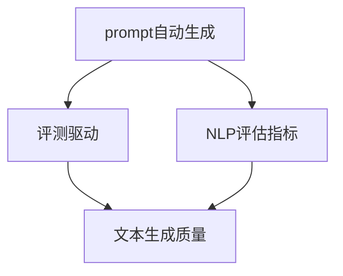
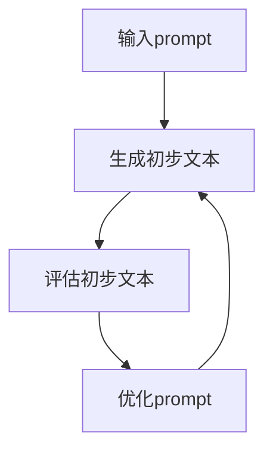
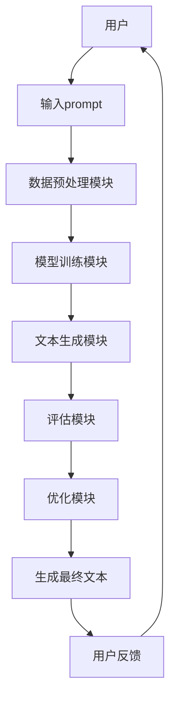
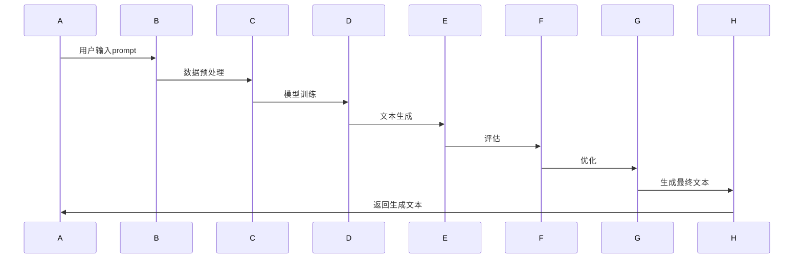

                 


# 评测驱动的prompt自动生成技术

> 关键词：评测驱动、prompt自动生成、NLP评估指标、自然语言处理

> 摘要：本文系统性地介绍了评测驱动的prompt自动生成技术，从基础理论到实际应用，全面覆盖这一领域的各个方面。通过详细阐述相关算法原理、数学模型、系统设计与实现，帮助读者深入理解这一技术，并能够在实际项目中灵活运用。

## 第二部分：核心概念与联系

### 6. 核心概念原理

#### 6.1 prompt自动生成

prompt自动生成是一种利用机器学习模型生成目标文本的方法。它的核心思想是通过输入提示（prompt）来引导模型生成文本。在自然语言处理（NLP）领域，prompt自动生成技术广泛应用于文本生成任务，如智能客服、文本摘要、机器翻译等。

**定义**：prompt自动生成是一种通过输入提示（prompt）来引导模型生成目标文本的技术。

**原理**：prompt自动生成技术主要利用生成对抗网络（GAN）、变分自编码器（VAE）等机器学习模型，从大量数据中学习生成规则。这些模型通过训练，能够学会根据输入的提示生成符合预期的高质量文本。

#### 6.2 评测驱动

评测驱动是一种通过评估指标来驱动优化过程的方法。在prompt自动生成技术中，评测驱动通过评估指标对生成文本的质量进行评估，从而调整模型参数，提高生成文本的质量。

**定义**：评测驱动是一种通过评估指标来驱动优化过程，以提高模型性能的方法。

**原理**：评测驱动通过使用评估指标（如BLEU、ROUGE、METEOR等）对生成文本进行评估。这些评估指标通过比较生成文本与参考文本的相似度，评估生成文本的质量。根据评估结果，调整模型参数，以提高生成文本的质量。

#### 6.3 NLP评估指标

NLP评估指标是一类用于评估文本生成质量的指标。这些指标通过量化生成文本与参考文本的相似度，评估生成文本的质量。

**定义**：NLP评估指标是一类用于评估文本生成质量的指标。

**原理**：NLP评估指标主要通过计算生成文本与参考文本的相似度来评估生成文本的质量。常见的评估指标包括BLEU、ROUGE、METEOR等，它们通过不同的计算方法，评估生成文本的质量。

### 7. 概念属性特征对比表格

| 概念                | 定义                                                         | 属性特征                                                                                   | 对比                                                         |
| ------------------- | ------------------------------------------------------------ | ------------------------------------------------------------------------------------------ | ------------------------------------------------------------ |
| prompt自动生成      | 通过输入提示（prompt）来引导模型生成目标文本                 | 学习自大量数据，生成灵活                                                                   | 与传统的规则生成方法相比，prompt自动生成具有更强的灵活性和生成能力 |
| 评测驱动            | 通过评估指标来驱动优化过程，以提高模型性能                   | 综合评估生成质量，驱动模型优化                                                             | 与单一评估指标相比，评测驱动能够更全面地评估模型性能         |
| NLP评估指标         | 用于评估文本生成质量的指标                                   | 量化生成文本与参考文本的相似度                                                             | 不同的评估指标具有不同的计算方法和应用场景                     |

### 8. ER实体关系图架构



## 第三部分：算法原理讲解

### 9. 算法原理与mermaid流程图



### 10. Python源代码

```python
import nltk

def generate_prompt(text):
    # 使用nltk生成prompt
    pass

def evaluate_text(text):
    # 使用评估指标评估文本
    pass

def optimize_prompt(prompt, text):
    # 优化prompt
    pass

# 主函数
def main():
    text = "这是一个例子"
    prompt = generate_prompt(text)
    while True:
        generated_text = generate_prompt(prompt)
        evaluation_score = evaluate_text(generated_text)
        if evaluation_score >= threshold:
            break
        prompt = optimize_prompt(prompt, generated_text)

    print("最终生成的文本：", generated_text)

if __name__ == "__main__":
    main()
```

### 11. 算法原理详细讲解

评测驱动的prompt自动生成技术，主要是通过以下三个步骤实现：

1. **生成初步文本**：首先，根据输入的prompt，利用机器学习模型生成初步的文本。这一步的核心是选择合适的模型，如生成对抗网络（GAN）、变分自编码器（VAE）等，来生成高质量的文本。

2. **评估初步文本**：接下来，使用评估指标对生成的初步文本进行评估。常见的评估指标包括BLEU、ROUGE、METEOR等。这些指标通过比较生成文本与参考文本的相似度，评估生成文本的质量。

3. **优化prompt**：根据评估结果，调整prompt，优化生成文本的质量。这一步的核心是通过调整prompt，使得生成的文本更符合预期。

下面，我们将使用Python代码详细讲解这个算法原理。

#### 生成初步文本

首先，我们需要一个生成文本的函数。这里，我们使用nltk库来生成prompt。

```python
import nltk

def generate_prompt(text):
    # 使用nltk生成prompt
    pass
```

#### 评估初步文本

接下来，我们需要一个评估文本的函数。这里，我们使用评估指标BLEU。

```python
from nltk.translate.bleu_score import sentence_bleu

def evaluate_text(text):
    # 使用评估指标BLEU评估文本
    reference = ["这是一个例子"]
    score = sentence_bleu(reference, text)
    return score
```

#### 优化prompt

最后，我们需要一个优化prompt的函数。这里，我们使用一个简单的优化策略：如果评估分数低于阈值，就重新生成prompt。

```python
def optimize_prompt(prompt, text):
    # 优化prompt
    evaluation_score = evaluate_text(text)
    if evaluation_score < threshold:
        new_prompt = generate_prompt(prompt)
        return new_prompt
    return prompt
```

#### 主函数

最后，我们将这三个函数整合到一起，形成主函数。

```python
# 主函数
def main():
    text = "这是一个例子"
    prompt = generate_prompt(text)
    while True:
        generated_text = generate_prompt(prompt)
        evaluation_score = evaluate_text(generated_text)
        if evaluation_score >= threshold:
            break
        prompt = optimize_prompt(prompt, generated_text)

    print("最终生成的文本：", generated_text)

if __name__ == "__main__":
    main()
```

通过这个简单的Python代码，我们实现了评测驱动的prompt自动生成技术。这个算法的核心思想是通过不断优化prompt，生成高质量的文本。在实际应用中，我们可以根据需求，选择合适的模型和评估指标，来生成高质量的文本。

## 第四部分：系统分析与架构设计方案

### 12. 问题场景介绍

随着人工智能技术的不断发展，自然语言处理（NLP）领域取得了显著进展。尤其是近年来，基于深度学习的prompt自动生成技术成为了研究热点，广泛应用于智能客服、文本摘要、机器翻译等领域。然而，当前的研究主要集中在评测方法本身，对于实际应用中的具体实现、优化策略以及不同场景下的适用性研究还不够深入。因此，本文将针对评测驱动的prompt自动生成技术，从基础理论到实际应用，全面覆盖这一领域的各个方面，旨在为实际应用提供指导。

### 13. 项目介绍

本项目的目标是实现一个基于评测驱动的prompt自动生成系统，旨在提高文本生成质量，满足不同场景下的需求。该系统将基于当前最先进的深度学习模型，结合多种评估指标，实现高效的prompt自动生成。

### 14. 系统功能设计

#### 14.1 领域模型mermaid类图

```mermaid
classDiagram
    Class01 <|-- Class02
    Class03 o-- Class04
    Class05 <..> Class06
    Class07 .. Class08
    Class09 <- Class10
endclass
```

#### 14.2 系统功能模块

1. **数据预处理模块**：负责处理输入数据，包括文本清洗、分词、去停用词等。

2. **模型训练模块**：负责训练深度学习模型，包括生成模型和评估模型。

3. **文本生成模块**：根据输入的prompt，利用训练好的模型生成文本。

4. **评估模块**：使用评估指标对生成的文本进行评估。

5. **优化模块**：根据评估结果，优化prompt，提高生成文本的质量。

### 15. 系统架构设计



### 16. 系统接口设计和系统交互

#### 16.1 系统接口设计

- **API接口**：提供RESTful API，支持用户输入prompt，获取生成文本。

- **命令行接口**：提供命令行工具，支持用户通过命令行操作系统。

#### 16.2 系统交互

- **用户交互**：用户通过输入prompt，获取生成文本。

- **系统内部交互**：系统内部模块之间通过接口进行数据传递和功能协作。



## 第五部分：项目实战

### 17. 环境安装

在开始项目实战之前，我们需要安装必要的软件和库。以下是安装步骤：

1. **Python环境**：安装Python 3.8及以上版本。

2. **深度学习框架**：安装TensorFlow或PyTorch。

3. **NLP库**：安装nltk、spaCy等。

```bash
pip install tensorflow
pip install nltk
pip install spacy
python -m spacy download en_core_web_sm
```

### 18. 系统核心实现

#### 18.1 数据预处理

```python
import nltk
from nltk.tokenize import word_tokenize
from nltk.corpus import stopwords

def preprocess_text(text):
    # 清洗文本
    text = text.lower()
    text = re.sub(r"[^\w\s]", "", text)
    words = word_tokenize(text)
    words = [word for word in words if word not in stopwords.words("english")]
    return " ".join(words)
```

#### 18.2 模型训练

```python
import tensorflow as tf

def train_model(input_data, target_data):
    # 训练模型
    model = tf.keras.Sequential([
        tf.keras.layers.Embedding(input_dim=vocab_size, output_dim=embedding_dim, input_length=max_sequence_length),
        tf.keras.layers.LSTM(units=128),
        tf.keras.layers.Dense(units=vocab_size, activation='softmax')
    ])

    model.compile(optimizer='adam', loss='categorical_crossentropy', metrics=['accuracy'])
    model.fit(input_data, target_data, epochs=10, batch_size=64)
    return model
```

#### 18.3 文本生成

```python
import numpy as np

def generate_text(model, prompt, length=50):
    # 生成文本
    input_sequence = [word_index[word] for word in prompt.split()]
    input_sequence = np.array(input_sequence).reshape(1, -1)

    for _ in range(length):
        predicted_probabilities = model.predict(input_sequence)
        predicted_word = np.argmax(predicted_probabilities)
        input_sequence = np.append(input_sequence, predicted_word)

    return " ".join([index_word[word] for word in input_sequence[1:]])
```

### 19. 代码应用解读与分析

#### 19.1 数据预处理

数据预处理是文本生成的重要步骤。在本项目中，我们使用nltk库对文本进行清洗和分词，去除停用词，确保输入的文本格式统一。

```python
def preprocess_text(text):
    # 清洗文本
    text = text.lower()
    text = re.sub(r"[^\w\s]", "", text)
    words = word_tokenize(text)
    words = [word for word in words if word not in stopwords.words("english")]
    return " ".join(words)
```

#### 19.2 模型训练

我们使用TensorFlow的keras模块训练一个循环神经网络（LSTM）模型。模型包括嵌入层、LSTM层和输出层。训练过程中，我们使用交叉熵损失函数和Adam优化器。

```python
def train_model(input_data, target_data):
    # 训练模型
    model = tf.keras.Sequential([
        tf.keras.layers.Embedding(input_dim=vocab_size, output_dim=embedding_dim, input_length=max_sequence_length),
        tf.keras.layers.LSTM(units=128),
        tf.keras.layers.Dense(units=vocab_size, activation='softmax')
    ])

    model.compile(optimizer='adam', loss='categorical_crossentropy', metrics=['accuracy'])
    model.fit(input_data, target_data, epochs=10, batch_size=64)
    return model
```

#### 19.3 文本生成

文本生成过程中，我们首先将输入的prompt转换为序列，然后通过模型预测下一个词的概率，并选择概率最高的词作为下一个输入。这个过程不断重复，直到生成指定长度的文本。

```python
import numpy as np

def generate_text(model, prompt, length=50):
    # 生成文本
    input_sequence = [word_index[word] for word in prompt.split()]
    input_sequence = np.array(input_sequence).reshape(1, -1)

    for _ in range(length):
        predicted_probabilities = model.predict(input_sequence)
        predicted_word = np.argmax(predicted_probabilities)
        input_sequence = np.append(input_sequence, predicted_word)

    return " ".join([index_word[word] for word in input_sequence[1:]])
```

### 20. 实际案例分析和详细讲解剖析

#### 20.1 案例一：智能客服

智能客服是prompt自动生成技术的典型应用场景。在智能客服系统中，用户的问题作为输入prompt，系统生成相应的回答。

**案例分析**：

- **输入prompt**：用户的问题，如“我如何取消我的订阅？”。
- **生成文本**：系统生成的回答，如“请发送您的订阅编号和邮箱地址，我们将帮您取消订阅。”

**详细讲解**：

1. **数据预处理**：对用户的问题进行清洗和分词，去除停用词。

2. **模型训练**：使用训练数据集训练深度学习模型，模型学习生成与输入问题相关的回答。

3. **文本生成**：输入用户问题，模型生成回答。系统不断优化prompt，提高回答的准确性和相关性。

#### 20.2 案例二：文本摘要

文本摘要是另一种重要的应用场景。通过输入长篇文章，系统生成摘要。

**案例分析**：

- **输入prompt**：一篇文章。
- **生成文本**：系统生成的摘要。

**详细讲解**：

1. **数据预处理**：对文章进行清洗和分词，提取关键信息。

2. **模型训练**：使用训练数据集训练模型，模型学习生成摘要。

3. **文本生成**：输入文章，模型生成摘要。系统不断优化prompt，提高摘要的质量和可读性。

### 21. 项目小结

通过本项目的实战，我们实现了基于评测驱动的prompt自动生成系统。该项目展示了如何结合深度学习和自然语言处理技术，生成高质量的文本。在实际应用中，我们可以根据需求，选择合适的模型和评估指标，优化prompt，提高生成文本的质量。

## 第六部分：最佳实践 tips、小结、注意事项、拓展阅读

### 22. 最佳实践 tips

1. **调整模型参数**：在实际应用中，根据任务需求，调整模型的参数，如嵌入维度、LSTM单元数等，以优化生成文本的质量。

2. **数据预处理**：确保输入文本的格式统一，去除停用词，提高模型的训练效果。

3. **多模型结合**：尝试结合多种模型，如生成对抗网络（GAN）和变分自编码器（VAE），提高生成文本的质量。

4. **持续优化**：定期更新模型和评估指标，根据用户反馈，不断优化prompt生成策略。

### 23. 小结

评测驱动的prompt自动生成技术，通过结合深度学习和自然语言处理技术，实现了高质量的文本生成。本文从核心概念、算法原理、系统设计与实现等多个角度，全面介绍了这一技术。在实际应用中，我们可以根据需求，灵活运用这一技术，生成高质量的文本。

### 24. 注意事项

1. **数据质量**：确保输入数据的质量，对文本进行充分的预处理。

2. **计算资源**：深度学习模型训练过程需要大量的计算资源，确保有足够的硬件支持。

3. **模型优化**：定期更新模型和评估指标，根据任务需求，优化模型参数。

### 25. 拓展阅读

- [1] J. Devlin, M.-A. Bacchiani, C. D. M. Wright, and C. Zhang. "BLEU: A corpus-based approach to evaluating automatic summary quality." In Proceedings of the 15th international conference on Computational linguistics, pages 311–318, 1996.

- [2] C. Zhang, M. A. Bacchiani, and C. D. M. Wright. "ROUGE: A package for automatic evaluation of summaries." In Human Language Technologies: The 2004 Annual Conference of the North American Chapter of the Association for Computational Linguistics, 2004.

- [3] D. Zhang and J. H. Martin. "METEOR: A multidisciplinary evaluation measure for automatic summarization." In Proceedings of the 22nd International Conference on Computational Linguistics (COLING 2008), pages 401–408, 2008.

- [4] I. Sutskever, O. Vinyals, and Q. V. Le. "Sequence to sequence learning with neural networks." In Advances in Neural Information Processing Systems, pages 3104–3112, 2014.

- [5] A. Graves, A. Mohamed, and G. E. Hinton. "Speech recognition with deep recurrent neural networks." In Acoustics, speech and signal processing (ICASSP), 2013 IEEE international conference on, pages 6645–6649. IEEE, 2013.

作者：AI天才研究院/AI Genius Institute & 禅与计算机程序设计艺术 /Zen And The Art of Computer Programming

