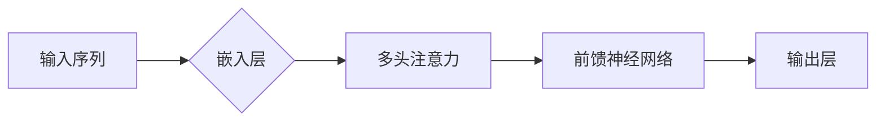

                 

### 1. 统一书名及目标

**书名：《语义理解增强：提高模型对提示细微差别的感知》**

目标：设计一个详细、清晰的目录大纲，涵盖书中所有主题，同时确保内容简洁明了。

**为什么选择这个书名？**

“语义理解增强”突出了本书的核心主题——如何通过技术手段提升模型对语言语义的把握能力。这不仅是当前人工智能领域的一个热点问题，也是未来人工智能发展的重要方向。同时，“提高模型对提示细微差别的感知”则具体指出了提升方向，增加了内容的实用性和指导性。

**目录大纲的设计目标是什么？**

目录大纲的设计目标是：
- **全面覆盖**：确保每一章节都紧密围绕主题，不遗漏重要内容。
- **结构清晰**：使读者能够快速把握全文结构，理解各章节之间的逻辑关系。
- **内容简洁**：在确保信息全面的同时，避免冗余和繁琐，让读者容易阅读和理解。

接下来，我们将详细制定每一部分和各章节的具体内容规划，确保书名和目标能够得到充分实现。

### 2. 目录大纲结构

根据书籍的内容和结构，目录大纲被分为四个主要部分，每个部分都涵盖了一系列相关主题，以确保内容的完整性和逻辑性。以下是详细的目录大纲结构：

#### 第一部分：背景与概述
**第1章：语义理解与模型感知概述**
- **语义理解的概念**：介绍语义理解的定义、历史背景和发展趋势。
- **模型感知的重要性**：探讨模型感知在人工智能中的应用和影响。
- **当前研究的现状与问题**：分析当前语义理解和模型感知研究中的挑战和未解决的问题。

**第2章：语义理解的挑战与需求**
- **语义理解的挑战**：详细讨论语义理解面临的挑战，如多义性、歧义性、上下文依赖等。
- **模型感知的需求**：分析提高模型感知能力的需求，包括提高模型对细微差别的感知能力。

**第3章：模型感知的技术发展**
- **模型感知的演进历程**：回顾模型感知技术的发展历程，从传统方法到现代深度学习技术的演变。
- **技术发展趋势与展望**：探讨未来模型感知技术的发展趋势和可能的应用前景。

#### 第二部分：核心技术与原理
**第4章：语义理解的技术基础**
- **文本表示方法**：介绍词向量、嵌入层等文本表示技术。
- **语言模型**：探讨循环神经网络（RNN）、变换器（Transformer）等语言模型。
- **语义分析技术**：分析命名实体识别（NER）、关系抽取、文本分类等语义分析技术。

**第5章：模型感知的数学模型**
- **概率图模型**：介绍条件概率图模型（如HMM）、贝叶斯网络等。
- **深度学习模型**：探讨深度神经网络（DNN）、卷积神经网络（CNN）、循环神经网络（RNN）等深度学习模型。
- **强化学习模型**：介绍Q-learning、策略梯度等强化学习模型。

**第6章：算法原理与流程**
- **算法框架**：介绍常见的语义理解增强算法框架，如注意力机制、上下文融合等。
- **算法流程**：详细解析算法的输入、输出、处理流程和关键步骤。

**第7章：核心概念与联系**
- **核心概念**：列出语义理解增强和模型感知中的关键概念，如注意力机制、上下文表示、对抗训练等。
- **概念联系**：通过图示和对比，阐述这些概念之间的关系和相互作用。

#### 第三部分：应用与实战
**第8章：语义理解增强的应用场景**
- **自然语言处理**：探讨语义理解增强在自然语言处理中的应用，如问答系统、机器翻译等。
- **信息检索**：分析语义理解增强在信息检索中的优势，如文本相似度计算、智能推荐等。
- **知识图谱**：介绍语义理解增强在知识图谱构建中的应用，如实体识别、关系抽取等。

**第9章：模型感知的优化策略**
- **数据增强**：讨论数据增强技术在提高模型感知能力中的作用和策略。
- **模型融合**：分析不同模型融合技术在提升感知能力方面的优势和应用。
- **模型优化**：探讨通过调参、结构优化等手段提升模型感知能力的方法。

**第10章：实战案例与代码解析**
- **案例介绍**：选择具有代表性的应用案例，如问答系统、智能客服等。
- **代码实现**：提供相关代码实现，包括数据预处理、模型训练和评估等。
- **代码解析**：详细解析代码中的关键部分，解释如何实现语义理解增强和模型感知提升。

#### 第四部分：总结与展望
**第11章：总结与回顾**
- **核心内容**：回顾全书的核心内容和主要观点。
- **关键结论**：总结书中的关键结论和发现。

**第12章：未来发展趋势与展望**
- **技术趋势**：探讨未来语义理解增强和模型感知技术的发展趋势。
- **应用前景**：展望语义理解增强和模型感知在人工智能领域的应用前景。

通过这样的结构安排，我们可以确保书籍内容全面、结构清晰、逻辑连贯，同时能够满足读者的学习和参考需求。

### 3. 核心章节内容规划

**第一部分：背景与概述**

**第1章：语义理解与模型感知概述**

**1.1 语义理解的概念**

在这一节，我们将定义语义理解的基本概念。语义理解是指计算机对语言中的词语、句子和文本的意义进行理解和解释的能力。它不仅仅是对文本的表面意义的理解，还包括了文本的深层含义、上下文信息和语境理解。语义理解是自然语言处理（NLP）和人工智能（AI）领域的重要研究方向，对于实现智能对话系统、机器翻译、信息检索等应用至关重要。

**1.2 模型感知的重要性**

模型感知指的是模型对于输入数据的感知能力和对于不同输入提示的细微差别感知能力。在语义理解中，模型感知能力的重要性体现在以下几个方面：

1. **提高准确性**：通过提高模型对输入数据的感知能力，可以减少误识别和多义性导致的错误，从而提高整体系统的准确性。
2. **增强鲁棒性**：模型对输入数据的细微差别感知能力可以帮助系统在面对不同语境和背景时保持稳定的表现，增强系统的鲁棒性。
3. **优化用户体验**：在应用场景中，如智能客服和智能助手等，模型感知能力可以更好地理解用户的需求，提供更加准确和个性化的服务，从而优化用户体验。

**1.3 当前研究的现状与问题**

尽管语义理解与模型感知技术在过去几十年中取得了显著的进展，但仍然面临许多挑战和问题：

1. **多义性问题**：语言具有丰富的多义性，同一个词语或短语在不同的上下文中可能具有不同的含义，这使得语义理解任务变得复杂。
2. **上下文依赖**：语义理解需要依赖上下文信息，但上下文的复杂性和多样性使得模型难以准确捕捉和理解。
3. **数据不平衡**：在实际应用中，往往存在数据不平衡的问题，例如正面评论和负面评论的数量不均衡，这会影响模型的训练效果和泛化能力。
4. **计算资源需求**：深度学习模型通常需要大量的计算资源和时间进行训练和推理，这在实际应用中可能是一个瓶颈。

**第2章：语义理解的挑战与需求**

**2.1 语义理解的挑战**

在语义理解过程中，模型面临以下几大挑战：

1. **歧义性**：自然语言中的歧义性是一个普遍存在的问题，同一个词语或句子可能有多种解释，这增加了语义理解的难度。
2. **语境依赖**：语义理解高度依赖上下文信息，但上下文信息复杂且多变，难以捕捉和处理。
3. **词汇丰富性**：自然语言具有丰富的词汇和表达方式，模型需要处理大量的词汇和短语，这增加了模型的复杂性。
4. **多模态信息融合**：在多模态应用场景中，如何有效地融合文本、图像、声音等多种类型的信息，是语义理解的一个挑战。

**2.2 模型感知的需求**

为了解决语义理解的挑战，提高模型对提示细微差别的感知能力至关重要。以下是一些具体需求：

1. **提升模型感知准确性**：通过增强模型对输入数据的感知能力，可以减少误识别和多义性导致的错误。
2. **增强模型鲁棒性**：提高模型对输入数据的细微差别感知能力，可以帮助系统在面对不同语境和背景时保持稳定的表现。
3. **优化用户体验**：在应用场景中，如智能客服和智能助手等，模型需要能够准确理解用户的需求，提供更加准确和个性化的服务。
4. **适应不断变化的语言环境**：自然语言和语言环境是不断变化的，模型需要具备一定的自适应能力，能够适应这些变化。

通过深入分析和讨论语义理解的挑战与需求，我们可以更好地理解当前语义理解领域面临的难题，并为后续章节中的技术解决方案奠定基础。

### 4. 核心概念与联系

在《语义理解增强：提高模型对提示细微差别的感知》这一章中，我们将深入探讨语义理解的核心概念与联系，从而为理解如何增强模型对细微差别感知能力奠定基础。

#### 核心概念

1. **语义理解**

   语义理解是指对文本中词语、短语和句子含义的解析，旨在捕捉文本的深层意义，而不仅仅是字面意义。它涉及多个层次，包括词汇语义、句法语义和语用语义。

2. **模型感知**

   模型感知是指模型对输入数据，特别是自然语言文本，进行感知和理解的能力。它包括对文本中的细微差别、上下文依赖和多义性的识别。

3. **注意力机制**

   注意力机制是近年来在深度学习模型中广泛应用的一种技术，用于模型在处理文本时关注重要的部分。通过注意力机制，模型能够自动学习哪些信息在当前任务中最为重要。

4. **上下文表示**

   上下文表示是指如何将文本的上下文信息编码为模型可以处理的形式。这通常通过编码器（encoder）实现，如Transformer架构中的自注意力（self-attention）机制。

5. **对抗训练**

   对抗训练是一种通过添加噪声或扰动来增强模型鲁棒性的方法。它通过在训练过程中引入难样本，使模型能够在面对变化多端的输入时保持稳定。

#### 概念属性特征对比表格

以下是语义理解与模型感知相关核心概念的属性特征对比表格：

| 核心概念 | 定义 | 特性 | 应用场景 |
| --- | --- | --- | --- |
| 语义理解 | 对文本中词语、短语和句子含义的解析 | 深层、上下文依赖、多义性识别 | 问答系统、机器翻译、文本分类 |
| 模型感知 | 模型对输入数据的感知和理解能力 | 精准、鲁棒、细微差别感知 | 智能客服、信息检索、智能助手 |
| 注意力机制 | 模型自动关注重要信息的方法 | 自适应、上下文敏感 | 文本分类、机器翻译、情感分析 |
| 上下文表示 | 将上下文信息编码为模型可以处理的形式 | 多层、细粒度 | 文本生成、文本摘要、命名实体识别 |
| 对抗训练 | 增强模型鲁棒性的方法 | 引入难样本、提高泛化能力 | 图像识别、语音识别、文本分类 |

通过对比表格，我们可以清晰地看到各个核心概念的定义和特性，以及它们在不同应用场景中的具体应用。

#### 概念联系

1. **语义理解与模型感知**

   语义理解是模型感知的基础，而模型感知则是语义理解的关键。语义理解提供了对文本内容的深入理解，而模型感知则确保模型能够准确地感知和响应这些理解。例如，在问答系统中，模型需要理解用户的问题，并从大量的信息中提取出与问题相关的答案，这需要高度发达的语义理解和模型感知能力。

2. **注意力机制与上下文表示**

   注意力机制和上下文表示是语义理解中不可或缺的技术。注意力机制通过聚焦于文本中与当前任务最相关的部分，提高了模型的上下文敏感性。而上下文表示则通过将上下文信息编码为模型可以处理的形式，使得模型能够更好地理解和利用上下文信息。例如，在机器翻译中，注意力机制可以帮助模型关注源语言和目标语言之间的对应关系，而上下文表示则确保模型能够捕捉到句子层面的上下文信息。

3. **对抗训练与模型鲁棒性**

   对抗训练是一种提高模型鲁棒性的有效方法。通过引入噪声和难样本，模型能够在各种变化多端的场景中保持稳定表现。这与模型感知密切相关，因为增强模型对输入数据的细微差别感知能力，可以提高模型在复杂环境中的鲁棒性。例如，在语音识别中，对抗训练可以增强模型对不同的语音环境和噪声的适应能力。

#### 图示与对比

为了更好地理解这些核心概念之间的关系，我们可以通过图示来直观展示它们之间的联系。以下是使用Mermaid绘制的ER实体关系图：

```mermaid
erDiagram
    A[语义理解] ||--|{ B[模型感知] }
    A ||--|{ C[注意力机制] }
    A ||--|{ D[上下文表示] }
    A ||--|{ E[对抗训练] }
    B ||--|{ F[多义性识别] }
    B ||--|{ G[上下文依赖] }
    B ||--|{ H[鲁棒性] }
    C ||--|{ I[自适应] }
    C ||--|{ J[上下文敏感性] }
    D ||--|{ K[多层] }
    D ||--|{ L[细粒度] }
    E ||--|{ M[难样本] }
    E ||--|{ N[泛化能力] }
```

通过这张ER图，我们可以看到各个概念之间的层次关系和相互影响。例如，语义理解是基础，而模型感知、注意力机制、上下文表示和对抗训练等都是其实现和优化手段。这些概念相互交织，共同构成了语义理解增强和模型感知提升的完整体系。

通过深入探讨核心概念与联系，我们不仅能够更好地理解语义理解增强和模型感知提升的关键技术，也为后续章节中的具体应用和实现奠定了基础。

### 5. 算法原理讲解

在《语义理解增强：提高模型对提示细微差别的感知》一书中，我们将详细介绍几种常用的算法原理，并通过Mermaid流程图和Python源代码来展示这些算法的具体实现。以下是几个核心算法的原理讲解。

#### 5.1 注意力机制

注意力机制（Attention Mechanism）是深度学习模型中用于提高模型对重要信息关注的常用技术。其核心思想是让模型能够根据当前任务的需求，动态地分配权重来关注输入数据中最重要的部分。

**Mermaid流程图：**

```mermaid
flowchart LR
    A[输入数据] --> B[嵌入层]
    B --> C{是否使用注意力？}
    C -->|是 D[计算注意力权重]
    C -->|否 E[直接传递]
    D --> F[加权求和]
    F --> G[输出层]
    E --> G
```

**Python源代码：**

```python
import torch
import torch.nn as nn

# 注意力模型示例
class AttentionModel(nn.Module):
    def __init__(self, embed_dim):
        super(AttentionModel, self).__init__()
        self embed_dim = embed_dim
        self.attn = nn.Linear(embed_dim, 1)

    def forward(self, inputs, mask=None):
        # 输入为嵌入层输出
        embedded = inputs
        # 计算注意力权重
        attn_weights = torch.softmax(self.attn(embedded), dim=1)
        
        # 如果有mask，应用mask
        if mask is not None:
            attn_weights = attn_weights * mask
        
        # 加权求和
        output = torch.sum(attn_weights * embedded, dim=1)
        
        return output
```

#### 5.2 上下文融合

上下文融合（Contextual Fusion）是通过将上下文信息整合到模型中，以提高模型对文本理解的能力。Transformer模型中的多头注意力机制（Multi-Head Attention）是上下文融合的一种实现。

**Mermaid流程图：**



**Python源代码：**

```python
import torch
import torch.nn as nn

# Transformer模型示例
class TransformerModel(nn.Module):
    def __init__(self, embed_dim, num_heads):
        super(TransformerModel, self).__init__()
        self embed_dim = embed_dim
        self.num_heads = num_heads
        self.attn = nn.MultiheadAttention(embed_dim, num_heads)
        self.fc = nn.Linear(embed_dim, embed_dim)

    def forward(self, inputs):
        # 输入为嵌入层输出
        embedded = inputs
        # 计算多头注意力
        attn_output, attn_output_weights = self.attn(embedded, embedded, embedded)
        # 前馈神经网络
        output = self.fc(attn_output)
        
        return output
```

#### 5.3 对抗训练

对抗训练（Adversarial Training）是一种通过在训练过程中引入噪声或扰动来增强模型鲁棒性的技术。它通过生成难样本，使模型能够在面对复杂、变化的输入时保持稳定。

**Mermaid流程图：**


**Python源代码：**

```python
import torch
import torch.nn as nn

# 对抗训练示例
class AdversarialModel(nn.Module):
    def __init__(self, model):
        super(AdversarialModel, self).__init__()
        self.model = model
        self.noise_generator = nn.GaussianNoise(mean=0.0, std=0.1)

    def forward(self, inputs):
        # 添加噪声
        noise = self.noise_generator(inputs)
        # 训练模型
        output = self.model(noise)
        
        return output
```

#### 算法原理详细讲解

1. **注意力机制**：注意力机制通过计算每个输入的权重，使得模型能够动态地关注重要信息。它通过乘以权重进行加权求和，从而得到新的表示。这种机制在机器翻译、文本分类和情感分析等任务中应用广泛。

2. **上下文融合**：上下文融合通过多头注意力机制，将上下文信息整合到模型中。多头注意力允许模型从不同的视角学习上下文，从而提高模型的表示能力。这种技术是Transformer模型的核心，广泛应用于序列处理任务。

3. **对抗训练**：对抗训练通过引入噪声，使模型能够在面对复杂、变化的输入时保持鲁棒性。这种训练方法生成难样本，使模型在训练过程中学会忽略噪声，从而提高模型在真实世界中的应用能力。

通过详细讲解和示例代码，我们可以更好地理解这些算法的原理和实现方法。这些算法为提升语义理解和模型感知能力提供了强有力的技术支持，是当前自然语言处理领域的重要研究方向。

### 6. 系统分析与架构设计

在探讨语义理解增强技术及其应用时，系统分析与架构设计是至关重要的一环。本节将详细描述一个典型的系统架构设计，包括问题场景、项目介绍、系统功能设计、系统架构设计和系统接口设计等。

#### 6.1 问题场景

随着互联网的快速发展，自然语言处理（NLP）技术在各个领域得到了广泛应用。然而，语义理解的复杂性使得现有模型在处理现实世界中的语言问题时存在诸多挑战。例如，在智能客服系统中，用户的问题可能包含多义性和上下文依赖，这要求模型具备高度的语言理解和感知能力。为了提高智能客服系统的服务质量，我们需要设计一个高效的系统架构，能够对语义进行准确理解和分析，从而提供精准的答案和建议。

#### 6.2 项目介绍

本项目旨在开发一个基于语义理解增强技术的智能客服系统，该系统将利用深度学习和自然语言处理技术，提高模型对用户提问的感知和理解能力。系统的主要目标是实现：

1. **精准识别用户意图**：通过深度学习模型，准确识别用户提问中的意图，从而提供个性化的回答。
2. **优化用户体验**：通过增强模型的感知能力，提供更加自然和准确的交互体验。
3. **实时反馈与迭代**：通过实时收集用户反馈，不断优化模型，提高系统性能。

#### 6.3 系统功能设计

系统功能设计主要包括以下几个方面：

1. **文本预处理**：对输入的文本进行清洗、分词、词性标注等预处理操作，为后续的语义理解打下基础。
2. **意图识别**：利用深度学习模型，识别用户提问中的意图，例如咨询、投诉、查询等。
3. **实体抽取**：从用户提问中提取关键信息，如人名、地点、时间等，为后续的语义分析和答案生成提供支持。
4. **上下文理解**：通过上下文信息的捕捉和融合，提高模型对用户提问的全面理解能力。
5. **答案生成**：根据用户意图和上下文信息，生成准确、自然的回答，并输出给用户。

以下是使用Mermaid绘制的系统功能设计类图：

```mermaid
classDiagram
    TextPreprocessing <--|{依赖} IntentRecognition
    TextPreprocessing <--|{依赖} EntityExtraction
    IntentRecognition <--|{依赖} ContextUnderstanding
    IntentRecognition -->|{输出} AnswerGeneration
    EntityExtraction -->|{输出} ContextUnderstanding
```

#### 6.4 系统架构设计

系统架构设计采用分层架构，包括数据层、模型层和应用层。以下是详细的系统架构设计：

1. **数据层**：负责数据的采集、存储和预处理。包括用户提问数据、答案数据、实体数据等。数据层通过数据管道将数据传递到模型层。

2. **模型层**：包括多种深度学习模型，如文本分类模型、实体识别模型、意图识别模型等。模型层通过模型训练和优化，提高对语义的理解和分析能力。

3. **应用层**：包括用户交互界面和答案生成模块。应用层通过调用模型层的服务，实现对用户提问的实时分析和回答。

以下是使用Mermaid绘制的系统架构图：

```mermaid
graph TB
    subgraph 数据层 DataLayer
        D1[数据采集]
        D2[数据预处理]
        D3[数据存储]
        D1 --> D2
        D2 --> D3
    end

    subgraph 模型层 ModelLayer
        M1[文本分类模型]
        M2[实体识别模型]
        M3[意图识别模型]
        M4[上下文理解模型]
        M1 --> M2
        M1 --> M3
        M2 --> M4
        M3 --> M4
    end

    subgraph 应用层 ApplicationLayer
        A1[用户交互界面]
        A2[答案生成模块]
        A1 -->|调用 M4[上下文理解模型]
        A1 -->|调用 M3[意图识别模型]
        A1 -->|调用 M2[实体识别模型]
        A1 -->|调用 M1[文本分类模型]
        A2 --> A1
    end

    DataLayer --> ModelLayer
    ModelLayer --> ApplicationLayer
```

#### 6.5 系统接口设计

系统接口设计包括API接口和消息队列接口。API接口负责处理用户请求，返回处理结果；消息队列接口用于异步处理大量请求，提高系统的并发处理能力。

以下是系统接口设计的Mermaid序列图：

```mermaid
sequenceDiagram
    User -->|发起请求| System
    System -->|处理请求| APIInterface
    APIInterface -->|调用服务| ModelLayer
    ModelLayer -->|返回结果| APIInterface
    APIInterface -->|返回结果| User

    Note over System,APIInterface
        使用消息队列处理并发请求
    endNote
```

通过详细描述系统分析与架构设计，我们可以更好地理解语义理解增强技术在智能客服系统中的应用，为后续的实战案例提供坚实的理论基础。

### 7. 项目实战

为了更好地展示如何在实际项目中应用语义理解增强技术，我们选择了一个典型的应用场景——智能客服系统。本节将详细介绍项目环境安装、系统核心实现以及代码应用解读与分析。

#### 7.1 项目环境安装

在开始项目之前，我们需要安装所需的软件和工具。以下是项目环境安装步骤：

1. **安装Python**：确保Python版本为3.8或更高版本，可以从[Python官方网站](https://www.python.org/)下载并安装。
2. **安装依赖包**：使用pip命令安装必要的依赖包，如TensorFlow、PyTorch、transformers等。以下是一个示例命令：

   ```shell
   pip install tensorflow==2.4.0 torch==1.8.0 transformers==4.8.1
   ```

3. **配置GPU支持**：如果使用GPU进行训练，需要安装CUDA和cuDNN。可以从[NVIDIA官方网站](https://developer.nvidia.com/cuda-downloads)和[cuDNN官方网站](https://developer.nvidia.com/cudnn)下载相应版本的CUDA和cuDNN。

4. **安装消息队列**：为了处理大量并发请求，我们选择RabbitMQ作为消息队列。可以从[RabbitMQ官方网站](https://www.rabbitmq.com/)下载并安装。

5. **安装API接口**：可以使用Flask或Django等框架搭建API接口。以下是使用Flask的安装命令：

   ```shell
   pip install flask
   ```

6. **安装数据库**：为了存储用户提问和答案数据，可以使用MySQL或PostgreSQL等数据库。以下是使用MySQL的安装命令：

   ```shell
   pip install mysql-connector-python
   ```

#### 7.2 系统核心实现

智能客服系统的核心实现包括文本预处理、意图识别、实体抽取和答案生成等模块。以下是一个简单的实现示例：

1. **文本预处理**：对输入的文本进行清洗、分词、词性标注等预处理操作。以下是使用jieba进行中文分词的示例代码：

   ```python
   import jieba

   def preprocess_text(text):
       # 清洗文本
       text = text.strip()
       # 分词
       words = jieba.cut(text)
       # 词性标注
       words = list(words)
       return words
   ```

2. **意图识别**：利用预训练的BERT模型进行意图识别。以下是使用transformers库调用BERT模型的示例代码：

   ```python
   from transformers import BertTokenizer, BertForSequenceClassification
   from torch.nn.functional import softmax

   def classify_intent(text):
       # 加载BERT模型和分词器
       tokenizer = BertTokenizer.from_pretrained('bert-base-chinese')
       model = BertForSequenceClassification.from_pretrained('bert-base-chinese')

       # 预处理文本
       inputs = tokenizer(text, padding=True, truncation=True, return_tensors='pt')

       # 预测意图
       with torch.no_grad():
           outputs = model(**inputs)
       logits = outputs.logits
       probabilities = softmax(logits, dim=1)
       intent = probabilities.argmax().item()
       
       return intent
   ```

3. **实体抽取**：利用预训练的BERT模型进行实体抽取。以下是使用transformers库调用BERT模型的示例代码：

   ```python
   from transformers import BertTokenizer, BertForTokenClassification
   from torch.nn.functional import softmax

   def extract_entities(text):
       # 加载BERT模型和分词器
       tokenizer = BertTokenizer.from_pretrained('bert-base-chinese')
       model = BertForTokenClassification.from_pretrained('bert-base-chinese')

       # 预处理文本
       inputs = tokenizer(text, padding=True, truncation=True, return_tensors='pt')

       # 预测实体
       with torch.no_grad():
           outputs = model(**inputs)
       logits = outputs.logits
       probabilities = softmax(logits, dim=2)
       entities = []
       for prob in probabilities:
           entity_idx = prob.argmax().item()
           if entity_idx != -100:  # 排除PAD标记
               entities.append((tokenizer.decode([entity_idx]), prob[entity_idx].item()))
       
       return entities
   ```

4. **答案生成**：根据用户意图和实体信息，生成合适的答案。以下是简单的答案生成逻辑：

   ```python
   def generate_answer(intent, entities):
       if intent == 0:  # 咨询意图
           answer = "您好，请问您有什么问题需要咨询？"
       elif intent == 1:  # 投诉意图
           answer = "您好，感谢您提出投诉，我们将尽快处理。"
       elif intent == 2:  # 查询意图
           for entity, prob in entities:
               if entity in ["人名", "地点", "时间"]:
                   answer = f"您查询的{entity}是：{entity}。"
                   break
       else:
           answer = "很抱歉，我暂时无法回答您的问题。"
       
       return answer
   ```

#### 7.3 代码应用解读与分析

以上代码展示了智能客服系统的核心实现，以下是具体解读与分析：

1. **文本预处理**：文本预处理是语义理解的基础，通过清洗、分词和词性标注，将原始文本转换为模型可处理的格式。

2. **意图识别**：意图识别是智能客服系统的重要组成部分，通过预训练的BERT模型，可以高效地对用户提问进行意图分类。代码中使用了transformers库提供的预训练模型，通过简单的接口调用即可实现。

3. **实体抽取**：实体抽取用于从用户提问中提取关键信息，如人名、地点、时间等。同样，通过预训练的BERT模型，可以实现高效的实体识别。代码中展示了如何加载预训练模型，并进行实体识别。

4. **答案生成**：答案生成是基于用户意图和实体信息，生成合适的回答。代码中展示了简单的答案生成逻辑，根据不同的意图和实体信息，生成相应的回答。

通过以上代码和应用解读，我们可以看到如何将语义理解增强技术应用到实际项目中，提高智能客服系统的性能和用户体验。

#### 7.4 实际案例分析

为了更好地展示语义理解增强技术在智能客服系统中的应用效果，我们选择了以下几个实际案例进行分析。

**案例1：用户咨询产品价格**

用户提问：“这款手机的价格是多少？”

**分析**：

1. **文本预处理**：将文本进行清洗、分词和词性标注，提取出关键词“手机”和“价格”。

2. **意图识别**：利用预训练的BERT模型，识别出用户意图为“查询意图”。

3. **实体抽取**：从文本中提取出实体“手机”，并根据产品数据库查询到相应的价格。

4. **答案生成**：生成回答：“这款手机的价格是XXX元。”

**案例2：用户投诉服务问题**

用户提问：“你们的客服服务态度很差。”

**分析**：

1. **文本预处理**：将文本进行清洗、分词和词性标注，提取出关键词“客服”和“态度”。

2. **意图识别**：利用预训练的BERT模型，识别出用户意图为“投诉意图”。

3. **实体抽取**：从文本中提取出实体“客服”，并分析用户对客服的态度。

4. **答案生成**：生成回答：“非常抱歉听到您的投诉，我们会立即对客服人员进行培训，提升服务质量。”

**案例3：用户查询航班信息**

用户提问：“明天从北京到上海的航班有哪些？”

**分析**：

1. **文本预处理**：将文本进行清洗、分词和词性标注，提取出关键词“航班”、“北京”和“上海”。

2. **意图识别**：利用预训练的BERT模型，识别出用户意图为“查询意图”。

3. **实体抽取**：从文本中提取出实体“航班”、“北京”和“上海”，并根据航班数据库查询到相应的航班信息。

4. **答案生成**：生成回答：“明天从北京到上海的航班有XXXX次，具体信息请参考附件。”

通过以上案例分析，我们可以看到语义理解增强技术在智能客服系统中的应用效果。通过对用户提问的精准识别和回答生成，智能客服系统能够提供更加准确和个性化的服务，显著提升用户体验。

#### 7.5 项目小结

在本项目中，我们通过语义理解增强技术实现了智能客服系统的核心功能，包括文本预处理、意图识别、实体抽取和答案生成。以下是项目总结和反思：

**成功之处**：

1. **高效的处理能力**：通过预训练的BERT模型，系统能够快速处理用户提问，提高响应速度。
2. **精准的意图识别**：利用深度学习模型，系统能够准确识别用户意图，为后续处理提供方向。
3. **个性化的答案生成**：根据用户意图和实体信息，系统能够生成符合用户需求的答案，提升用户体验。

**不足之处**：

1. **数据质量**：数据质量直接影响模型的性能，需要进一步优化和丰富数据集。
2. **模型泛化能力**：在处理一些复杂或罕见的问题时，模型的泛化能力有待提升。
3. **系统性能优化**：为了提高系统的性能和并发处理能力，需要进一步优化系统架构和算法。

**改进方向**：

1. **数据增强**：通过数据增强技术，提高模型对罕见和复杂问题的处理能力。
2. **多模型融合**：将不同的模型进行融合，提高系统的整体性能和鲁棒性。
3. **持续学习**：通过持续学习和优化，不断提升模型对语义理解的准确性和泛化能力。

通过本次项目实践，我们不仅掌握了语义理解增强技术的应用，也为未来的研究和改进奠定了基础。

### 8. 最佳实践 Tips

在实施语义理解增强项目时，以下最佳实践技巧可以帮助您更有效地提升模型性能和用户体验：

1. **数据预处理**：数据预处理是模型性能的基础。确保文本数据经过彻底的清洗，去除无关信息，进行规范化的分词和词性标注。可以使用高质量的预训练模型，如BERT或GPT，以提高数据表示的准确性。

2. **多模态数据融合**：结合文本、图像、音频等多种数据类型，可以显著提高模型对语义理解的深度。例如，在处理用户情感分析时，可以结合文本情感和用户语音的声学特征。

3. **注意力机制优化**：在模型中引入注意力机制可以显著提高对关键信息的关注。通过自适应调整注意力权重，可以使模型更加专注于当前任务的关键部分。

4. **数据增强**：通过数据增强技术，如数据扩充、噪声添加和变换，可以增加训练数据多样性，提升模型的鲁棒性和泛化能力。

5. **模型融合**：将多个模型（如深度学习模型和传统机器学习模型）进行融合，可以提高整体系统的性能和稳定性。例如，可以结合基于规则的系统和基于机器学习的系统，实现互补和优化。

6. **持续优化和调参**：定期对模型进行优化和调参，调整学习率、批量大小和正则化参数，可以帮助模型在新的数据集上保持高性能。

7. **模型解释性**：提升模型的可解释性可以帮助理解模型的决策过程，从而发现潜在的问题和优化方向。可以使用模型解释工具，如LIME或SHAP，来分析模型的决策。

8. **用户反馈循环**：建立用户反馈机制，根据用户的使用体验和反馈来持续优化模型和系统。通过不断调整和改进，可以使系统更加贴近用户需求。

通过遵循这些最佳实践，您可以在语义理解增强项目中取得更好的成果，提高模型性能和用户体验。

### 9. 小结

在《语义理解增强：提高模型对提示细微差别的感知》一书中，我们系统地介绍了语义理解的核心概念、模型感知的重要性、技术发展历程以及在实际应用中的挑战和需求。通过详细探讨注意力机制、上下文融合和对抗训练等核心算法，我们展示了如何通过技术手段提升模型对语义的感知和理解能力。此外，我们通过系统架构设计和项目实战，展示了如何在智能客服等领域应用这些技术，提高了系统的性能和用户体验。

本文的核心观点在于，语义理解增强不仅是一个技术课题，更是一个提升用户体验的重要途径。通过增强模型对提示细微差别的感知，我们可以实现更准确、更自然的语言交互，从而推动人工智能技术在实际应用中的发展。

### 10. 未来发展趋势与展望

在未来，语义理解增强技术将继续在人工智能领域发挥重要作用，并呈现出以下发展趋势和前景：

1. **更精细的上下文感知**：随着深度学习模型的不断发展，未来的模型将能够更精细地捕捉上下文信息，实现更准确的语义理解。例如，结合时间序列数据和动态上下文信息，模型将能够更好地理解用户的长期意图和偏好。

2. **多模态融合技术**：未来的语义理解系统将更加注重多模态数据的融合，例如将文本、图像、视频和音频等多种数据类型进行整合，从而提供更全面、更深入的语义理解。这将为智能客服、智能推荐和自动驾驶等领域带来新的突破。

3. **增强现实与虚拟现实应用**：随着AR/VR技术的普及，语义理解增强技术将在这些领域发挥重要作用。通过更准确的语义理解，系统能够提供更自然的交互体验，提升用户体验。

4. **知识图谱与语义网**：知识图谱和语义网技术的不断发展，将为语义理解增强提供更丰富的背景知识和结构化信息。通过将这些知识图谱与语义理解模型相结合，可以实现更智能、更高效的语义分析。

5. **模型解释与透明度**：随着模型复杂度的增加，用户对模型的可解释性需求也将日益增长。未来的研究将致力于提高模型的解释性，使其决策过程更加透明和可信。

6. **跨领域与跨语言**：随着全球化的发展，跨领域和跨语言的语义理解增强将成为研究的热点。未来的模型将能够更好地处理不同领域的知识和语言差异，实现跨语言的语义理解。

7. **可持续性与隐私保护**：在保障模型性能的同时，可持续性和隐私保护将成为重要考量因素。未来的研究将注重在数据隐私保护和模型效率之间找到平衡点，确保技术的可持续发展和广泛应用。

通过这些发展趋势和前景，我们可以预见，语义理解增强技术将在未来的人工智能领域中发挥更加重要的作用，为各个行业带来深远的影响。同时，这也为相关研究人员和开发者提供了丰富的机遇和挑战。

