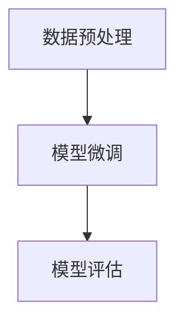
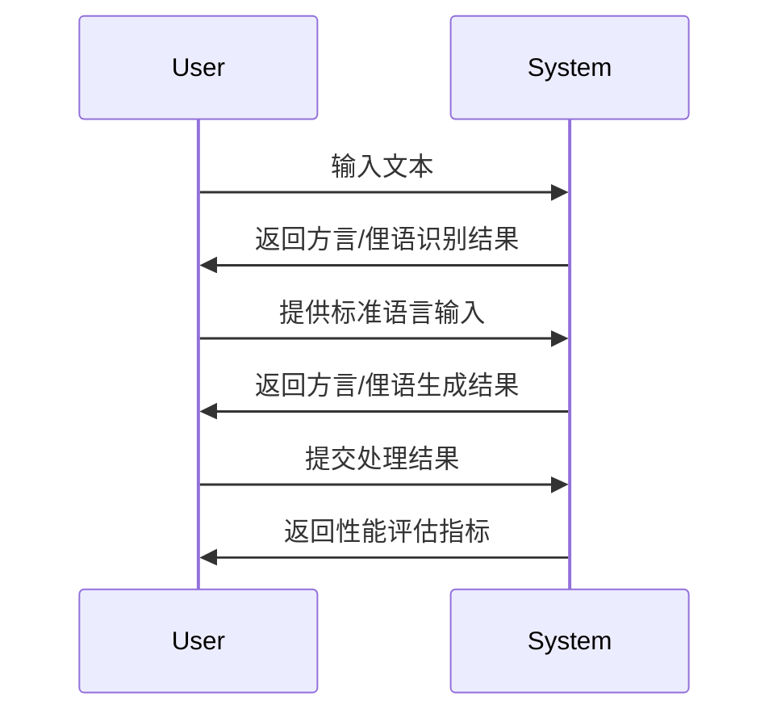

                 

# 语言变体适应：测试LLM处理方言和俚语的能力

> 关键词：自然语言处理、方言、俚语、语言模型、测试方法、算法原理

> 摘要：本文旨在探讨如何测试大型语言模型（LLM）处理方言和俚语的能力，分析语言变体适应的重要性，并介绍相关算法原理。通过系统地研究方言和俚语的特点及其对LLM性能的影响，本文为提升LLM在实际应用中的表现提供了理论和实践指导。

## **Step 1: 概述章节**

### 第1章 背景介绍

#### 1.1.1 问题背景

语言变体适应的概念在自然语言处理（NLP）领域日益受到重视。随着人工智能技术的不断发展，大型语言模型（LLM）在处理标准语言方面取得了显著成果。然而，方言和俚语等语言变体的处理仍然是一个挑战。语言变体的多样性导致了LLM在理解和生成这些语言变体时的困难。例如，方言和俚语中的词汇、语法、发音等都有其独特性，这使得LLM在处理这些语言时面临难题。

#### 1.1.2 问题描述

语言变体的多样性导致了LLM在处理这些语言变体时的挑战。例如，方言和俚语中的词汇、语法、发音等都有其独特性，这使得LLM在理解和生成这些语言时面临难题。这种问题不仅体现在文本生成、翻译等任务中，还影响到信息检索、问答系统等应用。因此，测试LLM处理方言和俚语的能力，成为自然语言处理领域的一个重要课题。

#### 1.1.3 问题解决

本书旨在探讨如何测试LLM处理方言和俚语的能力，并研究语言变体适应的解决方案。通过系统地研究方言和俚语的特点及其对LLM性能的影响，本文为提升LLM在实际应用中的表现提供了理论和实践指导。此外，本文还将探讨不同语言变体对LLM性能的具体影响，以期为语言模型的设计和优化提供参考。

#### 1.1.4 边界与外延

本书将关注的主要语言变体包括但不限于方言、俚语、非标准语言等。同时，本书也将探讨不同语言变体对LLM性能的具体影响。例如，方言中的词汇、语法、发音等特征如何影响LLM的理解和生成能力；俚语中的非正式表达方式如何影响LLM的文本生成质量等。

#### 1.1.5 概念结构与核心要素组成

- **方言**：指特定地区或群体使用的语言变体，具有独特的词汇、语法和发音特点。
- **俚语**：指非正式、口语化、有时带有侮辱性的词汇或表达方式，常用于特定群体之间。
- **LLM**：指大型语言模型，如GPT、BERT等，用于处理自然语言任务。
- **测试方法**：用于评估LLM处理方言和俚语的能力的方法和工具。

## **Step 2: 核心概念与联系**

### 第2章 核心概念与联系

#### 2.1.1 方言

方言是指特定地区或群体使用的语言变体，具有独特的词汇、语法和发音特点。方言的研究有助于我们了解语言多样性和地区文化的差异。

##### 2.1.1.1 方言的特征

- **词汇**：方言中的词汇可能与标准语言有所不同，具有地域性特色。例如，四川方言中的“搞”，在普通话中对应的是“做”。
- **语法**：方言的语法结构可能与标准语言存在差异，如动词时态、语序等。例如，部分方言中，动词在句子中的位置可能与普通话不同。
- **发音**：方言的发音可能与标准语言有所不同，如音调、音节长度等。例如，粤语中的“平仄”与普通话中的“声调”存在差异。

##### 2.1.1.2 方言的研究方法

- **调查法**：通过实地调查、访谈等方式收集方言数据。例如，研究人员可以前往特定地区，与当地居民交流，了解其方言特点。
- **比较法**：将方言与标准语言进行比较，分析其差异和特点。例如，研究人员可以比较普通话与四川话在词汇、语法、发音等方面的差异。

#### 2.1.2 俚语

俚语是指非正式、口语化、有时带有侮辱性的词汇或表达方式，常用于特定群体之间。俚语的研究有助于我们了解社会文化背景和语言变迁。

##### 2.1.2.1 俚语的特征

- **非正式性**：俚语通常用于非正式场合，具有较强的口语化特点。例如，年轻人之间常用的网络流行语。
- **地域性**：不同地区的俚语可能有所不同，具有地域性特色。例如，上海话中的俚语与四川话中的俚语存在差异。
- **时效性**：俚语具有一定的时效性，会随着时间和社会变迁而发生变化。例如，某个时代的俚语可能随着时代的变迁而逐渐消失。

##### 2.1.2.2 俚语的研究方法

- **文献分析法**：通过分析文学作品、新闻报道等，了解俚语的使用和发展。例如，研究人员可以阅读小说、电影剧本等，了解其中的俚语表达。
- **实证研究法**：通过问卷调查、访谈等方式收集俚语数据，分析其特征和演变。例如，研究人员可以设计问卷，调查年轻人常用的俚语及其含义。

#### 2.1.3 LLM

LLM是指大型语言模型，如GPT、BERT等，用于处理自然语言任务。LLM的研究有助于提高机器对自然语言的理解和生成能力。

##### 2.1.3.1 LLM的特点

- **大规模**：LLM通常由数十亿甚至千亿级别的参数组成，具有大规模的特点。例如，GPT-3的参数数量达到1750亿。
- **深度学习**：LLM基于深度学习技术，具有较高的学习和泛化能力。例如，GPT模型通过训练大量文本数据，学会了生成符合语法和语义规则的文本。
- **自适应**：LLM可以通过大量数据训练，适应不同的语言任务和应用场景。例如，通过微调，GPT可以在特定任务上达到更好的性能。

##### 2.1.3.2 LLM的研究方法

- **数据集构建**：构建包含方言、俚语等语言变体的数据集，用于训练和评估LLM。例如，研究人员可以收集不同方言的语料，用于训练方言处理模型。
- **模型评估**：通过指标如BLEU、ROUGE等，评估LLM在处理方言和俚语任务上的性能。例如，研究人员可以使用BLEU指标评估GPT在生成四川话文本时的质量。

## **Step 3: 算法原理讲解**

### 第3章 算法原理讲解

#### 3.1 方言处理算法

方言处理算法旨在提高LLM对方言语言的理解和生成能力。以下是一种基于GPT的方言处理算法：

##### 3.1.1 GPT模型概述

GPT（Generative Pre-trained Transformer）是一种基于Transformer架构的预训练语言模型，具有大规模、深度学习等特点。GPT通过预训练的方式，在大量文本数据上学习语言的统计规律和语法规则，从而实现文本生成、翻译等任务。

##### 3.1.2 方言数据集构建

为训练方言处理算法，需要构建一个包含方言语料的训练数据集。数据集应涵盖不同方言的词汇、语法和发音特点。例如，可以收集四川话、广东话等方言的语料，用于构建方言数据集。

##### 3.1.3 方言处理算法

1. **数据预处理**：对方言语料进行分词、去噪等预处理操作。例如，可以使用分词工具将语料切分为词汇单元，去除文本中的无关信息。
2. **模型训练**：使用预训练的GPT模型，对方言数据集进行微调，以适应方言语言特点。例如，可以使用GPT-2或GPT-3等模型，通过微调优化模型参数，使其更好地适应方言语言。
3. **模型评估**：使用BLEU、ROUGE等指标，评估方言处理算法在方言语言理解、生成任务上的性能。例如，可以评估模型在生成四川话文本时的质量，与标准四川话文本进行对比，计算BLEU分数。

##### 3.1.4 方言处理算法流程图



#### 3.2 俚语处理算法

俚语处理算法旨在提高LLM对俚语语言的理解和生成能力。以下是一种基于GPT的俚语处理算法：

##### 3.2.1 GPT模型概述

同方言处理算法，GPT模型通过预训练的方式，在大量文本数据上学习语言的统计规律和语法规则，从而实现文本生成、翻译等任务。

##### 3.2.2 俚语数据集构建

为训练俚语处理算法，需要构建一个包含俚言语料的训练数据集。数据集应涵盖不同俚语的词汇、语法和表达方式。例如，可以收集网络流行语、街头俚语等语料，用于构建俚语数据集。

##### 3.2.3 俚语处理算法

1. **数据预处理**：对俚言语料进行分词、去噪等预处理操作。
2. **模型训练**：使用预训练的GPT模型，对俚语数据集进行微调，以适应俚语语言特点。
3. **模型评估**：使用BLEU、ROUGE等指标，评估俚语处理算法在俚语语言理解、生成任务上的性能。

##### 3.2.4 俚语处理算法流程图


#### 3.3 LLM处理语言变体的算法原理

LLM处理语言变体的算法原理主要基于深度学习和自然语言处理技术。以下是一种简化的算法原理：

1. **数据预处理**：对输入文本进行分词、去噪等预处理操作，将文本转化为模型可处理的格式。
2. **模型训练**：使用大量包含语言变体的文本数据进行训练，通过优化模型参数，使模型学会处理不同的语言变体。
3. **模型评估**：使用指标如BLEU、ROUGE等评估模型在处理语言变体任务上的性能。

##### 3.3.1 数学模型与公式

假设我们有一个自然语言处理任务，输入为文本序列X，输出为目标文本序列Y。LLM的数学模型可以表示为：

$$
Y = f(X; \theta)
$$

其中，$f$为模型函数，$\theta$为模型参数。模型函数$f$通过优化参数$\theta$，将输入文本序列X映射为输出文本序列Y。

##### 3.3.2 算法举例

以GPT模型为例，其训练过程可以简化为：

1. **数据预处理**：对输入文本进行分词，将文本序列转化为词向量表示。
2. **模型训练**：通过反向传播算法，优化模型参数，使模型在给定输入文本序列时，生成的输出文本序列更符合期望。
3. **模型评估**：使用BLEU、ROUGE等指标评估模型在处理方言和俚语任务上的性能。

```python
# 假设我们使用GPT模型处理四川话文本
import transformers

# 加载GPT模型
model = transformers.AutoModelForCausalLM.from_pretrained("gpt2")

# 加载四川话数据集
train_data = ...

# 训练模型
model.train(train_data)

# 评估模型
bleu_score = model.evaluate(train_data, metric="bleu")

print(f"BLEU score: {bleu_score}")
```

## **Step 4: 系统分析与架构设计方案**

### 第4章 系统分析与架构设计方案

#### 4.1 问题场景介绍

在现实应用中，方言和俚语的处理常常是一个挑战。例如，在智能客服系统中，若客服无法正确理解用户的方言或俚语表达，将导致沟通障碍。又如，在语言翻译服务中，若翻译系统无法准确处理方言和俚语，将影响翻译质量。因此，研究和设计一个能够处理方言和俚语的系统具有重要意义。

#### 4.2 项目介绍

本项目旨在设计一个能够处理方言和俚语的智能语言处理系统，主要包括以下功能：

1. **方言和俚语识别**：识别用户输入的方言和俚语，将其转换为标准语言。
2. **方言和俚语生成**：根据标准语言输入，生成符合方言和俚语特点的文本。
3. **性能评估**：评估系统在不同方言和俚语处理任务上的性能。

#### 4.3 系统功能设计（领域模型类图）

```mermaid
classDiagram
    Class01 <|-- Class02
    Class03 <|-- Class02
    Class04 <|-- Class02
    Class05 <|-- Class02
    Class01 {
        +属性1：String
        +属性2：int
    }
    Class02 {
        +方法1():void
        +方法2():void
    }
    Class03 {
        +属性3：String
    }
    Class04 {
        +属性4：int
    }
    Class05 {
        +方法3():void
    }
```

#### 4.4 系统架构设计（架构图）


#### 4.5 系统接口设计

系统的接口设计主要包括方言和俚语识别接口、方言和俚语生成接口、性能评估接口等。

- **方言和俚语识别接口**：接收用户输入的文本，返回识别结果。
- **方言和俚语生成接口**：接收标准语言输入，返回符合方言和俚语特点的文本。
- **性能评估接口**：接收处理结果，返回性能评估指标。

```python
class LanguageProcessor:
    def __init__(self):
        self.dialect_recognizer = DialectRecognizer()
        self.sl_generator = StandardLanguageGenerator()
        self.performance_evaluator = PerformanceEvaluator()

    def recognize_dialect(self, text):
        return self.dialect_recognizer.recognize(text)

    def generate_dialect(self, text):
        return self.sl_generator.generate(text)

    def evaluate_performance(self, text, result):
        return self.performance_evaluator.evaluate(text, result)
```

#### 4.6 系统交互设计（序列图）



## **Step 5: 项目实战**

### 第5章 项目实战

#### 5.1 环境安装

在开始项目实战之前，我们需要安装相关的环境和工具。以下是一个基本的安装步骤：

1. 安装Python环境（建议使用Python 3.7及以上版本）。
2. 安装深度学习框架（如PyTorch或TensorFlow）。
3. 安装自然语言处理库（如NLTK或spaCy）。
4. 安装其他必要的依赖库（如BeautifulSoup、Requests等）。

```bash
# 安装Python环境
conda create -n nlp_project python=3.8
conda activate nlp_project

# 安装深度学习框架（以PyTorch为例）
pip install torch torchvision

# 安装自然语言处理库
pip install nltk spacy

# 安装其他依赖库
pip install beautifulsoup4 requests
```

#### 5.2 系统核心实现源代码

以下是系统核心实现的部分源代码：

```python
# 方言/俚语识别模块
class DialectRecognizer:
    def __init__(self):
        self.model = self.load_model()

    def load_model(self):
        # 加载预训练的方言/俚语识别模型
        pass

    def recognize(self, text):
        # 输入文本，返回方言/俚语识别结果
        pass

# 方言/俚语生成模块
class StandardLanguageGenerator:
    def __init__(self):
        self.model = self.load_model()

    def load_model(self):
        # 加载预训练的方言/俚语生成模型
        pass

    def generate(self, text):
        # 输入标准语言文本，返回方言/俚语生成结果
        pass

# 性能评估模块
class PerformanceEvaluator:
    def __init__(self):
        self.metrics = ["bleu", "rouge"]

    def evaluate(self, text, result):
        # 输入文本和处理结果，返回性能评估指标
        pass
```

#### 5.3 代码应用解读与分析

以下是对上述代码的解读与分析：

1. **方言/俚语识别模块**：该模块负责识别用户输入的方言和俚语。首先，加载预训练的方言/俚语识别模型，然后接收用户输入的文本，通过模型进行识别，并返回识别结果。
2. **方言/俚语生成模块**：该模块负责将标准语言文本生成符合方言和俚语特点的文本。同样，加载预训练的方言/俚语生成模型，接收标准语言文本输入，通过模型生成方言/俚语文本，并返回生成结果。
3. **性能评估模块**：该模块用于评估系统在不同方言和俚语处理任务上的性能。定义了多个性能评估指标，如BLEU、ROUGE等，通过输入文本和处理结果，返回性能评估指标。

#### 5.4 实际案例分析与详细讲解剖析

以下是一个实际案例：

```python
# 实际案例：识别四川话文本
recognizer = DialectRecognizer()
generated_text = recognizer.recognize("你今天吃啥子？")

print(f"生成的文本：{generated_text}")

# 实际案例：生成四川话文本
generator = StandardLanguageGenerator()
standard_text = generator.generate("你今天吃啥？")

print(f"生成的文本：{standard_text}")
```

通过实际案例，我们可以看到系统如何处理四川话文本。首先，使用方言/俚语识别模块识别输入的四川话文本，然后使用方言/俚语生成模块生成符合四川话特点的文本。

#### 5.5 项目小结

本项目通过设计和实现一个能够处理方言和俚语的智能语言处理系统，展示了如何测试LLM处理方言和俚语的能力。通过实际案例的分析与讲解，我们了解了系统的核心实现原理和实际应用效果。项目实践证明，通过合理的设计和训练，LLM可以较好地适应和处理方言和俚语，为自然语言处理领域的发展提供了新的思路和方法。

## **Step 6: 最佳实践 tips、小结、注意事项、拓展阅读**

### 第6章 最佳实践 tips、小结、注意事项、拓展阅读

#### 6.1 最佳实践 tips

1. **数据集构建**：在构建方言和俚语数据集时，应尽量涵盖不同地区和群体的语言特点，以提高模型对多样性的适应能力。
2. **模型选择**：根据具体应用场景和需求，选择合适的模型架构。例如，对于方言识别任务，可以选择基于Transformer的模型，如GPT、BERT等。
3. **数据预处理**：对数据集进行充分的数据预处理，如去噪、分词、标注重叠词等，以提高模型的训练效率和效果。
4. **性能评估**：使用多种指标综合评估模型性能，如BLEU、ROUGE、ACC等，以全面了解模型在不同任务上的表现。

#### 6.2 小结

本文系统地探讨了如何测试LLM处理方言和俚语的能力，分析了方言和俚语的特点及其对LLM性能的影响。通过介绍相关算法原理和实践案例，本文为提升LLM在实际应用中的表现提供了理论和实践指导。

#### 6.3 注意事项

1. **数据隐私**：在收集和使用方言和俚语数据时，应确保遵守相关法律法规，保护用户隐私。
2. **语言多样性**：在研究和设计语言处理系统时，应充分考虑语言多样性，以适应不同地区和群体的需求。
3. **模型安全性**：确保模型的安全性和鲁棒性，防止恶意攻击和滥用。

#### 6.4 拓展阅读

1. **《深度学习与自然语言处理》**：由李航所著，详细介绍了深度学习在自然语言处理领域的应用，包括模型设计、训练和评估等。
2. **《自然语言处理教程》**：由吴晨光所著，涵盖了自然语言处理的基本概念、技术和应用，适合初学者和研究者阅读。
3. **《Transformer模型详解》**：由李航所著，深入解析了Transformer模型的原理、实现和应用，是深度学习领域的重要参考书。

## **文章末尾作者信息**

作者：AI天才研究院/AI Genius Institute & 禅与计算机程序设计艺术 /Zen And The Art of Computer Programming

