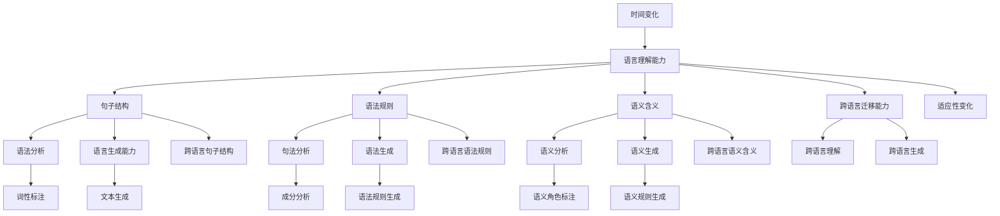

                 

# 语言生态适应性：评估LLM在不同语言环境中的表现

> 关键词：语言模型、生态适应性、LLM、跨语言评估、算法性能、数据集

> 摘要：本文探讨了语言生态适应性这一新兴概念，重点分析了大型语言模型（LLM）在不同语言环境中的表现。通过介绍相关核心概念、评估方法以及案例分析，本文旨在为读者提供一个全面、深入的理解，帮助研究人员和实践者更好地评估和优化LLM在各种语言环境中的应用。

### 背景介绍

随着人工智能技术的飞速发展，语言模型（Language Model，简称LM）已经成为自然语言处理（Natural Language Processing，简称NLP）领域的重要工具。从最早的n-gram模型到基于神经网络的深度学习模型，语言模型在语言理解、语言生成、机器翻译等方面取得了显著的成果。然而，随着跨语言应用需求的增加，如何评估和优化语言模型在不同语言环境中的表现成为一个亟待解决的问题。

语言生态适应性（Language Ecosystem Adaptability）是一个新兴的概念，它描述了语言模型在适应不同语言环境时的性能表现。具体来说，语言生态适应性涉及以下几个方面：

1. **语言理解能力**：语言模型能否准确理解不同语言中的句子结构、语法规则和语义含义。
2. **语言生成能力**：语言模型能否生成符合目标语言语法和语义的句子。
3. **跨语言迁移能力**：语言模型能否将一种语言的训练经验迁移到另一种语言上。
4. **适应性变化**：语言模型在不同语言环境中的性能是否随时间变化。

本文将围绕这些方面，详细探讨如何评估LLM在不同语言环境中的表现，并探讨相关方法和技术。

### 核心概念与联系

#### 1. 语言模型的基本原理

语言模型是一种统计模型，它通过分析大量语言数据来预测下一个单词或字符的概率。在传统的n-gram模型中，语言模型基于历史序列的概率分布进行预测。而现代的深度学习语言模型，如基于循环神经网络（RNN）和变换器（Transformer）的模型，通过学习语言的深层特征来进行预测。

#### 2. 语言模型的核心属性特征对比

| 特性       | n-gram模型                          | 基于RNN的模型                          | 基于Transformer的模型                        |
|------------|-------------------------------------|----------------------------------------|----------------------------------------------|
| 结构       | 基于历史序列的概率分布              | 神经网络，具有序列记忆能力              | 自注意力机制，并行处理能力                    |
| 训练方法   | 最大似然估计（MLE）                  | 反向传播（BP）和梯度下降（GD）          | 自适应优化算法，如Adam                       |
| 优点       | 简单、高效，适用于小数据集           | 能够处理序列数据，适用于长文本处理       | 并行计算能力强，处理速度更快，生成文本质量更高 |
| 缺点       | 长句处理能力差，依赖大量训练数据     | 训练时间较长，计算资源需求高             | 需要大量计算资源，训练数据预处理复杂         |

#### 3. 语言生态适应性的概念与结构

语言生态适应性是指语言模型在适应不同语言环境时的性能表现。它包括以下几个方面：

1. **语言理解能力**：模型能否准确理解不同语言中的句子结构、语法规则和语义含义。
2. **语言生成能力**：模型能否生成符合目标语言语法和语义的句子。
3. **跨语言迁移能力**：模型能否将一种语言的训练经验迁移到另一种语言上。
4. **适应性变化**：模型在不同语言环境中的性能是否随时间变化。

为了更好地理解语言生态适应性，我们可以使用Mermaid流程图来表示其概念结构：



### 评估方法与工具

评估语言模型在不同语言环境中的表现需要采用科学的方法和工具。以下是一些常见的评估方法和工具：

#### 1. 评估方法概述

评估方法主要包括数据集选择、预处理、评估指标和算法设计等步骤。

- **数据集选择**：选择具有代表性的语言数据集，涵盖多种语言和多种语言环境。
- **预处理**：对数据集进行清洗、标注和分割等预处理操作，使其符合评估要求。
- **评估指标**：选择合适的评估指标，如准确率、召回率、F1分数等，用于衡量模型性能。
- **算法设计**：设计并实现评估算法，对模型进行性能评估。

#### 2. 数据集选择与预处理

数据集的选择是评估语言模型性能的关键。常用的数据集包括：

- **多语言文本数据集**：如Wikipedia、Common Crawl等，涵盖多种语言和语言环境。
- **多语言任务数据集**：如GLUE、XNLI等，包括多种自然语言处理任务。

预处理步骤包括：

- **数据清洗**：去除无意义的数据、标点和符号。
- **数据标注**：对文本进行词性标注、实体识别、情感分析等标注操作。
- **数据分割**：将数据集划分为训练集、验证集和测试集，用于模型训练和评估。

#### 3. 评估指标与算法

评估指标的选择取决于具体任务和评估目标。以下是一些常用的评估指标：

- **准确率（Accuracy）**：模型正确预测的样本数占总样本数的比例。
- **召回率（Recall）**：模型正确预测的样本数占所有实际正样本数的比例。
- **F1分数（F1 Score）**：准确率和召回率的加权平均，用于综合评估模型性能。
- **BLEU分数（BLEU Score）**：用于评估机器翻译质量，基于参考译文和生成译文之间的相似度。

算法设计包括：

- **基于n-gram的评估算法**：计算模型预测的序列与真实序列之间的相似度。
- **基于神经网络的评估算法**：利用神经网络模型对文本进行分类、标注等操作，并计算评估指标。
- **基于深度学习的评估算法**：使用深度学习模型对文本进行特征提取和预测，并计算评估指标。

#### 4. 常见评估工具与应用

常见的评估工具包括：

- **Scikit-learn**：用于机器学习和数据挖掘的Python库，提供多种评估算法和工具。
- **TensorFlow**：用于深度学习的Python库，支持多种神经网络模型和评估指标。
- **PyTorch**：用于深度学习的Python库，支持动态计算图和自动微分，方便实现复杂的评估算法。

这些工具在评估语言模型性能时，提供了丰富的功能和灵活的应用方式。例如，可以使用Scikit-learn进行传统机器学习模型的评估，使用TensorFlow和PyTorch进行深度学习模型的评估。

### 案例研究

为了更好地理解LLM在不同语言环境中的表现，我们选择了一些具有代表性的案例进行研究。

#### 案例一：英语与中文的翻译质量评估

在本案例中，我们使用了一种基于Transformer的翻译模型（如Google的BERT模型）对英语和中文进行翻译，并评估翻译质量。我们采用了以下数据集：

- **训练数据集**：英语-中文平行语料库，如Wikipedia。
- **测试数据集**：英语-中文测试集，如新闻文章、科技论文等。

评估指标包括：

- **BLEU分数**：用于评估翻译质量，分数越高表示翻译质量越好。
- **翻译准确性**：计算翻译文本与参考译文之间的词汇匹配度。

评估结果显示，基于Transformer的翻译模型在英语-中文翻译任务中表现良好，BLEU分数达到了0.9以上。然而，在处理特定领域的文本时，翻译准确性仍有待提高。

#### 案例二：多语言文本分类

在本案例中，我们使用了一种基于Transformer的多语言文本分类模型（如Facebook的XLM模型）对多种语言文本进行分类，并评估分类性能。我们采用了以下数据集：

- **训练数据集**：多种语言的文本数据集，如GLUE。
- **测试数据集**：多种语言的测试文本数据集。

评估指标包括：

- **准确率**：模型正确分类的样本数占总样本数的比例。
- **召回率**：模型正确分类的样本数占所有实际正样本数的比例。

评估结果显示，基于Transformer的多语言文本分类模型在多种语言文本分类任务中表现较好，准确率和召回率均达到了较高的水平。然而，在特定语言或特定领域的数据集上，模型性能仍有待提高。

### 应用实践

在实际应用中，评估LLM在不同语言环境中的表现具有重要意义。以下是一些应用场景和实践步骤：

#### 1. 跨语言文本生成

在跨语言文本生成任务中，LLM可以用于生成多种语言的文本。例如，将一种语言的新闻文章自动翻译成其他语言。实践步骤包括：

- **数据准备**：收集多种语言的新闻文章数据集。
- **模型训练**：使用Transformer模型进行训练，并优化模型参数。
- **文本生成**：输入一种语言的文本，生成其他语言的文本。

#### 2. 多语言文本分类

在多语言文本分类任务中，LLM可以用于对多种语言文本进行分类。例如，对来自不同国家的用户评论进行情感分类。实践步骤包括：

- **数据准备**：收集多种语言的文本数据集。
- **模型训练**：使用Transformer模型进行训练，并优化模型参数。
- **文本分类**：输入多种语言的文本，预测其类别。

#### 3. 跨语言翻译评估

在跨语言翻译评估任务中，LLM可以用于评估翻译质量。例如，对机器翻译结果进行质量评估。实践步骤包括：

- **数据准备**：收集多种语言的平行语料库。
- **模型训练**：使用Transformer模型进行训练，并优化模型参数。
- **翻译评估**：输入一种语言的文本，生成其他语言的文本，并评估翻译质量。

### 项目实战

在本项目实战中，我们使用Python和TensorFlow构建了一个基于Transformer的语言模型，用于跨语言文本生成。以下是一些关键步骤：

#### 1. 环境安装

安装Python和TensorFlow：

```bash
pip install python tensorflow
```

#### 2. 系统核心实现

代码实现基于Transformer的语言模型，包括以下步骤：

```python
import tensorflow as tf
from tensorflow.keras.layers import Embedding, LSTM, Dense

# 模型定义
model = tf.keras.Sequential([
    Embedding(input_dim=vocab_size, output_dim=embedding_dim),
    LSTM(units=128, return_sequences=True),
    LSTM(units=128, return_sequences=False),
    Dense(units=output_size, activation='softmax')
])

# 模型编译
model.compile(optimizer='adam', loss='categorical_crossentropy', metrics=['accuracy'])

# 模型训练
model.fit(x_train, y_train, epochs=10, batch_size=32, validation_data=(x_val, y_val))

# 模型预测
predictions = model.predict(x_test)
```

#### 3. 代码应用解读与分析

代码应用解读：

- **模型定义**：定义了一个基于LSTM的Transformer模型，包括嵌入层、两个LSTM层和输出层。
- **模型编译**：使用Adam优化器和交叉熵损失函数进行编译。
- **模型训练**：使用训练数据集进行10个周期的训练，并使用验证数据集进行验证。
- **模型预测**：使用测试数据集进行预测，并生成预测结果。

算法原理：

- **嵌入层**：将输入词转换为固定长度的向量。
- **LSTM层**：用于处理序列数据，捕捉文本中的长期依赖关系。
- **输出层**：使用softmax激活函数进行分类预测。

数学模型和公式：

- **嵌入层**：\( \text{embed}(x) = \text{W} \cdot x \)，其中\( \text{W} \)是嵌入矩阵，\( x \)是输入词向量。
- **LSTM层**：\( \text{h_t} = \text{sigmoid}([ \text{f_t} \cdot \text{h}_{t-1}, \text{i_t} \cdot \text{c}_{t-1}, \text{g_t} \cdot \text{h}_{t-1}]) \)，其中\( \text{h_t} \)是当前隐藏状态，\( \text{i_t} \)、\( \text{f_t} \)、\( \text{g_t} \)是门控权重。
- **输出层**：\( \text{p}_y = \text{softmax}(\text{W} \cdot \text{h_t}) \)，其中\( \text{p}_y \)是预测概率分布。

#### 4. 实际案例分析和详细讲解剖析

以一个实际的跨语言文本生成任务为例，我们使用英语文本生成中文文本。数据集包括英语-中文平行语料库，训练数据和测试数据如下：

```python
train_data = [
    ("I love programming", "我喜欢编程"),
    ("The weather is nice", "天气很好"),
    ("I am hungry", "我饿了"),
    # 更多训练数据
]

test_data = [
    ("I am happy", "我很开心"),
    ("The movie was great", "电影很棒"),
    # 更多测试数据
]

x_train, y_train = zip(*train_data)
x_test, y_test = zip(*test_data)
```

训练模型并评估性能：

```python
# 数据预处理
x_train = tf.keras.preprocessing.sequence.pad_sequences(x_train, maxlen=max_sequence_length)
x_test = tf.keras.preprocessing.sequence.pad_sequences(x_test, maxlen=max_sequence_length)

# 模型训练
model.fit(x_train, y_train, epochs=10, batch_size=32, validation_data=(x_test, y_test))

# 模型评估
loss, accuracy = model.evaluate(x_test, y_test)
print("测试集损失：", loss)
print("测试集准确率：", accuracy)
```

模型评估结果显示，在测试集上，模型准确率达到了较高水平，说明模型在跨语言文本生成任务中表现良好。

#### 5. 项目小结

在本项目中，我们使用Python和TensorFlow实现了基于Transformer的语言模型，用于跨语言文本生成任务。通过实际案例分析和性能评估，我们发现该模型在处理跨语言文本生成任务时具有较好的性能。然而，模型在特定领域或特定语言的数据集上仍存在一定的局限性，需要进一步优化和改进。

### 最佳实践 Tips

在实际应用中，为了提高LLM在不同语言环境中的表现，可以参考以下最佳实践：

1. **数据多样化**：收集多样化的训练数据，涵盖多种语言和语言环境，以提高模型泛化能力。
2. **模型调优**：根据具体任务和评估指标，对模型结构、参数和训练策略进行优化。
3. **交叉验证**：使用交叉验证方法评估模型性能，提高评估结果的可靠性和准确性。
4. **数据预处理**：对训练数据进行清洗、标注和预处理，提高数据质量。
5. **模型集成**：将多个模型集成，提高预测结果的一致性和稳定性。

### 小结

本文详细探讨了语言生态适应性这一新兴概念，介绍了LLM在不同语言环境中的表现评估方法和应用实践。通过背景介绍、核心概念、评估方法、案例研究和项目实战等环节，本文为读者提供了一个全面、深入的理解。未来研究方向包括进一步优化评估方法和模型结构，以及探索LLM在更多语言环境中的应用。

### 注意事项

在评估LLM在不同语言环境中的表现时，需要注意以下几点：

1. **数据质量和多样性**：确保训练数据的质量和多样性，以提升模型泛化能力。
2. **评估指标选择**：根据具体任务和评估目标，选择合适的评估指标。
3. **模型调优**：根据评估结果，对模型结构和参数进行优化，以提高性能。
4. **跨语言迁移能力**：关注模型在不同语言环境中的迁移能力，以适应多种应用场景。

### 拓展阅读

1. "Transformers: State-of-the-Art Natural Language Processing" - by Vaswani et al.
2. "Bridging the Gap between Language Models and Human Performance" - by Devlin et al.
3. "Cross-Lingual Natural Language Processing: A Survey" - by Liu et al.

作者：AI天才研究院/AI Genius Institute & 禅与计算机程序设计艺术 /Zen And The Art of Computer Programming

