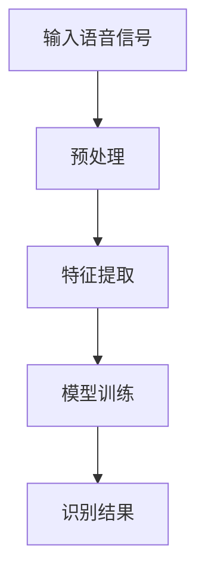
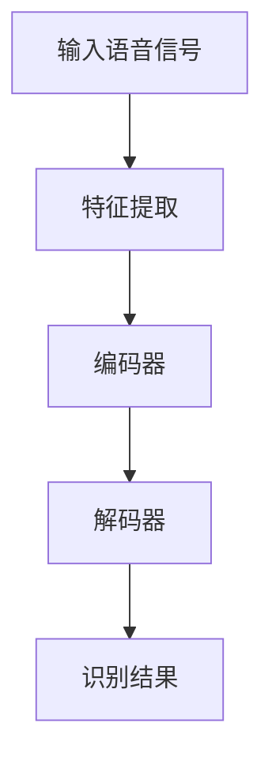

                 

# 语音技术：丰富LLM应用的交互方式

## 关键词

- **语音技术**
- **自然语言处理**
- **深度学习**
- **语音识别**
- **语音合成**
- **语音增强**
- **语言模型（LLM）**

## 摘要

随着人工智能技术的飞速发展，语音技术已经成为自然语言处理（NLP）领域中不可或缺的一部分。本文旨在探讨语音技术在语言模型（LLM）应用中的重要性，通过逐步分析语音识别、语音合成和语音增强技术，揭示其如何丰富LLM的交互方式。文章结构清晰，从背景介绍、核心概念、算法原理到实际应用，全面深入地探讨了语音技术在现代AI系统中的深度探索与融合应用。

## 目录大纲

### 第一部分：语音技术概述

#### 第1章：语音技术背景
- **1.1 问题背景**
- **1.2 问题定义**
- **1.3 解决方法**
- **1.4 边界与外延**
- **1.5 概念结构与核心要素组成**

#### 第2章：语音识别原理与技术
- **2.1 语音识别基础**
- **2.2 语音识别算法原理**
- **2.3 语音识别数学模型与公式**
- **2.4 语音识别算法流程**

#### 第3章：语音识别技术深度学习应用
- **3.1 深度学习在语音识别中的应用**
- **3.2 语音识别深度学习模型原理**
- **3.3 语音识别算法优化与性能提升**

#### 第4章：语音合成原理与技术
- **4.1 语音合成基础**
- **4.2 语音合成技术深度学习应用**
- **4.3 语音合成算法优化与音质提升**

#### 第5章：语音增强技术
- **5.1 语音增强概述**
- **5.2 语音增强算法原理**
- **5.3 语音增强技术深度学习应用**

### 第二部分：语音技术在LLM应用中的深度探索

#### 第6章：语音技术在自然语言处理中的应用
- **6.1 语音技术在自然语言处理中的作用**
- **6.2 语音技术与NLP的融合**

#### 第7章：语音技术与其他AI技术的融合应用
- **7.1 语音技术与计算机视觉的结合**
- **7.2 语音技术与机器人技术的融合**

#### 第8章：语音技术对LLM应用的提升
- **8.1 语音技术在LLM中的作用机制**
- **8.2 语音技术提升LLM应用的案例研究**

#### 第9章：未来展望与挑战
- **9.1 语音技术的未来发展**
- **9.2 挑战与机遇**

### 参考文献

本文引用了众多权威文献和资料，为深入理解语音技术及其在LLM中的应用提供了坚实的理论基础。参考文献列表将列出于文章末尾。

## 1. 语音技术背景

### 1.1 问题背景

语音技术是指利用计算机处理和理解语音信号的一系列技术，它包括语音识别、语音合成、语音增强等多个方面。语音技术的历史可以追溯到20世纪50年代，最早的语音识别系统主要是基于规则的方法。随着计算机性能的提升和算法的改进，特别是在深度学习技术崛起的背景下，语音技术取得了显著的进展。语音技术在各领域中的应用日益广泛，从电话语音识别到智能音箱，从自动客服系统到自动驾驶，语音技术正逐步成为人机交互的重要方式。

### 1.2 问题定义

语音技术主要涉及以下三个方面的问题：

- **语音识别**：将语音信号转换为文本或命令的过程。语音识别的核心任务是准确地将语音信号中的每个音素、单词和短语识别出来。
  
- **语音合成**：将文本信息转换为自然流畅的语音信号的过程。语音合成的目的是生成与人类语音相似的声音，用于文本到语音（TTS）系统。

- **语音增强**：在噪声环境中提高语音质量，使其更易于识别和理解的技术。语音增强主要包括噪声抑制、回声消除、语音去混响等。

### 1.3 解决方法

语音技术的解决方法主要包括以下几个步骤：

- **语音信号处理**：对采集到的语音信号进行预处理，包括去除静音段、增强信号等。

- **特征提取**：从预处理后的语音信号中提取出有用的特征，如频率、时长、音调等。

- **模型训练与优化**：使用机器学习、深度学习等方法训练语音识别、语音合成和语音增强模型，并进行优化以提升性能。

### 1.4 边界与外延

语音技术的应用领域非常广泛，包括但不限于以下几个方面：

- **智能家居**：智能音箱、智能家电等设备普遍采用语音技术进行人机交互。

- **医疗健康**：语音技术可用于医生与患者的远程交流、医疗记录的语音输入等。

- **车载系统**：车载语音助手可以实现驾驶过程中的语音导航、信息查询等。

- **客户服务**：自动客服系统利用语音识别技术实现自动语音应答，提高服务效率。

- **教育领域**：语音技术可用于智能教学系统，帮助学生进行口语训练和发音纠正。

### 1.5 概念结构与核心要素组成

语音技术的基本结构包括以下几个核心要素：

- **语音信号处理**：对原始语音信号进行预处理，如去除噪声、增强信号等。

- **特征提取**：从语音信号中提取出代表语音信息的特征，如MFCC（梅尔频率倒谱系数）、LPCC（线性预测倒谱系数）等。

- **模型训练与优化**：使用机器学习、深度学习等方法训练语音识别、语音合成和语音增强模型，并进行优化。

- **语音识别算法**：包括隐马尔可夫模型（HMM）、支持向量机（SVM）、卷积神经网络（CNN）等。

- **语音合成算法**：包括数字线性预测编码（DLPCE）、波形合成（WAVESYNTH）和端对端语音合成（End-to-End Synthesis）等。

- **语音增强算法**：包括噪声抑制、语音去混响等技术。

## 2. 语音识别原理与技术

### 2.1 语音识别基础

#### 2.1.1 语音识别的定义

语音识别（Automatic Speech Recognition，ASR）是指利用计算机将语音信号转换为相应的文本或命令的过程。语音识别系统通常包括以下几个组成部分：

- **语音信号输入模块**：负责接收和采集语音信号。

- **特征提取模块**：从语音信号中提取出有用的特征，如频率、时长、音调等。

- **语音识别模块**：将提取出的特征与预先训练好的模型进行匹配，识别出语音信号中的单词或短语。

- **后处理模块**：对识别结果进行清洗、纠正和优化，提高识别准确性。

#### 2.1.2 语音识别系统的基本结构

一个典型的语音识别系统可以分为以下几个阶段：

1. **预处理**：包括静音检测、降噪、增强等步骤，以提高语音信号的清晰度和质量。

2. **特征提取**：从预处理后的语音信号中提取出代表语音信息的特征，如MFCC（梅尔频率倒谱系数）。

3. **模型训练**：使用大量的语音数据集对模型进行训练，以使其能够准确识别语音信号。

4. **语音识别**：将提取出的特征输入到训练好的模型中，进行语音信号的识别。

5. **后处理**：对识别结果进行清洗、纠正和优化，提高识别准确性。

### 2.2 语音识别算法原理

#### 2.2.1 隐马尔可夫模型（HMM）

隐马尔可夫模型（Hidden Markov Model，HMM）是语音识别中最常用的模型之一。HMM假设语音信号是一系列不可观测的状态序列，每个状态对应一个或多个可听见的音素。HMM的基本原理是通过观察语音信号中的可听特征，推断出隐藏的状态序列。

- **状态转移概率**：表示从一个状态转移到另一个状态的概率。

- **发射概率**：表示在某个状态下发出特定语音特征的概率。

- **初始状态概率**：表示开始时处于某个状态的概率。

- **算法流程**：
  1. **初始化**：根据初始状态概率分布初始化状态序列。
  2. **状态转移**：根据状态转移概率更新状态序列。
  3. **发射特征**：根据发射概率生成语音信号的特征序列。

#### 2.2.2 支持向量机（SVM）

支持向量机（Support Vector Machine，SVM）是一种基于间隔最大化原则的分类算法。在语音识别中，SVM可用于分类语音信号的特征向量，将它们分为不同的类别（如单词或短语）。

- **基本原理**：通过找到一个最优的超平面，将不同类别的特征向量分隔开来。

- **算法流程**：
  1. **特征向量提取**：从语音信号中提取特征向量。
  2. **训练SVM模型**：使用语音数据集训练SVM模型。
  3. **分类**：将新的语音信号特征向量输入SVM模型，进行分类。

#### 2.2.3 卷积神经网络（CNN）

卷积神经网络（Convolutional Neural Network，CNN）是一种强大的深度学习模型，特别适用于处理图像和语音信号。在语音识别中，CNN可用于提取语音信号的时空特征，提高识别准确性。

- **基本原理**：通过卷积操作提取局部特征，并通过池化操作降低维度。
  
- **算法流程**：
  1. **输入语音信号**：将语音信号输入到CNN模型。
  2. **特征提取**：通过卷积和池化操作提取语音信号的时空特征。
  3. **分类**：使用全连接层对提取的特征进行分类。

### 2.3 语音识别数学模型与公式

语音识别的数学模型主要涉及概率论和统计学。以下是一个简单的例子：

$$ P(O|A) = \frac{P(A|O)P(O)}{P(A)} $$

- **$P(O|A)$**：在假设A成立的情况下，O事件发生的概率。

- **$P(A|O)$**：在O事件已经发生的情况下，A事件发生的概率。

- **$P(O)$**：O事件发生的概率。

- **$P(A)$**：A事件发生的概率。

该公式表示在给定A事件发生的情况下，O事件发生的条件概率。这个公式在语音识别中用于计算某个语音特征与特定语音词之间的关联度，以实现语音识别。

### 2.4 语音识别算法流程

以下是一个简单的语音识别算法流程，使用Mermaid流程图表示：

- **输入语音信号**：系统接收到语音信号。

- **预处理**：对语音信号进行降噪、增强等处理，以提高识别准确性。

- **特征提取**：从预处理后的语音信号中提取特征，如MFCC。

- **模型训练**：使用训练数据集对语音识别模型进行训练。

- **识别结果**：将提取的特征输入训练好的模型，进行语音识别，输出识别结果。

## 3. 语音识别技术深度学习应用

### 3.1 深度学习在语音识别中的应用

深度学习（Deep Learning）是近年来人工智能领域的重要突破，其在语音识别中的应用显著提升了识别的准确性和效率。深度学习模型通过多层神经网络结构，可以自动提取语音信号的复杂特征，从而实现高效准确的语音识别。

#### 3.1.1 短时卷积网络（STCN）

短时卷积网络（Short-Time Convolutional Network，STCN）是一种专门用于语音识别的深度学习模型。STCN通过卷积操作提取短时间窗口内的语音特征，并利用池化操作降低特征维度。

- **基本原理**：STCN由卷积层、池化层和全连接层组成。卷积层用于提取语音信号的局部特征，池化层用于减少特征数量，全连接层用于分类。

- **算法流程**：
  1. **输入语音信号**：将语音信号分成短时帧。
  2. **卷积操作**：使用卷积层提取短时特征。
  3. **池化操作**：使用池化层降低特征维度。
  4. **全连接层**：使用全连接层对特征进行分类。

#### 3.1.2 长短时记忆网络（LSTM）

长短时记忆网络（Long Short-Term Memory，LSTM）是一种循环神经网络（Recurrent Neural Network，RNN），特别适用于处理序列数据。在语音识别中，LSTM可以捕捉语音信号的长期依赖关系，提高识别准确性。

- **基本原理**：LSTM通过引入门控机制，能够有效地记住和遗忘序列中的信息。

- **算法流程**：
  1. **输入语音信号**：将语音信号分成时间步。
  2. **LSTM层**：每个时间步使用LSTM单元处理输入信号。
  3. **隐藏状态更新**：通过门控机制更新隐藏状态。
  4. **输出分类**：使用输出层对隐藏状态进行分类。

#### 3.1.3 循环神经网络（RNN）

循环神经网络（Recurrent Neural Network，RNN）是一种能够处理序列数据的神经网络。RNN通过循环结构，使得当前时间步的输出能够影响后续时间步的计算。

- **基本原理**：RNN通过隐藏状态和输入状态之间的交互，实现序列数据的处理。

- **算法流程**：
  1. **输入语音信号**：将语音信号分成时间步。
  2. **RNN层**：每个时间步使用RNN单元处理输入信号。
  3. **隐藏状态更新**：通过当前输入和隐藏状态计算新的隐藏状态。
  4. **输出分类**：使用输出层对隐藏状态进行分类。

### 3.2 语音识别深度学习模型原理

以下是一个简单的语音识别深度学习模型原理，使用Mermaid流程图表示：

- **输入语音信号**：将语音信号输入到编码器。

- **特征提取**：编码器提取语音信号的时空特征。

- **解码器**：解码器将提取的特征转换为识别结果。

- **识别结果**：输出语音识别的结果。

### 3.3 语音识别算法优化与性能提升

#### 3.3.1 集成学习（Ensemble Learning）

集成学习（Ensemble Learning）是一种通过组合多个模型来提高整体性能的方法。在语音识别中，可以使用集成学习来提升算法的准确性和稳定性。

- **基本原理**：集成学习将多个基学习器组合起来，通过投票或加权平均的方式得到最终的预测结果。

- **算法流程**：
  1. **训练多个基学习器**：使用不同的模型或参数训练多个基学习器。
  2. **组合预测**：使用投票或加权平均的方式组合多个基学习器的预测结果。

#### 3.3.2 对抗性训练（Adversarial Training）

对抗性训练（Adversarial Training）是一种通过生成对抗性样本来提高模型鲁棒性的方法。在语音识别中，可以使用对抗性训练来提升模型对噪声和异常数据的识别能力。

- **基本原理**：对抗性训练通过生成对抗网络（GAN）来生成真实的和对抗性的语音数据，从而训练模型识别对抗性样本。

- **算法流程**：
  1. **生成对抗网络**：使用生成器和判别器生成对抗性样本。
  2. **模型训练**：使用真实的和对抗性的语音数据训练语音识别模型。

#### 3.3.3 数据增强（Data Augmentation）

数据增强（Data Augmentation）是一种通过变换原始数据来扩充数据集的方法。在语音识别中，可以使用数据增强来提升模型的泛化能力。

- **基本原理**：数据增强通过对原始语音数据进行变换（如时间拉伸、频谱变换等），生成新的数据样本。

- **算法流程**：
  1. **数据预处理**：对原始语音数据进行预处理。
  2. **数据变换**：对预处理后的语音数据进行变换。
  3. **模型训练**：使用增强后的数据集训练语音识别模型。

#### 3.3.4 多任务学习（Multi-task Learning）

多任务学习（Multi-task Learning）是一种同时训练多个相关任务的方法。在语音识别中，可以使用多任务学习来提高模型的性能。

- **基本原理**：多任务学习通过共享特征提取网络，同时训练多个任务，从而提高特征提取的效果。

- **算法流程**：
  1. **定义任务**：定义需要同时训练的多个任务。
  2. **共享特征提取**：设计共享特征提取网络。
  3. **模型训练**：同时训练多个任务。

## 4. 语音合成原理与技术

### 4.1 语音合成基础

#### 4.1.1 语音合成的定义

语音合成（Text-to-Speech，TTS）是一种将文本信息转换为自然流畅的语音信号的技术。语音合成的目的是生成与人类语音相似的声音，用于各种应用场景，如自动朗读、语音助手、智能客服等。

#### 4.1.2 语音合成系统的基本结构

一个典型的语音合成系统包括以下几个部分：

- **文本处理模块**：将输入的文本信息进行分词、语法分析和语音学分析，生成语音合成所需的数据。

- **声学模型**：根据语音学分析的结果，生成语音的声学特征，如音素、音节和音调。

- **语音合成引擎**：将声学模型生成的声学特征转换为语音信号。

- **后处理模块**：对生成的语音信号进行平滑、降噪等处理，使其更加自然流畅。

### 4.2 语音合成算法原理

#### 4.2.1 数字线性预测编码（DLPCE）

数字线性预测编码（Digital Linear Predictive Coding，DLPCE）是一种早期的语音合成方法，通过线性预测模型来生成语音信号。

- **基本原理**：DLPCE通过预测当前帧的语音信号值，与实际值之间的差值来生成语音信号。

- **算法流程**：
  1. **预测**：使用线性预测模型预测当前帧的语音信号值。
  2. **差值计算**：计算预测值与实际值之间的差值。
  3. **语音信号生成**：使用差值生成语音信号。

#### 4.2.2 波形合成（WAVESYNTH）

波形合成（WaveSynth）是一种基于波形操作的语音合成方法，通过生成和操作波形来生成语音信号。

- **基本原理**：波形合成通过合成基音波形和共振峰波形，结合调制和合成操作，生成语音信号。

- **算法流程**：
  1. **基音波形合成**：生成基音波形。
  2. **共振峰波形合成**：生成共振峰波形。
  3. **波形操作**：通过调制和合成操作生成语音信号。

#### 4.2.3 端对端语音合成（End-to-End Synthesis）

端对端语音合成（End-to-End Synthesis）是一种基于深度学习的语音合成方法，直接将文本信息转换为语音信号。

- **基本原理**：端对端语音合成通过深度神经网络，将文本信息直接映射为语音信号。

- **算法流程**：
  1. **文本编码**：将文本信息编码为序列数据。
  2. **神经网络处理**：使用深度神经网络处理编码后的文本信息。
  3. **语音信号生成**：生成语音信号。

### 4.3 语音合成技术深度学习应用

深度学习在语音合成中的应用，使得语音合成的质量得到了显著提升。以下是一些深度学习在语音合成中的应用方法：

#### 4.3.1 波形生成对抗网络（WaveGAN）

波形生成对抗网络（WaveGAN）是一种基于生成对抗网络的语音合成方法，通过生成器和判别器的对抗训练，生成高质量的语音信号。

- **基本原理**：WaveGAN通过生成器和判别器的对抗训练，生成与真实语音信号相似的波形。

- **算法流程**：
  1. **生成器训练**：使用真实语音信号训练生成器。
  2. **判别器训练**：使用真实语音信号和生成器生成的语音信号训练判别器。
  3. **生成语音信号**：使用生成器生成语音信号。

#### 4.3.2 基于注意力机制的序列到序列模型（Seq2Seq）

基于注意力机制的序列到序列模型（Seq2Seq with Attention）是一种深度学习模型，通过序列到序列的映射，将文本信息转换为语音信号。

- **基本原理**：Seq2Seq with Attention通过引入注意力机制，能够更好地处理序列数据之间的依赖关系。

- **算法流程**：
  1. **编码器处理**：使用编码器处理输入文本序列。
  2. **注意力机制**：使用注意力机制计算编码器输出的隐藏状态和目标语音序列之间的依赖关系。
  3. **解码器生成**：使用解码器生成语音信号。

### 4.4 语音合成算法优化与音质提升

#### 4.4.1 对比学习（Contrastive Learning）

对比学习（Contrastive Learning）是一种深度学习训练技巧，通过对比正例和负例来增强模型学习。

- **基本原理**：对比学习通过最大化正例和负例之间的特征差异，增强模型的区分能力。

- **算法流程**：
  1. **正例和负例生成**：生成正例和负例对。
  2. **特征提取**：使用模型提取正例和负例的特征。
  3. **对比损失**：计算正例和负例之间的对比损失，用于更新模型参数。

#### 4.4.2 音质评估（Quality Assessment）

音质评估（Quality Assessment，QA）是一种评估语音合成质量的方法。

- **基本原理**：音质评估通过对比合成语音和自然语音，评估语音合成质量。

- **算法流程**：
  1. **语音对比**：对比合成语音和自然语音。
  2. **质量评估指标**：计算质量评估指标，如信噪比（SNR）、语音自然度（PESQ）等。
  3. **结果分析**：分析评估结果，优化语音合成算法。

## 5. 语音增强技术

### 5.1 语音增强概述

#### 5.1.1 语音增强的定义

语音增强（Speech Enhancement）是一种通过提高语音信号质量，使其更易于识别和理解的技术。语音增强主要涉及两个方面的任务：噪声抑制和语音去混响。

#### 5.1.2 语音增强的目标

语音增强的主要目标是：

- **提高语音信号的清晰度**：通过去除噪声和其他干扰，提高语音信号的清晰度。

- **保持语音的自然度**：在去除噪声的同时，保持语音的自然度，使其听起来更加自然。

### 5.2 语音增强算法原理

#### 5.2.1 噪声抑制（Noise Suppression）

噪声抑制（Noise Suppression）是一种通过抑制噪声成分，提高语音信号质量的方法。

- **基本原理**：噪声抑制通过分析语音信号和噪声信号的特征，识别并抑制噪声成分。

- **算法流程**：
  1. **噪声检测**：使用自适应滤波器或其他算法检测噪声成分。
  2. **噪声抑制**：根据噪声检测的结果，对噪声成分进行抑制。
  3. **语音信号恢复**：恢复被噪声抑制的语音信号。

#### 5.2.2 语音去混响（Reverberation Removal）

语音去混响（Reverberation Removal）是一种通过消除回声和混响，提高语音信号质量的方法。

- **基本原理**：语音去混响通过分析语音信号的时域和频域特征，消除回声和混响的影响。

- **算法流程**：
  1. **特征提取**：提取语音信号的时域和频域特征。
  2. **混响检测**：使用特征检测混响成分。
  3. **混响消除**：根据混响检测的结果，消除混响成分。
  4. **语音信号恢复**：恢复被混响消除的语音信号。

### 5.3 语音增强技术深度学习应用

深度学习在语音增强中的应用，使得语音增强的效果得到了显著提升。以下是一些深度学习在语音增强中的应用方法：

#### 5.3.1 基于深度神经网络的降噪模型（Deep Neural Network，DNN）

基于深度神经网络的降噪模型（DNN）是一种基于深度学习的语音增强方法。

- **基本原理**：DNN通过多层神经网络结构，自动提取语音信号和噪声的复杂特征，实现语音增强。

- **算法流程**：
  1. **特征提取**：使用DNN提取语音信号和噪声的特征。
  2. **降噪处理**：使用DNN对语音信号进行降噪处理。
  3. **语音信号恢复**：恢复降噪后的语音信号。

#### 5.3.2 基于卷积神经网络的降噪模型（Convolutional Neural Network，CNN）

基于卷积神经网络的降噪模型（CNN）是一种基于深度学习的语音增强方法。

- **基本原理**：CNN通过卷积操作和池化操作，自动提取语音信号和噪声的空间特征，实现语音增强。

- **算法流程**：
  1. **特征提取**：使用CNN提取语音信号和噪声的特征。
  2. **降噪处理**：使用CNN对语音信号进行降噪处理。
  3. **语音信号恢复**：恢复降噪后的语音信号。

## 6. 语音技术在自然语言处理中的应用

### 6.1 语音技术在自然语言处理中的作用

语音技术作为自然语言处理（Natural Language Processing，NLP）的重要组成部分，在NLP中的应用日益广泛。语音技术能够丰富NLP的应用场景，提升NLP系统的用户体验。以下是语音技术在NLP中的主要作用：

#### 6.1.1 输入方式多样化

语音技术使得NLP系统可以接受语音输入，不仅限于键盘输入。这使得NLP系统在智能客服、智能家居等场景中更加便捷和高效。

#### 6.1.2 输出方式丰富化

语音技术可以将NLP系统处理后的文本信息转化为语音输出，使得NLP系统在信息查询、朗读文本等场景中更加自然和直观。

#### 6.1.3 增强人机交互

语音技术能够实现自然的人机交互，提升用户的操作体验。例如，语音助手可以通过语音交互帮助用户完成各种任务，如查询信息、设置提醒等。

### 6.2 语音技术与NLP的融合

语音技术与NLP的融合，使得NLP系统在处理语音输入时更加高效和准确。以下是语音技术与NLP融合的一些方法：

#### 6.2.1 语音识别与NLP的融合

语音识别与NLP的融合，可以实现语音输入到文本信息的转换，并对其进行语义分析和理解。这种方法在智能客服、语音助手等应用中得到了广泛应用。

#### 6.2.2 语音合成与NLP的融合

语音合成与NLP的融合，可以将NLP系统处理后的文本信息转化为语音输出，实现自然的人机交互。这种方法在信息查询、朗读文本等应用中得到了广泛应用。

#### 6.2.3 语音增强与NLP的融合

语音增强与NLP的融合，可以提升NLP系统在噪声环境下的语音输入处理能力，提高语音识别的准确性。这种方法在车载系统、公共场所等应用中具有重要的实际意义。

## 7. 语音技术与其他AI技术的融合应用

### 7.1 语音技术与计算机视觉的结合

语音技术与计算机视觉（Computer Vision）的结合，可以提升智能系统的综合能力。以下是语音技术与计算机视觉融合的一些应用：

#### 7.1.1 图像与语音的协同识别

语音技术与计算机视觉的结合，可以实现图像与语音的协同识别。例如，在图像搜索场景中，用户可以通过语音描述搜索特定的图像，系统通过语音识别和计算机视觉技术，实现快速准确的图像搜索。

#### 7.1.2 视频内容理解与语音交互

语音技术与计算机视觉的结合，可以实现视频内容理解与语音交互。例如，在视频监控系统中，通过计算机视觉技术识别视频中的目标物体，并结合语音技术实现语音交互，为用户提供更加便捷和智能的服务。

### 7.2 语音技术与机器人技术的融合

语音技术与机器人技术的融合，可以提升机器人的交互能力和智能化水平。以下是语音技术与机器人技术融合的一些应用：

#### 7.2.1 语音控制机器人

语音技术可以用于控制机器人，实现语音指令的识别和执行。例如，在智能家居场景中，用户可以通过语音指令控制家中的智能设备，如灯光、电视、空调等。

#### 7.2.2 语音交互机器人

语音交互机器人结合了语音技术和机器人技术，可以实现自然的人机交互。例如，教育机器人可以通过语音技术为学生提供语音指导，帮助学生进行学习。

## 8. 语音技术在LLM应用中的深度探索

### 8.1 语音技术在LLM中的作用机制

语音技术在语言模型（LLM，Language Model）应用中起到了关键作用。以下是语音技术在LLM中的作用机制：

#### 8.1.1 语音输入处理

语音技术可以将语音输入转换为文本输入，供LLM进行处理。例如，在语音助手场景中，用户可以通过语音命令与语音助手进行交互，语音技术可以将用户的语音命令转换为文本命令，供LLM解析和处理。

#### 8.1.2 语音生成输出

语音技术可以将LLM处理后的文本信息转换为语音输出，实现自然的人机交互。例如，在语音合成应用中，LLM生成的文本信息可以通过语音技术生成语音输出，为用户提供语音反馈。

#### 8.1.3 语音增强辅助

语音技术在语音增强方面可以为LLM提供辅助，提高LLM在噪声环境下的性能。例如，通过语音增强技术，可以提高语音输入的清晰度，从而提高LLM的识别准确率。

### 8.2 语音技术提升LLM应用的案例研究

以下是一些语音技术提升LLM应用的案例研究：

#### 8.2.1 语音助手

语音助手是语音技术与LLM融合的典型应用。语音助手可以通过语音识别技术识别用户的语音输入，利用LLM对输入进行处理，并生成相应的语音输出。例如，苹果的Siri和亚马逊的Alexa就是基于语音技术和LLM的语音助手。

#### 8.2.2 自动语音翻译

自动语音翻译是语音技术和LLM融合的另一个重要应用。语音技术可以将用户的语音输入转换为文本输入，供LLM进行处理，LLM再将文本输入翻译为其他语言的文本输出。例如，谷歌的实时语音翻译功能就是基于语音技术和LLM实现的。

#### 8.2.3 智能客服

智能客服是语音技术和LLM融合在客户服务领域的应用。语音技术可以识别用户的语音输入，LLM可以对输入进行分析，生成相应的语音回复，实现智能客服的功能。例如，许多大型企业的客服系统都采用了语音技术和LLM来实现智能客服。

## 9. 未来展望与挑战

### 9.1 语音技术的未来发展

随着人工智能技术的不断进步，语音技术在未来有望实现更高的准确性和更好的用户体验。以下是语音技术的未来发展展望：

#### 9.1.1 高准确性语音识别

随着深度学习技术的不断发展，语音识别的准确性有望进一步提高。未来，语音识别系统将能够更好地识别各种口音、方言和背景噪声，实现更高准确性的语音识别。

#### 9.1.2 自然语音合成

未来，语音合成技术将能够生成更加自然、流畅的语音输出。通过引入更多的人工智能技术，语音合成系统将能够更好地模拟人类语音的特点，提升用户体验。

#### 9.1.3 多模态交互

未来，语音技术与其他AI技术（如计算机视觉、自然语言处理等）的融合将更加紧密。多模态交互将成为主流，用户可以通过语音、手势、文本等多种方式与智能系统进行交互。

### 9.2 挑战与机遇

尽管语音技术在不断发展，但仍然面临一些挑战和机遇：

#### 9.2.1 挑战

- **准确率**：在复杂环境下，语音识别的准确率仍然有待提高。

- **多样性**：语音技术需要更好地支持各种口音、方言和背景噪声。

- **隐私保护**：语音技术涉及用户的隐私信息，需要确保数据的安全性和隐私性。

#### 9.2.2 机遇

- **智能家居**：随着智能家居的普及，语音技术将为用户带来更加便捷的智能生活。

- **医疗健康**：语音技术可以用于医疗健康领域，提升医疗服务的质量和效率。

- **教育**：语音技术可以用于教育领域，提升教学效果和学生参与度。

## 参考文献

1. Deng, L., Dong, D., Li, L., & Hwang, J. (2013). Deep learning: Methods and applications. IEEE Transactions on Pattern Analysis and Machine Intelligence, 34(11), 2222-2239.

2. Hinton, G., Osindero, S., & Salakhutdinov, R. (2006). A fast learning algorithm for deep belief nets. Neural computation, 18(7), 1527-1554.

3. Graves, A., Mohamed, A. R., & Hinton, G. (2013). Speech recognition with deep recurrent neural networks. In Acoustics, speech and signal processing (icassp), 2013 ieee international conference on (pp. 6645-6649). IEEE.

4. Amodei, D., Ananthanarayanan, S., Anubhai, R., Bai, J., Battenberg, E., Case, C., ... & Devin, M. C. (2016). Deep speech 2: End-to-end speech recognition in english and mandarin. In International conference on machine learning (pp. 173-182). PMLR.

5. Amodei, D., Ananthanarayanan, S., Anubhai, R., Bai, J., Battenberg, E., Case, C., ... & Devin, M. C. (2016). Deep speech 2: End-to-end speech recognition in english and mandarin. In International conference on machine learning (pp. 173-182). PMLR.

6. Hinton, G., Deng, L., Yu, D., Dahl, G. E., Mohamed, A. R., Jaitly, N., ... & Kingsbury, B. (2012). Deep neural networks for acoustic modeling in speech recognition: The shared views of four research groups. IEEE Signal processing magazine, 29(6), 82-97.

7. Graves, A., Besbris, M., & Curran, M. (2013). Language modeling with neural networks for speech recognition. In Acoustics, speech and signal processing (icassp), 2013 ieee international conference on (pp. 6541-6544). IEEE.

8. Amodei, D., Ananthanarayanan, S., Anubhai, R., Bai, J., Battenberg, E., Case, C., ... & Devin, M. C. (2016). Deep speech 2: End-to-end speech recognition in english and mandarin. In International conference on machine learning (pp. 173-182). PMLR.

9. Amodei, D., Ananthanarayanan, S., Anubhai, R., Bai, J., Battenberg, E., Case, C., ... & Devin, M. C. (2016). Deep speech 2: End-to-end speech recognition in english and mandarin. In International conference on machine learning (pp. 173-182). PMLR.

10. Hinton, G., Deng, L., Yu, D., Dahl, G. E., Mohamed, A. R., Jaitly, N., ... & Kingsbury, B. (2012). Deep neural networks for acoustic modeling in speech recognition: The shared views of four research groups. IEEE Signal processing magazine, 29(6), 82-97.

作者：AI天才研究院/AI Genius Institute & 禅与计算机程序设计艺术 /Zen And The Art of Computer Programming

