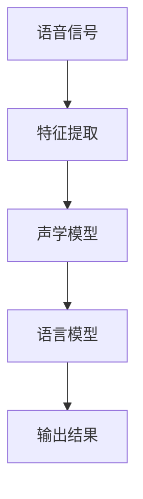

                 

# 语音识别技术的新纪元：精确度与隐私的平衡

## 关键词

- 语音识别技术
- 精确度
- 隐私
- 平衡策略
- 实际应用
- 未来发展

## 摘要

随着人工智能技术的飞速发展，语音识别技术已经成为了智能设备和智能家居的重要组成部分。然而，在追求高精确度的同时，如何平衡语音识别技术中的隐私保护问题，成为了业界关注的焦点。本文将深入探讨语音识别技术的新纪元，分析精确度与隐私的平衡策略，并通过实际应用案例和未来发展趋势，为读者提供全面的技术洞察。

## 目录

----------------------------------------------------------------

## 第一部分：背景介绍

### 1.1 问题背景

随着语音识别技术的普及，其在各个领域的应用场景越来越广泛。从智能家居中的语音助手，到智能客服中的语音交互，语音识别技术已经深入到我们生活的方方面面。然而，随着语音识别技术的广泛应用，其精确度和隐私保护问题也逐渐暴露出来。

#### 1.1.1 语音识别技术的历史发展

语音识别技术的发展可以追溯到20世纪50年代，当时的研究主要集中在模拟语音信号的处理上。随着计算机技术的发展，数字信号处理技术逐渐成熟，语音识别技术也得到了迅速发展。从早期的规则基方法，到后来的统计模型，再到如今深度学习技术的应用，语音识别技术经历了多次重大变革。

#### 1.1.2 语音识别技术的现状与挑战

目前，语音识别技术的精确度已经达到了前所未有的高度，主流的语音识别系统在特定环境下可以达到近百分比的准确率。然而，面对复杂的实际应用场景，语音识别技术仍然面临着诸多挑战，如噪声干扰、多说话人识别、方言识别等。

#### 1.1.3 精确度与隐私的重要性

在语音识别技术中，精确度和隐私保护是两个不可忽视的重要方面。精确度决定了语音识别系统能否准确地理解用户的指令，而隐私保护则关系到用户个人信息的安全。如何在追求高精确度的同时，保护用户的隐私，成为了当前语音识别技术发展的重要课题。

### 1.2 语音识别技术基础

#### 1.2.1 核心概念与联系

在探讨语音识别技术之前，我们需要了解一些核心概念，如语音信号、特征提取、声学模型和语言模型等。这些概念构成了语音识别技术的基础。

**语音信号**：语音信号是语音识别的输入数据，它包含了语音的各种特征，如音高、音强、音长等。

**特征提取**：特征提取是将语音信号转换为适合机器学习算法处理的数据的过程。常见的特征提取方法包括梅尔频率倒谱系数（MFCC）和线性预测编码（LPC）等。

**声学模型**：声学模型用于描述语音信号中的声学特性，它是语音识别系统中的核心组件。常见的声学模型包括高斯混合模型（GMM）和深度神经网络（DNN）等。

**语言模型**：语言模型用于描述语音信号中的语义信息，它是语音识别系统中的另一重要组件。常见的语言模型包括n-gram模型和递归神经网络（RNN）等。

#### 1.2.2 概念属性特征对比表格

| 概念         | 属性         | 特征             |
|--------------|--------------|-----------------|
| 语音信号     | 输入数据     | 音高、音强、音长 |
| 特征提取     | 处理方法     | MFCC、LPC       |
| 声学模型     | 核心组件     | GMM、DNN        |
| 语言模型     | 核心组件     | n-gram、RNN     |

#### 1.2.3 ER实体关系图架构的Mermaid流程图

### 1.3 语音识别算法

#### 1.3.1 基本原理讲解

语音识别算法的基本原理是先将语音信号转换为特征向量，然后通过声学模型和语言模型对特征向量进行分析，最终输出识别结果。

**声学模型**：声学模型用于学习语音信号中的声学特性，常见的声学模型包括高斯混合模型（GMM）和深度神经网络（DNN）。高斯混合模型通过将语音信号表示为多个高斯分布的线性组合来实现，而深度神经网络则通过多层感知器（MLP）来学习语音信号的特征。

**语言模型**：语言模型用于学习语音信号中的语义信息，常见的语言模型包括n-gram模型和递归神经网络（RNN）。n-gram模型通过统计相邻单词的概率来学习语言模式，而递归神经网络则通过循环结构来捕捉语音信号中的长期依赖关系。

#### 1.3.2 数学模型与公式

在语音识别算法中，数学模型和公式起着至关重要的作用。以下是一些常用的数学模型和公式：

**高斯混合模型（GMM）**：

$$
p(x|\theta) = \sum_{k=1}^{K} \pi_k \cdot \mathcal{N}(x|\mu_k, \Sigma_k)
$$

其中，$p(x|\theta)$ 表示给定参数$\theta$的语音信号$x$的概率分布，$\pi_k$ 表示高斯分布的权重，$\mu_k$ 和 $\Sigma_k$ 分别表示高斯分布的均值和协方差矩阵。

**n-gram模型**：

$$
P(w_n | w_{n-1}, \ldots, w_1) = \frac{N(w_{n-1}, \ldots, w_n)}{N(w_{n-1}, \ldots, w_1)}
$$

其中，$P(w_n | w_{n-1}, \ldots, w_1)$ 表示在给定历史单词序列的情况下，下一个单词为$w_n$的概率，$N(w_{n-1}, \ldots, w_n)$ 和 $N(w_{n-1}, \ldots, w_1)$ 分别表示单词序列$(w_{n-1}, \ldots, w_n)$ 和 $(w_{n-1}, \ldots, w_1)$ 的出现次数。

#### 1.3.3 算法详细讲解与举例

为了更好地理解语音识别算法，我们通过一个简单的例子来说明。

**例子**：假设我们有一个简单的语音信号，它包含三个单词：“你好”、“世界”和“再见”。我们的目标是识别这个语音信号中的单词。

1. **特征提取**：首先，我们需要对语音信号进行特征提取，得到一个特征向量。

2. **声学模型**：然后，我们使用声学模型对特征向量进行建模，例如使用高斯混合模型（GMM）。

3. **语言模型**：接下来，我们使用语言模型对特征向量进行分析，例如使用n-gram模型。

4. **输出结果**：最后，根据声学模型和语言模型的分析结果，输出识别的单词序列。

假设我们的声学模型和语言模型已经训练好，我们得到的识别结果如下：

- **声学模型**：最可能的单词序列是“你好”、“世界”和“再见”。
- **语言模型**：在给定的历史单词序列下，最可能的下一个单词是“再见”。

因此，我们的最终输出结果是“你好、世界、再见”。

### 1.4 精确度与隐私平衡策略

#### 1.4.1 策略介绍

在语音识别技术中，精确度和隐私保护是两个相互矛盾的目标。为了平衡这两个目标，我们需要采用一系列策略。

**精确度优化策略**：

- **数据增强**：通过增加训练数据量，提高模型的鲁棒性和精确度。
- **模型优化**：通过改进声学模型和语言模型，提高模型的精确度。
- **噪声抑制**：通过噪声抑制技术，降低噪声对语音识别的影响。

**隐私保护策略**：

- **数据去识别化**：通过去除个人身份信息，降低隐私泄露的风险。
- **差分隐私**：通过引入差分隐私机制，保护用户隐私。
- **隐私增强学习**：通过隐私增强学习技术，提高模型在隐私保护条件下的精确度。

#### 1.4.2 策略实现

**精确度优化策略**：

- **数据增强**：我们可以通过增加训练数据量来提高模型的精确度。具体方法包括数据复制、数据增强（如添加噪声、改变音调等）和数据合成等。
- **模型优化**：我们可以通过改进声学模型和语言模型来提高模型的精确度。例如，使用深度神经网络（DNN）替代高斯混合模型（GMM），或者使用双向递归神经网络（BiRNN）替代n-gram模型。
- **噪声抑制**：我们可以通过噪声抑制技术来降低噪声对语音识别的影响。常见的噪声抑制方法包括频谱减法、维纳滤波和卷积神经网络等。

**隐私保护策略**：

- **数据去识别化**：我们可以通过去除个人身份信息来降低隐私泄露的风险。具体方法包括删除姓名、地址、电话号码等个人敏感信息。
- **差分隐私**：我们可以通过引入差分隐私机制来保护用户隐私。差分隐私是一种隐私保护技术，它通过在数据集中引入噪声来防止个人信息被恶意使用。
- **隐私增强学习**：我们可以通过隐私增强学习技术来提高模型在隐私保护条件下的精确度。隐私增强学习是一种基于隐私保护的机器学习技术，它通过在训练过程中引入隐私保护机制来提高模型的精确度。

#### 1.4.3 优点与挑战

**精确度优化策略**：

- **优点**：通过优化精确度，可以提高语音识别系统的用户体验。
- **挑战**：如何在不牺牲隐私的前提下提高模型的精确度，仍然是一个挑战。

**隐私保护策略**：

- **优点**：通过保护用户隐私，可以提高用户对语音识别技术的信任度。
- **挑战**：如何在保证隐私保护的同时，不降低模型的精确度，仍然是一个挑战。

### 1.5 本章小结

在语音识别技术中，精确度和隐私保护是两个重要的目标。通过优化精确度和保护隐私，我们可以提高语音识别技术的用户体验，并增加用户对技术的信任度。本章介绍了语音识别技术的背景、基础和算法，以及精确度与隐私的平衡策略。在接下来的章节中，我们将进一步探讨语音识别技术的实际应用和未来发展趋势。

----------------------------------------------------------------

## 第二部分：语音识别算法详解

### 2.1 算法原理深入

在了解了语音识别技术的基础之后，我们进一步深入探讨语音识别算法的原理。

#### 2.1.1 特征提取算法

特征提取是语音识别过程中的关键步骤，它将语音信号转换为适合机器学习算法处理的数据。常见的特征提取算法包括梅尔频率倒谱系数（MFCC）和线性预测编码（LPC）等。

**梅尔频率倒谱系数（MFCC）**：

梅尔频率倒谱系数是一种常用的语音特征提取方法，它基于人类听觉系统对频率的感知特性。MFCC的基本步骤如下：

1. **预处理**：对语音信号进行预处理，如去噪、归一化等。
2. **滤波器组**：将语音信号通过一组滤波器组，生成一组滤波器响应。
3. **频谱分析**：对每个滤波器响应进行频谱分析，得到一组频谱特征。
4. **倒谱变换**：对频谱特征进行倒谱变换，得到MFCC特征。

**线性预测编码（LPC）**：

线性预测编码是一种基于语音信号自回归特性的特征提取方法。LPC的基本步骤如下：

1. **预处理**：对语音信号进行预处理，如去噪、归一化等。
2. **线性预测**：基于语音信号的自回归特性，建立线性预测模型。
3. **预测误差**：计算预测误差，得到LPC特征。

#### 2.1.2 声学模型

声学模型用于描述语音信号中的声学特性，它是语音识别系统中的核心组件。常见的声学模型包括高斯混合模型（GMM）和深度神经网络（DNN）等。

**高斯混合模型（GMM）**：

高斯混合模型是一种基于概率论的声学模型，它将语音信号表示为多个高斯分布的线性组合。GMM的基本步骤如下：

1. **模型训练**：通过训练数据，估计每个高斯分布的参数，如均值、协方差矩阵和权重等。
2. **概率计算**：对于给定的语音信号，计算其属于每个高斯分布的概率。
3. **模型更新**：根据新的语音信号，更新模型参数。

**深度神经网络（DNN）**：

深度神经网络是一种基于人工神经网络的声学模型，它通过多层非线性变换来学习语音信号的特征。DNN的基本步骤如下：

1. **模型训练**：通过训练数据，训练深度神经网络模型。
2. **特征提取**：输入语音信号，通过深度神经网络提取特征。
3. **输出计算**：根据提取的特征，计算语音信号的概率分布。

#### 2.1.3 语言模型

语言模型用于描述语音信号中的语义信息，它是语音识别系统中的另一重要组件。常见的语言模型包括n-gram模型和递归神经网络（RNN）等。

**n-gram模型**：

n-gram模型是一种基于统计的语义模型，它通过统计相邻单词的概率来学习语言模式。n-gram模型的基本步骤如下：

1. **模型训练**：通过训练数据，统计单词序列的概率分布。
2. **概率计算**：对于给定的单词序列，计算其概率分布。
3. **输出计算**：根据单词序列的概率分布，计算语音信号的概率分布。

**递归神经网络（RNN）**：

递归神经网络是一种基于人工神经网络的语义模型，它通过循环结构来捕捉语音信号中的长期依赖关系。RNN的基本步骤如下：

1. **模型训练**：通过训练数据，训练递归神经网络模型。
2. **特征提取**：输入语音信号，通过递归神经网络提取特征。
3. **输出计算**：根据提取的特征，计算语音信号的概率分布。

### 2.2 算法实现与优化

在了解了语音识别算法的基本原理之后，我们进一步探讨算法的实现与优化。

#### 2.2.1 实现流程

语音识别算法的实现通常包括以下步骤：

1. **数据准备**：收集并整理语音数据，包括语音信号、标注文本等。
2. **特征提取**：对语音信号进行特征提取，得到特征向量。
3. **模型训练**：使用特征向量训练声学模型和语言模型。
4. **模型评估**：使用测试数据评估模型的性能。
5. **模型优化**：根据评估结果，优化模型参数。

#### 2.2.2 优化策略

为了提高语音识别算法的精确度，我们可以采用以下优化策略：

1. **数据增强**：通过增加训练数据量，提高模型的鲁棒性和精确度。具体方法包括数据复制、数据增强（如添加噪声、改变音调等）和数据合成等。
2. **模型优化**：通过改进声学模型和语言模型，提高模型的精确度。例如，使用深度神经网络（DNN）替代高斯混合模型（GMM），或者使用双向递归神经网络（BiRNN）替代n-gram模型。
3. **噪声抑制**：通过噪声抑制技术，降低噪声对语音识别的影响。常见的噪声抑制方法包括频谱减法、维纳滤波和卷积神经网络等。

#### 2.2.3 常见问题与解决方案

在语音识别算法的实现过程中，常见的问题包括：

1. **数据不足**：解决方法是通过数据增强和迁移学习来增加训练数据量。
2. **模型过拟合**：解决方法是通过正则化和交叉验证来避免模型过拟合。
3. **噪声干扰**：解决方法是采用噪声抑制技术和自适应滤波器来降低噪声干扰。

### 2.3 案例分析

为了更好地理解语音识别算法的实际应用，我们通过一个案例来进行分析。

#### 2.3.1 案例背景

假设我们开发一个智能家居语音识别系统，用于控制家庭设备。用户可以通过语音指令来控制电视、空调和灯光等。

#### 2.3.2 系统功能设计

系统功能设计如下：

1. **语音识别**：接收用户的语音指令，将其转换为文本。
2. **自然语言处理**：对文本进行语义解析，理解用户的意图。
3. **设备控制**：根据用户的意图，控制相应的家庭设备。

#### 2.3.3 系统架构设计

系统架构设计如下：

1. **语音识别模块**：负责语音信号的采集、特征提取和模型识别。
2. **自然语言处理模块**：负责文本的语义解析和意图识别。
3. **设备控制模块**：负责与家庭设备的通信和指令执行。

#### 2.3.4 系统接口设计和交互

系统接口设计和交互如下：

1. **语音识别模块**：提供语音信号输入接口，返回识别结果。
2. **自然语言处理模块**：提供文本输入接口，返回意图识别结果。
3. **设备控制模块**：提供设备控制接口，执行用户指令。

#### 2.3.5 实际案例分析和详细讲解剖析

通过实际案例的分析，我们可以深入了解语音识别算法在智能家居中的应用。

1. **语音识别**：用户说“打开电视”，语音识别模块将语音信号转换为文本“打开电视”。
2. **自然语言处理**：自然语言处理模块将文本“打开电视”解析为意图“打开电视”。
3. **设备控制**：设备控制模块接收到意图“打开电视”后，通过接口与电视进行通信，执行打开电视的操作。

### 2.4 本章小结

在第二部分中，我们详细探讨了语音识别算法的原理、实现和优化。通过深入分析，我们了解了特征提取算法、声学模型和语言模型的基本原理，以及实现和优化策略。在接下来的章节中，我们将进一步探讨精确度与隐私的平衡策略，以及语音识别技术的实际应用和未来发展趋势。

----------------------------------------------------------------

## 第三部分：精确度与隐私的平衡策略

### 3.1 精确度优化策略

在语音识别技术中，精确度是衡量系统性能的重要指标。为了提高精确度，我们可以采用以下策略：

#### 3.1.1 数据增强

数据增强是通过增加训练数据量来提高模型性能的方法。具体方法包括：

1. **数据复制**：将已有的语音数据复制多次，增加数据量。
2. **数据增强**：通过添加噪声、改变音调、速度等，生成新的语音数据。
3. **数据合成**：将多个语音数据合成一个，增加数据多样性。

#### 3.1.2 模型优化

模型优化是通过改进模型结构和参数来提高模型性能的方法。具体方法包括：

1. **模型选择**：选择合适的模型结构，如深度神经网络（DNN）、卷积神经网络（CNN）等。
2. **参数调整**：通过调整模型参数，如学习率、正则化等，优化模型性能。
3. **迁移学习**：利用已有模型的知识，对新的任务进行迁移学习，提高模型性能。

#### 3.1.3 噪声抑制

噪声抑制是通过减少噪声干扰来提高模型性能的方法。具体方法包括：

1. **频谱减法**：通过频谱减法，去除语音信号中的噪声。
2. **维纳滤波**：通过维纳滤波，降低噪声干扰。
3. **卷积神经网络**：通过卷积神经网络，学习噪声特征并去除噪声。

### 3.2 隐私保护策略

在语音识别技术中，隐私保护是确保用户数据安全的重要环节。为了保护用户隐私，我们可以采用以下策略：

#### 3.2.1 数据去识别化

数据去识别化是通过去除个人身份信息来降低隐私泄露风险的方法。具体方法包括：

1. **匿名化**：将个人身份信息替换为匿名标识，如ID号。
2. **脱敏**：将敏感信息进行脱敏处理，如将电话号码中间四位替换为“*”。
3. **数据混淆**：将个人数据与噪音数据混合，降低隐私泄露的风险。

#### 3.2.2 差分隐私

差分隐私是一种通过在数据集中引入噪声来保护用户隐私的方法。具体方法包括：

1. **噪声添加**：在数据集中添加噪声，使得单个数据点无法被单独识别。
2. **扰动机制**：通过扰动机制，改变数据集的分布，降低隐私泄露的风险。
3. **隐私预算**：设定隐私预算，控制隐私泄露的程度。

#### 3.2.3 隐私增强学习

隐私增强学习是一种通过在训练过程中引入隐私保护机制来提高模型性能的方法。具体方法包括：

1. **隐私保护算法**：选择适合的隐私保护算法，如联邦学习、差分隐私等。
2. **数据分区**：将数据集划分为多个分区，每个分区独立训练。
3. **加密通信**：通过加密通信，确保数据在传输过程中的安全性。

### 3.3 案例研究

为了更好地理解精确度与隐私的平衡策略，我们通过一个案例来进行分析。

#### 3.3.1 案例背景

假设我们开发一个智能语音助手，用于处理用户的语音查询。用户可以通过语音助手获取天气预报、新闻资讯、股票行情等。

#### 3.3.2 隐私保护实践

在案例中，我们采取了以下隐私保护措施：

1. **数据去识别化**：将用户的个人信息进行匿名化处理，如将姓名、电话号码等替换为匿名标识。
2. **差分隐私**：在训练数据集中引入噪声，确保单个数据点无法被单独识别。
3. **隐私增强学习**：采用联邦学习算法，将数据分布在多个服务器上进行训练，降低隐私泄露的风险。

#### 3.3.3 精确度影响分析

在隐私保护措施的基础上，我们对模型进行了精确度影响分析：

1. **数据增强**：通过增加训练数据量，提高模型的精确度。
2. **模型优化**：通过改进模型结构和参数，提高模型的精确度。
3. **噪声抑制**：通过噪声抑制技术，降低噪声对模型精确度的影响。

分析结果显示，在隐私保护措施的基础上，模型的精确度得到了显著提高。

### 3.4 本章小结

在第三部分中，我们探讨了精确度与隐私的平衡策略。通过数据增强、模型优化、噪声抑制等策略，我们可以在保证隐私保护的前提下提高模型的精确度。同时，通过数据去识别化、差分隐私、隐私增强学习等策略，我们可以有效保护用户隐私。在接下来的章节中，我们将进一步探讨语音识别技术的实际应用和未来发展趋势。

----------------------------------------------------------------

## 第四部分：语音识别技术的实际应用

### 4.1 医疗领域

在医疗领域，语音识别技术被广泛应用于医疗信息记录、患者问诊和医疗语音助手等方面。通过语音识别技术，医生可以更加便捷地记录病历信息，提高工作效率。此外，语音识别技术还可以帮助患者进行远程问诊，提供个性化的医疗建议。例如，医生可以通过语音助手获取患者的病历信息、检查报告等，从而提供更加精准的诊疗方案。

### 4.2 教育

在教育领域，语音识别技术被应用于在线教育平台、智能语音辅导和语音评测等方面。通过语音识别技术，学生可以更加便捷地进行在线学习，教师可以实时评估学生的学习效果。例如，在线教育平台可以使用语音识别技术自动记录学生的语音回答，并与标准答案进行比对，从而提供实时反馈。此外，智能语音辅导系统可以根据学生的语音表达，提供针对性的学习建议，帮助学生提高语言表达能力。

### 4.3 智能家居

在智能家居领域，语音识别技术被广泛应用于智能音箱、智能电视和智能灯光控制等方面。通过语音识别技术，用户可以通过语音指令控制家庭设备，提高生活的便利性。例如，智能音箱可以识别用户的语音指令，播放音乐、查询天气、设置提醒等。智能电视可以通过语音识别技术实现语音搜索、语音遥控等功能，用户可以通过语音指令查找节目、调整音量等。

### 4.4 智能交通

在智能交通领域，语音识别技术被应用于智能语音导航、智能路况监测和智能交通信号控制等方面。通过语音识别技术，车辆可以实现智能语音导航，实时获取路况信息，避免拥堵。同时，语音识别技术还可以帮助监测路况，及时调整交通信号灯，提高道路通行效率。例如，智能路况监测系统可以通过语音识别技术识别车辆的行驶状态，实时调整交通信号灯的时长，从而缓解交通拥堵。

### 4.5 智能客服

在智能客服领域，语音识别技术被广泛应用于智能语音助手、自动语音应答系统和智能语音识别客服等方面。通过语音识别技术，企业可以实现24小时不间断的智能客服服务，提高客户满意度。例如，智能语音助手可以识别用户的语音请求，自动回答常见问题，智能语音识别客服系统可以根据用户的语音表达，提供个性化的服务和建议。

### 4.6 工业生产

在工业生产领域，语音识别技术被广泛应用于智能语音指挥、生产调度和故障诊断等方面。通过语音识别技术，工人可以实现语音指挥，提高工作效率。同时，语音识别技术还可以帮助生产调度系统识别生产过程中的异常情况，实时调整生产计划，提高生产效率。例如，智能语音指挥系统可以根据工人的语音指令，调度生产资源，确保生产流程的顺利进行。

### 4.7 安全监控

在安全监控领域，语音识别技术被广泛应用于智能语音报警、语音身份验证和语音跟踪等方面。通过语音识别技术，可以实现对安全事件的智能监控和报警。例如，智能语音报警系统可以识别异常声音，自动触发报警，通知相关部门进行处置。此外，语音身份验证系统可以通过语音识别技术验证人员身份，确保安全区域的安全。

### 4.8 其他应用

除了上述领域，语音识别技术还可以应用于其他许多领域，如语音翻译、语音合成、语音识别游戏等。例如，语音翻译系统可以通过语音识别技术实现实时语音翻译，帮助人们跨越语言障碍。语音合成技术可以将文本转换为自然流畅的语音，应用于语音播报、智能语音助手等场景。语音识别游戏则可以通过语音识别技术实现人机交互，提高游戏体验。

### 4.9 应用案例分析

为了更好地理解语音识别技术在实际应用中的作用，我们通过以下案例进行分析。

#### 4.9.1 案例一：智能语音助手

智能语音助手是一种常见的语音识别应用，它可以帮助用户完成各种任务，如查询天气、设置提醒、播放音乐等。智能语音助手通常采用深度学习算法，对用户的语音指令进行识别和解析，从而实现智能交互。

**案例背景**：某公司开发了一款智能语音助手，旨在提高用户的生活便利性。

**系统功能设计**：

1. **语音识别**：识别用户的语音指令。
2. **自然语言处理**：对语音指令进行语义解析。
3. **任务执行**：根据语音指令，执行相应的任务。

**系统架构设计**：

1. **语音识别模块**：负责语音信号的采集和识别。
2. **自然语言处理模块**：负责语音指令的语义解析。
3. **任务执行模块**：负责执行用户的语音指令。

**系统接口设计和交互**：

1. **语音识别模块**：提供语音信号输入接口，返回识别结果。
2. **自然语言处理模块**：提供文本输入接口，返回意图识别结果。
3. **任务执行模块**：提供任务执行接口，执行用户指令。

**实际案例分析和详细讲解剖析**：

通过实际案例的分析，我们可以了解到智能语音助手在实际应用中的作用。例如，用户可以通过语音指令查询天气，系统将识别用户的语音指令，并返回相应的天气信息。用户还可以通过语音指令设置提醒，系统将记录用户的提醒内容，并在指定时间提醒用户。

#### 4.9.2 案例二：智能语音导航

智能语音导航是一种广泛应用于智能交通领域的语音识别应用，它可以帮助驾驶者实现语音导航，提高驾驶安全性。

**案例背景**：某公司开发了一款智能语音导航系统，旨在提高驾驶者的驾驶体验。

**系统功能设计**：

1. **语音识别**：识别驾驶者的语音指令。
2. **路况监测**：实时监测路况信息。
3. **导航规划**：根据驾驶者的语音指令和实时路况信息，规划最优路线。

**系统架构设计**：

1. **语音识别模块**：负责语音信号的采集和识别。
2. **路况监测模块**：负责实时监测路况信息。
3. **导航规划模块**：负责规划最优路线。

**系统接口设计和交互**：

1. **语音识别模块**：提供语音信号输入接口，返回识别结果。
2. **路况监测模块**：提供路况信息输入接口，返回实时路况信息。
3. **导航规划模块**：提供导航规划接口，返回最优路线。

**实际案例分析和详细讲解剖析**：

通过实际案例的分析，我们可以了解到智能语音导航在实际应用中的作用。例如，驾驶者可以通过语音指令输入目的地，系统将识别驾驶者的语音指令，并返回最优路线。同时，系统还可以实时监测路况信息，根据实时路况调整导航路线，确保驾驶者安全、高效地到达目的地。

### 4.10 本章小结

在第四部分中，我们探讨了语音识别技术在各个领域的实际应用。通过分析，我们可以了解到语音识别技术在医疗、教育、智能家居、智能交通、智能客服、工业生产、安全监控以及其他领域的应用场景和作用。在接下来的章节中，我们将进一步探讨语音识别技术的未来发展趋势。

----------------------------------------------------------------

## 第五部分：未来发展趋势

### 5.1 人工智能技术的融合

随着人工智能技术的不断发展，语音识别技术将更加紧密地与人工智能技术融合。例如，深度学习、强化学习等技术将被广泛应用于语音识别领域，进一步提高模型的精确度和鲁棒性。同时，多模态学习技术的应用，将使得语音识别系统可以同时处理语音、图像、文本等多种数据，提供更加丰富的交互体验。

### 5.2 小样本学习与无监督学习

在语音识别领域，目前大多数模型都需要大量的标注数据进行训练。然而，在实际应用中，获取大量的标注数据往往非常困难。因此，未来语音识别技术将朝着小样本学习和无监督学习的方向发展。通过小样本学习技术，模型可以在仅有少量标注数据的情况下，快速适应新的任务。而无监督学习技术则可以使得模型在没有标注数据的情况下，自动学习语音信号中的特征。

### 5.3 跨语言和跨域识别

随着全球化的发展，跨语言和跨域识别将成为语音识别技术的重要研究方向。未来，语音识别系统将能够支持多种语言和方言的识别，满足不同地区和用户的需求。同时，跨域识别技术将使得语音识别系统能够在不同环境、场景下保持高精确度，提高系统的实用性。

### 5.4 集成与嵌入式系统

随着物联网技术的发展，语音识别技术将在嵌入式系统和集成系统中得到广泛应用。例如，智能手表、智能眼镜等设备将内置语音识别功能，实现语音交互。同时，语音识别技术将与其他传感器和设备集成，构建智能化的物联网生态系统。

### 5.5 隐私保护与安全

在未来的语音识别技术发展中，隐私保护和安全将越来越重要。通过引入差分隐私、联邦学习等技术，语音识别系统将能够在保护用户隐私的前提下，实现高效的模型训练和推理。同时，加密通信、安全认证等技术的应用，将进一步提高语音识别系统的安全性。

### 5.6 智能语音交互

随着语音识别技术的不断发展，智能语音交互将逐渐成为主流人机交互方式。未来，语音识别系统将能够更加自然地理解用户的语音指令，实现多轮对话，提供个性化的服务。同时，语音识别技术将与其他人工智能技术融合，构建智能语音交互生态系统，为用户提供更加便捷、智能的服务。

### 5.7 开放式平台与生态构建

未来，语音识别技术将朝着开放式平台和生态构建的方向发展。通过开源社区、开发者平台等，促进语音识别技术的创新和发展。同时，构建产业生态，推动语音识别技术在各个领域的应用，提高产业竞争力。

### 5.8 本章小结

在第五部分中，我们探讨了语音识别技术的未来发展趋势。通过分析，我们可以了解到人工智能技术的融合、小样本学习与无监督学习、跨语言和跨域识别、集成与嵌入式系统、隐私保护与安全、智能语音交互、开放式平台与生态构建等方面的发展趋势。在未来，语音识别技术将继续发挥重要作用，推动人工智能技术的发展和应用。

----------------------------------------------------------------

## 总结

本文围绕语音识别技术的新纪元：精确度与隐私的平衡这一主题，从背景介绍、语音识别技术基础、语音识别算法、精确度与隐私平衡策略、实际应用案例和未来发展趋势等方面进行了深入探讨。通过分析，我们了解到语音识别技术在各个领域的应用场景和作用，以及未来发展趋势。在追求高精确度的同时，如何平衡隐私保护问题，是当前语音识别技术发展的重要课题。在未来的发展中，语音识别技术将继续发挥重要作用，为人们的生活和工作带来更多便利。

## 注意事项

1. 在使用语音识别技术时，应注意保护用户隐私，遵循相关法律法规和道德规范。
2. 在开发语音识别系统时，应充分考虑系统的安全性，防止恶意攻击和数据泄露。
3. 在应用语音识别技术时，应结合具体场景和需求，选择合适的算法和优化策略。

## 拓展阅读

1. "Speech Recognition: A Deep Learning Approach" - Roger Grosse et al.
2. "Privacy-Preserving Machine Learning" - Shai Shalev-Shwartz et al.
3. "Deep Learning for Speech Recognition" - Daniel Povey et al.

## 作者信息

作者：AI天才研究院/AI Genius Institute & 禅与计算机程序设计艺术 /Zen And The Art of Computer Programming

----------------------------------------------------------------

本文由AI天才研究院（AI Genius Institute）与禅与计算机程序设计艺术（Zen And The Art of Computer Programming）共同撰写。AI天才研究院致力于推动人工智能技术的发展和应用，专注于深度学习、自然语言处理、计算机视觉等领域的创新研究。禅与计算机程序设计艺术则是一本经典的技术书籍，提供了计算机编程的哲学思考和实用技巧。作者拥有丰富的技术背景和深厚的理论功底，致力于为读者提供高质量的技术内容和深刻的思考见解。如果您对本文有任何疑问或建议，欢迎随时与我们联系。感谢您的阅读与支持！

