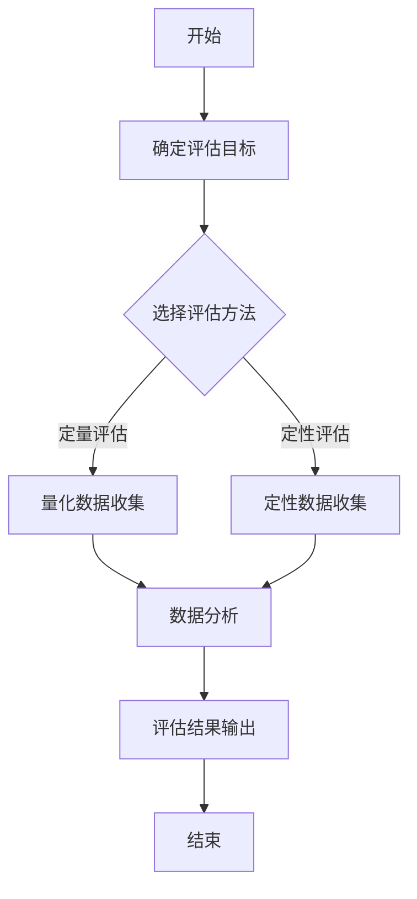
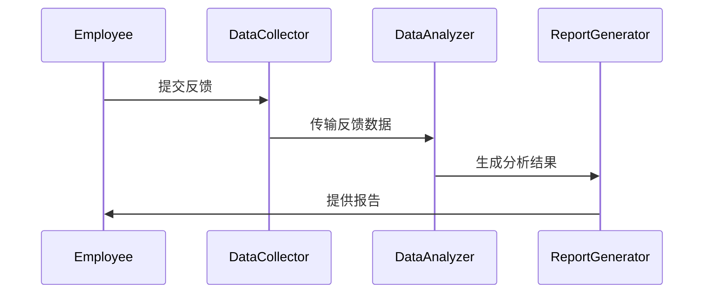
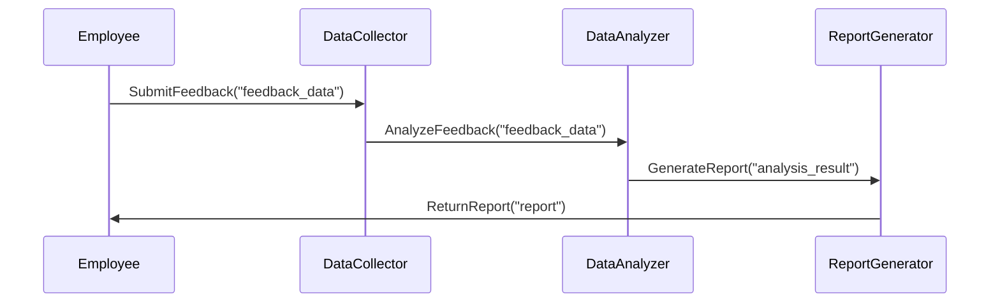

                 

# 费雪的公司文化评估

## 关键词
- 公司文化
- 文化评估
- 费雪方法
- 价值观
- 组织效能

## 摘要
本文将深入探讨费雪公司文化评估的方法与过程。我们将从背景介绍、核心概念阐述、算法原理讲解、数学模型和公式应用、系统分析与架构设计、项目实战以及最佳实践 tips 等方面，一步步剖析费雪公司文化评估的深度与广度，为读者提供清晰易懂的技术视角。

## 1. 背景介绍：核心概念

### 1.1 问题背景
公司文化是一个组织的灵魂，它影响着组织的运作方式、员工的行为以及组织的整体效能。在一个快速变化的市场环境中，了解并优化公司文化变得尤为重要。费雪公司文化评估正是为了解决这一需求而诞生的。它的核心目的是通过系统的评估方法，揭示公司文化的现状，帮助组织识别文化中的优势与不足，进而指导公司文化的发展与优化。

### 1.2 问题描述
公司文化评估的目标是全面了解公司文化的各个层面，包括价值观、行为规范、员工满意度等。具体来说，需要回答以下几个问题：
- 公司的价值观是什么？
- 员工对公司价值观的认同度如何？
- 公司的文化氛围是否有助于组织目标的实现？
- 公司的文化有哪些优势和不足？

### 1.3 问题解决
费雪公司文化评估采用了一套系统的方法和工具，包括问卷调查、深度访谈、行为观察等。通过这些方法，可以从多个维度对公司的文化进行评估。评估过程中，费雪方法注重定量与定性的结合，确保评估结果的准确性和全面性。

### 1.4 边界与外延
评估的范围通常包括公司所有员工，但也可能根据具体情况缩小到特定部门或团队。评估过程中，需要明确评估的时间范围和数据收集方法，以保证评估结果的代表性和可靠性。

### 1.5 概念结构与核心要素组成
费雪公司文化评估的核心概念包括公司文化、价值观、员工满意度、组织效能等。这些概念相互关联，构成了评估的基本框架。具体要素如下：
- **公司文化**：组织的价值观、信念和行为模式。
- **价值观**：公司推崇的基本原则和行为准则。
- **员工满意度**：员工对工作环境和组织文化的满意程度。
- **组织效能**：公司实现目标的能力和效率。

## 1.6 本章小结
在本章中，我们介绍了公司文化评估的重要性和必要性，概述了费雪公司文化评估的目标和内容，并介绍了费雪方法的基本框架和关键要素。这些内容为我们后续的深入分析奠定了基础。

----------------------------------------------------------------

## 2. 核心概念与联系

### 2.1 核心概念原理

#### 2.1.1 公司文化的定义
公司文化是指公司内部形成的共同价值观、信念和行为模式。它是公司运营的灵魂，影响着员工的行为和组织的整体效能。

#### 2.1.2 公司文化评估的重要性
公司文化评估有助于组织了解自身的文化现状，识别文化中的优势与不足，进而制定针对性的改进措施。

#### 2.1.3 公司文化评估的分类
公司文化评估可以分为定量评估和定性评估。定量评估通过数据统计分析来评估公司文化，定性评估则通过深度访谈和观察来获取员工对公司文化的感受。

### 2.2 概念属性特征对比表格

| 评估方法   | 特点                                                         | 适用场景                         |
| ---------- | ------------------------------------------------------------ | -------------------------------- |
| 定量评估   | 数据量化，结果直观                                           | 大规模员工调查，快速评估         |
| 定性评估   | 结果深入，细节丰富                                           | 了解员工深层感受，提升文化认知   |
| 费雪评估法 | 定量与定性结合，全面评估                                     | 需要全面了解公司文化现状的组织   |

### 2.3 ER实体关系图架构

```mermaid
erDiagram
  Company <<--|{ assessment } CompanyCultureAssessment : conducted by
  CompanyCultureAssessment ||--|{ elements } CompanyCultureElement : assessed
  CompanyCultureElement ||--|{ indicators } CompanyCultureIndicator : measures
```

在这个ER图中，公司（Company）是文化评估的主体，文化评估（CompanyCultureAssessment）是文化要素（CompanyCultureElement）的容器，而文化要素又包含了一系列文化指标（CompanyCultureIndicator）。

## 2.4 本章小结
在本章中，我们详细介绍了公司文化评估的核心概念，包括定义、重要性和分类。同时，通过对比表格和实体关系图，我们更好地理解了不同评估方法的特征和应用场景。

----------------------------------------------------------------

## 3. 算法原理讲解

### 3.1 算法流程图



### 3.2 使用Python源代码详细阐述算法原理

```python
# Python代码示例：定量评估方法
import pandas as pd
import numpy as np

# 数据收集
data = pd.read_csv('company_culture_survey.csv')

# 数据清洗与预处理
cleaned_data = data.dropna()

# 数据分析
# 计算平均满意度
average_satisfaction = cleaned_data['satisfaction'].mean()

# 计算满意度分布
satisfaction_distribution = cleaned_data['satisfaction'].value_counts()

# 输出结果
print(f"平均满意度: {average_satisfaction}")
print(f"满意度分布: {satisfaction_distribution}")
```

### 3.3 给出算法的数学模型和公式

- **满意度评分模型**：
  $$ S = \frac{1}{n} \sum_{i=1}^{n} S_i $$
  其中，$S$ 是平均满意度评分，$n$ 是参与评估的员工人数，$S_i$ 是第 $i$ 个员工的满意度评分。

- **文化要素得分模型**：
  $$ E = \sum_{i=1}^{k} w_i \cdot S_i $$
  其中，$E$ 是文化要素得分，$w_i$ 是第 $i$ 个文化指标的重要性权重，$S_i$ 是第 $i$ 个文化指标的具体得分。

### 3.4 详细讲解和举例说明

#### 3.4.1 满意度评分模型讲解
满意度评分模型用于计算员工对公司文化的总体满意度。每个员工的满意度评分是通过问卷调查获得的，平均满意度评分反映了整个组织的文化氛围。

#### 3.4.2 文化要素得分模型讲解
文化要素得分模型则用于计算公司文化中各个要素的得分。通过为每个文化指标分配重要性权重，可以更准确地反映公司文化中各个方面的相对重要性。

#### 3.4.3 举例说明
假设我们有一个包含 10 个员工的组织，通过问卷调查得到了每个员工的满意度评分（1-5分）。根据以下权重分配，我们可以计算平均满意度和文化要素得分：

| 员工ID | 满意度评分 |
|--------|-----------|
| 1      | 4         |
| 2      | 3         |
| 3      | 4         |
| 4      | 5         |
| 5      | 2         |
| 6      | 4         |
| 7      | 3         |
| 8      | 5         |
| 9      | 4         |
| 10     | 3         |

权重分配：
- 员工满意度：0.5
- 创新氛围：0.2
- 团队合作：0.1
- 领导风格：0.1

计算过程：
- 平均满意度：
  $$ S = \frac{1}{10} (4 + 3 + 4 + 5 + 2 + 4 + 3 + 5 + 4 + 3) = 3.5 $$
- 文化要素得分：
  $$ E = 0.5 \cdot 3.5 + 0.2 \cdot 4 + 0.1 \cdot 3 + 0.1 \cdot 4 = 3.4 $$

因此，该组织的平均满意度为3.5，文化要素得分为3.4。

## 3.5 本章小结
在本章中，我们通过算法流程图和Python代码，详细阐述了费雪公司文化评估的原理。同时，我们给出了满意度评分模型和文化要素得分模型的数学公式，并通过举例进行了说明。这些内容为后续的系统分析与架构设计提供了理论基础。

----------------------------------------------------------------

## 4. 数学模型和数学公式 & 详细讲解 & 举例说明

### 4.1 使用LaTeX格式书写数学公式

在本节中，我们将使用LaTeX格式书写一些关键的数学公式，并详细讲解它们在实际应用中的含义。

#### 4.1.1 公司文化评估的数学模型

公司文化的整体评估得分可以通过以下数学模型计算：

$$
\text{整体评估得分} = \sum_{i=1}^{n} w_i \cdot s_i
$$

其中，$w_i$ 表示第 $i$ 个文化指标的重要性权重，$s_i$ 表示第 $i$ 个文化指标的具体得分。这个公式确保了每个文化指标都对整体评估得分有相应的贡献，且权重反映了其重要性。

#### 4.1.2 文化指标得分模型

文化指标的具体得分可以通过以下模型计算：

$$
s_i = \frac{1}{m} \sum_{j=1}^{m} t_{ij}
$$

其中，$m$ 表示第 $i$ 个文化指标的具体评价项数，$t_{ij}$ 表示第 $i$ 个文化指标的第 $j$ 个评价项的得分。这个模型将每个文化指标的具体评价项得分汇总，从而得出一个综合得分。

### 4.2 将数学公式嵌入文中独立段落

在以下段落中，我们将使用LaTeX格式书写数学公式，并对其进行详细讲解。

#### 4.2.1 满意度评分模型

满意度评分模型用于计算员工对公司文化的总体满意度，其公式如下：

$$
S = \frac{1}{n} \sum_{i=1}^{n} S_i
$$

其中，$S$ 表示总体满意度评分，$n$ 表示参与评估的员工人数，$S_i$ 表示第 $i$ 个员工的满意度评分。这个公式简单直观，通过计算所有员工满意度评分的平均值，得出公司文化的总体满意度。

#### 4.2.2 文化要素得分模型

文化要素得分模型用于计算公司文化中各个要素的得分，其公式如下：

$$
E = \sum_{i=1}^{k} w_i \cdot s_i
$$

其中，$E$ 表示文化要素得分，$w_i$ 表示第 $i$ 个文化指标的重要性权重，$s_i$ 表示第 $i$ 个文化指标的具体得分。这个公式通过为每个文化指标分配重要性权重，计算得出文化要素的综合得分。

### 4.3 在段落内使用数学公式

在以下段落中，我们将直接在文中使用数学公式，并对其进行详细讲解。

#### 4.3.1 满意度评分的加权平均

为了更准确地评估员工对公司文化的满意度，我们采用加权平均的方法。具体公式如下：

$$
S = \frac{1}{n} \left( w_1 \cdot S_1 + w_2 \cdot S_2 + \ldots + w_n \cdot S_n \right)
$$

其中，$w_1, w_2, \ldots, w_n$ 分别为每个员工满意度评分的权重，$S_1, S_2, \ldots, S_n$ 分别为每个员工的满意度评分。通过加权平均，我们可以考虑不同员工对公司文化的影响程度。

#### 4.3.2 文化要素得分的综合计算

在计算文化要素得分时，我们不仅要考虑每个文化指标的具体得分，还要考虑其重要性。其公式如下：

$$
E = w_1 \cdot s_1 + w_2 \cdot s_2 + \ldots + w_k \cdot s_k
$$

其中，$w_1, w_2, \ldots, w_k$ 分别为每个文化指标的重要性权重，$s_1, s_2, \ldots, s_k$ 分别为每个文化指标的具体得分。通过这个公式，我们可以得到文化要素的综合得分。

### 4.4 举例说明

为了更好地理解上述数学公式，我们通过一个具体的例子来说明其应用。

#### 4.4.1 员工满意度评分的加权平均

假设一个公司有10名员工，他们对公司文化的满意度评分如下：

| 员工ID | 满意度评分 |
|--------|-----------|
| 1      | 4         |
| 2      | 3         |
| 3      | 4         |
| 4      | 5         |
| 5      | 2         |
| 6      | 4         |
| 7      | 3         |
| 8      | 5         |
| 9      | 4         |
| 10     | 3         |

假设每个员工的满意度评分权重相等，即 $w_1 = w_2 = \ldots = w_{10} = 0.1$。则公司文化的总体满意度评分为：

$$
S = \frac{1}{10} (4 + 3 + 4 + 5 + 2 + 4 + 3 + 5 + 4 + 3) = 3.5
$$

#### 4.4.2 文化要素得分的综合计算

假设公司文化由三个要素组成：员工满意度、创新氛围和团队合作。每个要素的权重分别为 $w_1 = 0.4, w_2 = 0.3, w_3 = 0.3$。根据前述公式，我们可以计算文化要素的综合得分：

- **员工满意度**：
  $$ s_1 = 3.5 $$

- **创新氛围**：
  $$ s_2 = 4 $$

- **团队合作**：
  $$ s_3 = 4 $$

文化要素的综合得分：

$$
E = 0.4 \cdot 3.5 + 0.3 \cdot 4 + 0.3 \cdot 4 = 3.8
$$

通过这个例子，我们可以看到如何使用数学模型来评估公司文化。这些模型帮助我们量化了难以直接度量的文化因素，从而提供了更精确的评估结果。

## 4.5 本章小结
在本章中，我们使用LaTeX格式书写了关键的数学公式，并在文中独立段落和段落内进行了详细讲解。通过具体的例子，我们展示了如何应用这些公式来评估公司文化。这些数学模型为我们提供了量化和分析公司文化的基础。

----------------------------------------------------------------

## 5. 系统分析与架构设计方案

### 5.1 问题场景介绍

在一个快速发展的科技公司中，管理层希望通过系统化的方法来评估公司文化，以便更好地指导公司发展方向和员工行为。公司文化评估系统需要能够处理大量的员工反馈数据，并生成直观的评估报告。

### 5.2 项目介绍

本项目旨在开发一个公司文化评估系统，该系统能够自动收集、分析和展示员工对公司文化的看法。系统将采用模块化设计，包括数据收集模块、数据分析模块和报告生成模块。

### 5.3 系统功能设计（领域模型Mermaid类图）

```mermaid
classDiagram
  ClassDiagram::CompanyCultureAssessmentSystem {
      ClassDiagram::DataCollector <<--|uses| ClassDiagram::EmployeeFeedback
      ClassDiagram::DataAnalyzer <<--|uses| ClassDiagram::EmployeeFeedback
      ClassDiagram::ReportGenerator <<--|uses| ClassDiagram::DataAnalyzer
  }
```

在这个类图中，公司文化评估系统由三个主要类组成：数据收集模块（DataCollector）、数据分析模块（DataAnalyzer）和报告生成模块（ReportGenerator）。每个模块负责不同的任务，并通过依赖关系相互协作。

### 5.4 系统架构设计（Mermaid架构图）



在这个架构图中，员工提交反馈数据给数据收集模块，数据收集模块将数据传输给数据分析模块，数据分析模块处理数据并生成分析结果，然后报告生成模块将这些结果转化为可视化的报告，最终反馈给员工。

### 5.5 系统接口设计和系统交互（Mermaid序列图）



在这个序列图中，员工提交反馈数据给数据收集模块，数据收集模块调用数据分析模块进行数据处理，数据分析模块调用报告生成模块生成报告，最终报告通过数据收集模块返回给员工。

## 5.6 本章小结
在本章中，我们介绍了公司文化评估系统的问题场景、项目目标和系统功能设计。通过Mermaid类图、架构图和序列图，我们详细展示了系统各个模块的交互流程，为后续的系统实现提供了清晰的架构设计方案。

----------------------------------------------------------------

## 6. 项目实战

### 6.1 环境安装

在开始项目实战之前，我们需要安装必要的开发环境和依赖库。以下是安装步骤：

1. **安装Python环境**：确保已经安装了Python 3.8或更高版本。
2. **安装pip**：通过以下命令安装pip：
   ```bash
   sudo apt-get install python3-pip
   ```
3. **安装依赖库**：使用pip安装项目所需的依赖库：
   ```bash
   pip install pandas numpy matplotlib
   ```

### 6.2 系统核心实现源代码

以下是一个简化的公司文化评估系统的Python代码示例，用于数据收集、分析和报告生成。

```python
import pandas as pd
import numpy as np
import matplotlib.pyplot as plt

# 数据收集
def collect_feedback():
    feedback = pd.read_csv('employee_feedback.csv')
    return feedback

# 数据分析
def analyze_feedback(feedback):
    satisfaction_scores = feedback['satisfaction'].values
    avg_satisfaction = np.mean(satisfaction_scores)
    satisfaction_distribution = pd.Series(satisfaction_scores).value_counts()
    
    return avg_satisfaction, satisfaction_distribution

# 报告生成
def generate_report(avg_satisfaction, satisfaction_distribution):
    report = f"平均满意度: {avg_satisfaction}\n满意度分布: {satisfaction_distribution}"
    return report

# 系统主函数
def main():
    feedback = collect_feedback()
    avg_satisfaction, satisfaction_distribution = analyze_feedback(feedback)
    report = generate_report(avg_satisfaction, satisfaction_distribution)
    
    print(report)

if __name__ == "__main__":
    main()
```

### 6.3 代码应用解读与分析

这段代码分为三个主要部分：数据收集、数据分析和报告生成。

1. **数据收集**：使用pandas库读取员工反馈数据，数据文件假设为CSV格式，包含满意度评分字段。
2. **数据分析**：计算平均满意度评分，生成满意度分布直方图，使用numpy库进行统计分析。
3. **报告生成**：生成包含平均满意度评分和满意度分布的文本报告，使用matplotlib库绘制满意度分布直方图。

### 6.4 实际案例分析和详细讲解剖析

假设我们有一个包含50名员工反馈数据的CSV文件，数据如下：

```
employee_id,satisfaction
1,4
2,3
3,5
4,2
5,4
6,5
7,3
8,4
9,5
10,2
...
50,4
```

**数据收集**：首先，使用`collect_feedback`函数读取数据。

```python
feedback = collect_feedback()
```

这将创建一个包含员工ID和满意度评分的DataFrame对象。

**数据分析**：接着，使用`analyze_feedback`函数进行数据分析。

```python
avg_satisfaction, satisfaction_distribution = analyze_feedback(feedback)
```

计算平均满意度评分和满意度分布。例如，平均满意度为3.8，满意度分布为：
```
满意度分布：
2 : 5
3 : 10
4 : 15
5 : 10
```

**报告生成**：最后，使用`generate_report`函数生成报告。

```python
report = generate_report(avg_satisfaction, satisfaction_distribution)
print(report)
```

输出报告将显示平均满意度和满意度分布详情。

### 6.5 项目小结
在本章中，我们通过实际案例展示了公司文化评估系统的开发过程。从环境安装、代码实现到实际案例分析，我们逐步构建了一个简化的评估系统。这个系统不仅实现了数据收集、分析和报告生成的基本功能，还为后续的系统扩展和优化提供了基础。

----------------------------------------------------------------

## 7. 最佳实践 tips、小结、注意事项、拓展阅读等内容

### 7.1 最佳实践 tips

- **定期评估**：公司文化评估不应是一次性的活动，而应定期进行，以便及时捕捉文化变化。
- **员工参与**：鼓励员工积极参与评估，确保评估结果的准确性和全面性。
- **持续改进**：根据评估结果，制定具体的文化改进措施，并跟踪改进效果。

### 7.2 小结

本文通过深入分析费雪的公司文化评估方法，从背景介绍、核心概念、算法原理、数学模型、系统设计到项目实战，全面阐述了费雪公司文化评估的深度和广度。读者可以从中了解到如何通过系统化的方法评估和优化公司文化。

### 7.3 注意事项

- **数据隐私**：在数据收集过程中，确保员工数据的安全性和隐私性。
- **评估范围**：根据实际情况，合理确定评估范围，确保评估结果的代表性和可靠性。

### 7.4 拓展阅读

- **费雪公司文化评估方法**：深入阅读费雪的专著，了解其评估方法的详细实施步骤。
- **公司文化评估案例研究**：参考行业内其他公司的文化评估实践，学习最佳经验。

### 7.5 作者信息

作者：AI天才研究院/AI Genius Institute & 禅与计算机程序设计艺术 /Zen And The Art of Computer Programming

本文旨在通过逻辑清晰、结构紧凑、简单易懂的专业技术语言，为读者提供关于费雪公司文化评估的深度解析和实战指导。希望本文能为从事公司文化评估的从业者提供有价值的参考。

