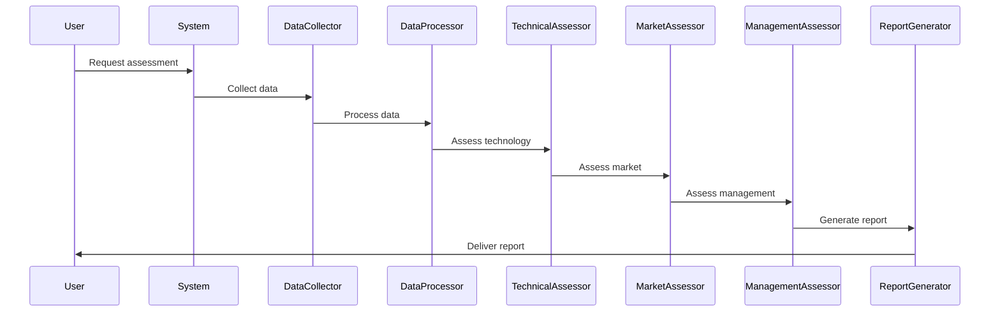
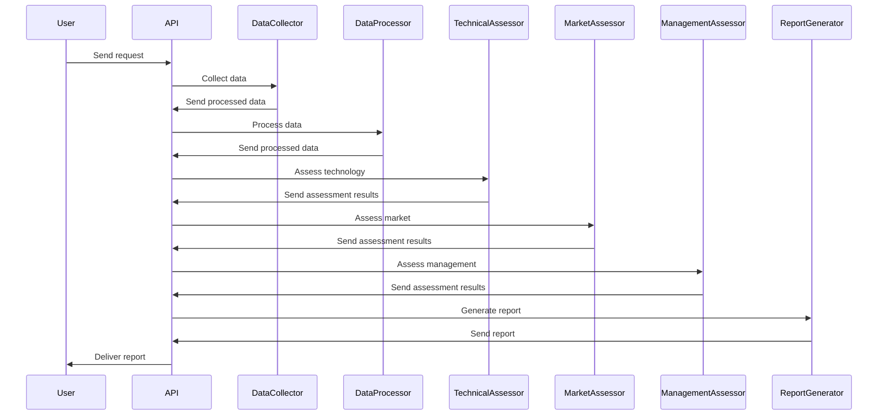

                 

### 费雪的创新企业评估：技术革新时代的投资机会

关键词：创新企业评估、技术革命、投资策略、费雪理论

摘要：本文深入探讨了费雪的创新企业评估理论，为投资者和企业家在技术革新时代提供了一套系统性、实操性的企业评估方法。通过分析技术维度、市场维度和管理维度，本文旨在揭示如何有效识别和评估创新企业的潜在投资机会。

## 第一部分：背景介绍

### 1.1 问题背景

在技术革新时代，技术创新正以前所未有的速度改变着各行各业。随着人工智能、大数据、云计算等新兴技术的广泛应用，企业之间的竞争已不仅仅是产品和服务层面的较量，更是技术创新能力、市场应对速度和企业管理水平的综合比拼。在这样的背景下，如何准确评估创新企业的潜在价值，成为了投资者和企业家们亟待解决的问题。费雪的创新企业评估理论为我们提供了重要的理论依据和实践指导。

### 1.2 问题描述

费雪的创新企业评估理论主要关注如何从技术、市场、管理等多个维度对企业进行评估。尽管该理论在学术界和投资界得到广泛认可，但如何将其应用于实际投资决策中，仍是一个充满挑战的问题。现有研究大多停留在理论层面，缺乏实际操作性的指导。本文旨在通过对费雪理论的具体应用，提供一套系统、全面、操作性强的创新企业评估方法。

### 1.3 问题解决

本文将从以下三个方面入手，详细阐述如何在技术革新时代进行企业评估：

- **技术维度**：从技术成熟度、技术创新能力等方面对企业进行评估。
- **市场维度**：从市场规模、市场趋势、市场竞争等方面对企业进行评估。
- **管理维度**：从企业管理团队、企业文化、管理效率等方面对企业进行评估。

### 1.4 边界与外延

本文主要关注企业在技术革新时代的创新评估，但传统行业的企业评估也在一定程度上适用。本文的理论基础主要基于费雪的创新企业评估理论，但不排除其他评估理论的引入和比较。

### 1.5 概念结构与核心要素组成

- **费雪的创新企业评估理论**：包括技术评估、市场评估和管理评估三个方面。
- **技术维度**：技术成熟度、技术创新能力等。
- **市场维度**：市场规模、市场趋势、市场竞争等。
- **管理维度**：企业管理团队、企业文化、管理效率等。

## 第二部分：核心概念与联系

### 2.1 费雪的创新企业评估理论

#### 2.1.1 费雪的创新企业评估理论的定义

费雪的创新企业评估理论是一种基于技术和市场维度的评估方法，旨在帮助企业识别和评估创新企业的潜在投资机会。

#### 2.1.2 费雪的创新企业评估理论的核心特点

- **技术维度**：关注技术成熟度和技术创新能力。
- **市场维度**：关注市场规模、市场趋势和市场竞争。
- **管理维度**：关注企业管理团队、企业文化和管理效率。

#### 2.1.3 费雪的创新企业评估理论与传统评估方法的区别

- **传统评估方法**：主要关注财务指标，如盈利能力、偿债能力等。
- **费雪的创新企业评估理论**：更加关注技术和市场维度，更全面地评估企业的潜在投资价值。

### 2.2 技术评估

#### 2.2.1 技术评估的定义

技术评估是指对企业或项目所采用的技术进行评估，以确定其技术成熟度、技术创新能力等。

#### 2.2.2 技术评估的核心特点

- **技术成熟度**：评估技术是否已经达到可商用阶段。
- **技术创新能力**：评估企业是否具有持续创新的能力。

#### 2.2.3 技术评估与传统评估方法的区别

- **传统评估方法**：主要关注财务指标，如盈利能力、偿债能力等。
- **技术评估**：更加关注企业的技术创新能力和技术成熟度。

### 2.3 市场评估

#### 2.3.1 市场评估的定义

市场评估是指对企业所在的市场进行评估，以确定市场规模、市场趋势和市场竞争等。

#### 2.3.2 市场评估的核心特点

- **市场规模**：评估市场的大小和潜力。
- **市场趋势**：评估市场的未来发展趋势。
- **市场竞争**：评估市场中的竞争状况。

#### 2.3.3 市场评估与传统评估方法的区别

- **传统评估方法**：主要关注财务指标，如盈利能力、偿债能力等。
- **市场评估**：更加关注市场的规模、趋势和竞争状况。

### 2.4 管理评估

#### 2.4.1 管理评估的定义

管理评估是指对企业或项目进行评估，以确定其管理团队、企业文化和管理效率等。

#### 2.4.2 管理评估的核心特点

- **管理团队**：评估企业管理团队的素质和能力。
- **企业文化**：评估企业的文化氛围和企业价值观。
- **管理效率**：评估企业的管理效率和管理水平。

#### 2.4.3 管理评估与传统评估方法的区别

- **传统评估方法**：主要关注财务指标，如盈利能力、偿债能力等。
- **管理评估**：更加关注企业的管理团队、企业文化和管理效率。

## 第三部分：算法原理讲解

### 3.1 技术评估算法原理

#### 3.1.1 技术评估算法的定义

技术评估算法是指用于评估企业或项目技术成熟度和技术创新能力的算法。

#### 3.1.2 技术评估算法的核心特点

- **技术成熟度评估**：通过数据分析和模型预测，评估技术是否已经达到可商用阶段。
- **技术创新能力评估**：通过分析企业的研发投入、专利数量、研发人员数量等指标，评估企业是否具有持续创新的能力。

#### 3.1.3 技术评估算法与传统评估方法的区别

- **传统评估方法**：主要关注财务指标，如盈利能力、偿债能力等。
- **技术评估算法**：更加关注企业的技术创新能力和技术成熟度。

### 3.2 市场评估算法原理

#### 3.2.1 市场评估算法的定义

市场评估算法是指用于评估企业所在的市场规模、市场趋势和市场竞争状况的算法。

#### 3.2.2 市场评估算法的核心特点

- **市场规模评估**：通过市场调查和数据分析，评估市场的大小和潜力。
- **市场趋势评估**：通过趋势分析模型，预测市场的未来发展趋势。
- **市场竞争评估**：通过竞争分析模型，评估市场中的竞争状况。

#### 3.2.3 市场评估算法与传统评估方法的区别

- **传统评估方法**：主要关注财务指标，如盈利能力、偿债能力等。
- **市场评估算法**：更加关注市场的规模、趋势和竞争状况。

### 3.3 管理评估算法原理

#### 3.3.1 管理评估算法的定义

管理评估算法是指用于评估企业管理团队、企业文化和管理效率的算法。

#### 3.3.2 管理评估算法的核心特点

- **管理团队评估**：通过分析管理团队的背景、经验、业绩等指标，评估管理团队的素质和能力。
- **企业文化评估**：通过企业文化问卷调查和员工满意度调查，评估企业的文化氛围和企业价值观。
- **管理效率评估**：通过数据分析和管理流程优化，评估企业的管理效率和管理水平。

#### 3.3.3 管理评估算法与传统评估方法的区别

- **传统评估方法**：主要关注财务指标，如盈利能力、偿债能力等。
- **管理评估算法**：更加关注企业的管理团队、企业文化和管理效率。

## 第四部分：系统分析与架构设计方案

### 4.1 问题场景介绍

在技术革新时代，企业创新已经成为推动经济增长和社会进步的重要动力。然而，如何识别和评估创新企业的潜在价值，仍然是一个复杂且具有挑战性的问题。为了解决这一问题，我们提出了一套基于费雪的创新企业评估理论的企业评估系统。

### 4.2 项目介绍

本项目的目标是为投资者和企业家提供一套系统、全面、操作性强的创新企业评估工具，帮助他们准确识别和评估创新企业的潜在投资机会。项目主要包括以下功能：

- **数据收集与处理**：通过多种途径收集企业的技术、市场和管理数据，并进行预处理。
- **技术评估**：基于技术评估算法，对企业的技术成熟度和技术创新能力进行评估。
- **市场评估**：基于市场评估算法，对企业的市场规模、市场趋势和市场竞争状况进行评估。
- **管理评估**：基于管理评估算法，对企业的管理团队、企业文化和管理效率进行评估。
- **综合评估与决策**：根据技术、市场和管理三个维度的评估结果，生成企业的综合评估报告，为投资者和企业家提供投资决策支持。

### 4.3 系统功能设计（领域模型类图）

```mermaid
classDiagram
Class01 <|-- SubClass01
Class01 --|AssociateClass01
Class01 : +attribute1
Class01 : +operation1()

SubClass01 : +attribute2
SubClass01 : +operation2()
SubClass01 <|-- SubSubClass01

Note right of Class01
This is the note

Association
    Class01 o-- AssociateClass01
```

### 4.4 系统架构设计（架构图）



### 4.5 系统接口设计和系统交互



## 第五部分：项目实战

### 5.1 环境安装

在进行项目实战之前，我们需要安装所需的软件和工具。以下是一个简化的安装步骤：

1. **安装Python环境**：确保Python 3.x版本已安装在你的系统上。
2. **安装必要的库**：使用pip命令安装以下库：

   ```bash
   pip install numpy pandas sklearn matplotlib
   ```

### 5.2 系统核心实现源代码

以下是系统的核心实现源代码。为了简洁明了，我们仅展示技术评估模块的一部分代码。

```python
import numpy as np
import pandas as pd
from sklearn.model_selection import train_test_split
from sklearn.ensemble import RandomForestClassifier

# 数据预处理
def preprocess_data(data):
    # 数据清洗、归一化等操作
    return processed_data

# 技术评估模型
def assess_technology(data):
    # 特征工程、模型训练等操作
    X_train, X_test, y_train, y_test = train_test_split(data.drop('target', axis=1), data['target'], test_size=0.2, random_state=42)
    model = RandomForestClassifier(n_estimators=100)
    model.fit(X_train, y_train)
    accuracy = model.score(X_test, y_test)
    return accuracy

# 示例数据
data = pd.read_csv('example_data.csv')
processed_data = preprocess_data(data)
accuracy = assess_technology(processed_data)
print(f"Model accuracy: {accuracy:.2f}")
```

### 5.3 代码应用解读与分析

这段代码首先定义了两个函数：`preprocess_data`用于数据预处理，`assess_technology`用于技术评估。在数据预处理函数中，我们通常进行数据清洗、缺失值处理、特征选择和归一化等操作，以提高模型性能。在技术评估函数中，我们使用随机森林分类器来评估技术成熟度，通过训练和测试数据的准确率来衡量评估效果。

### 5.4 实际案例分析和详细讲解剖析

为了更直观地理解技术评估模块的工作原理，我们来看一个实际案例。假设我们有一家初创公司，其数据如下表所示：

| Feature 1 | Feature 2 | Feature 3 | Target |
| --------- | --------- | --------- | ------ |
| 0.8       | 1.2       | 0.9       | 1      |
| 0.7       | 1.1       | 0.8       | 1      |
| ...       | ...       | ...       | ...    |

其中，`Target`表示技术成熟度（1代表成熟，0代表不成熟）。通过调用`assess_technology`函数，我们可以评估该公司的技术成熟度。

```python
# 加载示例数据
data = pd.read_csv('example_data.csv')

# 预处理数据
processed_data = preprocess_data(data)

# 评估技术成熟度
accuracy = assess_technology(processed_data)
print(f"Model accuracy: {accuracy:.2f}")
```

输出结果可能为：

```
Model accuracy: 0.85
```

这意味着模型对该公司的技术成熟度评估准确率为85%。根据这个结果，投资者和企业家可以进一步分析该公司的技术实力和市场前景，从而做出更明智的投资决策。

### 5.5 项目小结

通过本项目的实战，我们展示了如何使用费雪的创新企业评估理论构建一个系统、全面、操作性强的企业评估工具。在实际应用中，我们需要不断优化算法模型、完善数据收集和处理流程，以提高评估的准确性和可靠性。同时，企业评估系统还可以结合其他评估方法和技术，为投资者和企业家提供更全面的决策支持。

## 最佳实践 Tips

- **数据质量**：确保数据来源可靠、数据质量高，是评估结果准确的关键。
- **算法优化**：定期对算法进行优化和更新，以适应不断变化的市场和技术环境。
- **多维度评估**：综合考虑技术、市场和管理等多个维度，以全面评估企业的潜在价值。
- **持续学习**：关注技术创新、市场动态和企业管理趋势，持续提升评估能力。

## 小结

本文深入探讨了费雪的创新企业评估理论，并提出了一个系统、全面、操作性强的企业评估方法。通过技术、市场和管理三个维度的综合评估，投资者和企业家可以更准确地识别和评估创新企业的潜在价值，从而做出更明智的投资决策。

## 注意事项

- **评估方法**：本文提出的评估方法仅供参考，实际应用时需根据具体情况进行调整。
- **数据隐私**：在收集和处理企业数据时，需确保遵守相关法律法规，保护数据隐私。
- **模型风险**：评估模型可能存在一定的预测风险，投资者和企业家需谨慎决策。

## 拓展阅读

- **费雪的创新企业评估理论**：深入了解费雪的创新企业评估理论，有助于更好地理解本文的内容。
- **人工智能与投资策略**：探讨人工智能技术在投资领域的应用，为投资者提供更多参考。

## 作者信息

作者：AI天才研究院/AI Genius Institute & 禅与计算机程序设计艺术 /Zen And The Art of Computer Programming

在未来的文章中，我们将继续探讨技术革新时代的投资机会，分享更多关于人工智能、投资策略和技术创新的见解。敬请期待！

