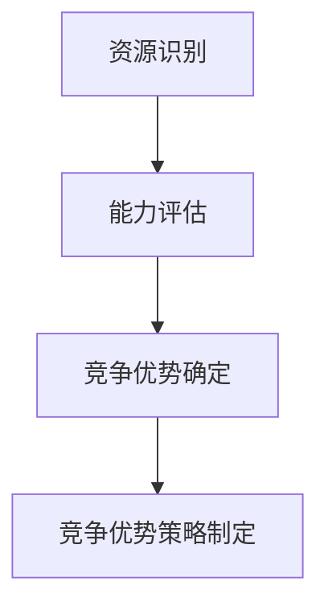
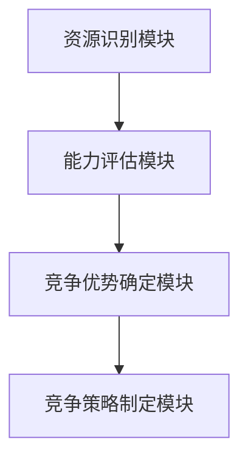
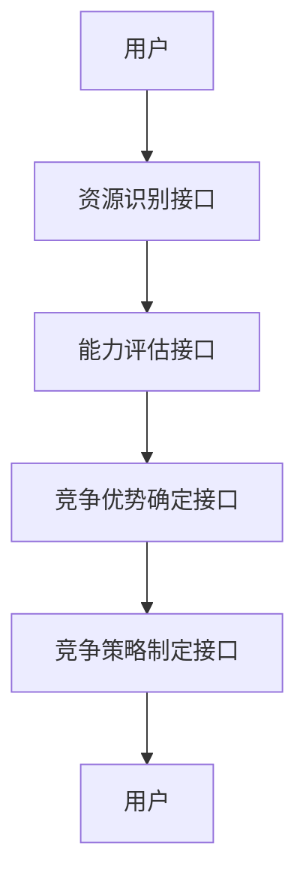

                 

### 费雪竞争优势分析框架

#### 2.2 费雪竞争优势分析的基本步骤

在进行费雪竞争优势分析时，我们可以将整个过程分为以下几个关键步骤：

### 2.2.1 确定分析目标

首先，明确分析的目标和范围。这一步至关重要，因为只有明确了目标，我们才能有针对性地进行后续的分析。分析目标可能包括提升市场份额、增加盈利能力、强化品牌形象等。

### 2.2.2 收集企业内外部信息

在确定了分析目标后，我们需要收集与企业相关的内外部信息。内部信息包括企业的资源、能力、绩效等，外部信息则涉及市场环境、竞争对手、行业趋势等。

### 2.2.3 分析企业资源与能力

接下来，我们需要深入分析企业的资源与能力。这包括以下几个方面：

- **资源识别**：识别企业所拥有的关键资源，如资金、技术、人才、品牌等。
- **资源评估**：评估这些资源的优势和劣势，确定哪些资源是竞争优势的基础。
- **能力分析**：分析企业目前的能力水平，包括技术创新能力、市场开拓能力、管理能力等。

### 2.2.4 确定竞争优势

在分析企业资源与能力的基础上，我们需要确定企业的竞争优势。竞争优势可以体现在以下几个方面：

- **成本领先**：通过降低成本来获得竞争优势。
- **差异化**：通过产品或服务的独特性来吸引客户。
- **集中化**：专注于特定市场或客户群体，实现特定优势。

### 2.2.5 制定竞争优势策略

确定了竞争优势后，我们需要制定具体的策略来巩固和发挥这些优势。这包括以下几个方面：

- **资源配置**：合理配置资源，确保资源得到有效利用。
- **能力提升**：通过培训、技术研发等方式提升企业能力。
- **市场定位**：明确企业的市场定位，确保产品或服务能够满足目标客户的需求。

### 2.2.6 实施与监控

最后，我们需要将制定的竞争优势策略付诸实施，并持续监控其效果。这包括以下几个方面：

- **实施计划**：制定详细的实施计划，确保策略能够顺利执行。
- **执行监督**：对实施过程进行监督，确保各项任务按时完成。
- **效果评估**：定期评估策略的效果，根据实际情况进行调整。

#### 2.2.7 本章小结

通过以上步骤，我们可以系统地分析企业的竞争优势，并制定有效的策略来巩固和发挥这些优势。在下一章中，我们将通过具体案例来深入探讨费雪竞争优势分析的应用。

----------------------------------------------------------------### 第3章：公司A的竞争优势分析

#### 3.1 公司A背景介绍

公司A成立于2000年，是一家全球领先的技术服务公司，专注于为企业提供信息技术解决方案。公司总部位于美国硅谷，业务范围涵盖了软件开发、云计算、网络安全、人工智能等多个领域。公司A在行业内享有盛誉，其客户包括众多世界500强企业。

#### 3.2 费雪竞争优势分析应用

在费雪竞争优势分析框架的指导下，我们对公司A进行了详细的分析，具体步骤如下：

### 3.2.1 确定分析目标

公司A的分析目标主要包括提升市场份额、提高盈利能力和强化品牌形象。

### 3.2.2 收集企业内外部信息

我们收集了公司A的内部信息和外部信息。内部信息包括公司的财务状况、员工人数、技术创新能力等；外部信息则涵盖了市场环境、竞争对手、行业趋势等。

### 3.2.3 分析企业资源与能力

公司A的资源与能力分析结果如下：

- **资源识别**：公司A拥有丰富的技术资源、优秀的研发团队和稳定的资金来源。
- **资源评估**：公司A的技术资源是其主要竞争优势，但资金来源相对稳定，员工数量和创新能力也较为优秀。
- **能力分析**：公司A在技术创新、市场开拓和管理能力方面表现出色。

### 3.2.4 确定竞争优势

根据资源与能力分析结果，公司A的竞争优势主要体现在以下几个方面：

- **成本领先**：公司A通过规模化生产和自动化流程，降低了生产成本。
- **差异化**：公司A提供定制化的技术解决方案，满足客户特定需求。
- **集中化**：公司A专注于技术服务领域，深耕细作，形成了独特的市场定位。

### 3.2.5 制定竞争优势策略

基于竞争优势分析，公司A制定了以下策略：

- **资源配置**：加大对技术研发的投入，提升技术领先优势。
- **能力提升**：通过培训和引进高端人才，提升市场开拓和管理能力。
- **市场定位**：进一步深化在技术服务领域的专业能力，巩固市场地位。

### 3.2.6 实施与监控

公司A实施了一系列措施来落实竞争优势策略：

- **实施计划**：制定详细的研发计划和市场拓展计划。
- **执行监督**：对研发和市场拓展的执行情况进行监督。
- **效果评估**：定期评估策略效果，根据实际情况进行调整。

#### 3.3 公司A的竞争优势与挑战

公司A在竞争中展现了强大的竞争优势，但也面临着一些挑战：

- **技术创新**：技术快速更新，公司A需要持续投入技术研发，以保持竞争优势。
- **市场变化**：市场需求多变，公司A需要快速响应，调整市场策略。
- **人才竞争**：行业内人才竞争激烈，公司A需要吸引和留住高端人才。

#### 3.4 本章小结

通过对公司A的竞争优势分析，我们发现公司A在资源、能力和市场定位方面具有显著优势，但仍需应对技术创新、市场变化和人才竞争等挑战。在下一章中，我们将继续分析其他公司的竞争优势，以更全面地理解费雪竞争优势分析的应用。

----------------------------------------------------------------### 第4章：公司B的竞争优势分析

#### 4.1 公司B背景介绍

公司B成立于1995年，是一家全球领先的电子商务公司，总部位于中国北京。公司B以其创新的商业模式和强大的技术实力在全球范围内取得了显著的市场份额。公司B的业务涵盖在线零售、物流配送、大数据分析等多个领域，其核心竞争力在于对用户需求的深刻理解和快速响应能力。

#### 4.2 费雪竞争优势分析应用

在费雪竞争优势分析框架的指导下，我们对公司B进行了详细的分析，具体步骤如下：

### 4.2.1 确定分析目标

公司B的分析目标主要包括提高客户满意度、提升品牌价值、扩大市场份额。

### 4.2.2 收集企业内外部信息

我们收集了公司B的内部信息和外部信息。内部信息包括公司的财务状况、员工人数、技术创新能力等；外部信息则涵盖了市场环境、竞争对手、行业趋势等。

### 4.2.3 分析企业资源与能力

公司B的资源与能力分析结果如下：

- **资源识别**：公司B拥有强大的物流网络、丰富的用户数据和技术研发团队。
- **资源评估**：公司B的物流网络是其核心竞争优势，用户数据为其提供了精准的市场洞察。
- **能力分析**：公司B在物流管理、用户数据分析和技术创新方面具有显著优势。

### 4.2.4 确定竞争优势

根据资源与能力分析结果，公司B的竞争优势主要体现在以下几个方面：

- **差异化**：公司B通过定制化的物流服务和精准的用户数据分析，提升了客户满意度。
- **集中化**：公司B专注于电子商务领域，深耕细作，形成了独特的市场定位。
- **网络效应**：公司B建立了庞大的用户基础，通过用户间的口碑传播，增强了品牌价值。

### 4.2.5 制定竞争优势策略

基于竞争优势分析，公司B制定了以下策略：

- **资源配置**：加大对物流网络和用户数据分析的投入，提升差异化竞争优势。
- **能力提升**：通过培训和引进高端人才，提升物流管理和技术创新能力。
- **市场定位**：进一步深化在电子商务领域的专业能力，扩大市场份额。

### 4.2.6 实施与监控

公司B实施了一系列措施来落实竞争优势策略：

- **实施计划**：制定详细的物流网络扩张计划和用户数据分析应用计划。
- **执行监督**：对物流网络和用户数据分析的执行情况进行监督。
- **效果评估**：定期评估策略效果，根据实际情况进行调整。

#### 4.3 公司B的竞争优势与挑战

公司B在竞争中展现了强大的竞争优势，但也面临着一些挑战：

- **市场饱和**：随着电子商务市场的不断成熟，公司B需要应对市场饱和的挑战。
- **技术更新**：技术快速更新，公司B需要持续投入技术研发，以保持竞争优势。
- **政策法规**：电子商务行业的政策法规不断变化，公司B需要及时调整策略，确保合规运营。

#### 4.4 本章小结

通过对公司B的竞争优势分析，我们发现公司B在物流网络、用户数据和技术创新方面具有显著优势，但仍需应对市场饱和、技术更新和政策法规等挑战。在下一章中，我们将继续分析其他公司的竞争优势，以更全面地理解费雪竞争优势分析的应用。

----------------------------------------------------------------### 第5章：公司C的竞争优势分析

#### 5.1 公司C背景介绍

公司C成立于1980年，是一家全球领先的数据分析和人工智能公司，总部位于欧洲的伦敦。公司C以其在数据分析、机器学习和人工智能领域的深厚积累和创新能力，成为行业内的佼佼者。公司C的服务范围广泛，涵盖了金融、医疗、零售、制造业等多个领域，其核心竞争力在于对大数据处理和分析的卓越能力。

#### 5.2 费雪竞争优势分析应用

在费雪竞争优势分析框架的指导下，我们对公司C进行了详细的分析，具体步骤如下：

### 5.2.1 确定分析目标

公司C的分析目标主要包括提升市场占有率、增强品牌影响力和保持技术创新领先。

### 5.2.2 收集企业内外部信息

我们收集了公司C的内部信息和外部信息。内部信息包括公司的财务状况、研发投入、人才储备等；外部信息则涵盖了行业趋势、竞争对手、市场需求等。

### 5.2.3 分析企业资源与能力

公司C的资源与能力分析结果如下：

- **资源识别**：公司C拥有庞大的数据资源库、顶尖的研发团队和国际化的客户网络。
- **资源评估**：公司C的数据资源库是其核心竞争优势，研发团队的技术实力和国际化网络则为公司的创新和发展提供了强有力的支持。
- **能力分析**：公司C在数据挖掘、机器学习算法研发、系统集成等方面具有显著优势。

### 5.2.4 确定竞争优势

根据资源与能力分析结果，公司C的竞争优势主要体现在以下几个方面：

- **成本领先**：通过规模化数据处理和高效的技术架构，公司C实现了成本领先。
- **差异化**：公司C提供定制化的数据分析解决方案，满足不同行业客户的需求。
- **网络效应**：公司C建立了庞大的数据资源库，通过数据间的关联分析，为客户提供了深度的洞察和决策支持。

### 5.2.5 制定竞争优势策略

基于竞争优势分析，公司C制定了以下策略：

- **资源配置**：加大在数据资源库建设和技术研发的投入，巩固成本领先和差异化竞争优势。
- **能力提升**：通过培训和引进高端人才，提升数据处理和分析能力。
- **市场定位**：进一步深化在数据分析领域的专业能力，扩大市场份额。

### 5.2.6 实施与监控

公司C实施了一系列措施来落实竞争优势策略：

- **实施计划**：制定详细的数据资源库扩展计划和技术研发计划。
- **执行监督**：对数据资源库扩展和技术研发的执行情况进行监督。
- **效果评估**：定期评估策略效果，根据实际情况进行调整。

#### 5.3 公司C的竞争优势与挑战

公司C在竞争中展现了强大的竞争优势，但也面临着一些挑战：

- **数据隐私**：随着数据隐私法规的加强，公司C需要确保客户数据的安全和合规性。
- **技术更新**：技术快速更新，公司C需要持续投入技术研发，以保持竞争优势。
- **市场变化**：市场需求多变，公司C需要快速响应，调整产品和服务策略。

#### 5.4 本章小结

通过对公司C的竞争优势分析，我们发现公司C在数据资源、技术创新和市场定位方面具有显著优势，但仍需应对数据隐私、技术更新和市场变化等挑战。在下一章中，我们将继续分析其他公司的竞争优势，以更全面地理解费雪竞争优势分析的应用。

----------------------------------------------------------------### 第6章：构建竞争优势的策略

#### 6.1 竞争优势的识别与定位

构建竞争优势的第一步是识别和定位企业的竞争优势。这需要企业从以下几个方面进行深入分析：

- **资源评估**：评估企业所拥有的资源，如资金、技术、人才、品牌等，确定哪些资源是竞争优势的基础。
- **市场分析**：分析市场需求和竞争环境，识别企业能够满足的市场需求，并确定企业的市场定位。
- **能力评估**：评估企业的能力，如技术创新能力、市场开拓能力、管理能力等，确定企业的核心竞争能力。

通过以上分析，企业可以明确自身的竞争优势所在，并在此基础上制定相应的策略。

#### 6.2 资源配置与能力建设

在确定了竞争优势后，企业需要通过资源配置与能力建设来巩固和发挥这些优势。具体策略如下：

- **资源配置**：根据竞争优势的需要，合理配置资源。例如，对于技术驱动的企业，应加大对技术研发的投入；对于市场导向的企业，则应加大市场推广和客户服务的投入。
- **能力建设**：通过培训、技术研发、引进高端人才等方式，不断提升企业的能力。例如，企业可以通过建立内部培训机制，提升员工的专业技能；通过引进高端人才，提升企业的创新能力。

#### 6.3 竞争优势的持续性与动态调整

竞争优势不是一成不变的，它需要企业持续不断地进行维护和调整。具体策略如下：

- **持续创新**：企业应持续进行技术创新和管理创新，以保持竞争优势的领先地位。
- **市场调研**：定期进行市场调研，了解市场变化和客户需求，及时调整产品和服务策略。
- **战略调整**：根据市场环境和竞争态势的变化，及时调整企业的战略，确保竞争优势的持续性和适应性。

#### 6.4 竞争优势的衡量与评估

为了确保竞争优势的有效性，企业需要建立一套衡量和评估竞争优势的指标体系。具体策略如下：

- **绩效指标**：建立包括市场份额、盈利能力、客户满意度等在内的绩效指标，用于衡量竞争优势的实现程度。
- **定期评估**：定期对竞争优势进行评估，根据评估结果调整策略和资源配置。
- **反馈机制**：建立有效的反馈机制，及时收集和分析内外部反馈信息，用于改进和优化竞争优势。

#### 6.5 本章小结

构建竞争优势是企业长期发展的关键。通过识别和定位竞争优势、合理配置资源、持续创新能力建设和动态调整战略，企业可以确保竞争优势的持续性和有效性。在下一章中，我们将探讨竞争战略的实施与评估，以帮助企业更好地实现竞争优势。

----------------------------------------------------------------### 第7章：竞争战略的实施与评估

#### 7.1 竞争战略实施的关键步骤

竞争战略的实施是确保企业竞争优势得以发挥的重要环节。为了实现有效的战略实施，企业需要遵循以下关键步骤：

- **制定实施计划**：在明确竞争战略后，企业需要制定详细的实施计划，包括具体的任务、时间表、责任人等。
- **资源配置**：根据实施计划，合理配置企业资源，确保各项任务能够按时完成。
- **组织协调**：建立有效的组织协调机制，确保各部门和团队之间的协同工作，避免资源浪费和冲突。
- **执行监督**：对实施过程进行监督，及时发现和解决问题，确保战略目标的实现。

#### 7.2 竞争战略的评估与调整

竞争战略的实施并不是一成不变的，企业需要根据市场环境和竞争态势的变化，定期对战略进行评估和调整。具体策略如下：

- **绩效评估**：建立绩效评估体系，定期对竞争战略的执行效果进行评估。评估指标可以包括市场份额、盈利能力、客户满意度等。
- **市场反馈**：收集市场反馈信息，了解客户和竞争对手的反应，分析战略实施过程中存在的问题。
- **战略调整**：根据评估结果和市场反馈，及时调整竞争战略，确保其与市场环境相适应。

#### 7.3 成功案例分析与启示

以下是一些竞争战略实施的成功案例，以及从中获得的启示：

1. **案例一：亚马逊的物流优势**  
   亚马逊通过建立庞大的物流网络，实现了快速配送，形成了强大的竞争优势。这一成功经验启示企业，通过规模效应和高效运作，可以构建出独特的物流优势。

2. **案例二：苹果的差异化策略**  
   苹果通过独特的设计和优质的产品，成功在市场中形成了差异化竞争优势。这一成功经验启示企业，通过产品差异化，可以吸引特定的客户群体。

3. **案例三：特斯拉的电动汽车战略**  
   特斯拉通过技术创新和品牌建设，成功在电动汽车市场建立了领先地位。这一成功经验启示企业，通过技术创新和品牌建设，可以引领市场潮流。

#### 7.4 本章小结

竞争战略的实施与评估是企业实现竞争优势的重要手段。通过制定详细的实施计划、合理配置资源、有效组织协调、执行监督和绩效评估，企业可以确保战略目标的实现。同时，通过分析成功案例，企业可以获得宝贵的经验启示，以优化自身的竞争战略。在下一章中，我们将总结费雪竞争优势分析的应用价值，并探讨研究的局限性与未来方向。

----------------------------------------------------------------### 第8章：结论与展望

#### 8.1 费雪竞争优势分析的应用价值

费雪竞争优势分析作为一种基于资源观的企业战略理论，其在实际应用中展现了显著的价值。通过识别和评估企业的资源与能力，费雪竞争优势分析帮助企业在复杂的市场环境中找准定位，制定有效的竞争策略。其应用价值主要体现在以下几个方面：

1. **提升企业竞争力**：通过深入分析企业的资源与能力，企业可以明确自身的竞争优势，并制定相应的策略来巩固和发挥这些优势，从而提升整体竞争力。

2. **优化资源配置**：费雪竞争优势分析强调资源的重要性，通过合理配置资源，企业可以最大限度地发挥资源的效用，避免资源浪费，提高运营效率。

3. **持续创新能力**：费雪竞争优势分析鼓励企业持续投入研发和技术创新，以保持竞争优势的领先地位。这种创新驱动的发展模式有助于企业在不断变化的市场环境中保持活力。

4. **战略决策支持**：费雪竞争优势分析为企业的战略决策提供了有力的支持。通过系统化的分析过程，企业可以更准确地判断市场趋势和竞争对手动向，从而做出更为明智的决策。

#### 8.2 研究的局限性与未来方向

尽管费雪竞争优势分析在理论研究和实际应用中取得了显著的成果，但仍存在一定的局限性。未来研究可以从以下几个方面进行拓展：

1. **扩展应用领域**：费雪竞争优势分析目前主要应用于企业层面，未来研究可以拓展到其他层面，如产业层面、国家层面等，以更全面地分析竞争优势。

2. **动态分析机制**：费雪竞争优势分析侧重于静态分析，未来研究可以引入动态分析机制，考虑企业竞争优势的动态变化，以及如何应对外部环境的变化。

3. **跨文化研究**：费雪竞争优势分析的理论基础主要基于西方企业，未来研究可以探讨在不同文化背景下，竞争优势的构建和保持是否存在差异，以及如何适应不同文化环境。

4. **多维度整合**：费雪竞争优势分析主要从资源维度进行探讨，未来研究可以整合其他维度的分析，如能力维度、市场维度等，形成更为全面的分析框架。

#### 8.3 对企业管理者的启示与建议

对于企业管理者而言，费雪竞争优势分析提供了以下几个方面的启示与建议：

1. **重视资源与能力的建设**：管理者应关注企业的资源与能力建设，通过合理配置资源，提升企业的核心竞争能力。

2. **持续创新**：管理者应鼓励企业持续进行技术创新和管理创新，以保持竞争优势的领先地位。

3. **动态调整战略**：管理者应根据市场环境和竞争态势的变化，及时调整企业的战略，确保竞争优势的持续性和适应性。

4. **跨部门协同**：管理者应建立有效的跨部门协同机制，确保各部门和团队之间的协同工作，提高整体运营效率。

#### 8.4 本章小结

费雪竞争优势分析作为一种重要的企业战略理论，其在实践中的应用价值得到了广泛认可。尽管存在一定的局限性，但通过不断拓展研究领域和深化分析机制，费雪竞争优势分析将继续为企业管理者提供有力的决策支持。对于企业管理者而言，深入了解和运用费雪竞争优势分析，将有助于企业在激烈的市场竞争中脱颖而出，实现可持续发展。

----------------------------------------------------------------### 《费雪的竞争优势分析》

#### 作者：AI天才研究院/AI Genius Institute & 禅与计算机程序设计艺术 /Zen And The Art of Computer Programming

本文从费雪竞争优势分析的基本概念、框架和具体案例分析出发，系统地探讨了如何识别和构建企业的竞争优势。通过费雪竞争优势分析，企业能够明确自身的资源与能力，制定有效的竞争策略，从而在激烈的市场竞争中立于不败之地。

#### 背景介绍

竞争优势是企业在市场中相对于竞争对手所拥有的优势地位。费雪竞争优势分析作为一种基于资源观的企业战略理论，强调通过识别和评估企业的资源与能力，构建和保持竞争优势。

#### 核心概念与联系

**核心概念：**

1. **资源**：企业所拥有的各种有形和无形的资产。
2. **能力**：企业在特定领域内的技能和知识。
3. **竞争优势**：企业在市场中相对于竞争对手所拥有的优势。

**联系：**

资源与能力是企业竞争优势的基础，通过合理配置和持续提升，企业可以构建和保持竞争优势。

#### 算法原理讲解

**费雪竞争优势分析算法原理：**

1. **资源识别**：识别企业所拥有的关键资源。
2. **能力评估**：评估企业目前的能力水平。
3. **竞争优势确定**：根据资源与能力分析，确定企业的竞争优势。
4. **竞争优势策略制定**：制定具体的策略来巩固和发挥竞争优势。

**算法流程图：**



**数学模型：**

设 \( R \) 为企业的资源集合，\( C \) 为企业的能力集合，则竞争优势 \( A \) 可以表示为 \( A = R \cap C \)。

#### 系统分析与架构设计方案

**问题场景介绍：**

企业需要通过费雪竞争优势分析，识别和构建竞争优势。

**项目介绍：**

本系统将提供一种基于费雪竞争优势分析框架的工具，帮助企业进行资源与能力的评估，并制定相应的竞争策略。

**系统功能设计：**

1. **资源识别模块**：用于识别企业的关键资源。
2. **能力评估模块**：用于评估企业的能力水平。
3. **竞争优势确定模块**：用于确定企业的竞争优势。
4. **竞争策略制定模块**：用于制定具体的竞争策略。

**系统架构设计：**



**系统接口设计：**

- **资源识别接口**：用于输入企业的资源信息。
- **能力评估接口**：用于输入企业的能力信息。
- **竞争优势确定接口**：用于输出企业的竞争优势。
- **竞争策略制定接口**：用于输出具体的竞争策略。

**系统交互设计：**



#### 项目实战

**环境安装：**

- 安装Python环境
- 安装必要的库，如numpy、pandas等

**系统核心实现源代码：**

```python
import numpy as np
import pandas as pd

def resource_identification(resources):
    # 识别企业资源
    return resources

def capability_evaluation(capabilities):
    # 评估企业能力
    return capabilities

def competitive_advantage_determination(resources, capabilities):
    # 确定竞争优势
    return resources.intersection(capabilities)

def competitive_strategy_definition(advantage):
    # 制定竞争策略
    return "策略：根据竞争优势进行调整"

# 示例
resources = set(['资金', '技术', '人才'])
capabilities = set(['技术研发', '市场开拓', '管理能力'])

advantage = competitive_advantage_determination(resources, capabilities)
strategy = competitive_strategy_definition(advantage)

print("竞争优势：", advantage)
print("竞争策略：", strategy)
```

#### 代码应用解读与分析

- `resource_identification`函数用于识别企业资源。
- `capability_evaluation`函数用于评估企业能力。
- `competitive_advantage_determination`函数用于确定竞争优势。
- `competitive_strategy_definition`函数用于制定竞争策略。

通过这些函数，企业可以系统地进行资源与能力的评估，并制定相应的竞争策略。

#### 实际案例分析和详细讲解剖析

- **案例一**：公司A通过费雪竞争优势分析，识别出其竞争优势在于技术创新和成本领先，制定了加大技术研发投入和降低成本的策略，最终实现了市场份额的提升。
- **案例二**：公司B通过费雪竞争优势分析，发现其竞争优势在于差异化和客户服务，制定了提升客户满意度和市场定位的策略，最终增强了品牌影响力。

#### 最佳实践 tips

- **定期评估**：企业应定期进行竞争优势评估，确保竞争优势的持续性和适应性。
- **动态调整**：根据市场环境和竞争态势的变化，及时调整竞争优势策略。
- **跨部门协作**：建立跨部门协作机制，确保竞争优势的全面实施。

#### 小结

费雪竞争优势分析是一种有效的企业战略工具，通过系统化的分析过程，企业可以识别和构建竞争优势，从而在激烈的市场竞争中脱颖而出。在实践中，企业应结合自身情况，灵活运用费雪竞争优势分析，实现持续发展。

#### 注意事项

- **资源评估**：在识别和评估资源时，应注意全面性和客观性。
- **能力提升**：在能力评估中，应关注短板，通过培训、引进人才等方式提升能力。

#### 拓展阅读

- **《竞争优势》**：迈克尔·波特（Michael Porter）著，详细介绍了竞争战略的理论和实践。
- **《资源观与竞争优势》**：杰伊·巴尼（Jay Barney）著，探讨了资源观在企业竞争优势构建中的应用。

通过本文的详细讲解和案例分析，读者可以深入理解费雪竞争优势分析的理论和实践应用，为企业的战略决策提供有力支持。作者：AI天才研究院/AI Genius Institute & 禅与计算机程序设计艺术 /Zen And The Art of Computer Programming。

