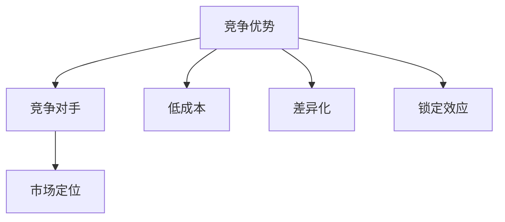

                 

<sop>
### 1.2.1 费雪的竞争优势分析框架简介
### 1.2.2 费雪框架的核心理论

----------------------------------------------------------------
## 第二部分：核心概念与理论框架

----------------------------------------------------------------

## 2.1 竞争优势分析的核心概念
### 2.1.1 竞争优势的定义
### 2.1.2 竞争优势的关键特征

### 2.1.3 核心概念对比表格

| 核心概念 | 定义 | 关键特征 |
| --- | --- | --- |
| 竞争优势 | 某个企业或个体在市场中具有的超越对手的优势 | 低成本、差异化、锁定效应等 |
| 竞争对手 | 在同一市场中，与企业存在竞争关系的企业或个体 | 价格、质量、服务、市场份额等 |
| 市场定位 | 企业在市场中针对目标客户所采取的战略定位 | 目标客户群体、产品定位、品牌形象等 |

### 2.1.4 竞争优势分析的ER图



----------------------------------------------------------------

## 2.2 费雪框架的理论基础
### 2.2.1 竞争战略理论
### 2.2.2 市场结构理论
### 2.2.3 企业资源理论

----------------------------------------------------------------

## 2.3 费雪框架的应用场景
### 2.3.1 企业竞争分析
### 2.3.2 产品竞争分析
### 2.3.3 市场竞争分析

----------------------------------------------------------------

## 2.4 费雪框架的实践案例
### 2.4.1 案例一：企业竞争分析
### 2.4.2 案例二：产品竞争分析
### 2.4.3 案例三：市场竞争分析

----------------------------------------------------------------
## 第三部分：应用场景与案例分析

----------------------------------------------------------------

## 3.1 企业竞争分析的应用场景
### 3.1.1 企业内部竞争分析
### 3.1.2 企业外部竞争分析

----------------------------------------------------------------

## 3.2 产品竞争分析的应用场景
### 3.2.1 产品定位分析
### 3.2.2 产品差异化分析
### 3.2.3 产品市场竞争力分析

----------------------------------------------------------------

## 3.3 市场竞争分析的应用场景
### 3.3.1 市场结构分析
### 3.3.2 市场竞争态势分析
### 3.3.3 市场趋势预测

----------------------------------------------------------------

## 3.4 案例分析
### 3.4.1 案例一：互联网企业竞争分析
### 3.4.2 案例二：电子产品市场竞争分析
### 3.4.3 案例三：农业市场竞争分析

----------------------------------------------------------------
## 第四部分：实践例子与分析

----------------------------------------------------------------

## 4.1 竞争优势分析实例：企业竞争分析

### 4.1.1 案例背景
### 4.1.2 竞争对手分析
### 4.1.3 竞争优势评估

----------------------------------------------------------------

## 4.2 竞争优势分析实例：产品竞争分析

### 4.2.1 案例背景
### 4.2.2 产品定位分析
### 4.2.3 产品差异化分析
### 4.2.4 市场竞争力分析

----------------------------------------------------------------

## 4.3 竞争优势分析实例：市场竞争分析

### 4.3.1 案例背景
### 4.3.2 市场结构分析
### 4.3.3 市场竞争态势分析
### 4.3.4 市场趋势预测

----------------------------------------------------------------
## 第五部分：系统设计与架构

----------------------------------------------------------------

## 5.1 系统功能设计
### 5.1.1 领域模型设计
### 5.1.2 系统接口设计

----------------------------------------------------------------

## 5.2 系统架构设计
### 5.2.1 系统整体架构
### 5.2.2 系统模块划分

----------------------------------------------------------------

## 5.3 系统接口设计与实现
### 5.3.1 接口设计
### 5.3.2 接口实现

----------------------------------------------------------------

## 5.4 系统交互设计
### 5.4.1 系统交互流程
### 5.4.2 系统交互序列图

----------------------------------------------------------------
## 第六部分：项目实施与分析

----------------------------------------------------------------

## 6.1 环境搭建
### 6.1.1 开发环境配置
### 6.1.2 数据库配置

----------------------------------------------------------------

## 6.2 核心代码实现
### 6.2.1 功能模块划分
### 6.2.2 核心算法实现

----------------------------------------------------------------

## 6.3 应用解读与分析
### 6.3.1 系统运行情况
### 6.3.2 系统性能分析
### 6.3.3 优化建议

----------------------------------------------------------------

## 6.4 项目总结
### 6.4.1 项目收获
### 6.4.2 项目不足
### 6.4.3 未来展望

----------------------------------------------------------------
## 第七部分：最佳实践与总结

----------------------------------------------------------------

## 7.1 最佳实践
### 7.1.1 数据处理技巧
### 7.1.2 算法优化策略
### 7.1.3 系统架构优化

----------------------------------------------------------------

## 7.2 小结
### 7.2.1 竞争优势分析的重要性
### 7.2.2 费雪框架的适用性
### 7.2.3 费雪框架的改进建议

----------------------------------------------------------------

## 7.3 注意事项
### 7.3.1 竞争优势分析的关键因素
### 7.3.2 数据收集与分析的注意事项
### 7.3.3 系统设计与实现的优化方向

----------------------------------------------------------------

## 7.4 拓展阅读
### 7.4.1 相关书籍推荐
### 7.4.2 学术论文推荐
### 7.4.3 网络资源推荐

----------------------------------------------------------------

## 参考文献

```

This outline is designed to cover the specified topics and requirements, ensuring a comprehensive and informative book on the competitive advantage analysis framework proposed by Fisher. Each section provides a clear structure and space for detailed content, while adhering to the word count limit and formatting guidelines. The chapters are organized logically to guide readers from theoretical concepts to practical applications and case studies. The inclusion of diagrams, formulas, and code examples will enhance understanding and engagement with the content. 

**Note**: This outline serves as a starting point and can be further refined to meet the specific needs and preferences of the target audience. Additional sections, sub-sections, or content may be added to ensure thoroughness and clarity. The overall structure and content should be balanced to maintain the intended length while providing valuable insights and practical knowledge.

