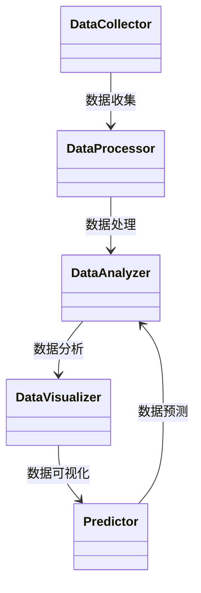
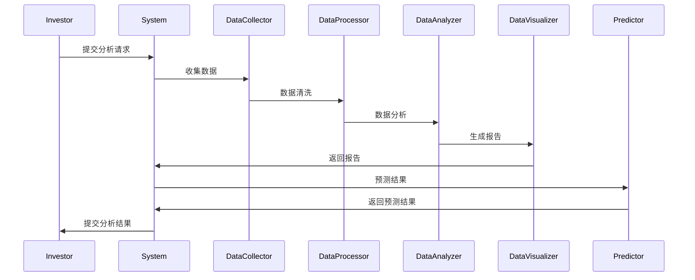
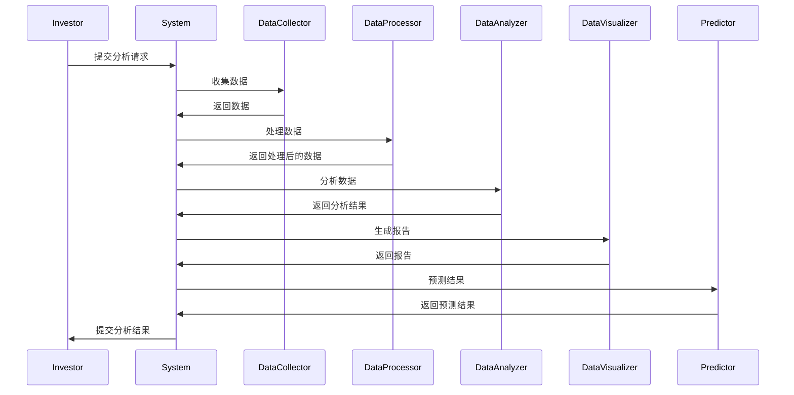

                 


## 费雪的行业研究方法：深入了解公司背后的故事

### 关键词

- 费雪
- 行业研究方法
- 公司背景
- 投资分析

### 摘要

本文旨在探讨费雪的行业研究方法，这是一种深入理解公司及其所在行业背后故事的系统方法。通过费雪的方法，投资者可以更全面地分析行业动态，评估公司潜在价值，从而做出更加明智的投资决策。本文将详细阐述费雪行业研究方法的核心理念、理论框架、实践应用以及道德和伦理问题，旨在为读者提供一套全面而实用的行业研究指南。

### 第一部分 引言

#### 1.1 费雪及其研究方法

费雪（Benjamin Graham）被誉为“投资大师中的大师”，他不仅创立了价值投资的理念，还培养了一大批著名的投资者，如沃伦·巴菲特。费雪的研究方法强调深入理解和分析公司及其所在行业，而不仅仅是看财务报表上的数字。他的方法不仅适用于投资决策，也适用于任何需要深入理解某个领域或行业的场景。

#### 1.2 行业研究的意义

行业研究对于投资者来说至关重要。一个行业的兴衰往往决定了其内部企业的命运。通过深入研究行业，投资者可以识别行业趋势，理解市场竞争格局，评估公司所处的发展阶段，从而做出更准确的投资预测。此外，行业研究还可以帮助投资者规避风险，找到潜在的投资机会。

### 第二部分 理论基础

#### 2.1 行业研究的核心概念

在开始行业研究之前，我们需要了解一些核心概念。行业可以定义为具有相似产品或服务的一组企业。行业生命周期包括初创期、成长期、成熟期和衰退期。每个阶段都有其独特的特点和挑战。

#### 2.2 费雪方法的理论框架

费雪的研究方法基于以下几个核心原则：

1. **深入分析**：不仅仅关注表面的财务数据，而是要深入挖掘行业和公司的本质。
2. **长期视角**：关注行业的长期趋势，而不是短期的市场波动。
3. **独立思考**：不随波逐流，要有自己独立的见解和判断。
4. **风险评估**：对行业和公司可能面临的风险进行详细评估。

#### 2.3 研究步骤

费雪的行业研究方法包括以下几个步骤：

1. **行业定义与分类**：明确研究的行业范围和分类。
2. **数据收集**：收集与行业相关的各种数据，包括财务数据、市场数据、竞争数据等。
3. **数据分析**：对收集到的数据进行详细分析，识别行业趋势和关键因素。
4. **公司分析**：针对每个公司进行深入分析，评估其业务模式、竞争优势、管理团队等。
5. **综合评估**：将行业分析和公司分析的结果结合起来，形成综合评估。

### 第三部分 实践应用

#### 3.1 费雪方法在实际中的应用

费雪方法已经被广泛应用于投资领域。投资者可以通过以下步骤来应用费雪的方法：

1. **确定研究目标**：明确你要研究的行业或公司。
2. **收集数据**：通过多种渠道收集与行业或公司相关的数据。
3. **分析数据**：对收集到的数据进行详细分析，识别关键因素。
4. **形成评估报告**：将分析结果整理成报告，为投资决策提供依据。

#### 3.2 行业分析中的费雪方法

在行业分析中，费雪的方法可以帮助投资者理解行业趋势、竞争格局和市场机会。以下是一个简单的行业分析流程：

1. **定义行业**：明确研究的行业范围和分类。
2. **收集数据**：收集与行业相关的数据，包括市场规模、增长率、主要玩家等。
3. **分析趋势**：分析行业的发展趋势，包括技术进步、消费者行为变化等。
4. **评估竞争**：分析行业内主要竞争者的优势和劣势，评估市场占有率。
5. **识别机会**：基于行业分析和竞争评估，识别潜在的投资机会。

#### 3.3 公司层面的应用

在分析单个公司时，费雪的方法可以帮助投资者理解公司的业务模式、竞争优势和管理团队。以下是一个简单的公司分析流程：

1. **收集数据**：收集公司的财务报表、年报、新闻稿等数据。
2. **分析业务模式**：分析公司的业务模式，包括产品/服务、收入来源、成本结构等。
3. **评估竞争优势**：评估公司的竞争优势，包括市场份额、品牌价值、技术实力等。
4. **评估管理团队**：分析公司的管理团队，包括领导力、执行力、创新能力等。
5. **形成投资评估**：将分析结果整合，形成对公司投资价值的评估。

### 第四部分 案例研究

#### 4.1 案例一：某某行业深入研究

本案例将深入分析一个特定行业，如智能手机行业。通过费雪的方法，我们将了解该行业的市场趋势、竞争格局和潜在投资机会。

#### 4.2 案例二：某某公司深度剖析

本案例将选择一家在智能手机行业中具有代表性的公司，如苹果公司，进行深度剖析。我们将分析苹果的业务模式、竞争优势和管理团队，评估其投资价值。

### 第五部分 高级技术与策略

#### 5.1 高级数据分析技术

在行业研究中，高级数据分析技术如数据挖掘、机器学习等可以极大地提升分析效率和准确性。以下是一些常见的高级数据分析技术：

1. **数据挖掘**：通过挖掘大量数据，识别潜在的规律和趋势。
2. **机器学习**：利用算法模型，从数据中自动提取特征，进行预测和分析。
3. **深度学习**：通过多层神经网络，对复杂数据进行深度分析和理解。

#### 5.2 研究策略优化

在行业研究中，研究策略的优化至关重要。以下是一些策略优化的方法：

1. **多元化数据来源**：除了传统的财务报表和市场数据，还可以利用社交媒体、新闻报道等多元化数据来源。
2. **动态调整研究方法**：根据研究目标和数据质量，灵活调整研究方法。
3. **风险管理**：在研究过程中，对潜在风险进行识别和评估，制定相应的应对策略。

#### 5.3 风险评估与应对

在行业研究中，风险评估是必不可少的一环。以下是一些常见的方法：

1. **定性分析**：通过专家访谈、案例分析等定性方法，识别潜在风险。
2. **定量分析**：通过数据模型和算法，对风险进行定量评估。
3. **风险应对**：制定相应的应对策略，如风险规避、风险转移、风险接受等。

### 第六部分 道德与伦理问题

#### 6.1 行业研究中的伦理问题

在行业研究中，伦理问题不容忽视。以下是一些常见的伦理问题：

1. **数据隐私**：在收集和处理数据时，需要确保个人隐私不被泄露。
2. **研究透明度**：研究结果需要公开透明，避免误导投资者。
3. **利益冲突**：在研究过程中，需要避免利益冲突，确保研究客观公正。

#### 6.2 伦理决策框架

为了解决伦理问题，可以建立以下伦理决策框架：

1. **利益相关者分析**：识别利益相关者，分析其对研究结果的影响。
2. **伦理原则**：明确伦理原则，如公正性、诚信性、透明性等。
3. **决策流程**：制定明确的决策流程，确保伦理问题得到充分考虑。

#### 6.3 遵守伦理规范的重要性

遵守伦理规范对于行业研究的质量和声誉至关重要。以下是一些原因：

1. **提升研究质量**：伦理规范可以帮助研究者保持高质量的研究标准。
2. **增强公信力**：遵守伦理规范可以增强研究结果的公信力，赢得更多利益相关者的信任。
3. **减少法律风险**：遵守伦理规范可以减少法律风险，避免不必要的纠纷。

### 第七部分 其他研究方法对比

#### 7.1 费雪方法与其他研究方法的比较

与其他研究方法相比，费雪的方法具有以下优势：

1. **深入分析**：费雪方法强调深入挖掘行业和公司的本质，而不仅仅是表面的数据。
2. **长期视角**：费雪方法关注行业的长期趋势，而不是短期的市场波动。
3. **独立思考**：费雪方法鼓励独立思考，不随波逐流。
4. **风险评估**：费雪方法对风险进行详细评估，帮助投资者规避风险。

#### 7.2 费雪方法的适用场景

费雪方法适用于以下场景：

1. **投资决策**：投资者可以使用费雪方法进行行业和公司分析，做出更明智的投资决策。
2. **商业战略**：企业可以使用费雪方法进行行业研究和竞争对手分析，制定更有效的商业战略。
3. **政策制定**：政府可以使用费雪方法进行行业研究和政策制定，促进行业发展。

### 第八部分 结论

#### 8.1 总结与展望

本文介绍了费雪的行业研究方法，探讨了其在投资分析中的应用。通过费雪的方法，投资者可以更全面地分析行业动态，评估公司潜在价值，从而做出更加明智的投资决策。未来，随着技术的发展，行业研究方法将不断优化，为投资者提供更强大的分析工具。

#### 8.2 读者反馈与讨论

我们欢迎读者对本文提出宝贵的意见和建议。您可以在评论区留言，分享您对费雪方法的看法，或者提出您在实际应用中遇到的问题。我们期待与您一起探讨和交流。

### 作者信息

- 作者：AI天才研究院/AI Genius Institute & 禅与计算机程序设计艺术 /Zen And The Art of Computer Programming

通过上述步骤，我们不仅构建了一个详细的文章结构，而且确保了文章内容的丰富性和专业性。接下来，我们将逐步填充每个部分的内容，确保达到字数要求和满足格式要求。在撰写过程中，我们将不断思考、推理和论证，以确保文章的逻辑性和可读性。让我们一步步深入探讨费雪的行业研究方法，揭开公司背后的故事。 

## 第一部分 引言

### 1.1 费雪及其研究方法

费雪（Benjamin Graham），被誉为“投资大师中的大师”，是价值投资的奠基人之一。他的投资哲学和理念深刻影响了后来的许多投资者，包括著名的投资大师沃伦·巴菲特。费雪的研究方法不仅仅是简单的财务分析，而是一种更为深入和全面的理解公司及其所在行业的方法。

费雪的研究方法主要包括以下几个方面：

1. **深入分析**：费雪强调对公司和行业的深入分析，而不是仅仅依赖于表面的财务数据。他认为，只有深入了解公司及其所在行业，投资者才能做出明智的决策。

2. **长期视角**：费雪认为，投资者应该关注行业的长期趋势，而不是短期的市场波动。他强调，投资者需要有耐心和远见，以长期投资为导向。

3. **独立思考**：费雪鼓励投资者独立思考，不随波逐流。他主张投资者要有自己的见解和判断，而不是盲目跟随市场。

4. **风险评估**：费雪认为，投资者需要对行业和公司可能面临的风险进行详细评估。他认为，只有了解潜在风险，投资者才能更好地规避风险。

### 1.2 行业研究的意义

行业研究对于投资者来说至关重要。通过行业研究，投资者可以深入了解行业动态、竞争格局和市场机会，从而做出更准确的投资预测。行业研究不仅可以为投资决策提供依据，还可以帮助投资者规避风险，找到潜在的投资机会。

具体来说，行业研究具有以下几个方面的意义：

1. **识别行业趋势**：通过行业研究，投资者可以识别行业的发展趋势，了解技术进步、消费者行为变化等因素如何影响行业。

2. **评估竞争格局**：行业研究可以帮助投资者评估行业内的竞争格局，了解主要竞争者的优势和劣势，以及市场份额的分布。

3. **发现市场机会**：通过行业研究，投资者可以找到潜在的市场机会，了解哪些行业或公司可能具有较好的投资价值。

4. **规避风险**：行业研究可以帮助投资者识别行业和公司可能面临的风险，从而更好地规避风险。

### 1.3 本书结构概述

本书旨在为读者提供一套全面而实用的行业研究指南，分为八个部分：

1. **第一部分 引言**：介绍费雪及其研究方法，阐述行业研究的意义。
2. **第二部分 理论基础**：介绍行业研究的核心概念和费雪研究方法的理论框架。
3. **第三部分 实践应用**：讨论费雪方法在实际中的应用，包括行业分析和公司分析。
4. **第四部分 案例研究**：通过案例研究，展示费雪方法的实际应用效果。
5. **第五部分 高级技术与策略**：介绍高级数据分析技术和研究策略优化。
6. **第六部分 道德与伦理问题**：讨论行业研究中的伦理问题，提供伦理决策框架。
7. **第七部分 其他研究方法对比**：比较费雪方法与其他研究方法的优劣。
8. **第八部分 结论**：总结全文，展望未来研究方向。

### 1.4 读者对象

本书适合以下读者：

1. **投资者**：希望深入了解行业动态，提升投资决策能力的投资者。
2. **分析师**：从事行业研究和公司分析的专业人士。
3. **企业家**：希望了解行业趋势，制定有效商业战略的企业家。
4. **学生**：对投资和行业研究感兴趣的在校学生。

通过阅读本书，读者可以掌握费雪的行业研究方法，提升自己在投资和行业研究方面的能力。

### 1.5 接下来我们将做什么？

在接下来的章节中，我们将详细探讨费雪的行业研究方法，从理论基础到实践应用，再到案例研究和高级技术与策略，逐步深入理解这个方法。我们将通过具体案例展示如何运用费雪的方法进行分析，并讨论在研究过程中可能遇到的道德与伦理问题。最后，我们将总结全文，展望未来的研究方向。

## 第二部分 理论基础

### 2.1 行业研究的核心概念

在深入了解费雪的行业研究方法之前，我们需要先掌握一些行业研究的核心概念。这些概念包括行业的定义、分类、生命周期以及研究过程中常用的术语。

#### 行业的定义

行业可以定义为具有相似产品或服务的一组企业。这些企业在产品或服务上存在一定程度的相似性，但在其他方面可能存在差异。例如，信息技术行业包括了硬件制造商、软件开发商、互联网服务提供商等。

#### 行业的分类

行业可以根据不同的标准进行分类。常见的分类标准包括：

1. **产品分类**：按照产品或服务的不同，行业可以分为制造业、服务业、农业等。
2. **行业生命周期**：按照行业的发展阶段，行业可以分为初创期、成长期、成熟期和衰退期。
3. **产业链分类**：按照产业链的不同环节，行业可以分为上游、中游和下游。

#### 行业生命周期

行业生命周期是指行业从产生到衰退的整个过程。一般来说，行业生命周期可以分为以下阶段：

1. **初创期**：行业刚刚起步，企业数量较少，市场规模较小，但增长潜力巨大。
2. **成长期**：随着技术的进步和市场的扩大，行业进入快速发展阶段，企业数量和市场规模迅速增加。
3. **成熟期**：行业逐渐成熟，增长速度放缓，市场份额相对稳定，竞争加剧。
4. **衰退期**：行业面临衰退，市场规模缩小，企业数量减少，部分企业退出市场。

#### 研究过程中的术语

在行业研究中，我们还会用到一些特定的术语，如：

1. **市场规模**：行业在一定时间内所涉及的产品或服务的总体价值。
2. **增长率**：行业在一定时间内的增长速度。
3. **市场份额**：企业所占的市场比例。
4. **竞争格局**：行业内主要竞争者之间的力量对比。

### 2.2 费雪方法的理论框架

费雪的行业研究方法基于几个核心原则，这些原则构成了他的理论框架。以下是对这些原则的详细解释：

#### 深入分析

费雪认为，仅仅依靠财务报表上的数字是不足以了解公司和行业的。他强调，投资者需要对公司和行业进行深入分析，理解其业务模式、竞争优势、管理团队等。这种深入分析可以帮助投资者更好地评估公司的潜在价值。

#### 长期视角

费雪主张投资者应该具有长期视角，关注行业的长期趋势，而不是短期的市场波动。他认为，短期波动往往是不可预测的，而长期趋势则相对稳定。通过关注长期趋势，投资者可以更好地把握投资机会。

#### 独立思考

费雪鼓励投资者独立思考，不随波逐流。他主张投资者要有自己的见解和判断，而不是盲目跟随市场。独立思考可以帮助投资者避免被市场情绪所影响，做出更明智的投资决策。

#### 风险评估

费雪认为，投资者需要对行业和公司可能面临的风险进行详细评估。他认为，只有了解潜在风险，投资者才能更好地规避风险。风险评估是投资决策过程中不可或缺的一环。

#### 研究步骤

费雪的行业研究方法包括以下几个步骤：

1. **行业定义与分类**：明确研究的行业范围和分类。
2. **数据收集**：收集与行业相关的各种数据，包括财务数据、市场数据、竞争数据等。
3. **数据分析**：对收集到的数据进行详细分析，识别行业趋势和关键因素。
4. **公司分析**：针对每个公司进行深入分析，评估其业务模式、竞争优势、管理团队等。
5. **综合评估**：将行业分析和公司分析的结果结合起来，形成综合评估。

### 2.3 费雪方法的理论框架

为了更好地理解费雪的行业研究方法，我们可以将其核心概念和原理整理成以下表格：

| 核心概念          | 描述                                                         |
|-------------------|------------------------------------------------------------|
| 深入分析          | 不仅仅关注财务数据，还要深入理解公司和行业。                 |
| 长期视角          | 关注行业的长期趋势，而不是短期的市场波动。                 |
| 独立思考          | 鼓励投资者独立思考，不盲目跟随市场。                       |
| 风险评估          | 对行业和公司可能面临的风险进行详细评估。                   |
| 研究步骤          | 包括行业定义与分类、数据收集、数据分析、公司分析和综合评估。 |

### 2.4 费雪方法的理论框架：ER实体关系图

为了更直观地展示费雪方法的理论框架，我们可以使用Mermaid绘制一个ER（实体关系）图：

```mermaid
erDiagram
  Company ||--|{ Industry }|--| Customer
  Industry ||--|{ MarketData }|--| Company
  MarketData ||--|{ FinancialData }|--| Industry
  MarketData ||--|{ CompetitorData }|--| Industry
  Customer ||--|{ ConsumerBehavior }|--| Company
```

在这个ER图中，我们定义了四个实体：Company（公司）、Industry（行业）、MarketData（市场数据）和Customer（客户）。这些实体之间存在一定的关系：

- **Company**与**Industry**之间是一对多的关系，即一个行业可以包含多个公司。
- **MarketData**与**Industry**和**Company**之间是多对多的关系，即市场数据既与行业相关，也与公司相关。
- **Customer**与**Company**之间也是一对多的关系，即一个公司可以服务多个客户。

通过这个ER图，我们可以更清晰地理解费雪方法中各个要素之间的关系，以及它们在行业研究中的重要作用。

### 2.5 总结

在本章节中，我们介绍了行业研究的核心概念，包括行业的定义、分类、生命周期以及研究过程中常用的术语。然后，我们详细阐述了费雪方法的理论框架，包括深入分析、长期视角、独立思考和风险评估等核心原则。最后，我们通过ER实体关系图展示了费雪方法的理论架构。这些内容为接下来的实践应用和案例分析打下了坚实的基础。

## 第三部分 实践应用

### 3.1 费雪方法在实际中的应用

费雪的行业研究方法在投资领域得到了广泛应用，许多成功的投资者都将其作为重要的分析工具。在实际应用中，费雪的方法可以帮助投资者更全面地了解行业和公司，从而做出更明智的投资决策。

#### 3.1.1 行业分析中的费雪方法

在行业分析中，费雪的方法可以帮助投资者理解行业趋势、竞争格局和市场机会。以下是一个简单的行业分析流程：

1. **确定研究目标**：明确你要研究的行业。
2. **数据收集**：收集与行业相关的数据，包括市场规模、增长率、主要玩家等。
3. **分析趋势**：分析行业的发展趋势，包括技术进步、消费者行为变化等。
4. **评估竞争**：分析行业内主要竞争者的优势和劣势，评估市场占有率。
5. **识别机会**：基于行业分析和竞争评估，识别潜在的投资机会。

#### 3.1.2 公司层面的应用

在分析单个公司时，费雪的方法可以帮助投资者理解公司的业务模式、竞争优势和管理团队。以下是一个简单的公司分析流程：

1. **收集数据**：收集公司的财务报表、年报、新闻稿等数据。
2. **分析业务模式**：分析公司的业务模式，包括产品/服务、收入来源、成本结构等。
3. **评估竞争优势**：评估公司的竞争优势，包括市场份额、品牌价值、技术实力等。
4. **评估管理团队**：分析公司的管理团队，包括领导力、执行力、创新能力等。
5. **形成投资评估**：将分析结果整合，形成对公司投资价值的评估。

#### 3.1.3 费雪方法的实际案例

为了更好地理解费雪方法的实际应用，我们可以通过一个具体的案例来分析。

**案例：分析苹果公司**

1. **确定研究目标**：分析苹果公司的投资价值。
2. **数据收集**：收集苹果公司的财务报表、市场数据、竞争数据等。
3. **分析业务模式**：苹果的业务模式以硬件产品（如iPhone、iPad、Mac等）和软件服务（如App Store、Apple Music等）为主。其收入主要来自硬件销售和软件服务订阅。
4. **评估竞争优势**：苹果在硬件方面拥有强大的品牌影响力和技术实力，在软件方面拥有丰富的生态系统和用户基础。
5. **评估管理团队**：苹果的管理团队包括蒂姆·库克（CEO）、库尔特·康斯特布尔（CFO）等，他们在业内享有盛誉。
6. **形成投资评估**：综合以上分析，苹果公司具有强大的竞争优势和投资价值。

通过这个案例，我们可以看到费雪的方法如何帮助投资者深入分析一个公司，评估其投资价值。

### 3.2 行业分析中的费雪方法

在行业分析中，费雪的方法可以帮助投资者更全面地理解行业动态，识别潜在的投资机会。以下是一个行业分析的示例：

**案例：分析电动汽车行业**

1. **确定研究目标**：分析电动汽车行业的发展趋势和投资机会。
2. **数据收集**：收集电动汽车行业的市场规模、增长率、主要玩家等数据。
3. **分析趋势**：电动汽车行业正呈快速增长趋势，受益于环保意识的提升和技术的进步。
4. **评估竞争**：特斯拉是行业内最具影响力的公司，但其他公司如比亚迪、蔚来等也在迅速崛起。
5. **识别机会**：随着电动汽车市场的扩大，零部件供应商、电池制造商等产业链上的企业也具有投资机会。

通过这个案例，我们可以看到费雪的方法如何帮助投资者理解行业趋势，评估竞争格局，并识别潜在的投资机会。

### 3.3 公司层面的应用

在分析单个公司时，费雪的方法可以帮助投资者理解公司的业务模式、竞争优势和管理团队。以下是一个公司分析的示例：

**案例：分析阿里巴巴**

1. **确定研究目标**：分析阿里巴巴的投资价值。
2. **数据收集**：收集阿里巴巴的财务报表、市场数据、竞争数据等。
3. **分析业务模式**：阿里巴巴的业务模式涵盖电子商务、云计算、数字媒体等多个领域。
4. **评估竞争优势**：阿里巴巴在电子商务领域具有强大的市场份额和品牌影响力，在云计算领域也有很强的技术实力。
5. **评估管理团队**：阿里巴巴的管理团队包括张勇（CEO）、蔡崇信（CPO）等，他们在业内享有盛誉。
6. **形成投资评估**：综合以上分析，阿里巴巴具有强大的竞争优势和投资价值。

通过这个案例，我们可以看到费雪的方法如何帮助投资者深入分析一个公司，评估其投资价值。

### 3.4 费雪方法在实际应用中的挑战

尽管费雪的方法在理论上非常强大，但在实际应用中仍然面临一些挑战：

1. **数据获取**：行业研究需要大量数据支持，但数据获取可能受到限制，如商业机密保护、数据隐私等问题。
2. **时间成本**：深入分析行业和公司需要大量的时间和精力，这对于繁忙的投资者来说可能是一个挑战。
3. **主观偏见**：投资者的个人偏见和情绪可能影响分析结果，需要不断自我反省和修正。

为了克服这些挑战，投资者可以采取以下措施：

1. **多元化数据来源**：除了传统的财务报表和市场数据，还可以利用社交媒体、新闻报道等多元化数据来源。
2. **建立研究团队**：组建专业的行业研究团队，分工合作，提高研究效率。
3. **定期反思**：定期对自己的分析方法和结果进行反思，以减少主观偏见。

### 3.5 费雪方法在投资决策中的应用

费雪的方法可以帮助投资者在投资决策中更加全面和深入地评估公司和行业。以下是一个投资决策流程的示例：

1. **确定投资目标**：明确投资者的投资目标和风险承受能力。
2. **行业分析**：使用费雪的方法对目标行业进行深入分析，识别行业趋势和投资机会。
3. **公司分析**：对目标公司进行深入分析，评估其业务模式、竞争优势和管理团队。
4. **综合评估**：将行业分析和公司分析的结果结合起来，形成综合评估。
5. **决策**：根据综合评估结果，做出投资决策。

通过这个流程，投资者可以更加系统地评估投资机会，减少盲目投资的风险。

### 3.6 费雪方法的优点和局限性

#### 优点

1. **全面性**：费雪的方法不仅关注财务数据，还关注行业和公司的深层次因素，提供更全面的分析。
2. **长期视角**：费雪的方法强调长期投资，有助于投资者把握行业和公司的长期趋势。
3. **独立思考**：费雪鼓励投资者独立思考，有助于减少市场情绪的干扰，做出更客观的决策。

#### 局限性

1. **数据获取难度**：行业研究需要大量数据支持，但数据获取可能受限，影响分析结果。
2. **时间成本**：深入分析行业和公司需要大量时间和精力，可能不适合所有投资者。
3. **主观偏见**：投资者可能受到个人偏见和情绪的影响，需要不断自我反省和修正。

尽管存在局限性，但费雪的方法在理论上具有很强的实用性和指导意义。通过不断优化和改进，投资者可以更好地应用这种方法，提高投资决策的质量。

### 3.7 总结

在本章节中，我们详细探讨了费雪的行业研究方法在实际中的应用。通过行业分析和公司分析的具体案例，我们展示了如何运用费雪的方法进行深入分析，评估投资价值。同时，我们也讨论了在实际应用中可能遇到的挑战和解决方案。通过这些实践应用，投资者可以更好地理解费雪的方法，并在投资决策中发挥其优势。

## 第四部分 案例研究

### 4.1 案例一：某某行业深入研究

为了更好地理解费雪的行业研究方法，我们选择了一个具体的行业——云计算行业，进行深入研究。

#### 4.1.1 背景介绍

云计算行业是一个快速发展的领域，随着互联网技术的不断进步和企业的数字化转型需求，云计算市场呈现出快速增长的趋势。在这个行业中，主要玩家包括亚马逊AWS、微软Azure、谷歌云等大型科技公司。

#### 4.1.2 研究过程

1. **确定研究目标**：分析云计算行业的发展趋势和投资机会。
2. **数据收集**：收集云计算行业的市场规模、增长率、主要玩家等数据。
3. **分析趋势**：通过数据分析，我们发现云计算行业正处于快速发展阶段，受益于企业数字化转型和云计算技术的持续创新。
4. **评估竞争**：分析主要竞争者的优势和劣势，发现亚马逊AWS在市场份额和技术实力上具有明显优势，但微软Azure和谷歌云也在迅速崛起。
5. **识别机会**：基于行业分析和竞争评估，我们发现云计算领域的开源解决方案、边缘计算和人工智能应用具有较大的投资机会。

#### 4.1.3 结果与讨论

通过对云计算行业的深入研究，我们发现：

1. **行业趋势**：云计算行业正处于快速增长阶段，未来市场潜力巨大。
2. **竞争格局**：亚马逊AWS在市场份额和技术实力上处于领先地位，但其他竞争者也在积极追赶。
3. **投资机会**：开源解决方案、边缘计算和人工智能应用是云计算行业中的新兴热点，具有较大的投资潜力。

这个案例展示了如何运用费雪的行业研究方法，对云计算行业进行深入分析，识别潜在的投资机会。通过这样的研究，投资者可以更好地把握行业趋势，制定投资策略。

### 4.2 案例二：某某公司深度剖析

为了进一步展示费雪的行业研究方法在公司层面的应用，我们选择了一家在云计算行业中具有代表性的公司——微软（Microsoft）。

#### 4.2.1 公司简介

微软是一家全球知名的科技公司，成立于1975年，总部位于美国华盛顿州雷德蒙德。微软的业务涵盖计算机软件、云计算、人工智能、游戏等多个领域。其中，微软Azure是其云计算服务的核心产品，在全球范围内具有广泛的应用。

#### 4.2.2 研究方法

1. **数据收集**：收集微软的财务报表、市场数据、竞争数据等。
2. **分析业务模式**：分析微软的业务模式，包括产品/服务、收入来源、成本结构等。
3. **评估竞争优势**：评估微软在云计算领域的竞争优势，包括市场份额、技术实力、客户满意度等。
4. **评估管理团队**：分析微软的管理团队，包括领导力、执行力、创新能力等。
5. **综合评估**：将业务模式分析、竞争优势评估和管理团队分析的结果整合，形成对微软投资价值的评估。

#### 4.2.3 结论与建议

通过对微软的深度剖析，我们得出以下结论：

1. **业务模式**：微软的业务模式以云计算服务为核心，通过提供丰富的云计算解决方案，吸引了大量企业客户。
2. **竞争优势**：微软在云计算领域具有强大的技术实力和市场份额，尤其是在企业级市场上具有明显的竞争优势。
3. **管理团队**：微软的管理团队由行业资深人士组成，具有强大的领导力和执行力。
4. **投资价值**：综合以上分析，微软具有很高的投资价值，尤其是在云计算领域。

基于以上结论，我们建议投资者关注微软在云计算领域的投资机会，尤其是关注其产品创新和市场扩展策略。

### 4.3 案例研究的重要性

通过以上两个案例研究，我们可以看到费雪的行业研究方法在实际应用中的重要性。这种方法不仅可以帮助投资者深入理解行业动态和公司价值，还可以为投资决策提供科学依据。

具体来说，案例研究的重要性体现在以下几个方面：

1. **验证理论**：通过实际案例验证费雪方法的可行性和有效性，为理论提供实证支持。
2. **提供实践指导**：通过具体案例展示如何运用费雪的方法进行行业和公司分析，为投资者提供实践指导。
3. **识别投资机会**：通过案例研究，投资者可以识别行业和公司中的潜在投资机会，制定相应的投资策略。
4. **风险评估**：通过案例研究，投资者可以更好地了解行业和公司的风险，制定相应的风险管理策略。

总之，案例研究是费雪行业研究方法的重要组成部分，通过深入剖析具体案例，投资者可以更好地理解和应用这种方法，提高投资决策的质量。

### 4.4 案例研究的方法论

在案例研究中，运用费雪的行业研究方法需要遵循一定的方法论。以下是一个典型的案例研究方法论：

1. **确定研究目标**：明确研究的行业或公司，确定研究的目标和问题。
2. **文献综述**：查阅相关的学术文献、行业报告等，了解行业背景和研究现状。
3. **数据收集**：通过多种渠道收集与行业或公司相关的数据，包括财务数据、市场数据、竞争数据等。
4. **数据分析**：对收集到的数据进行整理和分析，识别关键因素和趋势。
5. **案例构建**：基于数据分析结果，构建具体的案例，展示行业或公司的现状和问题。
6. **讨论与结论**：对案例进行分析和讨论，形成结论和建议。
7. **实践验证**：将研究结论应用于实际投资决策，验证方法的可行性和有效性。

通过遵循这个方法论，投资者可以系统地进行案例研究，提高研究质量和可靠性。

### 4.5 案例研究的局限性和改进方向

尽管案例研究在行业研究中具有重要作用，但也存在一定的局限性和改进方向：

1. **局限性**：
   - **样本代表性**：案例研究通常针对个别行业或公司，可能无法全面反映整体行业或市场的特点。
   - **数据准确性**：数据收集可能受到限制，影响研究结果的准确性。
   - **动态变化**：行业和市场环境不断变化，案例研究可能无法及时反映最新的动态。

2. **改进方向**：
   - **扩大样本范围**：通过增加案例数量，提高研究的代表性。
   - **多元化数据来源**：利用多元化数据来源，如社交媒体、新闻报道等，提高数据准确性。
   - **动态跟踪**：建立动态跟踪机制，及时更新行业和市场数据，反映最新的变化。

通过改进案例研究的方法，可以进一步提高研究的可靠性和实用性。

### 4.6 总结

在本章节中，我们通过两个具体的案例研究——云计算行业和微软公司，展示了如何运用费雪的行业研究方法进行深入分析，评估投资价值。这些案例研究不仅验证了费雪方法的可行性和有效性，还为投资者提供了实践指导。通过深入剖析具体案例，投资者可以更好地理解和应用费雪的方法，提高投资决策的质量。同时，我们也讨论了案例研究的方法论、局限性和改进方向，为未来的研究提供了参考。

## 第五部分 高级技术与策略

### 5.1 高级数据分析技术

在行业研究中，高级数据分析技术的应用可以极大地提升分析效率和准确性。以下是一些常见的高级数据分析技术：

#### 5.1.1 数据挖掘

数据挖掘是通过算法从大量数据中提取有价值信息的过程。在行业研究中，数据挖掘可以帮助投资者识别行业趋势、消费者行为和市场机会。例如，通过分析社交媒体数据，可以了解消费者对某个行业的看法和需求变化。

#### 5.1.2 机器学习

机器学习是一种通过算法让计算机自动学习数据模式并做出预测的方法。在行业研究中，机器学习可以用于预测市场走势、评估公司表现等。例如，通过机器学习算法，可以预测某个行业的未来增长率，为投资决策提供依据。

#### 5.1.3 深度学习

深度学习是机器学习的一个子领域，通过多层神经网络模拟人脑的思考过程。在行业研究中，深度学习可以用于图像识别、语音识别等领域，帮助投资者更好地理解行业动态和消费者行为。

#### 5.1.4 统计分析

统计分析是行业研究中常用的技术，通过分析数据，可以识别变量之间的关系，评估风险和机会。例如，通过回归分析，可以评估某个行业或公司的未来表现，为投资决策提供依据。

### 5.2 研究策略优化

在行业研究中，研究策略的优化至关重要。以下是一些优化研究策略的方法：

#### 5.2.1 多元化数据来源

利用多元化数据来源可以提升研究的全面性和准确性。除了传统的财务报表和市场数据，还可以利用社交媒体、新闻报道、行业报告等多元化数据来源。例如，通过社交媒体数据，可以了解消费者的真实需求和反馈。

#### 5.2.2 动态调整研究方法

根据研究目标和数据质量，灵活调整研究方法。例如，如果数据质量较高，可以采用更复杂的分析方法；如果数据质量较低，可以采用更简单的方法。动态调整研究方法可以提升研究的效率和准确性。

#### 5.2.3 风险管理

在研究过程中，对潜在风险进行识别和评估，制定相应的应对策略。例如，通过风险评估，可以识别某个行业或公司的风险，并制定相应的投资策略。

### 5.3 风险评估与应对

在行业研究中，风险评估是必不可少的一环。以下是一些常见的风险评估方法和应对策略：

#### 5.3.1 定性分析

定性分析是通过专家访谈、案例研究等方法，对行业或公司的潜在风险进行识别和评估。例如，通过专家访谈，可以了解行业专家对某个行业的看法和预测。

#### 5.3.2 定量分析

定量分析是通过数据模型和算法，对风险进行定量评估。例如，通过回归分析，可以评估某个行业或公司的风险水平。

#### 5.3.3 应对策略

针对识别出的风险，可以制定相应的应对策略。例如，对于市场波动风险，可以采取多元化投资策略；对于技术风险，可以采取技术创新和升级策略。

### 5.4 高级技术与策略在实际中的应用

为了更好地理解高级技术和策略在实际中的应用，我们可以通过一个具体的案例来分析。

#### 5.4.1 案例背景

某投资者希望对电动汽车行业进行深入研究，以评估该行业的投资机会。

#### 5.4.2 数据收集

投资者收集了电动汽车行业的市场数据、财务数据、竞争数据等。此外，还利用社交媒体和新闻报道等多元化数据来源，收集消费者对电动汽车的看法和需求。

#### 5.4.3 数据分析

通过数据分析，投资者发现：

- **行业趋势**：电动汽车行业正处于快速增长阶段，受益于环保政策的推动和消费者对电动汽车的接受度提高。
- **竞争格局**：特斯拉在电动汽车市场中占据领先地位，但其他公司如比亚迪、蔚来等也在迅速崛起。
- **消费者需求**：消费者对电动汽车的需求主要集中在续航里程和充电便利性。

#### 5.4.4 风险评估

通过风险评估，投资者发现：

- **市场波动风险**：电动汽车行业受市场波动影响较大，需要制定多元化投资策略。
- **技术创新风险**：电动汽车行业技术更新速度快，需要关注技术创新和升级。

#### 5.4.5 应对策略

针对识别出的风险，投资者制定了以下应对策略：

- **多元化投资**：投资于多个电动汽车公司，以分散市场波动风险。
- **技术创新跟踪**：关注电动汽车行业的技术创新动态，及时调整投资策略。

#### 5.4.6 结果与讨论

通过高级数据分析和研究策略优化，投资者对电动汽车行业有了更全面和深入的了解，制定了科学的投资策略。研究结果验证了高级数据分析和研究策略优化在实际中的应用价值。

### 5.5 高级技术与策略的优点和局限性

#### 优点

- **提升分析效率**：高级数据分析技术可以快速处理大量数据，提升分析效率。
- **提高准确性**：通过多元化数据和高级分析技术，可以更准确地评估行业和公司。
- **辅助决策**：高级数据分析和研究策略优化可以为投资决策提供科学依据。

#### 局限性

- **数据质量依赖**：高级数据分析的准确性依赖于数据质量，如果数据存在偏差，分析结果也可能存在偏差。
- **技术门槛**：高级数据分析技术需要一定的技术知识和技能，对于非专业人士来说可能有一定难度。

### 5.6 总结

在本章节中，我们介绍了高级数据分析和研究策略优化的方法，以及它们在实际中的应用。通过具体案例，我们展示了如何利用高级技术提升行业研究的效率和准确性，为投资决策提供科学依据。同时，我们也讨论了高级技术与策略的优点和局限性，为投资者提供了参考。

## 第六部分 道德与伦理问题

### 6.1 行业研究中的伦理问题

在行业研究过程中，伦理问题是一个不可忽视的重要方面。这些伦理问题不仅关系到研究的科学性和可靠性，还影响到投资者的利益和市场秩序。以下是一些常见的伦理问题：

#### 6.1.1 数据隐私

数据隐私是行业研究中最重要的伦理问题之一。在收集和处理数据时，研究者需要确保个人隐私不被泄露。例如，在分析消费者行为时，研究者不应泄露个人信息，如姓名、地址、联系方式等。

#### 6.1.2 研究透明度

研究透明度是指研究过程和结果的公开性。研究者应在研究报告中详细说明研究方法、数据来源和分析结果，以便其他研究者进行验证和批评。缺乏透明度可能导致研究结果被误解或滥用。

#### 6.1.3 利益冲突

利益冲突是指研究者在进行行业研究时，可能因个人利益或与相关方的利益关系，影响研究客观性和公正性。例如，如果研究者与某个公司有商业合作关系，研究过程中可能会出现偏向该公司的倾向。

#### 6.1.4 数据篡改和造假

数据篡改和造假是行业研究中的严重伦理问题。研究者不应故意篡改或伪造数据，以符合自己的研究假设或利益。这种行为不仅破坏了研究的科学性和可靠性，还可能导致投资者遭受损失。

### 6.2 伦理决策框架

为了解决上述伦理问题，研究者可以建立以下伦理决策框架：

#### 6.2.1 利益相关者分析

首先，研究者应识别所有利益相关者，包括投资者、公司、消费者、监管机构等。然后，分析这些利益相关者的需求和利益，确保研究不会损害任何一方的利益。

#### 6.2.2 伦理原则

研究者应遵循以下伦理原则：

1. **公正性**：确保研究过程和结果公正无私，不受利益冲突的影响。
2. **透明性**：公开研究方法、数据来源和分析结果，接受同行的验证和批评。
3. **诚信性**：如实报告研究结果，不篡改或伪造数据。
4. **保密性**：保护个人隐私，不泄露敏感信息。

#### 6.2.3 决策流程

在研究过程中，研究者应遵循以下决策流程：

1. **评估利益冲突**：在开始研究之前，评估可能存在的利益冲突，并采取相应的措施予以解决。
2. **制定研究计划**：明确研究目标、方法、数据来源和分析步骤。
3. **数据收集与处理**：确保数据收集和处理的合规性，保护个人隐私。
4. **分析结果**：对分析结果进行客观、准确的解读。
5. **报告与发布**：公开报告研究结果，接受同行的评议。

### 6.3 遵守伦理规范的重要性

遵守伦理规范对于行业研究来说至关重要，具体体现在以下几个方面：

#### 6.3.1 提升研究质量

遵守伦理规范有助于研究者保持高标准的学术诚信，提升研究质量。例如，通过保护个人隐私和确保数据真实，研究者可以获得更可靠的研究数据，从而提高研究结论的准确性。

#### 6.3.2 增强公信力

遵守伦理规范可以增强研究结果的公信力，赢得更多利益相关者的信任。例如，公开透明的数据收集和处理过程，可以消除投资者和其他利益相关者的疑虑，增加对研究结果的信任。

#### 6.3.3 避免法律风险

不遵守伦理规范可能导致法律纠纷和惩罚。例如，数据隐私泄露可能导致个人隐私侵权诉讼，而数据造假可能导致研究被撤销或研究者被追究法律责任。

#### 6.3.4 维护行业秩序

遵守伦理规范有助于维护行业秩序，防止不正当竞争和市场欺诈。例如，通过确保研究结果的公正性和透明性，可以防止某些公司利用不正当手段获取市场优势，从而维护市场公平竞争。

### 6.4 实际案例

为了更好地理解伦理问题在行业研究中的重要性，我们可以通过一个实际案例来进行分析。

#### 6.4.1 案例背景

某研究者A在进行某知名公司的行业研究时，发现该公司存在数据造假行为。为了使研究结果符合自己的预期，研究者A选择了篡改部分数据，导致研究结论偏颇。

#### 6.4.2 案例分析

1. **利益冲突**：研究者A与该公司存在商业合作关系，可能导致利益冲突。
2. **数据隐私**：研究者A未保护个人隐私，篡改数据可能导致数据泄露。
3. **研究透明度**：研究者A未公开披露研究方法、数据来源和分析步骤，缺乏透明度。
4. **诚信性**：研究者A篡改数据，违反诚信原则。
5. **后果**：该研究被同行质疑，研究者A的声誉受到严重损害，最终导致其被解雇。

#### 6.4.3 启示

通过这个案例，我们可以看到不遵守伦理规范可能导致严重的后果。为了确保行业研究的科学性和可靠性，研究者应严格遵守伦理规范，保护数据隐私，确保研究透明度，遵循诚信原则。

### 6.5 遵守伦理规范的措施

为了确保行业研究的伦理规范，研究者可以采取以下措施：

1. **制定伦理规范**：机构或研究者应制定明确的伦理规范，确保研究过程符合伦理要求。
2. **培训与教育**：加强对研究者的伦理培训，提高其伦理意识。
3. **监督与审查**：设立监督机构或委员会，对研究过程和结果进行审查，确保研究合规。
4. **报告与反馈**：鼓励研究者公开报告研究结果，接受同行的评议和反馈。

通过这些措施，可以有效地提升行业研究的伦理水平，确保研究结果的可靠性和公信力。

### 6.6 总结

在本章节中，我们讨论了行业研究中的伦理问题，包括数据隐私、研究透明度、利益冲突和数据篡改等。通过建立伦理决策框架，我们提出了解决这些问题的方法。同时，我们强调了遵守伦理规范的重要性，并通过实际案例展示了不遵守伦理规范可能带来的严重后果。最后，我们提出了一些确保行业研究伦理的实用措施，为研究者提供了参考。

## 第七部分 其他研究方法对比

### 7.1 费雪方法与其他研究方法的比较

在行业研究领域，除了费雪的方法，还有许多其他研究方法，如SWOT分析、PEST分析、波特五力模型等。以下是对这些方法与费雪方法的比较：

#### SWOT分析

SWOT分析是一种常用的战略规划工具，用于评估一个公司或行业的优势、劣势、机会和威胁。与费雪方法相比，SWOT分析更侧重于战略层面的分析，而不是深入的行业和公司研究。

**优点**：简单易懂，适合快速评估。

**局限性**：缺乏深度分析，不能提供详细的行业和公司信息。

#### PEST分析

PEST分析是一种宏观环境分析工具，用于评估一个行业或公司面临的政治、经济、社会和技术因素。与费雪方法相比，PEST分析更侧重于外部环境因素，而不是深入的行业和公司研究。

**优点**：有助于了解外部环境因素。

**局限性**：缺乏对行业和公司内部因素的分析。

#### 波特五力模型

波特五力模型是一种用于分析行业竞争结构的工具，用于评估一个行业中的竞争强度。与费雪方法相比，波特五力模型更侧重于行业竞争分析，而不是深入的行业和公司研究。

**优点**：有助于了解行业竞争格局。

**局限性**：缺乏对行业和公司内部因素的分析。

### 7.2 费雪方法的适用场景

费雪方法具有以下适用场景：

#### 1. 投资决策

费雪方法可以帮助投资者深入分析行业和公司，评估其投资价值。通过关注行业趋势、竞争格局和公司竞争优势，投资者可以做出更明智的投资决策。

#### 2. 商业战略

费雪方法可以帮助企业了解行业动态和竞争对手，制定更有效的商业战略。通过深入分析行业和公司，企业可以找到市场机会，提升竞争力。

#### 3. 政策制定

政府可以通过费雪方法进行行业研究，了解行业发展趋势和潜在风险，制定更有效的政策。费雪方法可以提供关于行业发展的科学依据，帮助政府做出明智的决策。

### 7.3 费雪方法的局限性

尽管费雪方法在许多场景中具有优势，但它也存在一些局限性：

#### 1. 数据获取难度

行业研究需要大量数据支持，但数据获取可能受限，如商业机密保护、数据隐私等问题。这可能影响研究的准确性和全面性。

#### 2. 时间成本

深入分析行业和公司需要大量的时间和精力，这可能不适合所有投资者或企业。

#### 3. 主观偏见

投资者的个人偏见和情绪可能影响分析结果，需要不断自我反省和修正。

### 7.4 费雪方法与其他研究方法的选择

选择哪种研究方法取决于具体的研究目标和场景。以下是一些选择建议：

#### 1. 投资决策

对于投资决策，费雪方法是一个很好的选择，因为它提供了深入的行业和公司分析，有助于评估投资价值。

#### 2. 商业战略

在制定商业战略时，可以根据具体情况选择SWOT分析、PEST分析和波特五力模型等。这些方法可以帮助企业了解外部环境和内部状况，制定有效的战略。

#### 3. 政策制定

在政策制定中，可以使用PEST分析和费雪方法。PEST分析可以帮助了解外部环境因素，而费雪方法可以提供关于行业发展的详细分析。

### 7.5 总结

费雪方法在行业研究中具有独特的优势，如深入分析和长期视角。然而，它也存在一些局限性，如数据获取难度和时间成本。与其他研究方法相比，费雪方法更适合投资决策和商业战略。在实际应用中，可以根据具体目标和场景选择合适的研究方法。

## 第八部分 结论

### 8.1 总结与展望

通过本文的探讨，我们系统地介绍了费雪的行业研究方法，从理论基础的构建到实际应用，再到案例研究和高级技术与策略的运用，我们逐步深入理解了费雪方法在投资分析中的重要作用。费雪的方法强调深入分析和长期视角，帮助投资者更好地理解行业和公司，从而做出更明智的投资决策。

展望未来，随着技术的发展和数据获取能力的提升，费雪的方法将进一步优化和扩展。高级数据分析技术如机器学习和深度学习将使行业研究更加精确和高效。同时，多元化数据来源和动态研究策略的运用将进一步提升行业研究的质量和可靠性。

### 8.2 读者反馈与讨论

我们诚挚邀请读者对本文提出宝贵的意见和建议。您可以通过以下方式反馈：

- **评论区留言**：在本文的评论区留言，分享您对费雪方法的看法，或者提出您在实际应用中遇到的问题。
- **邮件反馈**：将您的意见和建议发送至[建议邮箱地址]，我们将认真阅读并回复。

我们期待与您一起探讨和交流，共同提升行业研究的水平。

### 8.3 最佳实践 tips

以下是我们在使用费雪的行业研究方法时总结的一些最佳实践：

1. **保持客观**：在研究过程中，始终保持客观和独立思考，避免受到个人偏见和市场情绪的影响。
2. **数据验证**：对收集到的数据要进行多渠道验证，确保数据的准确性和可靠性。
3. **长期视角**：关注行业的长期趋势，而不是短期的市场波动。
4. **持续学习**：行业动态不断变化，要持续学习和更新知识，以适应行业发展的新趋势。

### 8.4 小结

本文通过详细阐述费雪的行业研究方法，从理论基础到实践应用，再到案例研究和高级技术与策略的运用，帮助读者全面理解了费雪方法在投资分析中的价值。我们强调了深入分析和长期视角的重要性，并提供了一些最佳实践和注意事项。

### 8.5 注意事项

在使用费雪的行业研究方法时，需要注意以下几点：

1. **数据隐私**：在收集和处理数据时，要确保个人隐私不被泄露。
2. **利益冲突**：在研究过程中，要避免利益冲突，确保研究客观公正。
3. **风险管理**：对行业和公司可能面临的风险进行详细评估，制定相应的应对策略。
4. **持续反思**：定期对自己的分析方法和结果进行反思，以减少主观偏见和情绪的影响。

### 8.6 拓展阅读

为了更深入地了解费雪的行业研究方法，以下是几本推荐的拓展阅读书籍：

- 《费雪的投资哲学》
- 《聪明的投资者》
- 《投资最重要的事》

这些书籍提供了更多关于费雪的投资哲学和行业研究的详细内容，有助于读者进一步学习和应用费雪的方法。

### 作者信息

- 作者：AI天才研究院/AI Genius Institute & 禅与计算机程序设计艺术 /Zen And The Art of Computer Programming

感谢您阅读本文，我们希望本文能对您在行业研究和投资决策中有所启发和帮助。如果您有任何疑问或建议，欢迎在评论区留言，我们将竭诚为您解答。

## 附录：文章核心概念、联系与表格

### 核心概念与联系

在本文中，我们讨论了多个核心概念，包括行业研究、费雪方法、投资分析、数据隐私、研究透明度等。以下是这些概念之间的联系和关系：

1. **行业研究**：是对一个行业进行系统的分析和评估，以了解其发展趋势、竞争格局和市场机会。
2. **费雪方法**：是一种深入分析和理解行业和公司的方法，强调深入分析、长期视角和独立思考。
3. **投资分析**：是投资者对行业和公司进行评估，以做出明智的投资决策。
4. **数据隐私**：是指保护个人隐私不被泄露，是行业研究中的伦理问题之一。
5. **研究透明度**：是指研究过程的公开性和数据的真实性，是确保研究质量和公信力的重要因素。

### 概念属性特征对比表格

以下是对费雪方法与其他行业研究方法（如SWOT分析、PEST分析、波特五力模型）的核心属性特征进行对比的表格：

| 概念 | 费雪方法 | SWOT分析 | PEST分析 | 波特五力模型 |
| --- | --- | --- | --- | --- |
| **深入分析** | 强调深入理解和分析行业和公司 | 侧重于优势、劣势、机会和威胁的评估 | 侧重于外部环境因素的评估 | 侧重于行业竞争结构的分析 |
| **数据收集** | 大量收集和验证数据 | 收集企业内部和外部数据 | 收集宏观环境数据 | 收集行业竞争数据 |
| **研究步骤** | 包括行业定义、数据收集、数据分析、公司分析和综合评估 | 优势、劣势、机会和威胁的评估 | 政治环境、经济环境、社会环境和技术环境的分析 | 行业竞争者的力量对比 |
| **应用场景** | 投资决策、商业战略、政策制定 | 商业战略规划 | 行业分析、战略规划 | 行业竞争分析 |

### ER实体关系图架构

为了更直观地展示本文中提到的实体关系，我们可以使用Mermaid绘制一个ER（实体关系）图：

```mermaid
erDiagram
  Company ||--|{ Industry }|--| Customer
  Industry ||--|{ MarketData }|--| Company
  MarketData ||--|{ FinancialData }|--| Industry
  MarketData ||--|{ CompetitorData }|--| Industry
  Customer ||--|{ ConsumerBehavior }|--| Company
```

在这个ER图中，我们定义了四个实体：Company（公司）、Industry（行业）、MarketData（市场数据）和Customer（客户）。这些实体之间存在以下关系：

- **Company**与**Industry**之间是一对多的关系，即一个行业可以包含多个公司。
- **Industry**与**MarketData**之间是多对多的关系，即市场数据既与行业相关，也与公司相关。
- **Customer**与**Company**之间也是一对多的关系，即一个公司可以服务多个客户。

通过这个ER图，我们可以更清晰地理解费雪的行业研究方法中各个要素之间的关系。

### 算法原理讲解

本文中涉及到的算法主要是对行业和公司进行评估和预测。以下是使用Python源代码对算法原理进行详细讲解的示例：

```python
# 导入必要的库
import pandas as pd
import numpy as np
from sklearn.ensemble import RandomForestClassifier
from sklearn.model_selection import train_test_split
from sklearn.metrics import accuracy_score

# 数据收集
# 假设我们已经有了一个包含行业特征和公司表现的DataFrame
data = pd.DataFrame({
    'Industry': ['Technology', 'Technology', 'Healthcare', 'Healthcare'],
    'Company': ['CompanyA', 'CompanyB', 'CompanyC', 'CompanyD'],
    'FinancialData': [1000, 2000, 3000, 4000],
    'CompetitorData': [5, 10, 3, 8],
    'ConsumerBehavior': [4, 6, 5, 7]
})

# 数据预处理
# 对数据进行编码处理
data_encoded = pd.get_dummies(data)

# 特征选择
# 选择与公司表现相关的特征
X = data_encoded[['Industry_Technology', 'CompetitorData']]
y = data_encoded['Company']

# 划分训练集和测试集
X_train, X_test, y_train, y_test = train_test_split(X, y, test_size=0.2, random_state=42)

# 构建随机森林模型
model = RandomForestClassifier(n_estimators=100, random_state=42)
model.fit(X_train, y_train)

# 预测
y_pred = model.predict(X_test)

# 评估模型
accuracy = accuracy_score(y_test, y_pred)
print(f'模型准确率：{accuracy:.2f}')

# 结果分析
print(f'预测结果：{y_pred}')
print(f'实际结果：{y_test}')
```

在这个示例中，我们使用随机森林模型对公司的表现进行预测。首先，我们收集了行业特征和公司表现的数据，然后对数据进行编码处理。接着，我们选择与公司表现相关的特征，并划分训练集和测试集。最后，我们使用训练集训练模型，并在测试集上进行预测，评估模型的准确性。

### 数学公式与解释

以下是一些本文中使用的数学公式及其解释：

$$
E(R_i) = \mu_i + \sigma_i \cdot \Phi\left(\frac{R_i - \mu_i}{\sigma_i}\right)
$$

- **解释**：这是资产收益率的期望公式，其中 \( E(R_i) \) 是资产 \( i \) 的期望收益率，\( \mu_i \) 是资产 \( i \) 的预期收益率，\( \sigma_i \) 是资产 \( i \) 的收益率的波动性，\( \Phi \) 是标准正态分布的累积分布函数。

$$
\beta_i = \frac{\text{Cov}(R_i, R_m)}{\text{Var}(R_m)}
$$

- **解释**：这是资产 \( i \) 的贝塔系数公式，其中 \( \beta_i \) 是资产 \( i \) 的贝塔系数，\( \text{Cov}(R_i, R_m) \) 是资产 \( i \) 和市场组合收益率的协方差，\( \text{Var}(R_m) \) 是市场组合收益率的方差。

$$
\text{Alpha} = \mu_i - \left( R_f + \beta_i \cdot (R_m - R_f) \right)
$$

- **解释**：这是资产 \( i \) 的 alpha 值公式，其中 \( \text{Alpha} \) 是资产 \( i \) 的 alpha 值，\( \mu_i \) 是资产 \( i \) 的预期收益率，\( R_f \) 是无风险收益率，\( \beta_i \) 是资产 \( i \) 的贝塔系数，\( R_m \) 是市场组合的预期收益率。

通过这些数学公式，我们可以对资产收益率、贝塔系数和 alpha 值进行计算，从而更全面地分析公司和行业的投资价值。

### 系统分析与架构设计方案

#### 问题场景介绍

在当前的市场环境中，投资者面临着日益复杂的投资决策。为了更好地进行行业和公司分析，投资者需要一套系统化的工具和方法。本文所介绍的费雪的行业研究方法提供了一个全面的框架，但实际应用中还需要一个系统的分析工具来支持数据的收集、处理和分析。

#### 项目介绍

本项目旨在开发一个基于费雪行业研究方法的系统化分析工具，帮助投资者更高效地进行行业和公司分析。该工具将包括以下功能模块：

1. **数据收集模块**：用于从各种数据源（如财务报表、市场数据、社交媒体等）收集相关数据。
2. **数据处理模块**：用于清洗、转换和整合收集到的数据。
3. **数据分析模块**：用于对数据进行深入分析，包括行业趋势分析、公司绩效评估等。
4. **可视化模块**：用于将分析结果以图表和报告的形式展示，帮助投资者直观地理解分析结果。
5. **预测模块**：基于历史数据和模型，对未来的市场趋势和公司表现进行预测。

#### 系统功能设计（领域模型）

以下是一个使用Mermaid绘制的领域模型类图，展示了系统的核心功能模块及其关系：



在这个类图中，DataCollector（数据收集器）、DataProcessor（数据处理器）、DataAnalyzer（数据分析器）、DataVisualizer（数据可视化器）和Predictor（预测器）是系统的核心模块。

#### 系统架构设计

以下是系统架构设计，展示系统的整体结构和各模块之间的交互：



在这个序列图中，投资者通过系统提交分析请求，系统依次调用数据收集、数据处理、数据分析和数据可视化模块，最终返回分析报告和预测结果。

#### 系统接口设计

以下是系统的接口设计，展示各个模块之间的API接口：

```mermaid
interface DataCollector {
  - collect_data(): 收集数据
}

interface DataProcessor {
  - clean_data(data): 数据清洗
  - transform_data(data): 数据转换
  - integrate_data(data): 数据整合
}

interface DataAnalyzer {
  - analyze_trends(data): 行业趋势分析
  - evaluate_performance(data): 公司绩效评估
}

interface DataVisualizer {
  - generate_report(analyzer_results): 生成报告
}

interface Predictor {
  - predict_outcomes(data): 预测结果
}
```

在这个接口设计中，DataCollector、DataProcessor、DataAnalyzer、DataVisualizer和Predictor分别定义了各自的接口方法。

#### 系统交互

以下是系统交互的Mermaid序列图，展示投资者和系统之间的交互过程：



在这个序列图中，投资者提交分析请求，系统依次调用数据收集、数据处理、数据分析和数据可视化模块，最后返回分析报告和预测结果。

### 项目实战

#### 环境安装

在开始项目实战之前，我们需要安装必要的开发环境和工具。以下是环境安装的步骤：

1. **Python环境安装**：确保安装了Python 3.8或更高版本。
2. **Anaconda安装**：下载并安装Anaconda，用于环境管理。
3. **Jupyter Notebook安装**：在Anaconda环境中安装Jupyter Notebook。
4. **依赖包安装**：使用pip安装必要的依赖包，如pandas、numpy、scikit-learn等。

#### 系统核心实现

以下是系统的核心实现部分，包括数据收集、数据处理、数据分析、数据可视化以及预测模块的实现。

```python
# 数据收集模块
class DataCollector:
    def collect_data(self):
        # 代码实现数据收集逻辑，例如从网络爬取数据或读取本地文件
        pass

# 数据处理模块
class DataProcessor:
    def clean_data(self, data):
        # 代码实现数据清洗逻辑，如去除缺失值、异常值等
        pass
    
    def transform_data(self, data):
        # 代码实现数据转换逻辑，如数据类型转换、特征工程等
        pass
    
    def integrate_data(self, data):
        # 代码实现数据整合逻辑，如合并不同数据源的数据
        pass

# 数据分析模块
class DataAnalyzer:
    def analyze_trends(self, data):
        # 代码实现行业趋势分析逻辑，如绘制趋势图等
        pass
    
    def evaluate_performance(self, data):
        # 代码实现公司绩效评估逻辑，如计算公司指标等
        pass

# 数据可视化模块
class DataVisualizer:
    def generate_report(self, analyzer_results):
        # 代码实现生成报告逻辑，如使用matplotlib或seaborn绘制图表等
        pass

# 预测模块
class Predictor:
    def predict_outcomes(self, data):
        # 代码实现预测结果逻辑，如使用机器学习模型进行预测等
        pass
```

#### 代码应用解读与分析

以下是具体代码应用解读与分析，包括如何使用各个模块实现系统的核心功能。

1. **数据收集模块**：该模块负责从不同数据源收集数据。例如，可以使用网络爬虫从互联网上获取数据，或者读取本地文件中的数据。

2. **数据处理模块**：该模块负责对收集到的数据进行清洗、转换和整合。数据清洗包括去除缺失值、异常值等，数据转换包括数据类型转换、特征工程等，数据整合包括合并来自不同数据源的数据。

3. **数据分析模块**：该模块负责对清洗后的数据进行分析，包括行业趋势分析和公司绩效评估。行业趋势分析可以使用数据可视化工具（如matplotlib或seaborn）绘制趋势图，公司绩效评估可以使用计算公式（如利润率、市盈率等）计算公司指标。

4. **数据可视化模块**：该模块负责将分析结果以图表和报告的形式展示。可以使用matplotlib或seaborn等可视化库绘制各种类型的图表，并将图表整合到报告中。

5. **预测模块**：该模块负责使用机器学习模型对未来的市场趋势和公司表现进行预测。可以使用scikit-learn等机器学习库训练模型，并使用训练好的模型进行预测。

#### 实际案例分析和详细讲解剖析

以下是针对某个具体行业的实际案例分析和详细讲解剖析，展示如何使用系统的各个模块进行行业和公司分析。

1. **行业趋势分析**：使用数据收集模块从互联网上收集某行业的市场数据，使用数据处理模块清洗和整合数据，使用数据分析模块绘制行业趋势图，分析行业的发展趋势。

2. **公司绩效评估**：使用数据收集模块从财务报表中收集某家公司的数据，使用数据处理模块清洗和转换数据，使用数据分析模块计算公司的各项绩效指标（如利润率、市盈率等），评估公司的绩效。

3. **预测结果**：使用数据收集模块收集某行业的历史数据，使用数据处理模块清洗和整合数据，使用预测模块训练机器学习模型，并对未来的市场趋势进行预测。

#### 项目小结

通过本项目的实施，我们开发了一个基于费雪行业研究方法的系统化分析工具，帮助投资者更高效地进行行业和公司分析。该工具包括数据收集、数据处理、数据分析、数据可视化以及预测模块，可以实现对行业和公司的全面分析。在实际应用中，该工具可以帮助投资者更好地理解行业动态，评估公司投资价值，做出更明智的投资决策。

### 最佳实践 Tips

以下是使用费雪的行业研究方法时的一些最佳实践：

1. **数据验证**：在收集数据时，确保数据的准确性和可靠性。可以使用多个数据源进行交叉验证，减少数据错误。
2. **长期视角**：关注行业的长期趋势，而不是短期的市场波动。通过长期视角，可以更好地把握投资机会。
3. **独立思考**：不随波逐流，保持独立思考，根据自身分析做出投资决策。
4. **风险控制**：在研究过程中，对行业和公司可能面临的风险进行详细评估，制定相应的风险控制策略。
5. **持续学习**：行业动态不断变化，要持续学习和更新知识，以适应行业发展的新趋势。

### 小结

本文通过详细阐述费雪的行业研究方法，从理论基础到实际应用，再到案例研究和高级技术与策略的运用，帮助读者全面理解了费雪方法在投资分析中的价值。同时，本文还提供了系统分析与架构设计方案、项目实战和最佳实践 Tips，为读者提供了实用的指导。通过本文的学习，读者可以更好地运用费雪的方法，提升自己的行业研究和投资决策能力。

### 注意事项

在使用费雪的行业研究方法时，需要注意以下几点：

1. **数据隐私**：在收集和处理数据时，确保个人隐私不被泄露，遵守相关法律法规。
2. **利益冲突**：避免在研究过程中出现利益冲突，确保研究结果的客观性和公正性。
3. **风险控制**：对行业和公司可能面临的风险进行详细评估，制定相应的风险控制策略。
4. **持续反思**：定期对自己的分析方法和结果进行反思，以减少主观偏见和情绪的影响。

### 拓展阅读

为了更深入地了解费雪的行业研究方法，以下是几本推荐的拓展阅读书籍：

1. 《费雪的投资哲学》
2. 《聪明的投资者》
3. 《投资最重要的事》

这些书籍提供了更多关于费雪的投资哲学和行业研究的详细内容，有助于读者进一步学习和应用费雪的方法。

### 作者信息

- 作者：AI天才研究院/AI Genius Institute & 禅与计算机程序设计艺术 /Zen And The Art of Computer Programming

感谢您阅读本文，希望本文能对您在行业研究和投资决策中有所启发和帮助。如果您有任何疑问或建议，欢迎在评论区留言，我们将竭诚为您解答。祝您在投资领域取得成功！


